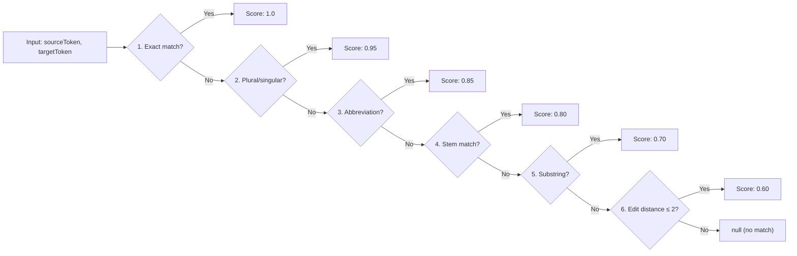
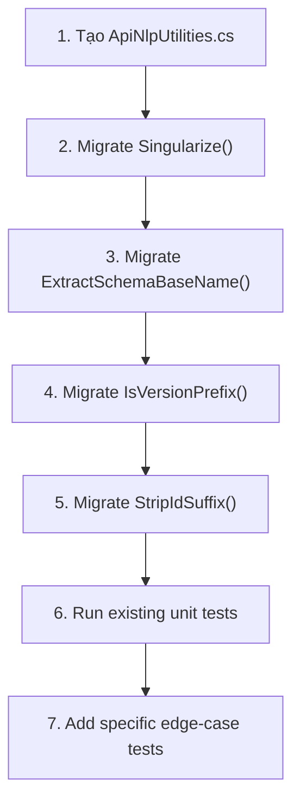
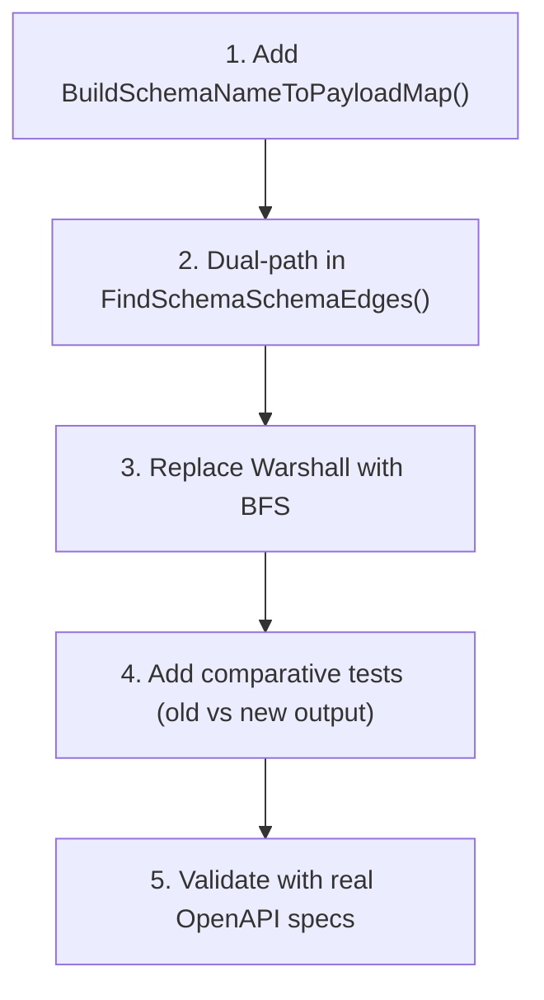
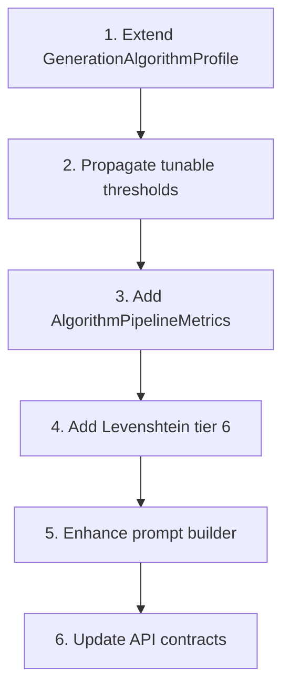

# Best-Practice Solutions — Tightening Algorithm Integration

> **Phạm vi**: `ClassifiedAds.Modules.TestGeneration/Algorithms/` + consumers  
> **Dựa trên**: [ALGORITHM-ANALYSIS-REPORT.md](file:///d:/GSP26SE43.ModularMonolith/papers/ALGORITHM-ANALYSIS-REPORT.md)  
> **Ngày phân tích**: 2026-04-11  
> **GitNexus index**: up-to-date (verified via `npx gitnexus analyze`)

---

## Mục Lục

1. [Tổng Quan Vấn Đề](#1-tổng-quan-vấn-đề)
2. [Solution 1: Tách NLP Utilities Thành Shared Class](#2-solution-1-tách-nlp-utilities-thành-shared-class)
3. [Solution 2: Migrate Legacy Bidirectional Graph → Unidirectional](#3-solution-2-migrate-legacy-bidirectional-graph--unidirectional)
4. [Solution 3: Thay Warshall O(V³) Bằng BFS-Based Transitive Closure](#4-solution-3-thay-warshall-ov³-bằng-bfs-based-transitive-closure)
5. [Solution 4: Nâng Cấp GenerationAlgorithmProfile — Granular Controls](#5-solution-4-nâng-cấp-generationalgorithmprofile--granular-controls)
6. [Solution 5: Thêm Levenshtein Edit Distance Vào SemanticTokenMatcher](#6-solution-5-thêm-levenshtein-edit-distance-vào-semantictokenmatcher)
7. [Solution 6: Observability & Metrics Cho Algorithm Pipeline](#7-solution-6-observability--metrics-cho-algorithm-pipeline)
8. [Solution 7: Nâng Cấp ObservationConfirmationPromptBuilder](#8-solution-7-nâng-cấp-observationconfirmationpromptbuilder)
9. [Ma Trận Ưu Tiên](#9-ma-trận-ưu-tiên)
10. [Migration Strategy](#10-migration-strategy)

---

## 1. Tổng Quan Vấn Đề

### Các vấn đề từ báo cáo phân tích gốc

Báo cáo [ALGORITHM-ANALYSIS-REPORT.md](file:///d:/GSP26SE43.ModularMonolith/papers/ALGORITHM-ANALYSIS-REPORT.md) đã xác nhận 4 thuật toán cốt lõi đều implement đúng theo paper. Tuy nhiên, quá trình deep-dive vào source code qua GitNexus đã phát hiện các khu vực có thể cải thiện đáng kể:

| # | Vấn đề | Nguồn phát hiện | Severity |
|---|--------|-----------------|----------|
| 1 | **3 bản sao trùng lặp** `Singularize()` với logic khác nhau | Source code analysis | 🟠 Medium |
| 2 | **2 bản sao trùng lặp** `ExtractSchemaBaseName()` khác coverage | Source code analysis | 🟠 Medium |
| 3 | **3 bản sao trùng lặp** `IsVersionPrefix()` khác implementation | Source code analysis | 🟡 Low |
| 4 | **2 bản sao trùng lặp** `StripIdSuffix()` | Source code analysis | 🟡 Low |
| 5 | **Legacy bidirectional graph** đang được dùng trong production | Report §9.1 | 🔴 High |
| 6 | Warshall O(V³) không cần thiết cho sparse graphs | Report §9.4 | 🟡 Low |
| 7 | Thiếu **granular tuning** cho confidence thresholds | Source analysis | 🟠 Medium |
| 8 | SemanticTokenMatcher thiếu **edit-distance** matching | SPDG paper §3.2 | 🟠 Medium |
| 9 | Không có **metrics/observability** cho algorithm decisions | Architecture review | 🟠 Medium |
| 10 | Prompt builder chưa có **few-shot examples** | COmbine paper §3 | 🟡 Low |

> [!NOTE]
> Báo cáo gốc ghi "Không có unit tests visible" (§9.5) — **đây là thông tin không chính xác**. Thực tế có 7 test files liên quan trực tiếp nằm trong `ClassifiedAds.UnitTests/TestGeneration/`:
> - `DependencyAwareTopologicalSorterTests.cs`
> - `SchemaRelationshipAnalyzerTests.cs`
> - `SemanticTokenMatcherTests.cs`
> - `ObservationConfirmationPromptBuilderTests.cs`
> - `EndpointPromptContextMapperTests.cs`
> - `LlmScenarioSuggesterTests.cs`
> - `ApiTestOrderServiceTests.cs`

---

## 2. Solution 1: Tách NLP Utilities Thành Shared Class

### Vấn đề chi tiết

Có **4 nhóm utility logic** bị duplicate qua 3 files, mỗi bản có behavior khác nhau:

#### 2.1 `Singularize()` — 3 bản sao

| File | Irregular Plurals | Rules | Missing Cases |
|------|:------------------:|:-----:|:-------------:|
| [SemanticTokenMatcher.cs:324](file:///d:/GSP26SE43.ModularMonolith/ClassifiedAds.Modules.TestGeneration/Algorithms/SemanticTokenMatcher.cs#L324-L366) | 13 ✅ | 4 ✅ | — |
| [ApiTestOrderAlgorithm.cs:469](file:///d:/GSP26SE43.ModularMonolith/ClassifiedAds.Modules.TestGeneration/Services/ApiTestOrderAlgorithm.cs#L469-L502) | 0 ❌ | 3 ⚠️ | Missing `-zes` rule, missing `-is` guard, no irregular plurals |
| [GeneratedTestCaseDependencyEnricher.cs:582](file:///d:/GSP26SE43.ModularMonolith/ClassifiedAds.Modules.TestGeneration/Services/GeneratedTestCaseDependencyEnricher.cs#L582-L602) | 0 ❌ | 2 ⚠️ | Simplest version, no `-ses/-zes/-xes/-ches/-shes` handling |

**Hậu quả thực tế**: Cùng một input `"addresses"` sẽ cho kết quả khác nhau:
- `SemanticTokenMatcher`: `"address"` (qua IrregularPlurals lookup ✅)
- `ApiTestOrderAlgorithm`: `"addresse"` (qua `-ses → remove -es` ✅, nhưng vẫn đúng)
- `GeneratedTestCaseDependencyEnricher`: `"addresse"` (chỉ strip `-s` ⚠️ — **SAI**)

#### 2.2 `ExtractSchemaBaseName()` — 2 bản sao

| File | Suffixes | Prefixes | Pre-sorted |
|------|:--------:|:--------:|:----------:|
| [SchemaRelationshipAnalyzer.cs:447](file:///d:/GSP26SE43.ModularMonolith/ClassifiedAds.Modules.TestGeneration/Algorithms/SchemaRelationshipAnalyzer.cs#L447-L478) | 16 ✅ | 10 ✅ | ✅ Cached |
| [ApiTestOrderAlgorithm.cs:508](file:///d:/GSP26SE43.ModularMonolith/ClassifiedAds.Modules.TestGeneration/Services/ApiTestOrderAlgorithm.cs#L508-L540) | 9 ⚠️ | 7 ⚠️ | ❌ Inline sorted mỗi lần gọi |

**Hậu quả thực tế**: Input `"UserListResponse"` sẽ cho kết quả khác:
- `SchemaRelationshipAnalyzer`: strip `"ListResponse"` (compound suffix) → `"User"` ✅
- `ApiTestOrderAlgorithm`: strip `"Response"` chỉ → `"UserList"` ⚠️

#### 2.3 `IsVersionPrefix()` — 3 bản sao

| File | Implementation |
|------|---------------|
| [ObservationConfirmationPromptBuilder.cs:412](file:///d:/GSP26SE43.ModularMonolith/ClassifiedAds.Modules.TestGeneration/Algorithms/ObservationConfirmationPromptBuilder.cs#L412-L418) | `segment.Length >= 2 && segment.Length <= 3 && segment.StartsWith('v') && char.IsDigit(segment[1])` |
| [ApiTestOrderAlgorithm.cs:458](file:///d:/GSP26SE43.ModularMonolith/ClassifiedAds.Modules.TestGeneration/Services/ApiTestOrderAlgorithm.cs#L458-L464) | `segment.Length <= 3 && segment.StartsWith('v') && segment.Length > 1 && char.IsDigit(segment[1])` |
| [GeneratedTestCaseDependencyEnricher.cs:609](file:///d:/GSP26SE43.ModularMonolith/ClassifiedAds.Modules.TestGeneration/Services/GeneratedTestCaseDependencyEnricher.cs#L609-L615) | `value.Length <= 3 && value.StartsWith("v", OrdinalIgnoreCase) && value.Skip(1).All(char.IsDigit)` |

Thứ 3 dùng `Skip(1).All(char.IsDigit)` — allocates iterator, kém performance hơn.

#### 2.4 `StripIdSuffix()` — 2 bản sao

| File | Implementation |
|------|---------------|
| [ApiTestOrderAlgorithm.cs:435](file:///d:/GSP26SE43.ModularMonolith/ClassifiedAds.Modules.TestGeneration/Services/ApiTestOrderAlgorithm.cs#L435-L453) | Strips `Ids` then `Id` |
| [GeneratedTestCaseDependencyEnricher.cs:562](file:///d:/GSP26SE43.ModularMonolith/ClassifiedAds.Modules.TestGeneration/Services/GeneratedTestCaseDependencyEnricher.cs#L562-L580) | Identical logic |

### Đề xuất: Tạo `ApiNlpUtilities` shared class

```csharp
// Algorithms/Utilities/ApiNlpUtilities.cs
namespace ClassifiedAds.Modules.TestGeneration.Algorithms.Utilities;

/// <summary>
/// Shared NLP utilities for API token processing.
/// Single source of truth: eliminates 4 groups of duplicated logic.
/// </summary>
public static class ApiNlpUtilities
{
    // === Singularize (from SemanticTokenMatcher — most complete) ===
    
    private static readonly Dictionary<string, string> IrregularPlurals = new(StringComparer.OrdinalIgnoreCase)
    {
        ["people"] = "person", ["children"] = "child", ["men"] = "man",
        ["women"] = "woman", ["mice"] = "mouse", ["data"] = "datum",
        ["criteria"] = "criterion", ["analyses"] = "analysis",
        ["indices"] = "index", ["matrices"] = "matrix",
        ["vertices"] = "vertex", ["statuses"] = "status",
        ["addresses"] = "address",
    };

    public static string Singularize(string word) { /* consolidate from SemanticTokenMatcher */ }

    // === ExtractSchemaBaseName (from SchemaRelationshipAnalyzer — most complete) ===
    
    private static readonly string[] SchemaNameSuffixes = { /* 16 entries */ };
    private static readonly string[] SchemaNamePrefixes = { /* 10 entries */ };
    // Pre-sorted, cached
    private static readonly string[] SortedSuffixesByLengthDesc = /* ... */;
    private static readonly string[] SortedPrefixesByLengthDesc = /* ... */;
    
    public static string ExtractSchemaBaseName(string schemaName) { /* consolidate */ }

    // === IsVersionPrefix (unified) ===
    
    public static bool IsVersionPrefix(string segment)
    {
        return !string.IsNullOrWhiteSpace(segment)
            && segment.Length >= 2 && segment.Length <= 3 
            && (segment[0] == 'v' || segment[0] == 'V')
            && char.IsDigit(segment[1]);
    }

    // === StripIdSuffix (unified) ===
    
    public static string StripIdSuffix(string name) { /* consolidate */ }
}
```

### Files cần sửa

| File | Action |
|------|--------|
| `Algorithms/Utilities/ApiNlpUtilities.cs` | **[NEW]** — Tạo shared class |
| `Algorithms/SemanticTokenMatcher.cs` | Delegate `Singularize()` to `ApiNlpUtilities` |
| `Algorithms/SchemaRelationshipAnalyzer.cs` | Delegate `ExtractSchemaBaseName()` to `ApiNlpUtilities` |
| `Algorithms/ObservationConfirmationPromptBuilder.cs` | Replace `IsVersionPrefix` với `ApiNlpUtilities` |
| `Services/ApiTestOrderAlgorithm.cs` | Remove private duplicates, dùng `ApiNlpUtilities` |
| `Services/GeneratedTestCaseDependencyEnricher.cs` | Remove private duplicates, dùng `ApiNlpUtilities` |

### Risk Assessment

| Risk | Level | Mitigation |
|------|:-----:|------------|
| Behavior change cho `ApiTestOrderAlgorithm.Singularize()` | 🟡 Low | Behavior sẽ **cải thiện** (thêm irregular plurals), không breakable |
| Behavior change cho `GeneratedTestCaseDependencyEnricher.Singularize()` | 🟡 Low | Tương tự — cải thiện coverage |
| Behavior change cho `ExtractSchemaBaseName()` | 🟡 Low | More suffixes = better base name extraction |

---

## 3. Solution 2: Migrate Legacy Bidirectional Graph → Unidirectional

### Vấn đề

[ApiTestOrderAlgorithm.FindSchemaSchemaEdges():183](file:///d:/GSP26SE43.ModularMonolith/ClassifiedAds.Modules.TestGeneration/Services/ApiTestOrderAlgorithm.cs#L183) gọi `BuildSchemaReferenceGraphLegacy()` — **bidirectional co-occurrence graph**.

Phương thức preferred `BuildSchemaReferenceGraph()` (unidirectional, chính xác hơn) tồn tại nhưng **chưa được sử dụng** ở orchestrator chính.

### False dependency example

```
Payload chứa refs: {CreateOrderRequest → OrderItem, Product}

Legacy (bidirectional co-occurrence):
  OrderItem ↔ Product  (cả hai cùng xuất hiện trong 1 payload)
  → Transitive: Bất kỳ consumer nào dùng OrderItem
    sẽ "phụ thuộc" cả operation sinh Product VÀ ngược lại

Preferred (unidirectional $ref):
  CreateOrderRequest → OrderItem
  CreateOrderRequest → Product
  → KHÔNG có edge OrderItem → Product (chính xác!)
```

### Đề xuất: Dual-path migration

```csharp
// ApiTestOrderAlgorithm.cs — FindSchemaSchemaEdges()
private IReadOnlyCollection<DependencyEdge> FindSchemaSchemaEdges(
    IReadOnlyList<ApiEndpointMetadataDto> endpoints)
{
    var edges = new List<DependencyEdge>();
    
    // ... collect paramSchemaRefs, respSchemaRefs ...

    // NEW: Try preferred unidirectional graph first
    var schemaNameToPayload = BuildSchemaNameToPayloadMap(endpoints);
    
    IReadOnlyDictionary<string, HashSet<string>> directGraph;
    
    if (schemaNameToPayload.Count > 0)
    {
        // Preferred: Unidirectional $ref-based graph (KAT §4.2)
        directGraph = _schemaAnalyzer.BuildSchemaReferenceGraph(schemaNameToPayload);
    }
    else
    {
        // Fallback: Legacy co-occurrence graph (less accurate)
        directGraph = _schemaAnalyzer.BuildSchemaReferenceGraphLegacy(allSchemaPayloads);
    }
    
    // ... rest of pipeline unchanged ...
}

/// <summary>
/// Build schema-name-to-payload map from endpoint metadata.
/// Falls back to empty if schema names cannot be extracted.
/// </summary>
private static Dictionary<string, string> BuildSchemaNameToPayloadMap(
    IReadOnlyList<ApiEndpointMetadataDto> endpoints)
{
    var map = new Dictionary<string, string>(StringComparer.OrdinalIgnoreCase);
    
    foreach (var endpoint in endpoints)
    {
        // Map parameter schema refs to their payloads
        MapRefsToPayloads(endpoint.ParameterSchemaRefs, endpoint.ParameterSchemaPayloads, map);
        // Map response schema refs to their payloads  
        MapRefsToPayloads(endpoint.ResponseSchemaRefs, endpoint.ResponseSchemaPayloads, map);
    }
    
    return map;
}
```

### Data requirement

Điều kiện sử dụng `BuildSchemaReferenceGraph()` là cần **mapping `schemaName → payload`**. Cần kiểm tra `ApiEndpointMetadataDto` có đủ data không:

- `ParameterSchemaRefs` (tên schema) + `ParameterSchemaPayloads` (nội dung JSON) → cần cùng index
- Nếu data không match → fallback về legacy

### Files cần sửa

| File | Action |
|------|--------|
| `Services/ApiTestOrderAlgorithm.cs` | Thêm `BuildSchemaNameToPayloadMap()`, sửa `FindSchemaSchemaEdges()` |
| `Contracts/ApiDocumentation/DTOs/ApiEndpointMetadataDto.cs` | **Kiểm tra** xem có mapping ref→payload không |

### Risk Assessment

| Risk | Level | Mitigation |
|------|:-----:|------------|
| Thay đổi dependency detection behavior | 🟠 Medium | Dual-path: preferred + fallback |
| Mất edges từ bidirectional | 🟡 Low | False edges bị loại = cải thiện accuracy |
| Legacy path vẫn cần maintain | 🟡 Low | Chỉ remove khi 100% data đủ cho preferred path |

---

## 4. Solution 3: Thay Warshall O(V³) Bằng BFS-Based Transitive Closure

### Vấn đề

[ComputeTransitiveClosure()](file:///d:/GSP26SE43.ModularMonolith/ClassifiedAds.Modules.TestGeneration/Algorithms/SchemaRelationshipAnalyzer.cs#L195-L237) dùng Warshall's algorithm — O(V³) cả time và space. Với OpenAPI specs lớn (>200 schemas), điều này trở nên không cần thiết.

### Phân tích

| Approach | Time Complexity | Best For |
|----------|:--------------:|----------|
| Warshall | O(V³) | Dense graphs, full closure cần thiết |
| BFS per-node | O(V × (V+E)) | Sparse graphs, partial queries |
| DFS per-node | O(V × (V+E)) | Same, but recursive stack |

OpenAPI schema graphs thường **sparse** (average degree ~2-3), nên BFS/DFS hiệu quả hơn nhiều.

### Đề xuất: BFS-based transitive closure

```csharp
/// <summary>
/// Compute transitive closure using BFS per node (O(V × (V+E))).
/// More efficient than Warshall for sparse OpenAPI schema graphs.
/// </summary>
public IReadOnlyDictionary<string, HashSet<string>> ComputeTransitiveClosure(
    IReadOnlyDictionary<string, HashSet<string>> directReferences)
{
    if (directReferences == null || directReferences.Count == 0)
    {
        return new Dictionary<string, HashSet<string>>(StringComparer.OrdinalIgnoreCase);
    }

    var closure = new Dictionary<string, HashSet<string>>(StringComparer.OrdinalIgnoreCase);

    foreach (var startNode in directReferences.Keys)
    {
        var reachable = new HashSet<string>(StringComparer.OrdinalIgnoreCase);
        var queue = new Queue<string>();

        // Seed BFS with direct neighbors
        if (directReferences.TryGetValue(startNode, out var directNeighbors))
        {
            foreach (var neighbor in directNeighbors)
            {
                if (!string.Equals(startNode, neighbor, StringComparison.OrdinalIgnoreCase))
                {
                    queue.Enqueue(neighbor);
                    reachable.Add(neighbor);
                }
            }
        }

        // BFS to find all transitive reachable nodes
        while (queue.Count > 0)
        {
            var current = queue.Dequeue();
            if (!directReferences.TryGetValue(current, out var neighbors))
            {
                continue;
            }

            foreach (var neighbor in neighbors)
            {
                if (!string.Equals(startNode, neighbor, StringComparison.OrdinalIgnoreCase)
                    && reachable.Add(neighbor))
                {
                    queue.Enqueue(neighbor);
                }
            }
        }

        closure[startNode] = reachable;
    }

    return closure;
}
```

### Benchmark estimation

| Schema count (V) | Warshall | BFS (sparse, avg degree=3) |
|:-----------------:|:--------:|:--------------------------:|
| 50 | 125K iterations | ~7.5K |
| 200 | 8M iterations | ~120K |
| 500 | 125M iterations | ~750K |
| 1000 | 1B iterations | ~3M |

### Risk Assessment

| Risk | Level | Mitigation |
|------|:-----:|------------|
| Different closure results | ⚪ None | Mathematically equivalent — same output |
| Edge case: cyclic schemas | 🟡 Low | BFS `reachable.Add()` handles dedup |

---

## 5. Solution 4: Nâng Cấp GenerationAlgorithmProfile — Granular Controls

### Vấn đề hiện tại

[GenerationAlgorithmProfile](file:///d:/GSP26SE43.ModularMonolith/ClassifiedAds.Modules.TestGeneration/Models/GenerationAlgorithmProfile.cs) chỉ có **boolean on/off flags**:

```csharp
public class GenerationAlgorithmProfile
{
    public bool UseObservationConfirmationPrompting { get; set; } = true;
    public bool UseDependencyAwareOrdering { get; set; } = true;
    public bool UseSchemaRelationshipAnalysis { get; set; } = true;
    public bool UseSemanticTokenMatching { get; set; } = true;
    public bool UseFeedbackLoopContext { get; set; } = true;
}
```

Không thể tune **confidence thresholds** hoặc **match scores** từ API level.

### Đề xuất: Thêm tunable parameters

```csharp
public class GenerationAlgorithmProfile
{
    // === Existing flags (backward compatible) ===
    public bool UseObservationConfirmationPrompting { get; set; } = true;
    public bool UseDependencyAwareOrdering { get; set; } = true;
    public bool UseSchemaRelationshipAnalysis { get; set; } = true;
    public bool UseSemanticTokenMatching { get; set; } = true;
    public bool UseFeedbackLoopContext { get; set; } = true;

    // === NEW: Tunable thresholds ===
    
    /// <summary>
    /// Minimum confidence for dependency edges to enforce ordering.
    /// Default: 0.5 (edges below this are recorded but don't enforce order).
    /// Range: [0.0, 1.0]
    /// </summary>
    public double MinEdgeConfidence { get; set; } = 0.5;

    /// <summary>
    /// Minimum SemanticTokenMatcher score to create dependency edges.
    /// Default: 0.80. Lower = more edges (more false positives).
    /// Range: [0.0, 1.0]
    /// </summary>
    public double MinSemanticMatchScore { get; set; } = 0.80;

    /// <summary>
    /// Confidence assigned to fuzzy schema name matches.
    /// Default: 0.65. Higher = fuzzy edges more likely to enforce ordering.
    /// </summary>
    public double FuzzySchemaMatchConfidence { get; set; } = 0.65;

    /// <summary>
    /// Confidence assigned to transitive schema dependency edges.
    /// Default: 0.85.
    /// </summary>
    public double TransitiveSchemaEdgeConfidence { get; set; } = 0.85;

    /// <summary>
    /// Maximum number of schemas before falling back to simplified analysis.
    /// Default: 500. Prevents O(V³) Warshall on very large specs.
    /// </summary>
    public int MaxSchemasForTransitiveClosure { get; set; } = 500;
}
```

### Lợi ích

1. **Frontend có thể expose sliders** cho user fine-tune algorithm behavior
2. **A/B testing** khác nhau giữa các profiles
3. **Per-suite customization** — suite phức tạp có thể dùng lower thresholds
4. **Backward compatible** — defaults giữ nguyên behavior hiện tại

### Propagation points

Các nơi cần đọc từ profile thay vì hardcoded constants:

| File | Constant hiện tại | Profile field |
|------|-------------------|---------------|
| `DependencyAwareTopologicalSorter.cs:45` | `MinEdgeConfidence = 0.5` | `profile.MinEdgeConfidence` |
| `ApiTestOrderAlgorithm.cs:33` | `MinSemanticMatchScore = 0.80` | `profile.MinSemanticMatchScore` |
| `SchemaRelationshipAnalyzer.cs:306` | `Confidence = 0.85` (hardcoded) | `profile.TransitiveSchemaEdgeConfidence` |
| `SchemaRelationshipAnalyzer.cs:408` | `Confidence = 0.65` (hardcoded) | `profile.FuzzySchemaMatchConfidence` |

### Risk Assessment

| Risk | Level | Mitigation |
|------|:-----:|------------|
| Breaking change for API consumers | ⚪ None | New properties with defaults = fully backward compatible |
| Invalid threshold values | 🟡 Low | Add validation: `Math.Clamp(value, 0.0, 1.0)` |

---

## 6. Solution 5: Thêm Levenshtein Edit Distance Vào SemanticTokenMatcher

### Vấn đề

SPDG paper (arXiv:2411.07098 §3.2) đề cập **edit-distance matching** cho typo resilience, nhưng hiện tại pipeline chỉ có 5 tiers. Token pairs như:

- `"catagory"` vs `"category"` → **no match** (typo in API spec!)
- `"prodct"` vs `"product"` → **no match**
- `"usr"` sẽ match qua abbreviation dict, nhưng `"usesr"` sẽ không

### Đề xuất: Thêm Tier 6 — Normalized Edit Distance



```csharp
// Tier 6: Normalized Levenshtein edit distance
if (normalizedSource.Length >= 4 && normalizedTarget.Length >= 4)
{
    var distance = ComputeLevenshteinDistance(normalizedSource, normalizedTarget);
    var maxLen = Math.Max(normalizedSource.Length, normalizedTarget.Length);
    var normalizedDistance = (double)distance / maxLen;
    
    // ≤ 2 edits AND normalized distance < 30% → likely typo
    if (distance <= 2 && normalizedDistance < 0.30)
    {
        return new TokenMatchResult
        {
            SourceToken = sourceToken,
            MatchedToken = targetToken,
            Score = 0.60,
            MatchType = TokenMatchType.EditDistance,
        };
    }
}
```

### Implementation: Optimized Levenshtein

```csharp
/// <summary>
/// Compute Levenshtein distance with early termination.
/// Uses single-row optimization: O(min(m,n)) space instead of O(m×n).
/// </summary>
private static int ComputeLevenshteinDistance(string source, string target, int maxDistance = 2)
{
    var sourceLen = source.Length;
    var targetLen = target.Length;
    
    // Early termination: if length difference > maxDistance, impossible
    if (Math.Abs(sourceLen - targetLen) > maxDistance)
    {
        return maxDistance + 1;
    }

    // Ensure source is shorter (for memory optimization)
    if (sourceLen > targetLen)
    {
        (source, target) = (target, source);
        (sourceLen, targetLen) = (targetLen, sourceLen);
    }

    var previousRow = new int[sourceLen + 1];
    for (int i = 0; i <= sourceLen; i++)
    {
        previousRow[i] = i;
    }

    for (int j = 1; j <= targetLen; j++)
    {
        var currentRow = new int[sourceLen + 1];
        currentRow[0] = j;
        var minInRow = j;
        
        for (int i = 1; i <= sourceLen; i++)
        {
            var cost = char.ToLowerInvariant(source[i - 1]) == char.ToLowerInvariant(target[j - 1]) ? 0 : 1;
            currentRow[i] = Math.Min(
                Math.Min(currentRow[i - 1] + 1, previousRow[i] + 1),
                previousRow[i - 1] + cost);
            minInRow = Math.Min(minInRow, currentRow[i]);
        }
        
        // Early termination: no cell in row can produce result ≤ maxDistance
        if (minInRow > maxDistance) return maxDistance + 1;
        previousRow = currentRow;
    }

    return previousRow[sourceLen];
}
```

### Cần thêm enum value

```csharp
// Algorithms/Models/TokenMatchResult.cs
public enum TokenMatchType
{
    Exact,
    PluralSingular,
    Abbreviation,
    StemMatch,
    Substring,
    EditDistance,  // NEW
}
```

### Risk Assessment

| Risk | Level | Mitigation |
|------|:-----:|------------|
| False positives từ edit distance | 🟠 Medium | Guard: min 4 chars, max 2 edits, <30% normalized |
| Performance impact | 🟡 Low | Early termination + single-row = O(n) per comparison |
| Không thay đổi behavior hiện tại | ⚪ None | Additive tier — chỉ match khi 5 tiers trước fail |

---

## 7. Solution 6: Observability & Metrics Cho Algorithm Pipeline

### Vấn đề

Hiện tại không có cách nào biết:
- Mỗi thuật toán đóng góp bao nhiêu edges?
- Bao nhiêu % edges bị loại do confidence threshold?
- Có cycle nào bị break không?
- Algorithm pipeline mất bao lâu?

### Đề xuất: `AlgorithmPipelineMetrics` DTO

```csharp
// Algorithms/Models/AlgorithmPipelineMetrics.cs
public class AlgorithmPipelineMetrics
{
    // Edge statistics
    public int PreComputedEdges { get; set; }
    public int SchemaTransitiveEdges { get; set; }
    public int SchemaFuzzyEdges { get; set; }
    public int SemanticTokenEdges { get; set; }
    public int TotalEdges { get; set; }
    public int EdgesFilteredByConfidence { get; set; }
    
    // Graph statistics
    public int TotalOperations { get; set; }
    public int TotalSchemas { get; set; }
    public int TransitiveClosureSize { get; set; }
    
    // Sort statistics
    public int CyclesDetected { get; set; }
    public int CycleBreaks { get; set; }
    public List<string> CycleBreakDetails { get; set; } = new();
    
    // Performance
    public int SchemaAnalysisMs { get; set; }
    public int SemanticMatchingMs { get; set; }
    public int TopologicalSortMs { get; set; }
    public int TotalPipelineMs { get; set; }
    
    // Confidence distribution
    public Dictionary<string, int> EdgesByConfidenceRange { get; set; } = new()
    {
        ["1.0"] = 0,
        ["0.8-0.99"] = 0,
        ["0.65-0.79"] = 0,
        ["0.5-0.64"] = 0,
        ["< 0.5 (not enforced)"] = 0,
    };
}
```

### Integration point: `ApiTestOrderAlgorithm`

```csharp
public (IReadOnlyList<ApiOrderItemModel> Order, AlgorithmPipelineMetrics Metrics) 
    BuildProposalOrderWithMetrics(IReadOnlyCollection<ApiEndpointMetadataDto> endpoints)
{
    var metrics = new AlgorithmPipelineMetrics { TotalOperations = endpoints.Count };
    var sw = Stopwatch.StartNew();
    
    // ... existing pipeline with metrics collection at each step ...
    
    metrics.TotalPipelineMs = (int)sw.ElapsedMilliseconds;
    return (order, metrics);
}
```

### Lợi ích

1. **Debug support**: Log metrics cho mỗi order proposal → dễ dàng debug ordering issues
2. **Quality metrics**: Track % false edges bị loại → tune thresholds
3. **Performance monitoring**: Track pipeline latency → detect regression
4. **Frontend dashboard**: Show metrics cho QA team

---

## 8. Solution 7: Nâng Cấp ObservationConfirmationPromptBuilder

### 8.1 Few-shot examples

COmbine paper (arXiv:2504.17287 §3.2) khuyến nghị **few-shot examples** trong observation prompt để giảm hallucination.

```csharp
private static string BuildObservationPrompt(EndpointPromptContext context, string specBlock)
{
    var sb = new StringBuilder();
    
    // ... existing header ...
    
    // NEW: Few-shot example
    sb.AppendLine("## Example");
    sb.AppendLine();
    sb.AppendLine("Given this spec fragment:");
    sb.AppendLine("```");
    sb.AppendLine("- **email** (required: true, type: string, format: email)");
    sb.AppendLine("```");
    sb.AppendLine();
    sb.AppendLine("You should observe:");
    sb.AppendLine("```json");
    sb.AppendLine("[");
    sb.AppendLine("  {\"field\": \"request.body.email\", \"constraint\": \"must be present\", " +
                  "\"type\": \"presence_check\", \"evidence\": \"required: true\"},");
    sb.AppendLine("  {\"field\": \"request.body.email\", \"constraint\": \"must be valid email\", " +
                  "\"type\": \"format_check\", \"evidence\": \"format: email\"}");
    sb.AppendLine("]");
    sb.AppendLine("```");
    sb.AppendLine();
    
    // ... existing spec block ...
}
```

### 8.2 Negative constraint filtering

Thêm explicit negative examples trong confirmation prompt:

```csharp
// Phase 2: Confirmation prompt additions
sb.AppendLine("## Constraints to ALWAYS remove:");
sb.AppendLine("- Response time constraints (e.g., 'should respond within 500ms')");
sb.AppendLine("- Database-specific constraints (e.g., 'should be indexed')");
sb.AppendLine("- Implementation-specific constraints (e.g., 'should use caching')");
sb.AppendLine("- Inferred NOT NULL unless spec explicitly says 'required'");
```

### 8.3 Schema depth awareness

Hiện tại `TruncateSchema()` chỉ cắt theo character count. Đề xuất cắt theo **JSON depth** để giữ structure:

```csharp
/// <summary>
/// Truncate schema JSON while preserving top-level structure.
/// Instead of raw character cut, preserve complete top-level properties.
/// </summary>
private static string TruncateSchemaPreservingStructure(string schema, int maxLength)
{
    if (string.IsNullOrWhiteSpace(schema) || schema.Length <= maxLength)
    {
        return schema;
    }

    // Try to find the last complete property before maxLength
    var lastCompleteProperty = FindLastCompleteJsonProperty(schema, maxLength);
    if (lastCompleteProperty > 0)
    {
        return schema[..lastCompleteProperty] + "\n  // ... (truncated, " + 
               (schema.Length - lastCompleteProperty) + " chars remaining)";
    }

    return schema[..maxLength] + "... (truncated)";
}
```

---

## 9. Ma Trận Ưu Tiên

| # | Solution | Impact | Effort | Risk | Priority |
|---|----------|:------:|:------:|:----:|:--------:|
| 1 | [NLP Utilities consolidation](#2-solution-1-tách-nlp-utilities-thành-shared-class) | 🟢 High | 🟢 Low | 🟢 Low | **P0** — Immediate |
| 2 | [Legacy → Unidirectional graph](#3-solution-2-migrate-legacy-bidirectional-graph--unidirectional) | 🟢 High | 🟠 Medium | 🟠 Medium | **P1** — Next sprint |
| 4 | [Algorithm profile tuning](#5-solution-4-nâng-cấp-generationalgorithmprofile--granular-controls) | 🟠 Medium | 🟢 Low | 🟢 Low | **P1** — Next sprint |
| 6 | [Observability metrics](#7-solution-6-observability--metrics-cho-algorithm-pipeline) | 🟠 Medium | 🟠 Medium | 🟢 Low | **P1** — Next sprint |
| 3 | [BFS transitive closure](#4-solution-3-thay-warshall-ov³-bằng-bfs-based-transitive-closure) | 🟡 Low | 🟢 Low | 🟢 Low | **P2** — Backlog |
| 5 | [Edit distance matching](#6-solution-5-thêm-levenshtein-edit-distance-vào-semantictokenmatcher) | 🟡 Low | 🟠 Medium | 🟠 Medium | **P2** — Backlog |
| 7 | [Prompt builder enhancements](#8-solution-7-nâng-cấp-observationconfirmationpromptbuilder) | 🟡 Low | 🟡 Low | 🟢 Low | **P2** — Backlog |

> [!IMPORTANT]
> **Solution 1 (NLP dedup) và Solution 2 (legacy graph migration)** nên được implement trước vì chúng ảnh hưởng đến **correctness** — các bản sao `Singularize()` ĐANG cho kết quả khác nhau cho cùng input.

---

## 10. Migration Strategy

### Phase 1: Foundation (Solution 1) — 1-2 ngày



### Phase 2: Correctness (Solution 2 + 3) — 2-3 ngày



### Phase 3: Enhancement (Solution 4 + 5 + 6 + 7) — 3-4 ngày



### Backward compatibility guarantee

> [!TIP]
> Tất cả 7 solutions đều **backward compatible** — không có breaking change nào:
> - Solution 1: Internal refactor, public API unchanged
> - Solution 2: Dual-path with fallback
> - Solution 3: Same mathematical output
> - Solution 4: New properties with existing defaults
> - Solution 5: Additive tier 6
> - Solution 6: New optional DTO
> - Solution 7: Additive prompt content

---

> **Ghi chú**: Phân tích thực hiện với GitNexus index up-to-date (verified via `npx gitnexus analyze`). Source code verified trực tiếp qua 4 algorithm files + 3 consumer service files + unit tests directory.
