# Full A-Z Runtime Flow

Tài liệu này mô tả luồng end-to-end của hệ thống từ lúc tạo Project, import JSON, cấu hình environment, sinh test suite, tạo LLM suggestions, review suggestions, cho tới chạy test run và thu kết quả cuối cùng.

Mỗi bước bên dưới đều có thêm phần **Hàm / API được gọi** để bạn có thể đối chiếu trực tiếp với code.

---

## 1. Mục tiêu tổng quan

Luồng chính của hệ thống đi theo thứ tự:

**Project → Import JSON/OpenAPI → Environment → Specification → Endpoints → Test Suite Scope → Test Order → LLM Suggestions → Review → Test Cases → Test Run → Validation/Reporting**

Mỗi bước có thể tạo ra dữ liệu nền cho bước tiếp theo. Nếu một bước bị thiếu hoặc sai dữ liệu, flow phía sau sẽ bị ảnh hưởng trực tiếp.

---

## 2. Luồng A-Z

### A. Tạo Project

1. User tạo một **Project** mới.
2. Project là container gốc để gom:
   - API specification
   - environments
   - test suites
   - test cases
   - test runs
   - LLM suggestions
3. Project thường được gắn với owner/creator để kiểm soát quyền truy cập và thao tác sau này.

**Hàm / API được gọi:**
- Controller tạo project trong module Project.
- Dispatcher sẽ gọi command handler tương ứng kiểu `CreateProjectCommandHandler` hoặc command handler cùng chức năng tạo project.
- Handler sẽ persist `Project` vào DB qua repository.

**Ý nghĩa:**
- Project là điểm bắt đầu của toàn bộ test lifecycle.
- Các resource khác đều được scope theo project.

---

### B. Import file JSON / OpenAPI

1. User import file JSON, thường là OpenAPI/Swagger spec.
2. Backend parse file để tạo **Specification**.
3. Specification chứa metadata về API:
   - path
   - method
   - request schema
   - response schema
   - parameters
   - auth/security info
4. Sau khi specification được lưu, hệ thống bắt đầu tách ra các **Endpoints**.

**Hàm / API được gọi:**
- API import specification của module ApiDocumentation.
- Handler trong module documentation sẽ parse file và lưu `Specification`.
- Sau đó handler gọi bước tạo endpoints từ spec.

**Ý nghĩa:**
- Đây là nguồn contract chính để hệ thống hiểu API.
- Dữ liệu spec dùng cho generate test, validate schema, và enrich LLM context.

---

### C. Tạo Endpoints từ Specification

1. Backend đọc từng path + method trong spec.
2. Mỗi route được map thành một **Endpoint**.
3. Endpoint giữ các thông tin như:
   - HTTP method
   - route path
   - parameters
   - request/response schemas
   - tags/grouping
4. Endpoint là đơn vị cơ bản để tạo test cases và LLM scenarios.

**Hàm / API được gọi:**
- `SpecificationsController` lấy spec.
- `EndpointsController` lấy danh sách endpoint theo spec.
- Service/gateway đọc endpoint metadata để phục vụ test generation và validation.

**Ý nghĩa:**
- Mỗi endpoint có thể sinh nhiều test cases.
- Endpoint metadata cũng được dùng lúc validate response schema khi chạy test.

---

### D. Tạo Environment

1. User tạo **Environment** cho project.
2. Environment lưu các biến runtime như:
   - `baseUrl`
   - auth token
   - headers mặc định
   - custom variables
3. Environment có thể được dùng lại cho nhiều test run khác nhau.

**Ví dụ:**
- dev
- staging
- production-like

**Hàm / API được gọi:**
- Controller tạo/update environment.
- Repository lưu `ExecutionEnvironment`.
- Khi chạy test, environment được load qua `IRepository<ExecutionEnvironment, Guid>`.

**Ý nghĩa:**
- Environment quyết định URL thật mà test sẽ gọi.
- Variables trong environment được resolve trước khi gọi API.

---

### E. Resolve Environment runtime

Khi bắt đầu chạy test, backend sẽ:

1. Load environment được chọn.
2. Resolve runtime values.
3. Merge các biến từ environment với các biến đã extract từ các test case trước đó.
4. Chuẩn hóa base URL nếu suite có nhiều resource endpoint để tránh resolve sai đường dẫn.

**Hàm / API được gọi:**
- `TestExecutionOrchestrator.ExecuteAsync(...)`
- `_envResolver.ResolveAsync(environment, ct)`
- `NormalizeEnvironmentBaseUrlForMultiResourceSuite(...)`
- `TryNormalizeBaseUrlForMultiResourceSuite(...)`

**Ý nghĩa:**
- Đây là bước rất quan trọng để test case gọi đúng endpoint thật.
- Nếu resolve sai URL, request có thể đi nhầm sang Swagger UI, docs, hoặc route không đúng.

---

### F. Tạo Test Suite Scope

1. User chọn một spec và một tập endpoint để tạo **Test Suite Scope**.
2. Scope xác định endpoint nào thuộc về suite này.
3. Backend tạo liên kết giữa suite và các endpoint được chọn.
4. Hệ thống có thể cập nhật scope khi user thay đổi endpoint selection.

**Hàm / API được gọi:**
- `TestSuitesController` tạo scope.
- `AddUpdateTestSuiteScopeCommandHandler` xử lý tạo/cập nhật scope.
- Gateway/read model lấy danh sách endpoint đã scope.

**Ý nghĩa:**
- Test suite không chạy trên toàn bộ spec, mà chạy trên tập endpoint đã scope.
- Scope là nền tảng để sinh order và suggestions.

---

### G. Tạo Test Order Proposal

1. Sau khi có scope, hệ thống tạo **Test Order Proposal**.
2. Proposal quyết định thứ tự thực thi các endpoint/test case.
3. Order thường đảm bảo dependency logic, ví dụ:
   - login trước
   - create resource trước
   - get/update/delete sau

**Hàm / API được gọi:**
- `TestOrderController` tạo proposal.
- `ProposeApiTestOrderCommandHandler` sinh order proposal.
- Handler dùng dữ liệu scope/endpoints để sắp xếp thứ tự.

**Ý nghĩa:**
- Đây là bước giúp các test phụ thuộc nhau chạy đúng thứ tự.
- Nếu order sai, dependency chain có thể fail hoặc skip hàng loạt.

---

### H. Approve Test Order

1. User duyệt proposal.
2. Proposal sau khi approved trở thành order hợp lệ cho suite.
3. Chỉ sau khi order được approve thì luồng sinh LLM suggestion mới đủ điều kiện chạy.

**Hàm / API được gọi:**
- `TestOrderController` approve proposal.
- `ApproveApiTestOrderCommandHandler` xử lý duyệt proposal.
- `IApiTestOrderGateService.RequireApprovedOrderAsync(...)` được gọi ở bước sinh suggestion.

**Ý nghĩa:**
- Hệ thống dùng approved order làm gate để đảm bảo test data logic hợp lệ.
- Đây là điều kiện đầu vào bắt buộc cho suggestion generation.

---

### I. Generate LLM Suggestion Preview

1. User gọi API generate suggestion preview.
2. Controller map request thành `GenerateLlmSuggestionPreviewCommand`.
3. Dispatcher chuyển command đến `GenerateLlmSuggestionPreviewCommandHandler`.
4. Handler thực hiện các bước:
   - validate suite tồn tại
   - check owner
   - check suite không archived
   - require approved order
   - check monthly LLM limit
   - kiểm tra pending suggestions hiện có
   - build LLM context
   - gọi `ILlmScenarioSuggester`
5. LLM suggester tạo scenarios từ:
   - spec metadata
   - endpoint metadata
   - parameter details
   - algorithm profile
   - feedback context nếu có
6. Kết quả preview được persist thành các bản ghi `LlmSuggestion` với trạng thái `Pending`.

**Hàm / API được gọi:**
- `LlmSuggestionsController.GeneratePreview(...)`
- `_dispatcher.DispatchAsync(command)`
- `GenerateLlmSuggestionPreviewCommandHandler.HandleAsync(...)`
- `_gateService.RequireApprovedOrderAsync(...)`
- `_subscriptionLimitService.CheckLimitAsync(...)`
- `_endpointMetadataService.GetEndpointMetadataAsync(...)`
- `_endpointParameterDetailService.GetParameterDetailsAsync(...)`
- `_llmSuggester.SuggestScenariosAsync(...)`
- `_suggestionRepository.AddAsync(...)`
- `_suggestionRepository.UnitOfWork.SaveChangesAsync(...)`

**Ý nghĩa:**
- Đây là bước sinh đề xuất test case tự động trước khi review.
- Suggestions chưa phải là test cases thật.

---

### J. N8n / LLM Integration

1. `ILlmScenarioSuggester` có thể gọi webhook/n8n để generate boundary/negative scenarios.
2. Payload gồm:
   - suite context
   - endpoint list
   - schema/parameter details
   - optional feedback
3. Nếu n8n trả response hợp lệ, system dùng kết quả LLM.
4. Nếu n8n lỗi hoặc timeout, hệ thống có thể fallback sang local contract-based synthesis.

**Hàm / API được gọi:**
- `LlmScenarioSuggester.SuggestScenariosAsync(...)`
- `N8nIntegrationService.TriggerWebhookAsync(...)`
- fallback local synthesis trong `LlmScenarioSuggester`

**Ý nghĩa:**
- Đây là lớp sinh nội dung thông minh cho suggestions.
- Hệ thống vẫn có khả năng hoạt động khi LLM service lỗi.

---

### K. Persist LLM Suggestions

1. LLM scenarios được map thành entity `LlmSuggestion`.
2. Backend lưu vào DB với trạng thái `Pending`.
3. Nếu đã có suggestions cũ chưa materialize, hệ thống sẽ supersede chúng.
4. Result trả về cho client chứa:
   - total suggestions
   - endpoints covered
   - model info
   - token usage
   - suggestions array

**Hàm / API được gọi:**
- `LlmSuggestionMaterializer` hỗ trợ map/chuẩn hóa suggestion.
- `_suggestionRepository.UpdateAsync(...)` cho bản ghi cũ.
- `_suggestionRepository.AddAsync(...)` cho suggestion mới.
- `_suggestionRepository.UnitOfWork.SaveChangesAsync(...)`

**Ý nghĩa:**
- UI có thể hiển thị preview để user review trước khi materialize thành test case.

---

### L. Review Suggestions

1. User xem danh sách suggestions.
2. User có thể:
   - approve
   - reject
   - modify and approve
3. Mỗi hành động được dispatch qua `ReviewLlmSuggestionCommand`.
4. Review service cập nhật trạng thái suggestion.

**Hàm / API được gọi:**
- `LlmSuggestionsController.Review(...)`
- `_dispatcher.DispatchAsync(new ReviewLlmSuggestionCommand { ... })`
- `ReviewLlmSuggestionCommandHandler.HandleAsync(...)`
- `LlmSuggestionReviewService` xử lý business logic review

**Ý nghĩa:**
- Đây là bước kiểm duyệt human-in-the-loop.
- Chỉ suggestion đã review mới có thể trở thành test case thật.

---

### M. Materialize Suggestions thành Test Cases

1. Khi suggestion được approve, hệ thống materialize nó thành **Test Case**.
2. Materializer chuyển data từ suggestion sang cấu trúc test case chuẩn:
   - request
   - expectation
   - variables
   - tags
   - priority
3. Test case mới được gắn vào suite.

**Hàm / API được gọi:**
- `LlmSuggestionMaterializer` chuyển suggestion sang test case model/entity.
- Review flow sẽ gọi service để tạo/mapping test case thật.

**Ý nghĩa:**
- Suggestions chỉ là draft.
- Test case là artifact thật để chạy test execution.

---

### N. Chuẩn bị Test Run

1. User tạo **Test Run** cho suite.
2. User chọn:
   - environment
   - selected test cases
   - strict validation nếu cần
3. Backend tạo run record với status `Running`.
4. Số lượng test cases được chốt tại thời điểm bắt đầu run.

**Hàm / API được gọi:**
- `StartTestRunCommandHandler.HandleAsync(...)`
- repository tạo `TestRun`
- `TestExecutionOrchestrator.ExecuteAsync(...)` là entrypoint chạy test run

**Ý nghĩa:**
- Test run là một snapshot thực thi tại thời điểm chạy.
- Run kết quả chỉ phản ánh dữ liệu đầu vào lúc đó.

---

### O. Load Execution Context

Khi test run bắt đầu, backend load:

1. Run record
2. Suite context
3. Selected test cases
4. Environment runtime
5. Endpoint metadata theo spec
6. Subscription limit / retention rules

**Hàm / API được gọi:**
- `TestExecutionOrchestrator.ExecuteAsync(...)`
- `_runRepository.FirstOrDefaultAsync(...)`
- `_gatewayService.GetExecutionContextAsync(...)`
- `_envRepository.FirstOrDefaultAsync(...)`
- `_envResolver.ResolveAsync(...)`
- `_endpointMetadataService.GetEndpointMetadataAsync(...)`
- `_limitService.CheckLimitAsync(...)`

**Ý nghĩa:**
- Đây là bộ dữ liệu nền để orchestrator có thể thực thi tuần tự.

---

### P. Pre-execution Validation

Trước khi gọi HTTP thật, hệ thống sẽ kiểm tra:

- request body có hợp lệ không
- URL/headers/params có resolve được không
- variable có missing không
- body có thể auto-hydrate không
- endpoint metadata có phù hợp không

Nếu có lỗi trước khi gọi API:
- test case sẽ fail sớm
- không gửi request thật

**Hàm / API được gọi:**
- `_preValidator.Validate(testCase, resolvedEnv, variableBag, endpointMetadata)`
- `RequestBodyAutoHydrator.TryHydrate(testCase, endpointMetadata)`
- `ResolvedTestCaseRequest` được tạo sau khi resolve biến

**Ý nghĩa:**
- Giúp bắt lỗi sớm và tránh gọi request sai.

---

### Q. Variable Resolution

1. Hệ thống thay thế placeholder trong request:
   - path params
   - query params
   - headers
   - body
2. Variables có thể đến từ:
   - environment
   - extracted data từ test case trước
   - token aliases
3. Hệ thống cố gắng giữ đúng identifier/resource relationship giữa các testcase liên tiếp.

**Hàm / API được gọi:**
- `_variableResolver.Resolve(testCase, variableBag, resolvedEnv)`
- `NormalizeSwaggerDocsApiUrl(...)`
- `BuildFinalUrl(...)`
- `ApplyTokenAliases(...)`
- `NormalizeHappyPathCredentials(...)`

**Ý nghĩa:**
- Đây là bước đảm bảo request mang dữ liệu thật.
- Nếu resolve sai biến, downstream test sẽ fail hoặc skip.

---

### R. Execute HTTP Request

1. `HttpTestExecutor` gửi request thật đến server.
2. Request dùng:
   - method
   - resolved URL
   - headers
   - body
   - timeout
3. Response được đọc đầy đủ:
   - status code
   - headers
   - body
   - latency

**Hàm / API được gọi:**
- `HttpTestExecutor.ExecuteAsync(...)`
- `client.SendAsync(httpRequest, ct)`
- `response.Content.ReadAsStringAsync(ct)`

**Ý nghĩa:**
- Đây là bước gọi API thật trên hệ thống mục tiêu.
- Nếu API trả HTML thay vì JSON, validation schema có thể fail.

---

### S. Response Validation

Sau khi nhận response, hệ thống validate theo expectation:

- status code
- response schema
- headers
- body contains / not contains
- JSONPath assertions
- response time

Kết quả validation quyết định testcase:
- `Passed`
- `Failed`
- `Skipped`

**Hàm / API được gọi:**
- `_validator.Validate(response, testCase, endpointMetadata, strictValidation)`
- `ValidateStatusCode(...)`
- `ValidateResponseSchema(...)`
- `ValidateHeaders(...)`
- `ValidateBodyContains(...)`
- `ValidateBodyNotContains(...)`
- `ValidateJsonPathChecks(...)`
- `ValidateResponseTime(...)`

**Ý nghĩa:**
- Đây là phần xác nhận API có đúng contract hay không.

---

### T. Dependency Handling

1. Test case có thể phụ thuộc vào test case trước.
2. Nếu dependency fail hoặc skipped, testcase hiện tại có thể bị skip.
3. Hệ thống log rõ:
   - dependency IDs
   - failed dependencies
   - failure reason

**Hàm / API được gọi:**
- `TestExecutionOrchestrator.ExecuteTestCase(...)`
- dependency check nội bộ trong `ExecuteTestCase`
- `IsDependencySatisfied(...)`
- `IsDependencyFailureOnlyExpectationMismatch(...)`

**Ý nghĩa:**
- Giữ đúng thứ tự logic của data flow.
- Tránh false failure dây chuyền.

---

### U. Extract Variables từ Response

1. Nếu response thành công, hệ thống có thể extract data từ body/headers.
2. Data extracted có thể là:
   - id
   - token
   - accessToken
   - resourceId
3. Các biến này được lưu vào variable bag cho testcase kế tiếp.

**Hàm / API được gọi:**
- `_variableExtractor.Extract(response, rules, resolvedRequest.Body)`
- `ExtractImplicitVariables(...)`
- `ExtractResponseBodyVariables(...)`
- `PromoteAuthTokenAliases(...)`

**Ý nghĩa:**
- Bước này nối output của testcase trước sang input của testcase sau.
- Rất quan trọng cho create → get → update → delete chain.

---

### V. Collect Test Results

1. Mỗi testcase tạo ra một execution result.
2. Result chứa:
   - status
   - response data
   - validation failures
   - warnings
   - extracted variables
3. Sau khi chạy xong tất cả testcase, result collector gom toàn bộ data thành report.

**Hàm / API được gọi:**
- `LogCaseOutcome(...)`
- `_resultCollector.CollectAsync(...)`
- `TestCaseExecutionResult` được build trong `ExecuteTestCase(...)`

**Ý nghĩa:**
- Đây là nguồn dữ liệu cho UI report, history, export, và troubleshooting.

---

### W. Persist Report / Retention

1. Kết quả run được lưu lại.
2. Hệ thống áp dụng retention policy theo subscription.
3. Các bản ghi cũ có thể bị dọn theo retention days.

**Hàm / API được gọi:**
- `_limitService.CheckLimitAsync(currentUserId, LimitType.RetentionDays, 0, ct)`
- `ITestResultCollector.CollectAsync(...)` persist kết quả/report

**Ý nghĩa:**
- Giữ lịch sử test runs theo gói dịch vụ.

---

### X. View Results / Failures / Explanations

1. User xem report run.
2. Có thể drill-down vào từng testcase.
3. Nếu cần, user có thể xem failure explanation.
4. Report có thể export/download nếu hệ thống hỗ trợ.

**Hàm / API được gọi:**
- controller/query của module reporting/test execution
- query handler đọc test run/result từ DB

**Ý nghĩa:**
- Đây là điểm kết thúc của flow từ tạo project đến execution/report.

---

## 3. Sơ đồ tóm tắt luồng

```mermaid
flowchart LR
    A[Create Project] --> B[Import JSON / OpenAPI]
    B --> C[Create Specification]
    C --> D[Generate Endpoints]
    D --> E[Create Environment]
    E --> F[Resolve Runtime Environment]
    F --> G[Create Test Suite Scope]
    G --> H[Create / Approve Test Order]
    H --> I[Generate LLM Suggestion Preview]
    I --> J[Review Suggestions]
    J --> K[Materialize Test Cases]
    K --> L[Create Test Run]
    L --> M[Pre-execution Validation]
    M --> N[Resolve Variables]
    N --> O[Execute HTTP Request]
    O --> P[Validate Response]
    P --> Q[Extract Variables]
    Q --> R[Collect Results]
    R --> S[Persist Report / View Results]
```

---

## 4. Ghi chú quan trọng

- Nếu URL resolve sai, request có thể đi nhầm vào Swagger UI HTML thay vì API thật.
- Nếu response không phải JSON hợp lệ, schema check có thể fail.
- Nếu test case cha fail, các test case phụ thuộc có thể bị skip.
- Nếu n8n/LLM service lỗi, hệ thống có thể fallback sang local synthesis.

---

## 5. Kết luận

Toàn bộ hệ thống vận hành theo một pipeline liên tục:

**Project → Spec Import → Endpoint Discovery → Environment Setup → Suite Scope → Order Approval → LLM Suggestion Generation → Human Review → Test Case Materialization → Test Run Execution → Validation → Reporting**

Đây là luồng A-Z hoàn chỉnh để mô tả cách dữ liệu đi xuyên suốt từ lúc khởi tạo project cho đến lúc có kết quả test run cuối cùng.
