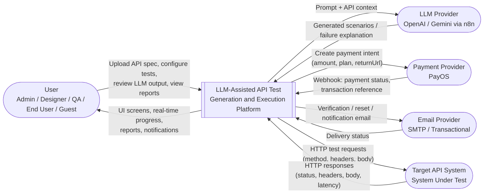
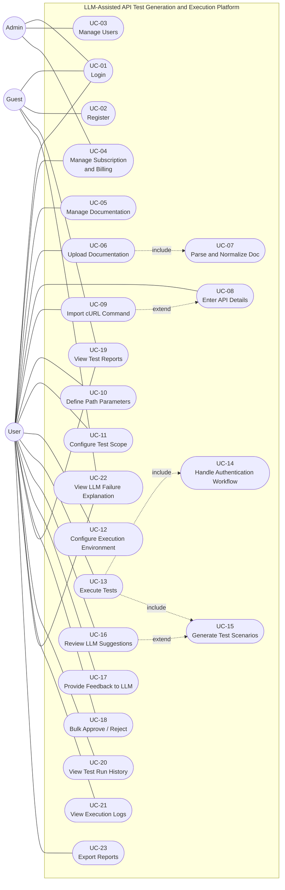
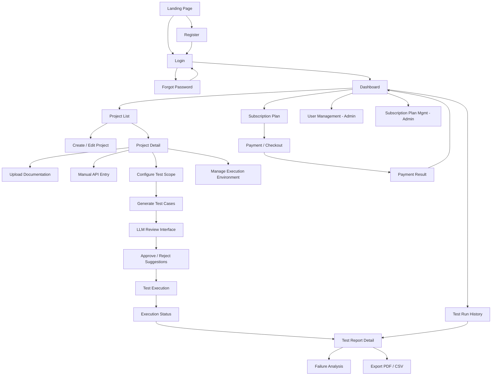
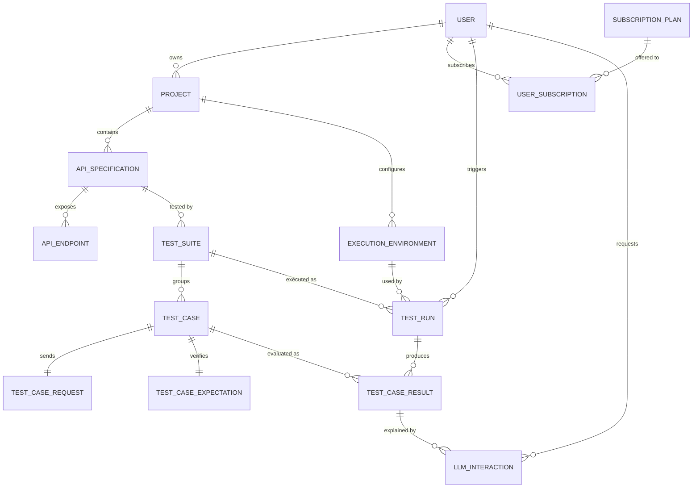
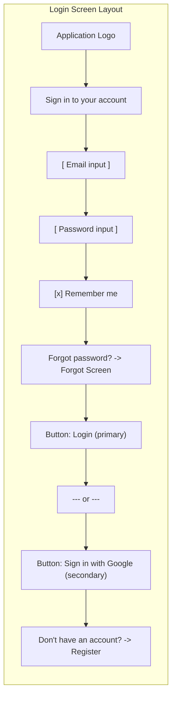
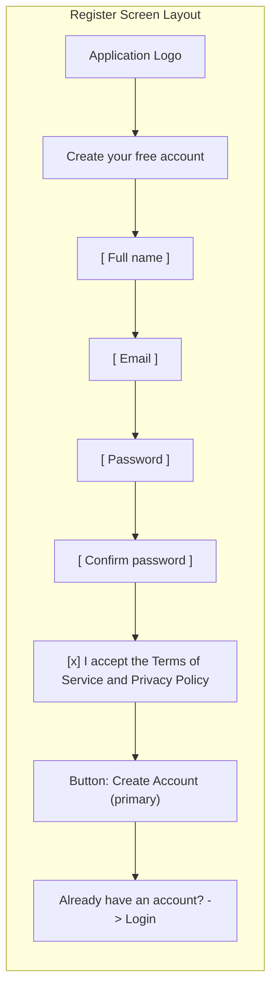
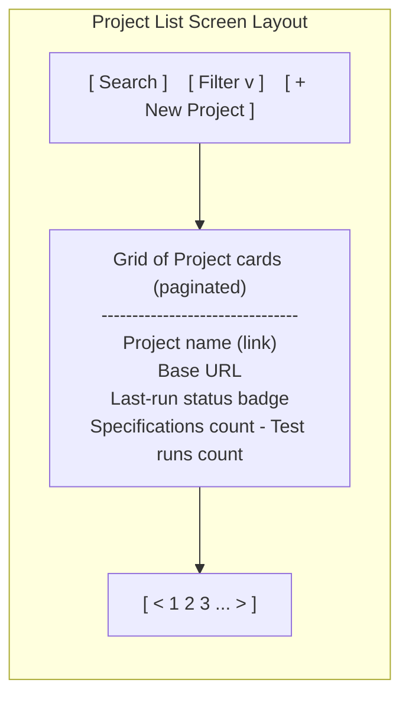

# Report 3 — Software Requirement Specification — COPY-PASTE GUIDE
## Project: SP26SE142 — LLM-Assisted API Test Generation and Execution from Documentation

> **Cách dùng file này (giống file Report 4):**
> 1. Mỗi mục có 4 thành phần xếp đúng thứ tự: **HEADING → BODY (copy-paste) → FIGURE/TABLE → CAPTION**
> 2. **HEADING** (đã ghi rõ Heading 1/2/3/4) → paste vào Word đúng heading style.
> 3. **BODY** → copy nguyên đoạn tiếng Anh dán xuống dưới heading.
> 4. **FIGURE (Mermaid)** → copy block ```mermaid ``` → mở [draw.io](https://app.diagrams.net) → `Arrange → Insert → Advanced → Mermaid…` → paste → Insert → mỗi node sẽ thành shape rời, click sửa text/style/màu được → `File → Export as → PNG` (option **Transparent / White background**) → chèn vào Word.
> 5. **TABLE** → copy block markdown table → paste vào Word → Word tự convert thành table; hoặc nếu Word giữ markdown thô, dùng `Insert → Table → Convert Text to Table` (separator = `|`).
> 6. **CAPTION** → đặt sát dưới hình/bảng. Word: `References → Insert Caption → Label = Figure / Table`.

---

## I. Record of Changes

### HEADING (Heading 1): `I. Record of Changes`

### BODY (copy-paste, ngay sau heading):

```
*A - Added M - Modified D - Deleted
```

### TABLE — điền lịch sử các phiên bản tài liệu khi nhóm chỉnh sửa:

| Date | A* / M / D | In charge | Change Description |
|------|------------|-----------|---------------------|
| 2025-09-15 | A | HaoDD3 | Initial draft of SRS document; outline of all 5 sections |
| 2025-09-22 | A | AnhLT151 | Completed Section II.1 (Product Overview) and Section II.2 (Actors, Use Cases) |
| 2025-09-29 | A | HaoDD3 | Completed Section II.3.1 (Screens Flow, Screen Descriptions, ERD) |
| 2025-10-06 | A | TuanNQ | Completed Section II.3.2 → II.3.5 (Authentication, Project Mgmt, Documentation, Test Configuration features) |
| 2025-10-13 | A | AnhLT151 | Completed Section II.3.6 → II.3.10 (LLM Review, Test Execution, Reporting, Subscription, User Mgmt) |
| 2025-10-20 | A | HaoDD3 | Completed Section II.4 (Non-Functional Requirements) |
| 2025-10-27 | A | TuanNQ | Completed Section II.5 (Business Rules, Common Requirements, Application Messages) |
| 2025-11-03 | M | AnhLT151 | Reviewed entire document; minor wording updates to UC-15, UC-22; added MSG10–MSG18 |
| 2025-11-10 | M | HaoDD3 | Updated ERD to align with database design in Report 4; renumbered entities |
| 2025-11-17 | M | TuanNQ | Final review and formatting adjustments before submission |

> Bạn có thể chỉnh ngày tháng / tên thành viên / mô tả cho khớp lịch sử thực tế của nhóm.

---

## II. Software Requirement Specification

### HEADING (Heading 1): `II. Software Requirement Specification`

---

## 1. Product Overview

### HEADING (Heading 2): `1. Product Overview`

### BODY (copy-paste):

```
The LLM-Assisted API Test Generation and Execution platform is a web-based software system designed to automate the generation, execution, and analysis of API test cases using Large Language Model (LLM) assistance. The system enables development and quality-assurance teams to upload an API definition (OpenAPI / Swagger / Postman collection) or to enter API endpoints manually, automatically generate test scenarios that cover the happy-path, boundary and negative cases, execute the resulting test cases against a target API, and analyse the outcomes with AI-generated explanations and edge-case recommendations.

By combining deterministic rule-based generation with the reasoning capability of an LLM, the platform reduces the manual effort required to design API tests, increases coverage of corner cases that are commonly missed by hand-written tests, and shortens the feedback loop between a code change and the discovery of an integration regression. Test reports include both raw evidence (HTTP request/response, status code, latency) and human-readable explanations of why a test failed, which allows engineers to triage failures faster than with traditional reporting tools.

The context diagram (Figure 4.0-1) illustrates the system boundary and its interactions with external entities. The system itself is represented as a single process, while every actor or service that lies outside the boundary is modelled as an external entity. These external entities include: the User (Administrator, API Designer, QA Engineer, end User, Guest), the LLM Provider (the n8n workflow that proxies calls to OpenAI / Gemini / a local model), the Payment Provider (PayOS), the Email Provider (transactional e-mail service used for verification and notifications), and the Target API System — i.e. the System Under Test (SUT) whose endpoints are exercised by the generated test cases.

The User interacts with the platform to upload API definitions, configure and execute tests, review LLM-generated test cases, analyse execution results, and manage subscriptions. The platform communicates with the LLM Provider to generate test scenarios and to compose natural-language explanations for failed tests. It integrates with the Payment Provider to process subscription purchases, renewals and webhook confirmations. It uses the Email Provider for account verification, password reset, and test-completion notifications. Finally, it sends API test requests to the Target API System and receives the corresponding responses for evaluation. These data exchanges define the system boundary and are represented in the context diagram below.
```

### FIGURE 4.0-1 — Context Diagram (Mermaid `flowchart`):



### CAPTION:

`Figure 4.0-1. Context Diagram — System boundary and external entities.`

> **Tip draw.io:** sau khi import, click vào shape `[[ ]]` ở giữa → đổi style thành **UML → System Boundary** (Process). Các `([ ])` quanh nó (External Entities) đổi thành **Actor** hoặc **Cloud / External System** shape cho đẹp.

---

## 2. User Requirements

### HEADING (Heading 2): `2. User Requirements`

---

### 2.1 Actors

#### HEADING (Heading 3): `2.1 Actors`

#### BODY (copy-paste):

```
This section identifies the primary actors who interact with the LLM-Assisted API Test Generation and Execution platform. Based on the system analysis, three distinct actors are recognised. Each actor groups several human roles that share the same scope of authority within the system; for example, "User" covers both Developers and QA Engineers because, from the platform's point of view, they exercise the same set of functional permissions on a project they own.
```

#### TABLE — Actors:

| # | Actor | Description |
|---|-------|-------------|
| 1 | Administrator | The super-user responsible for the overall system administration. This actor manages user accounts, monitors system status, and configures global settings such as subscription plans and billing policies. The Administrator is also the only actor allowed to deactivate users and to publish or retire subscription plans. |
| 2 | User | The primary actor of the system, representing both Developers and QA Engineers. This actor has full access to the core testing lifecycle: managing API documentation, configuring test environments, executing tests, reviewing LLM-generated scenarios, analysing reports, and managing the subscription that grants quota for these actions. |
| 3 | Guest | An unauthenticated or external user with limited access privileges. A Guest can register for a new account or view specific test reports that have been shared publicly via a signed link. A Guest cannot upload documentation, generate tests, execute runs or pay for a subscription. |

---

### 2.2 Use Cases

#### HEADING (Heading 3): `2.2 Use Cases`

#### BODY (copy-paste):

```
The Use Case Diagram visualises the functional requirements of the system and the interactions between the actors and the system's functionalities. The system's capabilities are categorised into eight functional groups corresponding to the major features of the platform: Authentication, User and Subscription Management, API Documentation Management, Test Configuration, Test Generation, Test Execution, Test Reporting, and System Workflows. Each use case in the diagram is referenced by a unique identifier (UC-01 to UC-23) which is reused throughout the document.
```

---

#### 2.2.1 Diagram(s)

##### HEADING (Heading 4): `2.2.1 Diagram(s)`

##### FIGURE 4.0-2 — Use Case Diagram (Mermaid `flowchart`, sẽ re-style thành UML use-case trong draw.io):



##### CAPTION:

`Figure 4.0-2. Use Case Diagram — LLM-Assisted API Test Generation and Execution Platform.`

> **Tip draw.io (quan trọng):** Mermaid xuất các use-case dưới dạng node `([ ])` (oval). Sau khi import, để biến chúng thành UML chuẩn:
> 1. Mở panel `Shapes → More Shapes… → UML` (tích chọn) → ở sidebar trái sẽ có shape "Use Case" (ellipse).
> 2. Select all use-case nodes → Right-click → Edit Style → thay `ellipse;…` bằng style của Use Case shape (hoặc kéo shape Use Case ra rồi copy style).
> 3. Actor `(( ))` đổi thành **UML → Actor** (stick figure).
> 4. Subgraph `SYS` đổi thành **UML → System Boundary** (rectangle to bao tất cả use case).
> 5. Edge `-. include .->` và `-. extend .->` đã là dashed line — thêm `«include»` / `«extend»` label nếu cần.

---

#### 2.2.2 Descriptions

##### HEADING (Heading 4): `2.2.2 Descriptions`

##### TABLE — Use Case Descriptions:

| ID | Use Case | Actors | Use Case Description |
|----|----------|--------|----------------------|
| UC-01 | Login | Admin, User, Guest | Allows actors to authenticate into the system using their credentials (e-mail/password or Google OAuth) to access role-specific features. |
| UC-02 | Register | Guest | Allows a Guest to create a new account to become a registered User of the system. The account is activated after the verification e-mail is confirmed. |
| UC-03 | Manage Users | Admin | Allows the Administrator to view, update, lock/unlock, or deactivate user accounts and to assign system roles. |
| UC-04 | Manage Subscription & Billing | Admin, User | For Admin: create and configure subscription plans and price points. For User: subscribe to a plan, upgrade/downgrade, manage payment methods and view payment history. |
| UC-05 | Manage Documentation | User | Allows the User to perform CRUD operations (Create, Read, Update, Delete) on API documentation projects. |
| UC-06 | Upload Documentation | User | Allows the User to upload standard API definition files (OpenAPI 3.x / Swagger 2.0 / Postman 2.1 collection). The file is validated and stored as the source of truth for test generation. |
| UC-07 | Parse & Normalize Doc | System | Automatically processes the uploaded file into a unified internal model (endpoints, parameters, schemas, examples) used for test generation. Triggered as an `«include»` of UC-06. |
| UC-08 | Enter API Details | User | Allows the User to manually define API endpoints, methods, headers, query/path parameters and request bodies without an uploaded file. |
| UC-09 | Import cURL Command | User | Allows the User to paste a cURL command, which the system parses to auto-fill API details. `«extends»` UC-08. |
| UC-10 | Define Path Parameters | User | Allows the User to specify concrete or templated values for path parameters (e.g. `{id}`) so that generated test cases produce valid URLs. |
| UC-11 | Configure Test Scope | User | Allows the User to select specific endpoints to test and to define the scope (per-endpoint or per-tag) of the test run. |
| UC-12 | Configure Execution Environment | User | Allows the User to set up environment variables, base URLs, default headers and authentication tokens for a given environment (Dev / Staging / Production). |
| UC-13 | Execute Tests | User | Triggers the test execution engine to run the selected test scenarios against the target API in the chosen environment. |
| UC-14 | Handle Authentication Workflow | System | Automatically handles authentication flows (e.g. acquiring OAuth tokens, applying API keys) before executing protected API calls. `«included»` by UC-13. |
| UC-15 | Generate Test Scenarios | System | Uses rule-based logic and the LLM to generate happy-path, boundary, and negative test cases. Triggered during test creation and during execution if regeneration is requested. |
| UC-16 | Review LLM Suggestions | User | Displays LLM-generated test scenarios for the User to preview, approve, or modify before final execution. |
| UC-17 | Provide Feedback to LLM | User | Allows the User to rate or comment on the quality of AI suggestions to improve future generations. |
| UC-18 | Bulk Approve/Reject | User | Allows the User to quickly approve or reject multiple AI-generated test cases at once. |
| UC-19 | View Test Reports | User, Guest | Displays the detailed results of test executions, including pass/fail status, coverage metrics and per-case evidence. Guests can only view publicly shared reports. |
| UC-20 | View Test Run History | User | Allows the User to access logs and reports from previous test executions, filterable by date, environment, and status. |
| UC-21 | View Execution Logs | User | Provides detailed technical logs (full request / response bodies, headers, timing) for debugging purposes. |
| UC-22 | View LLM Failure Explanation | User, Guest | Uses the LLM to analyse failed tests and provide a natural-language explanation of probable causes and suggested fixes. |
| UC-23 | Export Reports | User | Allows the User to download test reports in PDF or CSV formats for external sharing or compliance archiving. |

---

## 3. Functional Requirements

### HEADING (Heading 2): `3. Functional Requirements`

---

### 3.1 System Functional Overview

#### HEADING (Heading 3): `3.1 System Functional Overview`

#### BODY (copy-paste):

```
This section provides a detailed overview of the system's functional components, including the navigation flow between screens, detailed screen descriptions, user role authorisations, the background system functions that have no user interface, and the entity relationship diagram for the underlying data model.
```

---

#### 3.1.1 Screens Flow

##### HEADING (Heading 4): `3.1.1 Screens Flow`

##### BODY (copy-paste):

```
Diagram description: the screen flow diagram (Figure 4.0-3) illustrates the user journey through the LLM-Assisted API Test System.

Entry point — users start at the Landing Page, which routes to the Login or Register screen depending on the chosen action.

Dashboard — upon successful authentication, users land on the Dashboard, which serves as the central hub: it shows recent projects, recent test runs, subscription status and quick actions.

Project Management — from the Dashboard, users can access the Project List, the Create / Edit Project screen, and the Project Details screen.

Test Configuration — within a project, users navigate to Upload Documentation, Manual API Entry, Configure Test Scope and Manage Execution Environment.

Generation and review — once a project has at least one specification, users can trigger Generate Test Cases and review the proposals on the LLM Review Interface, where they can approve, reject, or edit each suggestion.

Execution and monitoring — the user starts a Test Run, which is monitored on the Execution Status screen in real time.

Reporting — once a run is complete, users access the Test Report Detail screen, which contains the Failure Analysis sub-screen for individual failed cases, as well as the Export Report function (PDF / CSV).

Account, billing and admin — independently of the testing lifecycle, users can navigate to the Subscription Plan screen to manage their subscription; administrators have an additional User Management screen.
```

##### FIGURE 4.0-3 — Screens Flow (Mermaid `flowchart`):



##### CAPTION:

`Figure 4.0-3. Screens Flow Diagram — User journey through the platform.`

---

#### 3.1.2 Screen Descriptions

##### HEADING (Heading 4): `3.1.2 Screen Descriptions`

##### BODY (copy-paste):

```
The following table describes the primary screens identified in the screen flow diagram (Figure 4.0-3). Each screen is owned by exactly one feature group and may be reachable from multiple navigation paths.
```

##### TABLE — Screen Descriptions:

| # | Feature | Screen | Description |
|---|---------|--------|-------------|
| 1 | Authentication | Login / Register | Allows users to authenticate or create a new account. Supports e-mail/password and Google OAuth, includes "Forgot Password" recovery and e-mail verification. |
| 2 | Dashboard | Main Dashboard | The landing screen after login. Displays a system overview, recent projects, recent test runs, quick actions and current subscription status. |
| 3 | Project Mgmt | Project List | Displays a paginated list of all API testing projects owned by the current user, with search, sort and filter capabilities. |
| 4 | Project Mgmt | Create / Edit Project | A form to input project details (Name, Description, Base URL) and initial settings such as default environment and visibility. |
| 5 | Project Mgmt | Project Detail | Shows project metadata, list of API specifications, list of test suites, list of environments and recent runs for that project. |
| 6 | Input Mgmt | Upload Documentation | Interface for uploading OpenAPI/Swagger or Postman files. Includes client-side validation, server-side parsing feedback and version history. |
| 7 | Input Mgmt | Manual API Entry | A complex form to manually define API endpoints (Method, URL, Headers, Body) and to import cURL commands which auto-fill the form. |
| 8 | Test Config | Configure Test Scope | Screen to select endpoints (per-tag or per-endpoint) to include in the test run. |
| 9 | Test Config | Manage Execution Environment | Screen to define environment variables, base URLs, default headers and authentication tokens for Dev/Staging/Production. |
| 10 | AI Workflow | Generate Test Cases | Screen to start the generation job and to choose generation strategy (rule-based, LLM-only, or hybrid). |
| 11 | AI Workflow | LLM Review Interface | A specialised screen displaying AI-generated test scenarios. Allows users to Approve, Reject, or Edit suggestions before execution; supports bulk operations. |
| 12 | Execution | Execution Status | A real-time progress screen showing the status of running tests (Pending / Running / Completed / Failed) and per-case results streamed via SignalR. |
| 13 | Reporting | Test Report Detail | Displays comprehensive results of a test run: Pass/Fail charts, coverage metrics and detailed per-case logs. |
| 14 | Reporting | Failure Analysis | A sub-screen or modal showing the LLM's natural-language explanation, possible causes, and suggested fixes for specific failed test cases. |
| 15 | Reporting | Test Run History | A list of all previous runs with filters by date, environment, status and trigger type. |
| 16 | Reporting | Export PDF / CSV | A modal to choose the format and the level of detail of the exported report and to start the export job. |
| 17 | Billing | Subscription Plan | Allows users to view their current plan, upgrade/downgrade, view usage metrics and manage payment methods. |
| 18 | Billing | Payment / Checkout | Redirects to PayOS gateway, shows payment status and reconciles back to the platform. |
| 19 | Admin | User Management | (Admin only) A grid view to manage system users, roles, lock/unlock and account status. |
| 20 | Admin | Subscription Plan Mgmt | (Admin only) Create, edit, publish or retire subscription plans and their limits. |

---

#### 3.1.3 Screen Authorization

##### HEADING (Heading 4): `3.1.3 Screen Authorization`

##### BODY (copy-paste):

```
This matrix defines access rights to specific screens and activities for each user role (Admin, User, Guest). An "X" means the role has access to the screen. An "X*" means the role has restricted access (read-only, or only for items shared with that role).
```

##### TABLE — Screen Authorization Matrix:

| Screen / Activity | Admin | User | Guest |
|-------------------|:-----:|:----:|:-----:|
| Login / Register | X | X | X |
| Forgot Password | X | X | X |
| Main Dashboard | X | X |   |
| User Management | X |   |   |
| Lock / Unlock User | X |   |   |
| Subscription Plan Management | X | X |   |
| Create Plan (Admin) | X |   |   |
| Purchase Plan (User) |   | X |   |
| Project List |   | X |   |
| Create / Edit Project |   | X |   |
| Project Detail |   | X |   |
| Upload Documentation |   | X |   |
| Manual API Entry |   | X |   |
| Configure Test Scope |   | X |   |
| Manage Execution Environment |   | X |   |
| Generate Test Cases |   | X |   |
| LLM Review Interface |   | X |   |
| Approve / Reject Suggestions |   | X |   |
| Bulk Approve / Reject |   | X |   |
| Provide Feedback to LLM |   | X |   |
| Test Execution |   | X |   |
| Execution Status |   | X |   |
| Test Report Detail |   | X | X* |
| View Own Report |   | X |   |
| View Shared Report |   |   | X |
| Export to PDF / CSV |   | X |   |
| Failure Analysis (LLM) |   | X | X* |
| Test Run History |   | X |   |

---

#### 3.1.4 Non-Screen Functions

##### HEADING (Heading 4): `3.1.4 Non-Screen Functions`

##### BODY (copy-paste):

```
The following table describes background processes and system functions that do not have a direct user interface but are critical for system operation. These functions are typically implemented as background workers, message-queue consumers, or webhook handlers.
```

##### TABLE — Non-Screen Functions:

| # | Feature | System Function | Description |
|---|---------|-----------------|-------------|
| 1 | Doc Processing | Parser Service | Background service that parses uploaded OpenAPI / Postman files, normalises data into the internal schema, validates the structure and emits a `SpecificationParsed` domain event upon success. |
| 2 | Test Generation | LLM Prompt Engine | Constructs prompts based on API context (endpoint, parameters, examples), sends them to the LLM provider via n8n, validates and processes the returned test scenarios, and persists them as `TestCase` records pending review. |
| 3 | Test Execution | Test Runner Job | A background worker (RabbitMQ consumer) that executes HTTP requests for each test case, handles dependency chaining (extracting values from a previous response and injecting them into the next request), captures the response and emits a `TestCaseExecuted` event. |
| 4 | Reporting | Report Aggregator | Calculates test coverage, compiles execution logs, and generates statistical data (pass-rate, latency percentiles, failure clusters) for the dashboard after a test run completes. |
| 5 | Notification | Email Service | Sends transactional e-mails for account verification, password reset, test completion notifications and subscription receipts; integrates with the Email Provider over SMTP. |
| 6 | Billing | Payment Webhook Handler | Listens for events from PayOS to automatically update user subscription status upon successful payment; idempotently records the transaction in `PAYMENT_TRANSACTION` and dispatches a `SubscriptionActivated` event. |
| 7 | Audit | Audit Log Writer | Records every state-changing operation (who, what, when, before, after) into the `AUDIT_LOG_ENTRY` table for compliance and traceability. |
| 8 | Auth | Token Refresh Job | Refreshes acquired OAuth tokens before they expire so that long test runs against protected APIs do not fail half-way. |

---

#### 3.1.5 Entity Relationship Diagram

##### HEADING (Heading 4): `3.1.5 Entity Relationship Diagram`

##### BODY (copy-paste):

```
The Entity Relationship Diagram (Figure 4.0-4) presents the conceptual data model of the platform. It shows the main entities required to satisfy the functional requirements stated in this section and the relationships between them. A more detailed (logical and physical) view of the same model — including attributes, primary keys and PostgreSQL data types — is presented in the Software Design Document (Report 4, Figures 4.2-1, 4.2-2 and 4.2-3).
```

##### FIGURE 4.0-4 — Entity Relationship Diagram (conceptual, no attributes — same as Report 4 Figure 4.2-1):



##### CAPTION:

`Figure 4.0-4. Entity Relationship Diagram — Conceptual data model.`

##### BODY (copy-paste, ngay sau ERD):

```
Entities Description
```

##### TABLE — Entities Description:

| # | Entity | Description |
|---|--------|-------------|
| 1 | User | Represents a registered user of the platform (Administrator, end User or Guest). Holds login credentials, profile attributes, e-mail confirmation status and locking flags. |
| 2 | Subscription Plan | Catalogue of subscription packages (Free, Pro, Enterprise) with their price points (monthly / yearly) and the limits they grant on usage metrics. |
| 3 | User Subscription | Represents an active subscription that links a User to a Subscription Plan with a billing cycle, validity dates and auto-renew flag. |
| 4 | Project | A workspace owned by a User that groups one or more API specifications, environments and test suites. |
| 5 | API Specification | The source of truth for the contract of an API: an uploaded OpenAPI/Swagger/Postman file or a manually-entered set of endpoints. |
| 6 | API Endpoint | A single operation of an API specification (HTTP method + path + parameters + responses). |
| 7 | Execution Environment | Configuration for a test run: base URL, environment variables, default headers and authentication tokens for a given Dev/Staging/Production stage. |
| 8 | Test Suite | A logical group of test cases generated for a given API specification. |
| 9 | Test Case | An individual test scenario consisting of a request, an expectation and (optionally) dependencies on other test cases. |
| 10 | Test Case Request | The HTTP request payload of a test case: method, URL, headers, query/path parameters and body. |
| 11 | Test Case Expectation | The assertion model for a test case: expected status, response schema, body contains, JSON-path checks and maximum response time. |
| 12 | Test Run | An execution instance of a test suite against a specific environment, holding aggregate counters and timing metadata. |
| 13 | Test Case Result | The outcome of a single test case within a test run: pass/fail/skip, HTTP status, actual response, failure reason and duration. |
| 14 | LLM Interaction | A record of every call made to the LLM (test generation or failure explanation) including the prompt, response, model, tokens used and latency. |

---

### 3.2 Authentication

#### HEADING (Heading 3): `3.2 Authentication`

#### BODY (copy-paste):

```
The Authentication feature is responsible for verifying the identity of users entering the platform and for managing the lifecycle of credentials. It covers three primary functions: signing in, registering a new account, and recovering a forgotten password. This feature applies to all three actors (Admin, User, Guest) and is the entry point for every other feature of the system.
```

---

#### 3.2.1 Login

##### HEADING (Heading 4): `3.2.1 Login`

##### BODY (copy-paste):

```
Function trigger: triggered when an unauthenticated visitor clicks the "Login" button on the Landing Page or is redirected from a protected page that requires authentication.

Function description: this function is available to Administrators, registered Users and Guests (for the purpose of obtaining a User account). Its purpose is to authenticate the actor against the credentials stored by the platform, to issue a JWT access token and a refresh token, and to redirect the actor to the Dashboard appropriate to their role. The function supports two authentication methods: e-mail / password and Google OAuth 2.0. The data processing flow is: the credentials are submitted over HTTPS, validated against the Identity store (PostgreSQL `identity.users`), the password hash is verified using the ASP.NET Core Identity hasher, the issued JWT is signed with HS256 using a server-side secret, and the refresh token is stored in an HTTP-only cookie.

Screen layout: the Login screen consists of a centred card with the application logo at the top, two input fields (e-mail and password), a "Remember me" checkbox, a "Forgot password?" link, a primary "Login" button and a secondary "Sign in with Google" button. Below the card a link offers navigation to the Register screen.
```

##### FIGURE 4.1-1 — Login Screen Layout (logical wireframe in Mermaid `flowchart`):



##### CAPTION: `Figure 4.1-1. Login Screen Layout.`

> **Tip:** sau khi import vào draw.io, bạn có thể giữ wireframe này HOẶC chèn screenshot Figma/UI thực tế của nhóm — figure number giữ nguyên `4.1-1`.

##### BODY (copy-paste, "Function Details"):

```
Function Details:
- Inputs: Email (required, valid e-mail format, maximum 256 characters); Password (required, minimum 8 characters); Remember Me (boolean).
- Validation: client-side validation for required fields and format; server-side rate-limiting (5 failed attempts per 15 minutes per IP, 10 per account); user lock-out after 5 consecutive failures within 30 minutes (auto-unlock after 30 minutes).
- Business rules: BR-01 (password complexity), BR-02 (account lock-out after consecutive failures), BR-03 (e-mail must be confirmed before sign-in is allowed).
- Normal flow: user submits credentials → server verifies → JWT + refresh token issued → redirect to Dashboard.
- Abnormal flow 1 — wrong credentials: server returns 401, screen displays MSG09 inline below the form, increments failure counter.
- Abnormal flow 2 — unconfirmed e-mail: screen displays MSG10 with a "Resend verification e-mail" link.
- Abnormal flow 3 — account locked: screen displays MSG11 and disables the form for 30 minutes.
- Abnormal flow 4 — Google OAuth cancelled by user: redirect back to Login screen with toast MSG12.
```

---

#### 3.2.2 Register

##### HEADING (Heading 4): `3.2.2 Register`

##### BODY (copy-paste):

```
Function trigger: triggered when a Guest clicks the "Register" link on the Login screen or the "Sign up" call-to-action on the Landing Page.

Function description: available exclusively to Guests, this function creates a new User account in the Identity store and sends a verification e-mail. Its purpose is to onboard a new user without administrator intervention. Data processing: the form submits the e-mail, full name and password over HTTPS, the server checks for uniqueness of the e-mail, hashes the password with PBKDF2 (Identity default), inserts a row in `identity.users` with `EmailConfirmed = false`, generates a one-time confirmation token and dispatches a `SendVerificationEmail` command to the Notification module.

Screen layout: a centred card with the application logo, four input fields (Full Name, E-mail, Password, Confirm Password), a "Terms of Service" checkbox and a primary "Create Account" button. Below the form a link routes back to the Login screen.
```

##### FIGURE 4.1-2 — Register Screen Layout:



##### CAPTION: `Figure 4.1-2. Register Screen Layout.`

##### BODY (copy-paste, "Function Details"):

```
Function Details:
- Inputs: Full Name (required, 2-100 characters); E-mail (required, unique, valid format, max 256); Password (required, BR-01 complexity); Confirm Password (must match Password); Terms checkbox (must be checked).
- Validation: client-side and server-side; password strength meter visible during typing.
- Business rules: BR-01 (password complexity); BR-04 (one account per e-mail); BR-05 (Terms of Service acceptance is mandatory).
- Normal flow: form submitted → user row inserted → verification e-mail sent → screen redirects to a "Check your inbox" confirmation page.
- Abnormal flow 1 — e-mail already exists: server returns 409, MSG13 displayed inline.
- Abnormal flow 2 — verification e-mail not received: user can request a resend on the "Check your inbox" page (rate-limited to 1 per 60 seconds).
- Abnormal flow 3 — token expired (24 hours): user clicks expired link → redirected to a "Request new verification e-mail" page.
```

---

#### 3.2.3 Forgot Password

##### HEADING (Heading 4): `3.2.3 Forgot Password`

##### BODY (copy-paste):

```
Function trigger: triggered when a User clicks the "Forgot password?" link on the Login screen.

Function description: available to Users (registered) only, this function allows a user who cannot remember their password to receive a one-time reset link by e-mail and to set a new password. Data processing: the e-mail is submitted, the server looks up the corresponding `identity.users` record, generates a single-use reset token (24-hour validity) and dispatches a `SendPasswordResetEmail` command to the Notification module. When the user follows the link, a new screen accepts the new password and confirms it, then updates the password hash in the Identity store and invalidates the reset token.

Screen layout: a small centred card with the application logo, one input (E-mail) and a primary "Send reset link" button. After submission the screen displays a confirmation message regardless of whether the e-mail exists (to prevent account enumeration).
```

##### BODY (copy-paste, "Function Details"):

```
Function Details:
- Inputs: E-mail (required, valid format).
- Validation: same e-mail format rules as Login.
- Business rules: BR-06 (reset link valid 24 hours and single-use); BR-07 (rate-limit 3 reset requests per e-mail per 60 minutes); BR-08 (a successful password reset invalidates all active refresh tokens of that user).
- Normal flow: form submitted → confirmation page shown → e-mail dispatched → user follows link → sets new password → redirected to Login.
- Abnormal flow 1 — unknown e-mail: confirmation page shown anyway (no enumeration leak); no e-mail is sent.
- Abnormal flow 2 — link expired or already used: reset page displays MSG14 and a link back to "Forgot password" to request a fresh link.
```

---

### 3.3 Project Management

#### HEADING (Heading 3): `3.3 Project Management`

#### BODY (copy-paste):

```
The Project Management feature is the entry point for the testing lifecycle. A Project is the workspace that owns API specifications, execution environments and test suites; every other artefact in the system belongs to exactly one Project. This feature provides three functions: listing the Projects owned by the current user, creating or editing a Project, and viewing the detail of a Project.
```

---

#### 3.3.1 Project List

##### HEADING (Heading 4): `3.3.1 Project List`

##### BODY (copy-paste):

```
Function trigger: triggered when the User navigates to "Projects" from the Dashboard sidebar or types `/projects` in the address bar.

Function description: available to the User actor, this function shows a paginated grid of every Project the current user owns or has been granted access to. The data source is the `apidocumentation.projects` table; the query is filtered by `OwnerId = currentUserId` and supports search by name, sort by created date or last modified, and filter by status (Active / Archived).

Screen layout: a top action bar with a search box, a status filter and a primary "+ New Project" button; below the bar a grid of Project cards each containing the Project name, base URL, last-run status badge, the count of specifications and the count of test runs.
```

##### FIGURE 4.1-3 — Project List Screen Layout:



##### CAPTION: `Figure 4.1-3. Project List Screen Layout.`

##### BODY (copy-paste, "Function Details"):

```
Function Details:
- Inputs: search keyword (free text, max 100); status filter (All / Active / Archived); page size 12 / 24 / 48.
- Validation: search keyword is sanitised server-side.
- Business rules: BR-09 (a User can only see Projects they own or that are explicitly shared with them); BR-10 (archived Projects are hidden by default but can be filtered in).
- Normal flow: user lands on screen → API GET `/api/projects?search=&status=&page=` → table populated.
- Abnormal flow 1 — no Project yet: screen shows an empty-state illustration with a CTA "Create your first Project".
- Abnormal flow 2 — backend error: screen shows MSG15 toast and offers a retry button.
```

---

#### 3.3.2 Create / Edit Project

##### HEADING (Heading 4): `3.3.2 Create / Edit Project`

##### BODY (copy-paste):

```
Function trigger: triggered when the User clicks "+ New Project" on the Project List or "Edit" on a Project Detail screen.

Function description: available to the User actor only. The same screen serves both create and edit modes; in edit mode the form is pre-populated with the existing Project values. Data processing: on submit the client calls `POST /api/projects` (create) or `PUT /api/projects/{id}` (edit); the back-end validates the inputs, persists the Project row, and (on create) automatically creates a default Execution Environment named "Local" with the Project's base URL.

Screen layout: a single-column form with: Name, Description, Base URL, Visibility (Private / Shared), Tags, "Save" and "Cancel" buttons.
```

##### BODY (copy-paste, "Function Details"):

```
Function Details:
- Inputs: Name (required, 2-200 chars, unique per user); Description (optional, max 2,000); Base URL (required, valid URL); Visibility (enum: Private / Shared); Tags (multi-select, max 10).
- Validation: client-side required-field highlighting; server-side uniqueness check on Name (per user).
- Business rules: BR-11 (Project name must be unique within a single user's workspace); BR-12 (deleting a Project cascades to its specifications, environments, suites and runs — soft-delete with a 30-day grace period).
- Normal flow: form submitted → toast MSG03 (Created / Updated successfully) → navigate to Project Detail.
- Abnormal flow 1 — duplicate name: MSG16 inline error.
- Abnormal flow 2 — invalid URL: MSG17 inline error.
- Abnormal flow 3 — quota exceeded (max number of Projects on the current plan): toast MSG18 with a CTA "Upgrade plan".
```

---

#### 3.3.3 Project Detail

##### HEADING (Heading 4): `3.3.3 Project Detail`

##### BODY (copy-paste):

```
Function trigger: triggered when the User clicks a Project card on the Project List or follows a deep link such as `/projects/{id}`.

Function description: available to the User actor. The screen aggregates every artefact that belongs to the Project: specifications, environments, suites, recent runs, and quick links to Upload Documentation, Manual API Entry, Configure Test Scope and Manage Execution Environment. Data processing: a single batched call `GET /api/projects/{id}/overview` returns all summarised collections.

Screen layout: a left navigation panel with the Project name and tabs (Overview / Specifications / Suites / Environments / Runs / Settings); the main panel renders the active tab.
```

##### BODY (copy-paste, "Function Details"):

```
Function Details:
- Inputs: Project Id (path param).
- Validation: server-side authorisation check (user must own the Project or be granted access).
- Business rules: BR-09; BR-12.
- Normal flow: tabs load lazily; first navigation always loads the Overview tab.
- Abnormal flow 1 — Project not found or unauthorised: redirect to a 404 page with "Back to Project List" CTA.
- Abnormal flow 2 — Project archived: a banner is shown on top with a "Restore" button.
```

---

### 3.4 API Documentation Management

#### HEADING (Heading 3): `3.4 API Documentation Management`

#### BODY (copy-paste):

```
The API Documentation Management feature lets the User feed API contracts into the platform so that the Test Generation engine has the context required to produce meaningful test cases. Two ingestion paths are supported: (a) uploading a standard specification file (OpenAPI / Swagger / Postman) and (b) entering or importing API endpoints manually, including via cURL parsing. After ingestion, the platform parses and normalises the contract into a unified internal model regardless of the source format.
```

---

#### 3.4.1 Upload Documentation

##### HEADING (Heading 4): `3.4.1 Upload Documentation`

##### BODY (copy-paste):

```
Function trigger: triggered when the User clicks "Upload Documentation" inside a Project, or drags a file onto the upload drop-zone.

Function description: available to the User actor, this function accepts an OpenAPI 3.x file (JSON or YAML), a Swagger 2.0 file, or a Postman 2.1 collection. Data processing: the file is uploaded to object storage and a `SpecificationUploaded` event is dispatched; the Parser Service (non-screen function 1) consumes the event, parses the file into endpoints, parameters and schemas, and writes them to `apidocumentation.api_specifications` and `apidocumentation.api_endpoints`. Parse status (Pending / Parsing / Parsed / Failed) is shown in real time via SignalR.

Screen layout: a drop-zone with file-type instructions, a list of recently-uploaded files with their parse status, and a "View parsed endpoints" link once the parsing succeeds.
```

##### BODY (copy-paste, "Function Details"):

```
Function Details:
- Inputs: File (required, MIME type application/json | application/yaml | text/yaml; max 20 MB).
- Validation: client-side file-size and extension validation; server-side schema validation (OpenAPI 3.0 / 3.1 / Swagger 2.0 / Postman 2.1).
- Business rules: BR-13 (uploading a new specification creates a new immutable version; older versions are kept and can be re-activated); BR-14 (parsing must complete within 60 seconds, otherwise a "ParseTimeout" failure reason is recorded).
- Normal flow: file dropped → upload progress → SpecificationUploaded event → Parser runs → status flips to Parsed → endpoint list rendered.
- Abnormal flow 1 — invalid format: MSG19 toast.
- Abnormal flow 2 — file too large: MSG20 toast.
- Abnormal flow 3 — parsing failed (e.g. malformed YAML): status set to Failed, error message visible on hover, "Retry" button shown.
```

---

#### 3.4.2 Manual API Entry

##### HEADING (Heading 4): `3.4.2 Manual API Entry`

##### BODY (copy-paste):

```
Function trigger: triggered when the User clicks "Manual API Entry" inside a Project or chooses "Create endpoint" on an existing Specification of source type "Manual".

Function description: available to the User actor, this function lets the user define endpoints without an upload, by either typing details into a structured form or pasting a cURL command which the system parses to auto-fill the form. Data processing: the form fields are mapped 1-to-1 to `api_endpoints`, `endpoint_parameters` and `endpoint_responses` rows; the cURL parser uses a regex-based extractor to translate the command into the form fields.

Screen layout: top toggle "Form view / cURL view"; in cURL view a multi-line textarea accepts the cURL command and a "Parse" button populates the form below; the form contains Method (dropdown), URL, Headers (key-value rows), Query Params, Path Params, Body (with content-type selector and JSON / form-data editor), Auth (bearer / API key / OAuth toggle), and "Save endpoint" button.
```

##### BODY (copy-paste, "Function Details"):

```
Function Details:
- Inputs: Method (required, enum); URL (required, max 1,000); Headers / Query / Path params (optional, validated for non-empty key); Body (validated against content-type if JSON); cURL textarea (optional).
- Validation: cURL parser handles -X, -H, -d, --data-raw, --url, escaped quotes, multi-line continuations.
- Business rules: BR-15 (Path parameters that exist in the URL template but are not defined in the params table are marked invalid until defined).
- Normal flow: form filled → save → toast MSG03 → endpoint appears under the project's "Manual" specification.
- Abnormal flow 1 — invalid cURL: MSG21 inline near the parser button.
- Abnormal flow 2 — duplicate Method+Path within the same Specification: MSG22 inline error.
```

---

### 3.5 Test Configuration

#### HEADING (Heading 3): `3.5 Test Configuration`

#### BODY (copy-paste):

```
The Test Configuration feature defines the boundary conditions of a future test run: which endpoints are in scope and what runtime context (base URL, environment variables, auth tokens) the requests should be sent against. It contains two functions: configuring the test scope and managing execution environments.
```

---

#### 3.5.1 Configure Test Scope

##### HEADING (Heading 4): `3.5.1 Configure Test Scope`

##### BODY (copy-paste):

```
Function trigger: triggered before generating tests, when the User clicks "Configure Test Scope" on a Specification.

Function description: available to the User actor, this function creates or updates a Test Suite — a logical grouping of endpoints that will be tested together. The user picks endpoints individually or by tag (operationId, tag, path prefix), assigns priority and marks endpoints as enabled or disabled. Data processing: scope choices are persisted as `test_suites` and `test_cases` placeholders that will be filled by the generation step.

Screen layout: a tree view of the Specification's tags and endpoints with checkboxes; a right-hand summary panel showing the count of selected endpoints, the priority distribution and a primary "Save scope" button.
```

##### BODY (copy-paste, "Function Details"):

```
Function Details:
- Inputs: selected endpoint Ids (at least one required); per-endpoint priority (1=Critical / 2=High / 3=Normal / 4=Low); per-endpoint enabled flag.
- Validation: at least one endpoint must be selected; cumulative count not exceeding the plan's "endpoints per run" limit.
- Business rules: BR-16 (endpoints disabled in the scope are skipped during execution and counted as Skipped in the report).
- Normal flow: scope saved → user redirected to Generate Test Cases.
- Abnormal flow 1 — quota exceeded: MSG23 toast with "Upgrade plan" CTA.
```

---

#### 3.5.2 Manage Execution Environment

##### HEADING (Heading 4): `3.5.2 Manage Execution Environment`

##### BODY (copy-paste):

```
Function trigger: triggered when the User opens "Environments" inside a Project.

Function description: available to the User actor, this function performs CRUD on Execution Environments. An environment carries the base URL, the variables, the default headers and the authentication configuration that will be applied to every request of a test run. Data processing: simple CRUD against `apidocumentation.execution_environments`; secrets (tokens, API keys) are stored encrypted at rest.

Screen layout: a list of environments on the left with "+ New" button; the right panel shows the form for the selected environment with sections "General", "Variables", "Headers", "Authentication".
```

##### BODY (copy-paste, "Function Details"):

```
Function Details:
- Inputs: Name (required, unique per project); Base URL (required); Variables (key/value pairs); Headers (key/value); AuthConfig (Bearer | ApiKey | OAuth2 | None) with secret fields.
- Validation: secret fields are write-only (read returns "***"); base URL must be a valid HTTP / HTTPS URL.
- Business rules: BR-17 (each project must have at least one environment; the last cannot be deleted); BR-18 (renaming a default environment does not break existing test runs).
- Normal flow: edits saved → toast MSG03 → list refreshed.
- Abnormal flow 1 — attempted delete of last environment: MSG24 dialog blocks the action.
```

---

### 3.6 Test Generation and LLM Review

#### HEADING (Heading 3): `3.6 Test Generation and LLM Review`

#### BODY (copy-paste):

```
The Test Generation and LLM Review feature is the AI-assisted core of the platform. It produces test cases for the endpoints in scope using a hybrid approach (rule-based + LLM), shows the proposals to the user for review, lets the user approve, edit or reject them individually or in bulk, and collects feedback to improve future generations.
```

---

#### 3.6.1 Generate Test Cases

##### HEADING (Heading 4): `3.6.1 Generate Test Cases`

##### BODY (copy-paste):

```
Function trigger: triggered when the User clicks "Generate Test Cases" on the Configure Test Scope screen or on the LLM Review Interface (regenerate).

Function description: available to the User actor, this function dispatches a `GenerateTestCases` command to the Test Generation module. The module fans out per-endpoint sub-jobs over RabbitMQ; each job runs the rule-based generator first (happy-path + 422-class boundary cases), then calls the n8n workflow that wraps the LLM provider to obtain additional negative and edge cases. The proposed test cases are persisted with status `PendingReview`.

Screen layout: a confirmation dialog with the chosen strategy (Rule-based / LLM-only / Hybrid), the estimated cost in tokens and quota, and a primary "Start generation" button; once started, the screen transitions to a progress page that streams generation events via SignalR.
```

##### BODY (copy-paste, "Function Details"):

```
Function Details:
- Inputs: TestSuiteId (required); strategy (enum, default Hybrid); model (enum: gpt-4o-mini / gpt-4o / gemini-1.5-pro, default depends on plan).
- Validation: server-side check that the user has not exceeded the monthly LLM call quota of their plan.
- Business rules: BR-19 (each endpoint produces at least 1 happy-path case and up to 5 LLM-suggested cases per generation); BR-20 (a regeneration replaces only test cases that are still in PendingReview status — Approved cases are kept).
- Normal flow: command dispatched → progress page → on completion, redirect to LLM Review Interface.
- Abnormal flow 1 — LLM provider returns malformed JSON: case is skipped, an LLM_INTERACTION row records the error with severity Warning.
- Abnormal flow 2 — quota exceeded mid-generation: generation pauses, toast MSG23.
```

---

#### 3.6.2 Review LLM Suggestions (and Approve / Reject in bulk)

##### HEADING (Heading 4): `3.6.2 Review LLM Suggestions (Approve / Reject)`

##### BODY (copy-paste):

```
Function trigger: triggered after a generation job completes, or when the User opens the "Review" tab of a Test Suite.

Function description: available to the User actor, this function shows every proposed test case grouped by endpoint, with the LLM rationale, the proposed request payload and the proposed expectation. The user can: (a) preview, (b) edit, (c) approve, (d) reject, (e) provide free-text feedback for the LLM. Bulk actions are available via row-selection checkboxes and a "Bulk action" dropdown.

Screen layout: a tree-grid with collapsible endpoint rows; each leaf is a test case row with columns Status, Type (Happy / Boundary / Negative), Name, Rationale, Actions; a top action bar provides bulk approve, bulk reject, and a filter by status.
```

##### BODY (copy-paste, "Function Details"):

```
Function Details:
- Inputs: per-row Approve / Reject / Edit; bulk Approve / Bulk Reject (max 1,000 rows per call).
- Validation: editing a test case enforces the same validation rules as Manual API Entry.
- Business rules: BR-21 (only Approved test cases participate in the next Test Run); BR-22 (a rejected test case is kept for analytics but never re-generated by the same prompt).
- Normal flow: bulk approve all happy-path cases → toast MSG25 → status updated; user clicks "Run tests".
- Abnormal flow 1 — approve fails on some rows because the user edited them with invalid data: a per-row error icon is shown; bulk-approve continues with the rest and reports a partial success summary.
```

---

#### 3.6.3 Provide Feedback to LLM

##### HEADING (Heading 4): `3.6.3 Provide Feedback to LLM`

##### BODY (copy-paste):

```
Function trigger: triggered when the User clicks the thumbs-up / thumbs-down icon on a generated test case or fills the optional comment field at the bottom of the LLM Review Interface.

Function description: available to the User actor, this function persists a row in `llmassistant.llm_suggestions_feedback` with the test-case Id, the rating (1 / -1), the optional comment and the model that produced the suggestion. The data is later used to fine-tune the prompt and to filter out repeatedly-rejected patterns.

Screen layout: a small inline widget per row (👍 / 👎) and a "Send overall feedback" textarea at the bottom of the screen.
```

##### BODY (copy-paste, "Function Details"):

```
Function Details:
- Inputs: rating (1 / -1, required); comment (optional, max 2,000 chars).
- Validation: 1 vote per user per test case (toggle).
- Business rules: BR-23 (feedback is anonymised — model sees the rating but not the user identity).
- Normal flow: vote submitted → toast MSG26.
- Abnormal flow 1 — duplicate vote: previous vote is silently overwritten.
```

---

### 3.7 Test Execution

#### HEADING (Heading 3): `3.7 Test Execution`

#### BODY (copy-paste):

```
The Test Execution feature runs the approved test cases against the chosen Execution Environment, captures evidence and feeds the report. It contains two functions: triggering a Test Run and monitoring the live execution status.
```

---

#### 3.7.1 Execute Tests

##### HEADING (Heading 4): `3.7.1 Execute Tests`

##### BODY (copy-paste):

```
Function trigger: triggered when the User clicks "Run tests" on the LLM Review Interface, on the Test Suite detail screen, or via the project's quick-action bar.

Function description: available to the User actor, this function creates a `TEST_RUN` row, dispatches a `StartTestRun` command, and immediately returns the run identifier so that the UI can subscribe to live updates. Background workers (non-screen function 3) consume the queue, execute requests in dependency order, capture responses, evaluate expectations and emit per-case events.

Screen layout: a confirmation dialog with environment selector, parallelism slider (1-16), and "Start" button; on submit the screen transitions to Execution Status.
```

##### BODY (copy-paste, "Function Details"):

```
Function Details:
- Inputs: TestSuiteId, EnvironmentId, parallelism (default 4).
- Validation: at least one Approved test case must exist in the suite.
- Business rules: BR-24 (a single user may run at most N concurrent test runs per the plan limit, default 2); BR-25 (a test case dependency graph must be acyclic, otherwise the run is aborted with reason "DependencyCycle").
- Normal flow: run created → user redirected to Execution Status.
- Abnormal flow 1 — concurrent-run quota exceeded: MSG27 toast.
- Abnormal flow 2 — environment unreachable (DNS error): the run completes immediately with all cases marked Skipped and reason "EnvironmentUnreachable".
```

---

#### 3.7.2 Execution Status (live monitor)

##### HEADING (Heading 4): `3.7.2 Execution Status (live monitor)`

##### BODY (copy-paste):

```
Function trigger: triggered automatically when a Test Run starts, or when the User opens a running run from Test Run History.

Function description: available to the User actor, this function subscribes to the SignalR "TestRunHub" channel for the current Test Run and updates the per-case state in real time. Aggregate metrics (Total / Passed / Failed / Skipped) are computed client-side. When the run completes, the screen offers a CTA "View detailed report".

Screen layout: a header with the run number, the suite, the environment and the elapsed time; a circular progress chart on the left; a paginated table of test cases with status badges and timing information.
```

##### BODY (copy-paste, "Function Details"):

```
Function Details:
- Inputs: TestRunId (path param).
- Validation: server-side authorisation check.
- Business rules: BR-26 (a test run that exceeds the plan's max-duration limit is force-stopped; partial results are kept).
- Normal flow: page renders, SignalR streams events, page transitions to "completed" state when status flips to Completed.
- Abnormal flow 1 — SignalR connection lost: client falls back to polling every 5 seconds; a small "Reconnecting…" badge is shown.
- Abnormal flow 2 — run aborted (user cancellation or quota): banner displayed with the reason.
```

---

### 3.8 Test Reporting

#### HEADING (Heading 3): `3.8 Test Reporting`

#### BODY (copy-paste):

```
The Test Reporting feature presents the outcome of a Test Run to the user in three modes — overall report, per-failure analysis and exported deliverable — and lets the user navigate the history of all past runs.
```

---

#### 3.8.1 View Test Report

##### HEADING (Heading 4): `3.8.1 View Test Report`

##### BODY (copy-paste):

```
Function trigger: triggered automatically at the end of a run, or manually when the User opens a run from Test Run History.

Function description: available to the User actor (and to a Guest holding a public-share link, with read-only access), this function aggregates the run statistics, lists every test case result with its evidence (HTTP status, response body excerpt, duration) and surfaces the LLM Failure Explanation modal for failed cases. Data is read from `testreporting.test_runs` joined with `test_case_results`.

Screen layout: a top header with run metadata (run number, suite, environment, total / pass / fail / skip, total duration); below the header, a tabbed view: Overview (charts), Cases (table), Coverage (per-endpoint), Logs (raw HTTP).
```

##### BODY (copy-paste, "Function Details"):

```
Function Details:
- Inputs: TestRunId (path param).
- Validation: server-side authorisation; if the user is a Guest, the run must have a valid public-share token.
- Business rules: BR-27 (a public-share token expires 30 days after issuance and can be revoked at any time by the owner); BR-28 (failed cases display the LLM explanation only after explicit user click — to control LLM cost).
- Normal flow: report rendered.
- Abnormal flow 1 — run not found or not authorised: redirect to a 404 page.
- Abnormal flow 2 — partial data (run still completing): a banner indicates "Run in progress, refreshing…" and the page subscribes to SignalR for completion.
```

---

#### 3.8.2 Failure Analysis (LLM)

##### HEADING (Heading 4): `3.8.2 Failure Analysis (LLM)`

##### BODY (copy-paste):

```
Function trigger: triggered when the User clicks "Explain failure" on a failed test case row, or on a failure cluster in the Coverage tab.

Function description: available to the User actor (and to a Guest with a valid share link if the owner has enabled "Allow LLM explanation for guests"), this function calls the n8n workflow with the failed test case context (request, expected, actual, schema diff) and displays the natural-language explanation, the suspected root cause, and one or more suggested fixes. The interaction is persisted as an `llmassistant.llm_interactions` row with type "FailureExplanation".

Screen layout: a side panel that slides in from the right of the report screen; the panel shows three sections: "What happened", "Why it likely failed", "Suggested fix"; a footer offers thumbs-up / thumbs-down feedback.
```

##### BODY (copy-paste, "Function Details"):

```
Function Details:
- Inputs: TestCaseResultId (path param).
- Validation: result status must be Failed; LLM call quota must not be exceeded.
- Business rules: BR-29 (each test case result is explained at most twice per day to limit cost; subsequent explanations return the cached result).
- Normal flow: panel opens, "Generating…" shimmer for ~3 seconds, explanation rendered.
- Abnormal flow 1 — LLM quota exceeded: panel shows MSG28 with "Upgrade plan" CTA.
- Abnormal flow 2 — LLM provider error / timeout: panel shows a fallback rule-based explanation derived from the schema diff.
```

---

#### 3.8.3 Export Report

##### HEADING (Heading 4): `3.8.3 Export Report`

##### BODY (copy-paste):

```
Function trigger: triggered when the User clicks "Export" on the Test Report Detail screen.

Function description: available to the User actor only, this function generates a deliverable file (PDF or CSV) and offers it for download. PDF rendering is performed server-side using a headless Chromium worker; CSV is generated by streaming the result rows. Generation is asynchronous; the file is uploaded to object storage and a signed download link is returned.

Screen layout: a modal with two radio buttons (PDF / CSV), a level-of-detail selector (Summary / Full), and a primary "Generate" button; on completion the modal shows the download link and a "Send to e-mail" alternative.
```

##### BODY (copy-paste, "Function Details"):

```
Function Details:
- Inputs: format (PDF / CSV); level (Summary / Full); destination (Download / Email).
- Validation: server-side authorisation; rate-limit 5 exports per run per hour per user.
- Business rules: BR-30 (exported PDF includes a watermark with the project name and the export timestamp); BR-31 (signed download link is valid for 24 hours).
- Normal flow: modal shows progress indicator → completion → click download.
- Abnormal flow 1 — rendering timeout (>120s): toast MSG29; modal stays open with a Retry button.
```

---

### 3.9 Subscription and Billing

#### HEADING (Heading 3): `3.9 Subscription and Billing`

#### BODY (copy-paste):

```
The Subscription and Billing feature governs the monetisation of the platform. Administrators publish the catalogue of plans; Users subscribe to the plan that matches their needs, pay through the PayOS gateway, and consume the platform within the limits defined by the active plan.
```

---

#### 3.9.1 Subscribe to a Plan

##### HEADING (Heading 4): `3.9.1 Subscribe to a Plan`

##### BODY (copy-paste):

```
Function trigger: triggered when the User clicks "Upgrade" on the Subscription Plan screen or "Subscribe" on a feature gate (e.g. when a quota is reached).

Function description: available to the User actor, this function creates a `PAYMENT_INTENT` for the chosen plan and billing cycle, redirects the browser to the PayOS hosted checkout, and waits for the webhook callback that activates the subscription. Data processing: the intent is stored with a unique `ProviderRef`; on webhook receipt the system idempotently records a `PAYMENT_TRANSACTION`, updates the `USER_SUBSCRIPTION` row to status Active and dispatches `SubscriptionActivated`.

Screen layout: a card layout showing the chosen plan, a billing-cycle toggle (Monthly / Yearly with discount badge), a price summary, a payment-method picker (PayOS only at the moment), and a primary "Pay now" button.
```

##### BODY (copy-paste, "Function Details"):

```
Function Details:
- Inputs: PlanId (required); BillingCycle (Monthly / Yearly).
- Validation: plan must be Active and not retired.
- Business rules: BR-32 (changing plan upgrades take effect immediately and pro-rate the remaining cycle; downgrades take effect at the end of the current cycle); BR-33 (a failed payment leaves the existing subscription unchanged).
- Normal flow: redirect to PayOS → user pays → webhook → subscription Active → user redirected back to Payment Result page.
- Abnormal flow 1 — payment cancelled by user: redirected back to Subscription Plan screen with toast MSG30.
- Abnormal flow 2 — webhook delayed: Payment Result page polls the status; if not confirmed within 5 minutes, the page suggests contacting support.
```

---

#### 3.9.2 Manage Subscription

##### HEADING (Heading 4): `3.9.2 Manage Subscription`

##### BODY (copy-paste):

```
Function trigger: triggered when the User opens the "Subscription" item in the user menu.

Function description: available to the User actor, this function shows the current plan, current cycle, next billing date, usage metrics (LLM calls, test runs, projects, endpoints) against the plan limits, and offers actions Upgrade / Downgrade / Cancel auto-renew / Re-enable auto-renew.

Screen layout: a top card with current-plan summary; a usage-metrics grid below; an action bar with the four actions; a payment-history table at the bottom.
```

##### BODY (copy-paste, "Function Details"):

```
Function Details:
- Inputs: action (Upgrade / Downgrade / CancelAutoRenew / EnableAutoRenew).
- Validation: action must be allowed by the current state (e.g. cannot downgrade below the lowest paid plan if there are active artefacts that exceed the lower plan's limits).
- Business rules: BR-32 (see above); BR-34 (cancelling auto-renew keeps the subscription active until the end of the cycle, then reverts to Free).
- Normal flow: action submitted → confirmation dialog → toast MSG31 / MSG32 → screen refreshed.
- Abnormal flow 1 — downgrade refused due to active artefacts: dialog explains which artefacts must be archived first and links to them.
```

---

### 3.10 User Management (Admin)

#### HEADING (Heading 3): `3.10 User Management (Admin)`

#### BODY (copy-paste):

```
The User Management feature lets the Administrator manage every user account, role and account status. It is the only feature in this document that is exclusive to the Administrator actor.
```

---

#### 3.10.1 Manage Users

##### HEADING (Heading 4): `3.10.1 Manage Users`

##### BODY (copy-paste):

```
Function trigger: triggered when the Administrator opens "Users" in the admin sidebar.

Function description: available to the Administrator actor only, this function lists every account in the platform, with filters by role (Admin / User / Guest), status (Active / Locked / Deleted) and registration date. Per-row actions: View profile, Edit role, Lock / Unlock account, Reset password, Delete (soft-delete with 30-day grace).

Screen layout: a top action bar with search, role filter, status filter; a paginated grid; a side drawer that opens on row click and shows the full profile and history of the selected user.
```

##### BODY (copy-paste, "Function Details"):

```
Function Details:
- Inputs: search keyword; role filter; status filter; per-row action.
- Validation: an Administrator cannot lock or delete their own account; they cannot demote themselves below the Admin role.
- Business rules: BR-35 (every action of an Administrator on another user account is recorded in `auditlog.audit_log_entries`); BR-36 (a locked user cannot log in but their data remains untouched).
- Normal flow: action submitted → toast MSG33 → grid refreshed.
- Abnormal flow 1 — last administrator: locking or deleting the last Admin is blocked with MSG34.
```

---

## 4. Non-Functional Requirements

### HEADING (Heading 2): `4. Non-Functional Requirements`

---

### 4.1 External Interfaces

#### HEADING (Heading 3): `4.1 External Interfaces`

#### BODY (copy-paste):

```
This section provides information to ensure that the system communicates properly with users and with external hardware or software/system elements. Four classes of external interfaces are defined: user interfaces, software interfaces, hardware interfaces and communication interfaces.

User interfaces. The system provides a single web-based user interface accessible through any modern browser (Chrome 120+, Edge 120+, Firefox 121+, Safari 17+). The UI is implemented as a Single-Page Application (SPA) in React 19 with Material Design 3 components. Layout is responsive from 1280×720 (desktop) down to 1024×768 (small laptops); mobile devices (<768 px) display a notice that the platform is desktop-first. All screens follow the wireframes and screen descriptions in Section 3.

Software interfaces. (a) PostgreSQL 16 — the system of record, accessed by the back-end through Npgsql / EF Core. (b) RabbitMQ 3.13 — message broker for the Outbox pattern and for background workers. (c) Redis 7 — distributed cache, rate-limiting backplane and SignalR backplane. (d) PayOS — REST API for creating payment intents and processing webhooks. (e) n8n — orchestration layer in front of the LLM provider (OpenAI / Gemini / local model); communication over HTTPS with a shared API key. (f) SMTP / transactional e-mail — for verification, reset and notifications.

Hardware interfaces. The platform is hardware-agnostic; it runs in Docker containers on any x86_64 Linux host with at least 2 vCPU and 4 GB RAM per back-end instance. No special hardware (sensor, printer, dongle) is required.

Communication interfaces. (a) HTTPS — every external interaction (UI, REST API, webhook, LLM provider) is served over TLS 1.2+ with HSTS enabled in production. (b) WebSocket / SignalR — used for live test-run status updates. (c) AMQP 0-9-1 — RabbitMQ.
```

---

### 4.2 Quality Attributes

#### HEADING (Heading 3): `4.2 Quality Attributes`

---

#### 4.2.1 Usability

##### HEADING (Heading 4): `4.2.1 Usability`

##### BODY (copy-paste):

```
Usability requirements:

- A new User shall be able to perform the canonical golden path — sign in, create a project, upload an OpenAPI specification, generate test cases and execute the run — in less than 10 minutes without consulting external documentation.
- A power User shall be able to start a regression run on an existing project in less than 30 seconds (open project → choose suite → click Run).
- All screens shall respect the accessibility guidelines WCAG 2.1 Level AA: every interactive element shall have a keyboard alternative; colour contrast shall not be less than 4.5 : 1; every form input shall have a programmatic label.
- Error messages shall be actionable: each application message defined in the Application Messages list (Section 5.3) shall identify what is wrong and how to fix it.
- The UI shall be available in English for the first release; the i18n framework shall be ready to add Vietnamese in version 1.1.
```

---

#### 4.2.2 Reliability

##### HEADING (Heading 4): `4.2.2 Reliability`

##### BODY (copy-paste):

```
Reliability requirements:

- Availability: the platform shall be available 99.5 % of the time on a 30-day rolling window during business hours (Mon–Sun, 06:00–24:00 ICT). Planned maintenance windows are excluded and announced 48 hours in advance.
- Mean Time Between Failures (MTBF): >720 hours.
- Mean Time To Repair (MTTR): <30 minutes for critical incidents (Sev-1 — total outage), <4 hours for high (Sev-2 — degraded major feature), <1 business day for medium (Sev-3 — degraded minor feature).
- Accuracy: every test result shall reflect the exact bytes returned by the System Under Test, with timing precision of ±10 ms on the per-case duration measurement.
- Maximum Bugs / Defect Rate: at the time of release, no Critical (Sev-1) defect shall be open; up to 3 Sev-2 defects with documented work-arounds may be accepted.
- Bugs categories: Critical = data loss, security breach, total outage; Significant = a feature in this SRS does not work; Minor = cosmetic / wording / non-blocking UX issue.
- Crash recovery: the back-end shall recover from a process crash without data loss thanks to the Outbox pattern; in-flight test runs that were interrupted shall be marked "Interrupted" and the user shall be offered a one-click resume.
```

---

#### 4.2.3 Performance

##### HEADING (Heading 4): `4.2.3 Performance`

##### BODY (copy-paste):

```
Performance requirements:

- Response time. Every interactive request (excluding LLM-bound calls) shall complete in <500 ms on the 95th percentile and <1.5 s on the 99th percentile under nominal load. Listing screens (Project List, Test Run History) shall return the first page in <1 s.
- LLM-bound operations. Test generation for a single endpoint shall complete in <15 s on the 95th percentile; failure explanation shall complete in <8 s on the 95th percentile.
- Throughput. The platform shall support at least 50 concurrent users running tests simultaneously, and at least 1,000 test cases per minute system-wide on the default plan.
- Capacity. The database shall be sized to hold at least 1 million test case records and 50,000 test runs without performance degradation thanks to monthly partitioning of the result tables.
- Resource utilisation. A back-end instance shall use less than 70 % CPU and 1.5 GB RAM on average under nominal load. The Redis cache shall not exceed 256 MB working set per environment.
- Real-time updates. SignalR shall deliver per-case status events with <2 s latency on the 95th percentile.
```

---

#### 4.2.4 Security

##### HEADING (Heading 4): `4.2.4 Security`

##### BODY (copy-paste):

```
Security requirements:

- Authentication. Passwords shall be hashed using PBKDF2-HMAC-SHA256 (ASP.NET Core Identity default). JWT access tokens shall be signed with HS256 using a 256-bit secret rotated every 90 days; refresh tokens shall be stored as HTTP-only, Secure, SameSite=Lax cookies. Google OAuth 2.0 shall be supported for sign-in.
- Authorisation. The platform shall implement role-based access control (RBAC) with three roles (Admin / User / Guest) and shall enforce ownership checks on every data-access path (a User cannot read or modify another User's projects).
- Network security. All external traffic shall use TLS 1.2 or higher. HSTS shall be enabled with a max-age of 1 year. The OWASP recommended Content Security Policy shall be set on the SPA.
- Data protection. Secrets stored in `EXECUTION_ENVIRONMENT.AuthConfig` shall be encrypted at rest with AES-256-GCM using keys managed by an HSM-backed KMS in production. PII (e-mail, name) shall be redacted from logs.
- Audit. Every state-changing administrative action shall be logged in `auditlog.audit_log_entries` with the user, the timestamp, the before / after snapshot.
- Vulnerability management. Dependencies shall be scanned weekly using the GitHub Dependabot integration; Critical and High CVE in production dependencies shall be remediated within 7 days.
- Penetration testing. The platform shall pass an external penetration test before the first public release; findings of severity High or above shall be remediated before launch.
```

---

#### 4.2.5 Maintainability and Portability

##### HEADING (Heading 4): `4.2.5 Maintainability and Portability`

##### BODY (copy-paste):

```
Maintainability and Portability requirements:

- The back-end shall be implemented as a modular monolith (.NET 10) with 11 modules; each module shall be independently buildable and shall not depend on the internals of another module — only on its Contracts assembly.
- Static analysis (Roslyn analyzers + StyleCop) shall be run on every pull request; the build shall fail if any new warning of severity ≥ Error is introduced.
- Unit-test coverage shall be ≥ 70 % on Domain and Application layers; ≥ 50 % on Infrastructure.
- The platform shall run on any x86_64 Linux host that supports Docker 24+ and Docker Compose 2.20+; configuration shall be 12-factor (environment variables only) so that the same image runs in Dev / Staging / Production.
- The database schema shall be evolved exclusively through EF Core migrations, generated and committed by developers; no manual SQL changes are allowed in production.
- Logs shall be structured (Serilog JSON) and shall include a correlation-id propagated across modules and across asynchronous calls.
```

---

## 5. Requirement Appendix

### HEADING (Heading 2): `5. Requirement Appendix`

#### BODY (copy-paste):

```
This appendix consolidates the cross-cutting business rules, the common requirements that apply to every feature of the system, the catalogue of application messages displayed to the user, and any other requirements that did not fit elsewhere in this SRS.
```

---

### 5.1 Business Rules

#### HEADING (Heading 3): `5.1 Business Rules`

#### TABLE — Business Rules:

| ID | Rule Definition |
|----|-----------------|
| BR-01 | Passwords shall be at least 8 characters long and contain at least one upper-case letter, one lower-case letter, one digit and one symbol. |
| BR-02 | An account shall be locked for 30 minutes after 5 consecutive failed login attempts within 30 minutes; the counter resets on a successful login. |
| BR-03 | A newly-registered account shall not be able to sign in until the user has confirmed their e-mail address. |
| BR-04 | Each e-mail address may correspond to at most one active account. |
| BR-05 | A user must explicitly accept the Terms of Service and Privacy Policy at registration time. |
| BR-06 | Password reset links shall be single-use and shall expire 24 hours after issuance. |
| BR-07 | A user may request at most 3 password reset e-mails per 60 minutes for the same account. |
| BR-08 | A successful password reset shall invalidate every active refresh token of that account. |
| BR-09 | A user can only see Projects, Specifications, Suites and Runs that they own or that are explicitly shared with them. |
| BR-10 | Archived Projects shall be hidden from the default Project List but remain visible through the Archived filter; their data shall not be deleted automatically. |
| BR-11 | Project name shall be unique within a single user's workspace. |
| BR-12 | Deleting a Project shall soft-delete every artefact that belongs to it (specifications, environments, suites, runs); a 30-day grace period shall allow recovery. |
| BR-13 | Uploading a new specification shall create a new immutable version; older versions shall be retained and may be re-activated. |
| BR-14 | Specification parsing shall complete within 60 seconds; otherwise the parse status shall be set to Failed with reason "ParseTimeout". |
| BR-15 | Path parameters present in a URL template but not defined in the parameters table shall mark the endpoint as invalid until they are defined. |
| BR-16 | Endpoints disabled in the test scope shall be skipped during execution and counted as Skipped in the report. |
| BR-17 | Each project shall have at least one execution environment; the last environment shall not be deletable. |
| BR-18 | Renaming or editing an execution environment shall not break references in existing test runs, which carry an immutable snapshot of the environment values used at the time of the run. |
| BR-19 | Each endpoint in scope shall produce at least one happy-path test case and up to five LLM-suggested cases per generation. |
| BR-20 | A regeneration shall replace only test cases that are still in PendingReview status; Approved cases are preserved. |
| BR-21 | Only Approved test cases shall participate in a Test Run. |
| BR-22 | Rejected test cases shall be retained for analytics and shall not be re-generated by the same prompt. |
| BR-23 | LLM feedback shall be collected anonymously: the model receives the rating but not the user identity. |
| BR-24 | A user may run at most N concurrent test runs as defined by the limit of their active subscription plan (default Free = 1, Pro = 4, Enterprise = 16). |
| BR-25 | The dependency graph between test cases shall be acyclic; otherwise the run shall abort with reason "DependencyCycle". |
| BR-26 | A test run that exceeds the plan's max-duration limit (Free = 5 min, Pro = 30 min, Enterprise = 4 h) shall be force-stopped; partial results shall be retained. |
| BR-27 | Public-share tokens for reports shall expire 30 days after issuance and may be revoked by the report owner at any time. |
| BR-28 | Failed-case LLM explanations shall be displayed only after explicit user click and shall be cached to control LLM cost. |
| BR-29 | Each failed test case result may be explained at most twice per day by the LLM; subsequent requests return the cached explanation. |
| BR-30 | Exported PDF reports shall include a watermark with the project name and the export timestamp. |
| BR-31 | Signed download links for exported reports shall be valid for 24 hours. |
| BR-32 | Subscription upgrades shall take effect immediately and pro-rate the remaining cycle; downgrades shall take effect at the end of the current cycle. |
| BR-33 | A failed payment shall leave the existing subscription unchanged. |
| BR-34 | Cancelling auto-renew shall keep the subscription active until the end of the current cycle, after which the user reverts to the Free plan. |
| BR-35 | Every action of an Administrator on another user account shall be recorded in the audit log with timestamp and before / after snapshot. |
| BR-36 | A locked user cannot sign in but their data shall remain untouched and recoverable upon unlock. |
| BR-37 | Network transmissions that involve credentials, tokens or PII shall be encrypted with TLS 1.2 or higher. |
| BR-38 | LLM call quotas shall be tracked per user per calendar month and shall reset on the first day of each month at 00:00 ICT. |

---

### 5.2 Common Requirements

#### HEADING (Heading 3): `5.2 Common Requirements`

#### BODY (copy-paste):

```
The following requirements apply to every feature of the platform and shall not be repeated in the per-feature sections of Section 3:

- Authentication. Every screen that is not in the Authentication feature requires an authenticated session; an unauthenticated request shall be redirected to the Login screen with a "returnUrl" query parameter.
- Authorisation. Every back-end endpoint shall enforce role-based and ownership-based authorisation according to the matrix in Section 3.1.3.
- Logging. Every state-changing call shall produce a structured log entry with correlation-id, user-id, action and elapsed time.
- Audit. Every state-changing call shall produce an audit-log entry per BR-35 when the actor is an Administrator acting on behalf of another user.
- Localisation. Every text that is shown to the user shall come from a localisation resource file; no hard-coded strings.
- Time zone. Every timestamp shall be stored in UTC and rendered in the user's local time zone (default: Asia/Ho_Chi_Minh).
- Input handling. Every free-text input shall be validated for length and HTML-encoded on render.
- Response format. Every JSON response shall use camelCase property names and shall include a `traceId` for diagnostics.
- Pagination. Every list endpoint shall support cursor or offset pagination with default page size 25 and max page size 100.
- Error responses. Every back-end error shall be returned as RFC 7807 ProblemDetails with `traceId` and a stable error code.
```

---

### 5.3 Application Messages List

#### HEADING (Heading 3): `5.3 Application Messages List`

#### TABLE — Application Messages:

| # | Message code | Message Type | Context | Content |
|---|--------------|--------------|---------|---------|
| 1 | MSG01 | In line | No search results | No search results. |
| 2 | MSG02 | In red, under the text box | Required field is empty | The {field} field is required. |
| 3 | MSG03 | Toast | Generic create/update success | {Entity} saved successfully. |
| 4 | MSG04 | Toast | Generic delete success | {Entity} deleted successfully. |
| 5 | MSG05 | Toast | Confirmation e-mail sent | A confirmation email has been sent to {email}. |
| 6 | MSG06 | Toast | Generic restore success | {Entity} restored successfully. |
| 7 | MSG07 | Toast | Generic delete success (multiple) | {N} {entities} deleted successfully. |
| 8 | MSG08 | In red, under the text box | Input value exceeds max length | Maximum length is {max} characters. |
| 9 | MSG09 | In line | Wrong credentials at sign-in | Incorrect email or password. Please try again. |
| 10 | MSG10 | In line | Sign-in attempted with unconfirmed e-mail | Your account is not confirmed yet. Please check your inbox. [Resend verification email] |
| 11 | MSG11 | In line | Sign-in attempted on a locked account | Your account is temporarily locked. Please try again in 30 minutes or reset your password. |
| 12 | MSG12 | Toast | Google OAuth cancelled by user | Sign-in with Google was cancelled. |
| 13 | MSG13 | In line | Registration with an existing e-mail | An account with this email already exists. [Sign in instead] |
| 14 | MSG14 | In line | Password reset link expired or used | This reset link is no longer valid. [Request a new link] |
| 15 | MSG15 | Toast (error) | Generic backend error on list | Could not load data. [Retry] |
| 16 | MSG16 | In line | Project name already exists | A project with this name already exists. |
| 17 | MSG17 | In line | Invalid Base URL | Please enter a valid HTTP or HTTPS URL. |
| 18 | MSG18 | Toast (warning) | Project quota exceeded | You have reached the project limit of your plan. [Upgrade] |
| 19 | MSG19 | Toast (error) | Invalid file format on upload | Unsupported file format. Please upload an OpenAPI, Swagger or Postman file. |
| 20 | MSG20 | Toast (error) | File too large | File exceeds the 20 MB limit. |
| 21 | MSG21 | In line | cURL parsing failed | Could not parse this cURL command. Please check the syntax. |
| 22 | MSG22 | In line | Duplicate Method+Path on Manual entry | An endpoint with this method and path already exists in this specification. |
| 23 | MSG23 | Toast (warning) | LLM call quota exceeded | You have reached your LLM call quota for this month. [Upgrade] |
| 24 | MSG24 | Dialog (block) | Attempted delete of last environment | A project must have at least one environment. Create another one before deleting this one. |
| 25 | MSG25 | Toast | Bulk approve success | {N} test cases approved. |
| 26 | MSG26 | Toast | Feedback submitted | Thanks for your feedback! |
| 27 | MSG27 | Toast (warning) | Concurrent run quota exceeded | You already have {N} runs in progress. Wait for one of them to complete or upgrade your plan. |
| 28 | MSG28 | In panel | LLM explanation refused due to quota | LLM explanation is not available because your monthly quota is reached. [Upgrade] |
| 29 | MSG29 | Toast (error) | Report rendering timeout | Could not render the report in time. [Retry] |
| 30 | MSG30 | Toast (info) | Payment cancelled | Payment was cancelled. Your subscription was not changed. |
| 31 | MSG31 | Toast | Plan changed (upgrade) | Your plan has been upgraded to {planName}. |
| 32 | MSG32 | Toast | Auto-renew toggled | Auto-renew is now {ON / OFF}. |
| 33 | MSG33 | Toast | Admin action on user | User {email} has been {locked / unlocked / role-changed / deleted}. |
| 34 | MSG34 | Dialog (block) | Last administrator action | The last administrator account cannot be locked or deleted. |

---

### 5.4 Other Requirements

#### HEADING (Heading 3): `5.4 Other Requirements`

#### BODY (copy-paste):

```
- Compliance. The platform shall comply with the General Data Protection Regulation (GDPR) and with the Vietnamese "Decree 13/2023/ND-CP" on personal data protection. A user shall be able to download every piece of personal data the platform holds about them and to request its deletion (right to erasure).
- Backups. The PostgreSQL database shall be backed up daily; backups shall be retained for 30 days; restore procedure shall be tested at least once per quarter.
- Disaster Recovery. The platform shall have a documented disaster-recovery plan with RPO ≤ 24 hours and RTO ≤ 4 hours.
- Documentation. Every public REST endpoint shall be documented in an OpenAPI 3.0 specification served at /swagger; every breaking change shall be highlighted in a changelog.
- Versioning. The REST API shall use URL-path versioning (e.g. /api/v1, /api/v2); a deprecated version shall remain available for at least 6 months after the introduction of its replacement.
- Telemetry. The platform shall integrate with an application-performance-monitoring (APM) provider (OpenTelemetry-compatible) so that the operations team can investigate latency and error patterns in production.
- Open-source compliance. Every third-party dependency shall be licensed under a permissive licence (MIT / Apache-2.0 / BSD); the dependency manifest and licence list shall be published as part of the build.
```

---

# Checklist Hoàn Thiện

- [ ] §I — Đã điền *Record of Changes* khớp lịch sử nhóm chỉnh sửa.
- [ ] §II.1 — Đã chèn **Figure 4.0-1 Context Diagram** + caption.
- [ ] §II.2.1 — Đã chèn bảng *Actors* (3 dòng).
- [ ] §II.2.2 — Đã chèn **Figure 4.0-2 Use Case Diagram** + bảng *Use Case Descriptions* (23 dòng).
- [ ] §II.3.1 — Đã chèn **Figure 4.0-3 Screens Flow**, bảng *Screen Descriptions* (20 dòng), bảng *Screen Authorization*, bảng *Non-Screen Functions*, **Figure 4.0-4 ERD** + bảng *Entities Description* (14 dòng).
- [ ] §II.3.2 → §II.3.10 — Mỗi feature đã có Heading 3 + body + sub-functions với trigger/description/screen layout/details.
- [ ] §II.4.1, §II.4.2.1 → §II.4.2.5 — Đã điền NFR (External Interfaces, Usability, Reliability, Performance, Security, Maintainability).
- [ ] §II.5.1 — Đã chèn bảng *Business Rules* (≥ 38 dòng — bạn có thể thêm/bớt).
- [ ] §II.5.2 — Đã điền *Common Requirements*.
- [ ] §II.5.3 — Đã chèn bảng *Application Messages* (34 dòng).
- [ ] §II.5.4 — Đã điền *Other Requirements*.
- [ ] **Update Table of Contents** ở đầu Word: tab *References → Update Table → Update entire table*.
- [ ] Font Times New Roman 13, line spacing 1.5, lề 2.5/2.5/3/2 cm — đúng style template trường.
- [ ] Mỗi Figure / Table đã có caption (Insert Caption) để TOC tự liệt kê được.

---

> **Mapping figure numbering:** Report 3 dùng prefix `4.0-x` cho diagrams chính (Context, Use Case, Screen Flow, ERD) và `4.1-x` cho screen layout wireframes. Cách đánh số này tách biệt với Report 4 (`4.1-x`, `4.2-x`, `4.3-x` cho System Architecture / Database / Detailed Design) để không bị trùng giữa 2 tài liệu khi đóng quyển final.
