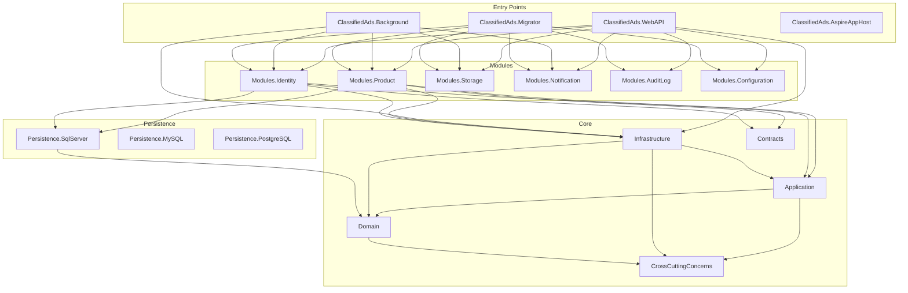

# 01 - Solution Structure

> **Purpose**: Understand the project organization, dependencies between projects, and folder conventions used throughout the codebase.

---

## Table of Contents

- [Project Overview](#project-overview)
- [Project Dependency Graph](#project-dependency-graph)
- [Host/Entry Point Projects](#hostentry-point-projects)
- [Core/Shared Projects](#coreshared-projects)
- [Module Projects](#module-projects)
- [Persistence Projects](#persistence-projects)
- [Test Projects](#test-projects)
- [Configuration & Infrastructure Files](#configuration--infrastructure-files)

---

## Project Overview

The solution follows a **Modular Monolith** architecture where the codebase is organized into:

1. **Entry Points** - Host applications (WebAPI, Background Workers, Migrator)
2. **Core/Shared Projects** - Domain, Application, Infrastructure, Contracts
3. **Modules** - Feature-specific vertical slices (Product, Identity, Storage, etc.)
4. **Persistence** - Database provider implementations

```
ClassifiedAds.ModularMonolith/
├── ClassifiedAds.WebAPI/                 # ASP.NET Core Web API host
├── ClassifiedAds.Background/             # Background worker service
├── ClassifiedAds.Migrator/               # Database migration runner
├── ClassifiedAds.AspireAppHost/          # .NET Aspire orchestration
│
├── ClassifiedAds.Application/            # CQRS handlers, Dispatcher, services
├── ClassifiedAds.Domain/                 # Entities, Events, Repository interfaces
├── ClassifiedAds.Infrastructure/         # Messaging, Caching, Logging implementations
├── ClassifiedAds.Contracts/              # Shared interfaces and DTOs
├── ClassifiedAds.CrossCuttingConcerns/   # Utilities (CSV, PDF, Excel, etc.)
│
├── ClassifiedAds.Modules.Product/        # Product module (sample domain)
├── ClassifiedAds.Modules.Identity/       # Identity & user management
├── ClassifiedAds.Modules.Storage/        # File storage
├── ClassifiedAds.Modules.Notification/   # Email, SMS, Web notifications
├── ClassifiedAds.Modules.AuditLog/       # Audit logging
├── ClassifiedAds.Modules.Configuration/  # Application configuration
│
├── ClassifiedAds.Persistence.SqlServer/  # SQL Server EF Core implementation
├── ClassifiedAds.Persistence.MySQL/      # MySQL EF Core implementation
├── ClassifiedAds.Persistence.PostgreSQL/ # PostgreSQL EF Core implementation
│
├── ClassifiedAds.Modules.Product.UnitTests/
├── ClassifiedAds.Modules.Product.IntegrationTests/
├── ClassifiedAds.Modules.Product.EndToEndTests/
└── ClassifiedAds.Migrator.Tests/
```

### Where in code?

- Solution file: [ClassifiedAds.ModularMonolith.slnx](../ClassifiedAds.ModularMonolith.slnx)

---

## Project Dependency Graph



---

## Host/Entry Point Projects

### ClassifiedAds.WebAPI

**Type**: ASP.NET Core Web API  
**Responsibility**: Main HTTP API host. Composes all modules, configures authentication, Swagger, CORS, and SignalR.

```csharp
// ClassifiedAds.WebAPI/Program.cs (composition root)
services
    .AddAuditLogModule(opt => configuration.GetSection("Modules:AuditLog").Bind(opt))
    .AddConfigurationModule(opt => configuration.GetSection("Modules:Configuration").Bind(opt))
    .AddIdentityModuleCore(opt => configuration.GetSection("Modules:Identity").Bind(opt))
    .AddNotificationModule(opt => configuration.GetSection("Modules:Notification").Bind(opt))
    .AddProductModule(opt => configuration.GetSection("Modules:Product").Bind(opt))
    .AddStorageModule(opt => configuration.GetSection("Modules:Storage").Bind(opt))
    .AddApplicationServices();
```

**Where in code?**: [ClassifiedAds.WebAPI/Program.cs](../ClassifiedAds.WebAPI/Program.cs)

---

### ClassifiedAds.Background

**Type**: .NET Worker Service  
**Responsibility**: Hosts background jobs including outbox publishing, email/SMS sending, and message bus consumers.

```csharp
// ClassifiedAds.Background/Program.cs
static void AddHostedServices(IServiceCollection services)
{
    services.AddHostedServicesIdentityModule();
    services.AddHostedServicesNotificationModule();
    services.AddHostedServicesProductModule();
    services.AddHostedServicesStorageModule();
}
```

**Where in code?**: [ClassifiedAds.Background/Program.cs](../ClassifiedAds.Background/Program.cs)

---

### ClassifiedAds.Migrator

**Type**: .NET Worker Service  
**Responsibility**: Runs EF Core migrations for all modules plus DbUp scripts.

```csharp
// ClassifiedAds.Migrator/Program.cs
app.MigrateAuditLogDb();
app.MigrateConfigurationDb();
app.MigrateIdentityDb();
app.MigrateNotificationDb();
app.MigrateProductDb();
app.MigrateStorageDb();
```

**Where in code?**: [ClassifiedAds.Migrator/Program.cs](../ClassifiedAds.Migrator/Program.cs)

---

### ClassifiedAds.AspireAppHost

**Type**: .NET Aspire AppHost  
**Responsibility**: Orchestrates all services for local development with service discovery and dashboards.

```csharp
// ClassifiedAds.AspireAppHost/Program.cs
var builder = DistributedApplication.CreateBuilder(args);

var migrator = builder.AddProject<Projects.ClassifiedAds_Migrator>("ClassifiedAds-Migrator");
var background = builder.AddProject<Projects.ClassifiedAds_Background>("ClassifiedAds-Background");
var webApi = builder.AddProject<Projects.ClassifiedAds_WebAPI>("ClassifiedAds-WebAPI");
```

**Where in code?**: [ClassifiedAds.AspireAppHost/Program.cs](../ClassifiedAds.AspireAppHost/Program.cs)

---

## Core/Shared Projects

### ClassifiedAds.Domain

**Layer**: Domain (innermost)  
**Responsibility**: Contains entity base classes, domain events, repository interfaces, and messaging abstractions. Has no external dependencies except CrossCuttingConcerns.

| Component | Description |
|-----------|-------------|
| `Entity<TKey>` | Base class for all entities with Id, RowVersion, timestamps |
| `IAggregateRoot` | Marker interface for aggregate roots |
| `IDomainEvent` | Base interface for domain events |
| `IRepository<T, TKey>` | Repository abstraction |
| `IUnitOfWork` | Transaction management abstraction |
| `IMessageBus` | Message bus abstraction |

**Where in code?**: [ClassifiedAds.Domain/](../ClassifiedAds.Domain/)

---

### ClassifiedAds.Application

**Layer**: Application  
**Responsibility**: CQRS infrastructure with `Dispatcher`, command/query handlers, `CrudService`, and handler decorators.

| Component | Description |
|-----------|-------------|
| `Dispatcher` | Routes commands, queries, and events to handlers |
| `ICommand`, `ICommandHandler<T>` | Command pattern interfaces |
| `IQuery<T>`, `IQueryHandler<TQuery, TResult>` | Query pattern interfaces |
| `ICrudService<T>` | Generic CRUD operations with event dispatch |
| Decorators | Cross-cutting concerns (AuditLog, DatabaseRetry) |

**Where in code?**: [ClassifiedAds.Application/](../ClassifiedAds.Application/)

---

### ClassifiedAds.Infrastructure

**Layer**: Infrastructure  
**Responsibility**: Implementations for external concerns: messaging, caching, logging, monitoring, storage, notifications.

| Folder | Description |
|--------|-------------|
| `Messaging/` | RabbitMQ, Kafka, Azure Service Bus implementations |
| `Caching/` | Redis, SQL Server, InMemory caching |
| `Logging/` | Serilog configuration |
| `Monitoring/` | OpenTelemetry, Application Insights |
| `Notification/` | Email (SendGrid, SMTP), SMS (Twilio) |
| `Storages/` | Azure Blob, AWS S3, Local file storage |

**Where in code?**: [ClassifiedAds.Infrastructure/](../ClassifiedAds.Infrastructure/)

---

### ClassifiedAds.Contracts

**Layer**: Shared Contracts  
**Responsibility**: Module-to-module interfaces and DTOs. Enables loose coupling between modules.

```csharp
// ClassifiedAds.Contracts/Identity/Services/ICurrentUser.cs
public interface ICurrentUser
{
    bool IsAuthenticated { get; }
    Guid UserId { get; }
}
```

**Where in code?**: [ClassifiedAds.Contracts/](../ClassifiedAds.Contracts/)

---

### ClassifiedAds.CrossCuttingConcerns

**Layer**: Utilities  
**Responsibility**: Helper libraries that can be used across all layers.

| Folder | Description |
|--------|-------------|
| `Csv/` | CSV reading/writing abstractions |
| `Excel/` | Excel file generation |
| `Pdf/` | PDF generation abstractions |
| `Html/` | HTML rendering |
| `DateTimes/` | DateTime provider abstraction |
| `Exceptions/` | Custom exception types |
| `Locks/` | Distributed locking |

**Where in code?**: [ClassifiedAds.CrossCuttingConcerns/](../ClassifiedAds.CrossCuttingConcerns/)

---

## Module Projects

Each module follows a **vertical slice** structure:

```
ClassifiedAds.Modules.{ModuleName}/
├── Authorization/           # Permission constants and policies
├── Commands/                # CQRS command handlers
├── ConfigurationOptions/    # Module-specific settings
├── Constants/               # Module constants
├── Controllers/             # API endpoints
├── Csv/                     # CSV import/export handlers
├── DbConfigurations/        # EF Core entity configurations
├── DTOs/                    # Data transfer objects
├── Entities/                # Domain entities (including OutboxMessage)
├── EventHandlers/           # Domain event handlers
├── HostedServices/          # Background workers (e.g., PublishEventWorker)
├── Html/                    # HTML export handlers
├── Migrations/              # EF Core migrations (if in module)
├── Models/                  # API models
├── OutBoxEventPublishers/   # Outbox message publishers
├── Pdf/                     # PDF export handlers
├── Persistence/             # DbContext, Repositories
├── Queries/                 # CQRS query handlers
├── RateLimiterPolicies/     # Rate limiting configuration
└── ServiceCollectionExtensions.cs  # DI registration
```

### Module List

| Module | Responsibility | Has DbContext | Has Outbox |
|--------|---------------|---------------|------------|
| **Product** | Sample business domain (product catalog) | ✅ `ProductDbContext` | ✅ |
| **Identity** | User/Role management, ASP.NET Identity | ✅ `IdentityDbContext` | ❌ |
| **Storage** | File upload/download, blob storage | ✅ `StorageDbContext` | ✅ |
| **Notification** | Email, SMS, Web push notifications | ✅ `NotificationDbContext` | ❌ |
| **AuditLog** | Centralized audit logging | ✅ `AuditLogDbContext` | ❌ |
| **Configuration** | Application configuration entries | ✅ `ConfigurationDbContext` | ❌ |

**Where in code?**: [ClassifiedAds.Modules.Product/](../ClassifiedAds.Modules.Product/) (reference implementation)

---

## Persistence Projects

### ClassifiedAds.Persistence.SqlServer

**Responsibility**: Base EF Core implementation for SQL Server. Provides `DbContextUnitOfWork<T>` and `Repository<T, TKey>`.

```csharp
// ClassifiedAds.Persistence.SqlServer/DbContextUnitOfWork.cs
public class DbContextUnitOfWork<TDbContext> : DbContext, IUnitOfWork
    where TDbContext : DbContext
{
    public async Task<IDisposable> BeginTransactionAsync(
        IsolationLevel isolationLevel = IsolationLevel.ReadCommitted, 
        CancellationToken cancellationToken = default)
    {
        _dbContextTransaction = await Database.BeginTransactionAsync(isolationLevel, cancellationToken);
        return _dbContextTransaction;
    }

    public async Task CommitTransactionAsync(CancellationToken cancellationToken = default)
    {
        await _dbContextTransaction.CommitAsync(cancellationToken);
    }
}
```

**Where in code?**: [ClassifiedAds.Persistence.SqlServer/](../ClassifiedAds.Persistence.SqlServer/)

### Other Providers

- **MySQL**: [ClassifiedAds.Persistence.MySQL/](../ClassifiedAds.Persistence.MySQL/)
- **PostgreSQL**: [ClassifiedAds.Persistence.PostgreSQL/](../ClassifiedAds.Persistence.PostgreSQL/)

---

## Test Projects

| Project | Type | Scope |
|---------|------|-------|
| `ClassifiedAds.Modules.Product.UnitTests` | Unit Tests | Handler logic, domain logic |
| `ClassifiedAds.Modules.Product.IntegrationTests` | Integration Tests | Full module with test database |
| `ClassifiedAds.Modules.Product.EndToEndTests` | E2E Tests | Full API testing |
| `ClassifiedAds.Migrator.Tests` | Migration Tests | Database migration verification |

**Where in code?**: 
- [ClassifiedAds.Modules.Product.UnitTests/](../ClassifiedAds.Modules.Product.UnitTests/)
- [ClassifiedAds.Modules.Product.IntegrationTests/](../ClassifiedAds.Modules.Product.IntegrationTests/)
- [ClassifiedAds.Modules.Product.EndToEndTests/](../ClassifiedAds.Modules.Product.EndToEndTests/)

---

## Configuration & Infrastructure Files

| File | Purpose |
|------|---------|
| `docker-compose.yml` | Local development environment |
| `docker-compose.volumes.yml` | Persistent volume configuration |
| `azure-pipelines.yml` | Azure DevOps CI/CD pipeline |
| `Jenkinsfile` | Jenkins CI/CD pipeline |
| `global.json` | .NET SDK version pinning |

**Where in code?**: 
- [docker-compose.yml](../docker-compose.yml)
- [azure-pipelines.yml](../azure-pipelines.yml)
- [Jenkinsfile](../Jenkinsfile)
- [global.json](../global.json)

---

## Naming Conventions

| Convention | Example |
|------------|---------|
| Module projects | `ClassifiedAds.Modules.{ModuleName}` |
| DbContext | `{ModuleName}DbContext` |
| Repository | `{Entity}Repository` or `Repository<T, TKey>` |
| Command | `{Action}{Entity}Command` (e.g., `AddUpdateProductCommand`) |
| Query | `Get{Entity/Entities}Query` (e.g., `GetProductsQuery`) |
| Handler | `{Command/Query}Handler` |
| Event Handler | `{Entity}{Action}EventHandler` |
| Controller | `{Entities}Controller` |
| Service Extension | `ServiceCollectionExtensions.cs` |

---

*Next: [02 - Architecture Overview](02-architecture-overview.md)*
