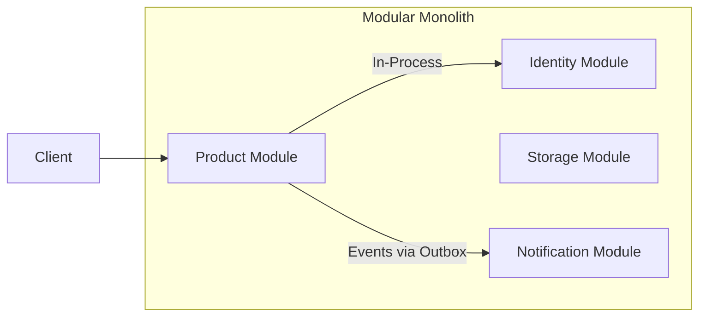
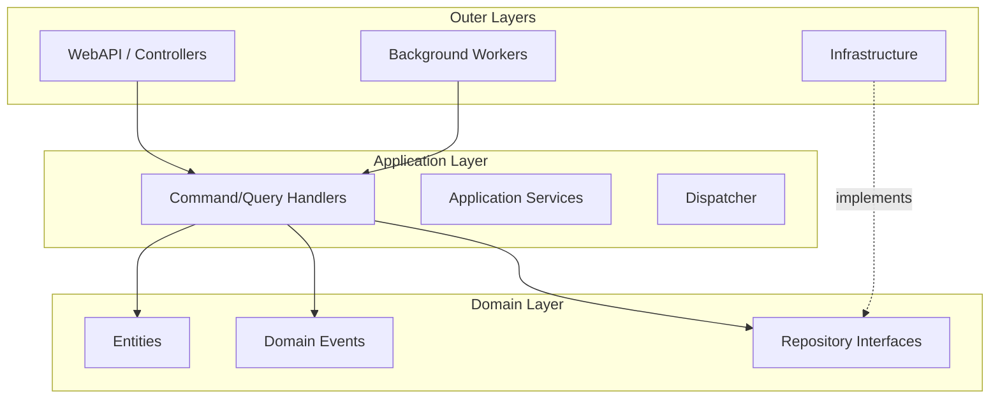
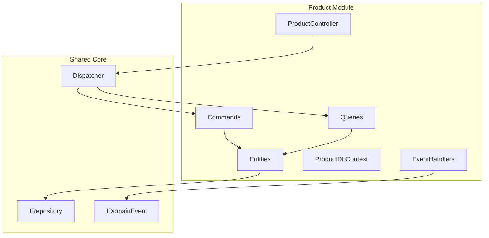
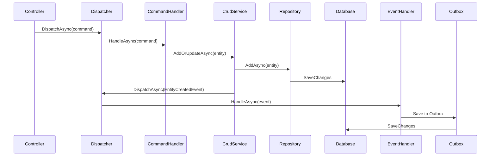
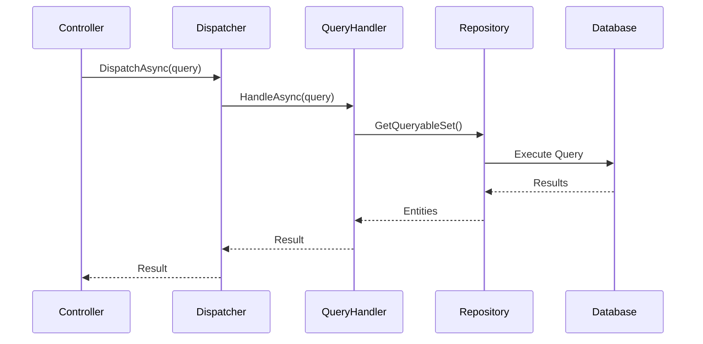
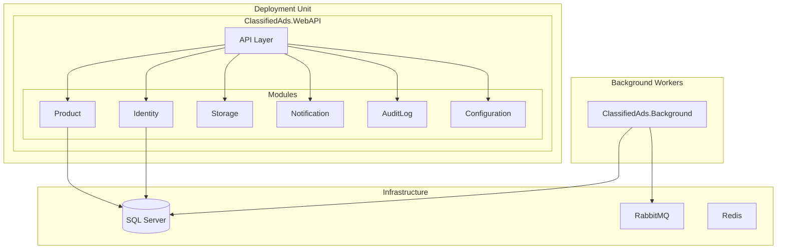

# 02 - Architecture Overview

> **Purpose**: Understand the high-level architecture, design principles, and layering strategy used in this Modular Monolith.

---

## Table of Contents

- [Architecture Style](#architecture-style)
- [Design Principles](#design-principles)
- [Layered Architecture](#layered-architecture)
- [Module Boundaries](#module-boundaries)
- [Key Architectural Patterns](#key-architectural-patterns)
- [Data Flow Overview](#data-flow-overview)
- [Deployment View](#deployment-view)

---

## Architecture Style

This codebase implements a **Modular Monolith** architecture—a single deployable unit organized into well-defined modules with clear boundaries.

### Why Modular Monolith?

| Benefit | Description |
|---------|-------------|
| **Simplicity** | Single deployment unit, simpler DevOps than microservices |
| **Bounded Contexts** | Modules encapsulate business capabilities with explicit boundaries |
| **Refactoring Path** | Can extract modules to microservices if needed |
| **Transactional Integrity** | In-process calls enable ACID transactions when needed |
| **Lower Latency** | No network hops between modules |



---

## Design Principles

### 1. **Module Autonomy**

Each module:
- Has its own `DbContext` (database per module pattern within a single database)
- Defines its own entities, commands, queries, and event handlers
- Registers itself via extension methods (`services.AddProductModule()`)

### 2. **Dependency Inversion**

- Domain layer has no dependencies on infrastructure
- Repository interfaces defined in Domain, implemented in Persistence
- Abstractions in `ClassifiedAds.Contracts` enable module communication

### 3. **Explicit Module Communication**

- **Synchronous**: Via shared contracts (`IUserService`, `ICurrentUser`)
- **Asynchronous**: Via domain events + outbox pattern + message bus

### 4. **CQRS Segregation**

- Commands mutate state (no return value expected)
- Queries read state (no side effects)
- Separate handler classes for each

### 5. **Event-Driven for Cross-Cutting Concerns**

- Domain events trigger audit logging, notifications, and external integrations
- Outbox pattern ensures reliable event delivery

---

## Layered Architecture

The solution uses a Clean Architecture variant adapted for modular monolith:



### Layer Responsibilities

| Layer | Project(s) | Responsibility |
|-------|------------|----------------|
| **Domain** | `ClassifiedAds.Domain` | Entities, domain events, repository interfaces |
| **Application** | `ClassifiedAds.Application` | CQRS handlers, Dispatcher, application services |
| **Infrastructure** | `ClassifiedAds.Infrastructure`, `Persistence.*` | External concerns: DB, messaging, caching |
| **Presentation** | `ClassifiedAds.WebAPI`, module Controllers | HTTP endpoints, request/response handling |
| **Modules** | `ClassifiedAds.Modules.*` | Vertical slices combining all layers for a domain |

### Where in code?

```
Layers (inner to outer):

1. Domain (no external dependencies)
   └── ClassifiedAds.Domain/
       ├── Entities/Entity.cs
       ├── Events/IDomainEvent.cs
       └── Repositories/IRepository.cs

2. Application (depends on Domain)
   └── ClassifiedAds.Application/
       ├── ICommandHandler.cs
       └── Common/Dispatcher.cs

3. Infrastructure (depends on Application, Domain)
   └── ClassifiedAds.Infrastructure/
       ├── Messaging/
       ├── Caching/
       └── Monitoring/

4. Modules (vertical slices)
   └── ClassifiedAds.Modules.Product/
       ├── Controllers/     (Presentation)
       ├── Commands/        (Application)
       ├── Queries/         (Application)
       ├── Entities/        (Domain)
       ├── Persistence/     (Infrastructure)
       └── EventHandlers/   (Application)
```

---

## Module Boundaries

### Module Structure

Each module is self-contained with explicit boundaries:



### Module Registration Pattern

Each module provides an extension method for DI registration:

```csharp
// ClassifiedAds.Modules.Product/ServiceCollectionExtensions.cs
public static IServiceCollection AddProductModule(
    this IServiceCollection services, 
    Action<ProductModuleOptions> configureOptions)
{
    var settings = new ProductModuleOptions();
    configureOptions(settings);

    services.Configure(configureOptions);

    // DbContext
    services.AddDbContext<ProductDbContext>(options => 
        options.UseNpgsql(settings.ConnectionStrings.Default));

    // Repositories
    services
        .AddScoped<IRepository<Product, Guid>, Repository<Product, Guid>>()
        .AddScoped<IProductRepository, ProductRepository>()
        .AddScoped<IRepository<AuditLogEntry, Guid>, Repository<AuditLogEntry, Guid>>()
        .AddScoped<IRepository<OutboxMessage, Guid>, Repository<OutboxMessage, Guid>>();

    // Message handlers (commands, queries, events)
    services.AddMessageHandlers(Assembly.GetExecutingAssembly());

    // Authorization policies
    services.AddAuthorizationPolicies(Assembly.GetExecutingAssembly());

    return services;
}
```

**Where in code?**: [ClassifiedAds.Modules.Product/ServiceCollectionExtensions.cs](../ClassifiedAds.Modules.Product/ServiceCollectionExtensions.cs)

---

## Key Architectural Patterns

### Pattern Summary

| Pattern | Implementation | Purpose |
|---------|---------------|---------|
| **CQRS** | Custom `Dispatcher` | Separate read/write models |
| **Repository** | `IRepository<T, TKey>` | Abstract data access |
| **Unit of Work** | `IUnitOfWork` | Transaction management |
| **Domain Events** | `IDomainEvent` + handlers | Decouple side effects |
| **Outbox** | `OutboxMessage` entity | Reliable event publishing |
| **Decorator** | `AuditLogCommandDecorator` | Cross-cutting concerns |
| **Options** | `*ModuleOptions` classes | Typed configuration |

### Clean Architecture Compliance

```
┌─────────────────────────────────────────────────────────────┐
│                    Presentation Layer                       │
│  (Controllers, Models, API Endpoints)                       │
├─────────────────────────────────────────────────────────────┤
│                    Application Layer                        │
│  (Commands, Queries, Handlers, Services, Dispatcher)        │
├─────────────────────────────────────────────────────────────┤
│                    Domain Layer                             │
│  (Entities, Events, Repository Interfaces, Value Objects)   │
├─────────────────────────────────────────────────────────────┤
│                    Infrastructure Layer                     │
│  (EF Core, Messaging, Caching, External Services)           │
└─────────────────────────────────────────────────────────────┘

Dependencies flow INWARD (outer layers depend on inner layers)
```

---

## Data Flow Overview

### Command Flow (Write)



### Query Flow (Read)



---

## Deployment View

### Single Deployment Unit

All modules are compiled into a single deployable unit (WebAPI), but maintain logical separation:



### Container Deployment (Docker)

```yaml
# docker-compose.yml services
services:
  webapi:        # Main API
  background:    # Background workers
  migrator:      # Database migrations
  identityserver: # OAuth2/OIDC provider
  db:            # SQL Server
  rabbitmq:      # Message broker
  mailhog:       # SMTP testing
```

**Where in code?**: [docker-compose.yml](../docker-compose.yml)

---

## Architecture Decision Records

### ADR-001: Modular Monolith over Microservices

**Context**: Need architecture that supports bounded contexts without microservices complexity.

**Decision**: Implement as Modular Monolith with module-per-DbContext pattern.

**Consequences**: 
- Simpler deployment and operations
- Can evolve to microservices if needed
- Requires discipline to maintain module boundaries

### ADR-002: Custom Dispatcher over MediatR

**Context**: Need CQRS dispatcher with full control over handler resolution.

**Decision**: Implement custom `Dispatcher` class instead of using MediatR.

**Consequences**:
- Full control over handler discovery and decoration
- No external dependency for core pattern
- Must maintain dispatcher code ourselves

### ADR-003: Outbox Pattern for Event Delivery

**Context**: Need reliable event delivery with transactional consistency.

**Decision**: Implement outbox pattern with per-module `OutboxMessage` tables.

**Consequences**:
- Guaranteed at-least-once delivery
- Events written in same transaction as domain changes
- Requires background worker for publishing

---

*Previous: [01 - Solution Structure](01-solution-structure.md) | Next: [03 - Request Lifecycle](03-request-lifecycle.md)*
