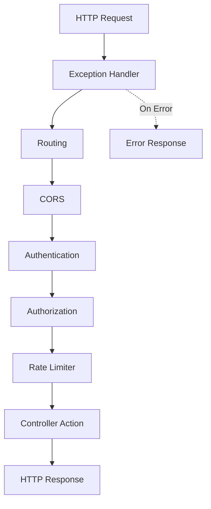
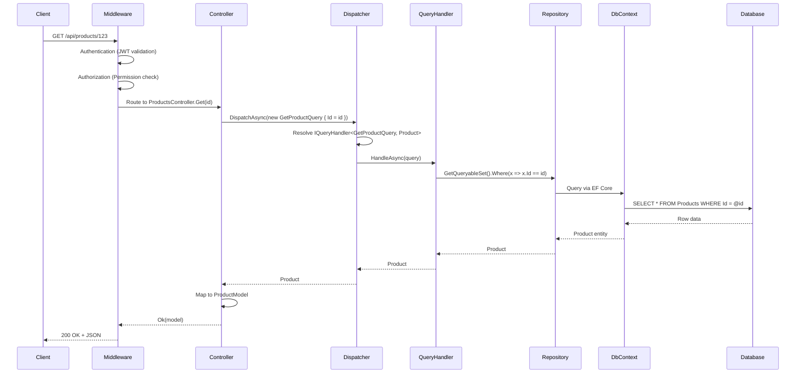
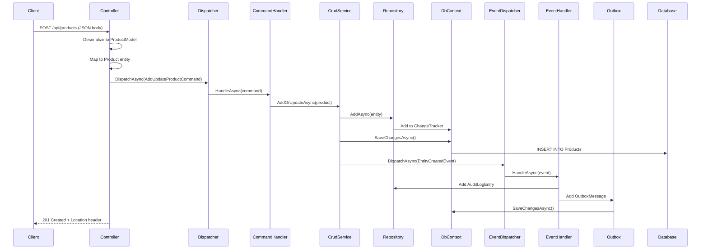
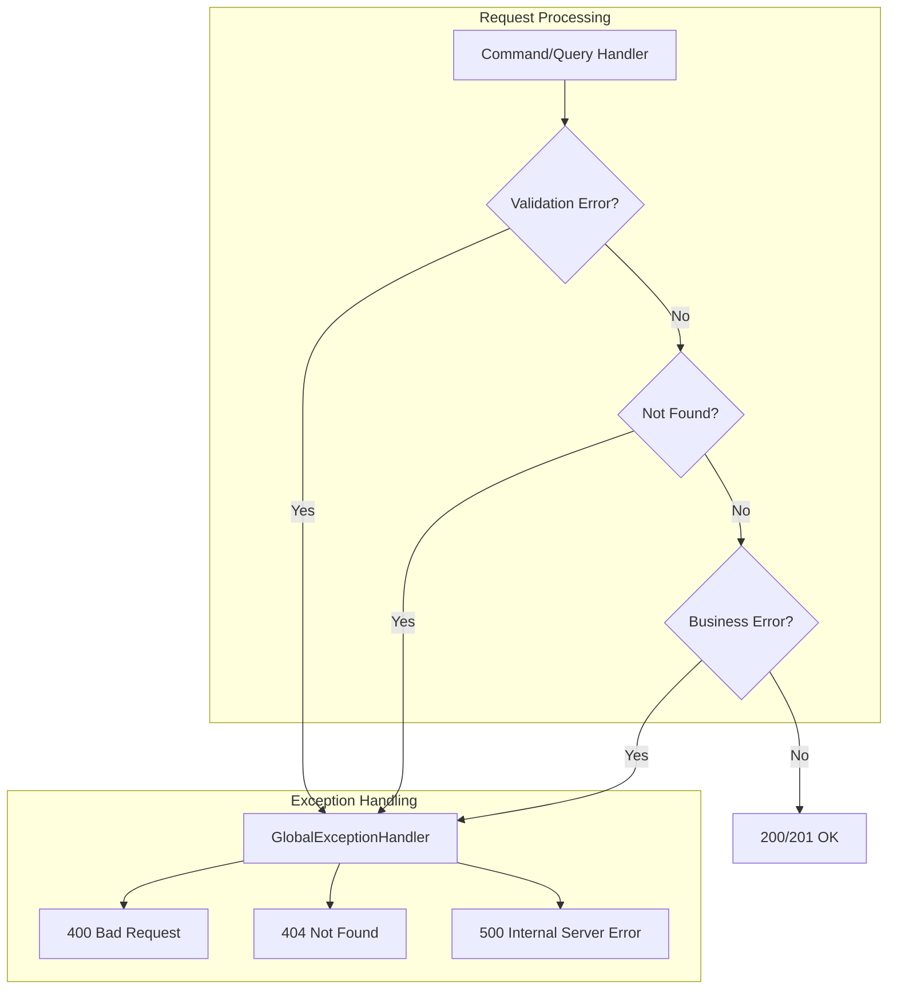

# 03 - Request Lifecycle

> **Purpose**: Trace the complete journey of an HTTP request from the moment it hits the API to the response being returned, including all middleware, dispatching, and data access.

---

## Table of Contents

- [Overview](#overview)
- [HTTP Pipeline](#http-pipeline)
- [Complete Request Flow](#complete-request-flow)
- [Read Request (Query)](#read-request-query)
- [Write Request (Command)](#write-request-command)
- [Error Handling](#error-handling)
- [Request Lifecycle Hooks](#request-lifecycle-hooks)

---

## Overview

Every HTTP request in this application flows through a well-defined pipeline:

```
Client → Kestrel → Middleware Stack → Controller → Dispatcher → Handler → Repository → Database
```

The key components involved:
1. **ASP.NET Core Middleware** - Authentication, CORS, Exception handling
2. **Controller** - HTTP endpoint, request validation
3. **Dispatcher** - Routes to appropriate Command/Query handler
4. **Handler** - Business logic execution
5. **Repository/DbContext** - Data access
6. **Domain Events** - Side effects (audit, notifications)

---

## HTTP Pipeline

### Middleware Order

The middleware is configured in [ClassifiedAds.WebAPI/Program.cs](../ClassifiedAds.WebAPI/Program.cs):

```csharp
// Configure the HTTP request pipeline.
var app = builder.Build();

app.UseDebuggingMiddleware();          // Custom debugging (dev only)

if (app.Environment.IsDevelopment())
{
    app.UseDeveloperExceptionPage();
}

app.UseExceptionHandler(options => { }); // Global exception handling
app.UseRouting();                        // Endpoint routing
app.UseCors(...);                        // CORS policy
app.UseSwagger();                        // OpenAPI spec
app.UseSwaggerUI(...);                   // Swagger UI
app.UseAuthentication();                 // JWT validation
app.UseAuthorization();                  // Permission checks
app.UseRateLimiter();                    // Rate limiting

app.MapControllers();                    // Controller endpoints
app.MapHub<NotificationHub>("/hubs/notification"); // SignalR
```

### Pipeline Visualization



---

## Complete Request Flow

### Example: GET /api/products/{id}



---

## Read Request (Query)

### Controller Entry Point

```csharp
// ClassifiedAds.Modules.Product/Controllers/ProductsController.cs
[Authorize(Permissions.GetProduct)]
[HttpGet("{id}")]
[ProducesResponseType(StatusCodes.Status200OK)]
[ProducesResponseType(StatusCodes.Status404NotFound)]
public async Task<ActionResult<Entities.Product>> Get(Guid id)
{
    var product = await _dispatcher.DispatchAsync(
        new GetProductQuery { Id = id, ThrowNotFoundIfNull = true });
    var model = product.ToModel();
    return Ok(model);
}
```

**Where in code?**: [ClassifiedAds.Modules.Product/Controllers/ProductsController.cs](../ClassifiedAds.Modules.Product/Controllers/ProductsController.cs)

### Dispatcher Routing

```csharp
// ClassifiedAds.Application/Common/Dispatcher.cs
public async Task<T> DispatchAsync<T>(IQuery<T> query, CancellationToken cancellationToken = default)
{
    Type type = typeof(IQueryHandler<,>);
    Type[] typeArgs = { query.GetType(), typeof(T) };
    Type handlerType = type.MakeGenericType(typeArgs);

    dynamic handler = _provider.GetService(handlerType);
    Task<T> result = handler.HandleAsync((dynamic)query, cancellationToken);

    return await result;
}
```

**Where in code?**: [ClassifiedAds.Application/Common/Dispatcher.cs](../ClassifiedAds.Application/Common/Dispatcher.cs)

### Query Handler

```csharp
// ClassifiedAds.Modules.Product/Queries/GetProductsQuery.cs
public class GetProductsQuery : IQuery<List<Entities.Product>>
{
}

public class GetProductsQueryHandler : IQueryHandler<GetProductsQuery, List<Entities.Product>>
{
    private readonly IProductRepository _productRepository;

    public GetProductsQueryHandler(IProductRepository productRepository)
    {
        _productRepository = productRepository;
    }

    public Task<List<Entities.Product>> HandleAsync(
        GetProductsQuery query, 
        CancellationToken cancellationToken = default)
    {
        return _productRepository.ToListAsync(_productRepository.GetQueryableSet());
    }
}
```

**Where in code?**: [ClassifiedAds.Modules.Product/Queries/GetProductsQuery.cs](../ClassifiedAds.Modules.Product/Queries/GetProductsQuery.cs)

---

## Write Request (Command)

### Example: POST /api/products



### Controller Entry Point

```csharp
// ClassifiedAds.Modules.Product/Controllers/ProductsController.cs
[Authorize(Permissions.AddProduct)]
[HttpPost]
[Consumes("application/json")]
[ProducesResponseType(StatusCodes.Status201Created)]
public async Task<ActionResult<Entities.Product>> Post([FromBody] ProductModel model)
{
    var product = model.ToEntity();
    await _dispatcher.DispatchAsync(new AddUpdateProductCommand { Product = product });
    model = product.ToModel();
    return Created($"/api/products/{model.Id}", model);
}
```

### Command Handler

```csharp
// ClassifiedAds.Modules.Product/Commands/AddUpdateProductCommand.cs
public class AddUpdateProductCommand : ICommand
{
    public Entities.Product Product { get; set; }
}

public class AddUpdateProductCommandHandler : ICommandHandler<AddUpdateProductCommand>
{
    private readonly ICrudService<Entities.Product> _productService;

    public AddUpdateProductCommandHandler(ICrudService<Entities.Product> productService)
    {
        _productService = productService;
    }

    public async Task HandleAsync(
        AddUpdateProductCommand command, 
        CancellationToken cancellationToken = default)
    {
        await _productService.AddOrUpdateAsync(command.Product, cancellationToken);
    }
}
```

**Where in code?**: [ClassifiedAds.Modules.Product/Commands/AddUpdateProductCommand.cs](../ClassifiedAds.Modules.Product/Commands/AddUpdateProductCommand.cs)

### CrudService with Event Dispatch

```csharp
// ClassifiedAds.Application/Common/Services/CrudService.cs
public async Task AddAsync(T entity, CancellationToken cancellationToken = default)
{
    await _repository.AddAsync(entity, cancellationToken);
    await _unitOfWork.SaveChangesAsync(cancellationToken);
    
    // Dispatch domain event AFTER save
    await _dispatcher.DispatchAsync(
        new EntityCreatedEvent<T>(entity, DateTime.UtcNow), 
        cancellationToken);
}
```

**Where in code?**: [ClassifiedAds.Application/Common/Services/CrudService.cs](../ClassifiedAds.Application/Common/Services/CrudService.cs)

### Domain Event Handler (Side Effects)

```csharp
// ClassifiedAds.Modules.Product/EventHandlers/ProductCreatedEventHandler.cs
public class ProductCreatedEventHandler : IDomainEventHandler<EntityCreatedEvent<Entities.Product>>
{
    private readonly ICurrentUser _currentUser;
    private readonly IRepository<AuditLogEntry, Guid> _auditLogRepository;
    private readonly IRepository<OutboxMessage, Guid> _outboxMessageRepository;

    public async Task HandleAsync(
        EntityCreatedEvent<Entities.Product> domainEvent, 
        CancellationToken cancellationToken = default)
    {
        // 1. Create audit log entry
        var auditLog = new AuditLogEntry
        {
            UserId = _currentUser.IsAuthenticated ? _currentUser.UserId : Guid.Empty,
            CreatedDateTime = domainEvent.EventDateTime,
            Action = "CREATED_PRODUCT",
            ObjectId = domainEvent.Entity.Id.ToString(),
            Log = domainEvent.Entity.AsJsonString(),
        };

        await _auditLogRepository.AddOrUpdateAsync(auditLog, cancellationToken);
        await _auditLogRepository.UnitOfWork.SaveChangesAsync(cancellationToken);

        // 2. Write to outbox for eventual publishing
        await _outboxMessageRepository.AddOrUpdateAsync(new OutboxMessage
        {
            EventType = EventTypeConstants.ProductCreated,
            TriggeredById = _currentUser.UserId,
            CreatedDateTime = domainEvent.EventDateTime,
            ObjectId = domainEvent.Entity.Id.ToString(),
            Payload = domainEvent.Entity.AsJsonString(),
        }, cancellationToken);

        await _outboxMessageRepository.UnitOfWork.SaveChangesAsync(cancellationToken);
    }
}
```

**Where in code?**: [ClassifiedAds.Modules.Product/EventHandlers/ProductCreatedEventHandler.cs](../ClassifiedAds.Modules.Product/EventHandlers/ProductCreatedEventHandler.cs)

---

## Error Handling

### Global Exception Handler

```csharp
// ClassifiedAds.Infrastructure/Web/ExceptionHandlers/GlobalExceptionHandler.cs
// Registered in Program.cs:
services.AddExceptionHandler<GlobalExceptionHandler>();
app.UseExceptionHandler(options => { });
```

### Exception Flow



### ValidationException Usage

```csharp
// ClassifiedAds.Application/Common/Services/CrudService.cs
public Task<T> GetByIdAsync(Guid id, CancellationToken cancellationToken = default)
{
    ValidationException.Requires(id != Guid.Empty, "Invalid Id");
    return _repository.FirstOrDefaultAsync(
        _repository.GetQueryableSet().Where(x => x.Id == id));
}
```

---

## Request Lifecycle Hooks

### Authentication & Current User

```csharp
// ClassifiedAds.Contracts/Identity/Services/ICurrentUser.cs
public interface ICurrentUser
{
    bool IsAuthenticated { get; }
    Guid UserId { get; }
}

// Registered in WebAPI:
services.AddScoped<ICurrentUser, CurrentWebUser>();
```

### Rate Limiting

```csharp
// Applied via attribute on controller
[EnableRateLimiting(RateLimiterPolicyNames.DefaultPolicy)]
[Authorize]
[Route("api/[controller]")]
public class ProductsController : ControllerBase
```

**Where in code?**: [ClassifiedAds.Modules.Product/RateLimiterPolicies/](../ClassifiedAds.Modules.Product/RateLimiterPolicies/)

### Authorization Policies

```csharp
// Permission-based authorization
[Authorize(Permissions.GetProducts)]
[HttpGet]
public async Task<ActionResult<IEnumerable<Entities.Product>>> Get()
{
    // ...
}

// Permission constants
// ClassifiedAds.Modules.Product/Authorization/Permissions.cs
public static class Permissions
{
    public const string GetProducts = "Permission:GetProducts";
    public const string GetProduct = "Permission:GetProduct";
    public const string AddProduct = "Permission:AddProduct";
    public const string UpdateProduct = "Permission:UpdateProduct";
    public const string DeleteProduct = "Permission:DeleteProduct";
    public const string GetProductAuditLogs = "Permission:GetProductAuditLogs";
}
```

**Where in code?**: [ClassifiedAds.Modules.Product/Authorization/Permissions.cs](../ClassifiedAds.Modules.Product/Authorization/Permissions.cs)

---

## Timing Diagram

```mermaid
gantt
    title Request Lifecycle Timing (Typical)
    dateFormat X
    axisFormat %L ms
    
    section Middleware
    Exception Handler    :0, 1
    Routing             :1, 2
    Authentication      :2, 5
    Authorization       :5, 7
    Rate Limiting       :7, 8
    
    section Controller
    Model Binding       :8, 10
    Dispatch Command    :10, 12
    
    section Handler
    Handler Logic       :12, 15
    Repository Query    :15, 25
    DB Execution        :25, 50
    Event Dispatch      :50, 55
    Outbox Write        :55, 60
    
    section Response
    Serialization       :60, 65
    Response Write      :65, 70
```



---

## Key Takeaways

1. **Single Entry Point**: All requests flow through the same middleware pipeline
2. **Dispatcher Pattern**: Commands and queries are dispatched via `Dispatcher`, not called directly
3. **Event-Driven Side Effects**: Domain events trigger audit logging and outbox writes
4. **Transaction Boundaries**: Each `SaveChangesAsync()` is a separate transaction
5. **Authorization at Controller Level**: Permission checks happen before handler execution

---

*Previous: [02 - Architecture Overview](02-architecture-overview.md) | Next: [04 - CQRS and Mediator](04-cqrs-and-mediator.md)*
