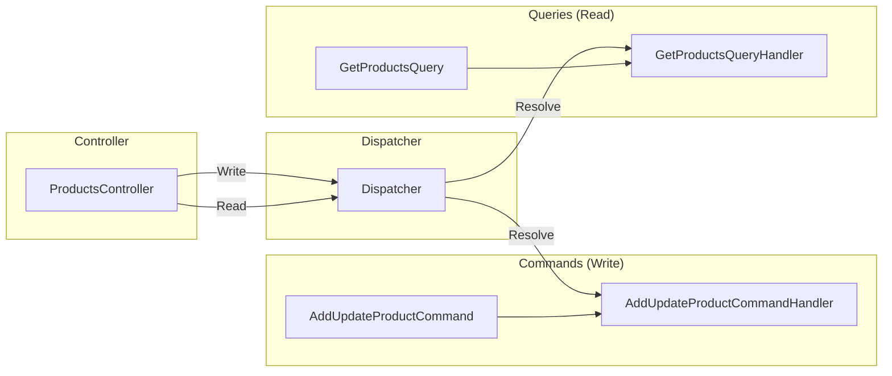
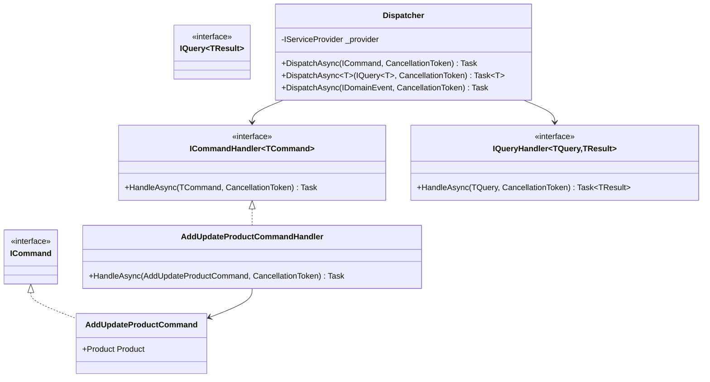

# 04 - CQRS and Mediator

> **Purpose**: Understand the Command Query Responsibility Segregation (CQRS) implementation, the custom Dispatcher pattern, and how to create commands, queries, and their handlers.

---

## Table of Contents

- [Overview](#overview)
- [Why Custom Dispatcher?](#why-custom-dispatcher)
- [Core Interfaces](#core-interfaces)
- [The Dispatcher](#the-dispatcher)
- [Commands](#commands)
- [Queries](#queries)
- [Handler Registration](#handler-registration)
- [Generic CRUD Handlers](#generic-crud-handlers)
- [Handler Decorators](#handler-decorators)
- [Best Practices](#best-practices)

---

## Overview

This codebase implements **CQRS** (Command Query Responsibility Segregation) using a custom `Dispatcher` class instead of MediatR or similar libraries.



---

## Why Custom Dispatcher?

| Aspect | Custom Dispatcher | MediatR |
|--------|-------------------|---------|
| **Dependencies** | Zero external packages | NuGet dependency |
| **Control** | Full control over resolution | Library conventions |
| **Decorators** | Custom attribute-based | Pipeline behaviors |
| **Learning Curve** | Codebase-specific | Industry standard |
| **Flexibility** | Modify as needed | Limited by library |

The decision to use a custom Dispatcher was made to:
1. Avoid external dependencies for core patterns
2. Have full control over handler discovery and decoration
3. Integrate tightly with the module registration system

---

## Core Interfaces

### ICommand

```csharp
// ClassifiedAds.Application/ICommandHandler.cs
namespace ClassifiedAds.Application;

// Marker interface for commands (no generic parameter - commands don't return data)
public interface ICommand
{
}
```

### ICommandHandler

```csharp
// ClassifiedAds.Application/ICommandHandler.cs
public interface ICommandHandler<TCommand>
    where TCommand : ICommand
{
    Task HandleAsync(TCommand command, CancellationToken cancellationToken = default);
}
```

**Where in code?**: [ClassifiedAds.Application/ICommandHandler.cs](../ClassifiedAds.Application/ICommandHandler.cs)

### IQuery

```csharp
// ClassifiedAds.Application/Common/Queries/IQuery.cs
public interface IQuery<TResult>
{
}
```

**Where in code?**: [ClassifiedAds.Application/Common/Queries/IQuery.cs](../ClassifiedAds.Application/Common/Queries/IQuery.cs)

### IQueryHandler

```csharp
// ClassifiedAds.Application/Common/Queries/IQueryHandler.cs
public interface IQueryHandler<TQuery, TResult>
    where TQuery : IQuery<TResult>
{
    Task<TResult> HandleAsync(TQuery query, CancellationToken cancellationToken = default);
}
```

**Where in code?**: [ClassifiedAds.Application/Common/Queries/IQueryHandler.cs](../ClassifiedAds.Application/Common/Queries/IQueryHandler.cs)

---

## The Dispatcher

The `Dispatcher` class is the central routing mechanism for commands, queries, and domain events.

```csharp
// ClassifiedAds.Application/Common/Dispatcher.cs
public class Dispatcher
{
    private readonly IServiceProvider _provider;
    private static List<Type> _eventHandlers = new List<Type>();

    public static void RegisterEventHandlers(Assembly assembly, IServiceCollection services)
    {
        var types = assembly.GetTypes()
            .Where(x => x.GetInterfaces().Any(y => 
                y.IsGenericType && 
                y.GetGenericTypeDefinition() == typeof(IDomainEventHandler<>)))
            .ToList();

        foreach (var type in types)
        {
            services.AddTransient(type);
        }

        _eventHandlers.AddRange(types);
    }

    public Dispatcher(IServiceProvider provider)
    {
        _provider = provider;
    }

    // Command dispatch (no return value)
    public async Task DispatchAsync(ICommand command, CancellationToken cancellationToken = default)
    {
        Type type = typeof(ICommandHandler<>);
        Type[] typeArgs = { command.GetType() };
        Type handlerType = type.MakeGenericType(typeArgs);

        dynamic handler = _provider.GetService(handlerType);
        await handler.HandleAsync((dynamic)command, cancellationToken);
    }

    // Query dispatch (returns result)
    public async Task<T> DispatchAsync<T>(IQuery<T> query, CancellationToken cancellationToken = default)
    {
        Type type = typeof(IQueryHandler<,>);
        Type[] typeArgs = { query.GetType(), typeof(T) };
        Type handlerType = type.MakeGenericType(typeArgs);

        dynamic handler = _provider.GetService(handlerType);
        Task<T> result = handler.HandleAsync((dynamic)query, cancellationToken);

        return await result;
    }

    // Domain event dispatch (multiple handlers possible)
    public async Task DispatchAsync(IDomainEvent domainEvent, CancellationToken cancellationToken = default)
    {
        foreach (Type handlerType in _eventHandlers)
        {
            bool canHandleEvent = handlerType.GetInterfaces()
                .Any(x => x.IsGenericType
                    && x.GetGenericTypeDefinition() == typeof(IDomainEventHandler<>)
                    && x.GenericTypeArguments[0] == domainEvent.GetType());

            if (canHandleEvent)
            {
                dynamic handler = _provider.GetService(handlerType);
                await handler.HandleAsync((dynamic)domainEvent, cancellationToken);
            }
        }
    }
}
```

**Where in code?**: [ClassifiedAds.Application/Common/Dispatcher.cs](../ClassifiedAds.Application/Common/Dispatcher.cs)

### Dispatcher Registration

```csharp
// ClassifiedAds.Application/ApplicationServicesExtensions.cs
public static IServiceCollection AddApplicationServices(this IServiceCollection services)
{
    services.AddScoped<Dispatcher>();
    services.AddScoped(typeof(ICrudService<>), typeof(CrudService<>));
    return services;
}

// Extension method to get Dispatcher from IServiceProvider
public static Dispatcher GetDispatcher(this IServiceProvider provider)
{
    return provider.GetRequiredService<Dispatcher>();
}
```

**Where in code?**: [ClassifiedAds.Application/ApplicationServicesExtensions.cs](../ClassifiedAds.Application/ApplicationServicesExtensions.cs)

---

## Commands

### Command Definition

Commands represent intentions to change state. They should:
- Be named as verb + noun (e.g., `AddUpdateProductCommand`, `DeleteProductCommand`)
- Contain all data needed to execute the operation
- Not return domain data (use out parameters for generated IDs if needed)

```csharp
// ClassifiedAds.Modules.Product/Commands/AddUpdateProductCommand.cs
public class AddUpdateProductCommand : ICommand
{
    public Entities.Product Product { get; set; }
}
```

### Command Handler

```csharp
// ClassifiedAds.Modules.Product/Commands/AddUpdateProductCommand.cs
public class AddUpdateProductCommandHandler : ICommandHandler<AddUpdateProductCommand>
{
    private readonly ICrudService<Entities.Product> _productService;

    public AddUpdateProductCommandHandler(ICrudService<Entities.Product> productService)
    {
        _productService = productService;
    }

    public async Task HandleAsync(
        AddUpdateProductCommand command, 
        CancellationToken cancellationToken = default)
    {
        await _productService.AddOrUpdateAsync(command.Product, cancellationToken);
    }
}
```

**Where in code?**: [ClassifiedAds.Modules.Product/Commands/AddUpdateProductCommand.cs](../ClassifiedAds.Modules.Product/Commands/AddUpdateProductCommand.cs)

### Command with Side Effects

```csharp
// ClassifiedAds.Modules.Product/Commands/PublishEventsCommand.cs
public class PublishEventsCommand : ICommand
{
    public int SentEventsCount { get; set; }  // Out parameter pattern
}

public class PublishEventsCommandHandler : ICommandHandler<PublishEventsCommand>
{
    private readonly ILogger<PublishEventsCommandHandler> _logger;
    private readonly IRepository<OutboxMessage, Guid> _outboxMessageRepository;
    private readonly IMessageBus _messageBus;

    public async Task HandleAsync(
        PublishEventsCommand command, 
        CancellationToken cancellationToken = default)
    {
        var events = _outboxMessageRepository.GetQueryableSet()
            .Where(x => !x.Published)
            .OrderBy(x => x.CreatedDateTime)
            .Take(50)
            .ToList();

        foreach (var eventLog in events)
        {
            await _messageBus.SendAsync(new PublishingOutboxMessage
            {
                Id = eventLog.Id.ToString(),
                EventType = eventLog.EventType,
                Payload = eventLog.Payload,
            }, cancellationToken);

            eventLog.Published = true;
            await _outboxMessageRepository.UnitOfWork.SaveChangesAsync(cancellationToken);
        }

        command.SentEventsCount = events.Count;  // Set out parameter
    }
}
```

**Where in code?**: [ClassifiedAds.Modules.Product/Commands/PublishEventsCommand.cs](../ClassifiedAds.Modules.Product/Commands/PublishEventsCommand.cs)

---

## Queries

### Query Definition

Queries represent requests for data. They should:
- Be named as `Get{Entity/Entities}Query`
- Specify the return type via `IQuery<TResult>`
- Be side-effect free

```csharp
// ClassifiedAds.Modules.Product/Queries/GetProductsQuery.cs
public class GetProductsQuery : IQuery<List<Entities.Product>>
{
}

public class GetProductsQueryHandler : IQueryHandler<GetProductsQuery, List<Entities.Product>>
{
    private readonly IProductRepository _productRepository;

    public GetProductsQueryHandler(IProductRepository productRepository)
    {
        _productRepository = productRepository;
    }

    public Task<List<Entities.Product>> HandleAsync(
        GetProductsQuery query, 
        CancellationToken cancellationToken = default)
    {
        return _productRepository.ToListAsync(_productRepository.GetQueryableSet());
    }
}
```

**Where in code?**: [ClassifiedAds.Modules.Product/Queries/GetProductsQuery.cs](../ClassifiedAds.Modules.Product/Queries/GetProductsQuery.cs)

### Query with Parameters

```csharp
// ClassifiedAds.Modules.Product/Queries/GetProductQuery.cs (inferred pattern)
public class GetProductQuery : IQuery<Entities.Product>
{
    public Guid Id { get; set; }
    public bool ThrowNotFoundIfNull { get; set; }
}

public class GetProductQueryHandler : IQueryHandler<GetProductQuery, Entities.Product>
{
    private readonly IProductRepository _productRepository;

    public async Task<Entities.Product> HandleAsync(
        GetProductQuery query, 
        CancellationToken cancellationToken = default)
    {
        var product = await _productRepository.FirstOrDefaultAsync(
            _productRepository.GetQueryableSet().Where(x => x.Id == query.Id));
        
        if (product == null && query.ThrowNotFoundIfNull)
        {
            throw new NotFoundException($"Product {query.Id} not found");
        }
        
        return product;
    }
}
```

---

## Handler Registration

### Assembly Scanning

Handlers are automatically discovered and registered during module initialization:

```csharp
// ClassifiedAds.Application/ApplicationServicesExtensions.cs
public static IServiceCollection AddMessageHandlers(
    this IServiceCollection services, 
    Assembly assembly)
{
    var assemblyTypes = assembly.GetTypes();

    foreach (var type in assemblyTypes)
    {
        var handlerInterfaces = type.GetInterfaces()
           .Where(Utils.IsHandlerInterface)
           .ToList();

        if (handlerInterfaces.Any())
        {
            var handlerFactory = new HandlerFactory(type);
            foreach (var interfaceType in handlerInterfaces)
            {
                services.AddTransient(interfaceType, 
                    provider => handlerFactory.Create(provider, interfaceType));
            }
        }
    }

    // Register event handlers
    Dispatcher.RegisterEventHandlers(assembly, services);

    return services;
}
```

### Module Registration

```csharp
// ClassifiedAds.Modules.Product/ServiceCollectionExtensions.cs
public static IServiceCollection AddProductModule(
    this IServiceCollection services, 
    Action<ProductModuleOptions> configureOptions)
{
    // ... other registrations ...
    
    // Auto-register all handlers in this assembly
    services.AddMessageHandlers(Assembly.GetExecutingAssembly());
    
    return services;
}
```

**Where in code?**: [ClassifiedAds.Modules.Product/ServiceCollectionExtensions.cs](../ClassifiedAds.Modules.Product/ServiceCollectionExtensions.cs)

---

## Generic CRUD Handlers

The framework provides generic handlers for common CRUD operations:

```csharp
// ClassifiedAds.Application/ApplicationServicesExtensions.cs
var genericHandlerTypes = new[]
{
    typeof(GetEntititesQueryHandler<>),
    typeof(GetEntityByIdQueryHandler<>),
    typeof(AddOrUpdateEntityCommandHandler<>),
    typeof(DeleteEntityCommandHandler<>),
};

foreach (var aggregateRootType in aggregateRootTypes)
{
    foreach (var genericHandlerType in genericHandlerTypes)
    {
        var handlerType = genericHandlerType.MakeGenericType(aggregateRootType);
        var handlerInterfaces = handlerType.GetInterfaces();

        var handlerFactory = new HandlerFactory(handlerType);
        foreach (var interfaceType in handlerInterfaces)
        {
            services.AddTransient(interfaceType, 
                provider => handlerFactory.Create(provider, interfaceType));
        }
    }
}
```

This means every entity implementing `IAggregateRoot` automatically gets basic CRUD handlers.

---

## Handler Decorators

Decorators wrap handlers to add cross-cutting concerns without modifying handler code.

### AuditLogCommandDecorator

```csharp
// ClassifiedAds.Application/Decorators/AuditLog/AuditLogCommandDecorator.cs
[Mapping(Type = typeof(AuditLogAttribute))]
public class AuditLogCommandDecorator<TCommand> : ICommandHandler<TCommand>
    where TCommand : ICommand
{
    private readonly ICommandHandler<TCommand> _handler;

    public AuditLogCommandDecorator(ICommandHandler<TCommand> handler)
    {
        _handler = handler;
    }

    public async Task HandleAsync(TCommand command, CancellationToken cancellationToken = default)
    {
        var commandJson = JsonSerializer.Serialize(command);
        Console.WriteLine($"Command of type {command.GetType().Name}: {commandJson}");
        
        await _handler.HandleAsync(command, cancellationToken);
    }
}
```

**Where in code?**: [ClassifiedAds.Application/Decorators/AuditLog/AuditLogCommandDecorator.cs](../ClassifiedAds.Application/Decorators/AuditLog/AuditLogCommandDecorator.cs)

### Applying Decorators

Decorators are applied via attributes:

```csharp
// Apply to a command handler
[AuditLog]
public class SensitiveCommandHandler : ICommandHandler<SensitiveCommand>
{
    // ...
}
```

### Decorator Flow


**Where in code?**: [ClassifiedAds.Application/Decorators/](../ClassifiedAds.Application/Decorators/)

---

## Best Practices

### 1. One Handler Per File

```
Commands/
├── AddUpdateProductCommand.cs      # Contains both command + handler
├── DeleteProductCommand.cs
└── PublishEventsCommand.cs
```

### 2. Thin Controllers

Controllers should only:
1. Validate/bind the request
2. Dispatch the command/query
3. Map the response

```csharp
[HttpPost]
public async Task<ActionResult<ProductModel>> Post([FromBody] ProductModel model)
{
    var product = model.ToEntity();                              // Map
    await _dispatcher.DispatchAsync(new AddUpdateProductCommand  // Dispatch
    { 
        Product = product 
    });
    return Created($"/api/products/{product.Id}", product.ToModel()); // Return
}
```

### 3. Use CrudService for Simple Cases

For simple CRUD, leverage `ICrudService<T>` instead of writing custom handlers:

```csharp
public class AddUpdateProductCommandHandler : ICommandHandler<AddUpdateProductCommand>
{
    private readonly ICrudService<Product> _productService;
    
    public async Task HandleAsync(AddUpdateProductCommand command, CancellationToken ct)
    {
        await _productService.AddOrUpdateAsync(command.Product, ct);
    }
}
```

### 4. Query Handlers Should Be Read-Only

```csharp
public class GetProductsQueryHandler : IQueryHandler<GetProductsQuery, List<Product>>
{
    public Task<List<Product>> HandleAsync(GetProductsQuery query, CancellationToken ct)
    {
        // ✅ Read only - no modifications
        return _repository.ToListAsync(_repository.GetQueryableSet());
    }
}
```

### 5. Commands Should Not Return Domain Data

```csharp
// ✅ Good - command modifies the passed-in entity
public class AddUpdateProductCommand : ICommand
{
    public Product Product { get; set; }  // Modified in-place, caller has access
}

// ❌ Avoid - returning data from commands breaks CQRS separation
public class AddProductCommand : ICommand<Product>  // Don't do this
{
    public string Name { get; set; }
}
```

---

## Class Diagram



---

*Previous: [03 - Request Lifecycle](03-request-lifecycle.md) | Next: [05 - Persistence and Transactions](05-persistence-and-transactions.md)*
