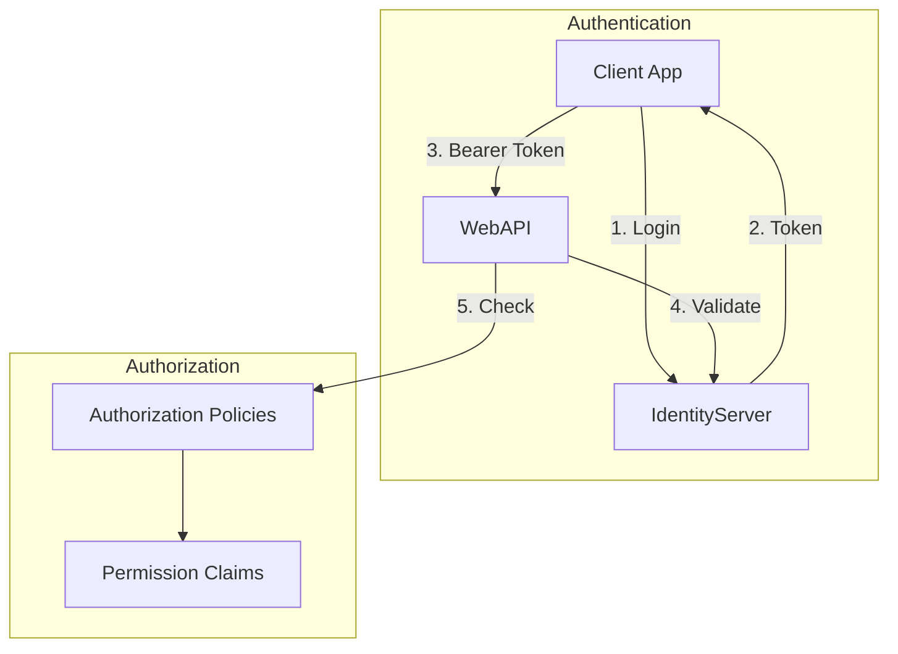
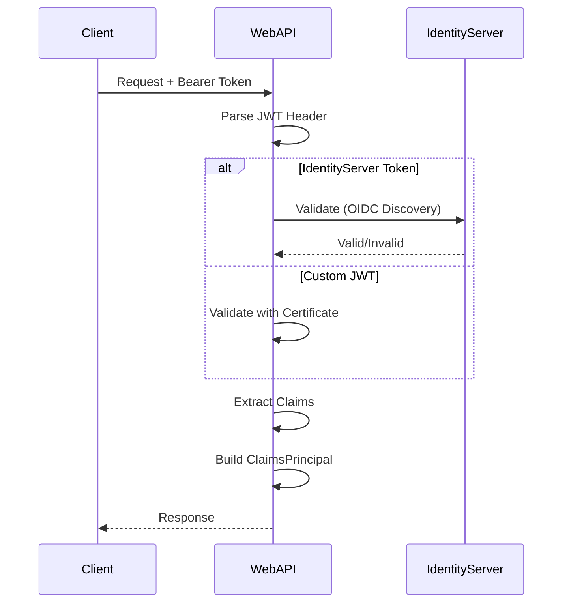
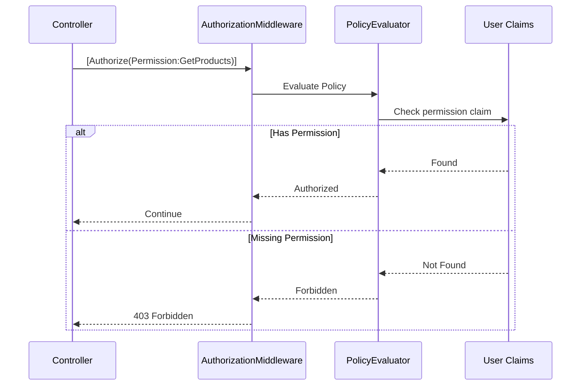

# 08 - Authentication & Authorization

> **Purpose**: Understand the authentication mechanisms, authorization policies, and identity management implemented in this application.

---

## Table of Contents

- [Overview](#overview)
- [Authentication Schemes](#authentication-schemes)
- [JWT Configuration](#jwt-configuration)
- [IdentityServer Integration](#identityserver-integration)
- [Current User Abstraction](#current-user-abstraction)
- [Authorization Policies](#authorization-policies)
- [Permission-Based Authorization](#permission-based-authorization)
- [External Identity Providers](#external-identity-providers)
- [Data Protection](#data-protection)

---

## Overview

The application supports multiple authentication schemes:

1. **IdentityServer (OpenIddict)** - OAuth2/OIDC provider for full identity scenarios
2. **Custom JWT** - Direct JWT validation for API-to-API scenarios
3. **ASP.NET Core Identity** - User/role management within Identity module



---

## Authentication Schemes

### Dual Scheme Configuration

```csharp
// ClassifiedAds.WebAPI/Program.cs
services.AddAuthentication(options =>
{
    options.DefaultScheme = appSettings.Authentication.Provider switch
    {
        "Jwt" => "Jwt",                              // Custom JWT
        _ => JwtBearerDefaults.AuthenticationScheme  // IdentityServer
    };
})
.AddJwtBearer(options =>
{
    // IdentityServer scheme (default)
    options.Authority = appSettings.Authentication.IdentityServer.Authority;
    options.Audience = appSettings.Authentication.IdentityServer.Audience;
    options.RequireHttpsMetadata = appSettings.Authentication.IdentityServer.RequireHttpsMetadata;
})
.AddJwtBearer("Jwt", options =>
{
    // Custom JWT scheme
    options.TokenValidationParameters = new TokenValidationParameters
    {
        ValidIssuer = appSettings.Authentication.Jwt.IssuerUri,
        ValidAudience = appSettings.Authentication.Jwt.Audience,
        TokenDecryptionKey = new X509SecurityKey(
            appSettings.Authentication.Jwt.TokenDecryptionCertificate.FindCertificate()),
        IssuerSigningKey = new X509SecurityKey(
            appSettings.Authentication.Jwt.IssuerSigningCertificate.FindCertificate()),
    };
});
```

**Where in code?**: [ClassifiedAds.WebAPI/Program.cs](../ClassifiedAds.WebAPI/Program.cs)

### Configuration

```json
{
  "Authentication": {
    "Provider": "IdentityServer",
    "IdentityServer": {
      "Authority": "https://localhost:44367",
      "Audience": "ClassifiedAds.WebAPI",
      "RequireHttpsMetadata": true
    },
    "Jwt": {
      "IssuerUri": "https://classifiedads.com",
      "Audience": "ClassifiedAds.WebAPI",
      "TokenDecryptionCertificate": {
        "StoreName": "My",
        "StoreLocation": "LocalMachine",
        "Thumbprint": "..."
      },
      "IssuerSigningCertificate": {
        "StoreName": "My",
        "StoreLocation": "LocalMachine",
        "Thumbprint": "..."
      }
    }
  }
}
```

---

## JWT Configuration

### Token Validation Flow



### JWT Claims Used

| Claim | Purpose |
|-------|---------|
| `sub` | User ID |
| `name` | Display name |
| `role` | User roles |
| `permission` | Permission claims |
| `scope` | OAuth2 scopes |

---

## IdentityServer Integration

### OpenIddict Setup

The Identity module integrates with a separate OpenIddict-based IdentityServer:

```yaml
# docker-compose.yml
identityserver:
  image: classifiedads.modularmonolith.identityserver
  build:
    context: ../IdentityServers/OpenIddict
  ports:
    - "9000:80"
```

### Swagger OAuth2 Configuration

```csharp
// ClassifiedAds.WebAPI/Program.cs
setupAction.AddSecurityDefinition("Oidc", new OpenApiSecurityScheme
{
    Type = SecuritySchemeType.OAuth2,
    Flows = new OpenApiOAuthFlows
    {
        AuthorizationCode = new OpenApiOAuthFlow
        {
            TokenUrl = new Uri(authority + "/connect/token"),
            AuthorizationUrl = new Uri(authority + "/connect/authorize"),
            Scopes = new Dictionary<string, string>
            {
                { "openid", "OpenId" },
                { "profile", "Profile" },
                { "ClassifiedAds.WebAPI", "ClassifiedAds WebAPI" },
            },
        },
        ClientCredentials = new OpenApiOAuthFlow
        {
            TokenUrl = new Uri(authority + "/connect/token"),
            Scopes = new Dictionary<string, string>
            {
                { "ClassifiedAds.WebAPI", "ClassifiedAds WebAPI" },
            },
        },
    },
});
```

---

## Current User Abstraction

### ICurrentUser Interface

```csharp
// ClassifiedAds.Contracts/Identity/Services/ICurrentUser.cs
public interface ICurrentUser
{
    bool IsAuthenticated { get; }
    Guid UserId { get; }
}
```

**Where in code?**: [ClassifiedAds.Contracts/Identity/Services/ICurrentUser.cs](../ClassifiedAds.Contracts/Identity/Services/ICurrentUser.cs)

### Web Implementation

```csharp
// ClassifiedAds.Modules.Identity/Services/CurrentWebUser.cs
public class CurrentWebUser : ICurrentUser
{
    private readonly IHttpContextAccessor _httpContextAccessor;

    public CurrentWebUser(IHttpContextAccessor httpContextAccessor)
    {
        _httpContextAccessor = httpContextAccessor;
    }

    public bool IsAuthenticated => 
        _httpContextAccessor.HttpContext?.User?.Identity?.IsAuthenticated ?? false;

    public Guid UserId
    {
        get
        {
            var sub = _httpContextAccessor.HttpContext?.User?.FindFirstValue("sub");
            return Guid.TryParse(sub, out var userId) ? userId : Guid.Empty;
        }
    }
}
```

### Background Worker Implementation

```csharp
// ClassifiedAds.Background/Identity/CurrentUser.cs
public class CurrentUser : ICurrentUser
{
    public bool IsAuthenticated => false;
    public Guid UserId => Guid.Empty;
}
```

### Registration

```csharp
// WebAPI
services.AddSingleton<IHttpContextAccessor, HttpContextAccessor>();
services.AddScoped<ICurrentUser, CurrentWebUser>();

// Background
services.AddScoped<ICurrentUser, CurrentUser>();
```

---

## Authorization Policies

### Policy-Based Authorization

Controllers use the `[Authorize]` attribute with policies:

```csharp
// ClassifiedAds.Modules.Product/Controllers/ProductsController.cs
[Authorize(Permissions.GetProducts)]
[HttpGet]
public async Task<ActionResult<IEnumerable<Entities.Product>>> Get()
{
    // ...
}

[Authorize(Permissions.AddProduct)]
[HttpPost]
public async Task<ActionResult<Entities.Product>> Post([FromBody] ProductModel model)
{
    // ...
}
```

### Permission Constants

```csharp
// ClassifiedAds.Modules.Product/Authorization/Permissions.cs
public static class Permissions
{
    public const string GetProducts = "Permission:GetProducts";
    public const string GetProduct = "Permission:GetProduct";
    public const string AddProduct = "Permission:AddProduct";
    public const string UpdateProduct = "Permission:UpdateProduct";
    public const string DeleteProduct = "Permission:DeleteProduct";
    public const string GetProductAuditLogs = "Permission:GetProductAuditLogs";
}
```

**Where in code?**: [ClassifiedAds.Modules.Product/Authorization/Permissions.cs](../ClassifiedAds.Modules.Product/Authorization/Permissions.cs)

### Policy Registration

```csharp
// ClassifiedAds.Modules.Product/ServiceCollectionExtensions.cs
services.AddAuthorizationPolicies(Assembly.GetExecutingAssembly());
```

The `AddAuthorizationPolicies` extension scans the assembly for permission constants and registers them as policies.

---

## Permission-Based Authorization

### Authorization Flow



### JWT with Permission Claims

```json
{
  "sub": "user-guid-here",
  "name": "John Doe",
  "permission": [
    "Permission:GetProducts",
    "Permission:GetProduct",
    "Permission:AddProduct"
  ],
  "exp": 1735257600
}
```

### Custom Authorization Handler (Optional)

For complex scenarios, implement `IAuthorizationHandler`:

```csharp
public class PermissionAuthorizationHandler : AuthorizationHandler<PermissionRequirement>
{
    protected override Task HandleRequirementAsync(
        AuthorizationHandlerContext context,
        PermissionRequirement requirement)
    {
        if (context.User.HasClaim("permission", requirement.Permission))
        {
            context.Succeed(requirement);
        }
        return Task.CompletedTask;
    }
}
```

---

## External Identity Providers

### Auth0 Integration

```csharp
// ClassifiedAds.Modules.Identity/ServiceCollectionExtensions.cs
if (settings.Providers?.Auth0?.Enabled ?? false)
{
    services.AddSingleton(new Auth0IdentityProvider(settings.Providers.Auth0));
}
```

**Where in code?**: [ClassifiedAds.Modules.Identity/IdentityProviders/Auth0/](../ClassifiedAds.Modules.Identity/IdentityProviders/Auth0/)

### Azure AD B2C Integration

```csharp
if (settings.Providers?.Azure?.Enabled ?? false)
{
    services.AddSingleton(new AzureIdentityProvider(settings.Providers.Azure));
}
```

**Where in code?**: [ClassifiedAds.Modules.Identity/IdentityProviders/Azure/](../ClassifiedAds.Modules.Identity/IdentityProviders/Azure/)

### Configuration

```json
{
  "Modules": {
    "Identity": {
      "Providers": {
        "Auth0": {
          "Enabled": true,
          "Domain": "your-tenant.auth0.com",
          "ClientId": "...",
          "ClientSecret": "...",
          "Audience": "..."
        },
        "Azure": {
          "Enabled": false,
          "TenantId": "...",
          "ClientId": "...",
          "ClientSecret": "..."
        }
      }
    }
  }
}
```

---

## Data Protection

### Key Storage

Data protection keys are stored in the Identity database:

```csharp
// ClassifiedAds.WebAPI/Program.cs
services.AddDataProtection()
    .PersistKeysToDbContext<IdentityDbContext>()
    .SetApplicationName("ClassifiedAds");
```

**Where in code?**: [ClassifiedAds.WebAPI/Program.cs](../ClassifiedAds.WebAPI/Program.cs)

### Purpose

Data protection is used for:
- Cookie encryption
- Anti-forgery tokens
- Temporary data encryption

---

## ASP.NET Core Identity

### User/Role Entities

```csharp
// ClassifiedAds.Modules.Identity/Entities/User.cs
public class User : Entity<Guid>, IAggregateRoot
{
    public string UserName { get; set; }
    public string Email { get; set; }
    public string PasswordHash { get; set; }
    // ... other Identity properties
}

// ClassifiedAds.Modules.Identity/Entities/Role.cs
public class Role : Entity<Guid>, IAggregateRoot
{
    public string Name { get; set; }
    public string NormalizedName { get; set; }
}
```

### Identity Configuration

```csharp
// ClassifiedAds.Modules.Identity/ServiceCollectionExtensions.cs
services.AddIdentity<User, Role>()
    .AddTokenProviders()
    .AddPasswordValidators();

services.AddTransient<IUserStore<User>, UserStore>();
services.AddTransient<IRoleStore<Role>, RoleStore>();

services.ConfigureApplicationCookie(options =>
{
    options.LoginPath = "/Account/Login";
});
```

**Where in code?**: [ClassifiedAds.Modules.Identity/ServiceCollectionExtensions.cs](../ClassifiedAds.Modules.Identity/ServiceCollectionExtensions.cs)

---

## Security Headers & CORS

### CORS Configuration

```csharp
// ClassifiedAds.WebAPI/Program.cs
services.AddCors(options =>
{
    options.AddPolicy("AllowedOrigins", builder => builder
        .WithOrigins(appSettings.CORS.AllowedOrigins)
        .AllowAnyMethod()
        .AllowAnyHeader());

    options.AddPolicy("SignalRHubs", builder => builder
        .WithOrigins(appSettings.CORS.AllowedOrigins)
        .AllowAnyHeader()
        .WithMethods("GET", "POST")
        .AllowCredentials());

    options.AddPolicy("AllowAnyOrigin", builder => builder
        .AllowAnyOrigin()
        .AllowAnyMethod()
        .AllowAnyHeader());
});

// Apply CORS
app.UseCors(appSettings.CORS.AllowAnyOrigin ? "AllowAnyOrigin" : "AllowedOrigins");

// SignalR with dedicated CORS
app.MapHub<NotificationHub>("/hubs/notification")
   .RequireCors("SignalRHubs");
```

---

## Rate Limiting

### Per-Controller Rate Limiting

```csharp
// ClassifiedAds.Modules.Product/Controllers/ProductsController.cs
[EnableRateLimiting(RateLimiterPolicyNames.DefaultPolicy)]
[Authorize]
[Route("api/[controller]")]
public class ProductsController : ControllerBase
```

### Policy Configuration

```csharp
// ClassifiedAds.Modules.Product/ServiceCollectionExtensions.cs
services.AddRateLimiter(options =>
{
    options.AddPolicy<string, DefaultRateLimiterPolicy>(
        RateLimiterPolicyNames.DefaultPolicy);
});
```

**Where in code?**: [ClassifiedAds.Modules.Product/RateLimiterPolicies/](../ClassifiedAds.Modules.Product/RateLimiterPolicies/)

---

## Security Summary

| Layer | Mechanism |
|-------|-----------|
| **Transport** | HTTPS required |
| **Authentication** | JWT Bearer (IdentityServer or Custom) |
| **Authorization** | Permission-based policies |
| **User Management** | ASP.NET Core Identity |
| **API Protection** | Rate limiting, CORS |
| **Data Protection** | Encrypted key storage |

---

*Previous: [07 - Modules](07-modules.md) | Next: [09 - Observability & Cross-Cutting](09-observability-and-crosscutting.md)*
