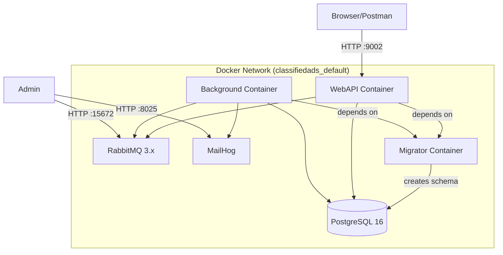
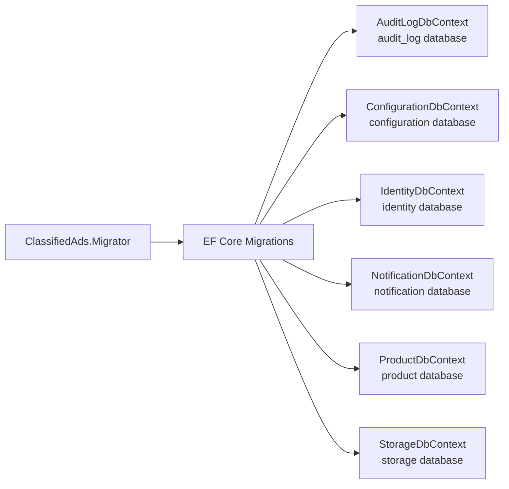
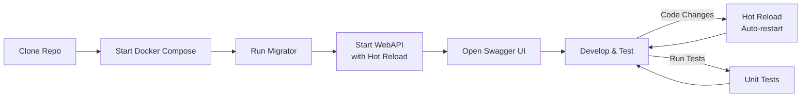

# 10 - Local Development

> **Purpose**: Comprehensive guide for running the application locally using Docker Compose, managing database migrations, and establishing an efficient development workflow.

---

## Table of Contents

- [Prerequisites](#prerequisites)
- [Quick Start](#quick-start)
- [Docker Compose](#docker-compose)
- [Database Migrations](#database-migrations)
- [Environment Configuration](#environment-configuration)
- [Development Workflow](#development-workflow)
- [Running Tests Locally](#running-tests-locally)
- [Troubleshooting](#troubleshooting)

---

## Prerequisites

| Requirement | Version | Purpose | Installation |
|-------------|---------|---------|--------------|
| .NET SDK | 10.0+ | Build and run applications | [Download](https://dotnet.microsoft.com/download) |
| Docker Desktop | Latest | Run infrastructure services | [Download](https://docker.com/products/docker-desktop) |
| IDE | VS 2022+ or VS Code | Development and debugging | - |
| Git | Latest | Version control | [Download](https://git-scm.com/) |

### Verifying Prerequisites

```powershell
# Check .NET SDK version
dotnet --version
# Expected: 10.0.x

# Check Docker is running
docker info

# Check Docker Compose
docker compose version
```

---

## Quick Start

Get up and running in 5 minutes:

```powershell
# 1. Clone the repository (if not already done)
git clone https://github.com/your-org/ClassifiedAds.ModularMonolith.git
cd ClassifiedAds.ModularMonolith

# 2. Start infrastructure services (PostgreSQL, RabbitMQ, MailHog)
docker-compose up -d db rabbitmq mailhog

# 3. Wait for PostgreSQL to be ready (about 10-15 seconds)
docker-compose logs db | Select-String "ready to accept connections"

# 4. Run database migrations (creates all databases and schema)
dotnet run --project ClassifiedAds.Migrator

# 5. Start the WebAPI
dotnet run --project ClassifiedAds.WebAPI

# 6. (Optional) In a new terminal, start background workers
dotnet run --project ClassifiedAds.Background
```

### Service URLs

| Service | URL | Credentials | Purpose |
|---------|-----|-------------|---------|
| WebAPI (Swagger) | http://localhost:9002/swagger | - | REST API documentation and testing |
| RabbitMQ Management | http://localhost:15672 | guest / guest | Message queue monitoring |
| MailHog | http://localhost:8025 | - | Email testing (catches all outgoing emails) |
| PostgreSQL | localhost:5432 | postgres / (see .env) | Database |

---

## Docker Compose

### Architecture Overview



### docker-compose.yml Services

| Service | Image | Ports | Purpose |
|---------|-------|-------|---------|
| `db` | postgres:16 | 5432 | PostgreSQL database server |
| `rabbitmq` | rabbitmq:3-management | 5672, 15672 | Message broker with management UI |
| `mailhog` | mailhog/mailhog | 1025, 8025 | SMTP server for email testing |
| `migrator` | classifiedads-migrator | - | Database migration runner |
| `webapi` | classifiedads-webapi | 9002 | REST API server |
| `background` | classifiedads-background | - | Background job processor |

### Docker Commands Reference

```powershell
# ═══════════════════════════════════════════════════
# Starting Services
# ═══════════════════════════════════════════════════

# Start all services
docker-compose up -d

# Start only infrastructure (for local .NET development)
docker-compose up -d db rabbitmq mailhog

# Start specific service
docker-compose up -d webapi

# Start with rebuild
docker-compose up -d --build

# ═══════════════════════════════════════════════════
# Monitoring
# ═══════════════════════════════════════════════════

# View running services
docker-compose ps

# View all logs (follow mode)
docker-compose logs -f

# View logs for specific service
docker-compose logs -f webapi

# View last 100 lines
docker-compose logs --tail=100 webapi

# ═══════════════════════════════════════════════════
# Stopping Services
# ═══════════════════════════════════════════════════

# Stop all services (keeps data)
docker-compose down

# Stop and remove volumes (WARNING: deletes all data)
docker-compose down -v

# Stop specific service
docker-compose stop webapi

# ═══════════════════════════════════════════════════
# Rebuilding
# ═══════════════════════════════════════════════════

# Rebuild specific service
docker-compose build webapi

# Rebuild and restart
docker-compose up -d --build webapi

# Force rebuild without cache
docker-compose build --no-cache webapi
```

### Full Docker Compose Deployment

Deploy the entire stack with Docker (no local .NET required):

```powershell
# Build all images and start services
docker-compose up -d --build

# Watch the logs to ensure everything starts
docker-compose logs -f

# Verify all services are healthy
docker-compose ps

# Test the API
Invoke-RestMethod http://localhost:9002/health
```

---

## Database Migrations

The application uses EF Core migrations for schema management. Each module has its own DbContext and migrations.

### Migration Architecture



### Running Migrations

```powershell
# Run all migrations (recommended)
dotnet run --project ClassifiedAds.Migrator

# Run with specific environment
dotnet run --project ClassifiedAds.Migrator -- --environment Production

# Run with verbose logging
dotnet run --project ClassifiedAds.Migrator -- --verbose
```

**What the Migrator does**:
1. Creates databases if they don't exist
2. Applies pending EF Core migrations for each module
3. Runs DbUp scripts for additional data migrations
4. Logs progress and any errors

### Creating New Migrations

When you modify an entity, create a new migration:

```powershell
# Install dotnet-ef tool (one time)
dotnet tool install --global dotnet-ef --version="10.0"

# Create migration for Product module
dotnet ef migrations add AddNewProductField `
    --context ProductDbContext `
    --project ClassifiedAds.Modules.Product `
    --startup-project ClassifiedAds.Migrator `
    --output-dir Migrations/ProductDb

# Create migration for Identity module
dotnet ef migrations add AddUserProfileField `
    --context IdentityDbContext `
    --project ClassifiedAds.Modules.Identity `
    --startup-project ClassifiedAds.Migrator `
    --output-dir Migrations/IdentityDb
```

### Update Database via CLI

Apply migrations directly without running the full migrator:

```powershell
# Update Product database
dotnet ef database update `
    --context ProductDbContext `
    --project ClassifiedAds.Modules.Product `
    --startup-project ClassifiedAds.Migrator

# Update Identity database
dotnet ef database update `
    --context IdentityDbContext `
    --project ClassifiedAds.Modules.Identity `
    --startup-project ClassifiedAds.Migrator
```

### Reverting Migrations

```powershell
# Revert to specific migration
dotnet ef database update PreviousMigrationName `
    --context ProductDbContext `
    --project ClassifiedAds.Modules.Product `
    --startup-project ClassifiedAds.Migrator

# Remove last migration (if not applied)
dotnet ef migrations remove `
    --context ProductDbContext `
    --project ClassifiedAds.Modules.Product `
    --startup-project ClassifiedAds.Migrator
```

**Where in code?**: [ClassifiedAds.Migrator/Program.cs](../ClassifiedAds.Migrator/Program.cs)

---

## Environment Configuration

### Configuration Files Structure

Each application has its own configuration files:

```
ClassifiedAds.WebAPI/
├── appsettings.json              # Base configuration (checked in)
└── appsettings.Development.json  # Development overrides (checked in)

ClassifiedAds.Background/
├── appsettings.json
└── appsettings.Development.json

ClassifiedAds.Migrator/
├── appsettings.json
└── appsettings.Development.json
```

### Configuration Hierarchy

Configuration is loaded in this order (later sources override earlier):

```mermaid
graph TB
    Base[appsettings.json<br/>Base configuration] --> Env[appsettings.{Environment}.json<br/>Environment-specific]
    Env --> EnvVars[Environment Variables<br/>System/Docker]
    EnvVars --> Secrets[User Secrets<br/>Development only]
    Secrets --> CmdLine[Command Line Args<br/>Highest priority]
```

### .env File (Docker Compose)

The `.env` file provides configuration for Docker Compose deployments:

```env
# Environment
ASPNETCORE_ENVIRONMENT=Development
DOTNET_ENVIRONMENT=Development

# Messaging
Messaging__Provider=RabbitMQ
Messaging__RabbitMQ__HostName=rabbitmq
Messaging__RabbitMQ__UserName=guest
Messaging__RabbitMQ__Password=guest

# Storage
Storage__Provider=Local
Storage__Local__Path=/files

# Module Database Connection Strings (PostgreSQL)
Modules__AuditLog__ConnectionStrings__Default=Host=db;Port=5432;Database=ClassifiedAds_AuditLog;Username=postgres;Password=YOUR_PASSWORD
Modules__Configuration__ConnectionStrings__Default=Host=db;Port=5432;Database=ClassifiedAds_Configuration;Username=postgres;Password=YOUR_PASSWORD
Modules__Identity__ConnectionStrings__Default=Host=db;Port=5432;Database=ClassifiedAds_Identity;Username=postgres;Password=YOUR_PASSWORD
Modules__Notification__ConnectionStrings__Default=Host=db;Port=5432;Database=ClassifiedAds_Notification;Username=postgres;Password=YOUR_PASSWORD
Modules__Product__ConnectionStrings__Default=Host=db;Port=5432;Database=ClassifiedAds_Product;Username=postgres;Password=YOUR_PASSWORD
Modules__Storage__ConnectionStrings__Default=Host=db;Port=5432;Database=ClassifiedAds_Storage;Username=postgres;Password=YOUR_PASSWORD
```

**Where in code?**: [.env](../.env) (gitignored - use `.env.example` as template)

### Module Configuration Pattern

Each module has its own configuration section in `appsettings.json`:

```json
{
  "Modules": {
    "Product": {
      "ConnectionStrings": {
        "Default": "Host=127.0.0.1;Port=5432;Database=ClassifiedAds_Product;Username=postgres;Password=YOUR_PASSWORD"
      }
    },
    "Identity": {
      "ConnectionStrings": {
        "Default": "Host=127.0.0.1;Port=5432;Database=ClassifiedAds_Identity;Username=postgres;Password=YOUR_PASSWORD"
      }
    }
  },
  "Messaging": {
    "Provider": "RabbitMQ",
    "RabbitMQ": {
      "HostName": "localhost",
      "UserName": "guest",
      "Password": "guest",
      "Port": 5672
    }
  },
  "Notification": {
    "Email": {
      "Provider": "SmtpClient",
      "SmtpClient": {
        "Host": "localhost",
        "Port": 1025
      }
    }
  }
}
```

### Environment Variables Override

Override any configuration via environment variables using double underscore (`__`) for hierarchy:

```powershell
# PowerShell - Override database connection
$env:Modules__Product__ConnectionStrings__Default = "Host=127.0.0.1;Port=5432;..."

# PowerShell - Override messaging provider
$env:Messaging__Provider = "RabbitMQ"

# PowerShell - Override logging level
$env:Logging__LogLevel__Default = "Debug"

# Run with overrides
dotnet run --project ClassifiedAds.WebAPI
```

### User Secrets (Development Only)

Store sensitive values locally without committing them:

```powershell
# Initialize user secrets for a project
dotnet user-secrets init --project ClassifiedAds.WebAPI

# Set individual secrets
dotnet user-secrets set "Modules:Identity:Providers:Auth0:ClientSecret" "your-secret" --project ClassifiedAds.WebAPI
dotnet user-secrets set "Notification:Email:SendGrid:ApiKey" "your-api-key" --project ClassifiedAds.WebAPI

# List all secrets
dotnet user-secrets list --project ClassifiedAds.WebAPI

# Clear all secrets
dotnet user-secrets clear --project ClassifiedAds.WebAPI
```

---

## Development Workflow

### Recommended Development Flow



### Daily Workflow

```powershell
# 1. Start your day - ensure infrastructure is running
docker-compose up -d db rabbitmq mailhog

# 2. Start WebAPI with hot reload
dotnet watch run --project ClassifiedAds.WebAPI

# 3. Make changes, hot reload handles restarts automatically

# 4. Run tests before committing
dotnet test ClassifiedAds.UnitTests/ClassifiedAds.UnitTests.csproj

# 5. End of day - optionally stop Docker (data persists)
docker-compose stop
```

### Hot Reload Development

Hot reload automatically restarts the application when you save changes:

```powershell
# WebAPI with hot reload (recommended for development)
dotnet watch run --project ClassifiedAds.WebAPI

# Background worker with hot reload
dotnet watch run --project ClassifiedAds.Background

# With specific configuration
dotnet watch run --project ClassifiedAds.WebAPI --configuration Debug
```

**Hot Reload Supported Changes**:
- Method body changes
- Adding/modifying top-level statements
- Adding new classes
- Adding new methods
- Changing lambda expressions

**Hot Reload Limitations** (requires restart):
- Changing method signatures
- Adding/removing using statements
- Modifying assembly attributes

### Debugging

**Visual Studio**:
1. Set `ClassifiedAds.WebAPI` as startup project
2. Press F5 or click "Start Debugging"
3. Breakpoints work normally

**VS Code**:
1. Open the Run and Debug panel (Ctrl+Shift+D)
2. Select ".NET Core Launch (web)" configuration
3. Press F5 to start debugging

**Attaching to Docker Container**:
```powershell
# Find the process ID
docker exec -it classifiedads-webapi pidof dotnet

# Attach debugger (VS Code)
# Use "Docker: Attach to Node" or similar launch configuration
```

---

## Running Tests Locally

### Unit Tests

Fast, isolated tests that don't require Docker:

```powershell
# Run all unit tests
dotnet test ClassifiedAds.UnitTests/ClassifiedAds.UnitTests.csproj

# Run with detailed output
dotnet test ClassifiedAds.UnitTests/ClassifiedAds.UnitTests.csproj --verbosity normal

# Run in watch mode (TDD)
dotnet watch test --project ClassifiedAds.UnitTests/ClassifiedAds.UnitTests.csproj
```

### Integration Tests

Requires Docker Desktop for Testcontainers:

```powershell
# Ensure Docker is running
docker info

# Run integration tests (automatically starts PostgreSQL container)
dotnet test ClassifiedAds.IntegrationTests/ClassifiedAds.IntegrationTests.csproj

# Run with logs
dotnet test ClassifiedAds.IntegrationTests/ClassifiedAds.IntegrationTests.csproj --verbosity normal
```

### All Tests with Coverage

```powershell
# Run all tests with coverage
dotnet test ClassifiedAds.ModularMonolith.slnx `
    --collect:"XPlat Code Coverage" `
    --results-directory ./TestResults

# Generate HTML report
reportgenerator `
    -reports:"./TestResults/**/coverage.cobertura.xml" `
    -targetdir:"./TestResults/CoverageReport" `
    -reporttypes:Html

# Open report
start ./TestResults/CoverageReport/index.html
```

---

## Troubleshooting

### Docker Issues

| Issue | Cause | Solution |
|-------|-------|----------|
| Container won't start | Port already in use | `netstat -ano \| findstr :5432` and kill the process |
| Database connection refused | PostgreSQL not ready | Wait 10-15s or check `docker-compose logs db` |
| Out of disk space | Docker images accumulated | `docker system prune -a` |
| Container restarts constantly | Application crash | Check logs: `docker-compose logs -f webapi` |

### Migration Issues

| Issue | Cause | Solution |
|-------|-------|----------|
| Migration fails | Database doesn't exist | Ensure `db` container is running first |
| Connection refused | Wrong connection string | Check `.env` or `appsettings.Development.json` |
| Migration conflict | Multiple migrations | Review and resolve conflicts, or reset database |

### Development Issues

| Issue | Cause | Solution |
|-------|-------|----------|
| Hot reload not working | Unsupported change | Restart manually: Ctrl+C, then run again |
| Port already in use | Previous instance running | Kill the process or use different port |
| Changes not reflected | Browser caching | Hard refresh (Ctrl+F5) or clear cache |

### Resetting Everything

When things go wrong, start fresh:

```powershell
# Stop all containers and remove volumes
docker-compose down -v

# Remove all Docker artifacts (WARNING: affects all projects)
docker system prune -a

# Start fresh
docker-compose up -d db rabbitmq mailhog
dotnet run --project ClassifiedAds.Migrator
dotnet run --project ClassifiedAds.WebAPI
```

---

*Previous: [09 - Observability & Cross-Cutting](09-observability-and-crosscutting.md) | Next: [11 - Extension Playbook](11-extension-playbook.md)*

*Last updated: January 1, 2026*
