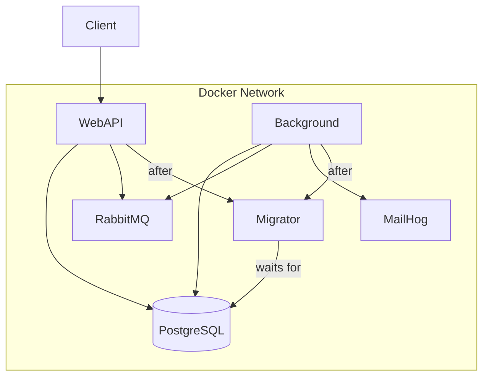
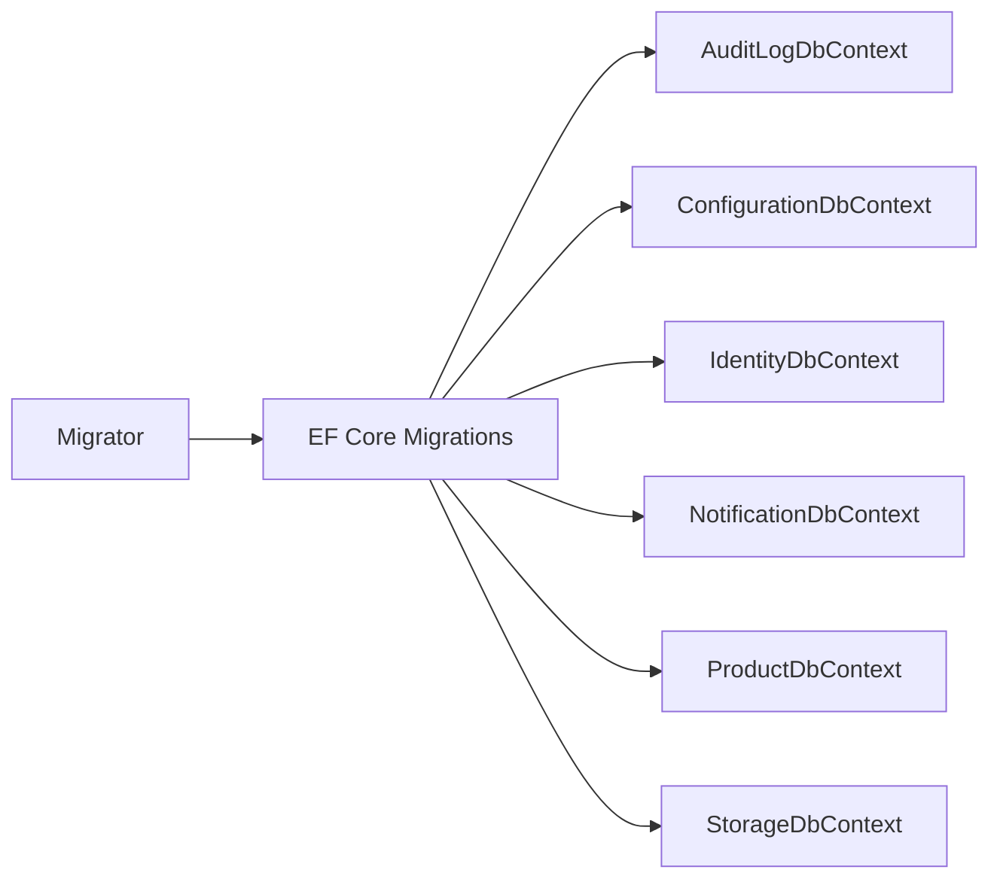
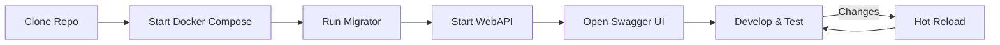

# 10 - Local Development

> **Purpose**: Understand how to run the application locally using Docker Compose and database migrations.

---

## Table of Contents

- [Prerequisites](#prerequisites)
- [Quick Start](#quick-start)
- [Docker Compose](#docker-compose)
- [Database Migrations](#database-migrations)
- [Environment Configuration](#environment-configuration)
- [Development Workflow](#development-workflow)

---

## Prerequisites

| Requirement | Version |
|-------------|---------|
| .NET SDK | 10.0+ |
| Docker Desktop | Latest |
| IDE | VS 2022+ or VS Code with C# Dev Kit |

---

## Quick Start

```powershell
# 1. Start infrastructure (PostgreSQL, RabbitMQ, MailHog)
docker-compose up -d db rabbitmq mailhog

# 2. Run migrations
dotnet run --project ClassifiedAds.Migrator

# 3. Start WebAPI
dotnet run --project ClassifiedAds.WebAPI

# 4. (Optional) Start background workers
dotnet run --project ClassifiedAds.Background
```

### Service URLs

| Service | URL | Credentials |
|---------|-----|-------------|
| WebAPI (Swagger) | http://localhost:9002/swagger | - |
| RabbitMQ Management | http://localhost:15672 | guest / guest |
| MailHog | http://localhost:8025 | - |
| PostgreSQL | localhost:5432 | postgres / <YOUR_PASSWORD> |

---

## Docker Compose

### Architecture



### docker-compose.yml Services

| Service | Image | Ports | Purpose |
|---------|-------|-------|---------|
| db | postgres:16 | 5432 | PostgreSQL database |
| rabbitmq | rabbitmq:3-management | 5672, 15672 | Message broker |
| mailhog | mailhog/mailhog | 1025, 8025 | Email testing |
| migrator | classifiedads.modularmonolith.migrator | - | Database migrations |
| webapi | classifiedads.modularmonolith.webapi | 9002 | REST API |
| background | classifiedads.modularmonolith.background | - | Background worker |

### Docker Commands

```powershell
# Start all services
docker-compose up -d

# Start only infrastructure
docker-compose up -d db rabbitmq mailhog

# View logs
docker-compose logs -f webapi

# Rebuild and restart specific service
docker-compose up -d --build webapi

# Stop all
docker-compose down

# Stop and remove volumes
docker-compose down -v
```

### Full Docker Compose Deployment

```powershell
# Build and start everything
docker-compose up -d --build

# Check running services
docker-compose ps

# View all logs
docker-compose logs -f
```

---

## Database Migrations

### Migration Strategy



### Running Migrations

```powershell
# Run migrator
dotnet run --project ClassifiedAds.Migrator

# With specific environment
dotnet run --project ClassifiedAds.Migrator -- --environment Production
```

### Creating New Migrations

```powershell
# Install dotnet-ef tool
dotnet tool install --global dotnet-ef --version="10.0"

# From solution root, create migration for Product module
dotnet ef migrations add AddNewProductField `
    --context ProductDbContext `
    --project ClassifiedAds.Modules.Product `
    --startup-project ClassifiedAds.Migrator `
    -o Migrations/ProductDb
```

### Update Database via CLI

```powershell
dotnet ef database update --context ProductDbContext --project ClassifiedAds.Migrator
```

**Where in code?**: [ClassifiedAds.Migrator/Program.cs](../ClassifiedAds.Migrator/Program.cs)

---

## Environment Configuration

### Configuration Files

```
ClassifiedAds.WebAPI/
├── appsettings.json              # Base configuration
└── appsettings.Development.json  # Development overrides

ClassifiedAds.Background/
├── appsettings.json
└── appsettings.Development.json

ClassifiedAds.Migrator/
├── appsettings.json
└── appsettings.Development.json
```

### Configuration Hierarchy

```mermaid
graph TB
    Base[appsettings.json] --> Env[appsettings.{Environment}.json]
    Env --> EnvVars[Environment Variables]
    EnvVars --> Secrets[User Secrets]
```

### .env File (Docker Compose)

```env
ASPNETCORE_ENVIRONMENT=Development
DOTNET_ENVIRONMENT=Development
Messaging__Provider=RabbitMQ
Messaging__RabbitMQ__HostName=rabbitmq
Storage__Provider=Local
Storage__Local__Path=/files
Modules__AuditLog__ConnectionStrings__Default=Host=db;Port=5432;Database=ClassifiedAds_AuditLog;Username=postgres;Password=<YOUR_PASSWORD>
Modules__Configuration__ConnectionStrings__Default=Host=db;Port=5432;Database=ClassifiedAds_Configuration;Username=postgres;Password=<YOUR_PASSWORD>
Modules__Identity__ConnectionStrings__Default=Host=db;Port=5432;Database=ClassifiedAds_Identity;Username=postgres;Password=<YOUR_PASSWORD>
Modules__Notification__ConnectionStrings__Default=Host=db;Port=5432;Database=ClassifiedAds_Notification;Username=postgres;Password=<YOUR_PASSWORD>
Modules__Product__ConnectionStrings__Default=Host=db;Port=5432;Database=ClassifiedAds_Product;Username=postgres;Password=<YOUR_PASSWORD>
Modules__Storage__ConnectionStrings__Default=Host=db;Port=5432;Database=ClassifiedAds_Storage;Username=postgres;Password=<YOUR_PASSWORD>
```

**Where in code?**: [.env](../.env)

### Module Configuration Pattern

```json
{
  "Modules": {
    "Product": {
      "ConnectionStrings": {
        "Default": "Host=127.0.0.1;Port=5432;Database=ClassifiedAds_Product;Username=postgres;Password=<YOUR_PASSWORD>",
        "MigrationsAssembly": "ClassifiedAds.Migrator"
      }
    }
  },
  "Messaging": {
    "Provider": "RabbitMQ",
    "RabbitMQ": {
      "HostName": "localhost",
      "UserName": "guest",
      "Password": "guest"
    }
  }
}
```

### Environment Variables Override

```powershell
# Override via environment variables (double underscore = colon)
$env:Modules__Product__ConnectionStrings__Default = "Host=127.0.0.1;Port=5432;..."
$env:Messaging__Provider = "RabbitMQ"
```

### User Secrets (Development)

```powershell
# Initialize user secrets
dotnet user-secrets init --project ClassifiedAds.WebAPI

# Set secret
dotnet user-secrets set "Modules:Identity:Providers:Auth0:ClientSecret" "secret-value" --project ClassifiedAds.WebAPI
```

---

## Development Workflow

### Recommended Flow



### Hot Reload

```powershell
# Run with hot reload
dotnet watch run --project ClassifiedAds.WebAPI
```

### Dockerfile Examples

**WebAPI Dockerfile** ([ClassifiedAds.WebAPI/Dockerfile](../ClassifiedAds.WebAPI/Dockerfile)):

```dockerfile
FROM mcr.microsoft.com/dotnet/aspnet:10.0 AS base
WORKDIR /app
EXPOSE 8080

FROM mcr.microsoft.com/dotnet/sdk:10.0 AS build
WORKDIR /src
COPY ["ClassifiedAds.WebAPI/ClassifiedAds.WebAPI.csproj", "ClassifiedAds.WebAPI/"]
# ... other project references
RUN dotnet restore "ClassifiedAds.WebAPI/ClassifiedAds.WebAPI.csproj"
COPY . .
WORKDIR "/src/ClassifiedAds.WebAPI"
RUN dotnet build -c Release -o /app/build

FROM build AS publish
RUN dotnet publish -c Release -o /app/publish

FROM base AS final
WORKDIR /app
COPY --from=publish /app/publish .
ENTRYPOINT ["dotnet", "ClassifiedAds.WebAPI.dll"]
```

---

*Previous: [09 - Observability & Cross-Cutting](09-observability-and-crosscutting.md) | Next: [11 - Extension Playbook](11-extension-playbook.md)*
