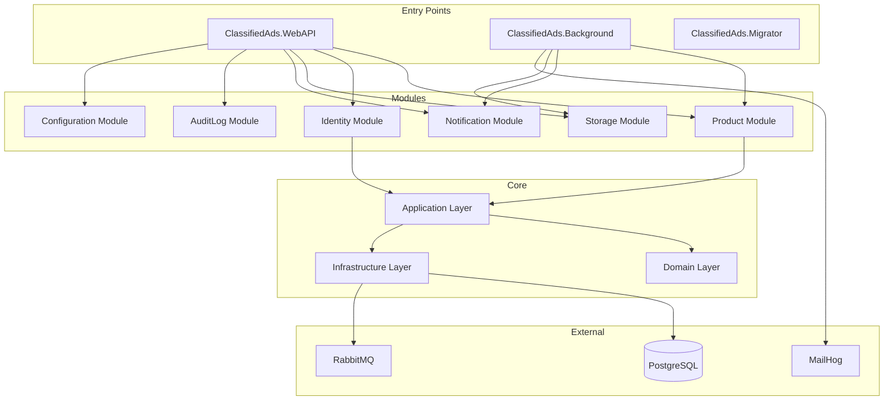

# ClassifiedAds Modular Monolith - Architecture Documentation

> **Purpose**: This documentation set provides a comprehensive technical reference for the ClassifiedAds Modular Monolith architecture. It is designed for developers, architects, and technical leads who need to understand, maintain, or extend this codebase.

---

## Table of Contents

| Document | Description |
|----------|-------------|
| [01 - Solution Structure](01-solution-structure.md) | Project organization, dependencies, and folder conventions |
| [02 - Architecture Overview](02-architecture-overview.md) | High-level architecture, layering, and design principles |
| [03 - Request Lifecycle](03-request-lifecycle.md) | HTTP request flow from controller to database and back |
| [04 - CQRS and Mediator](04-cqrs-and-mediator.md) | Command/Query separation pattern implementation |
| [05 - Persistence and Transactions](05-persistence-and-transactions.md) | EF Core usage, DbContext per module, Unit of Work |
| [06 - Events and Outbox](06-events-and-outbox.md) | Domain events, outbox pattern, and message bus integration |
| [07 - Modules](07-modules.md) | Module structure, boundaries, and inter-module communication |
| [08 - Authentication & Authorization](08-authentication-authorization.md) | JWT, IdentityServer, permissions, and policies |
| [09 - Observability & Cross-Cutting](09-observability-and-crosscutting.md) | Logging, tracing, metrics, caching, and health checks |
| [10 - Local Development](10-devops-and-local-development.md) | Docker Compose setup and database migrations |
| [11 - Extension Playbook](11-extension-playbook.md) | Step-by-step guides for common development tasks |
| [Appendix - Glossary](appendix-glossary.md) | Key terms and definitions used throughout this documentation |

---

## Quick Start

### Prerequisites

- .NET 10.0 SDK
- Docker Desktop (for local dependencies)

### Running Locally

```bash
# 1. Start infrastructure (PostgreSQL, RabbitMQ, MailHog)
docker-compose up -d db rabbitmq mailhog

# 2. Run database migrations
dotnet run --project ClassifiedAds.Migrator

# 3. Start the Web API
dotnet run --project ClassifiedAds.WebAPI

# 4. (Optional) Start background workers
dotnet run --project ClassifiedAds.Background
```

### Service URLs

| Service | URL |
|---------|-----|
| WebAPI (Swagger) | http://localhost:9002/swagger |
| RabbitMQ Management | http://localhost:15672 (guest/guest) |
| MailHog | http://localhost:8025 |

---

## Architecture at a Glance



---

## Key Design Decisions

| Decision | Choice | Rationale |
|----------|--------|-----------|
| **Architecture Style** | Modular Monolith | Balance between simplicity and bounded contexts; easier to deploy than microservices while maintaining module isolation |
| **CQRS Implementation** | Custom Dispatcher | Lightweight alternative to MediatR; full control over handler resolution and decorators |
| **Event Handling** | Outbox Pattern | Guarantees at-least-once delivery; transactional consistency between domain changes and event publishing |
| **Persistence** | EF Core with DbContext per Module | Module isolation; each module owns its data and schema |
| **Database** | PostgreSQL Only | Simplified setup for learning; uses Npgsql EF Core provider |
| **Messaging** | RabbitMQ | Reliable message broker for local development |
| **Observability** | OpenTelemetry + Serilog | Vendor-neutral tracing/metrics; rich structured logging |

---

## Technology Stack

| Category | Technology |
|----------|------------|
| **Framework** | .NET 10.0 |
| **Web Framework** | ASP.NET Core |
| **ORM** | Entity Framework Core 10.0 |
| **Database** | PostgreSQL (only provider) |
| **Message Broker** | RabbitMQ |
| **Email Testing** | MailHog |
| **Logging** | Serilog |
| **Tracing** | OpenTelemetry |
| **API Documentation** | Swashbuckle (OpenAPI/Swagger) |
| **Local Development** | Docker Compose |

---

## Where in Code?

| Concept | Location |
|---------|----------|
| Solution file | [ClassifiedAds.ModularMonolith.slnx](../ClassifiedAds.ModularMonolith.slnx) |
| Web API entry point | [ClassifiedAds.WebAPI/Program.cs](../ClassifiedAds.WebAPI/Program.cs) |
| Background worker entry point | [ClassifiedAds.Background/Program.cs](../ClassifiedAds.Background/Program.cs) |
| Migrator entry point | [ClassifiedAds.Migrator/Program.cs](../ClassifiedAds.Migrator/Program.cs) |
| CQRS Dispatcher | [ClassifiedAds.Application/Common/Dispatcher.cs](../ClassifiedAds.Application/Common/Dispatcher.cs) |
| Domain entities base | [ClassifiedAds.Domain/Entities/](../ClassifiedAds.Domain/Entities/) |
| Module example (Product) | [ClassifiedAds.Modules.Product/](../ClassifiedAds.Modules.Product/) |
| Docker Compose | [docker-compose.yml](../docker-compose.yml) |

---

## Contributing

When contributing to this codebase, please:

1. Follow the module structure conventions documented in [07 - Modules](07-modules.md)
2. Use the CQRS patterns described in [04 - CQRS and Mediator](04-cqrs-and-mediator.md)
3. Implement domain events using the outbox pattern per [06 - Events and Outbox](06-events-and-outbox.md)
4. Add appropriate observability per [09 - Observability & Cross-Cutting](09-observability-and-crosscutting.md)

---

*Generated from source code analysis. Last updated: December 28, 2025*
