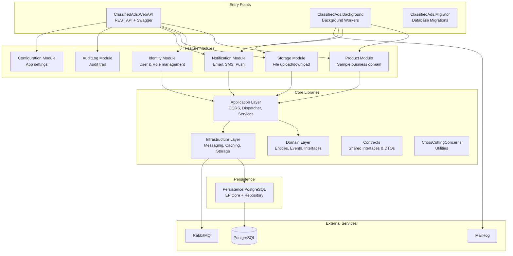

# ClassifiedAds Modular Monolith - Architecture Documentation

> **Purpose**: This documentation set provides a comprehensive technical reference for the ClassifiedAds Modular Monolith architecture. It is designed for developers, architects, and technical leads who need to understand, maintain, or extend this codebase.

---

## Table of Contents

| Document | Description |
|----------|-------------|
| [01 - Solution Structure](01-solution-structure.md) | Project organization, dependencies between projects, folder conventions, and naming standards |
| [02 - Architecture Overview](02-architecture-overview.md) | High-level architecture, layering strategy, design principles, and key architectural decisions |
| [03 - Request Lifecycle](03-request-lifecycle.md) | HTTP request flow from controller through handlers to database and response |
| [04 - CQRS and Mediator](04-cqrs-and-mediator.md) | Command/Query separation pattern implementation with custom Dispatcher |
| [05 - Persistence and Transactions](05-persistence-and-transactions.md) | EF Core usage, DbContext per module strategy, Unit of Work, and repository patterns |
| [06 - Events and Outbox](06-events-and-outbox.md) | Domain events, outbox pattern for reliable messaging, and message bus integration |
| [07 - Modules](07-modules.md) | Module structure, boundaries, responsibilities, and inter-module communication |
| [08 - Authentication & Authorization](08-authentication-authorization.md) | JWT authentication, permission system, policies, and security implementation |
| [09 - Observability & Cross-Cutting](09-observability-and-crosscutting.md) | Logging (Serilog), tracing (OpenTelemetry), metrics, caching, and health checks |
| [10 - Local Development](10-devops-and-local-development.md) | Docker Compose setup, database migrations, and local development workflow |
| [11 - Extension Playbook](11-extension-playbook.md) | Step-by-step guides for common development tasks (adding entities, commands, modules) |
| [Testing Guide](testing.md) | Test project structure, running tests, writing tests, and CI/CD integration |
| [Appendix - Glossary](appendix-glossary.md) | Key terms and definitions used throughout this documentation |

---

## Quick Start

### Prerequisites

| Requirement | Version | Purpose |
|-------------|---------|---------|
| .NET SDK | 10.0+ | Build and run the application |
| Docker Desktop | Latest | Run infrastructure services (PostgreSQL, RabbitMQ, MailHog) |
| IDE | VS 2022+ or VS Code | Development and debugging |

### Running Locally

```bash
# 1. Start infrastructure services (PostgreSQL, RabbitMQ, MailHog)
docker-compose up -d db rabbitmq mailhog

# 2. Run database migrations (creates schema and seed data)
dotnet run --project ClassifiedAds.Migrator

# 3. Start the Web API
dotnet run --project ClassifiedAds.WebAPI

# 4. (Optional) Start background workers for async processing
dotnet run --project ClassifiedAds.Background
```

### Service URLs

| Service | URL | Credentials |
|---------|-----|-------------|
| WebAPI (Swagger) | http://localhost:9002/swagger | - |
| RabbitMQ Management | http://localhost:15672 | guest / guest |
| MailHog (Email Testing) | http://localhost:8025 | - |
| PostgreSQL | localhost:5432 | See `.env` file |

---

## Architecture at a Glance

The ClassifiedAds Modular Monolith follows a **vertical slice architecture** with **CQRS pattern** where:

- Each **module** represents a bounded context with its own DbContext
- **Commands** mutate state and are handled by dedicated handlers
- **Queries** read state without side effects
- **Domain events** enable loose coupling between modules via the outbox pattern



---

## Project Structure Overview

```
ClassifiedAds.ModularMonolith/
├── ClassifiedAds.WebAPI/                 # ASP.NET Core REST API host
├── ClassifiedAds.Background/             # Background worker service
├── ClassifiedAds.Migrator/               # Database migration runner
│
├── ClassifiedAds.Application/            # CQRS infrastructure & services
├── ClassifiedAds.Domain/                 # Entities, events, interfaces
├── ClassifiedAds.Infrastructure/         # External service implementations
├── ClassifiedAds.Contracts/              # Shared module interfaces
├── ClassifiedAds.CrossCuttingConcerns/   # Utilities (CSV, PDF, Excel)
│
├── ClassifiedAds.Modules.Product/        # Product module (reference)
├── ClassifiedAds.Modules.Identity/       # Identity module
├── ClassifiedAds.Modules.Storage/        # Storage module
├── ClassifiedAds.Modules.Notification/   # Notification module
├── ClassifiedAds.Modules.AuditLog/       # Audit log module
├── ClassifiedAds.Modules.Configuration/  # Configuration module
│
├── ClassifiedAds.Persistence.PostgreSQL/ # PostgreSQL EF Core provider
│
├── ClassifiedAds.UnitTests/              # Unit tests
├── ClassifiedAds.IntegrationTests/       # Integration tests
│
├── docs/                                 # General documentation
├── docs-architecture/                    # Architecture documentation
└── rules/                                # Development guidelines
```

    Product --> App
    Identity --> App
    App --> Domain
    App --> Infra

    Infra --> DB
    Infra --> MQ
    Background --> Mail
```

---

## Key Design Decisions

| Decision | Choice | Rationale |
|----------|--------|-----------|
| **Architecture Style** | Modular Monolith | Balance between simplicity and bounded contexts; easier to deploy than microservices while maintaining module isolation |
| **CQRS Implementation** | Custom Dispatcher | Lightweight alternative to MediatR; full control over handler resolution and decorators |
| **Event Handling** | Outbox Pattern | Guarantees at-least-once delivery; transactional consistency between domain changes and event publishing |
| **Persistence** | EF Core with DbContext per Module | Module isolation; each module owns its data and schema |
| **Database** | PostgreSQL Only | Simplified setup; uses Npgsql EF Core provider |
| **Messaging** | RabbitMQ | Reliable message broker for async communication |
| **Observability** | OpenTelemetry + Serilog | Vendor-neutral tracing/metrics; rich structured logging |
| **Testing** | xUnit + Testcontainers | Industry standard test framework with real database testing |

---

## Technology Stack

| Category | Technology | Version |
|----------|------------|---------|
| **Framework** | .NET | 10.0 |
| **Web Framework** | ASP.NET Core | 10.0 |
| **ORM** | Entity Framework Core | 10.0 |
| **Database** | PostgreSQL | 16 |
| **Message Broker** | RabbitMQ | 3.x |
| **Email Testing** | MailHog | Latest |
| **Logging** | Serilog | 4.x |
| **Tracing** | OpenTelemetry | Latest |
| **API Documentation** | Swashbuckle (OpenAPI/Swagger) | Latest |
| **Testing Framework** | xUnit | 2.9 |
| **Assertion Library** | FluentAssertions | 8.x |
| **Integration Testing** | Testcontainers | 4.x |
| **Local Development** | Docker Compose | Latest |

---

## Test Projects

| Project | Type | Description |
|---------|------|-------------|
| `ClassifiedAds.UnitTests` | Unit Tests | Tests for domain logic, exception handling, utilities |
| `ClassifiedAds.IntegrationTests` | Integration Tests | Full stack tests with real PostgreSQL via Testcontainers |

See [Testing Guide](testing.md) for detailed information.

---

## Where in Code?

| Concept | Location |
|---------|----------|
| Solution file | [ClassifiedAds.ModularMonolith.slnx](../ClassifiedAds.ModularMonolith.slnx) |
| Web API entry point | [ClassifiedAds.WebAPI/Program.cs](../ClassifiedAds.WebAPI/Program.cs) |
| Background worker entry point | [ClassifiedAds.Background/Program.cs](../ClassifiedAds.Background/Program.cs) |
| Migrator entry point | [ClassifiedAds.Migrator/Program.cs](../ClassifiedAds.Migrator/Program.cs) |
| CQRS Dispatcher | [ClassifiedAds.Application/Common/Dispatcher.cs](../ClassifiedAds.Application/Common/Dispatcher.cs) |
| Domain entities base | [ClassifiedAds.Domain/Entities/](../ClassifiedAds.Domain/Entities/) |
| Module example (Product) | [ClassifiedAds.Modules.Product/](../ClassifiedAds.Modules.Product/) |
| Docker Compose | [docker-compose.yml](../docker-compose.yml) |
| CI/CD Workflows | [.github/workflows/](../.github/workflows/) |
| Unit Tests | [ClassifiedAds.UnitTests/](../ClassifiedAds.UnitTests/) |
| Integration Tests | [ClassifiedAds.IntegrationTests/](../ClassifiedAds.IntegrationTests/) |

---

## Contributing

When contributing to this codebase, please follow these guidelines:

1. **Module Structure**: Follow the module structure conventions documented in [07 - Modules](07-modules.md)
2. **CQRS Patterns**: Use the CQRS patterns described in [04 - CQRS and Mediator](04-cqrs-and-mediator.md)
3. **Domain Events**: Implement domain events using the outbox pattern per [06 - Events and Outbox](06-events-and-outbox.md)
4. **Observability**: Add appropriate logging and tracing per [09 - Observability & Cross-Cutting](09-observability-and-crosscutting.md)
5. **Testing**: Write unit and integration tests following the [Testing Guide](testing.md)
6. **CI/CD**: All changes must pass CI pipeline before merging - see [CI/CD Documentation](../docs/CI_CD.md)

---

*Last updated: January 1, 2026*
