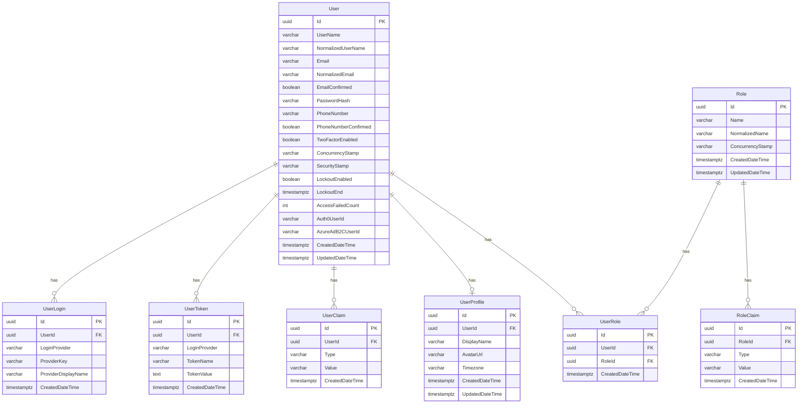
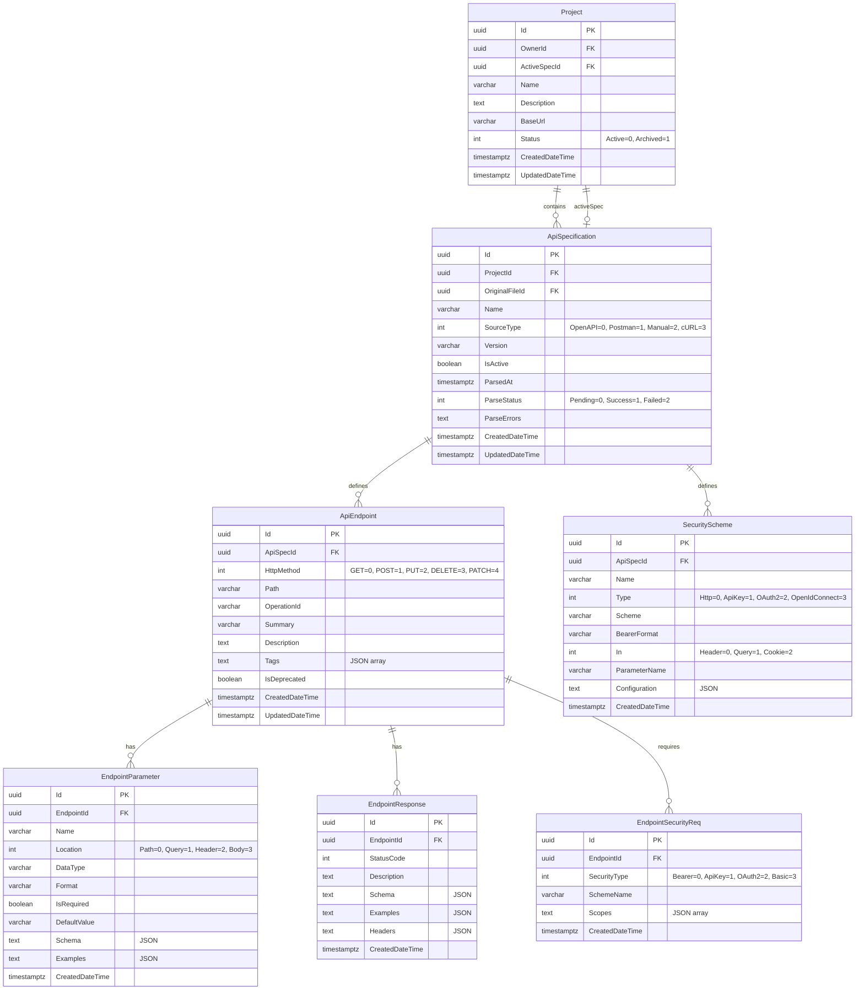
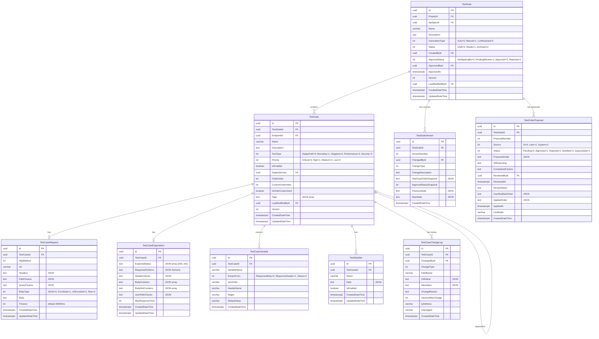
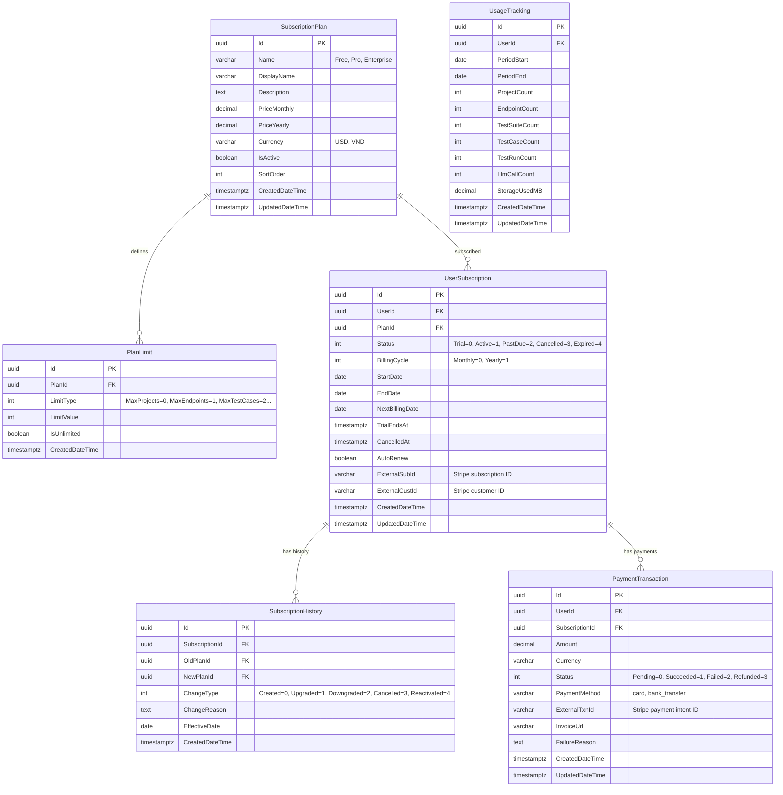
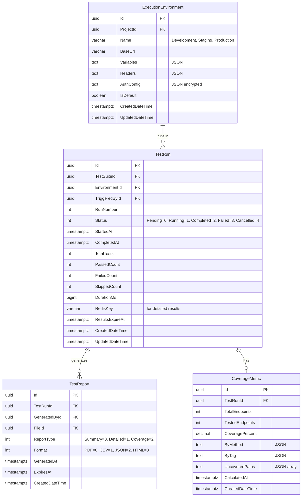
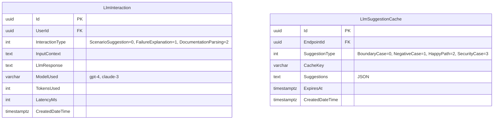
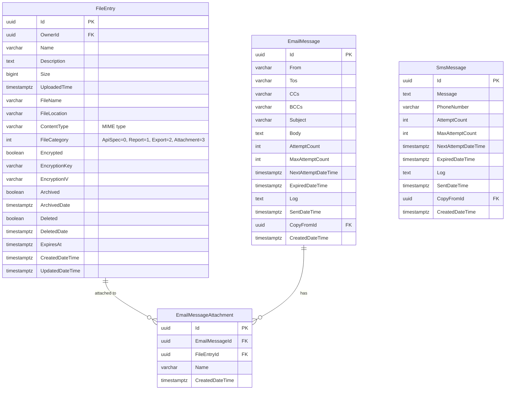
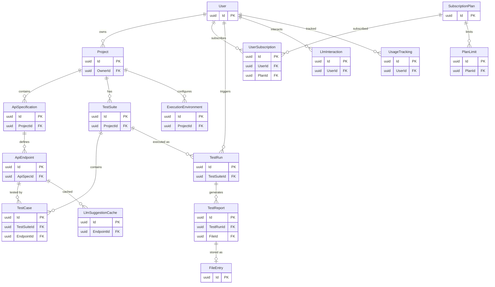

# Entities Documentation

Tài liệu này liệt kê tất cả các entities trong hệ thống ClassifiedAds Modular Monolith.

## Mục lục

1. [Domain Base](#domain-base)
2. [Identity Module](#identity-module)
3. [Product Module](#product-module)
4. [Storage Module](#storage-module)
5. [Notification Module](#notification-module)
6. [Configuration Module](#configuration-module)
7. [AuditLog Module](#auditlog-module)
8. [Subscription Module](#subscription-module)
9. [ApiDocumentation Module](#apidocumentation-module)
10. [TestGeneration Module](#testgeneration-module)
11. [TestExecution Module](#testexecution-module)
12. [TestReporting Module](#testreporting-module)
13. [LlmAssistant Module](#llmassistant-module)

---

## Domain Base

### Entity\<TKey\>
Base class cho tất cả entities.

| Property | Type | Description |
|----------|------|-------------|
| Id | TKey | Primary key |
| RowVersion | byte[] | Concurrency token |
| CreatedDateTime | DateTimeOffset | Thời gian tạo |
| UpdatedDateTime | DateTimeOffset? | Thời gian cập nhật |

### Interfaces
- `IAggregateRoot` - Marker interface cho aggregate root
- `IHasKey<TKey>` - Interface có key
- `ITrackable` - Interface theo dõi thời gian tạo/cập nhật

---

## Identity Module

### User
Entity người dùng chính.

| Property | Type | Description |
|----------|------|-------------|
| Id | Guid | Primary key |
| UserName | string | Tên đăng nhập |
| NormalizedUserName | string | Tên đăng nhập chuẩn hóa |
| Email | string | Email |
| NormalizedEmail | string | Email chuẩn hóa |
| EmailConfirmed | bool | Email đã xác nhận |
| PasswordHash | string | Mật khẩu đã hash |
| PhoneNumber | string | Số điện thoại |
| PhoneNumberConfirmed | bool | SĐT đã xác nhận |
| TwoFactorEnabled | bool | Bật 2FA |
| ConcurrencyStamp | string | Concurrency stamp |
| SecurityStamp | string | Security stamp |
| LockoutEnabled | bool | Bật khóa tài khoản |
| LockoutEnd | DateTimeOffset? | Thời gian hết khóa |
| AccessFailedCount | int | Số lần đăng nhập thất bại |
| Auth0UserId | string | Auth0 user ID |
| AzureAdB2CUserId | string | Azure AD B2C user ID |

**Navigation Properties:**
- `Tokens` - IList\<UserToken\>
- `Claims` - IList\<UserClaim\>
- `UserRoles` - IList\<UserRole\>
- `UserLogins` - IList\<UserLogin\>
- `Profile` - UserProfile (1:1)

---

### UserProfile
Thông tin profile mở rộng của user (1:1 với User).

| Property | Type | Description |
|----------|------|-------------|
| Id | Guid | Primary key |
| UserId | Guid | FK đến User |
| DisplayName | string | Tên hiển thị |
| AvatarUrl | string | URL avatar |
| Timezone | string | Timezone (e.g., "Asia/Ho_Chi_Minh") |

---

### Role
Vai trò trong hệ thống.

| Property | Type | Description |
|----------|------|-------------|
| Id | Guid | Primary key |
| Name | string | Tên role |
| NormalizedName | string | Tên chuẩn hóa |
| ConcurrencyStamp | string | Concurrency stamp |

**Navigation Properties:**
- `Claims` - IList\<RoleClaim\>
- `UserRoles` - IList\<UserRole\>

---

### UserRole
Quan hệ nhiều-nhiều giữa User và Role.

| Property | Type | Description |
|----------|------|-------------|
| Id | Guid | Primary key |
| UserId | Guid | FK đến User |
| RoleId | Guid | FK đến Role |

---

### UserClaim
Claims của user.

| Property | Type | Description |
|----------|------|-------------|
| Id | Guid | Primary key |
| UserId | Guid | FK đến User |
| Type | string | Loại claim |
| Value | string | Giá trị claim |

---

### RoleClaim
Claims của role.

| Property | Type | Description |
|----------|------|-------------|
| Id | Guid | Primary key |
| RoleId | Guid | FK đến Role |
| Type | string | Loại claim |
| Value | string | Giá trị claim |

---

### UserToken
Token của user.

| Property | Type | Description |
|----------|------|-------------|
| Id | Guid | Primary key |
| UserId | Guid | FK đến User |
| LoginProvider | string | Provider cung cấp token |
| TokenName | string | Tên token |
| TokenValue | string | Giá trị token |

---

### UserLogin
Thông tin đăng nhập external.

| Property | Type | Description |
|----------|------|-------------|
| Id | Guid | Primary key |
| UserId | Guid | FK đến User |
| LoginProvider | string | Provider (Google, Facebook...) |
| ProviderKey | string | Key từ provider |
| ProviderDisplayName | string | Tên hiển thị |

---

## Product Module

### Product
Sản phẩm trong hệ thống.

| Property | Type | Description |
|----------|------|-------------|
| Id | Guid | Primary key |
| Code | string | Mã sản phẩm |
| Name | string | Tên sản phẩm |
| Description | string | Mô tả |

---

## Storage Module

### FileEntry
Entity lưu trữ file (API specs, reports, exports).

| Property | Type | Description |
|----------|------|-------------|
| Id | Guid | Primary key |
| Name | string | Tên file |
| Description | string | Mô tả |
| Size | long | Kích thước (bytes) |
| UploadedTime | DateTimeOffset | Thời gian upload |
| FileName | string | Tên file gốc |
| FileLocation | string | Đường dẫn lưu trữ |
| Encrypted | bool | Đã mã hóa |
| EncryptionKey | string | Key mã hóa |
| EncryptionIV | string | IV mã hóa |
| Archived | bool | Đã archive |
| ArchivedDate | DateTimeOffset? | Ngày archive |
| Deleted | bool | Đã xóa mềm |
| DeletedDate | DateTimeOffset? | Ngày xóa |
| OwnerId | Guid? | User sở hữu |
| ContentType | string | MIME type |
| FileCategory | FileCategory | Loại file |
| ExpiresAt | DateTimeOffset? | Thời gian hết hạn |

**Enums:**
```csharp
public enum FileCategory
{
    ApiSpec = 0,     // OpenAPI/Postman/Swagger files
    Report = 1,      // PDF/CSV/HTML reports
    Export = 2,      // Exported test results
    Attachment = 3   // General attachments
}
```

---

## Notification Module

### EmailMessage
Email cần gửi.

| Property | Type | Description |
|----------|------|-------------|
| Id | Guid | Primary key |
| From | string | Người gửi |
| Tos | string | Danh sách người nhận |
| CCs | string | CC list |
| BCCs | string | BCC list |
| Subject | string | Tiêu đề |
| Body | string | Nội dung |
| AttemptCount | int | Số lần thử gửi |
| MaxAttemptCount | int | Số lần thử tối đa |
| NextAttemptDateTime | DateTimeOffset? | Thời gian thử lại |
| ExpiredDateTime | DateTimeOffset? | Thời gian hết hạn |
| Log | string | Log gửi mail |
| SentDateTime | DateTimeOffset? | Thời gian đã gửi |
| CopyFromId | Guid? | Copy từ email khác |

**Navigation Properties:**
- `EmailMessageAttachments` - ICollection\<EmailMessageAttachment\>

---

### EmailMessageAttachment
Attachment của email.

| Property | Type | Description |
|----------|------|-------------|
| Id | Guid | Primary key |
| EmailMessageId | Guid | FK đến EmailMessage |
| FileEntryId | Guid | FK đến FileEntry |
| Name | string | Tên attachment |

---

### SmsMessage
SMS cần gửi.

| Property | Type | Description |
|----------|------|-------------|
| Id | Guid | Primary key |
| Message | string | Nội dung SMS |
| PhoneNumber | string | Số điện thoại |
| AttemptCount | int | Số lần thử |
| MaxAttemptCount | int | Số lần thử tối đa |
| NextAttemptDateTime | DateTimeOffset? | Thời gian thử lại |
| ExpiredDateTime | DateTimeOffset? | Thời gian hết hạn |
| Log | string | Log gửi SMS |
| SentDateTime | DateTimeOffset? | Thời gian đã gửi |
| CopyFromId | Guid? | Copy từ SMS khác |

---

## Configuration Module

### ConfigurationEntry
Cấu hình hệ thống.

| Property | Type | Description |
|----------|------|-------------|
| Id | Guid | Primary key |
| Key | string | Key cấu hình |
| Value | string | Giá trị |
| Description | string | Mô tả |
| IsSensitive | bool | Là thông tin nhạy cảm |

---

### LocalizationEntry
Bản dịch đa ngôn ngữ.

| Property | Type | Description |
|----------|------|-------------|
| Id | Guid | Primary key |
| Name | string | Tên resource |
| Value | string | Giá trị dịch |
| Culture | string | Culture code (vi, en...) |
| Description | string | Mô tả |

---

## AuditLog Module

### AuditLogEntry
Log audit cho các thao tác.

| Property | Type | Description |
|----------|------|-------------|
| Id | Guid | Primary key |
| UserId | Guid | User thực hiện |
| Action | string | Hành động |
| ObjectId | string | ID đối tượng |
| Log | string | Chi tiết log |

---

### IdempotentRequest
Lưu trữ request idempotent.

| Property | Type | Description |
|----------|------|-------------|
| Id | Guid | Primary key |
| RequestType | string | Loại request |
| RequestId | string | ID request |

---

## Subscription Module

### SubscriptionPlan
Gói subscription (Free, Pro, Enterprise).

| Property | Type | Description |
|----------|------|-------------|
| Id | Guid | Primary key |
| Name | string | Tên gói (Free, Pro, Enterprise) |
| DisplayName | string | Tên hiển thị |
| Description | string | Mô tả |
| PriceMonthly | decimal? | Giá tháng |
| PriceYearly | decimal? | Giá năm |
| Currency | string | Đơn vị tiền (USD, VND) |
| IsActive | bool | Đang hoạt động |
| SortOrder | int | Thứ tự hiển thị |

---

### PlanLimit
Giới hạn của từng gói.

| Property | Type | Description |
|----------|------|-------------|
| Id | Guid | Primary key |
| PlanId | Guid | FK đến SubscriptionPlan |
| LimitType | LimitType | Loại giới hạn |
| LimitValue | int? | Giá trị giới hạn |
| IsUnlimited | bool | Không giới hạn |

**Enums:**
```csharp
public enum LimitType
{
    MaxProjects = 0,
    MaxEndpointsPerProject = 1,
    MaxTestCasesPerSuite = 2,
    MaxTestRunsPerMonth = 3,
    MaxConcurrentRuns = 4,
    RetentionDays = 5,
    MaxLlmCallsPerMonth = 6,
    MaxStorageMB = 7
}
```

---

### UserSubscription
Subscription của user.

| Property | Type | Description |
|----------|------|-------------|
| Id | Guid | Primary key |
| UserId | Guid | FK đến User |
| PlanId | Guid | FK đến SubscriptionPlan |
| Status | SubscriptionStatus | Trạng thái |
| BillingCycle | BillingCycle? | Chu kỳ thanh toán |
| StartDate | DateOnly | Ngày bắt đầu |
| EndDate | DateOnly? | Ngày kết thúc |
| NextBillingDate | DateOnly? | Ngày thanh toán tiếp |
| TrialEndsAt | DateTimeOffset? | Hết trial |
| CancelledAt | DateTimeOffset? | Ngày hủy |
| AutoRenew | bool | Tự động gia hạn |
| ExternalSubId | string | Stripe subscription ID |
| ExternalCustId | string | Stripe customer ID |

**Enums:**
```csharp
public enum SubscriptionStatus
{
    Trial = 0,
    Active = 1,
    PastDue = 2,
    Cancelled = 3,
    Expired = 4
}

public enum BillingCycle
{
    Monthly = 0,
    Yearly = 1
}
```

---

### SubscriptionHistory
Lịch sử thay đổi subscription.

| Property | Type | Description |
|----------|------|-------------|
| Id | Guid | Primary key |
| SubscriptionId | Guid | FK đến UserSubscription |
| OldPlanId | Guid? | Gói cũ |
| NewPlanId | Guid | Gói mới |
| ChangeType | ChangeType | Loại thay đổi |
| ChangeReason | string | Lý do |
| EffectiveDate | DateOnly | Ngày có hiệu lực |

**Enums:**
```csharp
public enum ChangeType
{
    Created = 0,
    Upgraded = 1,
    Downgraded = 2,
    Cancelled = 3,
    Reactivated = 4
}
```

---

### PaymentTransaction
Giao dịch thanh toán.

| Property | Type | Description |
|----------|------|-------------|
| Id | Guid | Primary key |
| UserId | Guid | FK đến User |
| SubscriptionId | Guid | FK đến UserSubscription |
| Amount | decimal | Số tiền |
| Currency | string | Đơn vị tiền |
| Status | PaymentStatus | Trạng thái |
| PaymentMethod | string | Phương thức (card, bank_transfer) |
| ExternalTxnId | string | Stripe payment intent ID |
| InvoiceUrl | string | URL hóa đơn |
| FailureReason | string | Lý do thất bại |

**Enums:**
```csharp
public enum PaymentStatus
{
    Pending = 0,
    Succeeded = 1,
    Failed = 2,
    Refunded = 3
}
```

---

### UsageTracking
Theo dõi usage trong kỳ thanh toán.

| Property | Type | Description |
|----------|------|-------------|
| Id | Guid | Primary key |
| UserId | Guid | FK đến User |
| PeriodStart | DateOnly | Bắt đầu kỳ |
| PeriodEnd | DateOnly | Kết thúc kỳ |
| ProjectCount | int | Số project |
| EndpointCount | int | Số endpoint |
| TestSuiteCount | int | Số test suite |
| TestCaseCount | int | Số test case |
| TestRunCount | int | Số test run |
| LlmCallCount | int | Số LLM call |
| StorageUsedMB | decimal | Storage đã dùng (MB) |

---

## ApiDocumentation Module

### Project
Project chứa API specifications.

| Property | Type | Description |
|----------|------|-------------|
| Id | Guid | Primary key |
| OwnerId | Guid | User sở hữu |
| ActiveSpecId | Guid? | Spec đang active |
| Name | string | Tên project |
| Description | string | Mô tả |
| BaseUrl | string | Base URL cho API |
| Status | ProjectStatus | Trạng thái |

**Enums:**
```csharp
public enum ProjectStatus
{
    Active = 0,
    Archived = 1
}
```

---

### ApiSpecification
API specification (OpenAPI, Postman...).

| Property | Type | Description |
|----------|------|-------------|
| Id | Guid | Primary key |
| ProjectId | Guid | FK đến Project |
| OriginalFileId | Guid? | File gốc (Storage) |
| Name | string | Tên spec |
| SourceType | SourceType | Nguồn (OpenAPI, Postman...) |
| Version | string | Phiên bản API |
| IsActive | bool | Đang active |
| ParsedAt | DateTimeOffset? | Thời gian parse |
| ParseStatus | ParseStatus | Trạng thái parse |
| ParseErrors | string | Lỗi parse (JSON) |

**Enums:**
```csharp
public enum SourceType
{
    OpenAPI = 0,
    Postman = 1,
    Manual = 2,
    cURL = 3
}

public enum ParseStatus
{
    Pending = 0,
    Success = 1,
    Failed = 2
}
```

---

### ApiEndpoint
API endpoint definition.

| Property | Type | Description |
|----------|------|-------------|
| Id | Guid | Primary key |
| ApiSpecId | Guid | FK đến ApiSpecification |
| HttpMethod | HttpMethod | HTTP method |
| Path | string | Đường dẫn (e.g., /api/users/{id}) |
| OperationId | string | Operation ID |
| Summary | string | Tóm tắt |
| Description | string | Mô tả chi tiết |
| Tags | string | Tags (JSON array) |
| IsDeprecated | bool | Đã deprecated |

**Enums:**
```csharp
public enum HttpMethod
{
    GET = 0,
    POST = 1,
    PUT = 2,
    DELETE = 3,
    PATCH = 4,
    HEAD = 5,
    OPTIONS = 6
}
```

---

### EndpointParameter
Parameter của endpoint.

| Property | Type | Description |
|----------|------|-------------|
| Id | Guid | Primary key |
| EndpointId | Guid | FK đến ApiEndpoint |
| Name | string | Tên parameter |
| Location | ParameterLocation | Vị trí (Path, Query, Header, Body) |
| DataType | string | Kiểu dữ liệu |
| Format | string | Format (date-time, email, uuid...) |
| IsRequired | bool | Bắt buộc |
| DefaultValue | string | Giá trị mặc định |
| Schema | string | JSON Schema |
| Examples | string | Ví dụ (JSON) |

**Enums:**
```csharp
public enum ParameterLocation
{
    Path = 0,
    Query = 1,
    Header = 2,
    Body = 3
}
```

---

### EndpointResponse
Response definition của endpoint.

| Property | Type | Description |
|----------|------|-------------|
| Id | Guid | Primary key |
| EndpointId | Guid | FK đến ApiEndpoint |
| StatusCode | int | HTTP status code |
| Description | string | Mô tả |
| Schema | string | JSON Schema |
| Examples | string | Ví dụ (JSON) |
| Headers | string | Response headers (JSON) |

---

### SecurityScheme
Security scheme của API spec.

| Property | Type | Description |
|----------|------|-------------|
| Id | Guid | Primary key |
| ApiSpecId | Guid | FK đến ApiSpecification |
| Name | string | Tên scheme |
| Type | SchemeType | Loại (http, apiKey, oauth2...) |
| Scheme | string | HTTP scheme (bearer, basic) |
| BearerFormat | string | Format (JWT) |
| In | ApiKeyLocation? | Vị trí API key |
| ParameterName | string | Tên parameter |
| Configuration | string | Config bổ sung (JSON) |

**Enums:**
```csharp
public enum SchemeType
{
    Http = 0,
    ApiKey = 1,
    OAuth2 = 2,
    OpenIdConnect = 3
}

public enum ApiKeyLocation
{
    Header = 0,
    Query = 1,
    Cookie = 2
}
```

---

### EndpointSecurityReq
Security requirement của endpoint.

| Property | Type | Description |
|----------|------|-------------|
| Id | Guid | Primary key |
| EndpointId | Guid | FK đến ApiEndpoint |
| SecurityType | SecurityType | Loại security |
| SchemeName | string | Tên security scheme |
| Scopes | string | OAuth2 scopes (JSON array) |

**Enums:**
```csharp
public enum SecurityType
{
    Bearer = 0,
    ApiKey = 1,
    OAuth2 = 2,
    Basic = 3,
    OpenIdConnect = 4
}
```

---

## TestGeneration Module

### TestSuite
Test suite chứa nhiều test cases.

| Property | Type | Description |
|----------|------|-------------|
| Id | Guid | Primary key |
| ProjectId | Guid | FK đến Project |
| ApiSpecId | Guid? | FK đến ApiSpecification |
| Name | string | Tên suite |
| Description | string | Mô tả |
| GenerationType | GenerationType | Cách tạo (Auto, Manual, LLMAssisted) |
| Status | TestSuiteStatus | Trạng thái |
| CreatedById | Guid | User tạo |
| ApprovalStatus | ApprovalStatus | Trạng thái duyệt |
| ApprovedById | Guid? | User duyệt |
| ApprovedAt | DateTimeOffset? | Thời gian duyệt |
| Version | int | Số phiên bản |
| LastModifiedById | Guid? | User sửa cuối |

**Enums:**
```csharp
public enum GenerationType
{
    Auto = 0,
    Manual = 1,
    LLMAssisted = 2
}

public enum TestSuiteStatus
{
    Draft = 0,
    Ready = 1,
    Archived = 2
}

public enum ApprovalStatus
{
    NotApplicable = 0,
    PendingReview = 1,
    Approved = 2,
    Rejected = 3
}
```

---

### TestCase
Test case riêng lẻ.

| Property | Type | Description |
|----------|------|-------------|
| Id | Guid | Primary key |
| TestSuiteId | Guid | FK đến TestSuite |
| EndpointId | Guid? | FK đến ApiEndpoint |
| Name | string | Tên test case |
| Description | string | Mô tả |
| TestType | TestType | Loại test |
| Priority | TestPriority | Độ ưu tiên |
| IsEnabled | bool | Đang bật |
| DependsOnId | Guid? | Phụ thuộc test case khác |
| OrderIndex | int | Thứ tự thực thi |
| CustomOrderIndex | int? | Thứ tự tùy chỉnh |
| IsOrderCustomized | bool | Đã tùy chỉnh thứ tự |
| Tags | string | Tags (JSON array) |
| LastModifiedById | Guid? | User sửa cuối |
| Version | int | Số phiên bản |

**Navigation Properties:**
- `Request` - TestCaseRequest (1:1)
- `Expectation` - TestCaseExpectation (1:1)
- `Variables` - ICollection\<TestCaseVariable\>
- `DataSets` - ICollection\<TestDataSet\>
- `ChangeLogs` - ICollection\<TestCaseChangeLog\>

**Enums:**
```csharp
public enum TestType
{
    HappyPath = 0,
    Boundary = 1,
    Negative = 2,
    Performance = 3,
    Security = 4
}

public enum TestPriority
{
    Critical = 0,
    High = 1,
    Medium = 2,
    Low = 3
}
```

---

### TestCaseRequest
Request definition của test case (1:1).

| Property | Type | Description |
|----------|------|-------------|
| Id | Guid | Primary key |
| TestCaseId | Guid | FK đến TestCase |
| HttpMethod | HttpMethod | HTTP method |
| Url | string | URL template |
| Headers | string | Headers (JSON) |
| PathParams | string | Path params (JSON) |
| QueryParams | string | Query params (JSON) |
| BodyType | BodyType | Loại body |
| Body | string | Request body |
| Timeout | int | Timeout (ms), default 30000 |

**Enums:**
```csharp
public enum BodyType
{
    JSON = 0,
    FormData = 1,
    UrlEncoded = 2,
    Raw = 3
}
```

---

### TestCaseExpectation
Expected response của test case (1:1).

| Property | Type | Description |
|----------|------|-------------|
| Id | Guid | Primary key |
| TestCaseId | Guid | FK đến TestCase |
| ExpectedStatus | string | Expected status codes (JSON array) |
| ResponseSchema | string | JSON Schema |
| HeaderChecks | string | Header validation (JSON) |
| BodyContains | string | Strings must exist (JSON array) |
| BodyNotContains | string | Strings must NOT exist (JSON array) |
| JsonPathChecks | string | JSONPath assertions (JSON) |
| MaxResponseTime | int? | Max response time (ms) |

---

### TestCaseVariable
Variable extraction từ response.

| Property | Type | Description |
|----------|------|-------------|
| Id | Guid | Primary key |
| TestCaseId | Guid | FK đến TestCase |
| VariableName | string | Tên biến |
| ExtractFrom | ExtractFrom | Nguồn extract |
| JsonPath | string | JSONPath expression |
| HeaderName | string | Tên header |
| Regex | string | Regex pattern |
| DefaultValue | string | Giá trị mặc định |

**Enums:**
```csharp
public enum ExtractFrom
{
    ResponseBody = 0,
    ResponseHeader = 1,
    Status = 2
}
```

---

### TestDataSet
Data set cho data-driven testing.

| Property | Type | Description |
|----------|------|-------------|
| Id | Guid | Primary key |
| TestCaseId | Guid | FK đến TestCase |
| Name | string | Tên data set |
| Data | string | Data (JSON) |
| IsEnabled | bool | Đang bật |

---

### TestCaseChangeLog
Audit trail cho thay đổi test case.

| Property | Type | Description |
|----------|------|-------------|
| Id | Guid | Primary key |
| TestCaseId | Guid | FK đến TestCase |
| ChangedById | Guid | User thay đổi |
| ChangeType | TestCaseChangeType | Loại thay đổi |
| FieldName | string | Tên field thay đổi |
| OldValue | string | Giá trị cũ (JSON) |
| NewValue | string | Giá trị mới (JSON) |
| ChangeReason | string | Lý do |
| VersionAfterChange | int | Version sau thay đổi |
| IpAddress | string | IP address |
| UserAgent | string | User agent |

**Enums:**
```csharp
public enum TestCaseChangeType
{
    Created = 0,
    NameChanged = 1,
    DescriptionChanged = 2,
    // ... more types
}
```

---

### TestSuiteVersion
Version history của TestSuite.

| Property | Type | Description |
|----------|------|-------------|
| Id | Guid | Primary key |
| TestSuiteId | Guid | FK đến TestSuite |
| VersionNumber | int | Số version |
| ChangedById | Guid | User thay đổi |
| ChangeType | VersionChangeType | Loại thay đổi |
| ChangeDescription | string | Mô tả |
| TestCaseOrderSnapshot | string | Snapshot thứ tự (JSON) |
| ApprovalStatusSnapshot | ApprovalStatus | Snapshot trạng thái duyệt |
| PreviousState | string | State trước (JSON) |
| NewState | string | State sau (JSON) |

**Enums:**
```csharp
public enum VersionChangeType
{
    Created = 0,
    TestOrderChanged = 1,
    TestCasesModified = 2,
    // ... more types
}
```

---

### TestOrderProposal
Đề xuất thứ tự test từ AI.

| Property | Type | Description |
|----------|------|-------------|
| Id | Guid | Primary key |
| TestSuiteId | Guid | FK đến TestSuite |
| ProposalNumber | int | Số thứ tự đề xuất |
| Source | ProposalSource | Nguồn (AI, User, System) |
| Status | ProposalStatus | Trạng thái |
| ProposedOrder | string | Thứ tự đề xuất (JSON) |
| AiReasoning | string | Lý do AI |
| ConsideredFactors | string | Các yếu tố xem xét |
| ReviewedById | Guid? | User review |
| ReviewedAt | DateTimeOffset? | Thời gian review |
| ReviewNotes | string | Ghi chú review |
| UserModifiedOrder | string | Thứ tự user sửa (JSON) |
| AppliedOrder | string | Thứ tự áp dụng (JSON) |
| AppliedAt | DateTimeOffset? | Thời gian áp dụng |
| LlmModel | string | Model LLM sử dụng |

**Enums:**
```csharp
public enum ProposalSource
{
    AI = 0,
    User = 1,
    System = 2
}

public enum ProposalStatus
{
    Pending = 0,
    Approved = 1,
    Rejected = 2,
    Modified = 3,
    Superseded = 4
}
```

---

## TestExecution Module

### TestRun
Bản ghi chạy test (summary trong PostgreSQL, details trong Redis).

| Property | Type | Description |
|----------|------|-------------|
| Id | Guid | Primary key |
| TestSuiteId | Guid | FK đến TestSuite |
| EnvironmentId | Guid | FK đến ExecutionEnvironment |
| TriggeredById | Guid | User trigger |
| RunNumber | int | Số thứ tự run |
| Status | TestRunStatus | Trạng thái |
| StartedAt | DateTimeOffset? | Thời gian bắt đầu |
| CompletedAt | DateTimeOffset? | Thời gian hoàn thành |
| TotalTests | int | Tổng số test |
| PassedCount | int | Số passed |
| FailedCount | int | Số failed |
| SkippedCount | int | Số skipped |
| DurationMs | long | Thời gian chạy (ms) |
| RedisKey | string | Key lấy chi tiết từ Redis |
| ResultsExpireAt | DateTimeOffset? | Thời gian Redis data hết hạn |

**Enums:**
```csharp
public enum TestRunStatus
{
    Pending = 0,
    Running = 1,
    Completed = 2,
    Failed = 3,
    Cancelled = 4
}
```

---

### ExecutionEnvironment
Môi trường chạy test.

| Property | Type | Description |
|----------|------|-------------|
| Id | Guid | Primary key |
| ProjectId | Guid | FK đến Project |
| Name | string | Tên (Development, Staging, Production) |
| BaseUrl | string | Base URL |
| Variables | string | Environment variables (JSON) |
| Headers | string | Default headers (JSON) |
| AuthConfig | string | Auth config (JSON, encrypted) |
| IsDefault | bool | Là môi trường mặc định |

---

## TestReporting Module

### TestReport
Báo cáo test đã generate.

| Property | Type | Description |
|----------|------|-------------|
| Id | Guid | Primary key |
| TestRunId | Guid | FK đến TestRun |
| GeneratedById | Guid | User generate |
| FileId | Guid | FK đến FileEntry |
| ReportType | ReportType | Loại báo cáo |
| Format | ReportFormat | Định dạng |
| GeneratedAt | DateTimeOffset | Thời gian generate |
| ExpiresAt | DateTimeOffset? | Thời gian hết hạn |

**Enums:**
```csharp
public enum ReportType
{
    Summary = 0,
    Detailed = 1,
    Coverage = 2
}

public enum ReportFormat
{
    PDF = 0,
    CSV = 1,
    JSON = 2,
    HTML = 3
}
```

---

### CoverageMetric
Metrics coverage API cho test run.

| Property | Type | Description |
|----------|------|-------------|
| Id | Guid | Primary key |
| TestRunId | Guid | FK đến TestRun |
| TotalEndpoints | int | Tổng số endpoints |
| TestedEndpoints | int | Số endpoints đã test |
| CoveragePercent | decimal | Phần trăm coverage |
| ByMethod | string | Coverage theo method (JSON) |
| ByTag | string | Coverage theo tag (JSON) |
| UncoveredPaths | string | Paths chưa cover (JSON array) |
| CalculatedAt | DateTimeOffset | Thời gian tính |

---

## LlmAssistant Module

### LlmInteraction
Bản ghi tương tác với LLM.

| Property | Type | Description |
|----------|------|-------------|
| Id | Guid | Primary key |
| UserId | Guid | FK đến User |
| InteractionType | InteractionType | Loại tương tác |
| InputContext | string | Context gửi LLM |
| LlmResponse | string | Response từ LLM |
| ModelUsed | string | Model (gpt-4, claude-3) |
| TokensUsed | int | Số tokens |
| LatencyMs | int | Độ trễ (ms) |

**Enums:**
```csharp
public enum InteractionType
{
    ScenarioSuggestion = 0,
    FailureExplanation = 1,
    DocumentationParsing = 2
}
```

---

### LlmSuggestionCache
Cache suggestions từ LLM.

| Property | Type | Description |
|----------|------|-------------|
| Id | Guid | Primary key |
| EndpointId | Guid | FK đến ApiEndpoint |
| SuggestionType | SuggestionType | Loại suggestion |
| CacheKey | string | Key cache |
| Suggestions | string | Suggestions (JSON) |
| ExpiresAt | DateTimeOffset | Thời gian hết hạn |

**Enums:**
```csharp
public enum SuggestionType
{
    BoundaryCase = 0,
    NegativeCase = 1,
    HappyPath = 2,
    SecurityCase = 3
}
```

---

## Common Entities (Per Module)

Mỗi module có các entities chung:

### OutboxMessage
Transactional outbox pattern cho reliable messaging.

| Property | Type | Description |
|----------|------|-------------|
| Id | Guid | Primary key |
| Type | string | Message type |
| Payload | string | Message payload (JSON) |
| CreatedAt | DateTimeOffset | Thời gian tạo |
| ProcessedAt | DateTimeOffset? | Thời gian xử lý |

### AuditLogEntry (Per Module)
Audit log riêng cho từng module.

| Property | Type | Description |
|----------|------|-------------|
| Id | Guid | Primary key |
| UserId | Guid | User thực hiện |
| Action | string | Hành động |
| ObjectId | string | ID đối tượng |
| Log | string | Chi tiết |

---

## Entity Relationships Diagram

### Text Diagram (Quick Reference)

```
┌─────────────────────────────────────────────────────────────────────────────────┐
│                              IDENTITY MODULE                                     │
├─────────────────────────────────────────────────────────────────────────────────┤
│  User ──1:1──> UserProfile                                                       │
│    │                                                                             │
│    ├──1:N──> UserRole ──N:1──> Role                                             │
│    │                             │                                               │
│    ├──1:N──> UserClaim           └──1:N──> RoleClaim                            │
│    ├──1:N──> UserToken                                                          │
│    └──1:N──> UserLogin                                                          │
└─────────────────────────────────────────────────────────────────────────────────┘

┌─────────────────────────────────────────────────────────────────────────────────┐
│                           API DOCUMENTATION MODULE                               │
├─────────────────────────────────────────────────────────────────────────────────┤
│  Project ──1:N──> ApiSpecification ──1:N──> ApiEndpoint                         │
│                        │                        │                                │
│                        └──1:N──> SecurityScheme ├──1:N──> EndpointParameter     │
│                                                 ├──1:N──> EndpointResponse       │
│                                                 └──1:N──> EndpointSecurityReq    │
└─────────────────────────────────────────────────────────────────────────────────┘

┌─────────────────────────────────────────────────────────────────────────────────┐
│                          TEST GENERATION MODULE                                  │
├─────────────────────────────────────────────────────────────────────────────────┤
│  TestSuite ──1:N──> TestCase ──1:1──> TestCaseRequest                           │
│      │                  │                                                        │
│      │                  ├──1:1──> TestCaseExpectation                           │
│      │                  ├──1:N──> TestCaseVariable                              │
│      │                  ├──1:N──> TestDataSet                                   │
│      │                  └──1:N──> TestCaseChangeLog                             │
│      │                                                                           │
│      ├──1:N──> TestSuiteVersion                                                 │
│      └──1:N──> TestOrderProposal                                                │
└─────────────────────────────────────────────────────────────────────────────────┘

┌─────────────────────────────────────────────────────────────────────────────────┐
│                            SUBSCRIPTION MODULE                                   │
├─────────────────────────────────────────────────────────────────────────────────┤
│  SubscriptionPlan ──1:N──> PlanLimit                                            │
│         │                                                                        │
│         └──1:N──> UserSubscription ──1:N──> SubscriptionHistory                 │
│                          │                                                       │
│                          └──1:N──> PaymentTransaction                           │
│                                                                                  │
│  UsageTracking (per user per period)                                            │
└─────────────────────────────────────────────────────────────────────────────────┘

┌─────────────────────────────────────────────────────────────────────────────────┐
│                         TEST EXECUTION & REPORTING                               │
├─────────────────────────────────────────────────────────────────────────────────┤
│  ExecutionEnvironment                                                            │
│         │                                                                        │
│         └──> TestRun ──1:N──> TestReport                                        │
│                  │                                                               │
│                  └──1:1──> CoverageMetric                                       │
└─────────────────────────────────────────────────────────────────────────────────┘
```

---

## Mermaid ERD Diagrams (For BA Team)

> 💡 **Hướng dẫn sử dụng**: Copy code Mermaid bên dưới vào:
> - [Mermaid Live Editor](https://mermaid.live)
> - draw.io (Insert > Advanced > Mermaid)
> - Notion, GitHub, GitLab (hỗ trợ native)
> - VS Code với extension "Markdown Preview Mermaid Support"

### 1. Identity Module ERD



### 2. API Documentation Module ERD



### 3. Test Generation Module ERD



### 4. Subscription Module ERD



### 5. Test Execution & Reporting Module ERD



### 6. LLM Assistant Module ERD



### 7. Storage & Notification Module ERD



### 8. Full System Overview ERD



---

## Database Schema Summary (PostgreSQL)

### Data Type Mapping

| C# Type | PostgreSQL Type | Notes |
|---------|-----------------|-------|
| Guid | uuid | Primary/Foreign keys |
| string | varchar(n) / text | text for long content |
| int | integer | |
| long | bigint | |
| decimal | decimal(18,2) | Money fields |
| bool | boolean | |
| DateTime | timestamp | |
| DateTimeOffset | timestamptz | Preferred for audit |
| DateOnly | date | |
| byte[] | bytea | RowVersion |
| Enum | integer | Stored as int |

### Common Indexes (Recommendations)

```sql
-- Identity
CREATE INDEX IX_User_Email ON "Users" ("NormalizedEmail");
CREATE INDEX IX_User_UserName ON "Users" ("NormalizedUserName");

-- Project & API
CREATE INDEX IX_Project_OwnerId ON "Projects" ("OwnerId");
CREATE INDEX IX_ApiSpec_ProjectId ON "ApiSpecifications" ("ProjectId");
CREATE INDEX IX_Endpoint_ApiSpecId ON "ApiEndpoints" ("ApiSpecId");

-- Test
CREATE INDEX IX_TestSuite_ProjectId ON "TestSuites" ("ProjectId");
CREATE INDEX IX_TestCase_TestSuiteId ON "TestCases" ("TestSuiteId");
CREATE INDEX IX_TestRun_TestSuiteId ON "TestRuns" ("TestSuiteId");
CREATE INDEX IX_TestRun_Status ON "TestRuns" ("Status");

-- Subscription
CREATE INDEX IX_UserSubscription_UserId ON "UserSubscriptions" ("UserId");
CREATE INDEX IX_UserSubscription_Status ON "UserSubscriptions" ("Status");
CREATE INDEX IX_UsageTracking_UserId_Period ON "UsageTracking" ("UserId", "PeriodStart", "PeriodEnd");

-- LLM
CREATE INDEX IX_LlmSuggestionCache_EndpointId ON "LlmSuggestionCache" ("EndpointId");
CREATE INDEX IX_LlmSuggestionCache_CacheKey ON "LlmSuggestionCache" ("CacheKey");
```

---

## Foreign Key Constraints Summary

| Table | Column | References | On Delete |
|-------|--------|------------|-----------|
| UserProfile | UserId | User.Id | CASCADE |
| UserRole | UserId | User.Id | CASCADE |
| UserRole | RoleId | Role.Id | CASCADE |
| UserClaim | UserId | User.Id | CASCADE |
| RoleClaim | RoleId | Role.Id | CASCADE |
| Project | OwnerId | User.Id | RESTRICT |
| ApiSpecification | ProjectId | Project.Id | CASCADE |
| ApiEndpoint | ApiSpecId | ApiSpecification.Id | CASCADE |
| EndpointParameter | EndpointId | ApiEndpoint.Id | CASCADE |
| EndpointResponse | EndpointId | ApiEndpoint.Id | CASCADE |
| TestSuite | ProjectId | Project.Id | CASCADE |
| TestCase | TestSuiteId | TestSuite.Id | CASCADE |
| TestCase | DependsOnId | TestCase.Id | SET NULL |
| TestCaseRequest | TestCaseId | TestCase.Id | CASCADE |
| TestCaseExpectation | TestCaseId | TestCase.Id | CASCADE |
| TestRun | TestSuiteId | TestSuite.Id | CASCADE |
| TestRun | EnvironmentId | ExecutionEnvironment.Id | RESTRICT |
| TestReport | TestRunId | TestRun.Id | CASCADE |
| TestReport | FileId | FileEntry.Id | RESTRICT |
| UserSubscription | UserId | User.Id | CASCADE |
| UserSubscription | PlanId | SubscriptionPlan.Id | RESTRICT |
| PaymentTransaction | SubscriptionId | UserSubscription.Id | CASCADE |
| PlanLimit | PlanId | SubscriptionPlan.Id | CASCADE |
| LlmInteraction | UserId | User.Id | CASCADE |
| LlmSuggestionCache | EndpointId | ApiEndpoint.Id | CASCADE |

---

*Generated: 2026-02-01*
