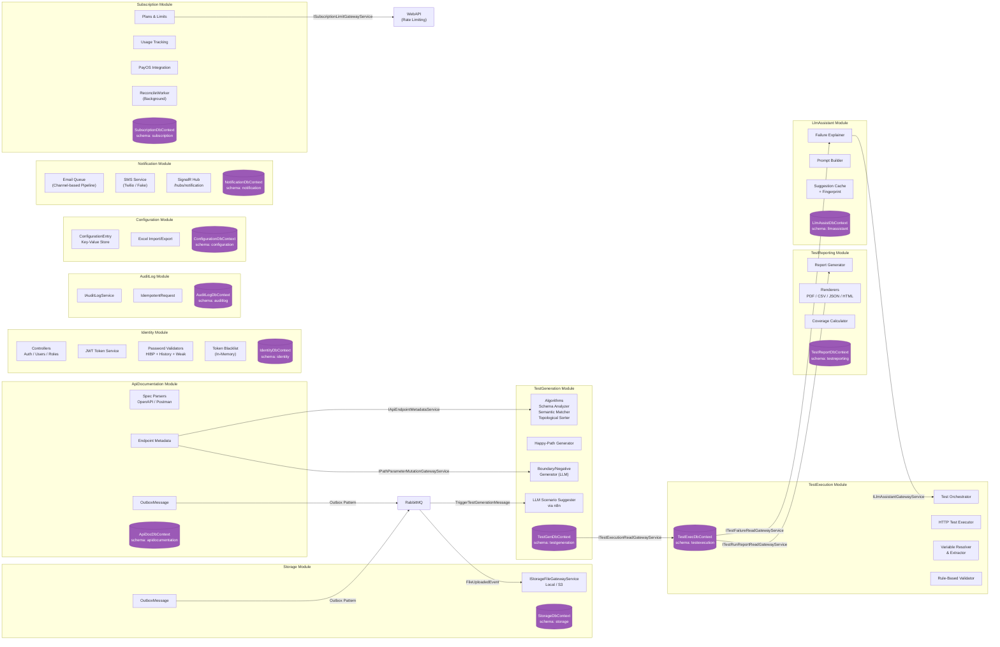
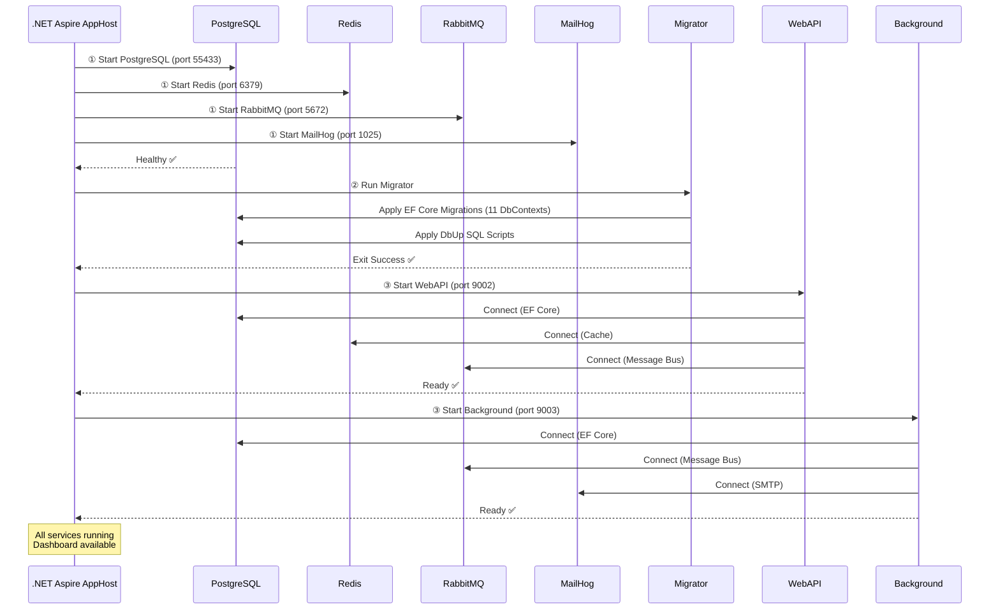
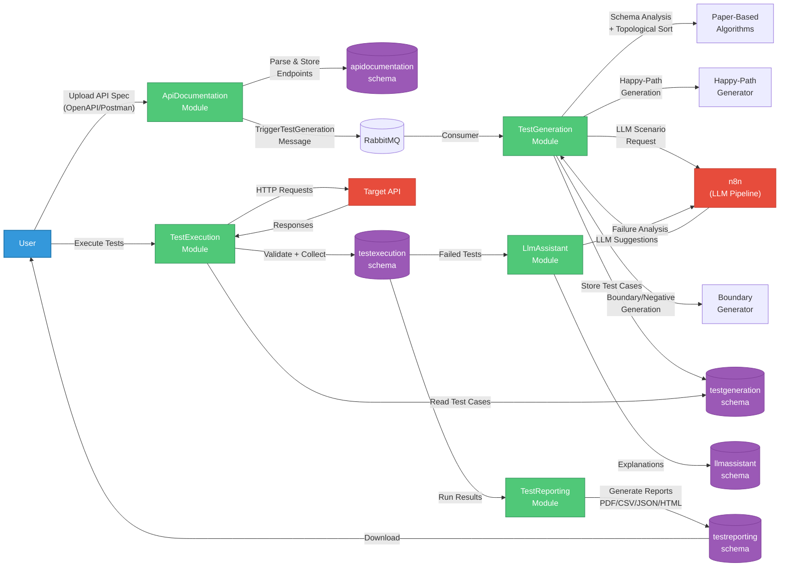
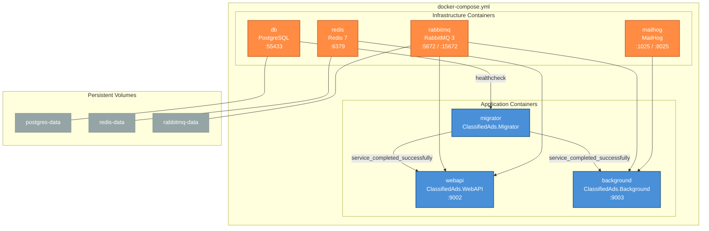
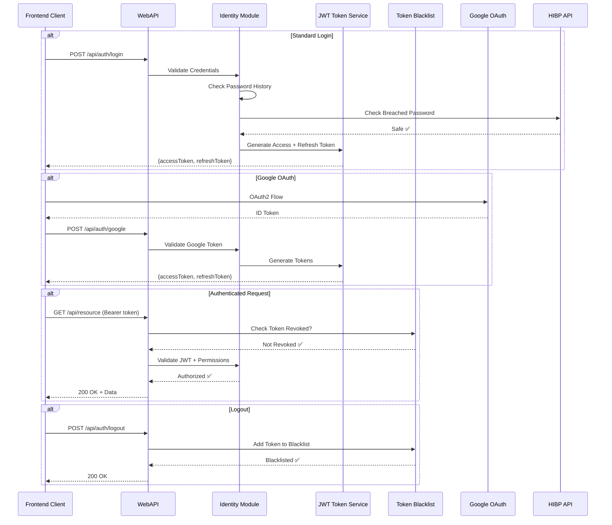

# System Architecture — Backend (Chi tiết)

> **Mermaid code bên dưới có thể import trực tiếp vào draw.io:**
> 1. Mở [draw.io](https://app.diagrams.net)
> 2. Menu → **Extras → Edit Diagram** (hoặc **+** → **Advanced** → **Mermaid**)
> 3. Paste toàn bộ code Mermaid bên dưới → **OK**

---

## 1. High-Level System Architecture

```mermaid
graph TB
    subgraph Clients["🖥️ Clients"]
        FE["Frontend SPA<br/>(React / Next.js)"]
        SWAGGER["Swagger UI / Scalar"]
        EXTERNAL["External Systems<br/>(n8n Webhooks)"]
    end

    subgraph Orchestration["☁️ .NET Aspire AppHost"]
        direction TB
        DASHBOARD["Aspire Dashboard<br/>Logs / Traces / Metrics"]
    end

    subgraph Hosts["🚀 Application Hosts"]
        direction LR
        WEBAPI["WebAPI<br/>REST API Host<br/>Port 9002"]
        BACKGROUND["Background<br/>Worker Service<br/>Port 9003"]
        MIGRATOR["Migrator<br/>One-shot Migration Runner"]
    end

    subgraph Modules["📦 Modules (11)"]
        direction TB
        subgraph CoreModules["Core Modules"]
            IDENTITY["Identity<br/>schema: identity"]
            AUDITLOG["AuditLog<br/>schema: auditlog"]
            CONFIG["Configuration<br/>schema: configuration"]
            STORAGE["Storage<br/>schema: storage"]
            NOTIFICATION["Notification<br/>schema: notification"]
        end
        subgraph BusinessModules["Business Modules"]
            SUBSCRIPTION["Subscription<br/>schema: subscription"]
            APIDOC["ApiDocumentation<br/>schema: apidocumentation"]
        end
        subgraph TestingPlatform["Testing Platform Modules"]
            TESTGEN["TestGeneration<br/>schema: testgeneration"]
            TESTEXEC["TestExecution<br/>schema: testexecution"]
            TESTREPORT["TestReporting<br/>schema: testreporting"]
            LLMASSIST["LlmAssistant<br/>schema: llmassistant"]
        end
    end

    subgraph SharedLayers["📚 Shared Layers"]
        direction LR
        APPLICATION["Application Layer<br/>CQRS Dispatcher<br/>Generic CRUD Handlers"]
        DOMAIN["Domain Layer<br/>Entities / Events<br/>Repository Abstractions"]
        CONTRACTS["Contracts Layer<br/>Inter-Module Interfaces"]
        CROSSCUT["CrossCuttingConcerns<br/>Exceptions / Logging"]
    end

    subgraph Infrastructure["⚙️ Infrastructure"]
        direction LR
        CACHE_SVC["Caching Service<br/>(InMemory / Redis)"]
        MSG_SVC["Messaging Service<br/>(RabbitMQ / Kafka)"]
        AUTH_SVC["Auth Service<br/>(JWT / OAuth2 / OIDC)"]
        MONITOR["Monitoring<br/>(OpenTelemetry)"]
    end

    subgraph External["🌐 External Services"]
        direction LR
        N8N["n8n Workflow<br/>LLM / AI Pipelines"]
        PAYOS["PayOS<br/>Payment Gateway"]
        HIBP["HIBP API<br/>Password Breach Check"]
        GOOGLE["Google OAuth"]
    end

    subgraph DataStores["💾 Data Stores"]
        direction LR
        POSTGRES[("PostgreSQL<br/>11 Schemas<br/>Port 55433")]
        REDIS[("Redis 7<br/>Distributed Cache<br/>Port 6379")]
        RABBITMQ[("RabbitMQ 3<br/>Message Broker<br/>Port 5672 / 15672")]
        MAILHOG[("MailHog<br/>Email Testing<br/>Port 1025 / 8025")]
    end

    %% Client connections
    FE -->|"HTTP/REST + SignalR"| WEBAPI
    SWAGGER -->|"HTTP"| WEBAPI
    EXTERNAL -->|"Webhooks"| WEBAPI

    %% Orchestration
    DASHBOARD -.->|"Observability"| WEBAPI
    DASHBOARD -.->|"Observability"| BACKGROUND

    %% Host to Module
    WEBAPI --> Modules
    BACKGROUND --> Modules
    MIGRATOR -->|"Run Migrations"| POSTGRES

    %% Module layers
    Modules --> APPLICATION
    APPLICATION --> DOMAIN
    Modules --> CONTRACTS
    Modules --> CROSSCUT

    %% Infrastructure
    Modules --> Infrastructure
    CACHE_SVC --> REDIS
    MSG_SVC --> RABBITMQ
    MONITOR --> DASHBOARD

    %% External
    TESTGEN -->|"HTTP"| N8N
    LLMASSIST -->|"HTTP"| N8N
    SUBSCRIPTION -->|"HTTP"| PAYOS
    IDENTITY -->|"HTTP"| HIBP
    IDENTITY -->|"OAuth2"| GOOGLE
    NOTIFICATION --> MAILHOG

    %% Data
    Modules -->|"EF Core"| POSTGRES

    %% Startup ordering
    MIGRATOR -.->|"① Start first"| POSTGRES
    WEBAPI -.->|"② Wait for migrator"| MIGRATOR
    BACKGROUND -.->|"② Wait for migrator"| MIGRATOR

    classDef host fill:#4A90D9,stroke:#2C5F8A,color:#fff,stroke-width:2px
    classDef module fill:#50C878,stroke:#2E8B57,color:#fff,stroke-width:1px
    classDef infra fill:#FF8C42,stroke:#CC6B33,color:#fff,stroke-width:1px
    classDef data fill:#9B59B6,stroke:#7D3C98,color:#fff,stroke-width:2px
    classDef external fill:#E74C3C,stroke:#C0392B,color:#fff,stroke-width:1px
    classDef client fill:#3498DB,stroke:#2980B9,color:#fff,stroke-width:1px

    class WEBAPI,BACKGROUND,MIGRATOR host
    class IDENTITY,AUDITLOG,CONFIG,STORAGE,NOTIFICATION,SUBSCRIPTION,APIDOC,TESTGEN,TESTEXEC,TESTREPORT,LLMASSIST module
    class CACHE_SVC,MSG_SVC,AUTH_SVC,MONITOR infra
    class POSTGRES,REDIS,RABBITMQ,MAILHOG data
    class N8N,PAYOS,HIBP,GOOGLE external
    class FE,SWAGGER,EXTERNAL client
```



### Giải thích chi tiết Diagram 1 — High-Level System Architecture

Đây là sơ đồ **tổng quan toàn bộ hệ thống backend**, thể hiện mối quan hệ giữa tất cả các thành phần từ tầng Client cho đến tầng Data Store.

#### 🖥️ Clients (Lớp Client — Nguồn gửi request)

| Thành phần | Mô tả |
|------------|-------|
| **Frontend SPA** | Ứng dụng Single Page Application (React/Next.js) giao tiếp với WebAPI qua HTTP REST API và kết nối realtime qua **SignalR WebSocket** (cho push notification). Đây là client chính của hệ thống. |
| **Swagger UI / Scalar** | Giao diện test API tự động, được WebAPI expose tại endpoint `/swagger` và `/scalar`. Giúp developer và QA gọi thử API trực tiếp trên trình duyệt, xem schema request/response. |
| **External Systems (n8n Webhooks)** | Hệ thống bên ngoài gọi vào WebAPI qua webhook. Ví dụ: n8n workflow gọi callback sau khi LLM xử lý xong scenario suggestion, hoặc PayOS gọi webhook xác nhận thanh toán. |

#### ☁️ .NET Aspire AppHost (Lớp Orchestration — Điều phối)

- **Aspire AppHost** là orchestrator trong development mode. Nó **không phải production runtime** mà là công cụ khai báo tất cả resource (PostgreSQL, Redis, RabbitMQ, MailHog) và service (Migrator, WebAPI, Background) ở một nơi duy nhất.
- **Aspire Dashboard** thu thập logs, distributed traces (OpenTelemetry), và metrics từ mọi service. Developer mở Dashboard để xem request nào chậm, lỗi ở đâu, trace xuyên suốt từ WebAPI → Module → Database.
- Trong production, vai trò orchestration được thay bằng **Docker Compose** (xem Diagram 6).

#### 🚀 Application Hosts (3 Host Process)

Hệ thống có **3 executable host**, mỗi host là một process riêng biệt:

| Host | Port | Vai trò | Lifecycle |
|------|------|---------|-----------|
| **Migrator** | — | Chạy **một lần duy nhất** khi deploy. Apply tất cả EF Core migrations (11 DbContext) + DbUp SQL scripts lên PostgreSQL. Sau khi xong thì **tự exit**. Nó là gate-keeper: WebAPI và Background **không được start** cho đến khi Migrator hoàn thành. | One-shot (exit 0) |
| **WebAPI** | 9002 | Host HTTP chính. Chứa tất cả REST controllers, SignalR hub, Swagger UI, authentication middleware, rate limiting. Nhận mọi request từ client. Đăng ký đầy đủ 11 module. | Long-running |
| **Background** | 9003 | Worker service xử lý bất đồng bộ. Không nhận HTTP request từ client. Chạy: Outbox publishers (gửi event lên RabbitMQ), Email queue workers, SMS workers, scheduled reconciliation (PayOS). Đăng ký 9 module (không cần Configuration module). | Long-running |

**Thứ tự khởi động bắt buộc:**
1. Infrastructure containers (PostgreSQL, Redis, RabbitMQ, MailHog) phải healthy trước.
2. Migrator chạy migration → exit success.
3. WebAPI + Background mới được start (đều đợi migrator thành công).

Thiết kế này đảm bảo **database schema luôn đúng** trước khi application code chạy — tránh runtime exception do thiếu table/column.

#### 📦 Modules (11 Module — Trái tim của Modular Monolith)

Hệ thống sử dụng kiến trúc **Modular Monolith**: tất cả module cùng chạy trong một process (WebAPI hoặc Background), nhưng mỗi module **hoàn toàn độc lập** về:
- **Database schema riêng** — mỗi module sở hữu PostgreSQL schema riêng (ví dụ `identity`, `testgeneration`), không module nào được truy cập trực tiếp vào table của module khác.
- **DbContext riêng** — mỗi module có EF Core DbContext riêng, chỉ map tới table trong schema của mình.
- **DI registration riêng** — mỗi module expose method `AddXxxModule()` để host đăng ký.

**3 nhóm module:**

**Core Modules (5)** — Nền tảng hệ thống, mọi ứng dụng đều cần:
- **Identity**: Quản lý user, role, claim, JWT authentication, OAuth (Google), password validation (kiểm tra mật khẩu bị leak qua HIBP API, lịch sử mật khẩu, mật khẩu yếu), token blacklist khi logout.
- **AuditLog**: Ghi log mọi hành động thay đổi dữ liệu (create/update/delete). Hỗ trợ `IdempotentRequest` để tránh xử lý trùng lặp.
- **Configuration**: Lưu trữ key-value config runtime trong DB. Hỗ trợ import/export Excel. Cho phép thay đổi config mà không cần redeploy.
- **Storage**: Quản lý file upload/download. Hỗ trợ local filesystem hoặc S3-compatible storage. Phát event `FileUploadedEvent`/`FileDeletedEvent` qua Outbox Pattern.
- **Notification**: Gửi email (qua SMTP/MailHog), SMS (Twilio), Web push (SignalR). Có hệ thống **Email Queue dựa trên Channel** với retry, circuit breaker, exponential backoff, và DB sweep worker để recover email bị kẹt.

**Business Modules (2)** — Logic nghiệp vụ:
- **Subscription**: Quản lý gói đăng ký (plan), giới hạn sử dụng (limits), theo dõi usage, xử lý thanh toán qua **PayOS** (cổng thanh toán Việt Nam). Background worker `ReconcilePayOsCheckoutWorker` định kỳ đối soát trạng thái payment intent.
- **ApiDocumentation**: Parse API specification (OpenAPI/Swagger hoặc Postman Collection), extract endpoint metadata (path, method, parameters, request body schema, response schema, security schemes). Dữ liệu này là **đầu vào** cho Testing Platform.

**Testing Platform Modules (4)** — Hệ thống test tự động API (core business):
- **TestGeneration**: Tự động sinh test case từ API spec. Sử dụng thuật toán paper-based (Schema Relationship Analyzer, Semantic Token Matcher, Dependency-Aware Topological Sorter) cho happy-path. Sử dụng **LLM qua n8n** cho boundary/negative test cases.
- **TestExecution**: Engine thực thi test. Orchestrator điều phối toàn bộ: resolve biến, gửi HTTP request đến target API, extract response variable, validate kết quả theo rule-based validator, collect kết quả.
- **TestReporting**: Sinh báo cáo test kết quả. Hỗ trợ 4 format: PDF, CSV, JSON, HTML. Tính coverage metric.
- **LlmAssistant**: Khi test fail, module này gọi LLM (qua n8n) để **giải thích nguyên nhân lỗi**. Có caching bằng fingerprint để tránh gọi LLM trùng lặp cho cùng loại lỗi.

#### 📚 Shared Layers (Tầng chia sẻ — "Xương sống" kiến trúc)

| Layer | Vai trò |
|-------|---------|
| **Application Layer** | Implement CQRS pattern: `Dispatcher` nhận Command/Query → route đến handler tương ứng. Có sẵn generic CRUD handlers (GetEntities, GetEntityById, AddOrUpdate, Delete) để module không phải viết lại cho các thao tác cơ bản. |
| **Domain Layer** | Base class `Entity<TKey>` với Id, RowVersion (optimistic concurrency), CreatedDateTime, UpdatedDateTime. Interface `IAggregateRoot` đánh dấu aggregate root. `IDomainEvent` cho domain events. `IRepository<T, TKey>` abstraction. |
| **Contracts Layer** | **Điểm then chốt của Modular Monolith.** Chứa các interface cho giao tiếp cross-module. Ví dụ: `IApiEndpointMetadataService` cho phép TestGeneration đọc endpoint metadata từ ApiDocumentation mà **không reference trực tiếp** module đó. Module chỉ biết interface, không biết implementation. |
| **CrossCuttingConcerns** | Exception types dùng chung, logging utilities, extension methods. Mọi module đều reference layer này. |

#### ⚙️ Infrastructure (Tầng hạ tầng kỹ thuật)

| Component | Chi tiết |
|-----------|---------|
| **Caching Service** | 2 provider: **InMemory** (HybridCache cho local dev) và **Redis** (StackExchange.Redis cho distributed). Redis URI parser hỗ trợ `redis://` và `rediss://` (SSL). Tự động nhận diện password, port, SSL flag. |
| **Messaging Service** | Abstraction: `IMessageSender<T>` và `IMessageReceiver<TConsumer, T>`. 4 provider: **RabbitMQ** (chính, có encryption support), Kafka, Azure Service Bus, Fake (testing). Auto-routing queue name theo convention. |
| **Auth Service** | JWT Bearer validation (custom secret key), IdentityServer/OIDC client credentials, OAuth2. Rate limiting policies định nghĩa per-module (AuthPolicy, PasswordPolicy, etc.). |
| **Monitoring** | OpenTelemetry collector gửi traces + metrics tới Aspire Dashboard (dev) hoặc Zipkin/OTLP/Azure Monitor (prod). Structured logging qua Serilog với correlation IDs. |

#### 🌐 External Services (Dịch vụ bên ngoài)

| Service | Module sử dụng | Mục đích |
|---------|----------------|----------|
| **n8n Workflow** | TestGeneration, LlmAssistant | Workflow automation platform chạy LLM pipeline. TestGeneration gọi n8n để lấy LLM scenario suggestions. LlmAssistant gọi n8n để lấy failure explanation. Timeout 120s cho LLM calls. |
| **PayOS** | Subscription | Cổng thanh toán online Việt Nam. Tạo payment intent, xử lý callback, đối soát. |
| **HIBP API** | Identity | Have I Been Pwned — kiểm tra mật khẩu người dùng có nằm trong các vụ leak dữ liệu hay không. Dùng k-Anonymity model (gửi 5 ký tự đầu SHA-1 hash, không gửi mật khẩu thật). |
| **Google OAuth** | Identity | Đăng nhập bằng tài khoản Google. Validate Google ID token server-side. |

#### 💾 Data Stores (Lớp lưu trữ)

| Store | Vai trò | Port |
|-------|---------|------|
| **PostgreSQL** | Database chính duy nhất cho toàn bộ hệ thống. 11 schema tương ứng 11 module. Hỗ trợ cả PostgreSQL local container và Supabase external (tự nhận diện pooler). | 55433 |
| **Redis 7** | Distributed cache cho session, token cache, và HybridCache. Persistent volume để không mất data khi restart container. | 6379 |
| **RabbitMQ 3** | Message broker cho async cross-module communication. Management UI tại port 15672. Dùng cho Outbox Pattern, event publishing, và consumer-based processing. | 5672/15672 |
| **MailHog** | Fake SMTP server cho development. Bắt tất cả email gửi đi, hiển thị trên Web UI. Không gửi email thật ra ngoài. | 1025/8025 |

#### Mũi tên & Quan hệ

- **Mũi tên liền (→)**: Dependency trực tiếp, gọi đồng bộ (HTTP, DB query, DI call).
- **Mũi tên đứt (-.->)**: Dependency gián tiếp hoặc thứ tự khởi động (startup ordering, observability).
- **EF Core**: Tất cả module đều kết nối PostgreSQL qua Entity Framework Core, mỗi module qua DbContext riêng.
- **Outbox Pattern**: Module ghi OutboxMessage vào DB → Background worker poll và publish lên RabbitMQ → Consumer nhận và xử lý.

---

## 2. Module Detail & Inter-Module Communication



### Giải thích chi tiết Diagram 2 — Module Detail & Inter-Module Communication

Sơ đồ này zoom vào **bên trong từng module** và cách chúng **giao tiếp với nhau** theo nguyên tắc Modular Monolith.

#### Nguyên tắc giao tiếp cross-module

Trong kiến trúc Modular Monolith, module **KHÔNG ĐƯỢC** gọi trực tiếp class/service của module khác. Thay vào đó, chúng giao tiếp qua 2 cơ chế:

1. **Contract Interfaces (đồng bộ)** — Module A khai báo interface trong `ClassifiedAds.Contracts`, Module B implement interface đó. Module C inject interface và gọi mà không biết implementation nằm ở đâu. Đây là **Dependency Inversion Principle** ở cấp module.

2. **Message Bus (bất đồng bộ)** — Module A ghi `OutboxMessage` vào database → Background PublishEventWorker publish lên RabbitMQ → Module B có Consumer nhận message. Pattern này gọi là **Transactional Outbox** — đảm bảo message chỉ được publish khi transaction DB commit thành công.

#### Chi tiết bên trong từng module

**Identity Module:**
| Component | Chức năng |
|-----------|----------|
| Controllers (Auth/Users/Roles) | REST endpoints cho login, register, CRUD user/role, assign claims. Từng endpoint có rate limiting policy riêng. |
| JWT Token Service | Sinh access token (short-lived) + refresh token (long-lived). Config: Issuer, Audience, SecretKey, ExpirationInMinutes. |
| Password Validators | **3 lớp kiểm tra mật khẩu**: (1) Weak password dictionary check, (2) Historical password check (không cho dùng lại N mật khẩu gần nhất), (3) HIBP API check (k-Anonymity — chỉ gửi 5 ký tự đầu SHA-1, nhận danh sách suffix, so sánh local). |
| Token Blacklist (In-Memory) | Khi user logout, access token được thêm vào blacklist. Mỗi request authenticated đều check blacklist trước. Entry tự hết hạn khi token expire. |
| IdentityDbContext | Schema `identity`: AspNetUsers, AspNetRoles, AspNetUserClaims, AspNetRoleClaims, DataProtectionKeys (cho multi-instance key sharing). |

**AuditLog Module:**
| Component | Chức năng |
|-----------|----------|
| IAuditLogService | Interface cho ghi audit. Mọi module gọi service này khi cần log hành động. |
| IdempotentRequest | Bảng lưu request ID đã xử lý. Khi nhận request trùng ID → trả kết quả cũ, không xử lý lại. Chống duplicate khi client retry. |
| AuditLogDbContext | Schema `auditlog`: AuditLogEntries (UserId, Action, ObjectId, Log, CreatedDateTime). |

**Configuration Module:**
| Component | Chức năng |
|-----------|----------|
| ConfigurationEntry | Key-value store trong DB. Ví dụ: `MaxUploadSizeMB = 50`, `MaintenanceMode = false`. Thay đổi instant mà không cần redeploy. |
| Excel Import/Export | Dùng **ClosedXML** library. Admin upload file Excel chứa nhiều config → bulk import. Hoặc export toàn bộ config ra Excel để review/backup. |
| ConfigurationDbContext | Schema `configuration`: ConfigurationEntries (Key, Value). |

**Storage Module:**
| Component | Chức năng |
|-----------|----------|
| IStorageFileGatewayService | Interface trung tâm cho file operations. 2 implementation: **LocalFileStorageManager** (lưu trên disk) và **S3StorageManager** (lưu trên S3-compatible storage như MinIO, AWS S3). Module khác truy cập file qua interface này trong Contracts. |
| OutboxMessage | Khi file được upload/delete, module ghi event vào bảng OutboxMessage. Background worker sẽ publish `FileUploadedEvent` / `FileDeletedEvent` lên RabbitMQ. |
| StorageDbContext | Schema `storage`: FileEntries (FileName, Size, ContentType, EncryptedFileName), AuditLogEntries, OutboxMessages. |

**Notification Module:**
| Component | Chức năng |
|-----------|----------|
| Email Queue (Channel-based) | Sử dụng `System.Threading.Channels.Channel<EmailMessage>` — bounded channel với capacity configurable. Khi có email cần gửi → enqueue vào channel → **EmailSendingWorker** (background) dequeue và gửi. Hỗ trợ: MaxDegreeOfParallelism (gửi song song), MaxRetryAttempts (retry với exponential backoff), circuit breaker (tạm ngưng khi SMTP server lỗi liên tục). |
| EmailDbSweepWorker | Chạy định kỳ, quét DB tìm email có status "Pending" nhưng không nằm trong channel (bị mất do app crash). Đẩy lại vào channel để gửi lại. Đây là **recovery mechanism**. |
| SMS Service | `ThirdpartyProvider`: Twilio (production) hoặc Fake (development — chỉ log, không gửi thật). |
| SignalR Hub `/hubs/notification` | WebSocket endpoint cho push notification realtime. Frontend connect tới hub này để nhận thông báo instant (ví dụ: test run completed, email sent). |
| NotificationDbContext | Schema `notification`: EmailMessages (From, To, Subject, Body, Status, AttemptCount, SentDateTime), SmsMessages. |

**Subscription Module:**
| Component | Chức năng |
|-----------|----------|
| Plans & Limits | Bảng SubscriptionPlan (tên, giá, duration) và PlanLimit (max test cases, max projects, max file size per plan). Admin quản lý plan; user chọn plan khi đăng ký. |
| Usage Tracking | Bảng UsageTracking: đếm số lượng resource mà user đã dùng (test cases created, files uploaded). Trước khi user thực hiện action, hệ thống check usage vs limit. |
| PayOS Integration | **Typed HttpClient** gọi PayOS API: tạo payment intent (checkout URL), nhận callback xác nhận thanh toán, query trạng thái transaction. Config: ClientId, ApiKey, ChecksumKey. |
| ReconcilePayOsCheckoutWorker | Background scheduled task. Chạy định kỳ, query tất cả PaymentIntent có status "Pending" quá N phút → gọi PayOS API kiểm tra trạng thái thực tế → update DB. Xử lý edge case: user thanh toán rồi nhưng callback bị mất. |
| SubscriptionDbContext | Schema `subscription`: SubscriptionPlans, PlanLimits, UserSubscriptions, UsageTrackings, PaymentTransactions, PaymentIntents. |

**ApiDocumentation Module:**
| Component | Chức năng |
|-----------|----------|
| Spec Parsers | **Strategy Pattern**: `ISpecificationParser` interface với 2 implementation: `OpenApiSpecificationParser` (parse file Swagger/OpenAPI 3.x — extract paths, methods, parameters, request body schema, response schema, security schemes) và `PostmanSpecificationParser` (parse Postman Collection v2.1 — extract requests, headers, body, tests). |
| Endpoint Metadata | Sau khi parse, dữ liệu được chuẩn hóa thành: Project → ApiSpecification → ApiEndpoint → EndpointParameter. Mỗi endpoint có đầy đủ: path, HTTP method, parameters (path/query/header/body), schema type, required flag, example values, security schemes. |
| OutboxMessage | Khi spec mới được parse xong → ghi TriggerTestGenerationMessage vào outbox → Background publish lên RabbitMQ → TestGeneration module nhận và auto-generate test cases. |
| ApiDocDbContext | Schema `apidocumentation`: Projects, ApiSpecifications, ApiEndpoints, EndpointParameters, SecuritySchemes, etc. |

**TestGeneration Module (Core Testing):**
| Component | Chức năng |
|-----------|----------|
| Paper-Based Algorithms | **3 thuật toán chính** (implement từ research papers): (1) `ISchemaRelationshipAnalyzer` — phân tích schema JSON để tìm quan hệ giữa các endpoints (ví dụ: POST /users trả về userId, GET /users/{id} cần userId → dependency). (2) `ISemanticTokenMatcher` — so sánh ngữ nghĩa của parameter names (ví dụ: `userId` match với `user_id`, `authorId`). (3) `IDependencyAwareTopologicalSorter` — sắp xếp test cases theo thứ tự phụ thuộc (topological sort trên dependency graph). |
| Happy-Path Generator | Sinh test case cho **luồng chính** (expected behavior). Dùng request builder tạo request hợp lệ từ schema, expectation builder tạo expected response (status 2xx, response schema match). |
| Boundary/Negative Generator (LLM) | Sinh test case cho **edge case** và **lỗi**. Gọi LLM (qua n8n) để suggest scenarios (ví dụ: "gửi email invalid", "field quá dài", "missing required field"). `IBodyMutationEngine` mutate request body theo scenario. `ILlmSuggestionReviewService` cho user review suggestion trước khi materialize thành test case. |
| LLM Scenario Suggester via n8n | Typed HttpClient gọi n8n webhook. Timeout 120s (LLM inference chậm). Có retry policy. n8n workflow chạy prompt template → gọi LLM (GPT/Claude) → trả JSON structured suggestions. |
| TestGenDbContext | Schema `testgeneration`: TestSuites, TestCases, TestCaseDependencies, LlmSuggestions, TestDataSets, TestGenerationJobs. |

**TestExecution Module:**
| Component | Chức năng |
|-----------|----------|
| Test Orchestrator | **Bộ não** của execution. Nhận request "run test suite X" → load test cases (theo thứ tự dependency) → với từng test case: resolve variables → build HTTP request → execute → extract variables from response → validate → collect result. |
| HTTP Test Executor | Gửi HTTP request thực tế đến **target API** (API mà user muốn test). Hỗ trợ mọi HTTP method, custom headers, body formats (JSON, form-data, raw). |
| Variable Resolver & Extractor | **Resolver**: thay thế biến trong request (ví dụ: `{{userId}}` → giá trị thực từ response trước). **Extractor**: parse response JSON, extract value theo JSONPath và lưu vào variable store cho test case tiếp theo sử dụng. Đây là cách test cases có **dependencies** — test case B dùng output của test case A. |
| Rule-Based Validator | Validate response theo rules: status code match, body JSON schema match, specific field value match, response time within threshold, header presence. Mỗi rule trả Pass/Fail + reason. |
| TestExecDbContext | Schema `testexecution`: ExecutionEnvironments (base URL, headers, auth token), TestRuns (status, startTime, endTime, totalCases, passCount, failCount), TestCaseResults (status, actualResponse, validationErrors). |

**TestReporting Module:**
| Component | Chức năng |
|-----------|----------|
| Report Generator | Nhận TestRun result data → aggregate → render báo cáo. Có `IReportDataSanitizer` để loại bỏ sensitive data (tokens, passwords) khỏi report. |
| Renderers (4 format) | **Strategy Pattern**: `PdfReportRenderer` (PDF với charts, tables — cho management), `CsvReportRenderer` (CSV flat — cho data analysis), `JsonReportRenderer` (JSON structured — cho integration), `HtmlReportRenderer` (HTML interactive — cho web viewing). |
| Coverage Calculator | Tính API coverage: số endpoints đã được test / tổng endpoints. Breakdown theo method (GET/POST/PUT/DELETE), theo status code category (2xx/4xx/5xx). Lưu vào CoverageMetric. |
| TestReportDbContext | Schema `testreporting`: TestReports (format, generatedDateTime, fileSize), CoverageMetrics (endpointCoverage, methodCoverage). |

**LlmAssistant Module:**
| Component | Chức năng |
|-----------|----------|
| Failure Explainer | Khi test case fail, module này nhận failure context (request, expected response, actual response, validation errors) → build prompt → gọi LLM → trả human-readable explanation ("API trả 500 vì field `email` null, server không handle null check"). |
| Prompt Builder | Xây prompt template tối ưu cho LLM. Bao gồm: API endpoint info, request sent, expected vs actual response, error details. Format cho LLM trả structured JSON (explanation, rootCause, suggestedFix). |
| Suggestion Cache + Fingerprint | **Fingerprint**: hash của (endpoint + error type + status code) → nếu failure tương tự đã được giải thích → trả cache, không gọi LLM lại. Tiết kiệm cost và thời gian. Cache có TTL. |
| LlmAssistDbContext | Schema `llmassistant`: LlmInteractions (prompt, response, model, tokenUsage, latencyMs), LlmSuggestionCaches (fingerprint, explanation, cachedAt, expiresAt). |

#### Luồng giao tiếp cross-module (đường mũi tên)

| Mũi tên | Interface | Ý nghĩa |
|---------|-----------|---------|
| ApiDoc → TestGen | `IApiEndpointMetadataService` | TestGeneration đọc endpoint metadata (path, method, params, schema) từ ApiDocumentation để biết cần sinh test case cho gì. |
| ApiDoc → TestGen | `IPathParameterMutationGatewayService` | TestGeneration lấy thông tin path parameter để boundary generator biết mutate parameter nào (ví dụ: `{id}` → string thay vì int). |
| TestGen → TestExec | `ITestExecutionReadGatewayService` | TestGeneration đọc kết quả execution trước đó để tránh sinh trùng test case cho endpoint đã pass. |
| TestExec → LlmAssist | `ITestFailureReadGatewayService` | LlmAssistant đọc chi tiết failure (request, response, errors) từ TestExecution để build prompt cho LLM. |
| TestExec → TestReport | `ITestRunReportReadGatewayService` | TestReporting đọc kết quả test run (test cases, pass/fail, timing) để generate report. |
| Subscription → WebAPI | `ISubscriptionLimitGatewayService` | WebAPI check usage limits trước khi cho user thực hiện action (ví dụ: user free plan chỉ tạo được 10 test suites). |
| LlmAssist → TestExec | `ILlmAssistantGatewayService` | TestExecution gọi LlmAssistant để lấy failure explanation ngay trong quá trình orchestration (optional — nếu feature flag enabled). |

#### Outbox Pattern & Message Bus Flow

```
Module ghi OutboxMessage vào DB (cùng transaction với business logic)
    ↓
Background PublishEventWorker poll OutboxMessage (FileBasedOutboxPublishingToggle)
    ↓
Publish lên RabbitMQ exchange/queue
    ↓
Consumer trong module đích nhận message và xử lý:
  - FileUploadedEvent → Storage webhook consumer
  - TriggerTestGenerationMessage → TestGeneration consumer (auto-generate test cases)
```

Outbox Pattern đảm bảo **at-least-once delivery** — message chỉ được publish khi business transaction thành công. Nếu publish fail, worker sẽ retry. Consumer phải idempotent.

---

## 3. Startup & Deployment Sequence



### Giải thích chi tiết Diagram 3 — Startup & Deployment Sequence

Đây là **sequence diagram** mô tả chính xác thứ tự khởi động từng dịch vụ khi hệ thống start.

#### Tại sao thứ tự quan trọng?

Nếu WebAPI start trước khi database có schema → crash vì EF Core không tìm thấy table. Nếu Background start trước khi RabbitMQ ready → consumer không connect được. Hệ thống thiết kế **strict startup ordering** để tránh race condition.

#### Phase ① — Infrastructure Bootstrap (Song song)

```
AppHost đồng thời khởi động 4 infrastructure containers:
├── PostgreSQL (port 55433) — database chính
├── Redis (port 6379) — distributed cache
├── RabbitMQ (port 5672) — message broker
└── MailHog (port 1025) — fake SMTP
```

Mỗi container có **healthcheck**:
- **PostgreSQL**: `pg_isready` command — kiểm tra DB sẵn sàng nhận connection.
- **Redis**: `redis-cli ping` — kiểm tra Redis trả PONG.
- **RabbitMQ**: Management API healthcheck.
- **MailHog**: TCP ready.

Aspire AppHost đợi cho đến khi **tất cả** infrastructure healthy trước khi tiếp tục Phase ②.

#### Phase ② — Database Migration (Sequential, blocking)

```
Migrator khởi động:
├── Retry policy: 10s → 20s → 30s (nếu DB chưa ready)
├── Apply EF Core Migrations cho cả 11 DbContext:
│   ├── IdentityDbContext → schema "identity"
│   ├── AuditLogDbContext → schema "auditlog"
│   ├── ConfigurationDbContext → schema "configuration"
│   ├── StorageDbContext → schema "storage"
│   ├── NotificationDbContext → schema "notification"
│   ├── SubscriptionDbContext → schema "subscription"
│   ├── ApiDocumentationDbContext → schema "apidocumentation"
│   ├── TestGenerationDbContext → schema "testgeneration"
│   ├── TestExecutionDbContext → schema "testexecution"
│   ├── TestReportingDbContext → schema "testreporting"
│   └── LlmAssistantDbContext → schema "llmassistant"
├── Apply DbUp SQL Scripts (supplemental SQL ngoài EF Core)
├── Migration verification log
└── Exit code 0 (success) hoặc non-zero (failure)
```

**Migrator là one-shot process** — chạy xong thì exit. Không phải long-running service. Lý do: migration chỉ cần chạy một lần mỗi deploy. Chạy liên tục tốn resource vô ích.

Nếu Migrator exit non-zero (lỗi) → **WebAPI và Background KHÔNG được start** → deployment fail → alert team.

#### Phase ③ — Application Services (Song song, sau Migrator thành công)

```
Sau khi Migrator exit 0:
├── WebAPI khởi động (port 9002):
│   ├── Connect PostgreSQL (EF Core — 11 DbContexts)
│   ├── Connect Redis (distributed cache)
│   ├── Connect RabbitMQ (message bus — producer side)
│   ├── Register 11 modules DI
│   ├── Configure middleware pipeline (Auth, CORS, Rate Limiting, etc.)
│   ├── Map controllers + SignalR hub
│   └── Ready nhận request ✅
│
└── Background khởi động (port 9003):
    ├── Connect PostgreSQL (EF Core — 9 DbContexts)
    ├── Connect RabbitMQ (message bus — consumer side)
    ├── Connect MailHog (SMTP)
    ├── Start hosted services:
    │   ├── PublishEventWorker (outbox → RabbitMQ)
    │   ├── EmailSendingWorker (channel → SMTP)
    │   ├── EmailDbSweepWorker (DB scan → channel)
    │   ├── SendSmsWorker
    │   ├── WebhookConsumer
    │   ├── TriggerTestGenerationConsumer
    │   └── ReconcilePayOsCheckoutWorker
    └── Ready ✅
```

WebAPI và Background **start song song** — không phụ thuộc lẫn nhau. Cả hai đã có database schema đúng (nhờ Migrator) nên an toàn khi connect.

#### Aspire Dashboard

Sau khi mọi service ready, Aspire Dashboard hiển thị:
- **Logs**: structured logs từ mỗi service (Serilog → OpenTelemetry).
- **Traces**: distributed traces xuyên suốt request (WebAPI → Module → DB → RabbitMQ).
- **Metrics**: request rate, error rate, response time, DB query duration.

Developer mở Dashboard trên browser để monitor toàn bộ hệ thống real-time.

---

## 4. Layered Architecture (Clean Architecture)

```mermaid
graph TB
    subgraph Presentation["Presentation Layer"]
        direction LR
        API["REST Controllers<br/>(11 Modules)"]
        HUB["SignalR Hub<br/>(Notifications)"]
        SCALAR["Scalar / Swagger<br/>(API Docs)"]
    end

    subgraph App["Application Layer"]
        direction LR
        CQRS["CQRS Dispatcher"]
        CMD["Command Handlers"]
        QRY["Query Handlers"]
        EVT["Domain Event Handlers"]
        CRUD["Generic CRUD Service"]
        VALID["FluentValidation"]
    end

    subgraph DomainLayer["Domain Layer"]
        direction LR
        ENTITIES["Entities<br/>(Entity TKey + IAggregateRoot)"]
        EVENTS["Domain Events<br/>(IDomainEvent)"]
        REPOS["Repository Interfaces<br/>(IRepository T TKey)"]
        RESULT["Result Pattern<br/>(Success / Failure)"]
    end

    subgraph Persistence["Persistence Layer"]
        direction LR
        DBCTX["11 EF Core DbContexts<br/>(Schema-per-Module)"]
        REPO_IMPL["Repository Implementations"]
        OUTBOX["Outbox Messages"]
    end

    subgraph Infra["Infrastructure Layer"]
        direction LR
        CACHE["Caching<br/>InMemory / Redis"]
        MESSAGING["Messaging<br/>RabbitMQ / Kafka"]
        AUTH["Authentication<br/>JWT / OAuth2"]
        OTEL["Monitoring<br/>OpenTelemetry"]
        LOGGING["Logging<br/>Serilog"]
    end

    subgraph External["External"]
        direction LR
        PGDB[("PostgreSQL")]
        REDIS_EXT[("Redis")]
        RMQ_EXT[("RabbitMQ")]
        N8N_EXT["n8n"]
        PAYOS_EXT["PayOS"]
    end

    Presentation --> App
    App --> DomainLayer
    DomainLayer --> Persistence
    App --> Infra
    Persistence --> External
    Infra --> External

    classDef present fill:#3498DB,stroke:#2980B9,color:#fff,stroke-width:2px
    classDef app fill:#2ECC71,stroke:#27AE60,color:#fff,stroke-width:2px
    classDef domain fill:#F39C12,stroke:#E67E22,color:#fff,stroke-width:2px
    classDef persist fill:#9B59B6,stroke:#8E44AD,color:#fff,stroke-width:2px
    classDef infraStyle fill:#E74C3C,stroke:#C0392B,color:#fff,stroke-width:2px
    classDef ext fill:#95A5A6,stroke:#7F8C8D,color:#fff,stroke-width:2px

    class API,HUB,SCALAR present
    class CQRS,CMD,QRY,EVT,CRUD,VALID app
    class ENTITIES,EVENTS,REPOS,RESULT domain
    class DBCTX,REPO_IMPL,OUTBOX persist
    class CACHE,MESSAGING,AUTH,OTEL,LOGGING infraStyle
    class PGDB,REDIS_EXT,RMQ_EXT,N8N_EXT,PAYOS_EXT ext
```



### Giải thích chi tiết Diagram 4 — Layered Architecture (Clean Architecture)

Đây là sơ đồ kiến trúc phân tầng, thể hiện cách code được tổ chức theo **nguyên tắc Clean Architecture** (Uncle Bob) — dependency luôn hướng **từ ngoài vào trong**, layer bên trong không biết layer bên ngoài tồn tại.

#### Hướng dependency (quan trọng!)

```
Presentation → Application → Domain ← Persistence
                   ↓                       ↑
              Infrastructure ──────────► External
```

**Domain Layer là trung tâm** — nó không reference bất kỳ layer nào khác. Application Layer reference Domain nhưng không reference Persistence. Persistence implement interface từ Domain.

#### 1. Presentation Layer (Tầng trình bày — Ngoài cùng)

| Component | Vai trò | Chi tiết |
|-----------|---------|----------|
| **REST Controllers** | Nhận HTTP request, transform thành Command/Query, gửi cho Dispatcher. Trả HTTP response. | 11 module, mỗi module có controller riêng. Controller là "thin" — chỉ nhận request, gọi Dispatcher, trả response. Không chứa business logic. Ví dụ: `TestSuitesController` nhận `POST /api/test-suites` → tạo `CreateTestSuiteCommand` → gửi Dispatcher → trả 201 Created. |
| **SignalR Hub** | WebSocket endpoint cho push notification. | Endpoint `/hubs/notification`. Frontend subscribe vào hub, server push message khi có event (test completed, email sent). Dùng `IHubContext<NotificationHub>` từ bất kỳ layer nào để push. |
| **Scalar / Swagger** | Auto-generated API documentation. | Swagger UI hiển thị tất cả endpoints, schema, và cho phép try-it. Scalar là UI thay thế Swagger, giao diện đẹp hơn. Cả hai đọc từ cùng OpenAPI spec do ASP.NET Core sinh tự động. |

#### 2. Application Layer (Tầng ứng dụng — Orchestration)

| Component | Vai trò | Chi tiết |
|-----------|---------|----------|
| **CQRS Dispatcher** | Trung tâm điều phối. | Nhận `ICommand` hoặc `IQuery<TResult>` → tìm handler tương ứng trong DI container → gọi handler → trả kết quả. Không biết handler implementation — chỉ biết interface. Hỗ trợ decorator pattern (logging, validation, retry wrapper quanh handler). |
| **Command Handlers** | Xử lý mutation (tạo/sửa/xóa). | Implement `ICommandHandler<TCommand>`. Ví dụ: `CreateTestSuiteHandler` nhận `CreateTestSuiteCommand` → validate → gọi repository → save entity → publish domain event. Mỗi command handler là một **use case** cụ thể. |
| **Query Handlers** | Xử lý read (đọc dữ liệu). | Implement `IQueryHandler<TQuery, TResult>`. Ví dụ: `GetTestSuiteByIdHandler` nhận `GetTestSuiteByIdQuery` → gọi repository → trả DTO. Query handler **không thay đổi state** — read-only. |
| **Domain Event Handlers** | Phản ứng khi domain event xảy ra. | Auto-registered từ `IDomainEventHandler<TEvent>`. Ví dụ: khi `TestRunCompletedEvent` fire → `SendNotificationHandler` gửi email notification → `UpdateCoverageHandler` cập nhật coverage metric. Nhiều handler có thể subscribe cùng một event. |
| **Generic CRUD Service** | Tiết kiệm code cho CRUD cơ bản. | `ICrudService<T>` cung cấp GetEntities, GetEntityById, AddOrUpdate, Delete cho bất kỳ entity nào. Module chỉ cần register `ICrudService<Product>` — không cần viết handler riêng cho CRUD đơn giản. |
| **FluentValidation** | Validate request trước khi handler xử lý. | Mỗi Command có Validator tương ứng (ví dụ: `CreateTestSuiteValidator` check: Name not empty, Name max 200 chars, ProjectId exists). Validation chạy **trước** handler — nếu fail, trả 400 Bad Request ngay mà không gọi handler. |

#### 3. Domain Layer (Tầng miền — Core business rules)

| Component | Vai trò | Chi tiết |
|-----------|---------|----------|
| **Entities** | Đối tượng business chính. | Base class `Entity<TKey>` cung cấp: `Id` (generic primary key), `RowVersion` (byte[] — optimistic concurrency control — EF Core tự quản lý), `CreatedDateTime`, `UpdatedDateTime`. Mỗi module có entities riêng (ví dụ: TestSuite, TestCase, TestRun). |
| **IAggregateRoot** | Đánh dấu aggregate root. | Marker interface. Chỉ aggregate root mới được có repository. Entity con (ví dụ: TestCaseDependency) chỉ được truy cập qua aggregate root (TestCase). Đảm bảo transactional consistency boundary. |
| **Domain Events** | Thông báo khi state thay đổi. | `IDomainEvent` interface. Entity raise event (ví dụ: `TestRun.Complete()` → raise `TestRunCompletedEvent`). Application Layer handler bắt event và thực hiện side effects (gửi email, update cache, publish message bus). |
| **Repository Interfaces** | Abstraction cho data access. | `IRepository<T, TKey>` định nghĩa: GetAll, GetById, Add, Update, Delete. **Interface nằm ở Domain Layer, implementation nằm ở Persistence Layer.** Điều này cho phép Domain Layer không biết database cụ thể (PostgreSQL, SQL Server, hay MongoDB). |
| **Result Pattern** | Trả kết quả kèm trạng thái. | Thay vì throw exception cho business error, dùng `Result<T>` với `Success(value)` hoặc `Failure(errors)`. Ví dụ: `CreateUser()` trả `Result.Failure("Email already exists")` thay vì throw `DuplicateEmailException`. Clean hơn, performance tốt hơn. |

#### 4. Persistence Layer (Tầng lưu trữ)

| Component | Vai trò | Chi tiết |
|-----------|---------|----------|
| **11 EF Core DbContexts** | Mỗi module sở hữu DbContext riêng. | Mỗi DbContext dùng `HasDefaultSchema("xxx")` — tạo schema PostgreSQL riêng. Ví dụ: `TestGenerationDbContext` → schema `testgeneration` → tables: `testgeneration.TestSuites`, `testgeneration.TestCases`. **Module KHÔNG share DbContext** — isolation hoàn toàn. |
| **Repository Implementations** | Implement repository interface. | Dùng EF Core DbSet. Ví dụ: `Repository<TestSuite, Guid>` implement `IRepository<TestSuite, Guid>` bằng cách gọi `_dbContext.Set<TestSuite>()`. Hỗ trợ Include/ThenInclude cho eager loading. |
| **Outbox Messages** | Bảng chứa messages chờ publish. | Pattern: business logic ghi entity + outbox message trong **cùng 1 transaction**. Background worker poll outbox → publish lên RabbitMQ → mark as published. Đảm bảo message không bao giờ mất khi power failure. |

#### 5. Infrastructure Layer (Tầng hạ tầng kỹ thuật)

| Component | Vai trò | Chi tiết |
|-----------|---------|----------|
| **Caching** | Tăng tốc read operations. | **InMemory**: HybridCache (mới trong .NET 9+, kết hợp L1 memory + L2 distributed). **Redis**: StackExchange.Redis cho distributed cache — shared giữa nhiều instances WebAPI. Pattern: check cache → nếu miss → query DB → store cache → return. |
| **Messaging** | Async communication. | Abstraction `IMessageSender<T>` / `IMessageReceiver<TConsumer, T>`. RabbitMQ là provider chính. Auto-routing: message type name → queue name (convention). Encryption support: message body được encrypt trước khi gửi (nếu enabled). |
| **Authentication** | Xác thực & phân quyền. | JWT Bearer: middleware validate token trên mỗi request (check signature, expiry, issuer, audience). Permission-based authorization: endpoint yêu cầu permission `TestSuites.Create` → check user claims. Rate limiting: fixed window per endpoint group. |
| **Monitoring** | Observability. | OpenTelemetry SDK collect: HTTP request traces, DB query traces, RabbitMQ publish/consume traces, custom metrics. Export tới: Aspire Dashboard (dev), Zipkin/OTLP/Azure Monitor (prod). |
| **Logging** | Structured logging. | Serilog với structured properties. Correlation ID được inject vào mỗi request (HttpContext.TraceIdentifier). Log level: Debug (dev), Warning (prod). Output: Console + File + OpenTelemetry. |

#### 6. External Layer (Hệ thống bên ngoài)

Tầng này nằm **ngoài boundary** của hệ thống. Infrastructure Layer chịu trách nhiệm giao tiếp với chúng qua adapter pattern:
- **PostgreSQL**: qua EF Core (Npgsql provider).
- **Redis**: qua StackExchange.Redis.
- **RabbitMQ**: qua custom messaging abstraction.
- **n8n**: qua Typed HttpClient.
- **PayOS**: qua Typed HttpClient.

Nếu muốn thay PostgreSQL bằng SQL Server → chỉ cần **thay Persistence Layer** (provider + migrations). Domain, Application, Presentation **không thay đổi**. Đây là sức mạnh của Clean Architecture.

---

## 5. Data Flow — Test Generation Pipeline



### Giải thích chi tiết Diagram 5 — Data Flow: Test Generation Pipeline

Đây là sơ đồ luồng dữ liệu **end-to-end** của core business: từ khi user upload API specification cho đến khi nhận được test report. Đây là **giá trị cốt lõi** của hệ thống — tự động hóa toàn bộ quy trình kiểm thử API.

#### Phase 1: API Specification Upload & Parsing

```
User ──[Upload file]──→ ApiDocumentation Module
                              │
                    ┌─────────┴─────────┐
                    │ Detect file type   │
                    │ (OpenAPI? Postman?)│
                    └─────────┬─────────┘
                              │
              ┌───────────────┼───────────────┐
              ▼               ▼               ▼
      OpenApiParser    PostmanParser    (extensible)
              │               │
              └───────┬───────┘
                      ▼
              Chuẩn hóa thành:
              Project → ApiSpecification
                → ApiEndpoint (path, method)
                  → EndpointParameter (name, type, required, schema)
                  → SecurityScheme (bearer, apiKey, oauth2)
                      │
                      ▼
              Lưu vào schema "apidocumentation"
```

**Chi tiết quá trình parse:**
1. User upload file JSON/YAML (Swagger 2.0, OpenAPI 3.x) hoặc Postman Collection v2.1.
2. Module detect format → chọn parser phù hợp (Strategy Pattern).
3. Parser extract: mỗi endpoint (ví dụ: `POST /api/users`) trở thành `ApiEndpoint` entity. Mỗi parameter (path param `{id}`, query param `?page=1`, body field `{ "name": "John" }`) trở thành `EndpointParameter` entity.
4. **Schema analysis**: Parser extract JSON Schema cho request body và response body. Ví dụ: `{ "type": "object", "properties": { "email": { "type": "string", "format": "email" } } }`. Schema này là input quan trọng cho test generation.
5. Kết quả được lưu vào PostgreSQL schema `apidocumentation`.

#### Phase 2: Trigger Test Generation (Async via Message Bus)

```
ApiDocumentation Module
    │
    ├── Ghi OutboxMessage {type: "TriggerTestGenerationMessage", payload: {projectId, specId}}
    │   (Cùng transaction với save spec)
    │
    ▼
Background PublishEventWorker
    │
    ├── Poll OutboxMessage table mỗi N giây
    ├── Serialize message → publish lên RabbitMQ queue
    ├── Mark OutboxMessage as Published
    │
    ▼
RabbitMQ queue: "trigger-test-generation"
    │
    ▼
Background TriggerTestGenerationConsumer
    │
    └── Gọi TestGeneration Module → bắt đầu generate test cases
```

**Tại sao async?** Vì test generation mất nhiều thời gian (đặc biệt khi gọi LLM — tới 120s mỗi request). Nếu xử lý sync trong HTTP request → client sẽ timeout. Dùng message bus: client nhận 202 Accepted ngay, hệ thống xử lý background, push notification khi xong.

#### Phase 3: Test Case Generation (Paper-Based + LLM-Assisted)

**Bước 3a — Happy-Path Generation (thuần thuật toán, không LLM):**

```
TestGeneration Module nhận trigger:
    │
    ├── 1. Load tất cả ApiEndpoint từ ApiDocumentation (via IApiEndpointMetadataService)
    │
    ├── 2. Schema Relationship Analysis:
    │      Phân tích schema JSON → tìm quan hệ output-input giữa endpoints:
    │      Ví dụ: POST /users → response { "id": "uuid" }
    │              GET /users/{id} → path param id: uuid
    │              → Dependency: GET /users/{id} DEPENDS ON POST /users
    │
    ├── 3. Semantic Token Matching:
    │      So sánh tên parameter giữa endpoints:
    │      "userId" ≈ "user_id" ≈ "authorId" (semantic similarity)
    │      → Phát hiện thêm dependencies ẩn mà schema analysis bỏ sót
    │
    ├── 4. Dependency-Aware Topological Sort:
    │      Xây dependency graph → topological sort:
    │      POST /users → POST /projects → POST /test-suites → GET /test-suites/{id}
    │      → Test cases sẽ chạy theo thứ tự này (test case sau dùng output test case trước)
    │
    ├── 5. Happy-Path Request Builder:
    │      Với mỗi endpoint → sinh request hợp lệ từ schema:
    │      - Required fields: giá trị hợp lệ (email → "test@example.com", integer → 1)
    │      - Optional fields: include (tăng coverage)
    │      - Path params: giá trị từ dependency chain
    │
    ├── 6. Happy-Path Expectation Builder:
    │      Sinh expected response:
    │      - Status code: 200/201 (tùy CRUD operation)
    │      - Response schema match (JSON schema validation)
    │      - Required fields present
    │
    └── 7. Lưu TestCases + TestCaseDependencies vào schema "testgeneration"
```

**Bước 3b — Boundary/Negative Test Generation (LLM-Assisted):**

```
Tiếp tục từ happy-path:
    │
    ├── 1. Với mỗi endpoint → gọi ILlmScenarioSuggester:
    │      Build prompt: "Given this endpoint POST /users with body schema {...},
    │                     suggest boundary and negative test scenarios"
    │      Gửi tới n8n webhook → n8n gọi LLM (GPT/Claude)
    │      LLM trả JSON: [
    │        { "scenario": "email_invalid_format", "mutation": {"email": "not-an-email"}, "expectedStatus": 400 },
    │        { "scenario": "name_exceeds_max_length", "mutation": {"name": "A".repeat(1000)}, "expectedStatus": 400 },
    │        { "scenario": "missing_required_field", "mutation": {"email": null}, "expectedStatus": 400 },
    │        { "scenario": "sql_injection_in_name", "mutation": {"name": "'; DROP TABLE users;--"}, "expectedStatus": 400 }
    │      ]
    │
    ├── 2. LlmSuggestion Review:
    │      Suggestions được lưu vào bảng LlmSuggestion (status: Pending).
    │      User có thể review: Approve / Reject / Modify suggestion.
    │      (ILlmSuggestionReviewService)
    │
    ├── 3. Materialize approved suggestions:
    │      ILlmSuggestionMaterializer → với mỗi approved suggestion:
    │      - IBodyMutationEngine mutate request body theo scenario
    │      - Sinh TestCase entity (request + expected response)
    │
    └── 4. Lưu boundary/negative TestCases vào schema "testgeneration"
```

#### Phase 4: Test Execution (Orchestrated)

```
User trigger "Run Test Suite X":
    │
    ├── TestExecution Orchestrator:
    │   │
    │   ├── 1. Load ExecutionEnvironment (base URL, auth headers, global variables)
    │   │      Ví dụ: baseUrl = "https://api.staging.example.com"
    │   │              authToken = "Bearer eyJhbG..."
    │   │
    │   ├── 2. Load TestCases (sorted theo dependency — topological order)
    │   │
    │   ├── 3. Với từng TestCase (theo thứ tự):
    │   │   │
    │   │   ├── a. Variable Resolver:
    │   │   │      Request template: POST {{baseUrl}}/users
    │   │   │      Body: { "name": "{{testName}}" }
    │   │   │      Resolved: POST https://api.staging.example.com/users
    │   │   │      Body: { "name": "Test User 1" }
    │   │   │
    │   │   ├── b. HTTP Test Executor:
    │   │   │      Gửi HTTP request thực tế đến target API.
    │   │   │      Nhận response (status, headers, body, elapsed time).
    │   │   │
    │   │   ├── c. Variable Extractor:
    │   │   │      Parse response JSON → extract variables:
    │   │   │      Response: { "id": "abc-123", "name": "Test User 1" }
    │   │   │      Extract: userId = "abc-123" (lưu vào variable store)
    │   │   │      → Test case tiếp theo GET /users/{{userId}} sẽ dùng "abc-123"
    │   │   │
    │   │   ├── d. Rule-Based Validator:
    │   │   │      Rules:
    │   │   │      ├── StatusCode == 201 → ✅ PASS
    │   │   │      ├── Body.id != null → ✅ PASS
    │   │   │      ├── Body.name == "Test User 1" → ✅ PASS
    │   │   │      ├── ResponseTime < 2000ms → ✅ PASS
    │   │   │      └── Overall: PASS
    │   │   │
    │   │   └── e. Test Result Collector:
    │   │          Lưu TestCaseResult (status: Pass/Fail, actualResponse, validationErrors)
    │   │
    │   └── 4. Tổng hợp TestRun (totalCases, passCount, failCount, duration)
    │
    └── Lưu vào schema "testexecution"
```

#### Phase 5: Failure Analysis (LLM-Powered, Optional)

```
Khi có test case FAIL:
    │
    ├── LlmAssistant Module nhận failure context:
    │   │  - Endpoint: POST /api/users
    │   │  - Request sent: { "email": "duplicate@test.com" }
    │   │  - Expected: 201 Created
    │   │  - Actual: 409 Conflict, body: { "error": "Email already exists" }
    │   │
    │   ├── 1. Fingerprint Builder:
    │   │      Hash(endpoint + errorType + statusCode) → "a1b2c3d4"
    │   │      Check cache: fingerprint "a1b2c3d4" → CACHE HIT? → return cached explanation
    │   │      (Cache MISS → tiếp tục)
    │   │
    │   ├── 2. Prompt Builder:
    │   │      Build prompt cho LLM:
    │   │      "Analyze this API test failure:
    │   │       Endpoint: POST /api/users
    │   │       Request: {...}
    │   │       Expected: 201, Actual: 409
    │   │       Error body: {...}
    │   │       Explain the root cause and suggest a fix."
    │   │
    │   ├── 3. N8n Failure Explanation Client:
    │   │      Gọi n8n webhook → n8n forward prompt tới LLM
    │   │      LLM trả: {
    │   │        "explanation": "The test expects 201 but got 409 because a user with this email already exists in the database.",
    │   │        "rootCause": "Test data contamination — previous test run created this user and it was not cleaned up.",
    │   │        "suggestedFix": "Add a setup step to delete existing user before test, or use unique email per run."
    │   │      }
    │   │
    │   ├── 4. Response Sanitizer:
    │   │      Remove PII, sensitive data từ LLM response.
    │   │
    │   └── 5. Cache explanation với fingerprint + TTL
    │
    └── Lưu vào schema "llmassistant": LlmInteractions (prompt, response, tokenUsage, latencyMs)
```

#### Phase 6: Report Generation (Multi-format)

```
User yêu cầu "Generate report for TestRun X":
    │
    ├── TestReporting Module:
    │   │
    │   ├── 1. Load TestRun data (via ITestRunReportReadGatewayService):
    │   │      - TestRun metadata (start, end, duration)
    │   │      - All TestCaseResults (pass/fail/skip, response times)
    │   │      - Failure explanations (from LlmAssistant, if available)
    │   │
    │   ├── 2. Coverage Calculator:
    │   │      - Endpoint coverage: 45/50 endpoints tested = 90%
    │   │      - Method coverage: GET 100%, POST 85%, PUT 70%, DELETE 60%
    │   │      - Status code coverage: 2xx 95%, 4xx 80%, 5xx 40%
    │   │
    │   ├── 3. Report Data Sanitizer:
    │   │      Remove auth tokens, API keys, passwords from report content.
    │   │
    │   ├── 4. Render (user chọn format):
    │   │      ├── PDF: Charts + summary + detailed results (cho management review)
    │   │      ├── CSV: Flat table (cho data analysis, import Excel)
    │   │      ├── JSON: Structured data (cho CI/CD integration, automation)
    │   │      └── HTML: Interactive report (cho web viewing, share link)
    │   │
    │   └── 5. Lưu TestReport + CoverageMetric vào schema "testreporting"
    │
    └── User download report file
```

#### Tổng kết pipeline:

| Phase | Module | Input | Output | Sync/Async |
|-------|--------|-------|--------|------------|
| 1. Upload & Parse | ApiDocumentation | JSON/YAML file | Endpoints + Params | Sync (HTTP) |
| 2. Trigger | Message Bus | OutboxMessage | RabbitMQ message | Async |
| 3. Generate | TestGeneration | Endpoint metadata | TestCases | Async (background) |
| 4. Execute | TestExecution | TestCases + Environment | TestRun + Results | Sync (HTTP trigger) |
| 5. Analyze | LlmAssistant | Failure context | Explanations | Semi-async (per failure) |
| 6. Report | TestReporting | TestRun results | PDF/CSV/JSON/HTML | Sync (HTTP) |

---

## 6. Docker Compose Deployment



### Giải thích chi tiết Diagram 6 — Docker Compose Deployment

Đây là sơ đồ deployment khi chạy hệ thống bằng Docker Compose (production-like hoặc CI/CD environment). Khác với Aspire AppHost (chỉ dùng cho development), Docker Compose là cách deploy **chuẩn** cho staging/production.

#### Infrastructure Containers (4 container)

| Container | Image | Ports | Vol | Healthcheck | Mô tả |
|-----------|-------|-------|--------|-------------|-------|
| **db** | `postgres:16` | 55433:5432 | `postgres-data` | `pg_isready` | PostgreSQL database. Volume persist data qua restart. Port 55433 (tránh conflict với local PostgreSQL 5432). Healthcheck mỗi 5s, 5 retries — các service khác đợi cho tới khi healthy. |
| **redis** | `redis:7-alpine` | 6379:6379 | `redis-data` | `redis-cli ping` | Redis cache. Alpine image (nhỏ gọn). Persistent volume — cache data không mất khi restart. |
| **rabbitmq** | `rabbitmq:3-management` | 5672:5672, 15672:15672 | `rabbitmq-data` | Management healthcheck | RabbitMQ message broker. Image `management` bao gồm Web UI tại port 15672. Credentials qua env vars (`RABBITMQ_DEFAULT_USER`, `RABBITMQ_DEFAULT_PASS`). |
| **mailhog** | `mailhog/mailhog` | 1025:1025, 8025:8025 | — | — | Fake SMTP server. Bắt mọi email, hiển thị Web UI tại port 8025. **Không cần persistent volume** — email test không cần giữ lại. |

#### Application Containers (3 container)

| Container | Image | Build Context | Ports | Phụ thuộc | Mô tả |
|-----------|-------|---------------|-------|-----------|-------|
| **migrator** | Custom build | `ClassifiedAds.Migrator/Dockerfile` | — | `db: healthy` | Chạy EF Core migrations + DbUp scripts. **Một lần duy nhất rồi exit.** Không expose port — không nhận traffic. depends_on db healthy: phải đợi PostgreSQL sẵn sàng nhận connection. |
| **webapi** | Custom build | `ClassifiedAds.WebAPI/Dockerfile` | 9002:8080 | `migrator: completed_successfully` | REST API host. Chỉ start sau khi migrator exit 0. Nếu migrator fail → webapi **không bao giờ start** → deployment fail rõ ràng. Container port 8080 (ASP.NET default) → host port 9002. |
| **background** | Custom build | `ClassifiedAds.Background/Dockerfile` | 9003:8080 | `migrator: completed_successfully` | Worker service. Giống webapi: chỉ start sau migrator thành công. Chạy outbox publishers, email workers, SMS workers, scheduled tasks. |

#### Startup Dependencies (Quan trọng!)

```
                    ┌──── db (PostgreSQL) ────┐
                    │     healthcheck          │
                    ▼                          │
              migrator ◄───────────────────────┘
              (exit 0)
                    │
          ┌─────────┴─────────┐
          ▼                   ▼
       webapi             background
    (start after         (start after
     migrator OK)        migrator OK)
          │                   │
          ├── redis           ├── rabbitmq
          ├── rabbitmq        └── mailhog
          └── (optional redis)
```

**Hard guarantees (bất biến của hệ thống):**
1. `db` phải healthy (pg_isready) trước khi `migrator` start.
2. `migrator` phải exit thành công (code 0) trước khi `webapi` và `background` start.
3. Nếu `migrator` fail (exit code ≠ 0) → `webapi` và `background` **KHÔNG start** → deployment fail.
4. `webapi` không start nếu migrations chưa apply → **KHÔNG BAO GIỜ** có runtime error do thiếu table/column.

Thiết kế này giúp **zero-downtime migration**: Migrator chạy migration → exit → rồi mới start version mới của WebAPI/Background. Nếu migration fail → rollback dễ dàng (chỉ cần quay lại container version cũ).

#### Persistent Volumes (3 volumes)

| Volume | Container | Mục đích |
|--------|-----------|----------|
| `postgres-data` | db | Lưu toàn bộ database. Nếu container restart/recreate → data vẫn còn. **Quan trọng nhất** — mất volume này = mất toàn bộ data. |
| `redis-data` | redis | Lưu Redis RDB snapshot. Khi container restart → Redis restore từ snapshot → cache warm-up nhanh. |
| `rabbitmq-data` | rabbitmq | Lưu queue data, exchange bindings, message persistence. Khi container restart → messages chưa consumed không bị mất. |

MailHog **không có volume** — email test chỉ có giá trị tạm thời.

#### Environment Variables (truyền qua docker-compose.yml)

```yaml
# Chia sẻ giữa tất cả app containers:
ConnectionStrings__Default: "Host=db;Port=5432;Database=classifiedads;..." 
# → Source of truth cho DB connection

MessageBroker__RabbitMQ__HostName: "rabbitmq"
MessageBroker__RabbitMQ__UserName: "guest"
MessageBroker__RabbitMQ__Password: "guest"

Caching__Redis__Configuration: "redis:6379"

Notification__Email__SmtpServer: "mailhog"
Notification__Email__SmtpPort: "1025"
```

**Lưu ý bảo mật:** Trong production, sensitive env vars (DB password, API keys) nên dùng Docker secrets hoặc external secret manager (Vault, AWS Secrets Manager) thay vì hardcode trong docker-compose.yml.

#### Dockerfile Multi-Stage Build Pattern

Mỗi application container dùng multi-stage Dockerfile:

```dockerfile
# Stage 1: Build
FROM mcr.microsoft.com/dotnet/sdk:10.0 AS build
WORKDIR /src

# Copy tất cả .csproj files (restore layer caching)
COPY ./ClassifiedAds.WebAPI/*.csproj ./ClassifiedAds.WebAPI/
COPY ./ClassifiedAds.Application/*.csproj ./ClassifiedAds.Application/
COPY ./ClassifiedAds.Domain/*.csproj ./ClassifiedAds.Domain/
COPY ./ClassifiedAds.Modules.Identity/*.csproj ./ClassifiedAds.Modules.Identity/
# ... tất cả 11 modules phải có dòng COPY tương ứng

RUN dotnet restore "ClassifiedAds.WebAPI/ClassifiedAds.WebAPI.csproj"

# Copy source code + build
COPY . .
RUN dotnet publish -c Release -o /app

# Stage 2: Runtime (nhỏ gọn, không có SDK)
FROM mcr.microsoft.com/dotnet/aspnet:10.0
COPY --from=build /app .
ENTRYPOINT ["dotnet", "ClassifiedAds.WebAPI.dll"]
```

**QUAN TRỌNG:** Khi thêm module mới, phải thêm dòng `COPY ./ClassifiedAds.Modules.Xxx/*.csproj ./ClassifiedAds.Modules.Xxx/` vào **tất cả Dockerfile** có reference module đó. Nếu thiếu → Docker build fail ở restore step vì không tìm thấy .csproj.

---

## 7. Authentication & Authorization Flow



### Giải thích chi tiết Diagram 7 — Authentication & Authorization Flow

Sơ đồ này mô tả **4 luồng chính** của hệ thống xác thực: Standard Login, Google OAuth, Authenticated Request, và Logout.

#### Flow 1: Standard Login (Email + Password)

```
Client → POST /api/auth/login { "email": "user@test.com", "password": "MyP@ss123" }

Server-side xử lý:
1. Identity Module nhận credentials
2. Tìm user trong DB bằng email
3. Verify password hash (ASP.NET Core Identity — bcrypt/PBKDF2)
4. Kiểm tra password history:
   └── Nếu đây là lần đổi password → check N mật khẩu gần nhất, không cho dùng lại
5. Kiểm tra HIBP API (Have I Been Pwned):
   ├── SHA-1 hash password → lấy 5 ký tự đầu ("A1B2C")
   ├── Gọi https://api.pwnedpasswords.com/range/A1B2C
   ├── API trả danh sách suffix hashes có cùng prefix
   ├── So sánh suffix hash local
   └── Nếu match → password đã bị leak → cảnh báo user đổi password
6. Nếu tất cả check pass → JWT Token Service sinh tokens:
   ├── Access Token (JWT):
   │   ├── Header: { "alg": "HS256", "typ": "JWT" }
   │   ├── Payload: { "sub": userId, "email": "...", "roles": [...], "permissions": [...] }
   │   ├── Expiry: configurable (ví dụ: 30 phút)
   │   └── Signature: HMAC-SHA256 với SecretKey
   └── Refresh Token:
       ├── Opaque string (GUID hoặc random bytes)
       ├── Lưu trong DB (hash of refresh token)
       └── Expiry: dài hơn access token (ví dụ: 7 ngày)
7. Trả response: { "accessToken": "eyJhbG...", "refreshToken": "abc123...", "expiresIn": 1800 }
```

**Tại sao kiểm tra HIBP?** Nhiều user dùng cùng password cho nhiều site. Nếu password đã bị leak trong data breach → hacker có thể credential stuffing. HIBP API dùng **k-Anonymity model**: server KHÔNG bao giờ biết password thật — chỉ gửi 5 ký tự đầu hash, nhận danh sách, so sánh local. Privacy-preserving.

**Password History:** Ngăn user rotate giữa 2-3 mật khẩu quen thuộc. Hệ thống lưu N password hashes gần nhất, từ chối nếu password mới match bất kỳ hash cũ nào.

#### Flow 2: Google OAuth Login

```
1. Client (Frontend) khởi tạo Google OAuth flow:
   └── Redirect user tới Google consent screen
       URL: https://accounts.google.com/o/oauth2/auth?client_id=...&redirect_uri=...&scope=openid+email+profile

2. User authorize → Google trả ID Token về Frontend:
   └── ID Token là JWT do Google ký, chứa: { "email": "...", "name": "...", "picture": "...", "sub": "google-user-id" }

3. Frontend gửi ID Token tới Backend:
   └── POST /api/auth/google { "idToken": "eyJhbG..." }

4. Backend xử lý:
   ├── Validate Google ID Token:
   │   ├── Verify signature bằng Google public keys (JWKS endpoint)
   │   ├── Check audience == our Google Client ID
   │   ├── Check issuer == accounts.google.com
   │   └── Check expiry
   ├── Tìm hoặc tạo user:
   │   ├── Nếu user với Google ID đã tồn tại → link account
   │   └── Nếu chưa → auto-register user mới (email, name, picture từ Google token)
   ├── JWT Token Service sinh access + refresh token (giống standard login)
   └── Trả response: { "accessToken": "...", "refreshToken": "...", "isNewUser": true/false }
```

**Bảo mật:** Server validate ID Token bằng Google public keys — KHÔNG TIN CLIENT. Client có thể gửi fake token → server reject ngay nếu signature không match. Public keys được cache + refresh tự động từ Google JWKS endpoint.

#### Flow 3: Authenticated Request (Mỗi API call)

```
Client → GET /api/test-suites (Header: Authorization: Bearer eyJhbG...)

Middleware pipeline (theo thứ tự):
│
├── 1. JWT Bearer Authentication Middleware:
│      ├── Extract token từ header "Authorization: Bearer ..."
│      ├── Decode JWT (không verify signature yet)
│      ├── Verify signature bằng SecretKey (HS256)
│      ├── Check expiry (exp claim)
│      ├── Check issuer (iss claim)
│      ├── Check audience (aud claim)
│      └── Nếu valid → set HttpContext.User (ClaimsPrincipal)
│          Nếu invalid → 401 Unauthorized (ngay lập tức, không đi tiếp)
│
├── 2. Token Blacklist Check:
│      ├── Check token JTI (JWT ID) trong in-memory blacklist
│      ├── Nếu blacklisted → 401 Unauthorized
│      └── Nếu không → tiếp tục
│      (Blacklist entries tự động xóa khi token hết hạn — memory efficient)
│
├── 3. Rate Limiting Middleware:
│      ├── Check user/IP đã gửi bao nhiêu request trong window
│      ├── Nếu vượt limit → 429 Too Many Requests
│      └── Mỗi module/endpoint group có policy riêng:
│          ├── DefaultPolicy: 100 req/min
│          ├── AuthPolicy: 10 req/min (login, register — chống brute force)
│          └── PasswordPolicy: 5 req/min (đổi password — critical operation)
│
├── 4. Authorization Check:
│      ├── Controller/Action có [Authorize] attribute
│      ├── Check required permissions (ví dụ: [RequirePermission("TestSuites.Read")])
│      ├── Lấy permissions từ JWT claims + user roles
│      ├── Nếu có permission → 200 OK (xử lý request)
│      └── Nếu thiếu permission → 403 Forbidden
│
└── 5. Controller xử lý request → trả response
```

**Tại sao Token Blacklist là In-Memory?** Trade-off: blacklist chỉ cần sống trong thời gian token còn hiệu lực (ví dụ: 30 phút). In-memory nhanh hơn Redis. Khi WebAPI restart → blacklist mất → nhưng token cũng sắp expire. Nếu cần multi-instance consistency → có thể chuyển sang Redis blacklist (config driven).

#### Flow 4: Logout

```
Client → POST /api/auth/logout (Header: Authorization: Bearer eyJhbG...)

Server-side:
1. Extract JWT từ header
2. Decode → lấy JTI (JWT ID) và expiry time
3. Thêm vào in-memory blacklist: { "jti": "abc-123", "expiresAt": "2026-04-14T15:00:00Z" }
4. (Optional) Invalidate refresh token trong DB
5. Trả 200 OK

Sau logout:
- Access token vẫn "valid" về mặt cryptographic (signature đúng, chưa expire)
- NHƯNG blacklist middleware sẽ reject nó ở bước 2 → 401 Unauthorized
- Khi token expire → entry tự động bị xóa khỏi blacklist (cleanup job)
```

**Tại sao không revoke JWT trực tiếp?** JWT là stateless — server không lưu trạng thái "token này đã bị hủy". Muốn revoke → phải có stateful layer (blacklist). Đây là trade-off chuẩn của JWT: stateless (scale tốt) nhưng cần blacklist cho logout.

#### Bảng tổng hợp Security Mechanisms:

| Mechanism | Layer | Mục đích |
|-----------|-------|----------|
| JWT signature verification | Middleware | Đảm bảo token không bị giả mạo |
| Token expiry (exp claim) | Middleware | Giới hạn thời gian sống token |
| Token blacklist | Middleware | Revoke token khi logout |
| HIBP password check | Login | Cảnh báo password bị leak |
| Password history | Password change | Ngăn dùng lại password cũ |
| Weak password dictionary | Registration | Từ chối mật khẩu phổ biến |
| Rate limiting | Middleware | Chống brute force, DDoS |
| Permission-based authz | Controller | Kiểm tra quyền truy cập resource |
| CORS policy | Middleware | Chỉ cho phép frontend domain gọi API |
| Data Protection keys | DB persistence | Mã hóa cookie/token across instances |
| Google token validation | Login | Verify Google ID token server-side |

---

## Quick Reference — All Schemas

| # | Module | Schema | Key Entities |
|---|--------|--------|-------------|
| 1 | Identity | `identity` | Users, Roles, Claims, Tokens |
| 2 | AuditLog | `auditlog` | AuditLogEntry, IdempotentRequest |
| 3 | Configuration | `configuration` | ConfigurationEntry |
| 4 | Storage | `storage` | FileEntry, OutboxMessage |
| 5 | Notification | `notification` | EmailMessage, SmsMessage |
| 6 | Subscription | `subscription` | Plans, Limits, Payments, Usage |
| 7 | ApiDocumentation | `apidocumentation` | Projects, Specs, Endpoints, Params |
| 8 | TestGeneration | `testgeneration` | Suites, Cases, Dependencies, LlmSuggestions |
| 9 | TestExecution | `testexecution` | Environments, Runs, Results |
| 10 | TestReporting | `testreporting` | Reports, CoverageMetrics |
| 11 | LlmAssistant | `llmassistant` | Interactions, SuggestionCache |
