# Use Case Specification - API Testing Automation System

## 1) Scope
This document defines standard use cases for the API Testing Automation System.
Actors are limited to Admin, User, and Guest.

## 2) Assumptions and terms
- Project: container for specifications, environments, test suites, test cases, test runs, and reports.
- Specification: API definition source (OpenAPI/Swagger, Postman, cURL, manual input).
- Endpoint: path + method derived from a specification.
- Test Suite: a scoped set of endpoints with an approved execution order.
- LLM suggestions: optional guidance for test cases; does not affect deterministic pass/fail.

## 3) Use case list by actor

| Actor | Use cases |
| --- | --- |
| Guest | View product info, Register account, Login |
| User | Manage profile, Create project, Import API specification, Manage environments, Define test suite scope, Propose test order, Approve test order, Generate LLM suggestion preview, Review/apply LLM suggestions, Manage test cases, Execute test run, View test run results, Request LLM failure explanation, Export test report |
| Admin | Manage users/roles, Manage plans/limits, Configure system settings, View audit logs, Manage notification templates |

## 4) Detailed use cases

| Use case | Actor | Short description | Preconditions | Postconditions | Include/Extend |
| --- | --- | --- | --- | --- | --- |
| View product info | Guest | View public landing/pricing/docs | None | Information displayed | - |
| Register account | Guest | Create a new account | None | User account created | - |
| Login | Guest | Authenticate to access system | Account exists | Auth session established | - |
| Manage profile | User | Update profile and security info | Logged in | Profile updated | - |
| Create project | User | Create a new project workspace | Logged in | Project created | - |
| Import API specification | User | Upload and parse API definitions | Project exists | Specification stored; endpoints generated | Include: Parse specification, Generate endpoints |
| Manage environments | User | Create/update environment variables | Project exists | Environment stored | - |
| Define test suite scope | User | Select endpoints for a suite | Project + specification exists | Suite scope saved | Include: Select endpoints |
| Propose test order | User | Generate execution order proposal | Suite scope exists | Proposal saved | Include: Analyze dependency chain |
| Approve test order | User | Approve proposed execution order | Proposal exists | Order approved | - |
| Generate LLM suggestion preview | User | Generate test case suggestions | Approved order exists | Suggestion preview created | Extend: Approve test order |
| Review/apply LLM suggestions | User | Accept or reject suggested cases | Suggestion preview exists | Test cases updated | Extend: Generate LLM suggestion preview |
| Manage test cases | User | Create/edit/delete test cases | Project exists | Test cases updated | - |
| Execute test run | User | Run tests with dependency chaining | Approved order + environment exists | Test run created; results stored | Include: Resolve environment, Execute requests, Validate responses, Store results |
| View test run results | User | Review run summary and details | Test run exists | Results displayed | - |
| Request LLM failure explanation | User | Explain failed cases using LLM | Failed results exist | Explanation cached/audited | Extend: View test run results |
| Export test report | User | Export report to PDF/CSV | Test run exists | Report file stored and available | Include: Generate report data, Render file, Upload report file; Extend: View test run results |
| Manage users/roles | Admin | Create/update user roles | Admin logged in | Users/roles updated | - |
| Manage plans/limits | Admin | Configure subscription plans | Admin logged in | Plans/limits updated | - |
| Configure system settings | Admin | Configure providers, limits, integrations | Admin logged in | Settings saved | - |
| View audit logs | Admin | Review system audit trail | Admin logged in | Logs displayed | - |
| Manage notification templates | Admin | Configure notification rules/templates | Admin logged in | Templates saved | - |

## 5) Include and extend relationships
- Import API specification includes Parse specification and Generate endpoints.
- Define test suite scope includes Select endpoints.
- Propose test order includes Analyze dependency chain.
- Execute test run includes Resolve environment, Execute requests, Validate responses, Store results.
- Export test report includes Generate report data, Render file, Upload report file.
- Generate LLM suggestion preview extends Approve test order.
- Review/apply LLM suggestions extends Generate LLM suggestion preview.
- Request LLM failure explanation extends View test run results.
- Export test report extends View test run results.

## 6) Mermaid use case diagram

```mermaid
flowchart LR
  Guest[Guest]
  User[User]
  Admin[Admin]

  UC_ViewInfo((View product info))
  UC_Register((Register account))
  UC_Login((Login))

  UC_Profile((Manage profile))
  UC_Project((Create project))
  UC_Import((Import API specification))
  UC_Parse((Parse specification))
  UC_Endpoints((Generate endpoints))
  UC_Env((Manage environments))
  UC_Suite((Define test suite scope))
  UC_Select((Select endpoints))
  UC_Order((Propose test order))
  UC_Dep((Analyze dependency chain))
  UC_Approve((Approve test order))
  UC_Suggest((Generate LLM suggestion preview))
  UC_Review((Review/apply LLM suggestions))
  UC_TestCases((Manage test cases))
  UC_Run((Execute test run))
  UC_Resolve((Resolve environment))
  UC_Execute((Execute requests))
  UC_Validate((Validate responses))
  UC_Store((Store results))
  UC_Results((View test run results))
  UC_Explain((Request LLM failure explanation))
  UC_Report((Export test report))
  UC_GenReport((Generate report data))
  UC_Render((Render file))
  UC_Upload((Upload report file))

  UC_Users((Manage users/roles))
  UC_Plans((Manage plans/limits))
  UC_Config((Configure system settings))
  UC_Audit((View audit logs))
  UC_Notif((Manage notification templates))

  Guest --> UC_ViewInfo
  Guest --> UC_Register
  Guest --> UC_Login

  User --> UC_Profile
  User --> UC_Project
  User --> UC_Import
  User --> UC_Env
  User --> UC_Suite
  User --> UC_Order
  User --> UC_Approve
  User --> UC_Suggest
  User --> UC_Review
  User --> UC_TestCases
  User --> UC_Run
  User --> UC_Results
  User --> UC_Explain
  User --> UC_Report

  Admin --> UC_Users
  Admin --> UC_Plans
  Admin --> UC_Config
  Admin --> UC_Audit
  Admin --> UC_Notif

  UC_Import -.->|include| UC_Parse
  UC_Import -.->|include| UC_Endpoints
  UC_Suite -.->|include| UC_Select
  UC_Order -.->|include| UC_Dep
  UC_Run -.->|include| UC_Resolve
  UC_Run -.->|include| UC_Execute
  UC_Run -.->|include| UC_Validate
  UC_Run -.->|include| UC_Store
  UC_Report -.->|include| UC_GenReport
  UC_Report -.->|include| UC_Render
  UC_Report -.->|include| UC_Upload

  UC_Suggest -.->|extend| UC_Approve
  UC_Review -.->|extend| UC_Suggest
  UC_Explain -.->|extend| UC_Results
  UC_Report -.->|extend| UC_Results
```

## 7) Completeness checklist
- [ ] Each actor has at least two use cases.
- [ ] Core workflow steps are covered from Project -> Import -> Environment -> Suite -> Order -> Suggestions -> Test cases -> Run -> Reporting.
- [ ] Preconditions include authentication and ownership where required.
- [ ] Postconditions describe persisted artifacts or outcomes.
- [ ] Include/extend relationships reflect optional or dependent flows.
