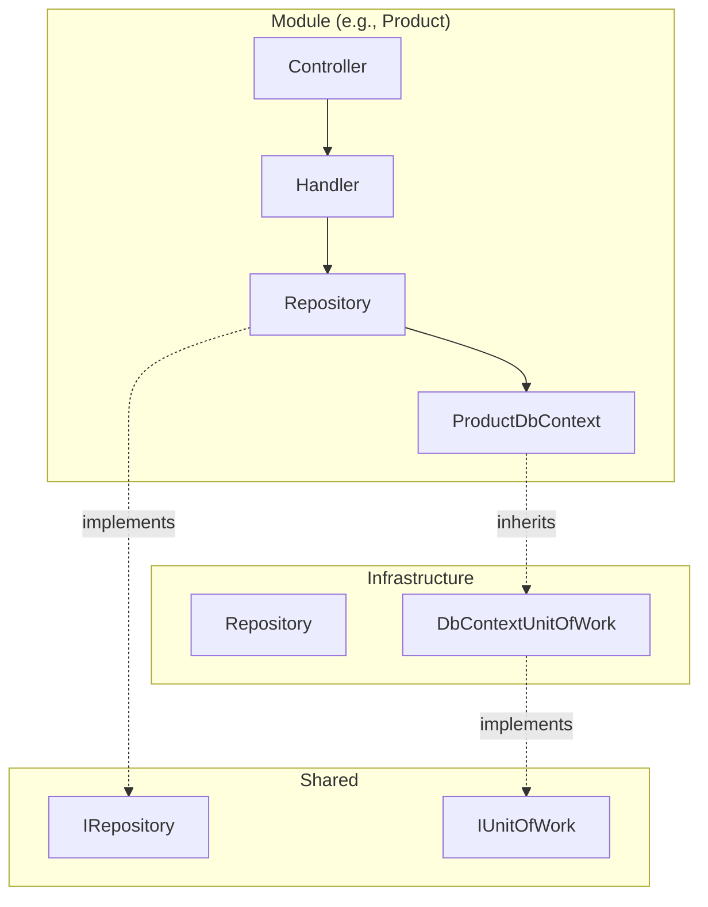
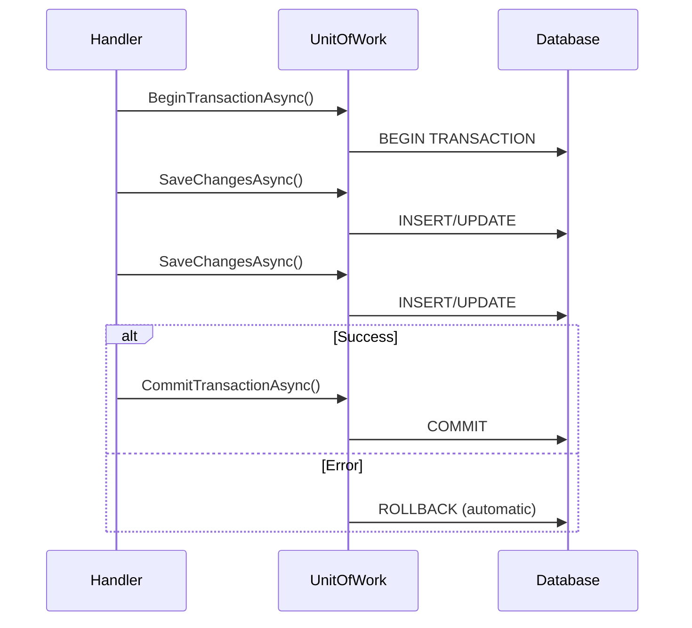
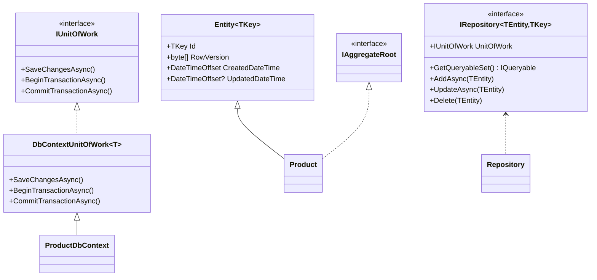

# 05 - Persistence and Transactions

> **Purpose**: Understand the data access layer, Entity Framework Core usage, the DbContext-per-module pattern, Repository and Unit of Work implementations, and transaction management.

---

## Table of Contents

- [Overview](#overview)
- [Entity Base Classes](#entity-base-classes)
- [DbContext Per Module](#dbcontext-per-module)
- [Repository Pattern](#repository-pattern)
- [Unit of Work](#unit-of-work)
- [Transaction Management](#transaction-management)
- [Bulk Operations](#bulk-operations)
- [Database Providers](#database-providers)
- [Migrations](#migrations)

---

## Overview

The persistence layer follows these principles:

1. **DbContext per Module** - Each module has its own `DbContext`, isolating data access
2. **Repository Pattern** - Generic `IRepository<T, TKey>` abstraction over EF Core
3. **Unit of Work** - `IUnitOfWork` manages transactions via `DbContext`
4. **Domain Independence** - Repository interfaces defined in Domain layer



---

## Entity Base Classes

### Entity<TKey>

All entities inherit from `Entity<TKey>`, providing common properties:

```csharp
// ClassifiedAds.Domain/Entities/Entity.cs
public abstract class Entity<TKey> : IHasKey<TKey>, ITrackable
{
    public TKey Id { get; set; }

    [Timestamp]
    public byte[] RowVersion { get; set; }  // Optimistic concurrency

    public DateTimeOffset CreatedDateTime { get; set; }

    public DateTimeOffset? UpdatedDateTime { get; set; }
}
```

**Where in code?**: [ClassifiedAds.Domain/Entities/Entity.cs](../ClassifiedAds.Domain/Entities/Entity.cs)

### IAggregateRoot

Marker interface indicating an entity is an aggregate root (can be directly persisted):

```csharp
// ClassifiedAds.Domain/Entities/IAggregateRoot.cs
namespace ClassifiedAds.Domain.Entities;

public interface IAggregateRoot
{
}
```

**Where in code?**: [ClassifiedAds.Domain/Entities/IAggregateRoot.cs](../ClassifiedAds.Domain/Entities/IAggregateRoot.cs)

### Example Entity

```csharp
// ClassifiedAds.Modules.Product/Entities/Product.cs
public class Product : Entity<Guid>, IAggregateRoot
{
    public string Code { get; set; }
    public string Name { get; set; }
    public string Description { get; set; }
}
```

---

## DbContext Per Module

Each module defines its own `DbContext`, ensuring data isolation:

### ProductDbContext

```csharp
// ClassifiedAds.Modules.Product/Persistence/ProductDbContext.cs
public class ProductDbContext : DbContextUnitOfWork<ProductDbContext>
{
    public ProductDbContext(DbContextOptions<ProductDbContext> options)
        : base(options)
    {
    }

    protected override void OnModelCreating(ModelBuilder builder)
    {
        base.OnModelCreating(builder);
        builder.ApplyConfigurationsFromAssembly(Assembly.GetExecutingAssembly());
    }

    public override int SaveChanges()
    {
        SetOutboxActivityId();
        return base.SaveChanges();
    }

    public override async Task<int> SaveChangesAsync(CancellationToken cancellationToken = default)
    {
        SetOutboxActivityId();
        return await base.SaveChangesAsync(cancellationToken);
    }

    // Sets Activity.Current.Id on outbox messages for distributed tracing
    private void SetOutboxActivityId()
    {
        var entities = ChangeTracker.Entries<OutboxMessage>();
        foreach (var entity in entities.Where(e => e.State == EntityState.Added))
        {
            var outbox = entity.Entity;
            if (string.IsNullOrWhiteSpace(outbox.ActivityId))
            {
                outbox.ActivityId = System.Diagnostics.Activity.Current?.Id;
            }
        }
    }
}
```

**Where in code?**: [ClassifiedAds.Modules.Product/Persistence/ProductDbContext.cs](../ClassifiedAds.Modules.Product/Persistence/ProductDbContext.cs)

### DbContext Registration

```csharp
// ClassifiedAds.Modules.Product/ServiceCollectionExtensions.cs
public static IServiceCollection AddProductModule(
    this IServiceCollection services, 
    Action<ProductModuleOptions> configureOptions)
{
    var settings = new ProductModuleOptions();
    configureOptions(settings);

    services.AddDbContext<ProductDbContext>(options => 
        options.UseNpgsql(settings.ConnectionStrings.Default, sql =>
        {
            if (!string.IsNullOrEmpty(settings.ConnectionStrings.MigrationsAssembly))
            {
                sql.MigrationsAssembly(settings.ConnectionStrings.MigrationsAssembly);
            }

            if (settings.ConnectionStrings.CommandTimeout.HasValue)
            {
                sql.CommandTimeout(settings.ConnectionStrings.CommandTimeout);
            }
        }));

    // ... rest of registration
}
```

**Where in code?**: [ClassifiedAds.Modules.Product/ServiceCollectionExtensions.cs](../ClassifiedAds.Modules.Product/ServiceCollectionExtensions.cs)

### Module DbContexts

| Module | DbContext | Tables |
|--------|-----------|--------|
| Product | `ProductDbContext` | Products, AuditLogEntries, OutboxMessages |
| Identity | `IdentityDbContext` | Users, Roles, Claims, DataProtectionKeys |
| Storage | `StorageDbContext` | FileEntries, OutboxMessages |
| Notification | `NotificationDbContext` | EmailMessages, SmsMessages |
| AuditLog | `AuditLogDbContext` | AuditLogEntries |
| Configuration | `ConfigurationDbContext` | ConfigurationEntries |

---

## Repository Pattern

### IRepository Interface

```csharp
// ClassifiedAds.Domain/Repositories/IRepository.cs
public interface IRepository<TEntity, TKey> : IConcurrencyHandler<TEntity>
    where TEntity : Entity<TKey>, IAggregateRoot
{
    IUnitOfWork UnitOfWork { get; }

    IQueryable<TEntity> GetQueryableSet();

    Task AddOrUpdateAsync(TEntity entity, CancellationToken cancellationToken = default);

    Task AddAsync(TEntity entity, CancellationToken cancellationToken = default);

    Task UpdateAsync(TEntity entity, CancellationToken cancellationToken = default);

    void Delete(TEntity entity);

    Task<T> FirstOrDefaultAsync<T>(IQueryable<T> query);

    Task<T> SingleOrDefaultAsync<T>(IQueryable<T> query);

    Task<List<T>> ToListAsync<T>(IQueryable<T> query);

    // Bulk operations
    Task BulkInsertAsync(IReadOnlyCollection<TEntity> entities, CancellationToken ct = default);

    Task BulkUpdateAsync(IReadOnlyCollection<TEntity> entities, 
        Expression<Func<TEntity, object>> columnNamesSelector, 
        CancellationToken ct = default);

    Task BulkMergeAsync(IReadOnlyCollection<TEntity> entities, 
        Expression<Func<TEntity, object>> idSelector,
        Expression<Func<TEntity, object>> updateColumnNamesSelector, 
        Expression<Func<TEntity, object>> insertColumnNamesSelector, 
        CancellationToken ct = default);

    Task BulkDeleteAsync(IReadOnlyCollection<TEntity> entities, CancellationToken ct = default);
}
```

**Where in code?**: [ClassifiedAds.Domain/Repositories/IRepository.cs](../ClassifiedAds.Domain/Repositories/IRepository.cs)

### Generic Repository Implementation

The base implementation lives in the persistence project:

```csharp
// ClassifiedAds.Persistence.PostgreSQL/Repository.cs (conceptual)
public class Repository<TEntity, TKey> : IRepository<TEntity, TKey>
    where TEntity : Entity<TKey>, IAggregateRoot
{
    private readonly DbContext _dbContext;
    private readonly DbSet<TEntity> _dbSet;

    public Repository(DbContext dbContext)
    {
        _dbContext = dbContext;
        _dbSet = dbContext.Set<TEntity>();
    }

    public IUnitOfWork UnitOfWork => (IUnitOfWork)_dbContext;

    public IQueryable<TEntity> GetQueryableSet() => _dbSet;

    public async Task AddAsync(TEntity entity, CancellationToken ct = default)
    {
        entity.CreatedDateTime = DateTimeOffset.UtcNow;
        await _dbSet.AddAsync(entity, ct);
    }

    public Task UpdateAsync(TEntity entity, CancellationToken ct = default)
    {
        entity.UpdatedDateTime = DateTimeOffset.UtcNow;
        _dbContext.Entry(entity).State = EntityState.Modified;
        return Task.CompletedTask;
    }

    public void Delete(TEntity entity)
    {
        _dbSet.Remove(entity);
    }

    public Task<T> FirstOrDefaultAsync<T>(IQueryable<T> query) 
        => query.FirstOrDefaultAsync();

    public Task<List<T>> ToListAsync<T>(IQueryable<T> query) 
        => query.ToListAsync();
}
```

### Repository Registration

```csharp
// ClassifiedAds.Modules.Product/ServiceCollectionExtensions.cs
services
    .AddScoped<IRepository<Product, Guid>, Repository<Product, Guid>>()
    .AddScoped<IProductRepository, ProductRepository>()
    .AddScoped<IRepository<AuditLogEntry, Guid>, Repository<AuditLogEntry, Guid>>()
    .AddScoped<IRepository<OutboxMessage, Guid>, Repository<OutboxMessage, Guid>>();
```

### Module-Specific Repositories

For complex queries, modules can define specialized repositories:

```csharp
// ClassifiedAds.Modules.Product/Persistence/IProductRepository.cs
public interface IProductRepository : IRepository<Product, Guid>
{
    // Custom query methods specific to products
}

// ClassifiedAds.Modules.Product/Persistence/ProductRepository.cs
public class ProductRepository : Repository<Product, Guid>, IProductRepository
{
    public ProductRepository(ProductDbContext dbContext) : base(dbContext)
    {
    }
    
    // Custom implementations
}
```

---

## Unit of Work

### IUnitOfWork Interface

```csharp
// ClassifiedAds.Domain/Repositories/IUnitOfWork.cs
public interface IUnitOfWork
{
    Task<int> SaveChangesAsync(CancellationToken cancellationToken = default);

    Task<IDisposable> BeginTransactionAsync(
        IsolationLevel isolationLevel = IsolationLevel.ReadCommitted, 
        CancellationToken cancellationToken = default);

    Task CommitTransactionAsync(CancellationToken cancellationToken = default);
}
```

**Where in code?**: [ClassifiedAds.Domain/Repositories/IUnitOfWork.cs](../ClassifiedAds.Domain/Repositories/IUnitOfWork.cs)

### DbContextUnitOfWork Implementation

```csharp
// ClassifiedAds.Persistence.PostgreSQL/DbContextUnitOfWork.cs
public class DbContextUnitOfWork<TDbContext> : DbContext, IUnitOfWork
    where TDbContext : DbContext
{
    private IDbContextTransaction _dbContextTransaction;

    public DbContextUnitOfWork(DbContextOptions<TDbContext> options)
        : base(options)
    {
    }

    public async Task<IDisposable> BeginTransactionAsync(
        IsolationLevel isolationLevel = IsolationLevel.ReadCommitted, 
        CancellationToken cancellationToken = default)
    {
        _dbContextTransaction = await Database.BeginTransactionAsync(
            isolationLevel, 
            cancellationToken);
        return _dbContextTransaction;
    }

    public async Task CommitTransactionAsync(CancellationToken cancellationToken = default)
    {
        await _dbContextTransaction.CommitAsync(cancellationToken);
    }
}
```

**Where in code?**: [ClassifiedAds.Persistence.PostgreSQL/DbContextUnitOfWork.cs](../ClassifiedAds.Persistence.PostgreSQL/DbContextUnitOfWork.cs)

### Using Unit of Work

```csharp
// In a command handler
public async Task HandleAsync(MyCommand command, CancellationToken ct)
{
    await _repository.AddAsync(entity, ct);
    await _repository.UnitOfWork.SaveChangesAsync(ct);  // Commit changes
}
```

---

## Transaction Management

### Implicit Transactions (SaveChanges)

Each `SaveChangesAsync()` call wraps changes in a transaction:

```csharp
public async Task HandleAsync(TransferFundsCommand command, CancellationToken ct)
{
    // All changes in a single SaveChanges are atomic
    sourceAccount.Balance -= command.Amount;
    targetAccount.Balance += command.Amount;
    
    await _repository.UpdateAsync(sourceAccount, ct);
    await _repository.UpdateAsync(targetAccount, ct);
    await _repository.UnitOfWork.SaveChangesAsync(ct);  // Single transaction
}
```

### Explicit Transactions

For operations spanning multiple `SaveChanges` calls:

```csharp
public async Task HandleAsync(ComplexCommand command, CancellationToken ct)
{
    using var transaction = await _repository.UnitOfWork.BeginTransactionAsync(
        IsolationLevel.ReadCommitted, ct);
    
    try
    {
        // First operation
        await _repository.AddAsync(entity1, ct);
        await _repository.UnitOfWork.SaveChangesAsync(ct);
        
        // Second operation (can use entity1.Id)
        entity2.ParentId = entity1.Id;
        await _repository.AddAsync(entity2, ct);
        await _repository.UnitOfWork.SaveChangesAsync(ct);
        
        // Commit both
        await _repository.UnitOfWork.CommitTransactionAsync(ct);
    }
    catch
    {
        // Transaction automatically rolled back on dispose
        throw;
    }
}
```

### Transaction Flow



---

## Bulk Operations

### Bulk Insert

```csharp
await _repository.BulkInsertAsync(products, cancellationToken);
```

### Bulk Update (Selective Columns)

```csharp
await _repository.BulkUpdateAsync(
    products,
    x => new { x.Name, x.Price },  // Only update these columns
    cancellationToken);
```

### Bulk Merge (Upsert)

```csharp
await _repository.BulkMergeAsync(
    products,
    x => x.Code,                     // Match on Code
    x => new { x.Name, x.Price },    // Update these if exists
    x => new { x.Code, x.Name, x.Price },  // Insert these if new
    cancellationToken);
```

### Bulk Delete

```csharp
await _repository.BulkDeleteAsync(products, cancellationToken);
```

---

## Database Provider

### PostgreSQL

```csharp
services.AddDbContext<ProductDbContext>(options => 
    options.UseNpgsql(connectionString));
```

**Where in code?**: [ClassifiedAds.Persistence.PostgreSQL/](../ClassifiedAds.Persistence.PostgreSQL/)

### Provider Configuration

The provider is configured via connection string settings in each module:

```json
{
  "Modules": {
    "Product": {
      "ConnectionStrings": {
        "Default": "Server=.;Database=ClassifiedAds;...",
        "MigrationsAssembly": "ClassifiedAds.Migrator"
      }
    }
  }
}
```

---

## Migrations

### EF Core Migrations

Migrations run per-module via the `Migrator` project:

```csharp
// ClassifiedAds.Migrator/Program.cs
app.MigrateAuditLogDb();
app.MigrateConfigurationDb();
app.MigrateIdentityDb();
app.MigrateNotificationDb();
app.MigrateProductDb();
app.MigrateStorageDb();
```

**Where in code?**: [ClassifiedAds.Migrator/Program.cs](../ClassifiedAds.Migrator/Program.cs)

### Migration Method Pattern

Each module provides a migration extension:

```csharp
// ClassifiedAds.Modules.Product/ServiceCollectionExtensions.cs
public static void MigrateProductDb(this IHost app)
{
    using var serviceScope = app.Services.CreateScope();
    serviceScope.ServiceProvider
        .GetRequiredService<ProductDbContext>()
        .Database.Migrate();
}
```

### DbUp Scripts

Additional scripts can run via DbUp:

```csharp
// ClassifiedAds.Migrator/Program.cs
var upgrader = DeployChanges.To
    .SqlDatabase(configuration["Modules:AuditLog:ConnectionStrings:Default"])
    .WithScriptsEmbeddedInAssembly(Assembly.GetExecutingAssembly())
    .LogToConsole()
    .Build();
```

### Creating Migrations

```bash
# From the Migrator project directory
dotnet ef migrations add InitialCreate \
    --context ProductDbContext \
    --project ../ClassifiedAds.Modules.Product \
    --startup-project .
```

---

## Entity Configuration

### Fluent API Configuration

```csharp
// ClassifiedAds.Modules.Product/DbConfigurations/ProductConfiguration.cs
public class ProductConfiguration : IEntityTypeConfiguration<Product>
{
    public void Configure(EntityTypeBuilder<Product> builder)
    {
        builder.ToTable("Products");
        
        builder.HasKey(x => x.Id);
        
        builder.Property(x => x.Code)
            .HasMaxLength(50)
            .IsRequired();
            
        builder.Property(x => x.Name)
            .HasMaxLength(200)
            .IsRequired();
            
        builder.Property(x => x.RowVersion)
            .IsRowVersion();
    }
}
```

### Auto-Discovery

Configurations are auto-discovered:

```csharp
// In DbContext.OnModelCreating
builder.ApplyConfigurationsFromAssembly(Assembly.GetExecutingAssembly());
```

---

## Optimistic Concurrency

### RowVersion Property

```csharp
public abstract class Entity<TKey>
{
    [Timestamp]
    public byte[] RowVersion { get; set; }
}
```

### Handling Concurrency Conflicts

```csharp
try
{
    await _repository.UnitOfWork.SaveChangesAsync(ct);
}
catch (DbUpdateConcurrencyException ex)
{
    // Handle conflict - reload and retry, or throw business exception
    var entry = ex.Entries.Single();
    await entry.ReloadAsync(ct);
    // Retry logic or throw
}
```

---

## Class Diagram



---

*Previous: [04 - CQRS and Mediator](04-cqrs-and-mediator.md) | Next: [06 - Events and Outbox](06-events-and-outbox.md)*
