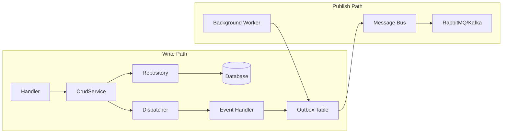
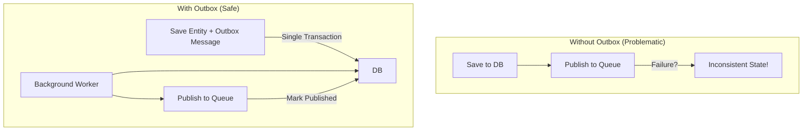
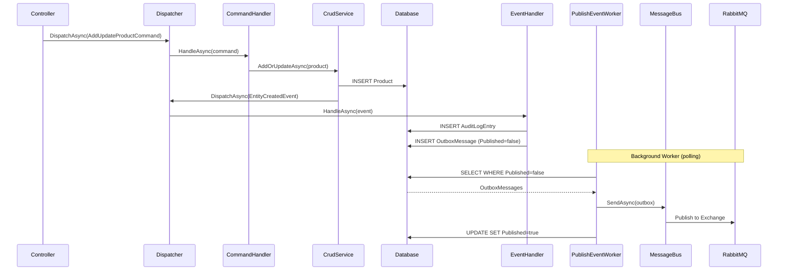

# 06 - Events and Outbox

> **Purpose**: Understand domain events, the outbox pattern for reliable event publishing, message bus integration, and how events flow through the system.

---

## Table of Contents

- [Overview](#overview)
- [Domain Events](#domain-events)
- [Event Handlers](#event-handlers)
- [The Outbox Pattern](#the-outbox-pattern)
- [Message Bus](#message-bus)
- [Event Publishing Flow](#event-publishing-flow)
- [Feature Toggles](#feature-toggles)
- [Best Practices](#best-practices)

---

## Overview

This architecture uses an event-driven approach for cross-cutting concerns and inter-module communication:

1. **Domain Events** - Notify about state changes within a bounded context
2. **Outbox Pattern** - Guarantee reliable event delivery with transactional consistency
3. **Message Bus** - Distribute events to external consumers



---

## Domain Events

### IDomainEvent Interface

```csharp
// ClassifiedAds.Domain/Events/IDomainEvent.cs
namespace ClassifiedAds.Domain.Events;

public interface IDomainEvent
{
}
```

**Where in code?**: [ClassifiedAds.Domain/Events/IDomainEvent.cs](../ClassifiedAds.Domain/Events/IDomainEvent.cs)

### Built-in Event Types

The framework provides generic events for entity lifecycle:

```csharp
// ClassifiedAds.Domain/Events/EntityCreatedEvent.cs
public class EntityCreatedEvent<T> : IDomainEvent
    where T : Entity<Guid>
{
    public EntityCreatedEvent(T entity, DateTime eventDateTime)
    {
        Entity = entity;
        EventDateTime = eventDateTime;
    }

    public T Entity { get; }
    public DateTime EventDateTime { get; }
}
```

**Where in code?**: [ClassifiedAds.Domain/Events/EntityCreatedEvent.cs](../ClassifiedAds.Domain/Events/EntityCreatedEvent.cs)

Similar events exist for:
- `EntityUpdatedEvent<T>`
- `EntityDeletedEvent<T>`

### Event Dispatch via CrudService

```csharp
// ClassifiedAds.Application/Common/Services/CrudService.cs
public async Task AddAsync(T entity, CancellationToken cancellationToken = default)
{
    await _repository.AddAsync(entity, cancellationToken);
    await _unitOfWork.SaveChangesAsync(cancellationToken);
    
    // Dispatch domain event AFTER successful save
    await _dispatcher.DispatchAsync(
        new EntityCreatedEvent<T>(entity, DateTime.UtcNow), 
        cancellationToken);
}

public async Task UpdateAsync(T entity, CancellationToken cancellationToken = default)
{
    await _repository.UpdateAsync(entity, cancellationToken);
    await _unitOfWork.SaveChangesAsync(cancellationToken);
    
    await _dispatcher.DispatchAsync(
        new EntityUpdatedEvent<T>(entity, DateTime.UtcNow), 
        cancellationToken);
}

public async Task DeleteAsync(T entity, CancellationToken cancellationToken = default)
{
    _repository.Delete(entity);
    await _unitOfWork.SaveChangesAsync(cancellationToken);
    
    await _dispatcher.DispatchAsync(
        new EntityDeletedEvent<T>(entity, DateTime.UtcNow), 
        cancellationToken);
}
```

**Where in code?**: [ClassifiedAds.Application/Common/Services/CrudService.cs](../ClassifiedAds.Application/Common/Services/CrudService.cs)

---

## Event Handlers

### IDomainEventHandler Interface

```csharp
// ClassifiedAds.Domain/Events/IDomainEventHandler.cs
public interface IDomainEventHandler<TEvent>
    where TEvent : IDomainEvent
{
    Task HandleAsync(TEvent domainEvent, CancellationToken cancellationToken = default);
}
```

### ProductCreatedEventHandler Example

```csharp
// ClassifiedAds.Modules.Product/EventHandlers/ProductCreatedEventHandler.cs
public class ProductCreatedEventHandler : IDomainEventHandler<EntityCreatedEvent<Entities.Product>>
{
    private readonly ICurrentUser _currentUser;
    private readonly IRepository<AuditLogEntry, Guid> _auditLogRepository;
    private readonly IRepository<OutboxMessage, Guid> _outboxMessageRepository;

    public ProductCreatedEventHandler(
        ICurrentUser currentUser,
        IRepository<AuditLogEntry, Guid> auditLogRepository,
        IRepository<OutboxMessage, Guid> outboxMessageRepository)
    {
        _currentUser = currentUser;
        _auditLogRepository = auditLogRepository;
        _outboxMessageRepository = outboxMessageRepository;
    }

    public async Task HandleAsync(
        EntityCreatedEvent<Entities.Product> domainEvent, 
        CancellationToken cancellationToken = default)
    {
        // 1. Create audit log entry (local to module)
        var auditLog = new AuditLogEntry
        {
            UserId = _currentUser.IsAuthenticated ? _currentUser.UserId : Guid.Empty,
            CreatedDateTime = domainEvent.EventDateTime,
            Action = "CREATED_PRODUCT",
            ObjectId = domainEvent.Entity.Id.ToString(),
            Log = domainEvent.Entity.AsJsonString(),
        };

        await _auditLogRepository.AddOrUpdateAsync(auditLog, cancellationToken);
        await _auditLogRepository.UnitOfWork.SaveChangesAsync(cancellationToken);

        // 2. Write events to outbox for eventual external publishing
        await _outboxMessageRepository.AddOrUpdateAsync(new OutboxMessage
        {
            EventType = EventTypeConstants.AuditLogEntryCreated,
            TriggeredById = _currentUser.UserId,
            CreatedDateTime = auditLog.CreatedDateTime,
            ObjectId = auditLog.Id.ToString(),
            Payload = auditLog.AsJsonString(),
        }, cancellationToken);

        await _outboxMessageRepository.AddOrUpdateAsync(new OutboxMessage
        {
            EventType = EventTypeConstants.ProductCreated,
            TriggeredById = _currentUser.UserId,
            CreatedDateTime = domainEvent.EventDateTime,
            ObjectId = domainEvent.Entity.Id.ToString(),
            Payload = domainEvent.Entity.AsJsonString(),
        }, cancellationToken);

        await _outboxMessageRepository.UnitOfWork.SaveChangesAsync(cancellationToken);
    }
}
```

**Where in code?**: [ClassifiedAds.Modules.Product/EventHandlers/ProductCreatedEventHandler.cs](../ClassifiedAds.Modules.Product/EventHandlers/ProductCreatedEventHandler.cs)

### Event Handler Registration

Handlers are auto-discovered and registered via the Dispatcher:

```csharp
// ClassifiedAds.Application/Common/Dispatcher.cs
public static void RegisterEventHandlers(Assembly assembly, IServiceCollection services)
{
    var types = assembly.GetTypes()
        .Where(x => x.GetInterfaces().Any(y => 
            y.IsGenericType && 
            y.GetGenericTypeDefinition() == typeof(IDomainEventHandler<>)))
        .ToList();

    foreach (var type in types)
    {
        services.AddTransient(type);
    }

    _eventHandlers.AddRange(types);
}
```

### Event Dispatch Logic

```csharp
// ClassifiedAds.Application/Common/Dispatcher.cs
public async Task DispatchAsync(IDomainEvent domainEvent, CancellationToken cancellationToken = default)
{
    foreach (Type handlerType in _eventHandlers)
    {
        bool canHandleEvent = handlerType.GetInterfaces()
            .Any(x => x.IsGenericType
                && x.GetGenericTypeDefinition() == typeof(IDomainEventHandler<>)
                && x.GenericTypeArguments[0] == domainEvent.GetType());

        if (canHandleEvent)
        {
            dynamic handler = _provider.GetService(handlerType);
            await handler.HandleAsync((dynamic)domainEvent, cancellationToken);
        }
    }
}
```

**Where in code?**: [ClassifiedAds.Application/Common/Dispatcher.cs](../ClassifiedAds.Application/Common/Dispatcher.cs)

---

## The Outbox Pattern

### Why Outbox?

The outbox pattern solves the dual-write problem:



### OutboxMessage Entity

```csharp
// ClassifiedAds.Modules.Product/Entities/OutboxMessage.cs
public class OutboxMessage : OutboxMessageBase, IAggregateRoot
{
}

public class ArchivedOutboxMessage : OutboxMessageBase, IAggregateRoot
{
}

public abstract class OutboxMessageBase : Entity<Guid>
{
    public string EventType { get; set; }      // e.g., "ProductCreated"
    public Guid TriggeredById { get; set; }    // User who triggered
    public string ObjectId { get; set; }        // Related entity ID
    public string Payload { get; set; }         // JSON serialized data
    public bool Published { get; set; }         // Has been sent to message bus
    public string ActivityId { get; set; }      // Distributed tracing correlation
}
```

**Where in code?**: [ClassifiedAds.Modules.Product/Entities/OutboxMessage.cs](../ClassifiedAds.Modules.Product/Entities/OutboxMessage.cs)

### PublishEventWorker

Background service that polls outbox and publishes to message bus:

```csharp
// ClassifiedAds.Modules.Product/HostedServices/PublishEventWorker.cs
public class PublishEventWorker : BackgroundService
{
    private readonly IServiceProvider _services;
    private readonly IOutboxPublishingToggle _outboxPublishingToggle;
    private readonly ILogger<PublishEventWorker> _logger;

    protected override async Task ExecuteAsync(CancellationToken cancellationToken)
    {
        _logger.LogDebug("PublishEventWorker is starting.");
        await DoWork(cancellationToken);
    }

    private async Task DoWork(CancellationToken cancellationToken)
    {
        while (!cancellationToken.IsCancellationRequested)
        {
            // Check feature toggle
            if (!_outboxPublishingToggle.IsEnabled())
            {
                _logger.LogInformation("PublishEventWorker is being paused. Retry in 10s.");
                await Task.Delay(10000, cancellationToken);
                continue;
            }

            try
            {
                var publishEventsCommand = new PublishEventsCommand();

                using (var scope = _services.CreateScope())
                {
                    var dispatcher = scope.ServiceProvider.GetDispatcher();
                    await dispatcher.DispatchAsync(publishEventsCommand, cancellationToken);
                }

                // If no events, wait before polling again
                if (publishEventsCommand.SentEventsCount == 0)
                {
                    await Task.Delay(10000, cancellationToken);
                }
            }
            catch (Exception ex)
            {
                _logger.LogError(ex, "Error in PublishEventWorker");
                await Task.Delay(10000, cancellationToken);
            }
        }
    }
}
```

**Where in code?**: [ClassifiedAds.Modules.Product/HostedServices/PublishEventWorker.cs](../ClassifiedAds.Modules.Product/HostedServices/PublishEventWorker.cs)

### PublishEventsCommand

```csharp
// ClassifiedAds.Modules.Product/Commands/PublishEventsCommand.cs
public class PublishEventsCommand : ICommand
{
    public int SentEventsCount { get; set; }
}

public class PublishEventsCommandHandler : ICommandHandler<PublishEventsCommand>
{
    private readonly IRepository<OutboxMessage, Guid> _outboxMessageRepository;
    private readonly IMessageBus _messageBus;
    private readonly IDateTimeProvider _dateTimeProvider;

    public async Task HandleAsync(
        PublishEventsCommand command, 
        CancellationToken cancellationToken = default)
    {
        // Fetch unpublished messages (batch of 50)
        var events = _outboxMessageRepository.GetQueryableSet()
            .Where(x => !x.Published)
            .OrderBy(x => x.CreatedDateTime)
            .Take(50)
            .ToList();

        foreach (var eventLog in events)
        {
            // Create message for bus
            var outbox = new PublishingOutboxMessage
            {
                Id = eventLog.Id.ToString(),
                EventType = eventLog.EventType,
                EventSource = typeof(PublishEventsCommand).Assembly.GetName().Name,
                Payload = eventLog.Payload,
                ActivityId = eventLog.ActivityId
            };

            // Publish to message bus
            await _messageBus.SendAsync(outbox, cancellationToken);

            // Mark as published
            eventLog.Published = true;
            eventLog.UpdatedDateTime = _dateTimeProvider.OffsetNow;
            await _outboxMessageRepository.UnitOfWork.SaveChangesAsync(cancellationToken);
        }

        command.SentEventsCount = events.Count;
    }
}
```

**Where in code?**: [ClassifiedAds.Modules.Product/Commands/PublishEventsCommand.cs](../ClassifiedAds.Modules.Product/Commands/PublishEventsCommand.cs)

---

## Message Bus

### IMessageBus Interface

```csharp
// ClassifiedAds.Domain/Infrastructure/Messaging/IMessageBus.cs
public interface IMessageBus
{
    Task SendAsync<T>(T message, MetaData metaData = null, CancellationToken cancellationToken = default)
        where T : IMessageBusMessage;

    Task ReceiveAsync<TConsumer, T>(
        Func<T, MetaData, CancellationToken, Task> action, 
        CancellationToken cancellationToken = default)
        where T : IMessageBusMessage;

    Task SendAsync(PublishingOutboxMessage outbox, CancellationToken cancellationToken = default);
}

public interface IMessageBusMessage { }
public interface IMessageBusEvent : IMessageBusMessage { }
public interface IMessageBusCommand : IMessageBusMessage { }
```

**Where in code?**: [ClassifiedAds.Domain/Infrastructure/Messaging/IMessageBus.cs](../ClassifiedAds.Domain/Infrastructure/Messaging/IMessageBus.cs)

### Message Bus Providers

Multiple providers are supported via configuration:

```csharp
// ClassifiedAds.Infrastructure/Messaging/MessagingCollectionExtensions.cs
public static IServiceCollection AddMessageBusSender<T>(
    this IServiceCollection services, 
    MessagingOptions options)
{
    if (options.UsedRabbitMQ())
    {
        services.AddRabbitMQSender<T>(options.RabbitMQ);
    }
    else if (options.UsedKafka())
    {
        services.AddKafkaSender<T>(options.Kafka);
    }
    else if (options.UsedAzureServiceBus())
    {
        services.AddAzureServiceBusSender<T>(options.AzureServiceBus);
    }
    else if (options.UsedFake())
    {
        services.AddFakeSender<T>();
    }

    return services;
}
```

**Where in code?**: [ClassifiedAds.Infrastructure/Messaging/MessagingCollectionExtensions.cs](../ClassifiedAds.Infrastructure/Messaging/MessagingCollectionExtensions.cs)

### RabbitMQ Example

```csharp
// ClassifiedAds.Infrastructure/Messaging/RabbitMQ/RabbitMQSender.cs (conceptual)
public class RabbitMQSender<T> : IMessageSender<T>
{
    public async Task SendAsync(T message, CancellationToken cancellationToken = default)
    {
        var json = JsonSerializer.Serialize(message);
        var body = Encoding.UTF8.GetBytes(json);
        
        channel.BasicPublish(
            exchange: _exchangeName,
            routingKey: _routingKey,
            basicProperties: null,
            body: body);
    }
}
```

**Where in code?**: [ClassifiedAds.Infrastructure/Messaging/RabbitMQ/](../ClassifiedAds.Infrastructure/Messaging/RabbitMQ/)

---

## Event Publishing Flow

### Complete Flow Diagram



### Activity/Trace Propagation

The outbox stores `ActivityId` for distributed tracing:

```csharp
// ClassifiedAds.Modules.Product/Persistence/ProductDbContext.cs
private void SetOutboxActivityId()
{
    var entities = ChangeTracker.Entries<OutboxMessage>();
    foreach (var entity in entities.Where(e => e.State == EntityState.Added))
    {
        var outbox = entity.Entity;
        if (string.IsNullOrWhiteSpace(outbox.ActivityId))
        {
            outbox.ActivityId = System.Diagnostics.Activity.Current?.Id;
        }
    }
}
```

---

## Feature Toggles

### IOutboxPublishingToggle

```csharp
// ClassifiedAds.Application/FeatureToggles/IOutboxPublishingToggle.cs
public interface IOutboxPublishingToggle
{
    bool IsEnabled();
}
```

### File-Based Toggle

```csharp
// ClassifiedAds.Background/Program.cs
static void AddFeatureToggles(IServiceCollection services)
{
    services.AddSingleton<IOutboxPublishingToggle, FileBasedOutboxPublishingToggle>();
}
```

This allows runtime control of event publishing without redeployment.

---

## Best Practices

### 1. Events After Commit

Always dispatch events AFTER `SaveChangesAsync()` succeeds:

```csharp
// ✅ Correct
await _repository.AddAsync(entity, ct);
await _unitOfWork.SaveChangesAsync(ct);
await _dispatcher.DispatchAsync(new EntityCreatedEvent<T>(entity, DateTime.UtcNow), ct);

// ❌ Wrong - event dispatched before commit
await _dispatcher.DispatchAsync(new EntityCreatedEvent<T>(entity, DateTime.UtcNow), ct);
await _repository.AddAsync(entity, ct);
await _unitOfWork.SaveChangesAsync(ct);
```

### 2. Outbox Same Transaction

Write to outbox in the same transaction as the triggering entity:

```csharp
// In event handler - save to same DbContext
await _outboxMessageRepository.AddOrUpdateAsync(outboxMessage, ct);
await _outboxMessageRepository.UnitOfWork.SaveChangesAsync(ct);
```

### 3. Idempotent Consumers

Message bus consumers should be idempotent (handle duplicates safely):

```csharp
public async Task HandleAsync(ProductCreatedMessage message, CancellationToken ct)
{
    // Check if already processed
    if (await _repository.ExistsAsync(x => x.ExternalId == message.Id))
    {
        return; // Already processed
    }
    
    // Process message...
}
```

### 4. Event Payload Versioning

Include version information in payloads:

```csharp
var outboxMessage = new OutboxMessage
{
    EventType = "ProductCreated.v1",  // Version in type
    Payload = JsonSerializer.Serialize(new {
        Version = 1,
        Data = entity
    })
};
```

### 5. Monitor Outbox Lag

Keep unpublished message count low:

```sql
-- Monitor query
SELECT COUNT(*) AS UnpublishedCount
FROM OutboxMessages 
WHERE Published = 0
```

---

## Module Event Ownership

| Module | Has Outbox | Event Types |
|--------|------------|-------------|
| Product | ✅ | ProductCreated, ProductUpdated, ProductDeleted, AuditLogEntryCreated |
| Storage | ✅ | FileUploaded, FileDeleted |
| Identity | ❌ | (Uses central AuditLog module) |
| Notification | ❌ | (Receives events, doesn't produce) |
| AuditLog | ❌ | (Central logging, no external events) |

---

*Previous: [05 - Persistence and Transactions](05-persistence-and-transactions.md) | Next: [07 - Modules](07-modules.md)*
