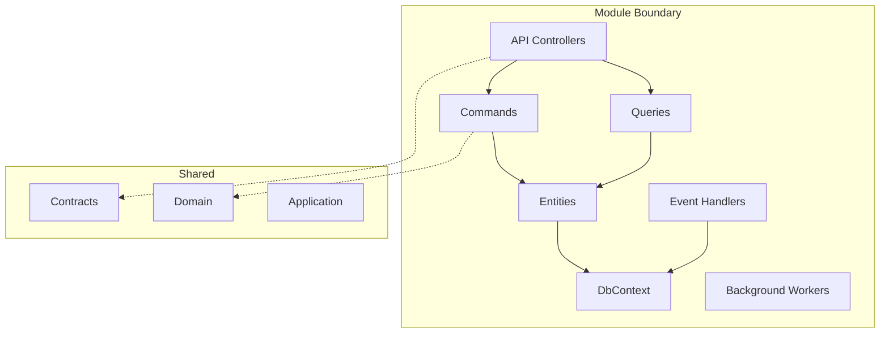
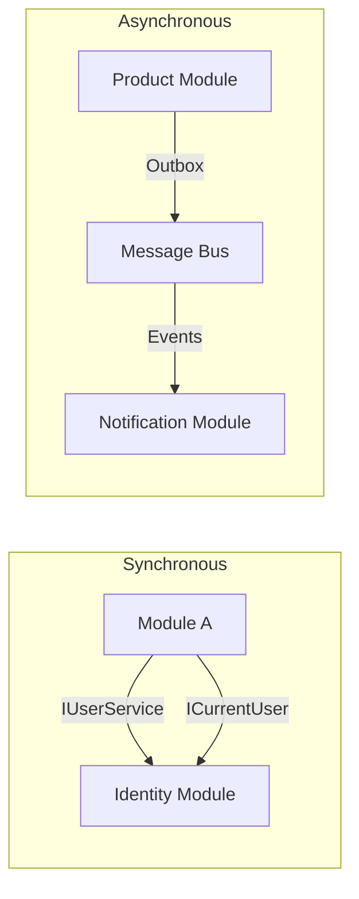
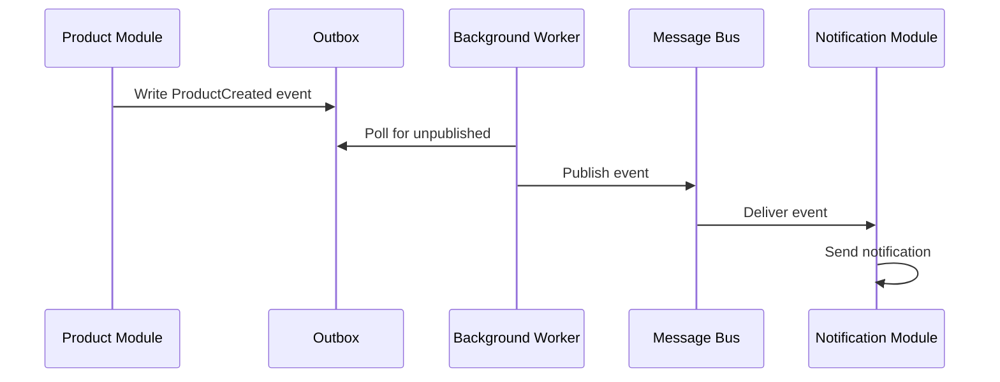

# 07 - Modules

> **Purpose**: Understand the module structure, boundaries, responsibilities of each module, and how modules communicate with each other.

---

## Table of Contents

- [Module Architecture](#module-architecture)
- [Module Structure Convention](#module-structure-convention)
- [Module Registration](#module-registration)
- [Product Module (Reference)](#product-module-reference)
- [Identity Module](#identity-module)
- [Storage Module](#storage-module)
- [Notification Module](#notification-module)
- [AuditLog Module](#auditlog-module)
- [Configuration Module](#configuration-module)
- [Inter-Module Communication](#inter-module-communication)

---

## Module Architecture

Each module in this Modular Monolith represents a **bounded context** with:

- Its own database schema (via dedicated `DbContext`)
- Complete vertical slice (controllers, commands, queries, entities)
- Self-contained DI registration
- Optional background workers



---

## Module Structure Convention

Every module follows this folder structure:

```
ClassifiedAds.Modules.{ModuleName}/
├── Authorization/           # Permission constants, authorization handlers
│   └── Permissions.cs
├── Commands/                # CQRS commands and handlers
│   ├── AddUpdateXxxCommand.cs
│   └── DeleteXxxCommand.cs
├── ConfigurationOptions/    # Module-specific settings
│   └── XxxModuleOptions.cs
├── Constants/               # Module constants (event types, etc.)
│   └── EventTypeConstants.cs
├── Controllers/             # API endpoints
│   └── XxxController.cs
├── Csv/                     # CSV import/export handlers
├── DbConfigurations/        # EF Core entity configurations
│   └── XxxConfiguration.cs
├── DTOs/                    # Data transfer objects
├── Entities/                # Domain entities
│   ├── Xxx.cs
│   ├── AuditLogEntry.cs
│   └── OutboxMessage.cs
├── EventHandlers/           # Domain event handlers
│   └── XxxCreatedEventHandler.cs
├── HostedServices/          # Background workers
│   └── PublishEventWorker.cs
├── Html/                    # HTML export handlers
├── Migrations/              # EF Core migrations (if stored in module)
├── Models/                  # API request/response models
│   └── XxxModel.cs
├── OutBoxEventPublishers/   # Outbox message publishers
├── Pdf/                     # PDF export handlers
├── Persistence/             # DbContext and repositories
│   ├── XxxDbContext.cs
│   ├── IXxxRepository.cs
│   └── XxxRepository.cs
├── Queries/                 # CQRS queries and handlers
│   ├── GetXxxQuery.cs
│   └── GetXxxsQuery.cs
├── RateLimiterPolicies/     # Rate limiting configuration
├── ClassifiedAds.Modules.{ModuleName}.csproj
└── ServiceCollectionExtensions.cs  # DI registration entry point
```

---

## Module Registration

Each module provides extension methods for registration in the host application.

### ServiceCollectionExtensions Pattern

```csharp
// ClassifiedAds.Modules.Product/ServiceCollectionExtensions.cs
public static class ServiceCollectionExtensions
{
    // Core module registration (DbContext, repositories, handlers)
    public static IServiceCollection AddProductModule(
        this IServiceCollection services, 
        Action<ProductModuleOptions> configureOptions)
    {
        var settings = new ProductModuleOptions();
        configureOptions(settings);

        services.Configure(configureOptions);

        // DbContext
        services.AddDbContext<ProductDbContext>(options => 
            options.UseSqlServer(settings.ConnectionStrings.Default, sql =>
            {
                if (!string.IsNullOrEmpty(settings.ConnectionStrings.MigrationsAssembly))
                {
                    sql.MigrationsAssembly(settings.ConnectionStrings.MigrationsAssembly);
                }
            }));

        // Repositories
        services
            .AddScoped<IRepository<Product, Guid>, Repository<Product, Guid>>()
            .AddScoped<IProductRepository, ProductRepository>()
            .AddScoped<IRepository<AuditLogEntry, Guid>, Repository<AuditLogEntry, Guid>>()
            .AddScoped<IRepository<OutboxMessage, Guid>, Repository<OutboxMessage, Guid>>();

        // Auto-register handlers
        services.AddMessageHandlers(Assembly.GetExecutingAssembly());

        // Authorization policies
        services.AddAuthorizationPolicies(Assembly.GetExecutingAssembly());

        // Rate limiting
        services.AddRateLimiter(options =>
        {
            options.AddPolicy<string, DefaultRateLimiterPolicy>(
                RateLimiterPolicyNames.DefaultPolicy);
        });

        return services;
    }

    // MVC controllers registration
    public static IMvcBuilder AddProductModule(this IMvcBuilder builder)
    {
        return builder.AddApplicationPart(Assembly.GetExecutingAssembly());
    }

    // Database migration
    public static void MigrateProductDb(this IHost app)
    {
        using var serviceScope = app.Services.CreateScope();
        serviceScope.ServiceProvider
            .GetRequiredService<ProductDbContext>()
            .Database.Migrate();
    }

    // Background services registration
    public static IServiceCollection AddHostedServicesProductModule(
        this IServiceCollection services)
    {
        services.AddMessageBusConsumers(Assembly.GetExecutingAssembly());
        services.AddOutboxMessagePublishers(Assembly.GetExecutingAssembly());
        services.AddHostedService<PublishEventWorker>();
        return services;
    }
}
```

**Where in code?**: [ClassifiedAds.Modules.Product/ServiceCollectionExtensions.cs](../ClassifiedAds.Modules.Product/ServiceCollectionExtensions.cs)

### Host Registration

```csharp
// ClassifiedAds.WebAPI/Program.cs
services
    .AddAuditLogModule(opt => configuration.GetSection("Modules:AuditLog").Bind(opt))
    .AddConfigurationModule(opt => configuration.GetSection("Modules:Configuration").Bind(opt))
    .AddIdentityModuleCore(opt => configuration.GetSection("Modules:Identity").Bind(opt))
    .AddNotificationModule(opt => configuration.GetSection("Modules:Notification").Bind(opt))
    .AddProductModule(opt => configuration.GetSection("Modules:Product").Bind(opt))
    .AddStorageModule(opt => configuration.GetSection("Modules:Storage").Bind(opt))
    .AddApplicationServices();

// MVC controllers
services.AddControllers()
    .AddAuditLogModule()
    .AddConfigurationModule()
    .AddIdentityModule()
    .AddNotificationModule()
    .AddProductModule()
    .AddStorageModule();
```

**Where in code?**: [ClassifiedAds.WebAPI/Program.cs](../ClassifiedAds.WebAPI/Program.cs)

---

## Product Module (Reference)

The Product module serves as the **reference implementation** for all other modules.

### Responsibility

Sample business domain for product catalog management.

### Entities

| Entity | Description |
|--------|-------------|
| `Product` | Main domain entity (Code, Name, Description) |
| `AuditLogEntry` | Local audit trail for products |
| `OutboxMessage` | Event outbox for reliable publishing |

### Key Files

| File | Purpose |
|------|---------|
| [ServiceCollectionExtensions.cs](../ClassifiedAds.Modules.Product/ServiceCollectionExtensions.cs) | DI registration |
| [ProductDbContext.cs](../ClassifiedAds.Modules.Product/Persistence/ProductDbContext.cs) | EF Core DbContext |
| [ProductsController.cs](../ClassifiedAds.Modules.Product/Controllers/ProductsController.cs) | REST API endpoints |
| [AddUpdateProductCommand.cs](../ClassifiedAds.Modules.Product/Commands/AddUpdateProductCommand.cs) | Create/Update handler |
| [GetProductsQuery.cs](../ClassifiedAds.Modules.Product/Queries/GetProductsQuery.cs) | List products handler |
| [ProductCreatedEventHandler.cs](../ClassifiedAds.Modules.Product/EventHandlers/ProductCreatedEventHandler.cs) | Domain event handler |
| [PublishEventWorker.cs](../ClassifiedAds.Modules.Product/HostedServices/PublishEventWorker.cs) | Outbox publisher |

### API Endpoints

| Method | Route | Permission |
|--------|-------|------------|
| GET | `/api/products` | GetProducts |
| GET | `/api/products/{id}` | GetProduct |
| POST | `/api/products` | AddProduct |
| PUT | `/api/products/{id}` | UpdateProduct |
| DELETE | `/api/products/{id}` | DeleteProduct |
| GET | `/api/products/{id}/auditlogs` | GetProductAuditLogs |

---

## Identity Module

### Responsibility

User and role management, ASP.NET Core Identity integration, external identity provider support.

### Features

- User management (CRUD)
- Role management (CRUD)
- ASP.NET Core Identity integration
- External providers (Auth0, Azure AD B2C)
- Data Protection key storage

### Key Components

```csharp
// Two registration methods:
// 1. Full Identity with UI support
services.AddIdentityModule(opt => ...)

// 2. Core Identity without UI
services.AddIdentityModuleCore(opt => ...)
```

### Configuration

```json
{
  "Modules": {
    "Identity": {
      "ConnectionStrings": {
        "Default": "..."
      },
      "Providers": {
        "Auth0": {
          "Enabled": true,
          "Domain": "...",
          "ClientId": "...",
          "ClientSecret": "..."
        },
        "Azure": {
          "Enabled": false
        }
      }
    }
  }
}
```

**Where in code?**: [ClassifiedAds.Modules.Identity/](../ClassifiedAds.Modules.Identity/)

---

## Storage Module

### Responsibility

File upload/download, blob storage abstraction across multiple providers.

### Features

- File upload with metadata
- Multiple storage providers (Local, Azure Blob, AWS S3)
- File streaming
- Outbox events for file lifecycle

### Storage Providers

| Provider | Configuration Key |
|----------|------------------|
| Local Filesystem | `Local` |
| Azure Blob Storage | `Azure` |
| Amazon S3 | `Amazon` |

### Events

| Event | When |
|-------|------|
| `FileUploadedEvent` | After file saved |
| `FileDeletedEvent` | After file deleted |

**Where in code?**: [ClassifiedAds.Modules.Storage/](../ClassifiedAds.Modules.Storage/)

---

## Notification Module

### Responsibility

Multi-channel notifications including email, SMS, and web push.

### Features

- Email sending (SendGrid, SMTP)
- SMS sending (Twilio)
- Web push via SignalR
- Notification templates
- Queue-based sending

### Background Workers

| Worker | Purpose |
|--------|---------|
| `SendEmailWorker` | Process email queue |
| `SendSmsWorker` | Process SMS queue |

### SignalR Hub

```csharp
// ClassifiedAds.Modules.Notification/Hubs/NotificationHub.cs
app.MapHub<NotificationHub>("/hubs/notification")
   .RequireCors("SignalRHubs");
```

**Where in code?**: [ClassifiedAds.Modules.Notification/](../ClassifiedAds.Modules.Notification/)

---

## AuditLog Module

### Responsibility

Centralized audit logging across all modules.

### Features

- Store audit entries from all modules
- Query audit history by object/user
- Integration with module event handlers

### Integration Pattern

Other modules can:
1. Store local audit logs in their own tables
2. Publish to AuditLog module via events
3. Query centralized logs via `IAuditLogService`

**Where in code?**: [ClassifiedAds.Modules.AuditLog/](../ClassifiedAds.Modules.AuditLog/)

---

## Configuration Module

### Responsibility

Application configuration management stored in database.

### Features

- Configuration entries stored in database
- Runtime configuration changes
- Hierarchical configuration support

### Use Cases

- Feature flags
- Environment-specific settings
- Dynamic configuration without redeployment

**Where in code?**: [ClassifiedAds.Modules.Configuration/](../ClassifiedAds.Modules.Configuration/)

---

## Inter-Module Communication

### Communication Patterns



### Via Contracts (Synchronous)

Modules communicate via interfaces defined in `ClassifiedAds.Contracts`:

```csharp
// ClassifiedAds.Contracts/Identity/Services/ICurrentUser.cs
public interface ICurrentUser
{
    bool IsAuthenticated { get; }
    Guid UserId { get; }
}

// ClassifiedAds.Contracts/Identity/Services/IUserService.cs
public interface IUserService
{
    Task<User> GetUserByIdAsync(Guid id);
    Task<IEnumerable<User>> GetUsersAsync();
}
```

Usage in other modules:

```csharp
public class ProductCreatedEventHandler : IDomainEventHandler<EntityCreatedEvent<Product>>
{
    private readonly ICurrentUser _currentUser;  // From Contracts
    
    public ProductCreatedEventHandler(ICurrentUser currentUser)
    {
        _currentUser = currentUser;
    }
}
```

**Where in code?**: [ClassifiedAds.Contracts/](../ClassifiedAds.Contracts/)

### Via Events (Asynchronous)

Modules communicate via domain events and message bus:



### Module Dependency Rules

| ✅ Allowed | ❌ Not Allowed |
|-----------|---------------|
| Module → Contracts | Module → Module (direct) |
| Module → Application | Module A DbContext → Module B DbContext |
| Module → Domain | Circular module dependencies |
| Module → Infrastructure | |

---

## Module Comparison Table

| Module | DbContext | Outbox | SignalR | Background Workers | External Providers |
|--------|-----------|--------|---------|-------------------|-------------------|
| Product | ✅ | ✅ | ❌ | PublishEventWorker | ❌ |
| Identity | ✅ | ❌ | ❌ | Token cleanup | Auth0, Azure AD |
| Storage | ✅ | ✅ | ❌ | PublishEventWorker | Azure Blob, S3 |
| Notification | ✅ | ❌ | ✅ | SendEmail, SendSms | SendGrid, Twilio |
| AuditLog | ✅ | ❌ | ❌ | ❌ | ❌ |
| Configuration | ✅ | ❌ | ❌ | ❌ | ❌ |

---

## Creating a New Module

To create a new module, follow the [Extension Playbook](11-extension-playbook.md#adding-a-new-module).

---

*Previous: [06 - Events and Outbox](06-events-and-outbox.md) | Next: [08 - Authentication & Authorization](08-authentication-authorization.md)*
