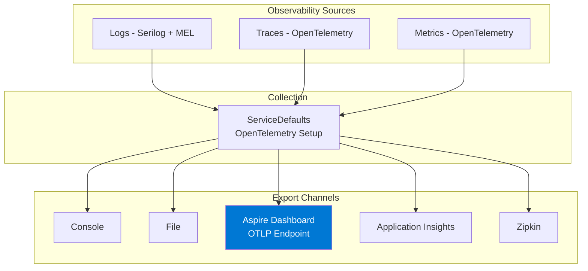
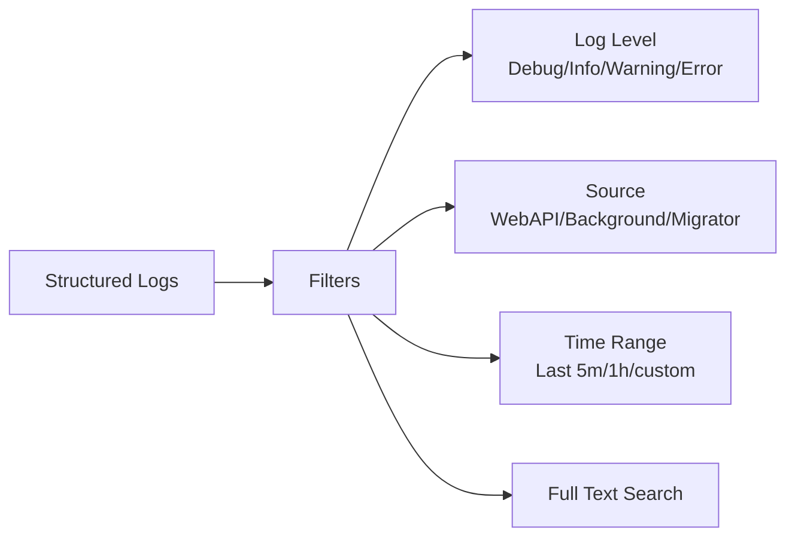
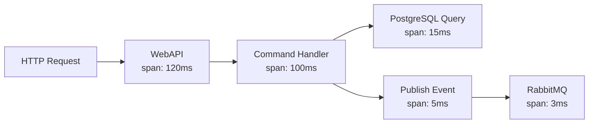
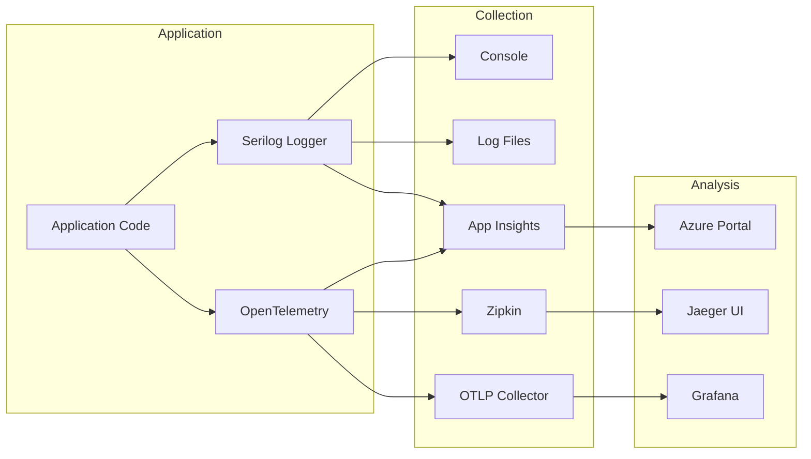

# 09 - Observability & Cross-Cutting Concerns

> **Purpose**: Understand the logging, tracing, metrics, caching, and other cross-cutting concerns implemented across the application, including .NET Aspire integration for enhanced observability.

---

## Table of Contents

- [Overview](#overview)
- [Aspire Dashboard](#aspire-dashboard)
- [Logging (Serilog)](#logging-serilog)
- [Distributed Tracing (OpenTelemetry)](#distributed-tracing-opentelemetry)
- [Metrics](#metrics)
- [Application Insights](#application-insights)
- [Caching](#caching)
- [Health Checks](#health-checks)
- [Exception Handling](#exception-handling)
- [DateTime Provider](#datetime-provider)

---

## Overview

Observability in this application is built on three pillars and can be consumed through multiple channels:



### Observability Modes

**1. With .NET Aspire (Recommended)**
- All telemetry automatically flows to the Aspire Dashboard
- Real-time logs, traces, and metrics in a unified UI
- No additional configuration required
- Best developer experience

**2. Standalone (without Aspire)**
- Logs written to console and files
- OpenTelemetry can export to Jaeger/Zipkin if configured
- Application Insights if enabled in appsettings

---

## Aspire Dashboard

When running with Aspire (`dotnet run --project ClassifiedAds.AppHost`), the Aspire Dashboard provides comprehensive observability.

### Dashboard URL

**https://localhost:17180**

### Features

| Feature | Description |
|---------|-------------|
| **Resources** | View all containers, projects, their status, and endpoints |
| **Console Logs** | Real-time console output from all services |
| **Structured Logs** | Searchable structured logs with filters (level, source, timespan) |
| **Traces** | Distributed traces showing request flow across services |
| **Metrics** | Request rates, error rates, latency percentiles, custom metrics |

### Structured Logs View



**Example log entry:**
```json
{
  "timestamp": "2026-01-01T10:30:45.123Z",
  "level": "Information",
  "source": "ClassifiedAds.WebAPI",
  "category": "ClassifiedAds.Modules.Product.Commands.CreateProductHandler",
  "message": "Product created successfully",
  "properties": {
    "ProductId": "123e4567-e89b-12d3-a456-426614174000",
    "UserId": "user123",
    "TraceId": "abc123...",
    "SpanId": "def456..."
  }
}
```

### Distributed Traces View

Traces show the complete request flow across services and databases:



**Example trace:**
```
Trace ID: abc123def456
Duration: 120ms
Spans: 5

├─ HTTP POST /api/products (120ms)
│  ├─ CreateProductHandler.Handle (100ms)
│  │  ├─ ProductDbContext.SaveChangesAsync (15ms)
│  │  │  └─ PostgreSQL: INSERT INTO products (12ms)
│  │  └─ MessageBus.PublishAsync (5ms)
│  │     └─ RabbitMQ: publish to product.created (3ms)
```

### Metrics View

Key metrics automatically collected:

| Metric | Description |
|--------|-------------|
| `http.server.request.duration` | HTTP request latency (p50, p90, p99) |
| `http.server.active_requests` | Number of active HTTP requests |
| `http.server.request.errors` | Number of HTTP errors (4xx, 5xx) |
| `db.client.operation.duration` | Database query latency |
| `dotnet.gc.collections` | .NET garbage collection metrics |
| `process.cpu.usage` | CPU usage percentage |
| `process.memory.usage` | Memory usage (bytes) |

### ServiceDefaults Integration

The `ClassifiedAds.ServiceDefaults` project configures OpenTelemetry for all services:

```csharp
// ClassifiedAds.ServiceDefaults/Extensions.cs
public static IHostApplicationBuilder AddServiceDefaults(this IHostApplicationBuilder builder)
{
    builder.ConfigureOpenTelemetry();
    builder.AddDefaultHealthChecks();
    builder.Services.AddServiceDiscovery();
    builder.Services.ConfigureHttpClientDefaults(http =>
    {
        http.AddServiceDiscovery();
        http.AddStandardResilienceHandler();
    });

    return builder;
}

public static IHostApplicationBuilder ConfigureOpenTelemetry(this IHostApplicationBuilder builder)
{
    builder.Logging.AddOpenTelemetry(logging =>
    {
        logging.IncludeFormattedMessage = true;
        logging.IncludeScopes = true;
    });

    builder.Services.AddOpenTelemetry()
        .WithMetrics(metrics =>
        {
            metrics
                .AddAspNetCoreInstrumentation()
                .AddHttpClientInstrumentation()
                .AddRuntimeInstrumentation();
        })
        .WithTracing(tracing =>
        {
            tracing
                .AddAspNetCoreInstrumentation()
                .AddHttpClientInstrumentation();
        });

    // Export to Aspire Dashboard (OTLP endpoint)
    builder.AddOpenTelemetryExporters();

    return builder;
}
```

**Integration in application hosts:**

```csharp
// WebAPI/Program.cs
var builder = WebApplication.CreateBuilder(args);

// Add Aspire ServiceDefaults (optional, only activates when running under Aspire)
builder.AddServiceDefaults();

// ... rest of configuration

var app = builder.Build();

// Map health check endpoints for Aspire
app.MapDefaultEndpoints();

app.Run();
```

---

## Logging (Serilog)

### Configuration

Logging is configured via the `UseClassifiedAdsLogger` extension:

```csharp
// ClassifiedAds.WebAPI/Program.cs
builder.WebHost.UseClassifiedAdsLogger(configuration =>
{
    var appSettings = new AppSettings();
    configuration.Bind(appSettings);
    return appSettings.Logging;
});
```

**Where in code?**: [ClassifiedAds.Infrastructure/Logging/](../ClassifiedAds.Infrastructure/Logging/)

### Serilog Setup

```csharp
// ClassifiedAds.Infrastructure/Logging/LoggingExtensions.cs (conceptual)
public static IWebHostBuilder UseClassifiedAdsLogger(
    this IWebHostBuilder builder,
    Func<IConfiguration, LoggingOptions> options)
{
    return builder.UseSerilog((context, services, configuration) =>
    {
        var loggingOptions = options(context.Configuration);
        
        configuration
            .MinimumLevel.Is(loggingOptions.MinimumLevel)
            .Enrich.FromLogContext()
            .Enrich.WithMachineName()
            .Enrich.WithProperty("Application", loggingOptions.ApplicationName);

        // Configure sinks based on options
        if (loggingOptions.Console.Enabled)
            configuration.WriteTo.Console();
            
        if (loggingOptions.File.Enabled)
            configuration.WriteTo.File(loggingOptions.File.Path);
            
        if (loggingOptions.ApplicationInsights.Enabled)
            configuration.WriteTo.ApplicationInsights(
                loggingOptions.ApplicationInsights.ConnectionString,
                TelemetryConverter.Traces);
    });
}
```

### Logging Configuration Options

```json
{
  "Logging": {
    "ApplicationName": "ClassifiedAds.WebAPI",
    "MinimumLevel": "Information",
    "Console": {
      "Enabled": true
    },
    "File": {
      "Enabled": true,
      "Path": "logs/app-.log",
      "RollingInterval": "Day"
    },
    "ApplicationInsights": {
      "Enabled": false,
      "ConnectionString": "..."
    }
  }
}
```

### Usage in Code

```csharp
// ClassifiedAds.Modules.Product/Controllers/ProductsController.cs
public class ProductsController : ControllerBase
{
    private readonly ILogger _logger;

    public ProductsController(ILogger<ProductsController> logger)
    {
        _logger = logger;
    }

    [HttpGet]
    public async Task<ActionResult<IEnumerable<Product>>> Get()
    {
        _logger.LogInformation("Getting all products");
        // ...
    }
}
```

---

## Distributed Tracing (OpenTelemetry)

### OpenTelemetry Configuration

```csharp
// ClassifiedAds.Infrastructure/Monitoring/OpenTelemetry/OpenTelemetryExtensions.cs
public static IServiceCollection AddClassifiedAdsOpenTelemetry(
    this IServiceCollection services, 
    OpenTelemetryOptions options = null)
{
    if (options == null || !options.IsEnabled)
        return services;

    var openTelemetry = services.AddOpenTelemetry()
        .ConfigureResource(configureResource =>
        {
            configureResource.AddService(
                serviceName: options.ServiceName,
                serviceVersion: Assembly.GetExecutingAssembly()
                    .GetName().Version?.ToString() ?? "unknown",
                serviceInstanceId: options.ServiceName + "-" + Environment.MachineName);
        });

    if (options.TraceEnabled)
    {
        openTelemetry.WithTracing(builder =>
        {
            builder
                .SetSampler(new AlwaysOnSampler())
                .AddAspNetCoreInstrumentation()
                .AddEntityFrameworkCoreInstrumentation()
                .AddHttpClientInstrumentation();

            // Exporters
            if (options?.Zipkin?.IsEnabled ?? false)
            {
                builder.AddZipkinExporter(zipkinOptions =>
                {
                    zipkinOptions.Endpoint = new Uri(options.Zipkin.Endpoint);
                });
            }

            if (options?.Otlp?.IsEnabled ?? false)
            {
                builder.AddOtlpExporter(otlpOptions =>
                {
                    otlpOptions.Endpoint = new Uri(options.Otlp.Endpoint);
                });
            }

            if (options?.AzureMonitor?.IsEnabled ?? false)
            {
                builder.AddAzureMonitorTraceExporter(opts =>
                {
                    opts.ConnectionString = options.AzureMonitor.ConnectionString;
                });
            }
        });
    }

    return services;
}
```

**Where in code?**: [ClassifiedAds.Infrastructure/Monitoring/OpenTelemetry/OpenTelemetryExtensions.cs](../ClassifiedAds.Infrastructure/Monitoring/OpenTelemetry/OpenTelemetryExtensions.cs)

### Instrumentation Included

| Instrumentation | Purpose |
|-----------------|---------|
| `AddAspNetCoreInstrumentation` | HTTP request/response tracing |
| `AddEntityFrameworkCoreInstrumentation` | Database query tracing |
| `AddHttpClientInstrumentation` | Outgoing HTTP calls |

### Trace Propagation in Outbox

The outbox pattern preserves trace context:

```csharp
// ClassifiedAds.Modules.Product/Persistence/ProductDbContext.cs
private void SetOutboxActivityId()
{
    var entities = ChangeTracker.Entries<OutboxMessage>();
    foreach (var entity in entities.Where(e => e.State == EntityState.Added))
    {
        var outbox = entity.Entity;
        if (string.IsNullOrWhiteSpace(outbox.ActivityId))
        {
            outbox.ActivityId = System.Diagnostics.Activity.Current?.Id;
        }
    }
}
```

### Configuration

```json
{
  "Monitoring": {
    "OpenTelemetry": {
      "IsEnabled": true,
      "ServiceName": "ClassifiedAds.WebAPI",
      "TraceEnabled": true,
      "MetricEnabled": true,
      "Zipkin": {
        "IsEnabled": true,
        "Endpoint": "http://localhost:9411/api/v2/spans"
      },
      "Otlp": {
        "IsEnabled": false,
        "Endpoint": "http://localhost:4317"
      },
      "AzureMonitor": {
        "IsEnabled": false,
        "ConnectionString": "..."
      }
    }
  }
}
```

---

## Metrics

### OpenTelemetry Metrics

```csharp
// ClassifiedAds.Infrastructure/Monitoring/OpenTelemetry/OpenTelemetryExtensions.cs
if (options.MetricEnabled)
{
    openTelemetry.WithMetrics(builder =>
    {
        builder
            .AddRuntimeInstrumentation()     // GC, threads, memory
            .AddProcessInstrumentation()     // CPU, memory usage
            .AddHttpClientInstrumentation()  // HTTP client metrics
            .AddAspNetCoreInstrumentation(); // Request metrics

        if (options?.Otlp?.IsEnabled ?? false)
        {
            builder.AddOtlpExporter(otlpOptions =>
            {
                otlpOptions.Endpoint = new Uri(options.Otlp.Endpoint);
            });
        }

        if (options?.AzureMonitor?.IsEnabled ?? false)
        {
            builder.AddAzureMonitorMetricExporter(opts =>
            {
                opts.ConnectionString = options.AzureMonitor.ConnectionString;
            });
        }
    });
}
```

### Available Metrics

| Category | Metrics |
|----------|---------|
| **Runtime** | GC collections, heap size, thread count |
| **Process** | CPU usage, memory usage |
| **ASP.NET Core** | Request count, duration, active requests |
| **HTTP Client** | Outgoing request count, duration |

---

## Application Insights

### Integration Points

```csharp
// ClassifiedAds.Infrastructure/Monitoring/MonitoringExtensions.cs
public static IServiceCollection AddMonitoringServices(
    this IServiceCollection services, 
    MonitoringOptions monitoringOptions = null)
{
    if (monitoringOptions?.AzureApplicationInsights?.IsEnabled ?? false)
    {
        services.AddAzureApplicationInsights(monitoringOptions.AzureApplicationInsights);
    }

    if (monitoringOptions?.OpenTelemetry?.IsEnabled ?? false)
    {
        services.AddClassifiedAdsOpenTelemetry(monitoringOptions.OpenTelemetry);
    }

    return services;
}
```

**Where in code?**: [ClassifiedAds.Infrastructure/Monitoring/MonitoringExtensions.cs](../ClassifiedAds.Infrastructure/Monitoring/MonitoringExtensions.cs)

### Configuration

```json
{
  "Monitoring": {
    "AzureApplicationInsights": {
      "IsEnabled": true,
      "ConnectionString": "InstrumentationKey=...;IngestionEndpoint=..."
    }
  }
}
```

---

## Caching

### Cache Providers

Multiple caching providers are supported:

```csharp
// ClassifiedAds.Infrastructure/Caching/CachingServiceCollectionExtensions.cs
public static IServiceCollection AddCaches(
    this IServiceCollection services, 
    CachingOptions options = null)
{
    // Memory cache (always available)
    services.AddMemoryCache();
    
    if (options?.Distributed?.Provider == "Redis")
    {
        services.AddStackExchangeRedisCache(redisOptions =>
        {
            redisOptions.Configuration = options.Distributed.Redis.ConnectionString;
        });
    }
    else if (options?.Distributed?.Provider == "SqlServer")
    {
        services.AddDistributedSqlServerCache(sqlOptions =>
        {
            sqlOptions.ConnectionString = options.Distributed.SqlServer.ConnectionString;
            sqlOptions.SchemaName = "dbo";
            sqlOptions.TableName = "CacheEntries";
        });
    }
    else
    {
        services.AddDistributedMemoryCache();
    }

    return services;
}
```

**Where in code?**: [ClassifiedAds.Infrastructure/Caching/](../ClassifiedAds.Infrastructure/Caching/)

### Configuration

```json
{
  "Caching": {
    "Distributed": {
      "Provider": "Redis",
      "Redis": {
        "ConnectionString": "localhost:6379"
      },
      "SqlServer": {
        "ConnectionString": "..."
      }
    }
  }
}
```

### Usage

```csharp
// Using IDistributedCache
public class ProductService
{
    private readonly IDistributedCache _cache;
    
    public async Task<Product> GetProductAsync(Guid id)
    {
        var cacheKey = $"product:{id}";
        var cached = await _cache.GetStringAsync(cacheKey);
        
        if (cached != null)
            return JsonSerializer.Deserialize<Product>(cached);
        
        var product = await _repository.GetByIdAsync(id);
        
        await _cache.SetStringAsync(cacheKey, 
            JsonSerializer.Serialize(product),
            new DistributedCacheEntryOptions
            {
                AbsoluteExpirationRelativeToNow = TimeSpan.FromMinutes(5)
            });
        
        return product;
    }
}
```

---

## Health Checks

### Health Check Configuration

```csharp
// Conceptual - health checks for dependencies
services.AddHealthChecks()
    .AddSqlServer(connectionString, name: "Database")
    .AddMessageBusHealthCheck(messagingOptions);
```

### Message Bus Health Check

```csharp
// ClassifiedAds.Infrastructure/Messaging/MessagingCollectionExtensions.cs
public static IHealthChecksBuilder AddMessageBusHealthCheck(
    this IHealthChecksBuilder healthChecksBuilder, 
    MessagingOptions options)
{
    if (options.UsedRabbitMQ())
    {
        healthChecksBuilder.AddRabbitMQ(new RabbitMQHealthCheckOptions
        {
            HostName = options.RabbitMQ.HostName,
            UserName = options.RabbitMQ.UserName,
            Password = options.RabbitMQ.Password,
        },
        name: "Message Broker (RabbitMQ)",
        failureStatus: HealthStatus.Degraded);
    }
    
    return healthChecksBuilder;
}
```

**Where in code?**: [ClassifiedAds.Infrastructure/HealthChecks/](../ClassifiedAds.Infrastructure/HealthChecks/)

### Network Port Check

Used by background workers to wait for dependencies:

```csharp
// ClassifiedAds.Migrator/Program.cs
if (bool.TryParse(configuration["CheckDependency:Enabled"], out var enabled) && enabled)
{
    NetworkPortCheck.Wait(configuration["CheckDependency:Host"], 5);
}
```

---

## Exception Handling

### Global Exception Handler

```csharp
// ClassifiedAds.WebAPI/Program.cs
services.AddExceptionHandler<GlobalExceptionHandler>();
app.UseExceptionHandler(options => { });
```

**Where in code?**: [ClassifiedAds.Infrastructure/Web/ExceptionHandlers/](../ClassifiedAds.Infrastructure/Web/ExceptionHandlers/)

### Custom Exceptions

```csharp
// ClassifiedAds.CrossCuttingConcerns/Exceptions/ValidationException.cs
public class ValidationException : Exception
{
    public static void Requires(bool condition, string message)
    {
        if (!condition)
            throw new ValidationException(message);
    }
}
```

**Where in code?**: [ClassifiedAds.CrossCuttingConcerns/Exceptions/](../ClassifiedAds.CrossCuttingConcerns/Exceptions/)

---

## DateTime Provider

### Abstraction

To enable testing with controlled time:

```csharp
// ClassifiedAds.CrossCuttingConcerns/DateTimes/IDateTimeProvider.cs
public interface IDateTimeProvider
{
    DateTime Now { get; }
    DateTimeOffset OffsetNow { get; }
}
```

### Implementation

```csharp
// ClassifiedAds.CrossCuttingConcerns/DateTimes/DateTimeProvider.cs
public class DateTimeProvider : IDateTimeProvider
{
    public DateTime Now => DateTime.UtcNow;
    public DateTimeOffset OffsetNow => DateTimeOffset.UtcNow;
}
```

### Registration

```csharp
services.AddDateTimeProvider();
```

### Usage

```csharp
public class PublishEventsCommandHandler : ICommandHandler<PublishEventsCommand>
{
    private readonly IDateTimeProvider _dateTimeProvider;
    
    public async Task HandleAsync(PublishEventsCommand command, CancellationToken ct)
    {
        eventLog.UpdatedDateTime = _dateTimeProvider.OffsetNow;
    }
}
```

---

## Cross-Cutting Utilities

### ClassifiedAds.CrossCuttingConcerns

| Folder | Purpose |
|--------|---------|
| `Csv/` | CSV reading/writing abstractions |
| `Excel/` | Excel file generation |
| `Pdf/` | PDF generation (DinkToPdf) |
| `Html/` | HTML rendering (RazorLight) |
| `DateTimes/` | DateTime provider |
| `Exceptions/` | Custom exception types |
| `ExtensionMethods/` | JSON serialization, etc. |
| `Locks/` | Distributed locking |
| `Logging/` | Logging abstractions |

**Where in code?**: [ClassifiedAds.CrossCuttingConcerns/](../ClassifiedAds.CrossCuttingConcerns/)

### PDF Generation

```csharp
// ClassifiedAds.Infrastructure/Pdf/DinkToPdfExtensions.cs
services.AddDinkToPdfConverter();

// Usage
public class ExportProductsToPdfHandler : IPdfWriter<ExportProductsToPdf>
{
    public byte[] Write(ExportProductsToPdf data)
    {
        // Generate PDF using DinkToPdf
    }
}
```

### HTML Rendering

```csharp
// ClassifiedAds.Infrastructure/Html/HtmlExtensions.cs
services.AddHtmlRazorLightEngine();

// Usage
public class ExportProductsToHtmlHandler : IHtmlWriter<ExportProductsToHtml>
{
    public string Write(ExportProductsToHtml data)
    {
        // Render HTML using RazorLight
    }
}
```

---

## Observability Summary



---

## Configuration Summary

| Feature | Configuration Section | Key Classes |
|---------|----------------------|-------------|
| Logging | `Logging` | `LoggingOptions`, Serilog |
| Tracing | `Monitoring:OpenTelemetry` | `OpenTelemetryOptions` |
| Metrics | `Monitoring:OpenTelemetry` | `OpenTelemetryOptions` |
| App Insights | `Monitoring:AzureApplicationInsights` | Azure SDK |
| Caching | `Caching` | `CachingOptions` |

---

*Previous: [08 - Authentication & Authorization](08-authentication-authorization.md) | Next: [10 - DevOps & Local Development](10-devops-and-local-development.md)*
