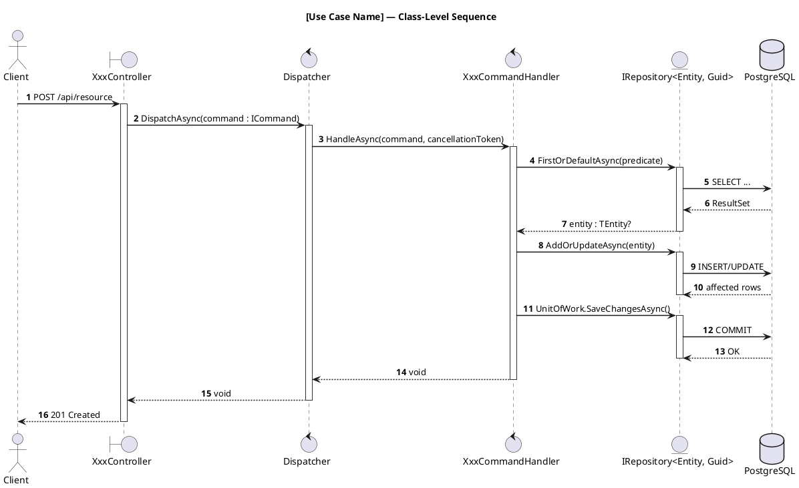
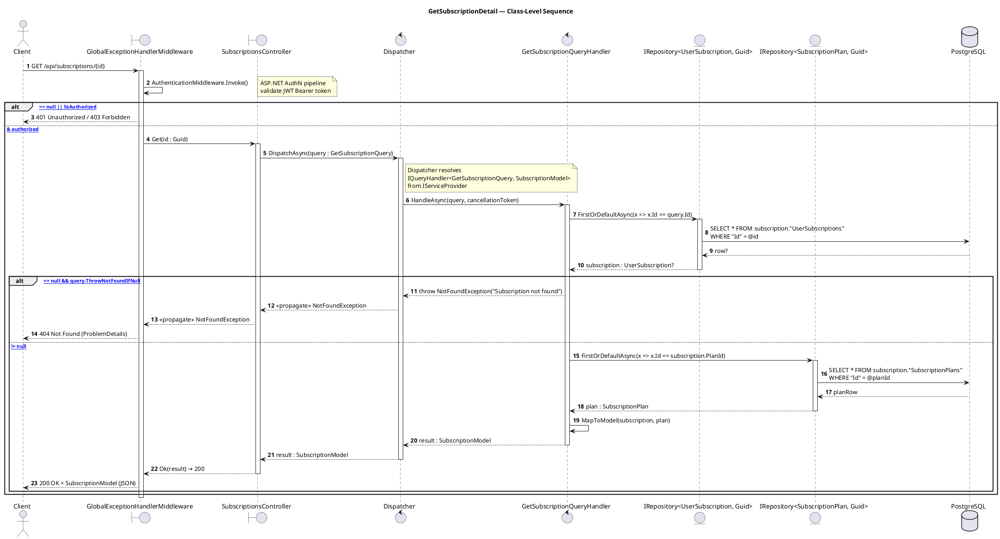
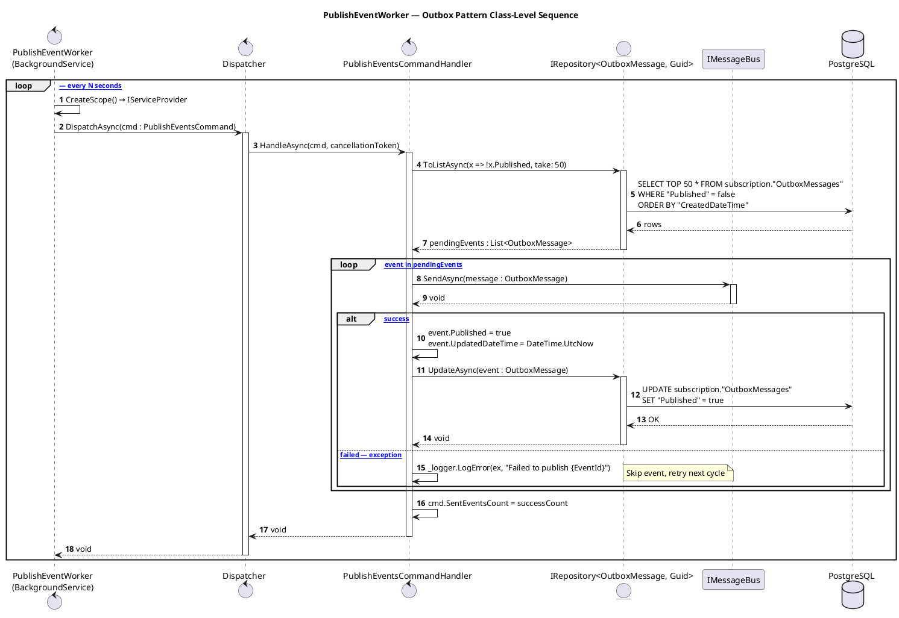
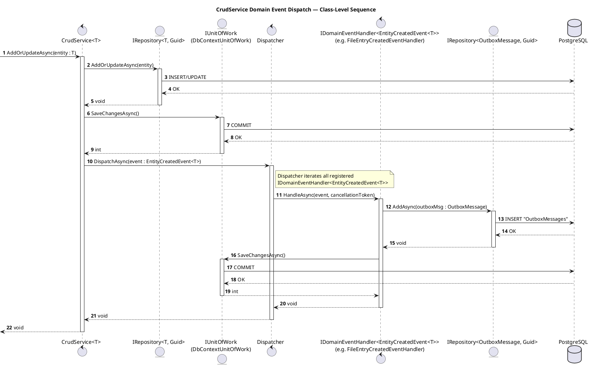

# 12 - Sequence Diagram Playbook (ClassifiedAds Modular Monolith)

> **Mục tiêu**: Hướng dẫn vẽ **UML Sequence Diagram chuẩn mức class** cho hệ thống Modular Monolith — mỗi lifeline là một **instance của class thật** trong code, mỗi message là một **method call** với đúng signature, có activation bar và return rõ ràng.

---

## 1. Nguyên Tắc UML Sequence Diagram Chuẩn

### 1.1. Lifeline = Object Instance của Class

Mỗi lifeline (participant) trong diagram đại diện cho **một object instance** của class cụ thể trong codebase.

| Ký pháp PlantUML | Ý nghĩa UML | Dùng cho |
|---|---|---|
| `actor` | Actor ngoài hệ thống | `Client`, `Browser` |
| `boundary` | Boundary object (tiếp nhận request) | Controller, Middleware |
| `control` | Control object (điều phối logic) | Dispatcher, Handler, Gateway Service |
| `entity` | Entity object (dữ liệu/persistence) | Repository, CrudService |
| `database` | Datastore | PostgreSQL |
| `collections` | Collection of objects | Danh sách events, batch items |

### 1.2. Message = Method Call thật

| Loại mũi tên | Ký pháp | Ý nghĩa |
|---|---|---|
| `->` (nét liền, đầu đặc) | Synchronous call | Gọi method đồng bộ |
| `-->` (nét đứt) | Return | Giá trị trả về |
| `->>` (nét liền, đầu hở) | Async call | Gọi method bất đồng bộ (`async Task`) |
| `-->>` (nét đứt, đầu hở) | Async return | `await` trả về |

### 1.3. Activation Bar bắt buộc

Mỗi method call phải có cặp `activate` / `deactivate` (hoặc `return`) để thể hiện thời gian object đang xử lý.

### 1.4. Quy tắc đặt tên lifeline

```
participantType "ClassName" as alias
```

- Dùng **đúng tên class** trong code (không viết tắt, không đổi tên).
- Nếu class là generic: ghi rõ type parameter, ví dụ `IRepository<UserSubscription, Guid>`.
- Nếu class implement interface qua DI: ghi **tên interface** kèm **(impl: ClassName)** trong note.

---

## 2. Bảng Mapping Class Thật → Lifeline

### 2.1. Lớp Boundary (nhận request)

| Class thật | Namespace | Lifeline type | Alias gợi ý |
|---|---|---|---|
| `GlobalExceptionHandlerMiddleware` | `ClassifiedAds.Infrastructure.Web.Middleware` | `boundary` | `MW` |
| `SubscriptionsController` | `ClassifiedAds.Modules.Subscription.Controllers` | `boundary` | `SubCtrl` |
| `SpecificationsController` | `ClassifiedAds.Modules.ApiDocumentation.Controllers` | `boundary` | `SpecCtrl` |
| `AuthController` | `ClassifiedAds.Modules.Identity.Controllers` | `boundary` | `AuthCtrl` |
| `ProjectsController` | `ClassifiedAds.Modules.ApiDocumentation.Controllers` | `boundary` | `ProjCtrl` |
| `PlansController` | `ClassifiedAds.Modules.Subscription.Controllers` | `boundary` | `PlanCtrl` |
| `PaymentsController` | `ClassifiedAds.Modules.Subscription.Controllers` | `boundary` | `PayCtrl` |

### 2.2. Lớp Control (điều phối)

| Class thật | Namespace | Lifeline type | Alias gợi ý |
|---|---|---|---|
| `Dispatcher` | `ClassifiedAds.Application` | `control` | `Disp` |
| `AddUpdateSubscriptionCommandHandler` | `ClassifiedAds.Modules.Subscription.Commands` | `control` | `SubCmdH` |
| `GetSubscriptionQueryHandler` | `ClassifiedAds.Modules.Subscription.Queries` | `control` | `SubQryH` |
| `UploadApiSpecificationCommandHandler` | `ClassifiedAds.Modules.ApiDocumentation.Commands` | `control` | `UploadH` |
| `PublishEventsCommandHandler` | `ClassifiedAds.Modules.Subscription.Commands` | `control` | `PubEvtH` |
| `AddPaymentTransactionCommandHandler` | `ClassifiedAds.Modules.Subscription.Commands` | `control` | `PayCmdH` |
| `CrudService<T>` | `ClassifiedAds.Application` | `control` | `CrudSvc` |
| `SubscriptionLimitGatewayService` | `ClassifiedAds.Modules.Subscription.Services` | `control` | `LimitGw` |
| `StorageFileGatewayService` | `ClassifiedAds.Modules.Storage.Services` | `control` | `StorageGw` |

### 2.3. Lớp Entity (persistence)

| Class thật | Namespace | Lifeline type | Alias gợi ý |
|---|---|---|---|
| `IRepository<UserSubscription, Guid>` | `ClassifiedAds.Domain.Repositories` | `entity` | `SubRepo` |
| `IRepository<SubscriptionPlan, Guid>` | `ClassifiedAds.Domain.Repositories` | `entity` | `PlanRepo` |
| `IRepository<SubscriptionHistory, Guid>` | `ClassifiedAds.Domain.Repositories` | `entity` | `HistRepo` |
| `IRepository<Project, Guid>` | `ClassifiedAds.Domain.Repositories` | `entity` | `ProjRepo` |
| `IRepository<ApiSpecification, Guid>` | `ClassifiedAds.Domain.Repositories` | `entity` | `SpecRepo` |
| `IRepository<OutboxMessage, Guid>` | `ClassifiedAds.Domain.Repositories` | `entity` | `OutboxRepo` |
| `IRepository<PaymentTransaction, Guid>` | `ClassifiedAds.Domain.Repositories` | `entity` | `PayRepo` |
| `SubscriptionDbContext` | `ClassifiedAds.Modules.Subscription.Persistence` | `entity` | `SubDb` |

### 2.4. Infrastructure

| Class thật | Vai trò | Lifeline type | Alias gợi ý |
|---|---|---|---|
| `PublishEventWorker` | `BackgroundService` | `control` | `PubWorker` |
| `IMessageBus` | Message broker abstraction | `participant` | `MsgBus` |
| `PostgreSQL` | Database server | `database` | `DB` |

---

## 3. Chuẩn Ký Pháp PlantUML Cho Class-Level Sequence

### 3.1. Template gốc



### 3.2. Quy ước bắt buộc

| Quy ước | Đúng | Sai |
|---|---|---|
| Tên lifeline | `SubscriptionsController` | `SubController`, `SC` |
| Message label | `DispatchAsync(cmd : AddUpdateSubscriptionCommand)` | `gửi command`, `Dispatch` |
| Return label | `result : SubscriptionModel` | `data`, `response` |
| Activation | Mỗi call đều có `activate`/`deactivate` | Không có activation bar |
| Self-call | `CmdH -> CmdH : ValidateBusinessRules()` với nested activate | `H -> H: Validate` |
| Fragment | `alt [entity == null]` / `else [entity != null]` | `alt not found` |

---

## 4. Quy Trình 6 Bước Vẽ Class-Level Sequence

### Bước 1 — Xác định Use Case và Entry Point

Tìm chính xác action method trong Controller:

```
Controller class  →  action method  →  HTTP verb + route
```

Ví dụ: `SubscriptionsController.Post()` → `POST /api/subscriptions`

### Bước 2 — Trace Call Chain từ Controller đến DB

Đọc code theo thứ tự:

1. **Controller** action → tạo Command/Query object → gọi `_dispatcher.DispatchAsync(command)`.
2. **Dispatcher.DispatchAsync()** → resolve `ICommandHandler<T>` từ DI → gọi `handler.HandleAsync(command, ct)`.
3. **Handler.HandleAsync()** → gọi các `IRepository<T,K>` methods + validation logic.
4. **Repository** (impl: `DbContextRepository<TDbContext, T, K>`) → gọi EF Core `DbSet<T>` → SQL.
5. Nếu cross-module: Handler gọi **Contract interface** (`ISubscriptionLimitGatewayService`) → impl dispatch nội bộ.

### Bước 3 — Xác định tất cả class tham gia

Liệt kê mỗi class chỉ **một lần** làm lifeline. Gán đúng stereotype (`boundary`/`control`/`entity`).

### Bước 4 — Viết từng message với đúng method signature

Mỗi mũi tên phải ghi:
- **Tên method** thật (ví dụ `HandleAsync`, `FirstOrDefaultAsync`, `AddOrUpdateAsync`).
- **Parameter chính** (ví dụ `command : AddUpdateSubscriptionCommand`).
- **Return type** trên mũi tên return (ví dụ `result : SubscriptionModel`).

### Bước 5 — Thêm combined fragment cho nhánh logic

Dùng guard condition rõ ràng:

```plantuml
alt [plan == null || !plan.IsActive]
  CmdH --> Disp : throw NotFoundException("Plan not found")
else [plan valid]
  ...
end
```

### Bước 6 — Kiểm tra kích thước và tính đúng

| Tiêu chí | Ngưỡng |
|---|---|
| Số lifeline | 5–9 |
| Số message (bao gồm return) | 15–30 |
| Số fragment `alt`/`opt`/`loop` | 1–3 |
| Mỗi lifeline | Phải map được về 1 class thật trong code |
| Mỗi message | Phải map được về 1 method call thật |

---

## 5. Template Thực Tế — Class-Level

### 5.1. Query Flow: GetSubscriptionDetail



### 5.2. Command Flow: AddUpdateSubscription

```plantuml
@startuml
title AddUpdateSubscription — Class-Level Sequence
autonumber
skinparam responseMessageBelowArrow true

actor       "Client"                                             as Client
boundary    "SubscriptionsController"                            as Ctrl
control     "Dispatcher"                                         as Disp
control     "AddUpdateSubscriptionCommandHandler"                as CmdH
entity      "IRepository<SubscriptionPlan, Guid>"                as PlanRepo
entity      "IRepository<UserSubscription, Guid>"                as SubRepo
entity      "IRepository<SubscriptionHistory, Guid>"             as HistRepo
entity      "SubscriptionDbContext\n(IUnitOfWork)"               as UoW
database    "PostgreSQL"                                         as DB

Client -> Ctrl : POST /api/subscriptions\n{planId, ...}
activate Ctrl

  Ctrl -> Ctrl : new AddUpdateSubscriptionCommand\n{ Model = model }
  Ctrl -> Disp : DispatchAsync(cmd : AddUpdateSubscriptionCommand)
  activate Disp

    note right of Disp
      resolve ICommandHandler<AddUpdateSubscriptionCommand>
      → AddUpdateSubscriptionCommandHandler
    end note

    Disp -> CmdH : HandleAsync(cmd, cancellationToken)
    activate CmdH

      CmdH -> CmdH : ValidateModel(cmd.Model)

      alt [validation failed]
        CmdH --> Disp : throw ValidationException(errors)
        Disp --> Ctrl : <<propagate>> ValidationException
        Ctrl --> Client : 400 Bad Request (ProblemDetails)

      else [model valid]
        CmdH -> PlanRepo : FirstOrDefaultAsync(x => x.Id == cmd.Model.PlanId)
        activate PlanRepo
          PlanRepo -> DB : SELECT * FROM subscription."SubscriptionPlans"\nWHERE "Id" = @planId
          DB --> PlanRepo : row?
        PlanRepo --> CmdH : plan : SubscriptionPlan?
        deactivate PlanRepo

        alt [plan == null || !plan.IsActive]
          CmdH --> Disp : throw NotFoundException("Plan not found or inactive")
          Disp --> Ctrl : <<propagate>> NotFoundException
          Ctrl --> Client : 404 Not Found

        else [plan valid]
          group Transaction [UnitOfWork — SubscriptionDbContext]
            CmdH -> SubRepo : AddOrUpdateAsync(subscription : UserSubscription)
            activate SubRepo
              SubRepo -> DB : INSERT/UPDATE subscription."UserSubscriptions"
              DB --> SubRepo : OK
            SubRepo --> CmdH : void
            deactivate SubRepo

            CmdH -> HistRepo : AddAsync(history : SubscriptionHistory)
            activate HistRepo
              HistRepo -> DB : INSERT subscription."SubscriptionHistories"
              DB --> HistRepo : OK
            HistRepo --> CmdH : void
            deactivate HistRepo

            CmdH -> UoW : SaveChangesAsync()
            activate UoW
              UoW -> DB : COMMIT
              DB --> UoW : OK
            UoW --> CmdH : int (affected rows)
            deactivate UoW
          end

          CmdH -> CmdH : cmd.SavedSubscriptionId = subscription.Id

        CmdH --> Disp : void
        deactivate CmdH

        Disp --> Ctrl : void (cmd.SavedSubscriptionId populated)
        deactivate Disp

      Ctrl --> Client : 201 Created { id = cmd.SavedSubscriptionId }
      deactivate Ctrl
      end
    end
  end
@enduml
```

### 5.3. Cross-Module Flow: UploadApiSpecification

```plantuml
@startuml
title UploadApiSpecification — Cross-Module Class-Level Sequence
autonumber
skinparam responseMessageBelowArrow true

actor       "Client"                                                       as Client
boundary    "SpecificationsController"                                     as Ctrl
control     "Dispatcher"                                                   as Disp
control     "UploadApiSpecificationCommandHandler"                         as CmdH
entity      "IRepository<Project, Guid>"                                   as ProjRepo
control     "ISubscriptionLimitGatewayService\n(impl: SubscriptionLimitGatewayService)" as LimitGw
control     "IStorageFileGatewayService\n(impl: StorageFileGatewayService)"  as StorageGw
entity      "IRepository<ApiSpecification, Guid>"                          as SpecRepo
entity      "ApiDocumentationDbContext\n(IUnitOfWork)"                     as UoW
database    "PostgreSQL"                                                   as DB

Client -> Ctrl : POST /api/projects/{projectId}/specifications/upload\n[multipart: file, name, sourceType]
activate Ctrl

  Ctrl -> Ctrl : new UploadApiSpecificationCommand\n{ ProjectId, CurrentUserId, File, Name, SourceType }
  Ctrl -> Disp : DispatchAsync(cmd : UploadApiSpecificationCommand)
  activate Disp

    Disp -> CmdH : HandleAsync(cmd, cancellationToken)
    activate CmdH

      CmdH -> CmdH : ValidateInput(file, name, sourceType)

      alt [invalid file/type/name]
        CmdH --> Disp : throw ValidationException(errors)
        Disp --> Ctrl : <<propagate>> ValidationException
        Ctrl --> Client : 400 Bad Request
      else [input valid]

        CmdH -> ProjRepo : FirstOrDefaultAsync(x => x.Id == cmd.ProjectId)
        activate ProjRepo
          ProjRepo -> DB : SELECT * FROM apidoc."Projects"\nWHERE "Id" = @projectId
          DB --> ProjRepo : row?
        ProjRepo --> CmdH : project : Project?
        deactivate ProjRepo

        alt [project == null || project.OwnerId != cmd.CurrentUserId]
          CmdH --> Disp : throw NotFoundException/ValidationException
          Disp --> Ctrl : <<propagate>>
          Ctrl --> Client : 404 / 403
        else [project owned by user]

          == Cross-Module Call: Subscription Module ==

          CmdH -> LimitGw : TryConsumeLimitAsync(userId, LimitType.MaxStorageMB, fileSize)
          activate LimitGw
            note right of LimitGw
              Internally dispatches
              ConsumeLimitAtomicallyCommand
              within Subscription module
            end note
          LimitGw --> CmdH : result : LimitCheckResult { IsAllowed, Reason }
          deactivate LimitGw

          alt [!result.IsAllowed]
            CmdH --> Disp : throw ValidationException(result.Reason)
            Disp --> Ctrl : <<propagate>>
            Ctrl --> Client : 400 Bad Request (limit exceeded)
          else [limit allowed]

            == Cross-Module Call: Storage Module ==

            CmdH -> StorageGw : UploadAsync(request : StorageUploadFileRequest)
            activate StorageGw
              note right of StorageGw
                Internally saves file
                via Storage module
              end note
            StorageGw --> CmdH : uploaded : StorageUploadedFileDTO { FileId }
            deactivate StorageGw

            group Transaction [UnitOfWork — ApiDocumentationDbContext]
              CmdH -> CmdH : new ApiSpecification\n{ ProjectId, Name, StorageFileId, ... }

              CmdH -> SpecRepo : AddAsync(spec : ApiSpecification)
              activate SpecRepo
                SpecRepo -> DB : INSERT apidoc."ApiSpecifications"
                DB --> SpecRepo : OK
              SpecRepo --> CmdH : void
              deactivate SpecRepo

              opt [cmd.AutoActivate == true]
                CmdH -> SpecRepo : UpdateActiveSpecification(projectId, spec.Id)
                activate SpecRepo
                  SpecRepo -> DB : UPDATE apidoc."ApiSpecifications"\nSET "IsActive" = ...
                  DB --> SpecRepo : OK
                SpecRepo --> CmdH : void
                deactivate SpecRepo
              end

              CmdH -> UoW : SaveChangesAsync()
              activate UoW
                UoW -> DB : COMMIT
                DB --> UoW : OK
              UoW --> CmdH : int
              deactivate UoW
            end

            CmdH -> CmdH : cmd.SavedSpecId = spec.Id

          CmdH --> Disp : void
          deactivate CmdH

          Disp --> Ctrl : void (cmd.SavedSpecId populated)
          deactivate Disp

        Ctrl --> Client : 201 Created { specId }
        deactivate Ctrl
          end
        end
      end
    end
  end
@enduml
```

### 5.4. Background Flow: PublishEventWorker (Outbox Pattern)



### 5.5. Domain Event Flow: CrudService → EventHandler → Outbox



---

## 6. Quy Tắc Kích Thước & Tách Diagram

### 6.1. Ngưỡng khuyến nghị

| Tiêu chí | Quá nhỏ | Vừa phải | Quá lớn |
|---|---|---|---|
| Số lifeline | < 4 | 5–9 | > 10 |
| Số message (gồm return) | < 10 | 15–30 | > 40 |
| Số fragment `alt`/`opt`/`loop` | 0 | 1–3 | > 4 |
| Số `activate`/`deactivate` cặp | < 4 | 6–12 | > 15 |

### 6.2. Khi nào phải tách

- **Tách sync / async**: HTTP request-response flow ≠ Outbox worker flow → 2 diagram riêng.
- **Tách cross-module**: Nếu cross-module call phức tạp (> 5 message nội bộ), vẽ diagram riêng cho module được gọi, rồi `ref` từ diagram chính.
- **Tách domain event chain**: CrudService → EventHandler → Outbox → Worker nên là diagram riêng (xem 5.5).

### 6.3. Sử dụng `ref` fragment

Khi cross-module call phức tạp, thay vì inline tất cả, dùng `ref`:

```plantuml
ref over LimitGw, DB
  See: "SubscriptionLimitCheck — Internal Sequence"
end ref
```

---

## 7. Library Sequence Diagram Cho Dự Án

Danh sách diagram cần duy trì, mỗi diagram = 1 file `.puml`:

| # | Diagram | Lifelines chính | File |
|---|---|---|---|
| 1 | Auth Login | `AuthController` → `UserManager` → `IJwtTokenService` | `identity-auth-login.puml` |
| 2 | Register User | `AuthController` → `UserManager` → `IEmailMessageService` (Contract) | `identity-register.puml` |
| 3 | Upload API Spec | `SpecificationsController` → `UploadApiSpecificationCommandHandler` → `ISubscriptionLimitGatewayService` → `IStorageFileGatewayService` | `apidoc-upload-spec.puml` |
| 4 | Create/Update Subscription | `SubscriptionsController` → `AddUpdateSubscriptionCommandHandler` → Repos → UoW | `subscription-add-update.puml` |
| 5 | Add Payment Transaction | `SubscriptionsController` → `AddPaymentTransactionCommandHandler` → `IRepository<PaymentTransaction>` | `subscription-add-payment.puml` |
| 6 | Outbox Publish Worker | `PublishEventWorker` → `PublishEventsCommandHandler` → `IRepository<OutboxMessage>` → `IMessageBus` | `outbox-publish-worker.puml` |
| 7 | CrudService Domain Event | `CrudService<T>` → `Dispatcher` → `IDomainEventHandler` → `OutboxMessage` | `domain-event-outbox.puml` |
| 8 | Get Project Specifications | `SpecificationsController` → `GetSpecificationsQueryHandler` → `IRepository<ApiSpecification>` | `apidoc-get-specifications.puml` |

---

## 8. Checklist Review Trước Khi Merge

### 8.1. Class Mapping

- [ ] Mỗi lifeline tương ứng **đúng 1 class** có trong codebase.
- [ ] Stereotype (`boundary`/`control`/`entity`/`database`) đúng vai trò class.
- [ ] Tên class không bị viết tắt hoặc đổi tên tùy ý.

### 8.2. Method Accuracy

- [ ] Mỗi message label là **tên method thật** (ví dụ `HandleAsync`, `DispatchAsync`, `FirstOrDefaultAsync`).
- [ ] Parameter type ghi đúng (ví dụ `cmd : AddUpdateSubscriptionCommand`).
- [ ] Return type ghi đúng trên mũi tên return (ví dụ `result : SubscriptionModel`).

### 8.3. Activation & Lifetime

- [ ] Mỗi synchronous call có cặp `activate`/`deactivate`.
- [ ] Không có activation bar mở mà không đóng.
- [ ] Self-call dùng nested activation.

### 8.4. Fragment & Guard

- [ ] Guard condition trong `alt`/`opt` là biểu thức boolean rõ ràng (ví dụ `[subscription == null]`).
- [ ] Không dùng label mơ hồ (ví dụ `not found`, `error`).
- [ ] `group Transaction` ghi rõ DbContext class (ví dụ `SubscriptionDbContext`).

### 8.5. Kích Thước

- [ ] 5–9 lifeline, 15–30 message, 1–3 fragment.
- [ ] Không trộn sync flow + async worker trong cùng diagram.
- [ ] Cross-module phức tạp → dùng `ref` hoặc tách diagram.

---

## 9. Tổ Chức File

```
docs/architecture/sequence/
  identity-auth-login.puml
  identity-register.puml
  apidoc-upload-spec.puml
  apidoc-get-specifications.puml
  subscription-add-update.puml
  subscription-add-payment.puml
  outbox-publish-worker.puml
  domain-event-outbox.puml
```

Quy tắc:

- `{module}-{usecase}.puml` — 1 file = 1 sequence diagram.
- Biến thể: thêm hậu tố `-error-flow`, `-async`.
- Không gộp nhiều use case vào 1 file.

---

## 10. Mapping Nhanh: Class → File Trong Code

| Class | File path |
|---|---|
| `Dispatcher` | `ClassifiedAds.Application/Common/Dispatcher.cs` |
| `CrudService<T>` | `ClassifiedAds.Application/Common/Services/CrudService.cs` |
| `IRepository<T, K>` | `ClassifiedAds.Domain/Repositories/IRepository.cs` |
| `IUnitOfWork` | `ClassifiedAds.Domain/Repositories/IUnitOfWork.cs` |
| `DbContextRepository<TDb, T, K>` | `ClassifiedAds.Persistence.PostgreSQL/DbContextRepository.cs` |
| `DbContextUnitOfWork<T>` | `ClassifiedAds.Persistence.PostgreSQL/DbContextUnitOfWork.cs` |
| `SubscriptionsController` | `ClassifiedAds.Modules.Subscription/Controllers/SubscriptionsController.cs` |
| `AddUpdateSubscriptionCommandHandler` | `ClassifiedAds.Modules.Subscription/Commands/AddUpdateSubscriptionCommand.cs` |
| `GetSubscriptionQueryHandler` | `ClassifiedAds.Modules.Subscription/Queries/GetSubscriptionQuery.cs` |
| `SpecificationsController` | `ClassifiedAds.Modules.ApiDocumentation/Controllers/SpecificationsController.cs` |
| `UploadApiSpecificationCommandHandler` | `ClassifiedAds.Modules.ApiDocumentation/Commands/UploadApiSpecificationCommand.cs` |
| `PublishEventWorker` | `ClassifiedAds.Modules.*/HostedServices/PublishEventWorker.cs` |
| `PublishEventsCommandHandler` | `ClassifiedAds.Modules.*/Commands/PublishEventsCommand.cs` |
| `GlobalExceptionHandlerMiddleware` | `ClassifiedAds.Infrastructure.Web/Middleware/GlobalExceptionHandlerMiddleware.cs` |
| `ISubscriptionLimitGatewayService` | `ClassifiedAds.Contracts.Subscription/Services/ISubscriptionLimitGatewayService.cs` |
| `IStorageFileGatewayService` | `ClassifiedAds.Contracts.Storage/Services/IStorageFileGatewayService.cs` |
| `SubscriptionDbContext` | `ClassifiedAds.Modules.Subscription/Persistence/SubscriptionDbContext.cs` |
| `ApiDocumentationDbContext` | `ClassifiedAds.Modules.ApiDocumentation/Persistence/ApiDocumentationDbContext.cs` |
