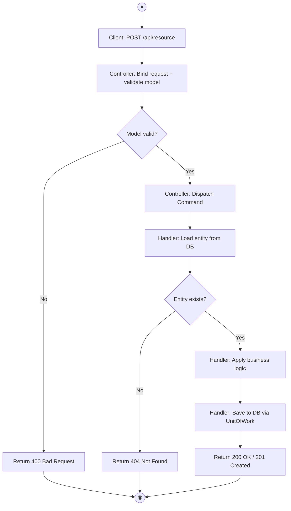
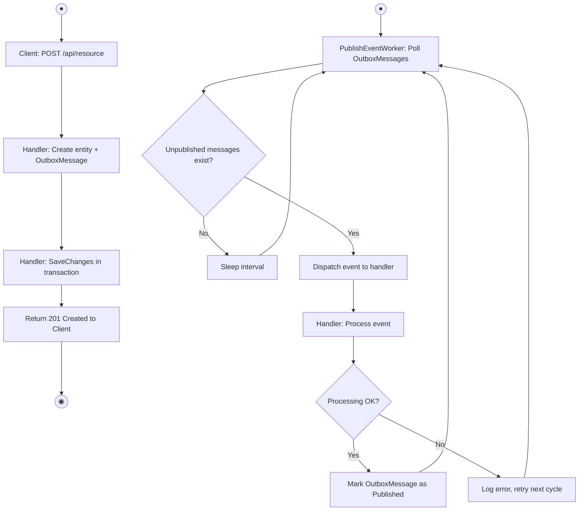
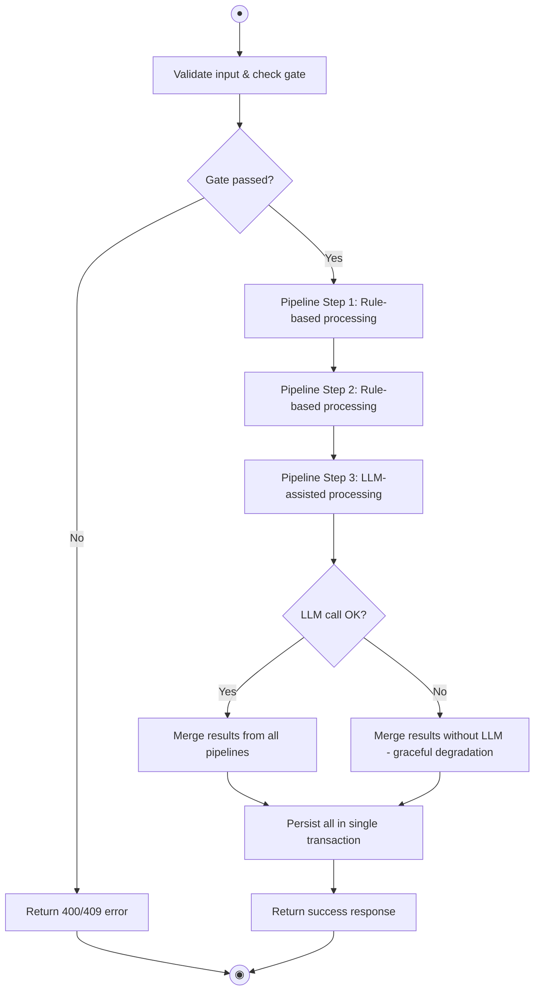
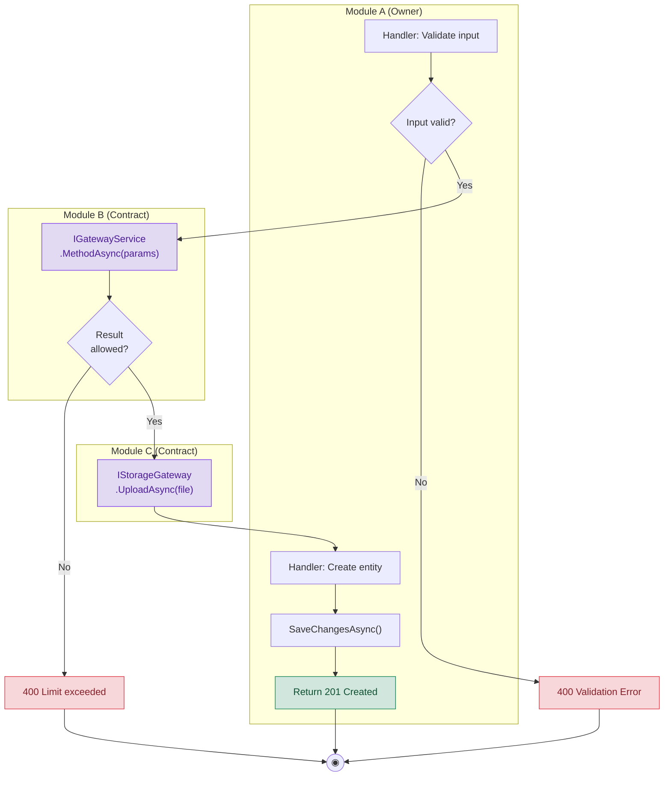
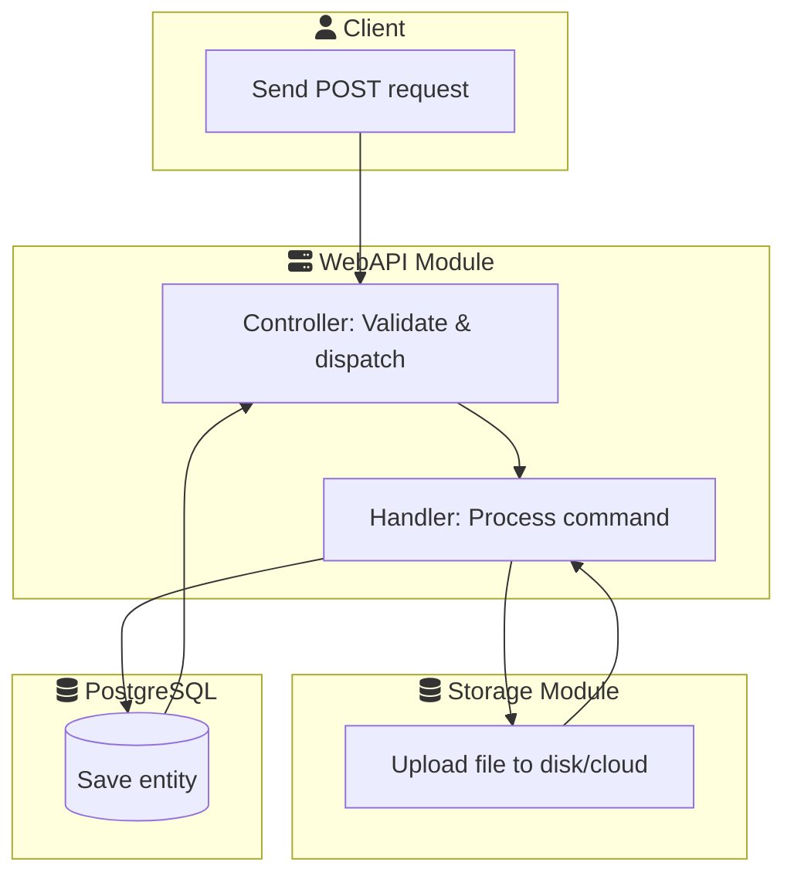
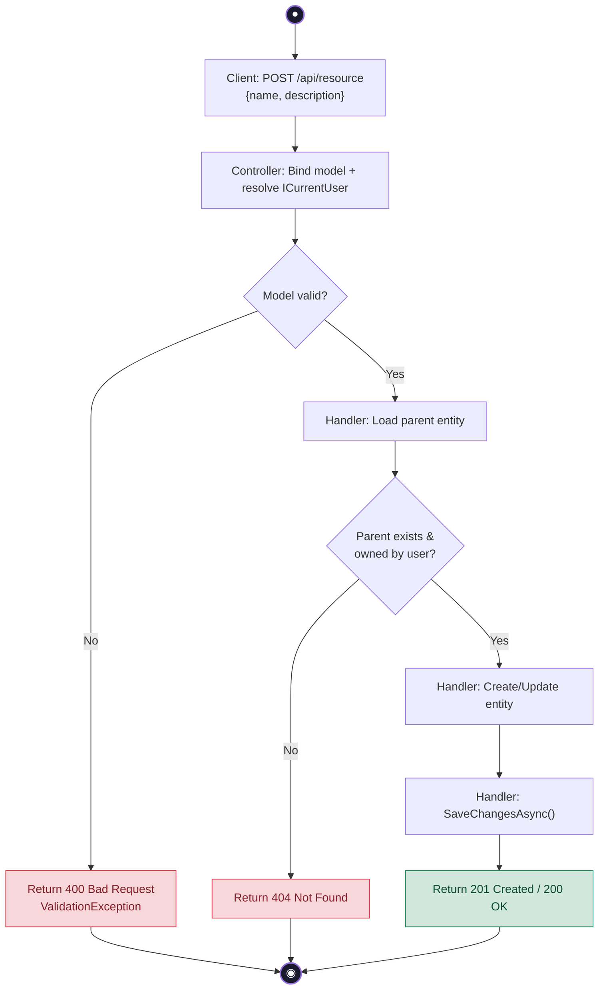
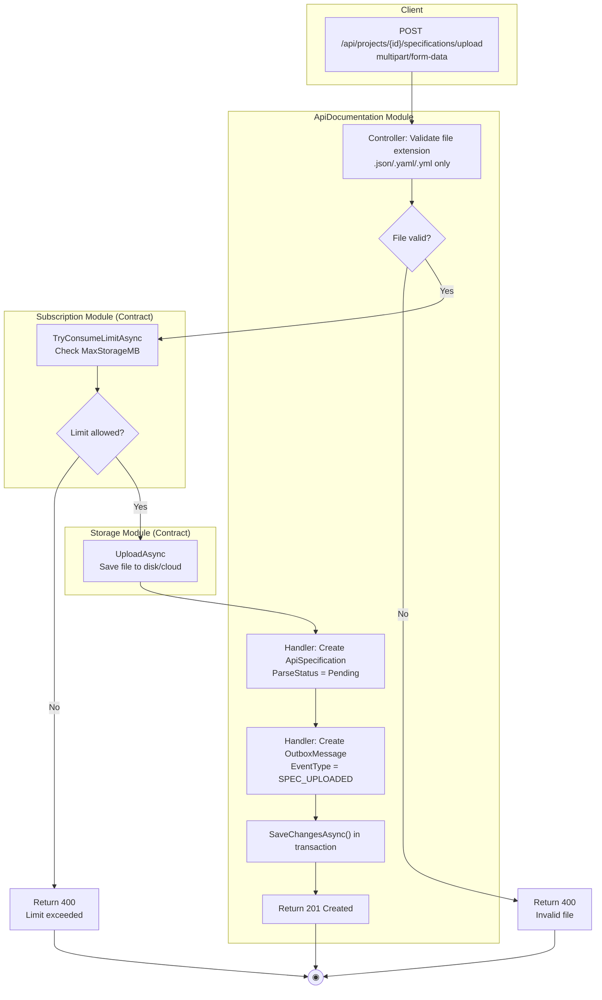
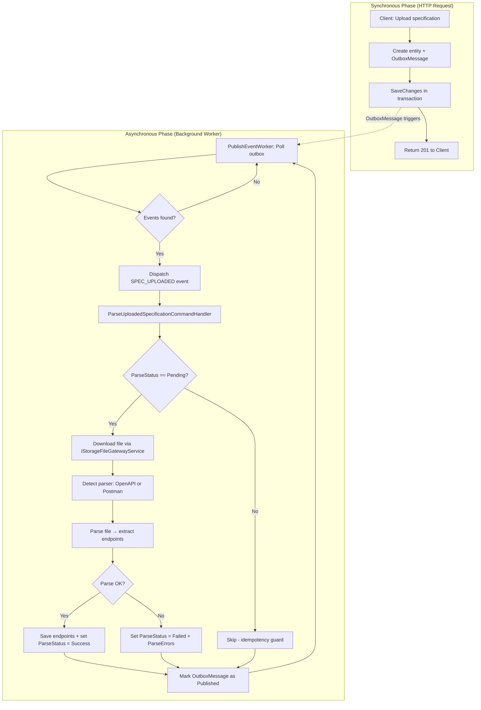

# 13 - Activity Diagram Playbook (ClassifiedAds Modular Monolith)

> **Mục tiêu**: Hướng dẫn vẽ **UML Activity Diagram chuẩn** cho hệ thống Modular Monolith — mỗi activity là một **method call thật** hoặc **business step** tương ứng với code, mỗi decision là một **guard condition** rõ ràng, có swim lane phân biệt actor và module.
>
> **Format**: Mermaid `flowchart TD` blocks tương thích với **draw.io** import.
> **Import guide**: Copy content bên trong `mermaid` code fence (không gồm triple backticks) → Extras → Edit Diagram → paste.

---

## 1. Nguyên Tắc UML Activity Diagram Chuẩn

### 1.1. Activity Diagram vs Các Diagram Khác

| Diagram | Trả lời câu hỏi | Focus |
|---------|------------------|-------|
| **Sequence Diagram** | "Ai gọi ai, theo thứ tự nào?" | Message passing giữa các object |
| **State Machine Diagram** | "Entity có những trạng thái nào?" | State transitions của 1 entity |
| **Activity Diagram** | "Quy trình xử lý gồm những bước nào?" | **Flow of activities**, decisions, parallelism |

Activity Diagram **bổ sung** cho Sequence Diagram bằng cách cho thấy **tổng quan quy trình** (big picture) thay vì chi tiết từng method call.

### 1.2. Thành Phần UML Activity Diagram

| Thành phần UML | Mermaid Syntax | Ý nghĩa |
|----------------|----------------|---------|
| **Initial Node** (vòng tròn đen) | `Start([fa:fa-play Start])` hoặc `Start((●))` | Điểm bắt đầu flow |
| **Final Node** (vòng tròn đen viền) | `End([fa:fa-stop End])` hoặc `End((◉))` | Điểm kết thúc flow |
| **Action/Activity** (hình chữ nhật bo tròn) | `A[Action Name]` | Một bước xử lý cụ thể |
| **Decision Node** (hình thoi) | `D{Condition?}` | Điểm rẽ nhánh (if/else) |
| **Merge Node** (hình thoi) | Dùng cùng decision node hoặc node trung gian | Hợp nhánh lại |
| **Fork Bar** (thanh ngang) | Dùng `subgraph` parallel | Bắt đầu xử lý song song |
| **Join Bar** (thanh ngang) | Kết thúc `subgraph` parallel | Chờ tất cả nhánh hoàn thành |
| **Swim Lane** (lane dọc) | `subgraph "Actor/Module"` | Phân biệt trách nhiệm |
| **Note/Annotation** | Comment trong code fence | Ghi chú bổ sung |

### 1.3. Quy Tắc Mermaid Cho Activity Diagram

Mermaid không có native `activityDiagram` syntax. Sử dụng `flowchart TD` (Top-Down) với các quy ước sau:

```
flowchart TD
    %% Start node - hình tròn hoặc stadium
    Start((●))

    %% Activity node - hình chữ nhật
    A1[Validate input]

    %% Decision node - hình thoi
    D1{Is valid?}

    %% End node - hình tròn kép
    End1((◉))

    %% Flow arrows
    Start --> A1
    A1 --> D1
    D1 -->|Yes| A2[Process request]
    D1 -->|No| A3[Return error]
    A2 --> End1
    A3 --> End1
```

### 1.4. Quy Ước Đặt Tên Node

| Loại node | Prefix | Ví dụ |
|-----------|--------|-------|
| Start | `Start` | `Start((●))` |
| End (success) | `End` | `End((◉))` |
| End (error) | `ErrEnd` | `ErrEnd((◉))` |
| Activity | `A` + số thứ tự | `A1[Upload file to Storage]` |
| Decision | `D` + số thứ tự | `D1{ParseStatus == Pending?}` |
| Sub-process (ref) | `Sub` + tên | `SubParse[[Parse Specification]]` |
| Parallel fork/join | `Fork` / `Join` | Comment chỉ rõ |

---

## 2. Các Loại Activity Diagram Trong Dự Án

### 2.1. Request-Response Flow (Synchronous)

Mô tả quy trình xử lý 1 HTTP request từ Client đến Database và trả về response.

**Đặc điểm:**
- Bắt đầu: Client gửi request
- Kết thúc: Client nhận response (success hoặc error)
- Decisions: Validation, authorization, business rules
- Không có parallel processing

**Template:**



### 2.2. Async Flow (Outbox + Background Worker)

Mô tả quy trình xử lý bất đồng bộ qua Outbox Pattern.

**Đặc điểm:**
- 2 phần riêng biệt: (1) Sync request tạo outbox message, (2) Worker xử lý async
- Decision: Idempotency guard, retry logic
- Có thể có parallel processing

**Template:**



### 2.3. Pipeline Flow (Multi-Step Orchestration)

Mô tả quy trình có nhiều bước tuần tự, thường là generation/processing pipeline.

**Đặc điểm:**
- Nhiều bước tuần tự hoặc song song
- Mỗi bước có thể fail độc lập
- Có aggregate result ở cuối
- Graceful degradation khi 1 bước fail

**Template:**



### 2.4. Cross-Module Flow

Mô tả quy trình gọi sang module khác qua Contract interface.

**Đặc điểm:**
- Swim lanes phân biệt module
- Giao tiếp qua interface (không truy cập DbContext trực tiếp)
- Có thể có transaction boundary khác nhau
- Cross-module node dùng style `crossModule` (màu tím nhạt)

**Template:**



**Quy tắc cross-module:**
- Chỉ gọi qua **Contract interface** (ví dụ: `ISubscriptionLimitGatewayService`, `IStorageFileGatewayService`)
- Không bao giờ truy cập `DbContext` hoặc `IRepository` của module khác
- Cross-module node luôn ghi rõ tên interface + method

---

## 3. Quy Ước Swim Lane

### 3.1. Khi Nào Dùng Swim Lane

| Trường hợp | Dùng swim lane? | Lý do |
|------------|-----------------|-------|
| Flow đơn giản trong 1 module | Không | Không cần phân biệt actor |
| Cross-module flow | **Có** | Phân biệt module nào làm gì |
| Flow có Client + Server | **Có** | Phân biệt frontend vs backend |
| Background worker flow | **Có** | Phân biệt trigger vs processor |

### 3.2. Cách Viết Swim Lane Trong Mermaid



### 3.3. Tên Swim Lane = Tên Module Thật

| Module thật | Swim lane name |
|-------------|---------------|
| `ClassifiedAds.Modules.ApiDocumentation` | `ApiDocumentation` |
| `ClassifiedAds.Modules.TestGeneration` | `TestGeneration` |
| `ClassifiedAds.Modules.TestExecution` | `TestExecution` |
| `ClassifiedAds.Modules.TestReporting` | `TestReporting` |
| `ClassifiedAds.Modules.Subscription` | `Subscription` |
| `ClassifiedAds.Modules.Storage` | `Storage` |
| `ClassifiedAds.Modules.Identity` | `Identity` |
| `ClassifiedAds.Modules.LlmAssistant` | `LlmAssistant` |
| `ClassifiedAds.Modules.Notification` | `Notification` |
| `ClassifiedAds.Background` | `Background Worker` |
| External | `Client`, `PayOS`, `n8n`, `LLM Provider` |

---

## 4. Quy Ước Style Và Màu Sắc

### 4.1. Node Styling

```mermaid
flowchart TD
    %% Style definitions
    classDef startEnd fill:#1a1a2e,color:#fff,stroke:#16213e,stroke-width:2px
    classDef activity fill:#e8f4f8,stroke:#0077b6,stroke-width:1px,color:#023e8a
    classDef decision fill:#fff3cd,stroke:#ffc107,stroke-width:2px,color:#664d03
    classDef error fill:#f8d7da,stroke:#dc3545,stroke-width:1px,color:#842029
    classDef success fill:#d1e7dd,stroke:#198754,stroke-width:1px,color:#0f5132
    classDef crossModule fill:#e2d9f3,stroke:#7c3aed,stroke-width:1px,color:#4c1d95
    classDef subprocess fill:#fff,stroke:#0077b6,stroke-width:2px,stroke-dasharray: 5 5
```

| Loại node | Class | Màu sắc | Dùng cho |
|-----------|-------|---------|----------|
| Start/End | `startEnd` | Đen | Điểm bắt đầu/kết thúc |
| Activity (normal) | `activity` | Xanh nhạt | Bước xử lý thông thường |
| Decision | `decision` | Vàng | Điểm rẽ nhánh |
| Error path | `error` | Đỏ nhạt | Error response |
| Success path | `success` | Xanh lá nhạt | Success response |
| Cross-module call | `crossModule` | Tím nhạt | Gọi sang module khác |

### 4.2. Arrow Labels

| Label | Dùng cho | Ví dụ |
|-------|----------|-------|
| `-->|Yes|` | Nhánh điều kiện đúng | `D1 -->|Yes| A2` |
| `-->|No|` | Nhánh điều kiện sai | `D1 -->|No| Err1` |
| `-->|condition text|` | Guard condition cụ thể | `D1 -->|plan.IsActive| A2` |
| `-->` (không label) | Luồng mặc định / happy path | `A1 --> A2` |

---

## 5. Quy Trình 6 Bước Vẽ Activity Diagram

### Bước 1 — Xác Định Use Case Và Entry Point

Tìm chính xác:
- **Trigger**: HTTP request, background timer, domain event, hoặc manual action
- **Controller/Action method** (nếu là HTTP trigger)
- **Input**: Request body, route params, query params

### Bước 2 — Trace Happy Path Từ Đầu Đến Cuối

Đọc code theo thứ tự happy path (không rẽ nhánh):

1. **Controller** → validate model → dispatch command/query
2. **Handler** → load entities → apply business logic → persist
3. **Response** → map to DTO → return HTTP status

Ghi lại mỗi bước thành 1 Activity node.

### Bước 3 — Xác Định Decision Points

Tìm tất cả các điều kiện rẽ nhánh trong code:

- `if (entity == null)` → Decision: `{Entity exists?}`
- `if (!result.IsAllowed)` → Decision: `{Limit allowed?}`
- `if (parseStatus != Pending)` → Decision: `{ParseStatus == Pending?}`
- `try/catch` → Decision: `{Processing OK?}`

### Bước 4 — Xác Định Error Paths

Mỗi Decision tạo ra 1 hoặc nhiều error path:
- **400 Bad Request**: Validation failure
- **401/403**: Authentication/authorization failure
- **404 Not Found**: Entity not found
- **409 Conflict**: Business rule violation
- **500 Internal Server Error**: Infrastructure failure

### Bước 5 — Thêm Cross-Module Calls

Nếu flow gọi sang module khác, đánh dấu rõ:
- Tên **Contract interface** (ví dụ: `IStorageFileGatewayService`)
- **Method** được gọi (ví dụ: `UploadAsync`)
- Sử dụng style `crossModule` cho node

### Bước 6 — Kiểm Tra Kích Thước Và Tính Đúng

| Tiêu chí | Quá nhỏ | Vừa phải | Quá lớn |
|----------|---------|----------|---------|
| Số Activity nodes | < 4 | 5-12 | > 15 |
| Số Decision nodes | 0 | 1-4 | > 5 |
| Số End nodes | 1 | 2-4 | > 5 |
| Số swim lanes | 0-1 | 2-4 | > 5 |

---

## 6. Template Thực Tế

### 6.1. Simple CRUD Flow



### 6.2. Cross-Module Flow Với Swim Lane



### 6.3. Async Processing Flow



---

## 7. Mapping Class Thật → Activity Node

### 7.1. Controller Actions → Entry Activities

| Controller | Action | Activity node text |
|------------|--------|--------------------|
| `SpecificationsController` | `Upload()` | `POST /api/projects/{id}/specifications/upload` |
| `SpecificationsController` | `CreateManual()` | `POST /api/projects/{id}/specifications/manual` |
| `SpecificationsController` | `ImportCurl()` | `POST /api/projects/{id}/specifications/curl-import` |
| `SpecificationsController` | `Activate()` | `PUT /api/projects/{id}/specifications/{specId}/activate` |
| `EndpointsController` | `Create()` | `POST /api/projects/{id}/specifications/{specId}/endpoints` |
| `EndpointsController` | `Update()` | `PUT /api/projects/{id}/specifications/{specId}/endpoints/{endpointId}` |
| `AuthController` | `Login()` | `POST /api/auth/login` |
| `AuthController` | `Register()` | `POST /api/auth/register` |
| `AuthController` | `Logout()` | `POST /api/auth/logout` |
| `ProjectsController` | `Create()` | `POST /api/projects` |
| `ProjectsController` | `Archive()` | `PUT /api/projects/{id}/archive` |
| `SubscriptionsController` | `Post()` | `POST /api/subscriptions` |
| `PaymentsController` | `CreateCheckout()` | `POST /api/payments/checkout` |
| `FilesController` | `Upload()` | `POST /api/files` |
| `FilesController` | `Download()` | `GET /api/files/{id}` |

### 7.2. Handler Logic → Activity Nodes

| Handler method | Activity node text |
|----------------|--------------------|
| `repo.FirstOrDefaultAsync(predicate)` | `Load entity from DB` |
| `ValidationException(errors)` | `Validate input / business rules` |
| `unitOfWork.SaveChangesAsync()` | `SaveChangesAsync() in transaction` |
| `gatewayService.TryConsumeLimitAsync(...)` | `Check subscription limit (Contract)` |
| `StorageGw.UploadAsync(request)` | `Upload file to Storage (Contract)` |
| `OutboxMessage(EventType, Payload)` | `Create OutboxMessage` |
| `ExecuteInTransactionAsync(action)` | `Execute in serializable transaction` |
| `emailService.CreateEmailMessageAsync(dto)` | `Send email notification (Contract)` |

### 7.3. Decision Mapping

| Code pattern | Decision node text | Yes branch | No branch |
|--------------|-------------------|------------|-----------|
| `if (entity == null)` | `{Entity exists?}` | Continue | 404 Not Found |
| `if (project.OwnerId != userId)` | `{Owned by user?}` | Continue | 403 Forbidden |
| `if (!result.IsAllowed)` | `{Limit allowed?}` | Continue | 400 Limit exceeded |
| `if (parseStatus != Pending)` | `{ParseStatus == Pending?}` | Parse | Skip (idempotency) |
| `if (plan == null \|\| !plan.IsActive)` | `{Plan active?}` | Continue | 404 Plan not found |
| `try { ... } catch` | `{Processing OK?}` | Success | Error |
| `if (file == null \|\| file.Length == 0)` | `{File valid?}` | Continue | 400 File required |
| `DbUpdateConcurrencyException` | `{Concurrency conflict?}` | 409 Conflict | Continue |

---

## 8. Quy Tắc Kích Thước Và Tách Diagram

### 8.1. Ngưỡng khuyến nghị

| Tiêu chí | Quá nhỏ | Vừa phải | Quá lớn |
|----------|---------|----------|---------|
| Số Activity nodes | < 4 | 5-12 | > 15 |
| Số Decision nodes | 0 | 1-4 | > 5 |
| Số End nodes | 1 | 2-4 | > 5 |
| Độ sâu (số bước trên happy path) | < 3 | 4-8 | > 10 |
| Số swim lanes | 0-1 | 2-4 | > 5 |

### 8.2. Khi Nào Phải Tách

| Trường hợp | Cách tách |
|------------|-----------|
| Sync request + async background | 2 diagram: (1) HTTP flow, (2) Worker flow. Dùng `-.->` để liên kết |
| Pipeline > 3 bước phức tạp | Tách mỗi pipeline thành sub-diagram, diagram chính chỉ ghi `[[Sub-process name]]` |
| Cross-module phức tạp (> 5 bước nội bộ) | Diagram riêng cho module được gọi, diagram chính dùng subprocess reference |

### 8.3. Sub-Process Reference

Mermaid hỗ trợ subroutine node:

```
SubProc[[Parse Specification Flow]]
```

Node `[[...]]` biểu thị một sub-process được mô tả chi tiết ở diagram khác.

---

## 9. Checklist Review Trước Khi Merge

### 9.1. Flow Accuracy

- [ ] Happy path chạy từ Start → ... → End không bị đứt đoạn.
- [ ] Mỗi Decision có ít nhất 2 outgoing arrows (Yes/No hoặc named conditions).
- [ ] Mỗi error path kết thúc ở một End node.
- [ ] Không có node "mồ côi" (không có arrow vào hoặc ra).

### 9.2. Code Mapping

- [ ] Mỗi Activity node tương ứng với **1 method call hoặc business step** trong code.
- [ ] Mỗi Decision node tương ứng với **1 if/else hoặc guard condition** trong code.
- [ ] Tên Controller, Handler, Service đúng với class name thật.
- [ ] HTTP method và route đúng với code.

### 9.3. Cross-Module

- [ ] Giao tiếp cross-module chỉ qua **Contract interface** (IXxxGatewayService).
- [ ] Không truy cập DbContext/Repository của module khác trực tiếp.
- [ ] Cross-module calls được đánh dấu rõ (style khác hoặc swim lane riêng).

### 9.4. Kích Thước

- [ ] 5-12 Activity nodes, 1-4 Decision nodes.
- [ ] Không trộn sync flow + async worker trong cùng diagram (trừ khi cần thiết).
- [ ] Pipeline phức tạp đã được tách thành sub-diagrams.

### 9.5. Mermaid Syntax

- [ ] Mỗi diagram có `flowchart TD` header.
- [ ] Node IDs không trùng nhau trong cùng diagram.
- [ ] Arrow labels đúng cú pháp `-->|label|`.
- [ ] Không có ký tự đặc biệt trong node ID (chỉ dùng alphanumeric + underscore).
- [ ] String content trong node dùng dấu `"..."` nếu chứa ký tự đặc biệt.

---

## 10. Library Activity Diagram Cho Dự Án

Danh sách diagram cần duy trì, tổ chức theo feature:

### Implemented Features

| # | Feature | Diagram | File Section |
|---|---------|---------|--------------|
| 1 | FE-01 | User Registration Flow | `fe-01-ad-01` |
| 2 | FE-01 | User Login Flow | `fe-01-ad-02` |
| 3 | FE-01 | Token Refresh Flow | `fe-01-ad-03` |
| 4 | FE-01 | User Logout Flow | `fe-01-ad-04` |
| 5 | FE-02/03 | Upload API Specification | `fe-03-ad-01` |
| 6 | FE-02/03 | Async Parse Specification | `fe-03-ad-02` |
| 7 | FE-02/03 | Create Manual Specification | `fe-03-ad-03` |
| 8 | FE-02/03 | Import cURL Specification | `fe-03-ad-04` |
| 9 | FE-02/03 | Activate/Deactivate Specification | `fe-03-ad-05` |
| 10 | FE-02/03 | Delete Specification (Cascade) | `fe-03-ad-06` |
| 11 | FE-02/03 | Project Management (CRUD) | `fe-03-ad-07` |
| 12 | FE-04 | Create/Configure Test Suite Scope | `fe-04-ad-01` |
| 13 | FE-04 | Create/Configure Execution Environment | `fe-04-ad-02` |
| 14 | FE-05A | Propose API Test Order | `fe-05a-ad-01` |
| 15 | FE-05A | Approve/Reject Test Order | `fe-05a-ad-02` |
| 16 | FE-12 | Resolve URL & Path Mutations | `fe-12-ad-01` |
| 17 | FE-14 | Subscribe to Plan | `fe-14-ad-01` |
| 18 | FE-14 | Payment Checkout (PayOS) | `fe-14-ad-02` |
| 19 | FE-14 | PayOS Webhook Processing | `fe-14-ad-03` |
| 20 | FE-14 | Atomic Limit Consumption | `fe-14-ad-04` |
| 21 | Storage | File Upload & Download | `storage-ad-01` |
| 22 | Notification | Email Notification Sending | `notification-ad-01` |

### Planned Features

| # | Feature | Diagram | File Section |
|---|---------|---------|--------------|
| 23 | FE-05B | Generate Happy-Path Test Cases | `fe-05b-ad-01` |
| 24 | FE-06 | Generate Boundary & Negative Cases | `fe-06-ad-01` |
| 25 | FE-07+08 | Execute Test Run + Validation | `fe-07-ad-01` |
| 26 | FE-09 | LLM Failure Explanation | `fe-09-ad-01` |
| 27 | FE-10 | Generate Test Report & Export | `fe-10-ad-01` |
| 28 | FE-15/16/17 | LLM Suggestion Review Pipeline | `fe-15-ad-01` |

### Infrastructure

| # | Diagram | File Section |
|---|---------|--------------|
| 29 | Outbox Event Publishing Flow | `infra-ad-01` |
| 30 | ASP.NET Request Pipeline | `infra-ad-02` |

---

## 11. Mapping Nhanh: Class → File Trong Code

| Class | File path |
|---|---|
| `SpecificationsController` | `ClassifiedAds.Modules.ApiDocumentation/Controllers/SpecificationsController.cs` |
| `EndpointsController` | `ClassifiedAds.Modules.ApiDocumentation/Controllers/EndpointsController.cs` |
| `ProjectsController` | `ClassifiedAds.Modules.ApiDocumentation/Controllers/ProjectsController.cs` |
| `UploadApiSpecificationCommandHandler` | `ClassifiedAds.Modules.ApiDocumentation/Commands/UploadApiSpecificationCommand.cs` |
| `ParseUploadedSpecificationCommandHandler` | `ClassifiedAds.Modules.ApiDocumentation/Commands/ParseUploadedSpecificationCommand.cs` |
| `CreateManualSpecificationCommandHandler` | `ClassifiedAds.Modules.ApiDocumentation/Commands/CreateManualSpecificationCommand.cs` |
| `ImportCurlCommandHandler` | `ClassifiedAds.Modules.ApiDocumentation/Commands/ImportCurlCommand.cs` |
| `ActivateSpecificationCommandHandler` | `ClassifiedAds.Modules.ApiDocumentation/Commands/ActivateSpecificationCommand.cs` |
| `OpenApiSpecificationParser` | `ClassifiedAds.Modules.ApiDocumentation/Services/OpenApiSpecificationParser.cs` |
| `PostmanSpecificationParser` | `ClassifiedAds.Modules.ApiDocumentation/Services/PostmanSpecificationParser.cs` |
| `CurlParser` | `ClassifiedAds.Modules.ApiDocumentation/Services/CurlParser.cs` |
| `PathParameterTemplateService` | `ClassifiedAds.Modules.ApiDocumentation/Services/PathParameterTemplateService.cs` |
| `AuthController` | `ClassifiedAds.Modules.Identity/Controllers/AuthController.cs` |
| `SubscriptionsController` | `ClassifiedAds.Modules.Subscription/Controllers/SubscriptionsController.cs` |
| `PaymentsController` | `ClassifiedAds.Modules.Subscription/Controllers/PaymentsController.cs` |
| `ConsumeLimitAtomicallyCommandHandler` | `ClassifiedAds.Modules.Subscription/Commands/ConsumeLimitAtomicallyCommand.cs` |
| `FilesController` | `ClassifiedAds.Modules.Storage/Controllers/FilesController.cs` |
| `StorageFileGatewayService` | `ClassifiedAds.Modules.Storage/Services/StorageFileGatewayService.cs` |
| `EmailMessageService` | `ClassifiedAds.Modules.Notification/Services/EmailMessageService.cs` |
| `SendEmailWorker` | `ClassifiedAds.Modules.Notification/HostedServices/SendEmailWorker.cs` |
| `PublishEventWorker` | `ClassifiedAds.Modules.*/HostedServices/PublishEventWorker.cs` |
| `PublishEventsCommandHandler` | `ClassifiedAds.Modules.*/Commands/PublishEventsCommand.cs` |
| `ISubscriptionLimitGatewayService` | `ClassifiedAds.Contracts.Subscription/Services/ISubscriptionLimitGatewayService.cs` |
| `IStorageFileGatewayService` | `ClassifiedAds.Contracts.Storage/Services/IStorageFileGatewayService.cs` |
| `IApiEndpointMetadataService` | `ClassifiedAds.Contracts.ApiDocumentation/Services/IApiEndpointMetadataService.cs` |
| `ILlmAssistantGatewayService` | `ClassifiedAds.Contracts.LlmAssistant/Services/ILlmAssistantGatewayService.cs` |
| `IEmailMessageService` | `ClassifiedAds.Contracts.Notification/Services/IEmailMessageService.cs` |
