# Activity Diagrams (Mermaid)

> **Format**: Mermaid `flowchart TD` blocks tương thích với **draw.io** import.
> **Import guide**: Copy content bên trong mỗi `mermaid` code fence (không gồm triple backticks) → Extras → Edit Diagram → paste.
> **Convention**: Mỗi Activity node = 1 business step/method call thật trong code. Mỗi Decision node = 1 guard condition thật.
> **Playbook**: Xem `13-activity-diagram-playbook.md` để biết quy tắc vẽ chi tiết.

---

## Mục Lục

### Implemented (in code)

| # | FE | Tên | Diagram |
|---|-----|-----|---------|
| 1 | [FE-01](#fe-01--user-authentication--rbac) | User Authentication & RBAC | 4 |
| 2 | [FE-02/03](#fe-0203--api-input-management--parse) | API Input Management & Parse | 7 |
| 3 | [FE-04](#fe-04--test-scope--execution-configuration) | Test Scope & Execution Configuration | 2 |
| 4 | [FE-05A](#fe-05a--api-test-order-proposal) | API Test Order Proposal | 2 |
| 5 | [FE-12](#fe-12--path-parameter-templating) | Path Parameter Templating | 1 |
| 6 | [FE-14](#fe-14--subscription--billing) | Subscription & Billing | 4 |
| 7 | [Storage](#storage--file-management) | File Management | 1 |
| 8 | [Notification](#notification--email-sending) | Email Sending | 1 |

### Planned (from feature specs)

| # | FE | Tên | Diagram |
|---|-----|-----|---------|
| 7 | [FE-05B](#fe-05b--happy-path-test-case-generation-planned) | Happy-Path Test Case Generation | 1 |
| 8 | [FE-06](#fe-06--boundary--negative-test-generation-planned) | Boundary & Negative Test Generation | 1 |
| 9 | [FE-07+08](#fe-0708--test-execution--validation-planned) | Test Execution & Validation | 1 |
| 10 | [FE-09](#fe-09--llm-failure-explanations-planned) | LLM Failure Explanations | 1 |
| 11 | [FE-10](#fe-10--test-reporting--export-planned) | Test Reporting & Export | 1 |
| 12 | [FE-15/16/17](#fe-151617--llm-suggestion-review-planned) | LLM Suggestion Review Pipeline | 1 |

### Infrastructure

| # | Tên | Diagram |
|---|-----|---------|
| 13 | [Outbox Event Publishing](#infrastructure--outbox-event-publishing) | 1 |
| 14 | [ASP.NET Request Pipeline](#infrastructure--aspnet-request-pipeline) | 1 |

**Tổng: 30 activity diagrams**

---

## Implemented Activity Diagrams

---

## FE-01 — User Authentication & RBAC

### FE-01-AD-01: User Registration

**Module:** `ClassifiedAds.Modules.Identity`
**Entry:** `AuthController.Register()` → `POST /api/auth/register`

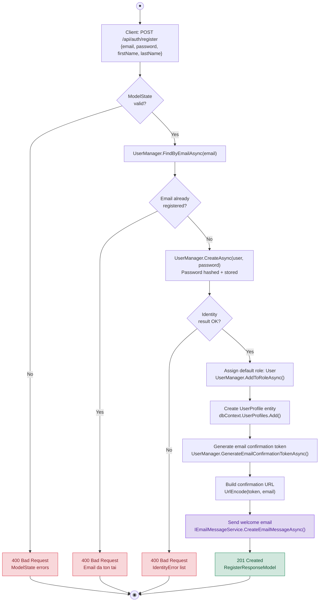
```mermaid
flowchart TD
    Start((●)) --> A1["Client: POST /api/auth/register<br/>{email, password, firstName, lastName}"]
    A1 --> D1{"ModelState<br/>valid?"}
    D1 -->|No| Err1["400 Bad Request<br/>ModelState errors"]
    D1 -->|Yes| A2["UserManager.FindByEmailAsync(email)"]
    A2 --> D2{"Email already<br/>registered?"}
    D2 -->|Yes| Err2["400 Bad Request<br/>Email da ton tai"]
    D2 -->|No| A3["UserManager.CreateAsync(user, password)<br/>Password hashed + stored"]
    A3 --> D3{"Identity<br/>result OK?"}
    D3 -->|No| Err3["400 Bad Request<br/>IdentityError list"]
    D3 -->|Yes| A4["Assign default role: User<br/>UserManager.AddToRoleAsync()"]
    A4 --> A5["Create UserProfile entity<br/>dbContext.UserProfiles.Add()"]
    A5 --> A6["Generate email confirmation token<br/>UserManager.GenerateEmailConfirmationTokenAsync()"]
    A6 --> A7["Build confirmation URL<br/>UrlEncode(token, email)"]
    A7 --> A8["Send welcome email<br/>IEmailMessageService.CreateEmailMessageAsync()"]
    A8 --> A9["201 Created<br/>RegisterResponseModel"]

    Err1 --> End1((◉))
    Err2 --> End1
    Err3 --> End1
    A9 --> End1

    classDef error fill:#f8d7da,stroke:#dc3545,color:#842029
    classDef success fill:#d1e7dd,stroke:#198754,color:#0f5132
    classDef crossModule fill:#e2d9f3,stroke:#7c3aed,color:#4c1d95
    class Err1,Err2,Err3 error
    class A9 success
    class A8 crossModule
```

---

### FE-01-AD-02: User Login

**Module:** `ClassifiedAds.Modules.Identity`
**Entry:** `AuthController.Login()` → `POST /api/auth/login`

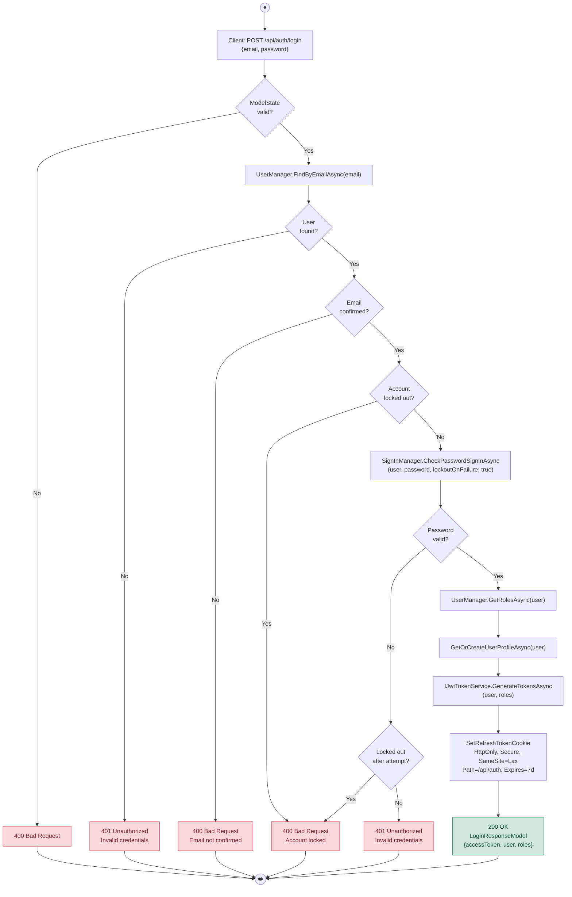
```mermaid
flowchart TD
    Start((●)) --> A1["Client: POST /api/auth/login<br/>{email, password}"]
    A1 --> D1{"ModelState<br/>valid?"}
    D1 -->|No| Err1["400 Bad Request"]
    D1 -->|Yes| A2["UserManager.FindByEmailAsync(email)"]
    A2 --> D2{"User<br/>found?"}
    D2 -->|No| Err2["401 Unauthorized<br/>Invalid credentials"]
    D2 -->|Yes| D3{"Email<br/>confirmed?"}
    D3 -->|No| Err3["400 Bad Request<br/>Email not confirmed"]
    D3 -->|Yes| D4{"Account<br/>locked out?"}
    D4 -->|Yes| Err4["400 Bad Request<br/>Account locked"]
    D4 -->|No| A3["SignInManager.CheckPasswordSignInAsync<br/>(user, password, lockoutOnFailure: true)"]
    A3 --> D5{"Password<br/>valid?"}
    D5 -->|No| D6{"Locked out<br/>after attempt?"}
    D6 -->|Yes| Err4
    D6 -->|No| Err2b["401 Unauthorized<br/>Invalid credentials"]
    D5 -->|Yes| A4["UserManager.GetRolesAsync(user)"]
    A4 --> A5["GetOrCreateUserProfileAsync(user)"]
    A5 --> A6["IJwtTokenService.GenerateTokensAsync<br/>(user, roles)"]
    A6 --> A7["SetRefreshTokenCookie<br/>HttpOnly, Secure, SameSite=Lax<br/>Path=/api/auth, Expires=7d"]
    A7 --> A8["200 OK<br/>LoginResponseModel<br/>{accessToken, user, roles}"]

    Err1 --> End1((◉))
    Err2 --> End1
    Err2b --> End1
    Err3 --> End1
    Err4 --> End1
    A8 --> End1

    classDef error fill:#f8d7da,stroke:#dc3545,color:#842029
    classDef success fill:#d1e7dd,stroke:#198754,color:#0f5132
    class Err1,Err2,Err2b,Err3,Err4 error
    class A8 success
```

---

### FE-01-AD-03: Token Refresh

**Module:** `ClassifiedAds.Modules.Identity`
**Entry:** `AuthController.RefreshToken()` → `POST /api/auth/refresh-token`

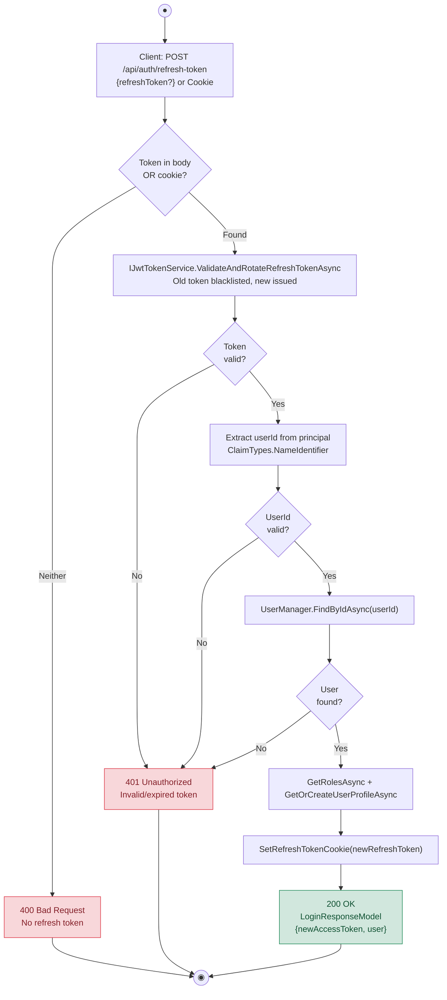
```mermaid
flowchart TD
    Start((●)) --> A1["Client: POST /api/auth/refresh-token<br/>{refreshToken?} or Cookie"]
    A1 --> D1{"Token in body<br/>OR cookie?"}
    D1 -->|Neither| Err1["400 Bad Request<br/>No refresh token"]
    D1 -->|Found| A2["IJwtTokenService.ValidateAndRotateRefreshTokenAsync<br/>Old token blacklisted, new issued"]
    A2 --> D2{"Token<br/>valid?"}
    D2 -->|No| Err2["401 Unauthorized<br/>Invalid/expired token"]
    D2 -->|Yes| A3["Extract userId from principal<br/>ClaimTypes.NameIdentifier"]
    A3 --> D3{"UserId<br/>valid?"}
    D3 -->|No| Err2
    D3 -->|Yes| A4["UserManager.FindByIdAsync(userId)"]
    A4 --> D4{"User<br/>found?"}
    D4 -->|No| Err2
    D4 -->|Yes| A5["GetRolesAsync + GetOrCreateUserProfileAsync"]
    A5 --> A6["SetRefreshTokenCookie(newRefreshToken)"]
    A6 --> A7["200 OK<br/>LoginResponseModel<br/>{newAccessToken, user}"]

    Err1 --> End1((◉))
    Err2 --> End1
    A7 --> End1

    classDef error fill:#f8d7da,stroke:#dc3545,color:#842029
    classDef success fill:#d1e7dd,stroke:#198754,color:#0f5132
    class Err1,Err2 error
    class A7 success
```

---

### FE-01-AD-04: User Logout

**Module:** `ClassifiedAds.Modules.Identity`
**Entry:** `AuthController.Logout()` → `POST /api/auth/logout`

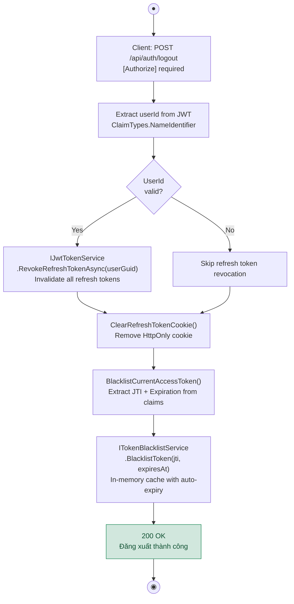
```mermaid
flowchart TD
    Start((●)) --> A1["Client: POST /api/auth/logout<br/>[Authorize] required"]

    A1 --> A2["Extract userId from JWT<br/>ClaimTypes.NameIdentifier"]
    A2 --> D1{"UserId<br/>valid?"}
    D1 -->|Yes| A3["IJwtTokenService<br/>.RevokeRefreshTokenAsync(userGuid)<br/>Invalidate all refresh tokens"]
    D1 -->|No| A4["Skip refresh token revocation"]

    A3 --> A5["ClearRefreshTokenCookie()<br/>Remove HttpOnly cookie"]
    A4 --> A5

    A5 --> A6["BlacklistCurrentAccessToken()<br/>Extract JTI + Expiration from claims"]
    A6 --> A7["ITokenBlacklistService<br/>.BlacklistToken(jti, expiresAt)<br/>In-memory cache with auto-expiry"]

    A7 --> A8["200 OK<br/>Đăng xuất thành công"]

    A8 --> End1((◉))

    classDef error fill:#f8d7da,stroke:#dc3545,color:#842029
    classDef success fill:#d1e7dd,stroke:#198754,color:#0f5132
    class A8 success
```

---

## FE-02/03 — API Input Management & Parse

### FE-03-AD-01: Upload API Specification

**Module:** `ClassifiedAds.Modules.ApiDocumentation`
**Entry:** `SpecificationsController.Upload()` → `POST /api/projects/{projectId}/specifications/upload`

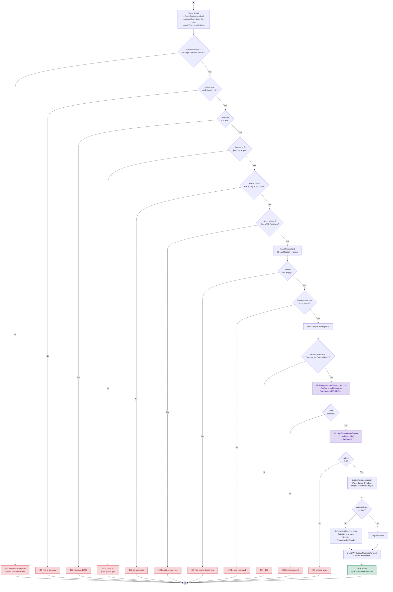
```mermaid
flowchart TD
    Start((●)) --> A1["Client: POST .../specifications/upload<br/>multipart/form-data: file, name,<br/>sourceType, autoActivate"]

    A1 --> D1{"Upload method ==<br/>StorageGatewayContract?"}
    D1 -->|No| Err1["400 ValidationException<br/>Invalid upload method"]

    D1 -->|Yes| D2{"File != null<br/>AND Length > 0?"}
    D2 -->|No| Err2["400 File la bat buoc"]

    D2 -->|Yes| D3{"File size<br/>≤ 10MB?"}
    D3 -->|No| Err3["400 Vuot qua 10MB"]

    D3 -->|Yes| D4{"Extension ∈<br/>.json .yaml .yml?"}
    D4 -->|No| Err4["400 Chi ho tro<br/>.json, .yaml, .yml"]

    D4 -->|Yes| D5{"Name valid?<br/>Not empty, ≤ 200 chars"}
    D5 -->|No| Err5["400 Name invalid"]

    D5 -->|Yes| D6{"SourceType ∈<br/>OpenAPI, Postman?"}
    D6 -->|No| Err6["400 Invalid source type"]

    D6 -->|Yes| A2["Read file content<br/>StreamReader → string"]
    A2 --> D7{"Content<br/>not empty?"}
    D7 -->|No| Err7["400 File khong duoc trong"]

    D7 -->|Yes| D8{"Content matches<br/>source type?"}
    D8 -->|No| Err8["400 Format mismatch"]

    D8 -->|Yes| A3["Load Project by ProjectId"]
    A3 --> D9{"Project exists AND<br/>OwnerId == CurrentUserId?"}
    D9 -->|No| Err9["404 / 403"]

    D9 -->|Yes| A4["ISubscriptionLimitGatewayService<br/>.TryConsumeLimitAsync<br/>(MaxStorageMB, fileSize)"]
    A4 --> D10{"Limit<br/>allowed?"}
    D10 -->|No| Err10["400 Limit exceeded"]

    D10 -->|Yes| A5["IStorageFileGatewayService<br/>.UploadAsync(file)<br/>→ fileEntryId"]
    A5 --> D11{"Upload<br/>OK?"}
    D11 -->|No| Err11["400 Upload failed"]

    D11 -->|Yes| A6["Create ApiSpecification<br/>ParseStatus=Pending<br/>OriginalFileId=fileEntryId"]

    A6 --> D12{"AutoActivate<br/>== true?"}
    D12 -->|Yes| A7["Deactivate old active spec<br/>Activate new spec<br/>Update Project.ActiveSpecId"]
    D12 -->|No| A8["Skip activation"]

    A7 --> A9["UnitOfWork.SaveChangesAsync()<br/>Commit transaction"]
    A8 --> A9
    A9 --> A10["201 Created<br/>SpecificationDetailModel"]

    Err1 --> End1((◉))
    Err2 --> End1
    Err3 --> End1
    Err4 --> End1
    Err5 --> End1
    Err6 --> End1
    Err7 --> End1
    Err8 --> End1
    Err9 --> End1
    Err10 --> End1
    Err11 --> End1
    A10 --> End1

    classDef error fill:#f8d7da,stroke:#dc3545,color:#842029
    classDef success fill:#d1e7dd,stroke:#198754,color:#0f5132
    classDef crossModule fill:#e2d9f3,stroke:#7c3aed,color:#4c1d95
    class Err1,Err2,Err3,Err4,Err5,Err6,Err7,Err8,Err9,Err10,Err11 error
    class A10 success
    class A4,A5 crossModule
```

**Content Validation Rules:**
- OpenAPI: must contain `"openapi"` or `"swagger"` key
- Postman: must contain `"info"` and `"item"` keys

---

### FE-03-AD-02: Async Parse Specification (Outbox → Background Worker)

**Module:** `ClassifiedAds.Modules.ApiDocumentation`
**Trigger:** OutboxMessage `SPEC_UPLOADED` → `ParseUploadedSpecificationCommandHandler`

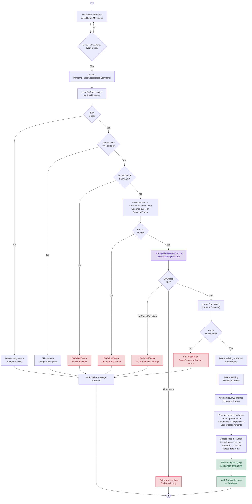
```mermaid
flowchart TD
    Start((●)) --> B1["PublishEventWorker<br/>polls OutboxMessages"]
    B1 --> D1{"SPEC_UPLOADED<br/>event found?"}
    D1 -->|No| B1
    D1 -->|Yes| B2["Dispatch<br/>ParseUploadedSpecificationCommand"]

    B2 --> A1["Load ApiSpecification<br/>by SpecificationId"]
    A1 --> D2{"Spec<br/>found?"}
    D2 -->|No| A_skip1["Log warning, return<br/>idempotent skip"]

    D2 -->|Yes| D3{"ParseStatus<br/>== Pending?"}
    D3 -->|No| A_skip2["Skip parsing<br/>idempotency guard"]

    D3 -->|Yes| D4{"OriginalFileId<br/>has value?"}
    D4 -->|No| Err1["SetFailedStatus<br/>No file attached"]

    D4 -->|Yes| A2["Select parser via CanParse(SourceType)<br/>OpenApiParser or PostmanParser"]
    A2 --> D5{"Parser<br/>found?"}
    D5 -->|No| Err2["SetFailedStatus<br/>Unsupported format"]

    D5 -->|Yes| A3["IStorageFileGatewayService<br/>.DownloadAsync(fileId)"]
    A3 --> D6{"Download<br/>OK?"}
    D6 -->|"NotFoundException"| Err3["SetFailedStatus<br/>File not found in storage"]
    D6 -->|"Other error"| Err_retry["Rethrow exception<br/>Outbox will retry"]
    D6 -->|Yes| A4["parser.ParseAsync<br/>(content, fileName)"]

    A4 --> D7{"Parse<br/>succeeded?"}
    D7 -->|No| Err4["SetFailedStatus<br/>ParseErrors = validation errors"]

    D7 -->|Yes| A5["Delete existing endpoints<br/>for this spec"]
    A5 --> A6["Delete existing<br/>SecuritySchemes"]
    A6 --> A7["Create SecuritySchemes<br/>from parsed result"]
    A7 --> A8["For each parsed endpoint:<br/>Create ApiEndpoint +<br/>Parameters + Responses +<br/>SecurityRequirements"]
    A8 --> A9["Update spec metadata:<br/>ParseStatus = Success<br/>ParsedAt = UtcNow<br/>ParseErrors = null"]
    A9 --> A10["SaveChangesAsync()<br/>All in single transaction"]
    A10 --> A11["Mark OutboxMessage<br/>as Published"]

    Err1 --> A11b["Mark OutboxMessage Published"]
    Err2 --> A11b
    Err3 --> A11b
    Err4 --> A11b
    A_skip1 --> A11b
    A_skip2 --> A11b
    A11 --> End1((◉))
    A11b --> End1
    Err_retry --> End1

    classDef error fill:#f8d7da,stroke:#dc3545,color:#842029
    classDef success fill:#d1e7dd,stroke:#198754,color:#0f5132
    classDef crossModule fill:#e2d9f3,stroke:#7c3aed,color:#4c1d95
    class Err1,Err2,Err3,Err4,Err_retry error
    class A10,A11 success
    class A3 crossModule
```

**Parser Selection:**
- `OpenApiSpecificationParser.CanParse()` → `SourceType == OpenAPI`
- `PostmanSpecificationParser.CanParse()` → `SourceType == Postman`

**Error Strategy:**
- Permanent errors (parse failure, file not found) → `SetFailedStatus`, mark published
- Transient errors (infrastructure) → Rethrow for outbox retry

---

### FE-03-AD-03: Create Manual Specification

**Module:** `ClassifiedAds.Modules.ApiDocumentation`
**Entry:** `SpecificationsController.CreateManual()` → `POST /api/projects/{projectId}/specifications/manual`

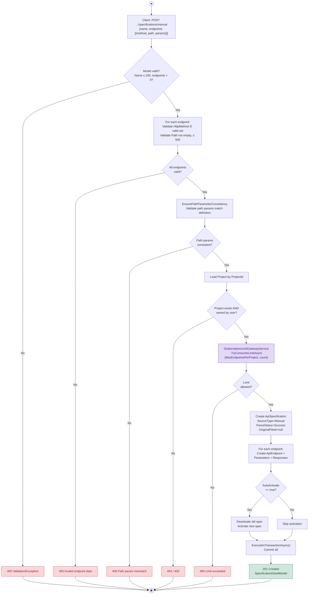
```mermaid
flowchart TD
    Start((●)) --> A1["Client: POST .../specifications/manual<br/>{name, endpoints: [{method, path, params}]}"]

    A1 --> D1{"Model valid?<br/>Name ≤ 200, endpoints > 0?"}
    D1 -->|No| Err1["400 ValidationException"]

    D1 -->|Yes| A2["For each endpoint:<br/>Validate HttpMethod ∈ valid set<br/>Validate Path not empty, ≤ 500"]
    A2 --> D2{"All endpoints<br/>valid?"}
    D2 -->|No| Err2["400 Invalid endpoint data"]

    D2 -->|Yes| A3["EnsurePathParameterConsistency<br/>Validate path params match definition"]
    A3 --> D3{"Path params<br/>consistent?"}
    D3 -->|No| Err3["400 Path param mismatch"]

    D3 -->|Yes| A4["Load Project by ProjectId"]
    A4 --> D4{"Project exists AND<br/>owned by user?"}
    D4 -->|No| Err4["404 / 403"]

    D4 -->|Yes| A5["ISubscriptionLimitGatewayService<br/>.TryConsumeLimitAsync<br/>(MaxEndpointsPerProject, count)"]
    A5 --> D5{"Limit<br/>allowed?"}
    D5 -->|No| Err5["400 Limit exceeded"]

    D5 -->|Yes| A6["Create ApiSpecification<br/>SourceType=Manual<br/>ParseStatus=Success<br/>OriginalFileId=null"]
    A6 --> A7["For each endpoint:<br/>Create ApiEndpoint +<br/>Parameters + Responses"]

    A7 --> D6{"AutoActivate<br/>== true?"}
    D6 -->|Yes| A8["Deactivate old spec<br/>Activate new spec"]
    D6 -->|No| A9["Skip activation"]

    A8 --> A10["ExecuteInTransactionAsync()<br/>Commit all"]
    A9 --> A10
    A10 --> A11["201 Created<br/>SpecificationDetailModel"]

    Err1 --> End1((◉))
    Err2 --> End1
    Err3 --> End1
    Err4 --> End1
    Err5 --> End1
    A11 --> End1

    classDef error fill:#f8d7da,stroke:#dc3545,color:#842029
    classDef success fill:#d1e7dd,stroke:#198754,color:#0f5132
    classDef crossModule fill:#e2d9f3,stroke:#7c3aed,color:#4c1d95
    class Err1,Err2,Err3,Err4,Err5 error
    class A11 success
    class A5 crossModule
```

---

### FE-03-AD-04: Import cURL Specification

**Module:** `ClassifiedAds.Modules.ApiDocumentation`
**Entry:** `SpecificationsController.ImportCurl()` → `POST /api/projects/{projectId}/specifications/curl-import`

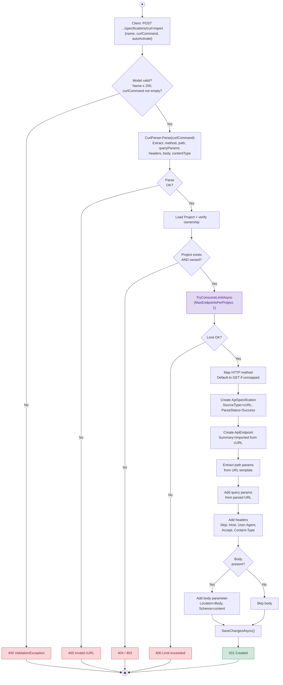
```mermaid
flowchart TD
    Start((●)) --> A1["Client: POST .../specifications/curl-import<br/>{name, curlCommand, autoActivate}"]

    A1 --> D1{"Model valid?<br/>Name ≤ 200,<br/>curlCommand not empty?"}
    D1 -->|No| Err1["400 ValidationException"]

    D1 -->|Yes| A2["CurlParser.Parse(curlCommand)<br/>Extract: method, path, queryParams,<br/>headers, body, contentType"]
    A2 --> D2{"Parse<br/>OK?"}
    D2 -->|No| Err2["400 Invalid cURL"]

    D2 -->|Yes| A3["Load Project + verify ownership"]
    A3 --> D3{"Project exists<br/>AND owned?"}
    D3 -->|No| Err3["404 / 403"]

    D3 -->|Yes| A4["TryConsumeLimitAsync<br/>(MaxEndpointsPerProject, 1)"]
    A4 --> D4{"Limit OK?"}
    D4 -->|No| Err4["400 Limit exceeded"]

    D4 -->|Yes| A5["Map HTTP method<br/>Default to GET if unmapped"]
    A5 --> A6["Create ApiSpecification<br/>SourceType=cURL, ParseStatus=Success"]
    A6 --> A7["Create ApiEndpoint<br/>Summary=Imported from cURL"]
    A7 --> A8["Extract path params<br/>from URL template"]
    A8 --> A9["Add query params<br/>from parsed URL"]
    A9 --> A10["Add headers<br/>Skip: Host, User-Agent,<br/>Accept, Content-Type"]
    A10 --> D5{"Body<br/>present?"}
    D5 -->|Yes| A11["Add body parameter<br/>Location=Body, Schema=content"]
    D5 -->|No| A12["Skip body"]

    A11 --> A13["SaveChangesAsync()"]
    A12 --> A13
    A13 --> A14["201 Created"]

    Err1 --> End1((◉))
    Err2 --> End1
    Err3 --> End1
    Err4 --> End1
    A14 --> End1

    classDef error fill:#f8d7da,stroke:#dc3545,color:#842029
    classDef success fill:#d1e7dd,stroke:#198754,color:#0f5132
    classDef crossModule fill:#e2d9f3,stroke:#7c3aed,color:#4c1d95
    class Err1,Err2,Err3,Err4 error
    class A14 success
    class A4 crossModule
```

---

### FE-03-AD-05: Activate / Deactivate Specification

**Module:** `ClassifiedAds.Modules.ApiDocumentation`
**Entry:** `SpecificationsController.Activate()` / `Deactivate()`

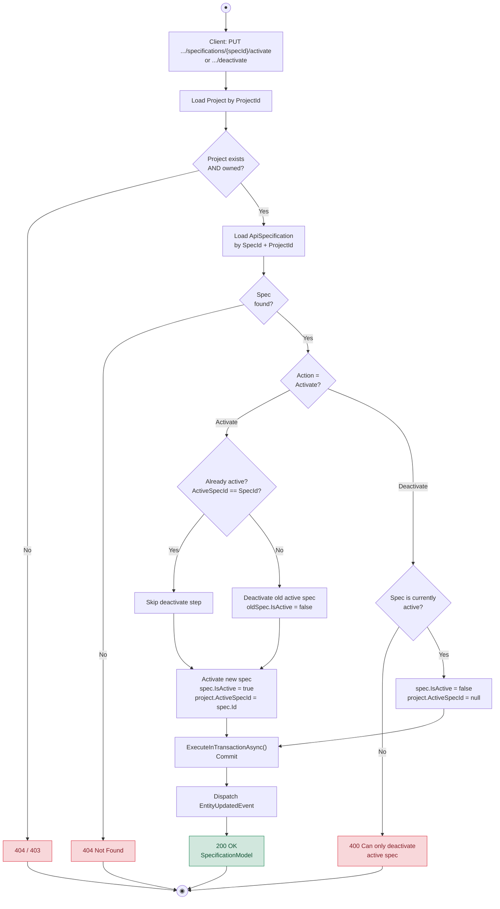
```mermaid
flowchart TD
    Start((●)) --> A1["Client: PUT .../specifications/{specId}/activate<br/>or .../deactivate"]

    A1 --> A2["Load Project by ProjectId"]
    A2 --> D1{"Project exists<br/>AND owned?"}
    D1 -->|No| Err1["404 / 403"]

    D1 -->|Yes| A3["Load ApiSpecification<br/>by SpecId + ProjectId"]
    A3 --> D2{"Spec<br/>found?"}
    D2 -->|No| Err2["404 Not Found"]

    D2 -->|Yes| D3{"Action =<br/>Activate?"}

    D3 -->|"Activate"| D4{"Already active?<br/>ActiveSpecId == SpecId?"}
    D4 -->|Yes| A4_skip["Skip deactivate step"]
    D4 -->|No| A4["Deactivate old active spec<br/>oldSpec.IsActive = false"]
    A4 --> A5["Activate new spec<br/>spec.IsActive = true<br/>project.ActiveSpecId = spec.Id"]
    A4_skip --> A5

    D3 -->|"Deactivate"| D5{"Spec is currently<br/>active?"}
    D5 -->|No| Err3["400 Can only deactivate<br/>active spec"]
    D5 -->|Yes| A6["spec.IsActive = false<br/>project.ActiveSpecId = null"]

    A5 --> A7["ExecuteInTransactionAsync()<br/>Commit"]
    A6 --> A7
    A7 --> A8["Dispatch EntityUpdatedEvent"]
    A8 --> A9["200 OK<br/>SpecificationModel"]

    Err1 --> End1((◉))
    Err2 --> End1
    Err3 --> End1
    A9 --> End1

    classDef error fill:#f8d7da,stroke:#dc3545,color:#842029
    classDef success fill:#d1e7dd,stroke:#198754,color:#0f5132
    class Err1,Err2,Err3 error
    class A9 success
```

---

### FE-03-AD-06: Delete Specification (Cascade)

**Module:** `ClassifiedAds.Modules.ApiDocumentation`
**Entry:** `SpecificationsController.Delete()` → `DELETE /api/projects/{projectId}/specifications/{specId}`

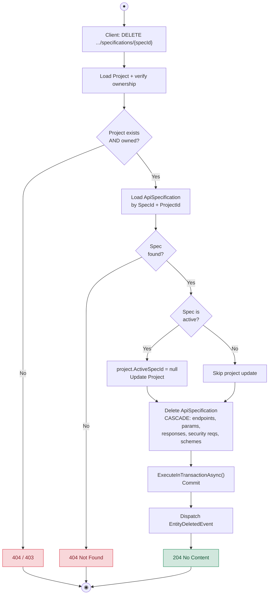
```mermaid
flowchart TD
    Start((●)) --> A1["Client: DELETE .../specifications/{specId}"]

    A1 --> A2["Load Project + verify ownership"]
    A2 --> D1{"Project exists<br/>AND owned?"}
    D1 -->|No| Err1["404 / 403"]

    D1 -->|Yes| A3["Load ApiSpecification<br/>by SpecId + ProjectId"]
    A3 --> D2{"Spec<br/>found?"}
    D2 -->|No| Err2["404 Not Found"]

    D2 -->|Yes| D3{"Spec is<br/>active?"}
    D3 -->|Yes| A4["project.ActiveSpecId = null<br/>Update Project"]
    D3 -->|No| A5["Skip project update"]

    A4 --> A6["Delete ApiSpecification<br/>CASCADE: endpoints, params,<br/>responses, security reqs, schemes"]
    A5 --> A6

    A6 --> A7["ExecuteInTransactionAsync()<br/>Commit"]
    A7 --> A8["Dispatch EntityDeletedEvent"]
    A8 --> A9["204 No Content"]

    Err1 --> End1((◉))
    Err2 --> End1
    A9 --> End1

    classDef error fill:#f8d7da,stroke:#dc3545,color:#842029
    classDef success fill:#d1e7dd,stroke:#198754,color:#0f5132
    class Err1,Err2 error
    class A9 success
```

---

### FE-03-AD-07: Project Management (Create / Archive / Delete)

**Module:** `ClassifiedAds.Modules.ApiDocumentation`
**Entry:** `ProjectsController.Post()` / `Archive()` / `Delete()`

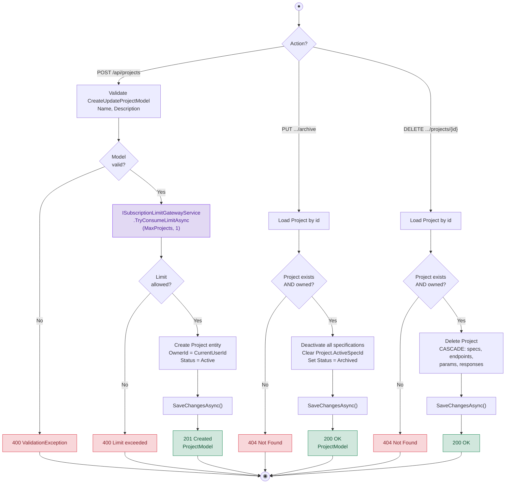
```mermaid
flowchart TD
    Start((●)) --> D0{"Action?"}

    D0 -->|"POST /api/projects"| A1["Validate CreateUpdateProjectModel<br/>Name, Description"]
    A1 --> D1{"Model<br/>valid?"}
    D1 -->|No| Err1["400 ValidationException"]
    D1 -->|Yes| A2["ISubscriptionLimitGatewayService<br/>.TryConsumeLimitAsync<br/>(MaxProjects, 1)"]
    A2 --> D2{"Limit<br/>allowed?"}
    D2 -->|No| Err2["400 Limit exceeded"]
    D2 -->|Yes| A3["Create Project entity<br/>OwnerId = CurrentUserId<br/>Status = Active"]
    A3 --> A4["SaveChangesAsync()"]
    A4 --> A5["201 Created<br/>ProjectModel"]

    D0 -->|"PUT .../archive"| A6["Load Project by id"]
    A6 --> D3{"Project exists<br/>AND owned?"}
    D3 -->|No| Err3["404 Not Found"]
    D3 -->|Yes| A7["Deactivate all specifications<br/>Clear Project.ActiveSpecId<br/>Set Status = Archived"]
    A7 --> A8["SaveChangesAsync()"]
    A8 --> A9["200 OK<br/>ProjectModel"]

    D0 -->|"DELETE .../projects/{id}"| A10["Load Project by id"]
    A10 --> D4{"Project exists<br/>AND owned?"}
    D4 -->|No| Err4["404 Not Found"]
    D4 -->|Yes| A11["Delete Project<br/>CASCADE: specs, endpoints,<br/>params, responses"]
    A11 --> A12["SaveChangesAsync()"]
    A12 --> A13["200 OK"]

    Err1 --> End1((◉))
    Err2 --> End1
    Err3 --> End1
    Err4 --> End1
    A5 --> End1
    A9 --> End1
    A13 --> End1

    classDef error fill:#f8d7da,stroke:#dc3545,color:#842029
    classDef success fill:#d1e7dd,stroke:#198754,color:#0f5132
    classDef crossModule fill:#e2d9f3,stroke:#7c3aed,color:#4c1d95
    class Err1,Err2,Err3,Err4 error
    class A5,A9,A13 success
    class A2 crossModule
```

---

## FE-04 — Test Scope & Execution Configuration

### FE-04-AD-01: Create / Update Test Suite Scope

**Module:** `ClassifiedAds.Modules.TestGeneration`
**Entry:** `TestSuitesController.Create()` / `Update()`

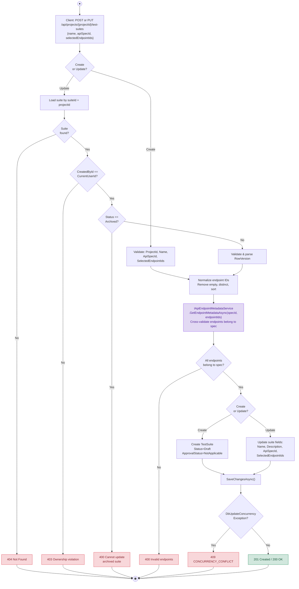
```mermaid
flowchart TD
    Start((●)) --> A1["Client: POST or PUT<br/>/api/projects/{projectId}/test-suites<br/>{name, apiSpecId, selectedEndpointIds}"]

    A1 --> D0{"Create<br/>or Update?"}

    D0 -->|Create| A2["Validate: ProjectId, Name,<br/>ApiSpecId, SelectedEndpointIds"]
    D0 -->|Update| A2b["Load suite by suiteId + projectId"]

    A2b --> D1b{"Suite<br/>found?"}
    D1b -->|No| Err1["404 Not Found"]
    D1b -->|Yes| D2b{"CreatedById ==<br/>CurrentUserId?"}
    D2b -->|No| Err2["403 Ownership violation"]
    D2b -->|Yes| D3b{"Status ==<br/>Archived?"}
    D3b -->|Yes| Err3["400 Cannot update<br/>archived suite"]
    D3b -->|No| A2c["Validate & parse RowVersion"]

    A2 --> A3["Normalize endpoint IDs<br/>Remove empty, distinct, sort"]
    A2c --> A3

    A3 --> A4["IApiEndpointMetadataService<br/>.GetEndpointMetadataAsync(specId, endpointIds)<br/>Cross-validate endpoints belong to spec"]
    A4 --> D4{"All endpoints<br/>belong to spec?"}
    D4 -->|No| Err4["400 Invalid endpoints"]

    D4 -->|Yes| D5{"Create<br/>or Update?"}
    D5 -->|Create| A5["Create TestSuite<br/>Status=Draft<br/>ApprovalStatus=NotApplicable"]
    D5 -->|Update| A6["Update suite fields:<br/>Name, Description, ApiSpecId,<br/>SelectedEndpointIds"]

    A5 --> A7["SaveChangesAsync()"]
    A6 --> A7

    A7 --> D6{"DbUpdateConcurrency<br/>Exception?"}
    D6 -->|Yes| Err5["409 CONCURRENCY_CONFLICT"]
    D6 -->|No| A8["201 Created / 200 OK"]

    Err1 --> End1((◉))
    Err2 --> End1
    Err3 --> End1
    Err4 --> End1
    Err5 --> End1
    A8 --> End1

    classDef error fill:#f8d7da,stroke:#dc3545,color:#842029
    classDef success fill:#d1e7dd,stroke:#198754,color:#0f5132
    classDef crossModule fill:#e2d9f3,stroke:#7c3aed,color:#4c1d95
    class Err1,Err2,Err3,Err4,Err5 error
    class A8 success
    class A4 crossModule
```

---

### FE-04-AD-02: Create / Update Execution Environment

**Module:** `ClassifiedAds.Modules.TestExecution`
**Entry:** `ExecutionEnvironmentsController.Create()` / `Update()`

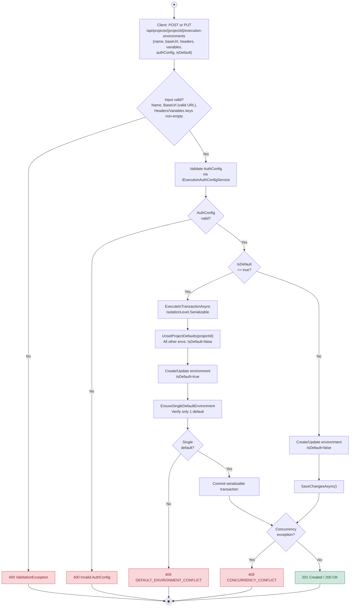
```mermaid
flowchart TD
    Start((●)) --> A1["Client: POST or PUT<br/>/api/projects/{projectId}/execution-environments<br/>{name, baseUrl, headers, variables,<br/>authConfig, isDefault}"]

    A1 --> D1{"Input valid?<br/>Name, BaseUrl (valid URL),<br/>Headers/Variables keys non-empty"}
    D1 -->|No| Err1["400 ValidationException"]

    D1 -->|Yes| A2["Validate AuthConfig<br/>via IExecutionAuthConfigService"]
    A2 --> D2{"AuthConfig<br/>valid?"}
    D2 -->|No| Err2["400 Invalid AuthConfig"]

    D2 -->|Yes| D3{"IsDefault<br/>== true?"}

    D3 -->|Yes| A3["ExecuteInTransactionAsync<br/>IsolationLevel.Serializable"]
    A3 --> A4["UnsetProjectDefaults(projectId)<br/>All other envs: IsDefault=false"]
    A4 --> A5["Create/Update environment<br/>IsDefault=true"]
    A5 --> A6["EnsureSingleDefaultEnvironment<br/>Verify only 1 default"]
    A6 --> D4{"Single<br/>default?"}
    D4 -->|No| Err3["409 DEFAULT_ENVIRONMENT_CONFLICT"]
    D4 -->|Yes| A7["Commit serializable transaction"]

    D3 -->|No| A5b["Create/Update environment<br/>IsDefault=false"]
    A5b --> A7b["SaveChangesAsync()"]

    A7 --> D5{"Concurrency<br/>exception?"}
    A7b --> D5
    D5 -->|Yes| Err4["409 CONCURRENCY_CONFLICT"]
    D5 -->|No| A8["201 Created / 200 OK"]

    Err1 --> End1((◉))
    Err2 --> End1
    Err3 --> End1
    Err4 --> End1
    A8 --> End1

    classDef error fill:#f8d7da,stroke:#dc3545,color:#842029
    classDef success fill:#d1e7dd,stroke:#198754,color:#0f5132
    class Err1,Err2,Err3,Err4 error
    class A8 success
```

---

## FE-05A — API Test Order Proposal

### FE-05A-AD-01: Propose Test Order

**Module:** `ClassifiedAds.Modules.TestGeneration`
**Entry:** `TestOrderController.Propose()` → `POST /api/test-suites/{suiteId}/order-proposals`

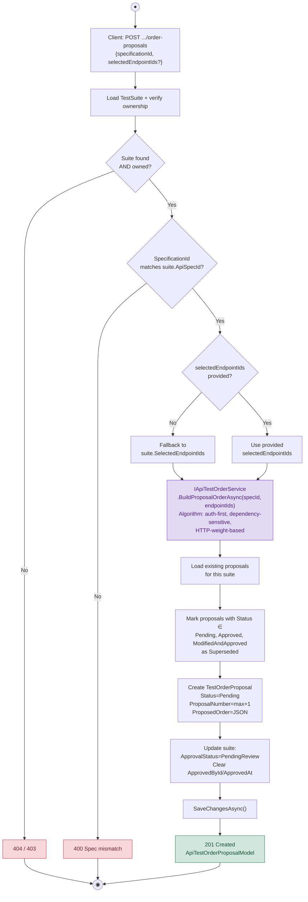
```mermaid
flowchart TD
    Start((●)) --> A1["Client: POST .../order-proposals<br/>{specificationId, selectedEndpointIds?}"]

    A1 --> A2["Load TestSuite + verify ownership"]
    A2 --> D1{"Suite found<br/>AND owned?"}
    D1 -->|No| Err1["404 / 403"]

    D1 -->|Yes| D2{"SpecificationId<br/>matches suite.ApiSpecId?"}
    D2 -->|No| Err2["400 Spec mismatch"]

    D2 -->|Yes| D3{"selectedEndpointIds<br/>provided?"}
    D3 -->|No| A3["Fallback to<br/>suite.SelectedEndpointIds"]
    D3 -->|Yes| A3b["Use provided<br/>selectedEndpointIds"]

    A3 --> A4["IApiTestOrderService<br/>.BuildProposalOrderAsync(specId, endpointIds)<br/>Algorithm: auth-first, dependency-sensitive,<br/>HTTP-weight-based"]
    A3b --> A4

    A4 --> A5["Load existing proposals<br/>for this suite"]
    A5 --> A6["Mark proposals with Status ∈<br/>Pending, Approved, ModifiedAndApproved<br/>as Superseded"]
    A6 --> A7["Create TestOrderProposal<br/>Status=Pending<br/>ProposalNumber=max+1<br/>ProposedOrder=JSON"]
    A7 --> A8["Update suite:<br/>ApprovalStatus=PendingReview<br/>Clear ApprovedById/ApprovedAt"]
    A8 --> A9["SaveChangesAsync()"]
    A9 --> A10["201 Created<br/>ApiTestOrderProposalModel"]

    Err1 --> End1((◉))
    Err2 --> End1
    A10 --> End1

    classDef error fill:#f8d7da,stroke:#dc3545,color:#842029
    classDef success fill:#d1e7dd,stroke:#198754,color:#0f5132
    classDef crossModule fill:#e2d9f3,stroke:#7c3aed,color:#4c1d95
    class Err1,Err2 error
    class A10 success
    class A4 crossModule
```

---

### FE-05A-AD-02: Approve / Reject Test Order

**Module:** `ClassifiedAds.Modules.TestGeneration`
**Entry:** `TestOrderController.Approve()` / `Reject()`

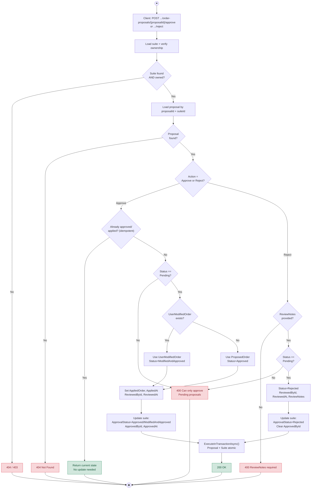
```mermaid
flowchart TD
    Start((●)) --> A1["Client: POST .../order-proposals/{proposalId}/approve<br/>or .../reject"]

    A1 --> A2["Load suite + verify ownership"]
    A2 --> D1{"Suite found<br/>AND owned?"}
    D1 -->|No| Err1["404 / 403"]

    D1 -->|Yes| A3["Load proposal by proposalId + suiteId"]
    A3 --> D2{"Proposal<br/>found?"}
    D2 -->|No| Err2["404 Not Found"]

    D2 -->|Yes| D3{"Action =<br/>Approve or Reject?"}

    D3 -->|Approve| D4{"Already approved/<br/>applied? (idempotent)"}
    D4 -->|Yes| A4_skip["Return current state<br/>No update needed"]

    D4 -->|No| D5{"Status ==<br/>Pending?"}
    D5 -->|No| Err3["400 Can only approve<br/>Pending proposals"]
    D5 -->|Yes| D6{"UserModifiedOrder<br/>exists?"}
    D6 -->|Yes| A5["Use UserModifiedOrder<br/>Status=ModifiedAndApproved"]
    D6 -->|No| A5b["Use ProposedOrder<br/>Status=Approved"]

    A5 --> A6["Set AppliedOrder, AppliedAt<br/>ReviewedById, ReviewedAt"]
    A5b --> A6
    A6 --> A7["Update suite:<br/>ApprovalStatus=Approved/ModifiedAndApproved<br/>ApprovedById, ApprovedAt"]

    D3 -->|Reject| D7{"ReviewNotes<br/>provided?"}
    D7 -->|No| Err4["400 ReviewNotes required"]
    D7 -->|Yes| D8{"Status ==<br/>Pending?"}
    D8 -->|No| Err3
    D8 -->|Yes| A8["Status=Rejected<br/>ReviewedById, ReviewedAt, ReviewNotes"]
    A8 --> A9["Update suite:<br/>ApprovalStatus=Rejected<br/>Clear ApprovedById"]

    A7 --> A10["ExecuteInTransactionAsync()<br/>Proposal + Suite atomic"]
    A9 --> A10
    A10 --> A11["200 OK"]

    Err1 --> End1((◉))
    Err2 --> End1
    Err3 --> End1
    Err4 --> End1
    A4_skip --> End1
    A11 --> End1

    classDef error fill:#f8d7da,stroke:#dc3545,color:#842029
    classDef success fill:#d1e7dd,stroke:#198754,color:#0f5132
    class Err1,Err2,Err3,Err4 error
    class A11,A4_skip success
```

---

## FE-12 — Path Parameter Templating

### FE-12-AD-01: Resolve URL & Generate Mutations

**Module:** `ClassifiedAds.Modules.ApiDocumentation`
**Entry:** `EndpointsController.GetResolvedUrl()` / `GetPathParamMutations()`

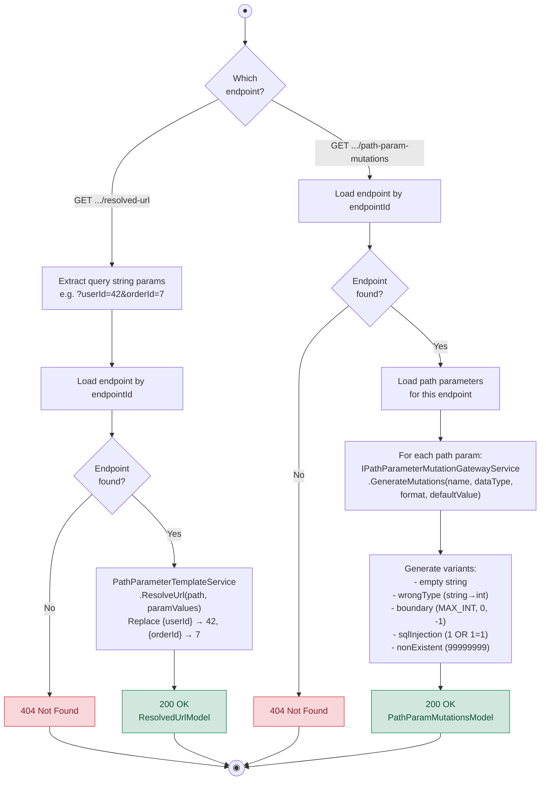
```mermaid
flowchart TD
    Start((●)) --> D0{"Which<br/>endpoint?"}

    D0 -->|"GET .../resolved-url"| A1["Extract query string params<br/>e.g. ?userId=42&orderId=7"]
    A1 --> A2["Load endpoint by endpointId"]
    A2 --> D1{"Endpoint<br/>found?"}
    D1 -->|No| Err1["404 Not Found"]
    D1 -->|Yes| A3["PathParameterTemplateService<br/>.ResolveUrl(path, paramValues)<br/>Replace {userId} → 42, {orderId} → 7"]
    A3 --> A4["200 OK<br/>ResolvedUrlModel"]

    D0 -->|"GET .../path-param-mutations"| B1["Load endpoint by endpointId"]
    B1 --> D2{"Endpoint<br/>found?"}
    D2 -->|No| Err2["404 Not Found"]
    D2 -->|Yes| B2["Load path parameters<br/>for this endpoint"]
    B2 --> B3["For each path param:<br/>IPathParameterMutationGatewayService<br/>.GenerateMutations(name, dataType,<br/>format, defaultValue)"]
    B3 --> B4["Generate variants:<br/>- empty string<br/>- wrongType (string→int)<br/>- boundary (MAX_INT, 0, -1)<br/>- sqlInjection (1 OR 1=1)<br/>- nonExistent (99999999)"]
    B4 --> B5["200 OK<br/>PathParamMutationsModel"]

    Err1 --> End1((◉))
    Err2 --> End1
    A4 --> End1
    B5 --> End1

    classDef error fill:#f8d7da,stroke:#dc3545,color:#842029
    classDef success fill:#d1e7dd,stroke:#198754,color:#0f5132
    class Err1,Err2 error
    class A4,B5 success
```

---

## FE-14 — Subscription & Billing

### FE-14-AD-01: Subscribe to Plan

**Module:** `ClassifiedAds.Modules.Subscription`
**Entry:** `PaymentsController.Subscribe()` → `POST /api/payments/subscribe/{planId}`

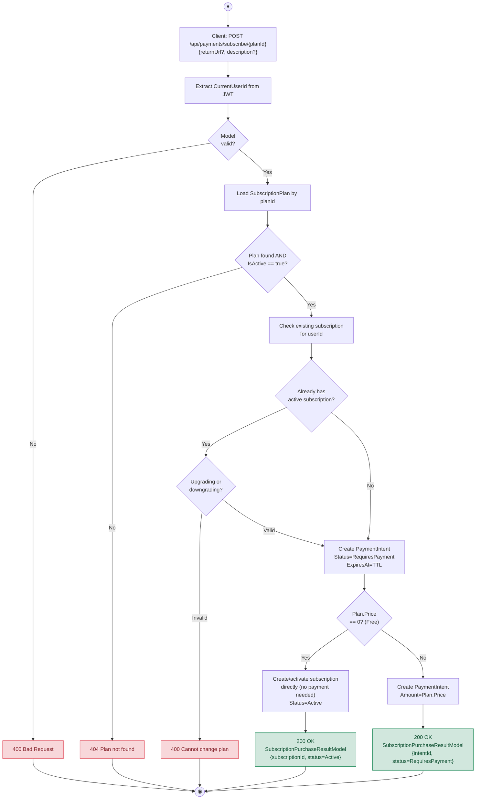
```mermaid
flowchart TD
    Start((●)) --> A1["Client: POST /api/payments/subscribe/{planId}<br/>{returnUrl?, description?}"]

    A1 --> A2["Extract CurrentUserId from JWT"]
    A2 --> D1{"Model<br/>valid?"}
    D1 -->|No| Err1["400 Bad Request"]

    D1 -->|Yes| A3["Load SubscriptionPlan by planId"]
    A3 --> D2{"Plan found AND<br/>IsActive == true?"}
    D2 -->|No| Err2["404 Plan not found"]

    D2 -->|Yes| A4["Check existing subscription<br/>for userId"]
    A4 --> D3{"Already has<br/>active subscription?"}
    D3 -->|Yes| D4{"Upgrading or<br/>downgrading?"}
    D4 -->|Invalid| Err3["400 Cannot change plan"]

    D3 -->|No| A5["Create PaymentIntent<br/>Status=RequiresPayment<br/>ExpiresAt=TTL"]
    D4 -->|Valid| A5

    A5 --> D5{"Plan.Price<br/>== 0? (Free)"}
    D5 -->|Yes| A6["Create/activate subscription<br/>directly (no payment needed)<br/>Status=Active"]
    D5 -->|No| A7["Create PaymentIntent<br/>Amount=Plan.Price"]

    A6 --> A8["200 OK<br/>SubscriptionPurchaseResultModel<br/>{subscriptionId, status=Active}"]
    A7 --> A9["200 OK<br/>SubscriptionPurchaseResultModel<br/>{intentId, status=RequiresPayment}"]

    Err1 --> End1((◉))
    Err2 --> End1
    Err3 --> End1
    A8 --> End1
    A9 --> End1

    classDef error fill:#f8d7da,stroke:#dc3545,color:#842029
    classDef success fill:#d1e7dd,stroke:#198754,color:#0f5132
    class Err1,Err2,Err3 error
    class A8,A9 success
```

---

### FE-14-AD-02: PayOS Checkout & Payment

**Module:** `ClassifiedAds.Modules.Subscription`
**Entry:** `PaymentsController.CreatePayOsCheckout()` → `POST /api/payments/payos/create`

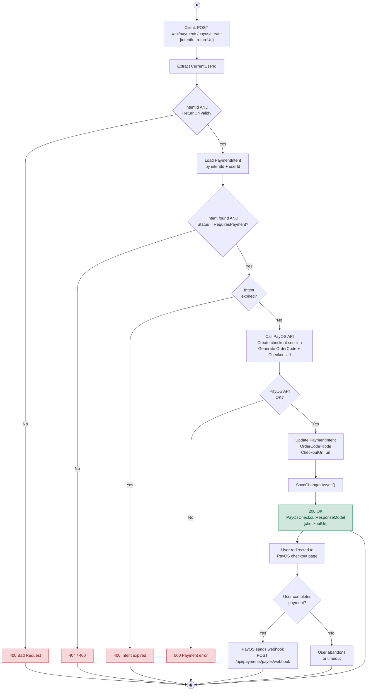
```mermaid
flowchart TD
    Start((●)) --> A1["Client: POST /api/payments/payos/create<br/>{intentId, returnUrl}"]

    A1 --> A2["Extract CurrentUserId"]
    A2 --> D1{"IntentId AND<br/>ReturnUrl valid?"}
    D1 -->|No| Err1["400 Bad Request"]

    D1 -->|Yes| A3["Load PaymentIntent<br/>by intentId + userId"]
    A3 --> D2{"Intent found AND<br/>Status==RequiresPayment?"}
    D2 -->|No| Err2["404 / 400"]

    D2 -->|Yes| D3{"Intent<br/>expired?"}
    D3 -->|Yes| Err3["400 Intent expired"]

    D3 -->|No| A4["Call PayOS API<br/>Create checkout session<br/>Generate OrderCode + CheckoutUrl"]
    A4 --> D4{"PayOS API<br/>OK?"}
    D4 -->|No| Err4["500 Payment error"]

    D4 -->|Yes| A5["Update PaymentIntent<br/>OrderCode=code<br/>CheckoutUrl=url"]
    A5 --> A6["SaveChangesAsync()"]
    A6 --> A7["200 OK<br/>PayOsCheckoutResponseModel<br/>{checkoutUrl}"]

    A7 --> A8["User redirected to<br/>PayOS checkout page"]
    A8 --> D5{"User completes<br/>payment?"}
    D5 -->|Yes| A9["PayOS sends webhook<br/>POST /api/payments/payos/webhook"]
    D5 -->|No| A10["User abandons<br/>or timeout"]

    Err1 --> End1((◉))
    Err2 --> End1
    Err3 --> End1
    Err4 --> End1
    A9 --> End1
    A10 --> End1
    A7 --> End1

    classDef error fill:#f8d7da,stroke:#dc3545,color:#842029
    classDef success fill:#d1e7dd,stroke:#198754,color:#0f5132
    class Err1,Err2,Err3,Err4 error
    class A7 success
```

---

### FE-14-AD-03: PayOS Webhook Processing

**Module:** `ClassifiedAds.Modules.Subscription`
**Entry:** `PaymentsController.PayOsWebhook()` → `POST /api/payments/payos/webhook` (AllowAnonymous)

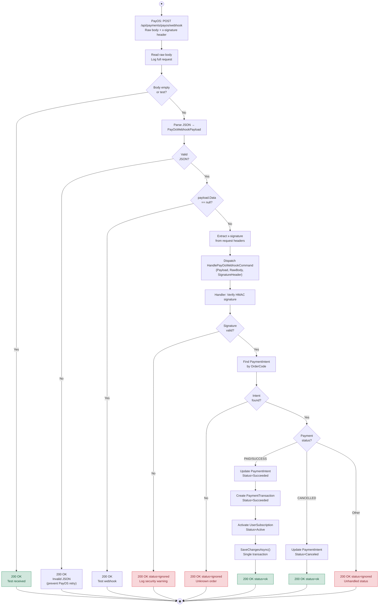
```mermaid
flowchart TD
    Start((●)) --> A1["PayOS: POST /api/payments/payos/webhook<br/>Raw body + x-signature header"]

    A1 --> A2["Read raw body<br/>Log full request"]
    A2 --> D1{"Body empty<br/>or test?"}
    D1 -->|Yes| A3["200 OK<br/>Test received"]

    D1 -->|No| A4["Parse JSON →<br/>PayOsWebhookPayload"]
    A4 --> D2{"Valid<br/>JSON?"}
    D2 -->|No| A5["200 OK<br/>Invalid JSON<br/>(prevent PayOS retry)"]

    D2 -->|Yes| D3{"payload.Data<br/>== null?"}
    D3 -->|Yes| A6["200 OK<br/>Test webhook"]

    D3 -->|No| A7["Extract x-signature<br/>from request headers"]
    A7 --> A8["Dispatch HandlePayOsWebhookCommand<br/>{Payload, RawBody, SignatureHeader}"]

    A8 --> A9["Handler: Verify HMAC signature"]
    A9 --> D4{"Signature<br/>valid?"}
    D4 -->|No| A10["200 OK status=ignored<br/>Log security warning"]

    D4 -->|Yes| A11["Find PaymentIntent<br/>by OrderCode"]
    A11 --> D5{"Intent<br/>found?"}
    D5 -->|No| A12["200 OK status=ignored<br/>Unknown order"]

    D5 -->|Yes| D6{"Payment<br/>status?"}
    D6 -->|PAID/SUCCESS| A13["Update PaymentIntent<br/>Status=Succeeded"]
    A13 --> A14["Create PaymentTransaction<br/>Status=Succeeded"]
    A14 --> A15["Activate UserSubscription<br/>Status=Active"]
    A15 --> A16["SaveChangesAsync()<br/>Single transaction"]
    A16 --> A17["200 OK status=ok"]

    D6 -->|CANCELLED| A18["Update PaymentIntent<br/>Status=Canceled"]
    A18 --> A19["200 OK status=ok"]

    D6 -->|Other| A20["200 OK status=ignored<br/>Unhandled status"]

    A3 --> End1((◉))
    A5 --> End1
    A6 --> End1
    A10 --> End1
    A12 --> End1
    A17 --> End1
    A19 --> End1
    A20 --> End1

    classDef error fill:#f8d7da,stroke:#dc3545,color:#842029
    classDef success fill:#d1e7dd,stroke:#198754,color:#0f5132
    class A10,A12,A20 error
    class A17,A19,A3 success
```

**Key Design:** Always return 200 to PayOS to prevent unnecessary retries. All error handling is internal.

---

### FE-14-AD-04: Atomic Limit Consumption

**Module:** `ClassifiedAds.Modules.Subscription`
**Entry:** `ISubscriptionLimitGatewayService.TryConsumeLimitAsync()` → `ConsumeLimitAtomicallyCommandHandler`

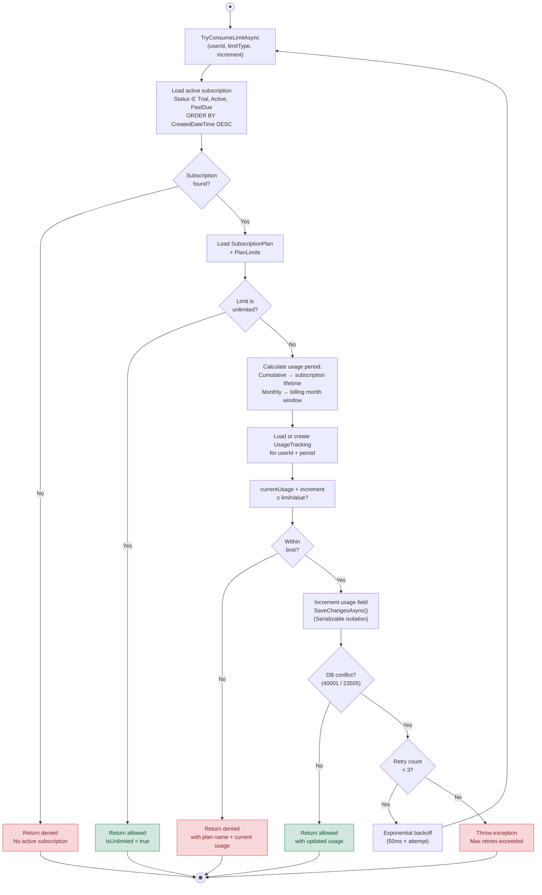
```mermaid
flowchart TD
    Start((●)) --> A1["TryConsumeLimitAsync<br/>(userId, limitType, increment)"]

    A1 --> A2["Load active subscription<br/>Status ∈ Trial, Active, PastDue<br/>ORDER BY CreatedDateTime DESC"]
    A2 --> D1{"Subscription<br/>found?"}
    D1 -->|No| Err1["Return denied<br/>No active subscription"]

    D1 -->|Yes| A3["Load SubscriptionPlan<br/>+ PlanLimits"]
    A3 --> D2{"Limit is<br/>unlimited?"}
    D2 -->|Yes| A4["Return allowed<br/>IsUnlimited = true"]

    D2 -->|No| A5["Calculate usage period:<br/>Cumulative → subscription lifetime<br/>Monthly → billing month window"]
    A5 --> A6["Load or create UsageTracking<br/>for userId + period"]
    A6 --> A7["currentUsage + increment<br/>≤ limitValue?"]
    A7 --> D3{"Within<br/>limit?"}
    D3 -->|No| Err2["Return denied<br/>with plan name + current usage"]

    D3 -->|Yes| A8["Increment usage field<br/>SaveChangesAsync()<br/>(Serializable isolation)"]
    A8 --> D4{"DB conflict?<br/>(40001 / 23505)"}
    D4 -->|No| A9["Return allowed<br/>with updated usage"]
    D4 -->|Yes| D5{"Retry count<br/>< 3?"}
    D5 -->|Yes| A10["Exponential backoff<br/>(50ms × attempt)"]
    A10 --> A1
    D5 -->|No| Err3["Throw exception<br/>Max retries exceeded"]

    Err1 --> End1((◉))
    Err2 --> End1
    Err3 --> End1
    A4 --> End1
    A9 --> End1

    classDef error fill:#f8d7da,stroke:#dc3545,color:#842029
    classDef success fill:#d1e7dd,stroke:#198754,color:#0f5132
    class Err1,Err2,Err3 error
    class A4,A9 success
```

---

## Storage — File Management

### Storage-AD-01: File Upload & Download

**Module:** `ClassifiedAds.Modules.Storage`
**Entry:** `FilesController.Upload()` / `Download()`

```mermaid
flowchart TD
    Start((●)) --> D0{"Action?"}

    D0 -->|"POST /api/files<br/>multipart/form-data"| A1["Create FileEntry entity<br/>Name, Size, FileName,<br/>UploadedTime"]
    A1 --> A2["Save FileEntry to DB<br/>(get generated Id)"]
    A2 --> A3["Calculate FileLocation<br/>yyyy/MM/dd/{Id}"]
    A3 --> D1{"Encrypted<br/>== true?"}

    D1 -->|Yes| A4["Generate AES key (32 bytes)<br/>Generate IV (16 bytes)"]
    A4 --> A5["Encrypt file with AES-CBC-PKCS7"]
    A5 --> A6["Upload encrypted bytes<br/>to IFileStorageManager"]
    A6 --> A7["Encrypt key with MasterEncryptionKey<br/>Store EncryptionKey + IV on entity"]

    D1 -->|No| A8["Upload raw file bytes<br/>to IFileStorageManager"]

    A7 --> A9["Update FileEntry<br/>SaveChangesAsync()"]
    A8 --> A9
    A9 --> A10["200 OK<br/>FileEntryModel"]

    D0 -->|"GET /api/files/{id}/download"| B1["Load FileEntry by id"]
    B1 --> D2{"File<br/>found?"}
    D2 -->|No| Err1["404 Not Found"]
    D2 -->|Yes| B2["AuthorizeAsync<br/>(User, fileEntry, Operations.Read)"]
    B2 --> D3{"Authorized?"}
    D3 -->|No| Err2["403 Forbidden"]
    D3 -->|Yes| B3["Read raw bytes from<br/>IFileStorageManager"]
    B3 --> D4{"File<br/>encrypted?"}
    D4 -->|Yes| B4["Decrypt key with MasterEncryptionKey<br/>Decrypt file with AES-CBC-PKCS7"]
    D4 -->|No| B5["Use raw bytes"]
    B4 --> B6["Return File(content,<br/>application/octet-stream, fileName)"]
    B5 --> B6

    Err1 --> End1((◉))
    Err2 --> End1
    A10 --> End1
    B6 --> End1

    classDef error fill:#f8d7da,stroke:#dc3545,color:#842029
    classDef success fill:#d1e7dd,stroke:#198754,color:#0f5132
    class Err1,Err2 error
    class A10,B6 success
```

---

## Notification — Email Sending

### Notification-AD-01: Email Notification Sending

**Module:** `ClassifiedAds.Modules.Notification`
**Entry:** `EmailMessageService.CreateEmailMessageAsync()` + `SendEmailWorker` (BackgroundService)

```mermaid
flowchart TD
    Start((●)) --> A1["CreateEmailMessageAsync(DTO)<br/>From, Tos, CCs, Subject, Body"]
    A1 --> A2["Create EmailMessage entity<br/>Persist to DB via CrudService"]
    A2 --> A3["Enqueue to Channel<br/>EmailQueueItem{Id, Attempt=1}"]
    A3 --> D1{"Channel<br/>open?"}
    D1 -->|No| A4["Log warning<br/>DB sweep will recover"]
    D1 -->|Yes| A5["Message enqueued<br/>Return to caller"]

    A4 --> End1((◉))
    A5 --> End1

    Start2((●)) --> B1["SendEmailWorker starts<br/>BackgroundService.ExecuteAsync"]
    B1 --> B2["Create DI scope<br/>Dispatch SendEmailMessagesCommand"]
    B2 --> B3["Load unsent emails<br/>WHERE SentDateTime == null<br/>AND ExpiredDateTime == null"]
    B3 --> D2{"Messages<br/>found?"}
    D2 -->|No| B4["Sleep 10 seconds"]
    B4 --> B2
    D2 -->|Yes| B5["For each message:<br/>Send via email provider"]
    B5 --> D3{"Send<br/>OK?"}
    D3 -->|Yes| B6["Set SentDateTime = UtcNow"]
    D3 -->|No| D4{"AttemptCount<br/>< MaxAttempts?"}
    D4 -->|Yes| B7["Calculate NextAttemptDateTime<br/>Fibonacci backoff:<br/>1,2,3,5,8,13,21,34,55,89 min"]
    B7 --> B8["Increment AttemptCount"]
    D4 -->|No| B9["Set ExpiredDateTime<br/>(dead letter)"]
    B6 --> B2
    B8 --> B2
    B9 --> B2

    classDef success fill:#d1e7dd,stroke:#198754,color:#0f5132
    classDef error fill:#f8d7da,stroke:#dc3545,color:#842029
    class B6 success
    class B9 error
```

**Retry Strategy:** Fibonacci backoff sequence (1, 2, 3, 5, 8, 13, 21, 34, 55, 89 minutes). MaxAttemptCount = 10.

---

## Planned Activity Diagrams

> Các activity diagram dưới đây được thiết kế từ feature specification documents. Code chưa được implement đầy đủ nhưng architecture và flow đã xác định.

---

## FE-05B — Happy-Path Test Case Generation (Planned)

### FE-05B-AD-01: Generate Happy-Path Test Cases

**Module:** `ClassifiedAds.Modules.TestGeneration`
**Entry:** `TestCasesController.GenerateHappyPath()` → `POST /api/test-suites/{suiteId}/test-cases/generate-happy-path`

```mermaid
flowchart TD
    Start((●)) --> A1["Client: POST .../generate-happy-path<br/>{specificationId, forceRegenerate?}"]

    A1 --> A2["Load TestSuite + verify ownership"]
    A2 --> D1{"Suite found,<br/>owned, not Archived?"}
    D1 -->|No| Err1["404 / 403 / 400"]

    D1 -->|Yes| A3["IApiTestOrderGateService<br/>.RequireApprovedOrderAsync()"]
    A3 --> D2{"Gate<br/>passed?"}
    D2 -->|No| Err2["409 ORDER_CONFIRMATION_REQUIRED"]

    D2 -->|Yes| A4["Check existing happy-path<br/>test cases for this suite"]
    A4 --> D3{"Existing cases<br/>AND !forceRegenerate?"}
    D3 -->|Yes| Err3["400 Cases already exist<br/>Use forceRegenerate=true"]

    D3 -->|No| A5["CheckLimitAsync<br/>(MaxTestCasesPerSuite,<br/>approvedOrder.Count)"]
    A5 --> D4{"Limit<br/>OK?"}
    D4 -->|No| Err4["400 Subscription limit exceeded"]

    D4 -->|Yes| D5{"forceRegenerate<br/>== true?"}
    D5 -->|Yes| A6["Delete existing<br/>happy-path test cases"]
    D5 -->|No| A7["Skip delete"]

    A6 --> A8["IHappyPathTestCaseGenerator<br/>.GenerateAsync(suite, approvedOrder, specId)<br/>Invoke n8n → LLM pipeline"]
    A7 --> A8

    A8 --> A9["ExecuteInTransactionAsync:"]
    A9 --> A10["For each TestCase:<br/>Create TestCase + Request +<br/>Expectation + Variables +<br/>Dependencies + ChangeLog"]
    A10 --> A11["Create TestSuiteVersion snapshot"]
    A11 --> A12["Update suite:<br/>Status=Ready, Version++"]
    A12 --> A13["SaveChangesAsync()"]
    A13 --> A14["IncrementUsageAsync<br/>(MaxTestCasesPerSuite)"]
    A14 --> A15["201 Created<br/>GenerateHappyPathResultModel<br/>{totalCount, endpointsCovered,<br/>llmModel, tokensUsed}"]

    Err1 --> End1((◉))
    Err2 --> End1
    Err3 --> End1
    Err4 --> End1
    A15 --> End1

    classDef error fill:#f8d7da,stroke:#dc3545,color:#842029
    classDef success fill:#d1e7dd,stroke:#198754,color:#0f5132
    classDef crossModule fill:#e2d9f3,stroke:#7c3aed,color:#4c1d95
    class Err1,Err2,Err3,Err4 error
    class A15 success
    class A3,A5,A8,A14 crossModule
```

---

## FE-06 — Boundary & Negative Test Generation (Planned)

### FE-06-AD-01: Generate Boundary & Negative Test Cases

**Module:** `ClassifiedAds.Modules.TestGeneration`
**Entry:** `TestCasesController.GenerateBoundaryNegative()` → `POST /api/test-suites/{suiteId}/test-cases/generate-boundary-negative`

```mermaid
flowchart TD
    Start((●)) --> A1["Client: POST .../generate-boundary-negative<br/>{specId, includePathMutations?,<br/>includeBodyMutations?,<br/>includeLlmSuggestions?, forceRegenerate?}"]

    A1 --> D1{"At least 1 option<br/>enabled?"}
    D1 -->|No| Err1["400 Select at least<br/>one mutation type"]

    D1 -->|Yes| A2["Load suite + verify ownership"]
    A2 --> D2{"Suite OK?"}
    D2 -->|No| Err2["404 / 403 / 400"]

    D2 -->|Yes| A3["RequireApprovedOrderAsync()"]
    A3 --> D3{"Gate?"}
    D3 -->|No| Err3["409 ORDER_CONFIRMATION_REQUIRED"]

    D3 -->|Yes| A4["CheckLimitAsync<br/>(MaxTestCasesPerSuite)"]
    A4 --> D4{"Limit OK?"}
    D4 -->|No| Err4["400 Limit exceeded"]

    D4 -->|Yes| D5{"includeLlmSuggestions?"}
    D5 -->|Yes| A5["CheckLimitAsync<br/>(MaxLlmCallsPerMonth)"]
    A5 --> D6{"LLM limit OK?"}
    D6 -->|No| Err5["400 LLM limit exceeded"]
    D6 -->|Yes| A6["IBoundaryNegativeTestCaseGenerator<br/>.GenerateAsync(suite, order, specId, options)"]
    D5 -->|No| A6

    A6 --> A7["PIPE-01: Path Parameter Mutations<br/>Rule-based: empty, wrongType,<br/>boundary, sqlInjection, nonExistent"]
    A7 --> A8["PIPE-02: Body Mutations<br/>Rule-based: missing required fields,<br/>invalid types, boundary values"]
    A8 --> D7{"LLM<br/>enabled?"}
    D7 -->|Yes| A9["PIPE-03: LLM Scenario Suggestions<br/>Check cache first (TTL 24h)<br/>If miss → call n8n → LLM"]
    D7 -->|No| A10["Skip LLM pipeline"]

    A9 --> D8{"LLM<br/>OK?"}
    D8 -->|Yes| A11["Merge results from all pipelines"]
    D8 -->|No| A11b["Merge results without LLM<br/>Graceful degradation"]
    A10 --> A11

    A11 --> A12["ExecuteInTransactionAsync:<br/>Persist all test cases +<br/>metadata + suite version"]
    A11b --> A12

    A12 --> A13["IncrementUsageAsync<br/>(testCases + LLM calls)"]
    A13 --> A14["201 Created<br/>GenerateBoundaryNegativeResultModel<br/>{pathMutationCount, bodyMutationCount,<br/>llmSuggestionCount}"]

    Err1 --> End1((◉))
    Err2 --> End1
    Err3 --> End1
    Err4 --> End1
    Err5 --> End1
    A14 --> End1

    classDef error fill:#f8d7da,stroke:#dc3545,color:#842029
    classDef success fill:#d1e7dd,stroke:#198754,color:#0f5132
    classDef crossModule fill:#e2d9f3,stroke:#7c3aed,color:#4c1d95
    class Err1,Err2,Err3,Err4,Err5 error
    class A14 success
    class A3,A4,A5,A6,A9,A13 crossModule
```

---

## FE-07+08 — Test Execution & Validation (Planned)

### FE-07-AD-01: Execute Test Run

**Module:** `ClassifiedAds.Modules.TestExecution`
**Entry:** `POST /api/test-suites/{suiteId}/test-runs`

```mermaid
flowchart TD
    Start((●)) --> A1["Client: POST .../test-runs<br/>{environmentId, selectedTestCaseIds?}"]

    A1 --> A2["Load TestSuite + verify ownership"]
    A2 --> D1{"Suite Status<br/>== Ready?"}
    D1 -->|No| Err1["400 Suite not ready"]


    D1 -->|Yes| A3["Load ExecutionEnvironment<br/>by environmentId + projectId"]
    A3 --> D2{"Environment<br/>found?"}
    D2 -->|No| Err2["404 Environment not found"]

    D2 -->|Yes| A4["Create TestRun<br/>Status=Pending, RunNumber=next"]
    A4 --> A5["SaveChangesAsync()"]
    A5 --> A6["Start execution engine<br/>TestRun.Status=Running<br/>StartedAt=UtcNow"]

    A6 --> A7["For each test case<br/>in approved order:"]
    A7 --> A8["Build HTTP request<br/>from TestCaseRequest<br/>(method, url, headers, body)"]
    A8 --> A9["Resolve path parameters<br/>using environment variables"]
    A9 --> A10["Apply authentication<br/>from environment AuthConfig"]
    A10 --> A11["Execute HTTP call<br/>Record: statusCode, responseBody,<br/>headers, latency"]

    A11 --> A12["Validate response against<br/>TestCaseExpectation<br/>(status code, body schema,<br/>headers, response time)"]
    A12 --> D3{"Validation<br/>passed?"}
    D3 -->|Yes| A13["TestCaseResult.Status=Passed"]
    D3 -->|No| A14["TestCaseResult.Status=Failed<br/>Record failure reason"]

    A13 --> D4{"More test<br/>cases?"}
    A14 --> D4
    D4 -->|Yes| A7
    D4 -->|No| A15["Calculate summary:<br/>PassedCount, FailedCount,<br/>SkippedCount, Duration"]

    A15 --> D5{"FailedCount<br/>> 0?"}
    D5 -->|Yes| A16["TestRun.Status=Failed"]
    D5 -->|No| A17["TestRun.Status=Completed"]

    A16 --> A18["CompletedAt=UtcNow<br/>SaveChangesAsync()"]
    A17 --> A18
    A18 --> A19["200 OK<br/>TestRunResultModel"]

    Err1 --> End1((◉))
    Err2 --> End1
    A19 --> End1

    classDef error fill:#f8d7da,stroke:#dc3545,color:#842029
    classDef success fill:#d1e7dd,stroke:#198754,color:#0f5132
    class Err1,Err2 error
    class A19 success
```

---

## FE-09 — LLM Failure Explanations (Planned)

### FE-09-AD-01: Generate Failure Explanation via LLM

**Module:** `ClassifiedAds.Modules.LlmAssistant`
**Trigger:** Test case failure detected → async job

```mermaid
flowchart TD
    Start((●)) --> A1["Test failure detected<br/>Explanation request enqueued"]

    A1 --> A2["Worker picks up request<br/>Acquire Redis lock by fingerprint"]
    A2 --> D1{"Lock<br/>acquired?"}
    D1 -->|No| A3["Skip - another worker<br/>processing same request"]

    D1 -->|Yes| A4["ILlmAssistantGatewayService<br/>.GetCachedSuggestionsAsync<br/>(endpointId, type, cacheKey)"]
    A4 --> D2{"Cache<br/>hit?"}
    D2 -->|Yes| A5["Return cached explanation<br/>Skip LLM call"]

    D2 -->|No| A6["Build LLM prompt<br/>Include: test case, request,<br/>response, expected vs actual"]
    A6 --> A7["Call LLM API<br/>via n8n webhook"]
    A7 --> D3{"LLM response<br/>OK?"}

    D3 -->|Yes| A8["Parse explanation<br/>Extract: rootCause, suggestion,<br/>severity, category"]
    A8 --> A9["Cache result<br/>TTL=86400s (24h)"]
    A9 --> A10["Save LlmInteraction<br/>audit log"]
    A10 --> A11["Mark job completed"]

    D3 -->|"Transient error<br/>(timeout, rate-limit)"| D4{"Retry count<br/>< 3?"}
    D4 -->|Yes| A12["Exponential backoff<br/>2s → 6s → 18s"]
    A12 --> A7
    D4 -->|No| A13["Move to dead-letter queue"]

    D3 -->|"Non-retryable error<br/>(invalid payload)"| A14["Mark job failed<br/>Log error details"]

    A3 --> End1((◉))
    A5 --> End1
    A11 --> End1
    A13 --> End1
    A14 --> End1

    classDef error fill:#f8d7da,stroke:#dc3545,color:#842029
    classDef success fill:#d1e7dd,stroke:#198754,color:#0f5132
    classDef crossModule fill:#e2d9f3,stroke:#7c3aed,color:#4c1d95
    class A13,A14 error
    class A11,A5 success
    class A4,A7,A9,A10 crossModule
```

---

## FE-10 — Test Reporting & Export (Planned)

### FE-10-AD-01: Generate Test Report

**Module:** `ClassifiedAds.Modules.TestReporting`
**Entry:** `POST /api/test-runs/{runId}/reports`

```mermaid
flowchart TD
    Start((●)) --> A1["Client: POST .../test-runs/{runId}/reports<br/>{format: PDF|HTML|JSON, includeCharts?}"]

    A1 --> A2["Load TestRun by runId"]
    A2 --> D1{"Run found AND<br/>Status ∈ Completed, Failed?"}
    D1 -->|No| Err1["404 / 400<br/>Run not found or still running"]

    D1 -->|Yes| A3["Load test case results<br/>for this run"]
    A3 --> A4["Calculate metrics:<br/>Pass rate, failure distribution,<br/>avg response time, coverage"]

    A4 --> D2{"Include<br/>charts?"}
    D2 -->|Yes| A5["Generate chart data:<br/>Pass/fail pie chart,<br/>response time histogram,<br/>coverage bar chart"]
    D2 -->|No| A6["Skip charts"]

    A5 --> A7["Build report document<br/>in requested format"]
    A6 --> A7

    A7 --> D3{"Format?"}
    D3 -->|PDF| A8["Render PDF template<br/>Upload to Storage"]
    D3 -->|HTML| A9["Render HTML template"]
    D3 -->|JSON| A10["Serialize to JSON"]

    A8 --> A11["Create TestReport entity<br/>Link to StorageFileId"]
    A9 --> A11
    A10 --> A11

    A11 --> A12["SaveChangesAsync()"]
    A12 --> A13["201 Created<br/>TestReportModel<br/>{reportId, downloadUrl}"]

    Err1 --> End1((◉))
    A13 --> End1

    classDef error fill:#f8d7da,stroke:#dc3545,color:#842029
    classDef success fill:#d1e7dd,stroke:#198754,color:#0f5132
    class Err1 error
    class A13 success
```

---

## FE-15/16/17 — LLM Suggestion Review (Planned)

### FE-15-AD-01: Review LLM Suggestion

**Module:** `ClassifiedAds.Modules.LlmAssistant`
**Entry:** `POST /api/suggestions/{suggestionId}/review`

```mermaid
flowchart TD
    Start((●)) --> A1["Client: POST .../suggestions/{id}/review<br/>{action: approve|reject|modify,<br/>modifiedContent?}"]

    A1 --> A2["Load LlmSuggestionCache<br/>by suggestionId"]
    A2 --> D1{"Suggestion<br/>found?"}
    D1 -->|No| Err1["404 Not Found"]

    D1 -->|Yes| D2{"Action?"}

    D2 -->|Approve| A3["Mark as Approved<br/>ReviewedAt=UtcNow<br/>ReviewedById=CurrentUserId"]
    A3 --> A4["Apply suggestion content<br/>to target entity"]

    D2 -->|Reject| A5["Mark as Rejected<br/>ReviewedAt=UtcNow"]

    D2 -->|Modify| A6["Update content<br/>with modifiedContent"]
    A6 --> A7["Mark as ModifiedAndApproved"]
    A7 --> A4

    A4 --> A8["Save LlmInteraction<br/>InteractionType=ReviewApproved"]
    A5 --> A8b["Save LlmInteraction<br/>InteractionType=ReviewRejected"]

    A8 --> A9["Invalidate related cache"]
    A8b --> A9

    A9 --> A10["SaveChangesAsync()"]
    A10 --> A11["200 OK<br/>SuggestionReviewResultModel"]

    Err1 --> End1((◉))
    A11 --> End1

    classDef error fill:#f8d7da,stroke:#dc3545,color:#842029
    classDef success fill:#d1e7dd,stroke:#198754,color:#0f5132
    class Err1 error
    class A11 success
```

---

## Infrastructure Diagrams

---

## Infrastructure — Outbox Event Publishing

### INFRA-AD-01: Outbox Pattern Worker Flow

**Component:** `PublishEventWorker` (BackgroundService) in each module
**Pattern:** Reliable event publishing via OutboxMessage table

```mermaid
flowchart TD
    Start((●)) --> A1["PublishEventWorker starts<br/>BackgroundService.ExecuteAsync"]

    A1 --> A2["Create DI scope<br/>Resolve dependencies"]
    A2 --> A3["Query OutboxMessages<br/>WHERE Published=false<br/>ORDER BY CreatedDateTime<br/>LIMIT 50"]

    A3 --> D1{"Unpublished<br/>messages found?"}
    D1 -->|No| A4["Sleep interval<br/>Wait for next cycle"]
    A4 --> A2

    D1 -->|Yes| A5["For each OutboxMessage:"]
    A5 --> A6["Send to IMessageBus<br/>Publish event payload"]
    A6 --> D2{"Send<br/>OK?"}

    D2 -->|Yes| A7["Mark event.Published = true<br/>event.UpdatedDateTime = UtcNow"]
    A7 --> A8["UpdateAsync(event)"]

    D2 -->|No| A9["Log error<br/>Skip event, retry next cycle"]

    A8 --> D3{"More<br/>events?"}
    A9 --> D3
    D3 -->|Yes| A5
    D3 -->|No| A2

    classDef success fill:#d1e7dd,stroke:#198754,color:#0f5132
    classDef error fill:#f8d7da,stroke:#dc3545,color:#842029
    class A7,A8 success
    class A9 error
```

---

## Infrastructure — ASP.NET Request Pipeline

### INFRA-AD-02: Request Processing Pipeline

**Component:** ASP.NET Core Middleware Pipeline
**Entry:** Every HTTP request

```mermaid
flowchart TD
    Start((●)) --> A1["HTTP Request received<br/>Kestrel → Pipeline"]

    A1 --> A2["GlobalExceptionHandlerMiddleware<br/>Wrap entire pipeline in try/catch"]
    A2 --> A3["CORS Middleware"]
    A3 --> A4["Rate Limiting Middleware<br/>Check DefaultPolicy / AuthPolicy"]
    A4 --> D1{"Rate limit<br/>exceeded?"}
    D1 -->|Yes| Err1["429 Too Many Requests"]

    D1 -->|No| A5["Authentication Middleware<br/>Validate JWT Bearer token"]
    A5 --> D2{"Token<br/>valid?"}
    D2 -->|No| A6["Set anonymous principal"]
    D2 -->|Yes| A7["Set authenticated principal<br/>Extract claims: userId, roles"]

    A6 --> A8["Authorization Middleware<br/>Check [Authorize] + Permission policy"]
    A7 --> A8
    A8 --> D3{"Authorized?"}
    D3 -->|"No + Anonymous"| Err2["401 Unauthorized"]
    D3 -->|"No + Wrong Permission"| Err3["403 Forbidden"]

    D3 -->|Yes| A9["Routing Middleware<br/>Match Controller + Action"]
    A9 --> A10["Model Binding<br/>Deserialize request body"]
    A10 --> A11["Action Filter<br/>Model validation"]
    A11 --> A12["Controller Action executes<br/>Dispatch Command/Query"]
    A12 --> D4{"Exception<br/>thrown?"}

    D4 -->|"ValidationException"| Err4["400 Bad Request<br/>ProblemDetails"]
    D4 -->|"NotFoundException"| Err5["404 Not Found<br/>ProblemDetails"]
    D4 -->|"ConflictException"| Err6["409 Conflict<br/>ProblemDetails"]
    D4 -->|"Unhandled"| Err7["500 Internal Server Error<br/>ProblemDetails (no stack trace)"]
    D4 -->|No| A13["200/201/204<br/>Response serialized to JSON"]

    Err1 --> End1((◉))
    Err2 --> End1
    Err3 --> End1
    Err4 --> End1
    Err5 --> End1
    Err6 --> End1
    Err7 --> End1
    A13 --> End1

    classDef error fill:#f8d7da,stroke:#dc3545,color:#842029
    classDef success fill:#d1e7dd,stroke:#198754,color:#0f5132
    class Err1,Err2,Err3,Err4,Err5,Err6,Err7 error
    class A13 success
```

---

## Quick Reference: Activity Diagram ↔ Source Code

| Diagram ID | Feature | Primary Source File |
|------------|---------|---------------------|
| FE-01-AD-01 | Registration | `Modules.Identity/Controllers/AuthController.cs` |
| FE-01-AD-02 | Login | `Modules.Identity/Controllers/AuthController.cs` |
| FE-01-AD-03 | Token Refresh | `Modules.Identity/Controllers/AuthController.cs` |
| FE-01-AD-04 | Logout | `Modules.Identity/Controllers/AuthController.cs` |
| FE-03-AD-01 | Upload Spec | `Modules.ApiDocumentation/Commands/UploadApiSpecificationCommand.cs` |
| FE-03-AD-02 | Parse Spec | `Modules.ApiDocumentation/Commands/ParseUploadedSpecificationCommand.cs` |
| FE-03-AD-03 | Manual Spec | `Modules.ApiDocumentation/Commands/CreateManualSpecificationCommand.cs` |
| FE-03-AD-04 | cURL Import | `Modules.ApiDocumentation/Commands/ImportCurlCommand.cs` |
| FE-03-AD-05 | Activate/Deactivate | `Modules.ApiDocumentation/Commands/ActivateSpecificationCommand.cs` |
| FE-03-AD-06 | Delete Spec | `Modules.ApiDocumentation/Commands/DeleteSpecificationCommand.cs` |
| FE-03-AD-07 | Project CRUD | `Modules.ApiDocumentation/Controllers/ProjectsController.cs` |
| FE-04-AD-01 | Test Suite Scope | `Modules.TestGeneration/Controllers/TestSuitesController.cs` |
| FE-04-AD-02 | Execution Env | `Modules.TestExecution/Controllers/ExecutionEnvironmentsController.cs` |
| FE-05A-AD-01 | Propose Order | `Modules.TestGeneration/Controllers/TestOrderController.cs` |
| FE-05A-AD-02 | Approve/Reject | `Modules.TestGeneration/Controllers/TestOrderController.cs` |
| FE-05B-AD-01 | Happy-Path Gen | `Modules.TestGeneration/Controllers/TestCasesController.cs` |
| FE-06-AD-01 | Boundary Gen | `Modules.TestGeneration/Controllers/TestCasesController.cs` |
| FE-07-AD-01 | Test Execution | `Modules.TestExecution/` (planned) |
| FE-09-AD-01 | LLM Explanation | `Modules.LlmAssistant/` (planned) |
| FE-10-AD-01 | Test Report | `Modules.TestReporting/` (planned) |
| FE-12-AD-01 | Path Mutations | `Modules.ApiDocumentation/Controllers/EndpointsController.cs` |
| FE-14-AD-01 | Subscribe | `Modules.Subscription/Controllers/PaymentsController.cs` |
| FE-14-AD-02 | PayOS Checkout | `Modules.Subscription/Controllers/PaymentsController.cs` |
| FE-14-AD-03 | PayOS Webhook | `Modules.Subscription/Controllers/PaymentsController.cs` |
| FE-14-AD-04 | Atomic Limit | `Modules.Subscription/Commands/ConsumeLimitAtomicallyCommand.cs` |
| FE-15-AD-01 | LLM Review | `Modules.LlmAssistant/` (planned) |
| Storage-AD-01 | File Upload/Download | `Modules.Storage/Controllers/FilesController.cs` |
| Notification-AD-01 | Email Sending | `Modules.Notification/Services/EmailMessageService.cs` |
| INFRA-AD-01 | Outbox Worker | `Modules.*/HostedServices/PublishEventWorker.cs` |
| INFRA-AD-02 | Request Pipeline | `ClassifiedAds.WebAPI/Program.cs` |
