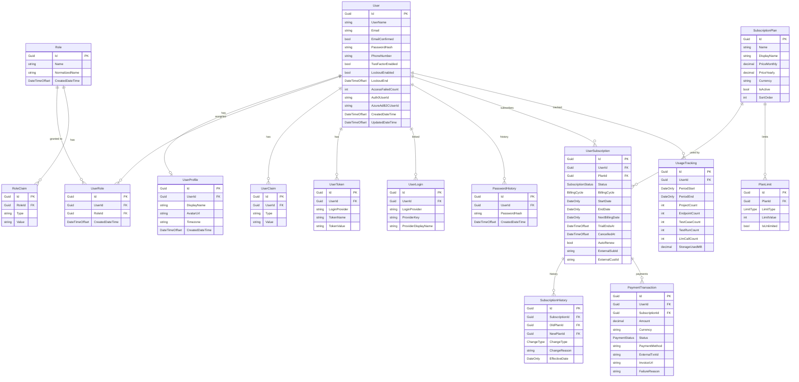
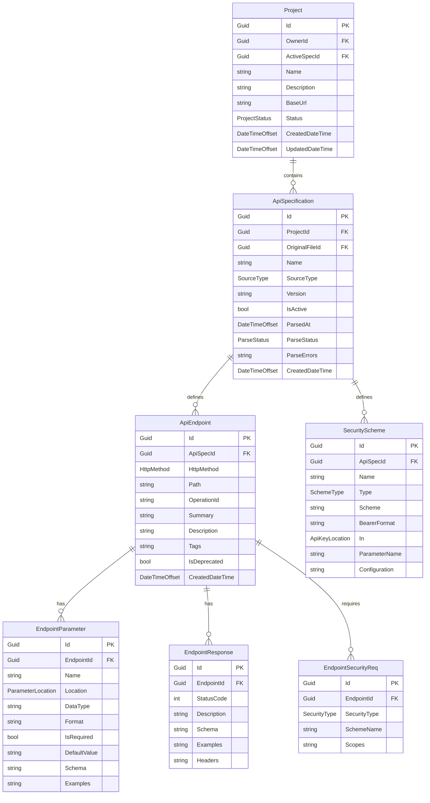
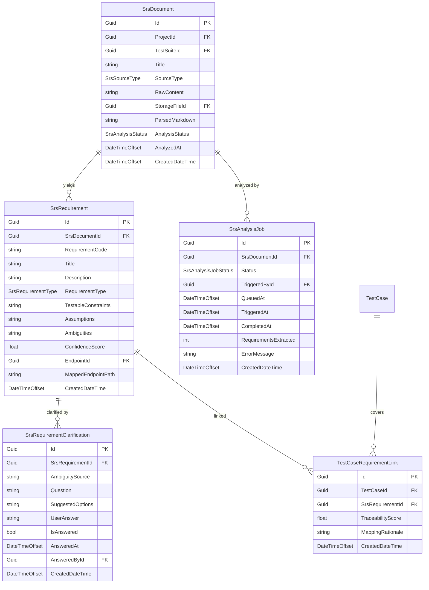
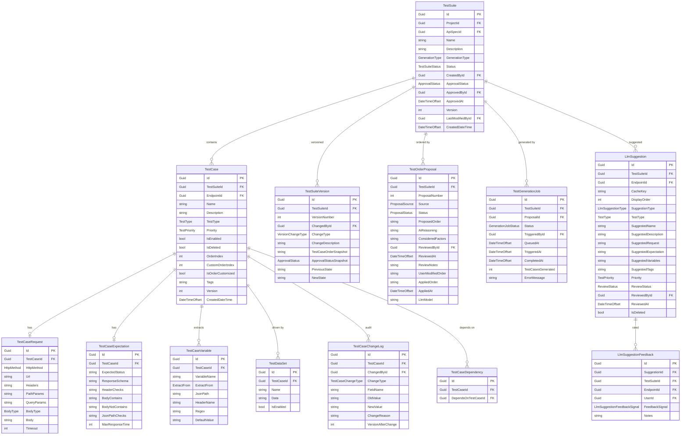
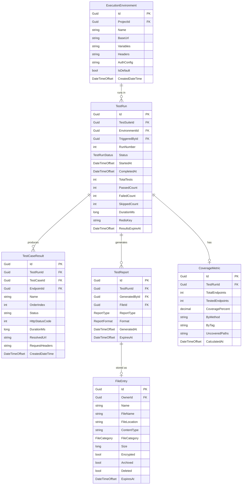
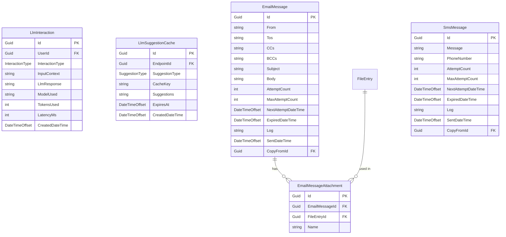
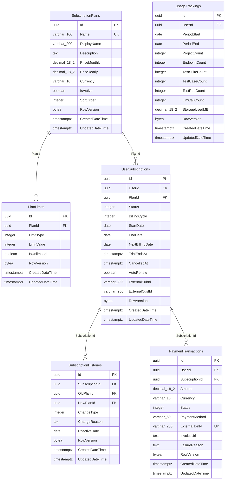
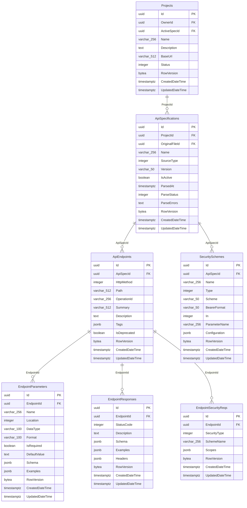
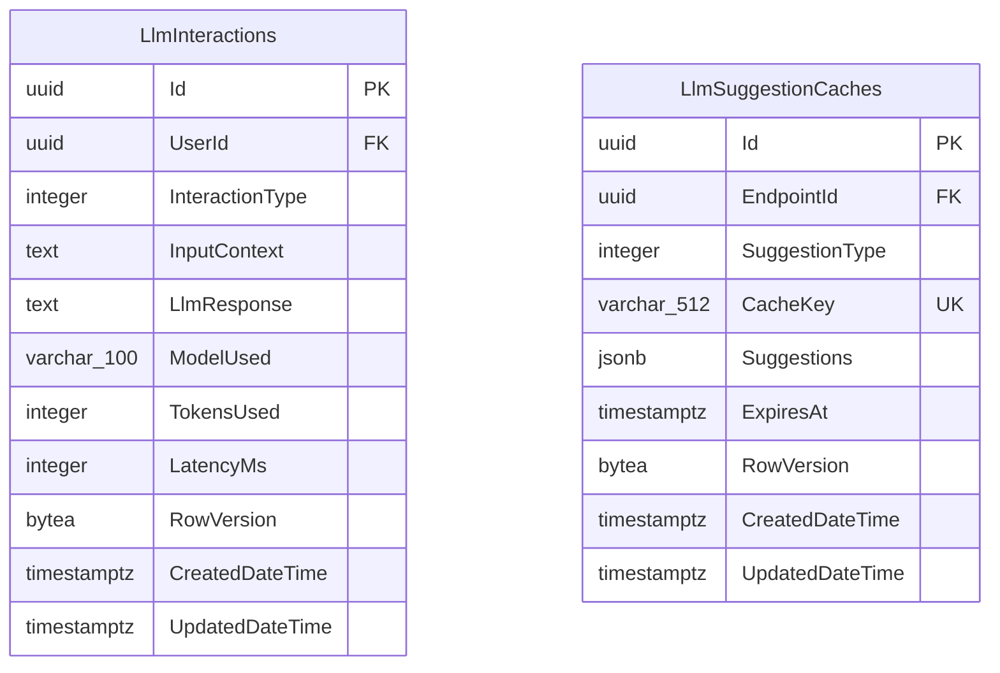
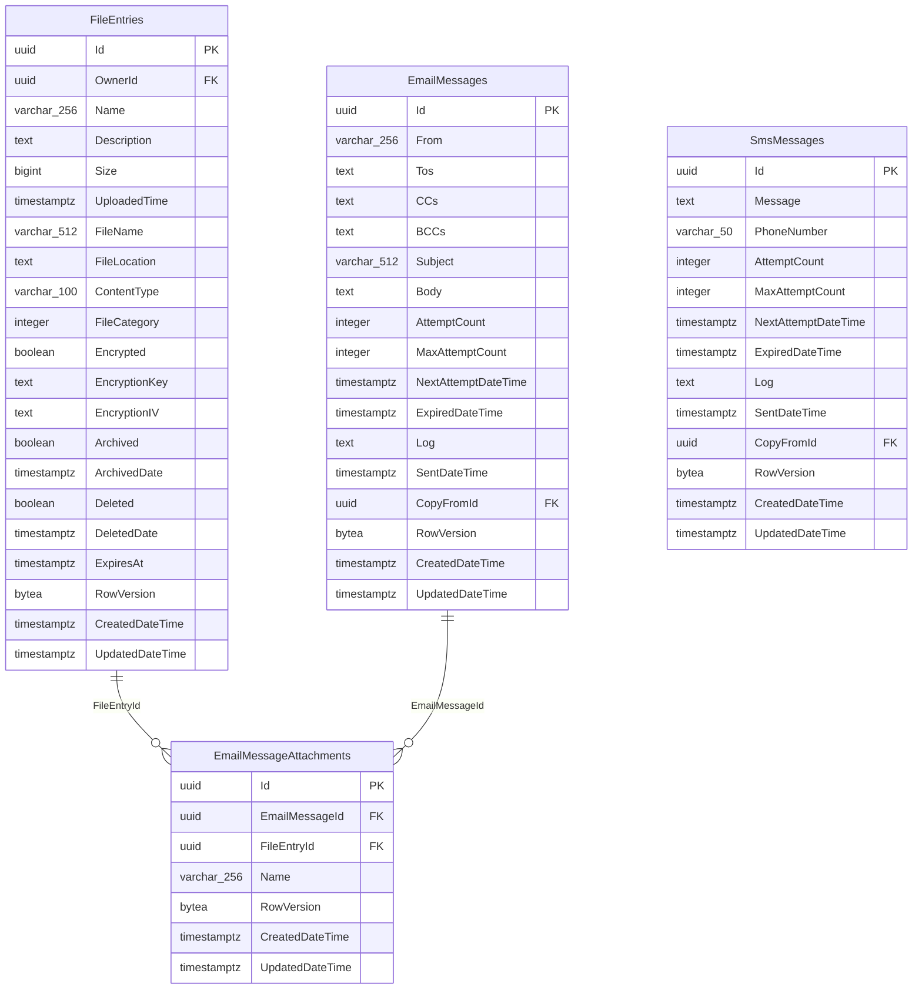

# Entities Documentation

Tài liệu này liệt kê tất cả các entities trong hệ thống ClassifiedAds Modular Monolith.

## Mục lục

1. [Domain Base](#domain-base)
2. [Identity Module](#identity-module)
3. [Product Module](#product-module)
4. [Storage Module](#storage-module)
5. [Notification Module](#notification-module)
6. [Configuration Module](#configuration-module)
7. [AuditLog Module](#auditlog-module)
8. [Subscription Module](#subscription-module)
9. [ApiDocumentation Module](#apidocumentation-module)
10. [TestGeneration Module](#testgeneration-module)
11. [TestExecution Module](#testexecution-module)
12. [TestReporting Module](#testreporting-module)
13. [LlmAssistant Module](#llmassistant-module)

---

## Domain Base

### Entity\<TKey\>
Base class cho tất cả entities.

| Property | Type | Description |
|----------|------|-------------|
| Id | TKey | Primary key |
| RowVersion | byte[] | Concurrency token |
| CreatedDateTime | DateTimeOffset | Thời gian tạo |
| UpdatedDateTime | DateTimeOffset? | Thời gian cập nhật |

### Interfaces
- `IAggregateRoot` - Marker interface cho aggregate root
- `IHasKey<TKey>` - Interface có key
- `ITrackable` - Interface theo dõi thời gian tạo/cập nhật

---

## Identity Module

### User
Entity người dùng chính.

| Property | Type | Description |
|----------|------|-------------|
| Id | Guid | Primary key |
| UserName | string | Tên đăng nhập |
| NormalizedUserName | string | Tên đăng nhập chuẩn hóa |
| Email | string | Email |
| NormalizedEmail | string | Email chuẩn hóa |
| EmailConfirmed | bool | Email đã xác nhận |
| PasswordHash | string | Mật khẩu đã hash |
| PhoneNumber | string | Số điện thoại |
| PhoneNumberConfirmed | bool | SĐT đã xác nhận |
| TwoFactorEnabled | bool | Bật 2FA |
| ConcurrencyStamp | string | Concurrency stamp |
| SecurityStamp | string | Security stamp |
| LockoutEnabled | bool | Bật khóa tài khoản |
| LockoutEnd | DateTimeOffset? | Thời gian hết khóa |
| AccessFailedCount | int | Số lần đăng nhập thất bại |
| Auth0UserId | string | Auth0 user ID |
| AzureAdB2CUserId | string | Azure AD B2C user ID |

**Navigation Properties:**
- `Tokens` - IList\<UserToken\>
- `Claims` - IList\<UserClaim\>
- `UserRoles` - IList\<UserRole\>
- `UserLogins` - IList\<UserLogin\>
- `Profile` - UserProfile (1:1)

---

### UserProfile
Thông tin profile mở rộng của user (1:1 với User).

| Property | Type | Description |
|----------|------|-------------|
| Id | Guid | Primary key |
| UserId | Guid | FK đến User |
| DisplayName | string | Tên hiển thị |
| AvatarUrl | string | URL avatar |
| Timezone | string | Timezone (e.g., "Asia/Ho_Chi_Minh") |

---

### Role
Vai trò trong hệ thống.

| Property | Type | Description |
|----------|------|-------------|
| Id | Guid | Primary key |
| Name | string | Tên role |
| NormalizedName | string | Tên chuẩn hóa |
| ConcurrencyStamp | string | Concurrency stamp |

**Navigation Properties:**
- `Claims` - IList\<RoleClaim\>
- `UserRoles` - IList\<UserRole\>

---

### UserRole
Quan hệ nhiều-nhiều giữa User và Role.

| Property | Type | Description |
|----------|------|-------------|
| Id | Guid | Primary key |
| UserId | Guid | FK đến User |
| RoleId | Guid | FK đến Role |

---

### UserClaim
Claims của user.

| Property | Type | Description |
|----------|------|-------------|
| Id | Guid | Primary key |
| UserId | Guid | FK đến User |
| Type | string | Loại claim |
| Value | string | Giá trị claim |

---

### RoleClaim
Claims của role.

| Property | Type | Description |
|----------|------|-------------|
| Id | Guid | Primary key |
| RoleId | Guid | FK đến Role |
| Type | string | Loại claim |
| Value | string | Giá trị claim |

---

### UserToken
Token của user.

| Property | Type | Description |
|----------|------|-------------|
| Id | Guid | Primary key |
| UserId | Guid | FK đến User |
| LoginProvider | string | Provider cung cấp token |
| TokenName | string | Tên token |
| TokenValue | string | Giá trị token |

---

### UserLogin
Thông tin đăng nhập external.

| Property | Type | Description |
|----------|------|-------------|
| Id | Guid | Primary key |
| UserId | Guid | FK đến User |
| LoginProvider | string | Provider (Google, Facebook...) |
| ProviderKey | string | Key từ provider |
| ProviderDisplayName | string | Tên hiển thị |

---

## Product Module

### Product
Sản phẩm trong hệ thống.

| Property | Type | Description |
|----------|------|-------------|
| Id | Guid | Primary key |
| Code | string | Mã sản phẩm |
| Name | string | Tên sản phẩm |
| Description | string | Mô tả |

---

## Storage Module

### FileEntry
Entity lưu trữ file (API specs, reports, exports).

| Property | Type | Description |
|----------|------|-------------|
| Id | Guid | Primary key |
| Name | string | Tên file |
| Description | string | Mô tả |
| Size | long | Kích thước (bytes) |
| UploadedTime | DateTimeOffset | Thời gian upload |
| FileName | string | Tên file gốc |
| FileLocation | string | Đường dẫn lưu trữ |
| Encrypted | bool | Đã mã hóa |
| EncryptionKey | string | Key mã hóa |
| EncryptionIV | string | IV mã hóa |
| Archived | bool | Đã archive |
| ArchivedDate | DateTimeOffset? | Ngày archive |
| Deleted | bool | Đã xóa mềm |
| DeletedDate | DateTimeOffset? | Ngày xóa |
| OwnerId | Guid? | User sở hữu |
| ContentType | string | MIME type |
| FileCategory | FileCategory | Loại file |
| ExpiresAt | DateTimeOffset? | Thời gian hết hạn |

**Enums:**
```csharp
public enum FileCategory
{
    ApiSpec = 0,     // OpenAPI/Postman/Swagger files
    Report = 1,      // PDF/CSV/HTML reports
    Export = 2,      // Exported test results
    Attachment = 3   // General attachments
}
```

---

## Notification Module

### EmailMessage
Email cần gửi.

| Property | Type | Description |
|----------|------|-------------|
| Id | Guid | Primary key |
| From | string | Người gửi |
| Tos | string | Danh sách người nhận |
| CCs | string | CC list |
| BCCs | string | BCC list |
| Subject | string | Tiêu đề |
| Body | string | Nội dung |
| AttemptCount | int | Số lần thử gửi |
| MaxAttemptCount | int | Số lần thử tối đa |
| NextAttemptDateTime | DateTimeOffset? | Thời gian thử lại |
| ExpiredDateTime | DateTimeOffset? | Thời gian hết hạn |
| Log | string | Log gửi mail |
| SentDateTime | DateTimeOffset? | Thời gian đã gửi |
| CopyFromId | Guid? | Copy từ email khác |

**Navigation Properties:**
- `EmailMessageAttachments` - ICollection\<EmailMessageAttachment\>

---

### EmailMessageAttachment
Attachment của email.

| Property | Type | Description |
|----------|------|-------------|
| Id | Guid | Primary key |
| EmailMessageId | Guid | FK đến EmailMessage |
| FileEntryId | Guid | FK đến FileEntry |
| Name | string | Tên attachment |

---

### SmsMessage
SMS cần gửi.

| Property | Type | Description |
|----------|------|-------------|
| Id | Guid | Primary key |
| Message | string | Nội dung SMS |
| PhoneNumber | string | Số điện thoại |
| AttemptCount | int | Số lần thử |
| MaxAttemptCount | int | Số lần thử tối đa |
| NextAttemptDateTime | DateTimeOffset? | Thời gian thử lại |
| ExpiredDateTime | DateTimeOffset? | Thời gian hết hạn |
| Log | string | Log gửi SMS |
| SentDateTime | DateTimeOffset? | Thời gian đã gửi |
| CopyFromId | Guid? | Copy từ SMS khác |

---

## Configuration Module

### ConfigurationEntry
Cấu hình hệ thống.

| Property | Type | Description |
|----------|------|-------------|
| Id | Guid | Primary key |
| Key | string | Key cấu hình |
| Value | string | Giá trị |
| Description | string | Mô tả |
| IsSensitive | bool | Là thông tin nhạy cảm |

---

### LocalizationEntry
Bản dịch đa ngôn ngữ.

| Property | Type | Description |
|----------|------|-------------|
| Id | Guid | Primary key |
| Name | string | Tên resource |
| Value | string | Giá trị dịch |
| Culture | string | Culture code (vi, en...) |
| Description | string | Mô tả |

---

## AuditLog Module

### AuditLogEntry
Log audit cho các thao tác.

| Property | Type | Description |
|----------|------|-------------|
| Id | Guid | Primary key |
| UserId | Guid | User thực hiện |
| Action | string | Hành động |
| ObjectId | string | ID đối tượng |
| Log | string | Chi tiết log |

---

### IdempotentRequest
Lưu trữ request idempotent.

| Property | Type | Description |
|----------|------|-------------|
| Id | Guid | Primary key |
| RequestType | string | Loại request |
| RequestId | string | ID request |

---

## Subscription Module

### SubscriptionPlan
Gói subscription (Free, Pro, Enterprise).

| Property | Type | Description |
|----------|------|-------------|
| Id | Guid | Primary key |
| Name | string | Tên gói (Free, Pro, Enterprise) |
| DisplayName | string | Tên hiển thị |
| Description | string | Mô tả |
| PriceMonthly | decimal? | Giá tháng |
| PriceYearly | decimal? | Giá năm |
| Currency | string | Đơn vị tiền (USD, VND) |
| IsActive | bool | Đang hoạt động |
| SortOrder | int | Thứ tự hiển thị |

---

### PlanLimit
Giới hạn của từng gói.

| Property | Type | Description |
|----------|------|-------------|
| Id | Guid | Primary key |
| PlanId | Guid | FK đến SubscriptionPlan |
| LimitType | LimitType | Loại giới hạn |
| LimitValue | int? | Giá trị giới hạn |
| IsUnlimited | bool | Không giới hạn |

**Enums:**
```csharp
public enum LimitType
{
    MaxProjects = 0,
    MaxEndpointsPerProject = 1,
    MaxTestCasesPerSuite = 2,
    MaxTestRunsPerMonth = 3,
    MaxConcurrentRuns = 4,
    RetentionDays = 5,
    MaxLlmCallsPerMonth = 6,
    MaxStorageMB = 7
}
```

---

### UserSubscription
Subscription của user.

| Property | Type | Description |
|----------|------|-------------|
| Id | Guid | Primary key |
| UserId | Guid | FK đến User |
| PlanId | Guid | FK đến SubscriptionPlan |
| Status | SubscriptionStatus | Trạng thái |
| BillingCycle | BillingCycle? | Chu kỳ thanh toán |
| StartDate | DateOnly | Ngày bắt đầu |
| EndDate | DateOnly? | Ngày kết thúc |
| NextBillingDate | DateOnly? | Ngày thanh toán tiếp |
| TrialEndsAt | DateTimeOffset? | Hết trial |
| CancelledAt | DateTimeOffset? | Ngày hủy |
| AutoRenew | bool | Tự động gia hạn |
| ExternalSubId | string | Stripe subscription ID |
| ExternalCustId | string | Stripe customer ID |

**Enums:**
```csharp
public enum SubscriptionStatus
{
    Trial = 0,
    Active = 1,
    PastDue = 2,
    Cancelled = 3,
    Expired = 4
}

public enum BillingCycle
{
    Monthly = 0,
    Yearly = 1
}
```

---

### SubscriptionHistory
Lịch sử thay đổi subscription.

| Property | Type | Description |
|----------|------|-------------|
| Id | Guid | Primary key |
| SubscriptionId | Guid | FK đến UserSubscription |
| OldPlanId | Guid? | Gói cũ |
| NewPlanId | Guid | Gói mới |
| ChangeType | ChangeType | Loại thay đổi |
| ChangeReason | string | Lý do |
| EffectiveDate | DateOnly | Ngày có hiệu lực |

**Enums:**
```csharp
public enum ChangeType
{
    Created = 0,
    Upgraded = 1,
    Downgraded = 2,
    Cancelled = 3,
    Reactivated = 4
}
```

---

### PaymentTransaction
Giao dịch thanh toán.

| Property | Type | Description |
|----------|------|-------------|
| Id | Guid | Primary key |
| UserId | Guid | FK đến User |
| SubscriptionId | Guid | FK đến UserSubscription |
| Amount | decimal | Số tiền |
| Currency | string | Đơn vị tiền |
| Status | PaymentStatus | Trạng thái |
| PaymentMethod | string | Phương thức (card, bank_transfer) |
| ExternalTxnId | string | Stripe payment intent ID |
| InvoiceUrl | string | URL hóa đơn |
| FailureReason | string | Lý do thất bại |

**Enums:**
```csharp
public enum PaymentStatus
{
    Pending = 0,
    Succeeded = 1,
    Failed = 2,
    Refunded = 3
}
```

---

### UsageTracking
Theo dõi usage trong kỳ thanh toán.

| Property | Type | Description |
|----------|------|-------------|
| Id | Guid | Primary key |
| UserId | Guid | FK đến User |
| PeriodStart | DateOnly | Bắt đầu kỳ |
| PeriodEnd | DateOnly | Kết thúc kỳ |
| ProjectCount | int | Số project |
| EndpointCount | int | Số endpoint |
| TestSuiteCount | int | Số test suite |
| TestCaseCount | int | Số test case |
| TestRunCount | int | Số test run |
| LlmCallCount | int | Số LLM call |
| StorageUsedMB | decimal | Storage đã dùng (MB) |

---

## ApiDocumentation Module

### Project
Project chứa API specifications.

| Property | Type | Description |
|----------|------|-------------|
| Id | Guid | Primary key |
| OwnerId | Guid | User sở hữu |
| ActiveSpecId | Guid? | Spec đang active |
| Name | string | Tên project |
| Description | string | Mô tả |
| BaseUrl | string | Base URL cho API |
| Status | ProjectStatus | Trạng thái |

**Enums:**
```csharp
public enum ProjectStatus
{
    Active = 0,
    Archived = 1
}
```

---

### ApiSpecification
API specification (OpenAPI, Postman...).

| Property | Type | Description |
|----------|------|-------------|
| Id | Guid | Primary key |
| ProjectId | Guid | FK đến Project |
| OriginalFileId | Guid? | File gốc (Storage) |
| Name | string | Tên spec |
| SourceType | SourceType | Nguồn (OpenAPI, Postman...) |
| Version | string | Phiên bản API |
| IsActive | bool | Đang active |
| ParsedAt | DateTimeOffset? | Thời gian parse |
| ParseStatus | ParseStatus | Trạng thái parse |
| ParseErrors | string | Lỗi parse (JSON) |

**Enums:**
```csharp
public enum SourceType
{
    OpenAPI = 0,
    Postman = 1,
    Manual = 2,
    cURL = 3
}

public enum ParseStatus
{
    Pending = 0,
    Success = 1,
    Failed = 2
}
```

---

### ApiEndpoint
API endpoint definition.

| Property | Type | Description |
|----------|------|-------------|
| Id | Guid | Primary key |
| ApiSpecId | Guid | FK đến ApiSpecification |
| HttpMethod | HttpMethod | HTTP method |
| Path | string | Đường dẫn (e.g., /api/users/{id}) |
| OperationId | string | Operation ID |
| Summary | string | Tóm tắt |
| Description | string | Mô tả chi tiết |
| Tags | string | Tags (JSON array) |
| IsDeprecated | bool | Đã deprecated |

**Enums:**
```csharp
public enum HttpMethod
{
    GET = 0,
    POST = 1,
    PUT = 2,
    DELETE = 3,
    PATCH = 4,
    HEAD = 5,
    OPTIONS = 6
}
```

---

### EndpointParameter
Parameter của endpoint.

| Property | Type | Description |
|----------|------|-------------|
| Id | Guid | Primary key |
| EndpointId | Guid | FK đến ApiEndpoint |
| Name | string | Tên parameter |
| Location | ParameterLocation | Vị trí (Path, Query, Header, Body) |
| DataType | string | Kiểu dữ liệu |
| Format | string | Format (date-time, email, uuid...) |
| IsRequired | bool | Bắt buộc |
| DefaultValue | string | Giá trị mặc định |
| Schema | string | JSON Schema |
| Examples | string | Ví dụ (JSON) |

**Enums:**
```csharp
public enum ParameterLocation
{
    Path = 0,
    Query = 1,
    Header = 2,
    Body = 3
}
```

---

### EndpointResponse
Response definition của endpoint.

| Property | Type | Description |
|----------|------|-------------|
| Id | Guid | Primary key |
| EndpointId | Guid | FK đến ApiEndpoint |
| StatusCode | int | HTTP status code |
| Description | string | Mô tả |
| Schema | string | JSON Schema |
| Examples | string | Ví dụ (JSON) |
| Headers | string | Response headers (JSON) |

---

### SecurityScheme
Security scheme của API spec.

| Property | Type | Description |
|----------|------|-------------|
| Id | Guid | Primary key |
| ApiSpecId | Guid | FK đến ApiSpecification |
| Name | string | Tên scheme |
| Type | SchemeType | Loại (http, apiKey, oauth2...) |
| Scheme | string | HTTP scheme (bearer, basic) |
| BearerFormat | string | Format (JWT) |
| In | ApiKeyLocation? | Vị trí API key |
| ParameterName | string | Tên parameter |
| Configuration | string | Config bổ sung (JSON) |

**Enums:**
```csharp
public enum SchemeType
{
    Http = 0,
    ApiKey = 1,
    OAuth2 = 2,
    OpenIdConnect = 3
}

public enum ApiKeyLocation
{
    Header = 0,
    Query = 1,
    Cookie = 2
}
```

---

### EndpointSecurityReq
Security requirement của endpoint.

| Property | Type | Description |
|----------|------|-------------|
| Id | Guid | Primary key |
| EndpointId | Guid | FK đến ApiEndpoint |
| SecurityType | SecurityType | Loại security |
| SchemeName | string | Tên security scheme |
| Scopes | string | OAuth2 scopes (JSON array) |

**Enums:**
```csharp
public enum SecurityType
{
    Bearer = 0,
    ApiKey = 1,
    OAuth2 = 2,
    Basic = 3,
    OpenIdConnect = 4
}
```

---

## TestGeneration Module

### TestSuite
Test suite chứa nhiều test cases.

| Property | Type | Description |
|----------|------|-------------|
| Id | Guid | Primary key |
| ProjectId | Guid | FK đến Project |
| ApiSpecId | Guid? | FK đến ApiSpecification |
| Name | string | Tên suite |
| Description | string | Mô tả |
| GenerationType | GenerationType | Cách tạo (Auto, Manual, LLMAssisted) |
| Status | TestSuiteStatus | Trạng thái |
| CreatedById | Guid | User tạo |
| ApprovalStatus | ApprovalStatus | Trạng thái duyệt |
| ApprovedById | Guid? | User duyệt |
| ApprovedAt | DateTimeOffset? | Thời gian duyệt |
| Version | int | Số phiên bản |
| LastModifiedById | Guid? | User sửa cuối |

**Enums:**
```csharp
public enum GenerationType
{
    Auto = 0,
    Manual = 1,
    LLMAssisted = 2
}

public enum TestSuiteStatus
{
    Draft = 0,
    Ready = 1,
    Archived = 2
}

public enum ApprovalStatus
{
    NotApplicable = 0,
    PendingReview = 1,
    Approved = 2,
    Rejected = 3
}
```

---

### TestCase
Test case riêng lẻ.

| Property | Type | Description |
|----------|------|-------------|
| Id | Guid | Primary key |
| TestSuiteId | Guid | FK đến TestSuite |
| EndpointId | Guid? | FK đến ApiEndpoint |
| Name | string | Tên test case |
| Description | string | Mô tả |
| TestType | TestType | Loại test |
| Priority | TestPriority | Độ ưu tiên |
| IsEnabled | bool | Đang bật |
| DependsOnId | Guid? | Phụ thuộc test case khác |
| OrderIndex | int | Thứ tự thực thi |
| CustomOrderIndex | int? | Thứ tự tùy chỉnh |
| IsOrderCustomized | bool | Đã tùy chỉnh thứ tự |
| Tags | string | Tags (JSON array) |
| LastModifiedById | Guid? | User sửa cuối |
| Version | int | Số phiên bản |

**Navigation Properties:**
- `Request` - TestCaseRequest (1:1)
- `Expectation` - TestCaseExpectation (1:1)
- `Variables` - ICollection\<TestCaseVariable\>
- `DataSets` - ICollection\<TestDataSet\>
- `ChangeLogs` - ICollection\<TestCaseChangeLog\>

**Enums:**
```csharp
public enum TestType
{
    HappyPath = 0,
    Boundary = 1,
    Negative = 2,
    Performance = 3,
    Security = 4
}

public enum TestPriority
{
    Critical = 0,
    High = 1,
    Medium = 2,
    Low = 3
}
```

---

### TestCaseRequest
Request definition của test case (1:1).

| Property | Type | Description |
|----------|------|-------------|
| Id | Guid | Primary key |
| TestCaseId | Guid | FK đến TestCase |
| HttpMethod | HttpMethod | HTTP method |
| Url | string | URL template |
| Headers | string | Headers (JSON) |
| PathParams | string | Path params (JSON) |
| QueryParams | string | Query params (JSON) |
| BodyType | BodyType | Loại body |
| Body | string | Request body |
| Timeout | int | Timeout (ms), default 30000 |

**Enums:**
```csharp
public enum BodyType
{
    JSON = 0,
    FormData = 1,
    UrlEncoded = 2,
    Raw = 3
}
```

---

### TestCaseExpectation
Expected response của test case (1:1).

| Property | Type | Description |
|----------|------|-------------|
| Id | Guid | Primary key |
| TestCaseId | Guid | FK đến TestCase |
| ExpectedStatus | string | Expected status codes (JSON array) |
| ResponseSchema | string | JSON Schema |
| HeaderChecks | string | Header validation (JSON) |
| BodyContains | string | Strings must exist (JSON array) |
| BodyNotContains | string | Strings must NOT exist (JSON array) |
| JsonPathChecks | string | JSONPath assertions (JSON) |
| MaxResponseTime | int? | Max response time (ms) |

---

### TestCaseVariable
Variable extraction từ response.

| Property | Type | Description |
|----------|------|-------------|
| Id | Guid | Primary key |
| TestCaseId | Guid | FK đến TestCase |
| VariableName | string | Tên biến |
| ExtractFrom | ExtractFrom | Nguồn extract |
| JsonPath | string | JSONPath expression |
| HeaderName | string | Tên header |
| Regex | string | Regex pattern |
| DefaultValue | string | Giá trị mặc định |

**Enums:**
```csharp
public enum ExtractFrom
{
    ResponseBody = 0,
    ResponseHeader = 1,
    Status = 2
}
```

---

### TestDataSet
Data set cho data-driven testing.

| Property | Type | Description |
|----------|------|-------------|
| Id | Guid | Primary key |
| TestCaseId | Guid | FK đến TestCase |
| Name | string | Tên data set |
| Data | string | Data (JSON) |
| IsEnabled | bool | Đang bật |

---

### TestCaseChangeLog
Audit trail cho thay đổi test case.

| Property | Type | Description |
|----------|------|-------------|
| Id | Guid | Primary key |
| TestCaseId | Guid | FK đến TestCase |
| ChangedById | Guid | User thay đổi |
| ChangeType | TestCaseChangeType | Loại thay đổi |
| FieldName | string | Tên field thay đổi |
| OldValue | string | Giá trị cũ (JSON) |
| NewValue | string | Giá trị mới (JSON) |
| ChangeReason | string | Lý do |
| VersionAfterChange | int | Version sau thay đổi |
| IpAddress | string | IP address |
| UserAgent | string | User agent |

**Enums:**
```csharp
public enum TestCaseChangeType
{
    Created = 0,
    NameChanged = 1,
    DescriptionChanged = 2,
    // ... more types
}
```

---

### TestSuiteVersion
Version history của TestSuite.

| Property | Type | Description |
|----------|------|-------------|
| Id | Guid | Primary key |
| TestSuiteId | Guid | FK đến TestSuite |
| VersionNumber | int | Số version |
| ChangedById | Guid | User thay đổi |
| ChangeType | VersionChangeType | Loại thay đổi |
| ChangeDescription | string | Mô tả |
| TestCaseOrderSnapshot | string | Snapshot thứ tự (JSON) |
| ApprovalStatusSnapshot | ApprovalStatus | Snapshot trạng thái duyệt |
| PreviousState | string | State trước (JSON) |
| NewState | string | State sau (JSON) |

**Enums:**
```csharp
public enum VersionChangeType
{
    Created = 0,
    TestOrderChanged = 1,
    TestCasesModified = 2,
    // ... more types
}
```

---

### TestOrderProposal
Đề xuất thứ tự test từ AI.

| Property | Type | Description |
|----------|------|-------------|
| Id | Guid | Primary key |
| TestSuiteId | Guid | FK đến TestSuite |
| ProposalNumber | int | Số thứ tự đề xuất |
| Source | ProposalSource | Nguồn (AI, User, System) |
| Status | ProposalStatus | Trạng thái |
| ProposedOrder | string | Thứ tự đề xuất (JSON) |
| AiReasoning | string | Lý do AI |
| ConsideredFactors | string | Các yếu tố xem xét |
| ReviewedById | Guid? | User review |
| ReviewedAt | DateTimeOffset? | Thời gian review |
| ReviewNotes | string | Ghi chú review |
| UserModifiedOrder | string | Thứ tự user sửa (JSON) |
| AppliedOrder | string | Thứ tự áp dụng (JSON) |
| AppliedAt | DateTimeOffset? | Thời gian áp dụng |
| LlmModel | string | Model LLM sử dụng |

**Enums:**
```csharp
public enum ProposalSource
{
    AI = 0,
    User = 1,
    System = 2
}

public enum ProposalStatus
{
    Pending = 0,
    Approved = 1,
    Rejected = 2,
    Modified = 3,
    Superseded = 4
}
```

---

## TestExecution Module

### TestRun
Bản ghi chạy test (summary trong PostgreSQL, details trong Redis).

| Property | Type | Description |
|----------|------|-------------|
| Id | Guid | Primary key |
| TestSuiteId | Guid | FK đến TestSuite |
| EnvironmentId | Guid | FK đến ExecutionEnvironment |
| TriggeredById | Guid | User trigger |
| RunNumber | int | Số thứ tự run |
| Status | TestRunStatus | Trạng thái |
| StartedAt | DateTimeOffset? | Thời gian bắt đầu |
| CompletedAt | DateTimeOffset? | Thời gian hoàn thành |
| TotalTests | int | Tổng số test |
| PassedCount | int | Số passed |
| FailedCount | int | Số failed |
| SkippedCount | int | Số skipped |
| DurationMs | long | Thời gian chạy (ms) |
| RedisKey | string | Key lấy chi tiết từ Redis |
| ResultsExpireAt | DateTimeOffset? | Thời gian Redis data hết hạn |

**Enums:**
```csharp
public enum TestRunStatus
{
    Pending = 0,
    Running = 1,
    Completed = 2,
    Failed = 3,
    Cancelled = 4
}
```

---

### ExecutionEnvironment
Môi trường chạy test.

| Property | Type | Description |
|----------|------|-------------|
| Id | Guid | Primary key |
| ProjectId | Guid | FK đến Project |
| Name | string | Tên (Development, Staging, Production) |
| BaseUrl | string | Base URL |
| Variables | string | Environment variables (JSON) |
| Headers | string | Default headers (JSON) |
| AuthConfig | string | Auth config (JSON, encrypted) |
| IsDefault | bool | Là môi trường mặc định |

---

## TestReporting Module

### TestReport
Báo cáo test đã generate.

| Property | Type | Description |
|----------|------|-------------|
| Id | Guid | Primary key |
| TestRunId | Guid | FK đến TestRun |
| GeneratedById | Guid | User generate |
| FileId | Guid | FK đến FileEntry |
| ReportType | ReportType | Loại báo cáo |
| Format | ReportFormat | Định dạng |
| GeneratedAt | DateTimeOffset | Thời gian generate |
| ExpiresAt | DateTimeOffset? | Thời gian hết hạn |

**Enums:**
```csharp
public enum ReportType
{
    Summary = 0,
    Detailed = 1,
    Coverage = 2
}

public enum ReportFormat
{
    PDF = 0,
    CSV = 1,
    JSON = 2,
    HTML = 3
}
```

---

### CoverageMetric
Metrics coverage API cho test run.

| Property | Type | Description |
|----------|------|-------------|
| Id | Guid | Primary key |
| TestRunId | Guid | FK đến TestRun |
| TotalEndpoints | int | Tổng số endpoints |
| TestedEndpoints | int | Số endpoints đã test |
| CoveragePercent | decimal | Phần trăm coverage |
| ByMethod | string | Coverage theo method (JSON) |
| ByTag | string | Coverage theo tag (JSON) |
| UncoveredPaths | string | Paths chưa cover (JSON array) |
| CalculatedAt | DateTimeOffset | Thời gian tính |

---

## LlmAssistant Module

### LlmInteraction
Bản ghi tương tác với LLM.

| Property | Type | Description |
|----------|------|-------------|
| Id | Guid | Primary key |
| UserId | Guid | FK đến User |
| InteractionType | InteractionType | Loại tương tác |
| InputContext | string | Context gửi LLM |
| LlmResponse | string | Response từ LLM |
| ModelUsed | string | Model (gpt-4, claude-3) |
| TokensUsed | int | Số tokens |
| LatencyMs | int | Độ trễ (ms) |

**Enums:**
```csharp
public enum InteractionType
{
    ScenarioSuggestion = 0,
    FailureExplanation = 1,
    DocumentationParsing = 2
}
```

---

### LlmSuggestionCache
Cache suggestions từ LLM.

| Property | Type | Description |
|----------|------|-------------|
| Id | Guid | Primary key |
| EndpointId | Guid | FK đến ApiEndpoint |
| SuggestionType | SuggestionType | Loại suggestion |
| CacheKey | string | Key cache |
| Suggestions | string | Suggestions (JSON) |
| ExpiresAt | DateTimeOffset | Thời gian hết hạn |

**Enums:**
```csharp
public enum SuggestionType
{
    BoundaryCase = 0,
    NegativeCase = 1,
    HappyPath = 2,
    SecurityCase = 3
}
```

---

## Common Entities (Per Module)

Mỗi module có các entities chung:

### OutboxMessage
Transactional outbox pattern cho reliable messaging.

| Property | Type | Description |
|----------|------|-------------|
| Id | Guid | Primary key |
| Type | string | Message type |
| Payload | string | Message payload (JSON) |
| CreatedAt | DateTimeOffset | Thời gian tạo |
| ProcessedAt | DateTimeOffset? | Thời gian xử lý |

### AuditLogEntry (Per Module)
Audit log riêng cho từng module.

| Property | Type | Description |
|----------|------|-------------|
| Id | Guid | Primary key |
| UserId | Guid | User thực hiện |
| Action | string | Hành động |
| ObjectId | string | ID đối tượng |
| Log | string | Chi tiết |

---

## Entity Relationships Diagram

### Text Diagram (Quick Reference)

```
┌─────────────────────────────────────────────────────────────────────────────────┐
│                              IDENTITY MODULE                                     │
├─────────────────────────────────────────────────────────────────────────────────┤
│  User ──1:1──> UserProfile                                                       │
│    │                                                                             │
│    ├──1:N──> UserRole ──N:1──> Role                                             │
│    │                             │                                               │
│    ├──1:N──> UserClaim           └──1:N──> RoleClaim                            │
│    ├──1:N──> UserToken                                                          │
│    └──1:N──> UserLogin                                                          │
└─────────────────────────────────────────────────────────────────────────────────┘

┌─────────────────────────────────────────────────────────────────────────────────┐
│                           API DOCUMENTATION MODULE                               │
├─────────────────────────────────────────────────────────────────────────────────┤
│  Project ──1:N──> ApiSpecification ──1:N──> ApiEndpoint                         │
│                        │                        │                                │
│                        └──1:N──> SecurityScheme ├──1:N──> EndpointParameter     │
│                                                 ├──1:N──> EndpointResponse       │
│                                                 └──1:N──> EndpointSecurityReq    │
└─────────────────────────────────────────────────────────────────────────────────┘

┌─────────────────────────────────────────────────────────────────────────────────┐
│                          TEST GENERATION MODULE                                  │
├─────────────────────────────────────────────────────────────────────────────────┤
│  TestSuite ──1:N──> TestCase ──1:1──> TestCaseRequest                           │
│      │                  │                                                        │
│      │                  ├──1:1──> TestCaseExpectation                           │
│      │                  ├──1:N──> TestCaseVariable                              │
│      │                  ├──1:N──> TestDataSet                                   │
│      │                  └──1:N──> TestCaseChangeLog                             │
│      │                                                                           │
│      ├──1:N──> TestSuiteVersion                                                 │
│      └──1:N──> TestOrderProposal                                                │
└─────────────────────────────────────────────────────────────────────────────────┘

┌─────────────────────────────────────────────────────────────────────────────────┐
│                            SUBSCRIPTION MODULE                                   │
├─────────────────────────────────────────────────────────────────────────────────┤
│  SubscriptionPlan ──1:N──> PlanLimit                                            │
│         │                                                                        │
│         └──1:N──> UserSubscription ──1:N──> SubscriptionHistory                 │
│                          │                                                       │
│                          └──1:N──> PaymentTransaction                           │
│                                                                                  │
│  UsageTracking (per user per period)                                            │
└─────────────────────────────────────────────────────────────────────────────────┘

┌─────────────────────────────────────────────────────────────────────────────────┐
│                         TEST EXECUTION & REPORTING                               │
├─────────────────────────────────────────────────────────────────────────────────┤
│  ExecutionEnvironment                                                            │
│         │                                                                        │
│         └──> TestRun ──1:N──> TestReport                                        │
│                  │                                                               │
│                  └──1:1──> CoverageMetric                                       │
└─────────────────────────────────────────────────────────────────────────────────┘
```

---

## ERD Diagrams

> 💡 **Hướng dẫn sử dụng**: Copy code Mermaid bên dưới vào:
> - [Mermaid Live Editor](https://mermaid.live)
> - draw.io (Insert > Advanced > Mermaid)
> - Notion, GitHub, GitLab (hỗ trợ native)
> - VS Code với extension "Markdown Preview Mermaid Support"

---

## 1. Conceptual ERD

> Mức độ **nghiệp vụ**: chỉ hiển thị các tập thực thể chính và mối quan hệ — không có thuộc tính.


```mermaid
erDiagram
    %% ── IDENTITY ──────────────────────────────────────────────
    USER ||--o| USER_PROFILE : "has profile"
    USER ||--o{ USER_ROLE : "assigned"
    USER ||--o{ USER_CLAIM : "has"
    USER ||--o{ USER_TOKEN : "has"
    USER ||--o{ USER_LOGIN : "linked"
    USER ||--o{ PASSWORD_HISTORY : "history"
    ROLE ||--o{ USER_ROLE : "granted to"
    ROLE ||--o{ ROLE_CLAIM : "has"

    %% ── SUBSCRIPTION ───────────────────────────────────────────
    USER ||--o{ USER_SUBSCRIPTION : "subscribes"
    USER_SUBSCRIPTION ||--o{ SUBSCRIPTION_HISTORY : "history"
    USER_SUBSCRIPTION ||--o{ PAYMENT_TRANSACTION : "payments"
    SUBSCRIPTION_PLAN ||--o{ USER_SUBSCRIPTION : "used by"
    SUBSCRIPTION_PLAN ||--o{ PLAN_LIMIT : "limits"
    USER ||--o{ USAGE_TRACKING : "tracked"

    %% ── API DOCUMENTATION ──────────────────────────────────────
    USER ||--o{ PROJECT : "owns"
    PROJECT ||--o{ API_SPECIFICATION : "contains"
    API_SPECIFICATION ||--o{ API_ENDPOINT : "defines"
    API_SPECIFICATION ||--o{ SECURITY_SCHEME : "defines"
    API_ENDPOINT ||--o{ ENDPOINT_PARAMETER : "has"
    API_ENDPOINT ||--o{ ENDPOINT_RESPONSE : "has"
    API_ENDPOINT ||--o{ ENDPOINT_SECURITY_REQ : "requires"

    %% ── SRS / TRACEABILITY ────────────────────────────────────
    PROJECT ||--o{ SRS_DOCUMENT : "has"
    SRS_DOCUMENT ||--o{ SRS_REQUIREMENT : "yields"
    SRS_REQUIREMENT ||--o{ SRS_REQUIREMENT_CLARIFICATION : "clarified by"
    SRS_DOCUMENT ||--o{ SRS_ANALYSIS_JOB : "analyzed by"
    SRS_REQUIREMENT ||--o{ TEST_CASE_REQUIREMENT_LINK : "linked"

    %% ── TEST GENERATION ────────────────────────────────────────
    PROJECT ||--o{ TEST_SUITE : "has"
    PROJECT ||--o{ EXECUTION_ENVIRONMENT : "configures"
    TEST_SUITE ||--o{ TEST_CASE : "contains"
    TEST_CASE ||--o| TEST_CASE_REQUEST : "has"
    TEST_CASE ||--o| TEST_CASE_EXPECTATION : "has"
    TEST_CASE ||--o{ TEST_CASE_VARIABLE : "extracts"
    TEST_CASE ||--o{ TEST_DATA_SET : "driven by"
    TEST_CASE ||--o{ TEST_CASE_CHANGE_LOG : "audit"
    TEST_CASE ||--o{ TEST_CASE_DEPENDENCY : "depends on"
    TEST_CASE ||--o{ TEST_CASE_REQUIREMENT_LINK : "covers"
    TEST_SUITE ||--o{ TEST_SUITE_VERSION : "versioned"
    TEST_SUITE ||--o{ TEST_ORDER_PROPOSAL : "ordered by"
    TEST_SUITE ||--o{ TEST_GENERATION_JOB : "generated by"
    TEST_SUITE ||--o{ LLM_SUGGESTION : "suggested"
    LLM_SUGGESTION ||--o{ LLM_SUGGESTION_FEEDBACK : "rated"

    %% ── TEST EXECUTION ─────────────────────────────────────────
    TEST_SUITE ||--o{ TEST_RUN : "executed as"
    EXECUTION_ENVIRONMENT ||--o{ TEST_RUN : "runs in"
    TEST_RUN ||--o{ TEST_CASE_RESULT : "produces"
    TEST_RUN ||--o{ TEST_REPORT : "generates"
    TEST_RUN ||--o| COVERAGE_METRIC : "has"
    TEST_REPORT ||--o| FILE_ENTRY : "stored as"

    %% ── LLM / STORAGE / NOTIFICATION ──────────────────────────
    USER ||--o{ LLM_INTERACTION : "triggers"
    API_ENDPOINT ||--o{ LLM_SUGGESTION_CACHE : "cached"
    FILE_ENTRY ||--o{ EMAIL_MESSAGE_ATTACHMENT : "attached to"
    EMAIL_MESSAGE ||--o{ EMAIL_MESSAGE_ATTACHMENT : "has"
```

---

## 2. Logical ERD

> Mức độ **logic**: các thực thể với thuộc tính nghiệp vụ và kiểu dữ liệu trừu tượng — không phụ thuộc RDBMS cụ thể.

### 2A. Identity & Subscription


```mermaid
erDiagram
    User ||--o| UserProfile : "has"
    User ||--o{ UserRole : "assigned"
    User ||--o{ UserClaim : "has"
    User ||--o{ UserToken : "has"
    User ||--o{ UserLogin : "linked"
    User ||--o{ PasswordHistory : "history"
    Role ||--o{ UserRole : "granted to"
    Role ||--o{ RoleClaim : "has"
    User ||--o{ UserSubscription : "subscribes"
    SubscriptionPlan ||--o{ UserSubscription : "used by"
    SubscriptionPlan ||--o{ PlanLimit : "limits"
    UserSubscription ||--o{ SubscriptionHistory : "history"
    UserSubscription ||--o{ PaymentTransaction : "payments"
    User ||--o{ UsageTracking : "tracked"

    User {
        Guid Id PK
        string UserName
        string Email
        bool EmailConfirmed
        string PasswordHash
        string PhoneNumber
        bool TwoFactorEnabled
        bool LockoutEnabled
        DateTimeOffset LockoutEnd
        int AccessFailedCount
        string Auth0UserId
        string AzureAdB2CUserId
        DateTimeOffset CreatedDateTime
        DateTimeOffset UpdatedDateTime
    }
    UserProfile {
        Guid Id PK
        Guid UserId FK
        string DisplayName
        string AvatarUrl
        string Timezone
        DateTimeOffset CreatedDateTime
    }
    PasswordHistory {
        Guid Id PK
        Guid UserId FK
        string PasswordHash
        DateTimeOffset CreatedDateTime
    }
    Role {
        Guid Id PK
        string Name
        string NormalizedName
        DateTimeOffset CreatedDateTime
    }
    UserRole {
        Guid Id PK
        Guid UserId FK
        Guid RoleId FK
        DateTimeOffset CreatedDateTime
    }
    UserClaim {
        Guid Id PK
        Guid UserId FK
        string Type
        string Value
    }
    RoleClaim {
        Guid Id PK
        Guid RoleId FK
        string Type
        string Value
    }
    UserToken {
        Guid Id PK
        Guid UserId FK
        string LoginProvider
        string TokenName
        string TokenValue
    }
    UserLogin {
        Guid Id PK
        Guid UserId FK
        string LoginProvider
        string ProviderKey
        string ProviderDisplayName
    }
    SubscriptionPlan {
        Guid Id PK
        string Name
        string DisplayName
        decimal PriceMonthly
        decimal PriceYearly
        string Currency
        bool IsActive
        int SortOrder
    }
    PlanLimit {
        Guid Id PK
        Guid PlanId FK
        LimitType LimitType
        int LimitValue
        bool IsUnlimited
    }
    UserSubscription {
        Guid Id PK
        Guid UserId FK
        Guid PlanId FK
        SubscriptionStatus Status
        BillingCycle BillingCycle
        DateOnly StartDate
        DateOnly EndDate
        DateOnly NextBillingDate
        DateTimeOffset TrialEndsAt
        DateTimeOffset CancelledAt
        bool AutoRenew
        string ExternalSubId
        string ExternalCustId
    }
    SubscriptionHistory {
        Guid Id PK
        Guid SubscriptionId FK
        Guid OldPlanId FK
        Guid NewPlanId FK
        ChangeType ChangeType
        string ChangeReason
        DateOnly EffectiveDate
    }
    PaymentTransaction {
        Guid Id PK
        Guid UserId FK
        Guid SubscriptionId FK
        decimal Amount
        string Currency
        PaymentStatus Status
        string PaymentMethod
        string ExternalTxnId
        string InvoiceUrl
        string FailureReason
    }
    UsageTracking {
        Guid Id PK
        Guid UserId FK
        DateOnly PeriodStart
        DateOnly PeriodEnd
        int ProjectCount
        int EndpointCount
        int TestCaseCount
        int TestRunCount
        int LlmCallCount
        decimal StorageUsedMB
    }
```

### 2B. API Documentation


```mermaid
erDiagram
    Project ||--o{ ApiSpecification : "contains"
    ApiSpecification ||--o{ ApiEndpoint : "defines"
    ApiSpecification ||--o{ SecurityScheme : "defines"
    ApiEndpoint ||--o{ EndpointParameter : "has"
    ApiEndpoint ||--o{ EndpointResponse : "has"
    ApiEndpoint ||--o{ EndpointSecurityReq : "requires"

    Project {
        Guid Id PK
        Guid OwnerId FK
        Guid ActiveSpecId FK
        string Name
        string Description
        string BaseUrl
        ProjectStatus Status
        DateTimeOffset CreatedDateTime
        DateTimeOffset UpdatedDateTime
    }
    ApiSpecification {
        Guid Id PK
        Guid ProjectId FK
        Guid OriginalFileId FK
        string Name
        SourceType SourceType
        string Version
        bool IsActive
        DateTimeOffset ParsedAt
        ParseStatus ParseStatus
        string ParseErrors
        DateTimeOffset CreatedDateTime
    }
    ApiEndpoint {
        Guid Id PK
        Guid ApiSpecId FK
        HttpMethod HttpMethod
        string Path
        string OperationId
        string Summary
        string Description
        string Tags
        bool IsDeprecated
        DateTimeOffset CreatedDateTime
    }
    EndpointParameter {
        Guid Id PK
        Guid EndpointId FK
        string Name
        ParameterLocation Location
        string DataType
        string Format
        bool IsRequired
        string DefaultValue
        string Schema
        string Examples
    }
    EndpointResponse {
        Guid Id PK
        Guid EndpointId FK
        int StatusCode
        string Description
        string Schema
        string Examples
        string Headers
    }
    SecurityScheme {
        Guid Id PK
        Guid ApiSpecId FK
        string Name
        SchemeType Type
        string Scheme
        string BearerFormat
        ApiKeyLocation In
        string ParameterName
        string Configuration
    }
    EndpointSecurityReq {
        Guid Id PK
        Guid EndpointId FK
        SecurityType SecurityType
        string SchemeName
        string Scopes
    }
```

### 2C. SRS & Traceability


```mermaid
erDiagram
    SrsDocument ||--o{ SrsRequirement : "yields"
    SrsDocument ||--o{ SrsAnalysisJob : "analyzed by"
    SrsRequirement ||--o{ SrsRequirementClarification : "clarified by"
    SrsRequirement ||--o{ TestCaseRequirementLink : "linked"
    TestCase ||--o{ TestCaseRequirementLink : "covers"

    SrsDocument {
        Guid Id PK
        Guid ProjectId FK
        Guid TestSuiteId FK
        string Title
        SrsSourceType SourceType
        string RawContent
        Guid StorageFileId FK
        string ParsedMarkdown
        SrsAnalysisStatus AnalysisStatus
        DateTimeOffset AnalyzedAt
        DateTimeOffset CreatedDateTime
    }
    SrsRequirement {
        Guid Id PK
        Guid SrsDocumentId FK
        string RequirementCode
        string Title
        string Description
        SrsRequirementType RequirementType
        string TestableConstraints
        string Assumptions
        string Ambiguities
        float ConfidenceScore
        Guid EndpointId FK
        string MappedEndpointPath
        DateTimeOffset CreatedDateTime
    }
    SrsRequirementClarification {
        Guid Id PK
        Guid SrsRequirementId FK
        string AmbiguitySource
        string Question
        string SuggestedOptions
        string UserAnswer
        bool IsAnswered
        DateTimeOffset AnsweredAt
        Guid AnsweredById FK
        DateTimeOffset CreatedDateTime
    }
    SrsAnalysisJob {
        Guid Id PK
        Guid SrsDocumentId FK
        SrsAnalysisJobStatus Status
        Guid TriggeredById FK
        DateTimeOffset QueuedAt
        DateTimeOffset TriggeredAt
        DateTimeOffset CompletedAt
        int RequirementsExtracted
        string ErrorMessage
        DateTimeOffset CreatedDateTime
    }
    TestCaseRequirementLink {
        Guid Id PK
        Guid TestCaseId FK
        Guid SrsRequirementId FK
        float TraceabilityScore
        string MappingRationale
        DateTimeOffset CreatedDateTime
    }
```

### 2D. Test Generation


```mermaid
erDiagram
    TestSuite ||--o{ TestCase : "contains"
    TestSuite ||--o{ TestSuiteVersion : "versioned"
    TestSuite ||--o{ TestOrderProposal : "ordered by"
    TestSuite ||--o{ TestGenerationJob : "generated by"
    TestSuite ||--o{ LlmSuggestion : "suggested"
    LlmSuggestion ||--o{ LlmSuggestionFeedback : "rated"
    TestCase ||--o| TestCaseRequest : "has"
    TestCase ||--o| TestCaseExpectation : "has"
    TestCase ||--o{ TestCaseVariable : "extracts"
    TestCase ||--o{ TestDataSet : "driven by"
    TestCase ||--o{ TestCaseChangeLog : "audit"
    TestCase ||--o{ TestCaseDependency : "depends on"

    TestSuite {
        Guid Id PK
        Guid ProjectId FK
        Guid ApiSpecId FK
        string Name
        string Description
        GenerationType GenerationType
        TestSuiteStatus Status
        Guid CreatedById FK
        ApprovalStatus ApprovalStatus
        Guid ApprovedById FK
        DateTimeOffset ApprovedAt
        int Version
        Guid LastModifiedById FK
        DateTimeOffset CreatedDateTime
    }
    TestCase {
        Guid Id PK
        Guid TestSuiteId FK
        Guid EndpointId FK
        string Name
        string Description
        TestType TestType
        TestPriority Priority
        bool IsEnabled
        bool IsDeleted
        int OrderIndex
        int CustomOrderIndex
        bool IsOrderCustomized
        string Tags
        int Version
        DateTimeOffset CreatedDateTime
    }
    TestCaseRequest {
        Guid Id PK
        Guid TestCaseId FK
        HttpMethod HttpMethod
        string Url
        string Headers
        string PathParams
        string QueryParams
        BodyType BodyType
        string Body
        int Timeout
    }
    TestCaseExpectation {
        Guid Id PK
        Guid TestCaseId FK
        string ExpectedStatus
        string ResponseSchema
        string HeaderChecks
        string BodyContains
        string BodyNotContains
        string JsonPathChecks
        int MaxResponseTime
    }
    TestCaseVariable {
        Guid Id PK
        Guid TestCaseId FK
        string VariableName
        ExtractFrom ExtractFrom
        string JsonPath
        string HeaderName
        string Regex
        string DefaultValue
    }
    TestDataSet {
        Guid Id PK
        Guid TestCaseId FK
        string Name
        string Data
        bool IsEnabled
    }
    TestCaseChangeLog {
        Guid Id PK
        Guid TestCaseId FK
        Guid ChangedById FK
        TestCaseChangeType ChangeType
        string FieldName
        string OldValue
        string NewValue
        string ChangeReason
        int VersionAfterChange
    }
    TestCaseDependency {
        Guid Id PK
        Guid TestCaseId FK
        Guid DependsOnTestCaseId FK
    }
    TestSuiteVersion {
        Guid Id PK
        Guid TestSuiteId FK
        int VersionNumber
        Guid ChangedById FK
        VersionChangeType ChangeType
        string ChangeDescription
        string TestCaseOrderSnapshot
        ApprovalStatus ApprovalStatusSnapshot
        string PreviousState
        string NewState
    }
    TestOrderProposal {
        Guid Id PK
        Guid TestSuiteId FK
        int ProposalNumber
        ProposalSource Source
        ProposalStatus Status
        string ProposedOrder
        string AiReasoning
        string ConsideredFactors
        Guid ReviewedById FK
        DateTimeOffset ReviewedAt
        string ReviewNotes
        string UserModifiedOrder
        string AppliedOrder
        DateTimeOffset AppliedAt
        string LlmModel
    }
    TestGenerationJob {
        Guid Id PK
        Guid TestSuiteId FK
        Guid ProposalId FK
        GenerationJobStatus Status
        Guid TriggeredById FK
        DateTimeOffset QueuedAt
        DateTimeOffset TriggeredAt
        DateTimeOffset CompletedAt
        int TestCasesGenerated
        string ErrorMessage
    }
    LlmSuggestion {
        Guid Id PK
        Guid TestSuiteId FK
        Guid EndpointId FK
        string CacheKey
        int DisplayOrder
        LlmSuggestionType SuggestionType
        TestType TestType
        string SuggestedName
        string SuggestedDescription
        string SuggestedRequest
        string SuggestedExpectation
        string SuggestedVariables
        string SuggestedTags
        TestPriority Priority
        ReviewStatus ReviewStatus
        Guid ReviewedById FK
        DateTimeOffset ReviewedAt
        bool IsDeleted
    }
    LlmSuggestionFeedback {
        Guid Id PK
        Guid SuggestionId FK
        Guid TestSuiteId FK
        Guid EndpointId FK
        Guid UserId FK
        LlmSuggestionFeedbackSignal FeedbackSignal
        string Notes
    }
```

### 2E. Test Execution & Reporting


```mermaid
erDiagram
    ExecutionEnvironment ||--o{ TestRun : "runs in"
    TestRun ||--o{ TestCaseResult : "produces"
    TestRun ||--o{ TestReport : "generates"
    TestRun ||--o| CoverageMetric : "has"
    TestReport ||--o| FileEntry : "stored as"

    ExecutionEnvironment {
        Guid Id PK
        Guid ProjectId FK
        string Name
        string BaseUrl
        string Variables
        string Headers
        string AuthConfig
        bool IsDefault
        DateTimeOffset CreatedDateTime
    }
    TestRun {
        Guid Id PK
        Guid TestSuiteId FK
        Guid EnvironmentId FK
        Guid TriggeredById FK
        int RunNumber
        TestRunStatus Status
        DateTimeOffset StartedAt
        DateTimeOffset CompletedAt
        int TotalTests
        int PassedCount
        int FailedCount
        int SkippedCount
        long DurationMs
        string RedisKey
        DateTimeOffset ResultsExpireAt
    }
    TestCaseResult {
        Guid Id PK
        Guid TestRunId FK
        Guid TestCaseId FK
        Guid EndpointId FK
        string Name
        int OrderIndex
        string Status
        int HttpStatusCode
        long DurationMs
        string ResolvedUrl
        string RequestHeaders
        DateTimeOffset CreatedDateTime
    }
    TestReport {
        Guid Id PK
        Guid TestRunId FK
        Guid GeneratedById FK
        Guid FileId FK
        ReportType ReportType
        ReportFormat Format
        DateTimeOffset GeneratedAt
        DateTimeOffset ExpiresAt
    }
    CoverageMetric {
        Guid Id PK
        Guid TestRunId FK
        int TotalEndpoints
        int TestedEndpoints
        decimal CoveragePercent
        string ByMethod
        string ByTag
        string UncoveredPaths
        DateTimeOffset CalculatedAt
    }
    FileEntry {
        Guid Id PK
        Guid OwnerId FK
        string Name
        string FileName
        string FileLocation
        string ContentType
        FileCategory FileCategory
        long Size
        bool Encrypted
        bool Archived
        bool Deleted
        DateTimeOffset ExpiresAt
    }
```

### 2F. LLM Assistant & Storage


```mermaid
erDiagram
    LlmInteraction {
        Guid Id PK
        Guid UserId FK
        InteractionType InteractionType
        string InputContext
        string LlmResponse
        string ModelUsed
        int TokensUsed
        int LatencyMs
        DateTimeOffset CreatedDateTime
    }
    LlmSuggestionCache {
        Guid Id PK
        Guid EndpointId FK
        SuggestionType SuggestionType
        string CacheKey
        string Suggestions
        DateTimeOffset ExpiresAt
        DateTimeOffset CreatedDateTime
    }
    EmailMessage ||--o{ EmailMessageAttachment : "has"
    FileEntry ||--o{ EmailMessageAttachment : "used in"
    EmailMessage {
        Guid Id PK
        string From
        string Tos
        string CCs
        string BCCs
        string Subject
        string Body
        int AttemptCount
        int MaxAttemptCount
        DateTimeOffset NextAttemptDateTime
        DateTimeOffset ExpiredDateTime
        string Log
        DateTimeOffset SentDateTime
        Guid CopyFromId FK
    }
    EmailMessageAttachment {
        Guid Id PK
        Guid EmailMessageId FK
        Guid FileEntryId FK
        string Name
    }
    SmsMessage {
        Guid Id PK
        string Message
        string PhoneNumber
        int AttemptCount
        int MaxAttemptCount
        DateTimeOffset NextAttemptDateTime
        DateTimeOffset ExpiredDateTime
        string Log
        DateTimeOffset SentDateTime
        Guid CopyFromId FK
    }
```

---

## 3. Physical ERD

> Mức độ **vật lý** (PostgreSQL): tên bảng, kiểu cột, PK/FK, unique constraints, indexes.

### 3A. Identity Schema (schema: identity)

```mermaid
erDiagram
    Users ||--o| UserProfiles : "UserId"
    Users ||--o{ UserRoles : "UserId"
    Users ||--o{ UserClaims : "UserId"
    Users ||--o{ UserTokens : "UserId"
    Users ||--o{ UserLogins : "UserId"
    Users ||--o{ PasswordHistories : "UserId"
    Roles ||--o{ UserRoles : "RoleId"
    Roles ||--o{ RoleClaims : "RoleId"

    Users {
        uuid Id PK
        varchar_256 UserName UK
        varchar_256 NormalizedUserName UK
        varchar_256 Email
        varchar_256 NormalizedEmail UK
        boolean EmailConfirmed
        text PasswordHash
        varchar_50 PhoneNumber
        boolean PhoneNumberConfirmed
        boolean TwoFactorEnabled
        varchar_256 ConcurrencyStamp
        varchar_256 SecurityStamp
        boolean LockoutEnabled
        timestamptz LockoutEnd
        integer AccessFailedCount
        varchar_256 Auth0UserId
        varchar_256 AzureAdB2CUserId
        bytea RowVersion
        timestamptz CreatedDateTime
        timestamptz UpdatedDateTime
    }
    UserProfiles {
        uuid Id PK
        uuid UserId UK_FK
        varchar_256 DisplayName
        text AvatarUrl
        varchar_64 Timezone
        bytea RowVersion
        timestamptz CreatedDateTime
        timestamptz UpdatedDateTime
    }
    PasswordHistories {
        uuid Id PK
        uuid UserId FK
        text PasswordHash
        bytea RowVersion
        timestamptz CreatedDateTime
        timestamptz UpdatedDateTime
    }
    Roles {
        uuid Id PK
        varchar_256 Name UK
        varchar_256 NormalizedName UK
        varchar_256 ConcurrencyStamp
        bytea RowVersion
        timestamptz CreatedDateTime
        timestamptz UpdatedDateTime
    }
    UserRoles {
        uuid Id PK
        uuid UserId FK
        uuid RoleId FK
        bytea RowVersion
        timestamptz CreatedDateTime
        timestamptz UpdatedDateTime
    }
    UserClaims {
        uuid Id PK
        uuid UserId FK
        varchar_256 Type
        text Value
        bytea RowVersion
        timestamptz CreatedDateTime
        timestamptz UpdatedDateTime
    }
    RoleClaims {
        uuid Id PK
        uuid RoleId FK
        varchar_256 Type
        text Value
        bytea RowVersion
        timestamptz CreatedDateTime
        timestamptz UpdatedDateTime
    }
    UserTokens {
        uuid Id PK
        uuid UserId FK
        varchar_256 LoginProvider
        varchar_256 TokenName
        text TokenValue
        bytea RowVersion
        timestamptz CreatedDateTime
        timestamptz UpdatedDateTime
    }
    UserLogins {
        uuid Id PK
        uuid UserId FK
        varchar_256 LoginProvider
        varchar_256 ProviderKey
        varchar_256 ProviderDisplayName
        bytea RowVersion
        timestamptz CreatedDateTime
        timestamptz UpdatedDateTime
    }
```

**Key Indexes (Identity):**
```sql
CREATE UNIQUE INDEX IX_Users_NormalizedEmail        ON identity."Users" ("NormalizedEmail");
CREATE UNIQUE INDEX IX_Users_NormalizedUserName     ON identity."Users" ("NormalizedUserName");
CREATE INDEX        IX_Users_Auth0UserId            ON identity."Users" ("Auth0UserId");
CREATE INDEX        IX_PasswordHistories_UserId     ON identity."PasswordHistories" ("UserId");
CREATE UNIQUE INDEX IX_UserProfiles_UserId          ON identity."UserProfiles" ("UserId");
CREATE INDEX        IX_UserRoles_UserId             ON identity."UserRoles" ("UserId");
CREATE INDEX        IX_UserRoles_RoleId             ON identity."UserRoles" ("RoleId");
```

### 3B. Subscription Schema (schema: subscription)


```mermaid
erDiagram
    SubscriptionPlans ||--o{ PlanLimits : "PlanId"
    SubscriptionPlans ||--o{ UserSubscriptions : "PlanId"
    UserSubscriptions ||--o{ SubscriptionHistories : "SubscriptionId"
    UserSubscriptions ||--o{ PaymentTransactions : "SubscriptionId"
    SubscriptionPlans {
        uuid Id PK
        varchar_100 Name UK
        varchar_200 DisplayName
        text Description
        decimal_18_2 PriceMonthly
        decimal_18_2 PriceYearly
        varchar_10 Currency
        boolean IsActive
        integer SortOrder
        bytea RowVersion
        timestamptz CreatedDateTime
        timestamptz UpdatedDateTime
    }
    PlanLimits {
        uuid Id PK
        uuid PlanId FK
        integer LimitType
        integer LimitValue
        boolean IsUnlimited
        bytea RowVersion
        timestamptz CreatedDateTime
        timestamptz UpdatedDateTime
    }
    UserSubscriptions {
        uuid Id PK
        uuid UserId FK
        uuid PlanId FK
        integer Status
        integer BillingCycle
        date StartDate
        date EndDate
        date NextBillingDate
        timestamptz TrialEndsAt
        timestamptz CancelledAt
        boolean AutoRenew
        varchar_256 ExternalSubId
        varchar_256 ExternalCustId
        bytea RowVersion
        timestamptz CreatedDateTime
        timestamptz UpdatedDateTime
    }
    SubscriptionHistories {
        uuid Id PK
        uuid SubscriptionId FK
        uuid OldPlanId FK
        uuid NewPlanId FK
        integer ChangeType
        text ChangeReason
        date EffectiveDate
        bytea RowVersion
        timestamptz CreatedDateTime
        timestamptz UpdatedDateTime
    }
    PaymentTransactions {
        uuid Id PK
        uuid UserId FK
        uuid SubscriptionId FK
        decimal_18_2 Amount
        varchar_10 Currency
        integer Status
        varchar_50 PaymentMethod
        varchar_256 ExternalTxnId UK
        text InvoiceUrl
        text FailureReason
        bytea RowVersion
        timestamptz CreatedDateTime
        timestamptz UpdatedDateTime
    }
    UsageTrackings {
        uuid Id PK
        uuid UserId FK
        date PeriodStart
        date PeriodEnd
        integer ProjectCount
        integer EndpointCount
        integer TestSuiteCount
        integer TestCaseCount
        integer TestRunCount
        integer LlmCallCount
        decimal_18_2 StorageUsedMB
        bytea RowVersion
        timestamptz CreatedDateTime
        timestamptz UpdatedDateTime
    }
```

**Key Indexes (Subscription):**
```sql
CREATE INDEX IX_UserSubscriptions_UserId           ON subscription."UserSubscriptions" ("UserId");
CREATE INDEX IX_UserSubscriptions_Status           ON subscription."UserSubscriptions" ("Status");
CREATE INDEX IX_UsageTrackings_UserId_Period       ON subscription."UsageTrackings" ("UserId", "PeriodStart", "PeriodEnd");
CREATE UNIQUE INDEX IX_PaymentTransactions_ExternalTxnId ON subscription."PaymentTransactions" ("ExternalTxnId");
```

### 3C. ApiDocumentation Schema (schema: apidocumentation)


```mermaid
erDiagram
    Projects ||--o{ ApiSpecifications : "ProjectId"
    ApiSpecifications ||--o{ ApiEndpoints : "ApiSpecId"
    ApiSpecifications ||--o{ SecuritySchemes : "ApiSpecId"
    ApiEndpoints ||--o{ EndpointParameters : "EndpointId"
    ApiEndpoints ||--o{ EndpointResponses : "EndpointId"
    ApiEndpoints ||--o{ EndpointSecurityReqs : "EndpointId"

    Projects {
        uuid Id PK
        uuid OwnerId FK
        uuid ActiveSpecId FK
        varchar_256 Name
        text Description
        varchar_512 BaseUrl
        integer Status
        bytea RowVersion
        timestamptz CreatedDateTime
        timestamptz UpdatedDateTime
    }
    ApiSpecifications {
        uuid Id PK
        uuid ProjectId FK
        uuid OriginalFileId FK
        varchar_256 Name
        integer SourceType
        varchar_50 Version
        boolean IsActive
        timestamptz ParsedAt
        integer ParseStatus
        text ParseErrors
        bytea RowVersion
        timestamptz CreatedDateTime
        timestamptz UpdatedDateTime
    }
    ApiEndpoints {
        uuid Id PK
        uuid ApiSpecId FK
        integer HttpMethod
        varchar_512 Path
        varchar_256 OperationId
        varchar_512 Summary
        text Description
        jsonb Tags
        boolean IsDeprecated
        bytea RowVersion
        timestamptz CreatedDateTime
        timestamptz UpdatedDateTime
    }
    EndpointParameters {
        uuid Id PK
        uuid EndpointId FK
        varchar_256 Name
        integer Location
        varchar_100 DataType
        varchar_100 Format
        boolean IsRequired
        text DefaultValue
        jsonb Schema
        jsonb Examples
        bytea RowVersion
        timestamptz CreatedDateTime
        timestamptz UpdatedDateTime
    }
    EndpointResponses {
        uuid Id PK
        uuid EndpointId FK
        integer StatusCode
        text Description
        jsonb Schema
        jsonb Examples
        jsonb Headers
        bytea RowVersion
        timestamptz CreatedDateTime
        timestamptz UpdatedDateTime
    }
    SecuritySchemes {
        uuid Id PK
        uuid ApiSpecId FK
        varchar_256 Name
        integer Type
        varchar_50 Scheme
        varchar_50 BearerFormat
        integer In
        varchar_256 ParameterName
        jsonb Configuration
        bytea RowVersion
        timestamptz CreatedDateTime
        timestamptz UpdatedDateTime
    }
    EndpointSecurityReqs {
        uuid Id PK
        uuid EndpointId FK
        integer SecurityType
        varchar_256 SchemeName
        jsonb Scopes
        bytea RowVersion
        timestamptz CreatedDateTime
        timestamptz UpdatedDateTime
    }
```

**Key Indexes (ApiDocumentation):**
```sql
CREATE INDEX IX_Projects_OwnerId             ON apidocumentation."Projects" ("OwnerId");
CREATE INDEX IX_ApiSpecifications_ProjectId  ON apidocumentation."ApiSpecifications" ("ProjectId");
CREATE INDEX IX_ApiEndpoints_ApiSpecId       ON apidocumentation."ApiEndpoints" ("ApiSpecId");
CREATE INDEX IX_ApiEndpoints_HttpMethod_Path ON apidocumentation."ApiEndpoints" ("HttpMethod", "Path");
CREATE INDEX IX_EndpointParameters_EndpointId ON apidocumentation."EndpointParameters" ("EndpointId");
```

### 3D. TestGeneration Schema (schema: testgeneration)

```mermaid
erDiagram
    TestSuites ||--o{ TestCases : "TestSuiteId"
    TestSuites ||--o{ TestSuiteVersions : "TestSuiteId"
    TestSuites ||--o{ TestOrderProposals : "TestSuiteId"
    TestSuites ||--o{ TestGenerationJobs : "TestSuiteId"
    TestSuites ||--o{ LlmSuggestions : "TestSuiteId"
    LlmSuggestions ||--o{ LlmSuggestionFeedbacks : "SuggestionId"
    TestCases ||--o| TestCaseRequests : "TestCaseId"
    TestCases ||--o| TestCaseExpectations : "TestCaseId"
    TestCases ||--o{ TestCaseVariables : "TestCaseId"
    TestCases ||--o{ TestDataSets : "TestCaseId"
    TestCases ||--o{ TestCaseChangeLogs : "TestCaseId"
    TestCases ||--o{ TestCaseDependencies : "TestCaseId"
    TestCases ||--o{ TestCaseRequirementLinks : "TestCaseId"
    SrsDocuments ||--o{ SrsRequirements : "SrsDocumentId"
    SrsDocuments ||--o{ SrsAnalysisJobs : "SrsDocumentId"
    SrsRequirements ||--o{ SrsRequirementClarifications : "SrsRequirementId"
    SrsRequirements ||--o{ TestCaseRequirementLinks : "SrsRequirementId"

    TestSuites {
        uuid Id PK
        uuid ProjectId FK
        uuid ApiSpecId FK
        varchar_256 Name
        text Description
        integer GenerationType
        integer Status
        uuid CreatedById FK
        integer ApprovalStatus
        uuid ApprovedById FK
        timestamptz ApprovedAt
        integer Version
        uuid LastModifiedById FK
        bytea RowVersion
        timestamptz CreatedDateTime
        timestamptz UpdatedDateTime
    }
    TestCases {
        uuid Id PK
        uuid TestSuiteId FK
        uuid EndpointId FK
        varchar_512 Name
        text Description
        integer TestType
        integer Priority
        boolean IsEnabled
        boolean IsDeleted
        timestamptz DeletedAt
        integer OrderIndex
        integer CustomOrderIndex
        boolean IsOrderCustomized
        jsonb Tags
        integer Version
        uuid LastModifiedById FK
        bytea RowVersion
        timestamptz CreatedDateTime
        timestamptz UpdatedDateTime
    }
    TestCaseRequests {
        uuid Id PK
        uuid TestCaseId UK_FK
        integer HttpMethod
        text Url
        jsonb Headers
        jsonb PathParams
        jsonb QueryParams
        integer BodyType
        text Body
        integer Timeout
        bytea RowVersion
        timestamptz CreatedDateTime
        timestamptz UpdatedDateTime
    }
    TestCaseExpectations {
        uuid Id PK
        uuid TestCaseId UK_FK
        jsonb ExpectedStatus
        jsonb ResponseSchema
        jsonb HeaderChecks
        jsonb BodyContains
        jsonb BodyNotContains
        jsonb JsonPathChecks
        integer MaxResponseTime
        bytea RowVersion
        timestamptz CreatedDateTime
        timestamptz UpdatedDateTime
    }
    TestCaseVariables {
        uuid Id PK
        uuid TestCaseId FK
        varchar_256 VariableName
        integer ExtractFrom
        varchar_512 JsonPath
        varchar_256 HeaderName
        varchar_512 Regex
        text DefaultValue
        bytea RowVersion
        timestamptz CreatedDateTime
        timestamptz UpdatedDateTime
    }
    TestDataSets {
        uuid Id PK
        uuid TestCaseId FK
        varchar_256 Name
        jsonb Data
        boolean IsEnabled
        bytea RowVersion
        timestamptz CreatedDateTime
        timestamptz UpdatedDateTime
    }
    TestCaseChangeLogs {
        uuid Id PK
        uuid TestCaseId FK
        uuid ChangedById FK
        integer ChangeType
        varchar_256 FieldName
        jsonb OldValue
        jsonb NewValue
        text ChangeReason
        integer VersionAfterChange
        varchar_64 IpAddress
        text UserAgent
        bytea RowVersion
        timestamptz CreatedDateTime
        timestamptz UpdatedDateTime
    }
    TestCaseDependencies {
        uuid Id PK
        uuid TestCaseId FK
        uuid DependsOnTestCaseId FK
        bytea RowVersion
        timestamptz CreatedDateTime
        timestamptz UpdatedDateTime
    }
    TestCaseRequirementLinks {
        uuid Id PK
        uuid TestCaseId FK
        uuid SrsRequirementId FK
        real TraceabilityScore
        text MappingRationale
        bytea RowVersion
        timestamptz CreatedDateTime
        timestamptz UpdatedDateTime
    }
    TestSuiteVersions {
        uuid Id PK
        uuid TestSuiteId FK
        integer VersionNumber
        uuid ChangedById FK
        integer ChangeType
        text ChangeDescription
        jsonb TestCaseOrderSnapshot
        integer ApprovalStatusSnapshot
        jsonb PreviousState
        jsonb NewState
        bytea RowVersion
        timestamptz CreatedDateTime
        timestamptz UpdatedDateTime
    }
    TestOrderProposals {
        uuid Id PK
        uuid TestSuiteId FK
        integer ProposalNumber
        integer Source
        integer Status
        jsonb ProposedOrder
        text AiReasoning
        text ConsideredFactors
        uuid ReviewedById FK
        timestamptz ReviewedAt
        text ReviewNotes
        jsonb UserModifiedOrder
        jsonb AppliedOrder
        timestamptz AppliedAt
        varchar_100 LlmModel
        bytea RowVersion
        timestamptz CreatedDateTime
        timestamptz UpdatedDateTime
    }
    TestGenerationJobs {
        uuid Id PK
        uuid TestSuiteId FK
        uuid ProposalId FK
        integer Status
        uuid TriggeredById FK
        timestamptz QueuedAt
        timestamptz TriggeredAt
        timestamptz CompletedAt
        integer TestCasesGenerated
        text ErrorMessage
        bytea RowVersion
        timestamptz CreatedDateTime
        timestamptz UpdatedDateTime
    }
    LlmSuggestions {
        uuid Id PK
        uuid TestSuiteId FK
        uuid EndpointId FK
        varchar_512 CacheKey
        integer DisplayOrder
        integer SuggestionType
        integer TestType
        varchar_512 SuggestedName
        text SuggestedDescription
        jsonb SuggestedRequest
        jsonb SuggestedExpectation
        jsonb SuggestedVariables
        jsonb SuggestedTags
        integer Priority
        integer ReviewStatus
        uuid ReviewedById FK
        timestamptz ReviewedAt
        boolean IsDeleted
        bytea RowVersion
        timestamptz CreatedDateTime
        timestamptz UpdatedDateTime
    }
    LlmSuggestionFeedbacks {
        uuid Id PK
        uuid SuggestionId FK
        uuid TestSuiteId FK
        uuid EndpointId FK
        uuid UserId FK
        integer FeedbackSignal
        text Notes
        bytea RowVersion
        timestamptz CreatedDateTime
        timestamptz UpdatedDateTime
    }
    SrsDocuments {
        uuid Id PK
        uuid ProjectId FK
        uuid TestSuiteId FK
        varchar_512 Title
        integer SourceType
        text RawContent
        uuid StorageFileId FK
        text ParsedMarkdown
        integer AnalysisStatus
        timestamptz AnalyzedAt
        bytea RowVersion
        timestamptz CreatedDateTime
        timestamptz UpdatedDateTime
    }
    SrsRequirements {
        uuid Id PK
        uuid SrsDocumentId FK
        varchar_20 RequirementCode
        varchar_512 Title
        text Description
        integer RequirementType
        jsonb TestableConstraints
        jsonb Assumptions
        jsonb Ambiguities
        real ConfidenceScore
        uuid EndpointId FK
        varchar_256 MappedEndpointPath
        integer SortOrder
        bytea RowVersion
        timestamptz CreatedDateTime
        timestamptz UpdatedDateTime
    }
    SrsRequirementClarifications {
        uuid Id PK
        uuid SrsRequirementId FK
        text AmbiguitySource
        text Question
        jsonb SuggestedOptions
        text UserAnswer
        boolean IsAnswered
        timestamptz AnsweredAt
        uuid AnsweredById FK
        integer ClarificationRound
        bytea RowVersion
        timestamptz CreatedDateTime
        timestamptz UpdatedDateTime
    }
    SrsAnalysisJobs {
        uuid Id PK
        uuid SrsDocumentId FK
        integer Status
        uuid TriggeredById FK
        timestamptz QueuedAt
        timestamptz TriggeredAt
        timestamptz CompletedAt
        integer RequirementsExtracted
        text ErrorMessage
        bytea RowVersion
        timestamptz CreatedDateTime
        timestamptz UpdatedDateTime
    }
```

**Key Indexes (TestGeneration):**
```sql
CREATE INDEX IX_TestSuites_ProjectId               ON testgeneration."TestSuites" ("ProjectId");
CREATE INDEX IX_TestCases_TestSuiteId              ON testgeneration."TestCases" ("TestSuiteId");
CREATE INDEX IX_TestCases_EndpointId               ON testgeneration."TestCases" ("EndpointId");
CREATE INDEX IX_TestCases_IsDeleted                ON testgeneration."TestCases" ("IsDeleted");
CREATE UNIQUE INDEX IX_TestCaseRequests_TestCaseId  ON testgeneration."TestCaseRequests" ("TestCaseId");
CREATE UNIQUE INDEX IX_TestCaseExpectations_TestCaseId ON testgeneration."TestCaseExpectations" ("TestCaseId");
CREATE INDEX IX_LlmSuggestions_TestSuiteId         ON testgeneration."LlmSuggestions" ("TestSuiteId");
CREATE INDEX IX_LlmSuggestions_EndpointId          ON testgeneration."LlmSuggestions" ("EndpointId");
CREATE INDEX IX_LlmSuggestions_IsDeleted           ON testgeneration."LlmSuggestions" ("IsDeleted");
CREATE INDEX IX_SrsRequirements_SrsDocumentId      ON testgeneration."SrsRequirements" ("SrsDocumentId");
CREATE INDEX IX_SrsRequirements_EndpointId         ON testgeneration."SrsRequirements" ("EndpointId");
CREATE INDEX IX_SrsAnalysisJobs_SrsDocumentId      ON testgeneration."SrsAnalysisJobs" ("SrsDocumentId");
CREATE INDEX IX_TestCaseRequirementLinks_TestCaseId ON testgeneration."TestCaseRequirementLinks" ("TestCaseId");
CREATE INDEX IX_TestCaseRequirementLinks_SrsRequirementId ON testgeneration."TestCaseRequirementLinks" ("SrsRequirementId");
CREATE INDEX IX_TestGenerationJobs_TestSuiteId     ON testgeneration."TestGenerationJobs" ("TestSuiteId");
```

### 3E. TestExecution Schema (schema: testexecution)

```mermaid
erDiagram
    ExecutionEnvironments ||--o{ TestRuns : "EnvironmentId"
    TestRuns ||--o{ TestCaseResults : "TestRunId"
    TestRuns ||--o{ TestReports : "TestRunId"
    TestRuns ||--o| CoverageMetrics : "TestRunId"

    ExecutionEnvironments {
        uuid Id PK
        uuid ProjectId FK
        varchar_256 Name
        varchar_512 BaseUrl
        jsonb Variables
        jsonb Headers
        text AuthConfig
        boolean IsDefault
        bytea RowVersion
        timestamptz CreatedDateTime
        timestamptz UpdatedDateTime
    }
    TestRuns {
        uuid Id PK
        uuid TestSuiteId FK
        uuid EnvironmentId FK
        uuid TriggeredById FK
        integer RunNumber
        integer Status
        timestamptz StartedAt
        timestamptz CompletedAt
        integer TotalTests
        integer PassedCount
        integer FailedCount
        integer SkippedCount
        bigint DurationMs
        varchar_512 RedisKey
        timestamptz ResultsExpireAt
        bytea RowVersion
        timestamptz CreatedDateTime
        timestamptz UpdatedDateTime
    }
    TestCaseResults {
        uuid Id PK
        uuid TestRunId FK
        uuid TestCaseId FK
        uuid EndpointId FK
        varchar_512 Name
        integer OrderIndex
        varchar_20 Status
        integer HttpStatusCode
        bigint DurationMs
        text ResolvedUrl
        jsonb RequestHeaders
        bytea RowVersion
        timestamptz CreatedDateTime
        timestamptz UpdatedDateTime
    }
    TestReports {
        uuid Id PK
        uuid TestRunId FK
        uuid GeneratedById FK
        uuid FileId FK
        integer ReportType
        integer Format
        timestamptz GeneratedAt
        timestamptz ExpiresAt
        bytea RowVersion
        timestamptz CreatedDateTime
        timestamptz UpdatedDateTime
    }
    CoverageMetrics {
        uuid Id PK
        uuid TestRunId UK_FK
        integer TotalEndpoints
        integer TestedEndpoints
        decimal_5_2 CoveragePercent
        jsonb ByMethod
        jsonb ByTag
        jsonb UncoveredPaths
        timestamptz CalculatedAt
        bytea RowVersion
        timestamptz CreatedDateTime
        timestamptz UpdatedDateTime
    }
```

**Key Indexes (TestExecution):**
```sql
CREATE INDEX IX_TestRuns_TestSuiteId               ON testexecution."TestRuns" ("TestSuiteId");
CREATE INDEX IX_TestRuns_EnvironmentId             ON testexecution."TestRuns" ("EnvironmentId");
CREATE INDEX IX_TestRuns_Status                    ON testexecution."TestRuns" ("Status");
CREATE INDEX IX_TestCaseResults_TestRunId          ON testexecution."TestCaseResults" ("TestRunId");
CREATE INDEX IX_TestCaseResults_TestCaseId         ON testexecution."TestCaseResults" ("TestCaseId");
CREATE UNIQUE INDEX IX_CoverageMetrics_TestRunId   ON testexecution."CoverageMetrics" ("TestRunId");
CREATE INDEX IX_ExecutionEnvironments_ProjectId    ON testexecution."ExecutionEnvironments" ("ProjectId");
```

### 3F. LlmAssistant Schema (schema: llmassistant)


```mermaid
erDiagram
    LlmInteractions {
        uuid Id PK
        uuid UserId FK
        integer InteractionType
        text InputContext
        text LlmResponse
        varchar_100 ModelUsed
        integer TokensUsed
        integer LatencyMs
        bytea RowVersion
        timestamptz CreatedDateTime
        timestamptz UpdatedDateTime
    }
    LlmSuggestionCaches {
        uuid Id PK
        uuid EndpointId FK
        integer SuggestionType
        varchar_512 CacheKey UK
        jsonb Suggestions
        timestamptz ExpiresAt
        bytea RowVersion
        timestamptz CreatedDateTime
        timestamptz UpdatedDateTime
    }
```

**Key Indexes (LlmAssistant):**
```sql
CREATE INDEX IX_LlmInteractions_UserId             ON llmassistant."LlmInteractions" ("UserId");
CREATE UNIQUE INDEX IX_LlmSuggestionCaches_CacheKey ON llmassistant."LlmSuggestionCaches" ("CacheKey");
CREATE INDEX IX_LlmSuggestionCaches_EndpointId     ON llmassistant."LlmSuggestionCaches" ("EndpointId");
CREATE INDEX IX_LlmSuggestionCaches_ExpiresAt      ON llmassistant."LlmSuggestionCaches" ("ExpiresAt");
```

### 3G. Storage & Notification Schemas


```mermaid
erDiagram
    FileEntries ||--o{ EmailMessageAttachments : "FileEntryId"
    EmailMessages ||--o{ EmailMessageAttachments : "EmailMessageId"

    FileEntries {
        uuid Id PK
        uuid OwnerId FK
        varchar_256 Name
        text Description
        bigint Size
        timestamptz UploadedTime
        varchar_512 FileName
        text FileLocation
        varchar_100 ContentType
        integer FileCategory
        boolean Encrypted
        text EncryptionKey
        text EncryptionIV
        boolean Archived
        timestamptz ArchivedDate
        boolean Deleted
        timestamptz DeletedDate
        timestamptz ExpiresAt
        bytea RowVersion
        timestamptz CreatedDateTime
        timestamptz UpdatedDateTime
    }
    EmailMessages {
        uuid Id PK
        varchar_256 From
        text Tos
        text CCs
        text BCCs
        varchar_512 Subject
        text Body
        integer AttemptCount
        integer MaxAttemptCount
        timestamptz NextAttemptDateTime
        timestamptz ExpiredDateTime
        text Log
        timestamptz SentDateTime
        uuid CopyFromId FK
        bytea RowVersion
        timestamptz CreatedDateTime
        timestamptz UpdatedDateTime
    }
    EmailMessageAttachments {
        uuid Id PK
        uuid EmailMessageId FK
        uuid FileEntryId FK
        varchar_256 Name
        bytea RowVersion
        timestamptz CreatedDateTime
        timestamptz UpdatedDateTime
    }
    SmsMessages {
        uuid Id PK
        text Message
        varchar_50 PhoneNumber
        integer AttemptCount
        integer MaxAttemptCount
        timestamptz NextAttemptDateTime
        timestamptz ExpiredDateTime
        text Log
        timestamptz SentDateTime
        uuid CopyFromId FK
        bytea RowVersion
        timestamptz CreatedDateTime
        timestamptz UpdatedDateTime
    }
```

---

## Foreign Key Constraints Summary (Updated)

| Table | Column | References | On Delete |
|-------|--------|------------|-----------|
| UserProfiles | UserId | Users.Id | CASCADE |
| UserRoles | UserId | Users.Id | CASCADE |
| UserRoles | RoleId | Roles.Id | CASCADE |
| UserClaims | UserId | Users.Id | CASCADE |
| RoleClaims | RoleId | Roles.Id | CASCADE |
| PasswordHistories | UserId | Users.Id | CASCADE |
| Projects | OwnerId | Users.Id | RESTRICT |
| ApiSpecifications | ProjectId | Projects.Id | CASCADE |
| ApiEndpoints | ApiSpecId | ApiSpecifications.Id | CASCADE |
| EndpointParameters | EndpointId | ApiEndpoints.Id | CASCADE |
| EndpointResponses | EndpointId | ApiEndpoints.Id | CASCADE |
| EndpointSecurityReqs | EndpointId | ApiEndpoints.Id | CASCADE |
| TestSuites | ProjectId | Projects.Id | CASCADE |
| TestCases | TestSuiteId | TestSuites.Id | CASCADE |
| TestCaseDependencies | TestCaseId | TestCases.Id | CASCADE |
| TestCaseDependencies | DependsOnTestCaseId | TestCases.Id | RESTRICT |
| TestCaseRequests | TestCaseId | TestCases.Id | CASCADE |
| TestCaseExpectations | TestCaseId | TestCases.Id | CASCADE |
| TestCaseRequirementLinks | TestCaseId | TestCases.Id | CASCADE |
| TestCaseRequirementLinks | SrsRequirementId | SrsRequirements.Id | CASCADE |
| SrsRequirements | SrsDocumentId | SrsDocuments.Id | CASCADE |
| SrsRequirementClarifications | SrsRequirementId | SrsRequirements.Id | CASCADE |
| SrsAnalysisJobs | SrsDocumentId | SrsDocuments.Id | CASCADE |
| TestGenerationJobs | TestSuiteId | TestSuites.Id | CASCADE |
| LlmSuggestions | TestSuiteId | TestSuites.Id | CASCADE |
| LlmSuggestionFeedbacks | SuggestionId | LlmSuggestions.Id | CASCADE |
| TestRuns | TestSuiteId | TestSuites.Id | CASCADE |
| TestRuns | EnvironmentId | ExecutionEnvironments.Id | RESTRICT |
| TestCaseResults | TestRunId | TestRuns.Id | CASCADE |
| TestReports | TestRunId | TestRuns.Id | CASCADE |
| TestReports | FileId | FileEntries.Id | RESTRICT |
| UserSubscriptions | UserId | Users.Id | CASCADE |
| UserSubscriptions | PlanId | SubscriptionPlans.Id | RESTRICT |
| PaymentTransactions | SubscriptionId | UserSubscriptions.Id | CASCADE |
| PlanLimits | PlanId | SubscriptionPlans.Id | CASCADE |
| LlmInteractions | UserId | Users.Id | CASCADE |
| LlmSuggestionCaches | EndpointId | ApiEndpoints.Id | CASCADE |

---

*Updated: 2026-04-28*
