# ERD Analysis - API Testing Automation System

> **Đối chiếu theo codebase hiện tại** — Tài liệu này được cập nhật lại từ `DbContext` model snapshots và entity configurations trong project.
>
> - **Target DB**: `ClassifiedAds` (theo `ConnectionStrings__Default` trong `.env`)
> - **Schemas đã kiểm tra**: `identity`, `apidoc`, `testgen`, `testexecution`, `testreporting`, `subscription`, `storage`, `notification`, `configuration`, `auditlog`, `llmassistant`
> - **Lưu ý quan trọng**: nhiều module có **infra tables riêng** như `AuditLogEntries`, `OutboxMessages`, `ArchivedOutboxMessages`; các bảng này được nhân bản theo schema chứ không share vật lý giữa modules.
> - **Preflight SQL** (`current_database`, `current_schema`, `__EFMigrationsHistory`): không thực hiện — tài liệu này là audit tĩnh từ source code.

---

## 1. Overview

### 1.1 Module Architecture

```
┌─────────────────────────────────────────────────────────────────────────────┐
│                           MODULE ARCHITECTURE                               │
│                    11 modules — 11 PostgreSQL schemas                        │
├─────────────────────────────────────────────────────────────────────────────┤
│                                                                              │
│  ┌────────────┐  ┌─────────────────┐  ┌─────────────────┐  ┌────────────┐  │
│  │  Identity  │  │ ApiDocumentation│  │  TestGeneration │  │  Storage   │  │
│  │ (identity) │  │    (apidoc)     │  │    (testgen)    │  │ (storage)  │  │
│  └────────────┘  └─────────────────┘  └─────────────────┘  └────────────┘  │
│                                                                              │
│  ┌────────────────┐  ┌─────────────────┐  ┌─────────────────┐              │
│  │ TestExecution  │  │  TestReporting  │  │   Subscription  │              │
│  │(testexecution) │  │ (testreporting) │  │  (subscription) │              │
│  └────────────────┘  └─────────────────┘  └─────────────────┘              │
│                                                                              │
│  ┌────────────────┐  ┌─────────────────┐  ┌─────────────────┐              │
│  │  Notification  │  │  Configuration  │  │    AuditLog     │              │
│  │ (notification) │  │ (configuration) │  │   (auditlog)    │              │
│  └────────────────┘  └─────────────────┘  └─────────────────┘              │
│                                                                              │
│  ┌────────────────┐                                                         │
│  │  LlmAssistant  │                                                         │
│  │ (llmassistant) │                                                         │
│  └────────────────┘                                                         │
│                                                                              │
└─────────────────────────────────────────────────────────────────────────────┘
```

### 1.2 Cross-Module Reference Pattern

> **Quan trọng**: các module **không có FK liên module ở DB level**. Các quan hệ như `ProjectId`, `ApiSpecId`, `TestSuiteId`, `UserId`, `FileId`… trong các schema khác nhau thường chỉ là **Guid column + index**, không có foreign key thật sang schema khác.
>
> Boundary giữa modules được enforce ở application layer theo mô hình **Modular Monolith**.

### 1.3 Storage Strategy

| Data Type | Storage | Retention | Ghi chú |
|-----------|---------|-----------|--------|
| Core business data | PostgreSQL | Permanent | `Users`, `Projects`, `TestSuites`, `SubscriptionPlans`... |
| Test execution summary | PostgreSQL | Permanent | `TestRuns` lưu tổng hợp run |
| Test execution detail | PostgreSQL + Redis | Redis có TTL, PostgreSQL permanent | `TestCaseResults` đã được persist xuống DB |
| Logs / hot execution data | Redis | 5-10 ngày | Dữ liệu nóng, truy xuất nhanh |
| Reports / exported files | File storage + PostgreSQL metadata | Permanent | Bản ghi metadata lưu trong DB |

---

## 2. Detailed ERD by Module

### 2.1 Identity Module — Schema: `identity`

```
┌─────────────────────────────────────────────────────────────────────────────┐
│                    IDENTITY MODULE — Schema: identity                       │
│                    Custom Identity model, NOT AspNet* tables                │
└─────────────────────────────────────────────────────────────────────────────┘

┌─────────────────────────────────────────┐
│                Users                    │
├─────────────────────────────────────────┤
│ PK  Id                  : UUID         │  default gen_random_uuid()
│     UserName            : text         │
│     NormalizedUserName  : text         │
│     Email               : text         │
│     NormalizedEmail     : text         │
│     EmailConfirmed      : boolean      │
│     PasswordHash        : text         │
│     SecurityStamp       : text         │
│     ConcurrencyStamp    : text         │
│     PhoneNumber         : text         │
│     PhoneNumberConfirmed: boolean      │
│     TwoFactorEnabled    : boolean      │
│     LockoutEnd          : timestamptz  │
│     LockoutEnabled      : boolean      │
│     AccessFailedCount   : integer      │
│     Auth0UserId         : text         │
│     AzureAdB2CUserId    : text         │
│     CreatedDateTime     : timestamptz  │
│     UpdatedDateTime     : timestamptz  │
│     RowVersion          : bytea        │
└─────────────────────────────────────────┘

┌─────────────────────────────────────────┐
│                Roles                    │
├─────────────────────────────────────────┤
│ PK  Id                  : UUID         │
│     Name                : text         │
│     NormalizedName      : text         │
│     ConcurrencyStamp    : text         │
│     CreatedDateTime     : timestamptz  │
│     UpdatedDateTime     : timestamptz  │
│     RowVersion          : bytea        │
└─────────────────────────────────────────┘

┌─────────────────────────────────────────┐
│              UserRoles                  │
├─────────────────────────────────────────┤
│ PK  Id                  : UUID         │
│ FK  UserId              : UUID → Users │  Cascade
│ FK  RoleId              : UUID → Roles │  Cascade
│     CreatedDateTime     : timestamptz  │
│     UpdatedDateTime     : timestamptz  │
│     RowVersion          : bytea        │
└─────────────────────────────────────────┘
    Index: UserId, RoleId

┌─────────────────────────────────────────┐
│             RoleClaims                  │
├─────────────────────────────────────────┤
│ PK  Id                  : UUID         │
│ FK  RoleId              : UUID → Roles │  Cascade
│     Type                : text         │
│     Value               : text         │
│     CreatedDateTime     : timestamptz  │
│     RowVersion          : bytea        │
└─────────────────────────────────────────┘

┌─────────────────────────────────────────┐
│             UserClaims                  │
├─────────────────────────────────────────┤
│ PK  Id                  : UUID         │
│ FK  UserId              : UUID → Users │  Cascade
│     Type                : text         │
│     Value               : text         │
│     CreatedDateTime     : timestamptz  │
│     RowVersion          : bytea        │
└─────────────────────────────────────────┘

┌─────────────────────────────────────────┐
│             UserLogins                  │
├─────────────────────────────────────────┤
│ PK  Id                  : UUID         │
│ FK  UserId              : UUID → Users │  Cascade
│     LoginProvider       : text         │
│     ProviderKey         : text         │
│     ProviderDisplayName  : text         │
│     CreatedDateTime     : timestamptz  │
│     RowVersion          : bytea        │
└─────────────────────────────────────────┘

┌─────────────────────────────────────────┐
│             UserTokens                  │
├─────────────────────────────────────────┤
│ PK  Id                  : UUID         │
│ FK  UserId              : UUID → Users │  Cascade
│     LoginProvider       : text         │
│     TokenName           : text         │
│     TokenValue          : text         │
│     CreatedDateTime     : timestamptz  │
│     RowVersion          : bytea        │
└─────────────────────────────────────────┘

┌─────────────────────────────────────────┐
│            UserProfiles                 │
├─────────────────────────────────────────┤
│ PK  Id                  : UUID         │
│ FK  UserId              : UUID → Users │  Cascade, UNIQUE
│     DisplayName         : varchar(200) │
│     AvatarUrl           : varchar(500) │
│     Timezone            : varchar(50)  │
│     CreatedDateTime     : timestamptz  │
│     UpdatedDateTime     : timestamptz  │
│     RowVersion          : bytea        │
└─────────────────────────────────────────┘

┌─────────────────────────────────────────┐
│           DataProtectionKeys            │
├─────────────────────────────────────────┤
│ PK  Id                  : integer      │
│     FriendlyName        : text         │
│     Xml                 : text         │
└─────────────────────────────────────────┘

┌─────────────────────────────────────────┐
│           PasswordHistories             │
├─────────────────────────────────────────┤
│ PK  Id                  : UUID         │
│     UserId              : UUID         │
│     PasswordHash        : text         │
│     ChangedAt           : timestamptz  │
│     RowVersion          : bytea        │
└─────────────────────────────────────────┘
```

**10 bảng**: Users, Roles, UserRoles, RoleClaims, UserClaims, UserLogins, UserTokens, UserProfiles, DataProtectionKeys, PasswordHistories

---

### 2.2 ApiDocumentation Module — Schema: `apidoc`

```
┌─────────────────────────────────────────┐
│             Projects                    │
├─────────────────────────────────────────┤
│ PK  Id              : UUID              │
│ FK  ActiveSpecId    : UUID → ApiSpecifications │ SetNull
│     OwnerId         : UUID              │  cross-module Guid, no FK
│     Name            : varchar(200)      │
│     Description     : text              │
│     BaseUrl         : varchar(500)      │
│     Status          : varchar(20)       │
│     CreatedDateTime : timestamptz       │
│     UpdatedDateTime : timestamptz       │
│     RowVersion      : bytea             │
└─────────────────────────────────────────┘

┌─────────────────────────────────────────┐
│         ApiSpecifications               │
├─────────────────────────────────────────┤
│ PK  Id              : UUID              │
│ FK  ProjectId       : UUID → Projects   │  Cascade
│     OriginalFileId  : UUID              │  cross-module Guid, no FK
│     Name            : varchar(200)      │
│     SourceType      : varchar(20)       │
│     Version         : varchar(50)       │
│     IsActive        : boolean           │
│     IsDeleted       : boolean           │
│     ParsedAt        : timestamptz       │
│     DeletedAt       : timestamptz       │
│     ParseStatus     : varchar(20)       │
│     ParseErrors     : jsonb             │
│     CreatedDateTime : timestamptz       │
│     UpdatedDateTime : timestamptz       │
│     RowVersion      : bytea             │
└─────────────────────────────────────────┘

┌─────────────────────────────────────────┐   ┌─────────────────────────────────────────┐
│            ApiEndpoints                │   │         SecuritySchemes                │
├─────────────────────────────────────────┤   ├─────────────────────────────────────────┤
│ PK  Id              : UUID             │   │ PK  Id              : UUID             │
│ FK  ApiSpecId       : UUID → ApiSpecifications │ Cascade
│     HttpMethod      : varchar(10)      │   │ FK  ApiSpecId       : UUID → ApiSpecifications │ Cascade
│     Path            : varchar(500)     │   │     Name            : varchar(100)     │
│     OperationId     : varchar(200)     │   │     Type            : varchar(20)      │
│     Summary         : varchar(500)     │   │     Scheme          : varchar(50)      │
│     Description     : text             │   │     BearerFormat    : varchar(50)      │
│     Tags            : jsonb            │   │     In              : varchar(20)      │
│     IsDeprecated    : boolean          │   │     ParameterName   : varchar(100)     │
│     CreatedDateTime : timestamptz       │   │     Configuration   : jsonb            │
│     UpdatedDateTime : timestamptz       │   │     CreatedDateTime : timestamptz       │
│     RowVersion      : bytea            │   │     UpdatedDateTime : timestamptz       │
└─────────────────────────────────────────┘   │     RowVersion      : bytea             │
    Index: ApiSpecId, (ApiSpecId, HttpMethod, Path) └─────────────────────────────────────────┘

    ├───────────────────────────────────────────────┬───────────────────────────────┬───────────────────────────────┐
    ▼                                               ▼                               ▼
┌──────────────────────────────┐   ┌──────────────────────────────┐   ┌──────────────────────────────┐
│ EndpointParameters           │   │ EndpointResponses            │   │ EndpointSecurityReqs         │
├──────────────────────────────┤   ├──────────────────────────────┤   ├──────────────────────────────┤
│ PK Id       : UUID          │   │ PK Id       : UUID          │   │ PK Id       : UUID          │
│ FK EndpointId: UUID → ApiEndpoints │ Cascade
│ Name        : varchar(100)   │   │ FK EndpointId: UUID → ApiEndpoints │ Cascade
│ Location    : varchar(20)    │   │ StatusCode  : integer       │   │ FK EndpointId: UUID → ApiEndpoints │ Cascade
│ DataType    : varchar(50)    │   │ Description : text          │   │ SecurityType: varchar(20)   │
│ Format      : varchar(50)    │   │ Schema      : jsonb         │   │ SchemeName  : varchar(100)  │
│ IsRequired  : boolean        │   │ Examples    : jsonb         │   │ Scopes      : jsonb         │
│ DefaultValue: text           │   │ Headers     : jsonb         │   │ CreatedDateTime : timestamptz│
│ Schema      : jsonb          │   │ CreatedDateTime : timestamptz│   │ UpdatedDateTime : timestamptz│
│ Examples    : jsonb          │   │ UpdatedDateTime : timestamptz│   │ RowVersion   : bytea        │
│ CreatedDateTime : timestamptz │   │ RowVersion   : bytea         │   └──────────────────────────────┘
│ UpdatedDateTime : timestamptz │   └──────────────────────────────┘
│ RowVersion   : bytea         │
└──────────────────────────────┘

┌─────────────────────────────────────────┐   ┌─────────────────────────────────────────┐
│            AuditLogEntries              │   │            OutboxMessages               │
├─────────────────────────────────────────┤   ├─────────────────────────────────────────┤
│ PK  Id              : UUID             │   │ PK  Id              : UUID             │
│     UserId          : UUID             │   │     EventType       : text             │
│     Action          : text             │   │     TriggeredById   : UUID             │
│     ObjectId        : text             │   │     ObjectId        : text             │
│     Log             : text             │   │     Payload         : text             │
│     CreatedDateTime : timestamptz      │   │     Published       : boolean          │
│     UpdatedDateTime : timestamptz      │   │     ActivityId      : text             │
│     RowVersion      : bytea            │   │     CreatedDateTime : timestamptz       │
└─────────────────────────────────────────┘   │     UpdatedDateTime : timestamptz       │
                                              │     RowVersion      : bytea             │
                                              └─────────────────────────────────────────┘
                                                   Index: CreatedDateTime,
                                                          (Published, CreatedDateTime) filtered

┌─────────────────────────────────────────┐
│       ArchivedOutboxMessages            │
├─────────────────────────────────────────┤
│ same columns as OutboxMessages          │
│ Index: CreatedDateTime                  │
└─────────────────────────────────────────┘
```

**10 bảng**: Projects, ApiSpecifications, ApiEndpoints, EndpointParameters, EndpointResponses, EndpointSecurityReqs, SecuritySchemes, AuditLogEntries, OutboxMessages, ArchivedOutboxMessages

---

### 2.3 TestGeneration Module — Schema: `testgen`

> Đây là module có thay đổi lớn nhất so với file cũ. Hiện tại snapshot cho thấy ngoài các bảng test generation core, module còn có thêm nhóm bảng SRS và nhóm bảng LLM.

```
┌─────────────────────────────────────────────────────────────────────────────┐
│                    TEST GENERATION MODULE — Schema: testgen                 │
└─────────────────────────────────────────────────────────────────────────────┘

┌──────────────────────────────────────────────┐
│                TestSuites                    │
├──────────────────────────────────────────────┤
│ PK  Id                : UUID                 │
│     ProjectId         : UUID                 │  cross-module Guid, no FK
│     ApiSpecId         : UUID (nullable)      │  cross-module Guid, no FK
│     Name              : varchar(200)         │
│     Description       : text                 │
│     GenerationType    : varchar(20)          │
│     Status            : varchar(20)          │
│     ApprovalStatus    : varchar(30)          │
│     ApprovedAt        : timestamptz          │
│     ApprovedById      : UUID (nullable)      │
│     CreatedById       : UUID                 │  cross-module Guid, no FK
│     LastModifiedById  : UUID (nullable)      │
│     SelectedEndpointIds : jsonb              │
│     Version           : integer              │
│     CreatedDateTime   : timestamptz          │
│     UpdatedDateTime   : timestamptz          │
│     RowVersion        : bytea                │
└──────────────────────────────────────────────┘
    Index: ApiSpecId, ApprovalStatus, ApprovedById, CreatedById,
           LastModifiedById, ProjectId, Status

┌──────────────────────────────────────────────┐
│                  TestCases                   │
├──────────────────────────────────────────────┤
│ PK  Id                : UUID                 │
│ FK  TestSuiteId       : UUID → TestSuites    │  Cascade
│ FK  DependsOnId       : UUID → TestCases     │  SetNull (self-ref)
│     EndpointId        : UUID (nullable)      │  cross-module Guid, no FK
│     Name              : varchar(200)         │
│     Description       : text                 │
│     TestType          : varchar(20)          │
│     Priority          : varchar(20)          │
│     IsEnabled         : boolean              │
│     OrderIndex        : integer              │
│     IsOrderCustomized : boolean              │
│     CustomOrderIndex  : integer (nullable)   │
│     LastModifiedById  : UUID (nullable)      │
│     Tags              : jsonb                │
│     Version           : integer              │
│     CreatedDateTime   : timestamptz          │
│     UpdatedDateTime   : timestamptz          │
│     RowVersion        : bytea                │
└──────────────────────────────────────────────┘
    Index: DependsOnId, EndpointId, LastModifiedById, TestSuiteId,
           (TestSuiteId, CustomOrderIndex), (TestSuiteId, OrderIndex)

    ├───────────────────────────────┬───────────────────────────────┬───────────────────────────────┐
    ▼                               ▼                               ▼
┌──────────────────────────────┐ ┌──────────────────────────────┐ ┌──────────────────────────────┐
│ TestCaseRequests             │ │ TestCaseExpectations         │ │ TestCaseVariables            │
├──────────────────────────────┤ ├──────────────────────────────┤ ├──────────────────────────────┤
│ PK Id       : UUID          │ │ PK Id       : UUID          │ │ PK Id       : UUID          │
│ FK TestCaseId: UUID → TestCases │ Cascade, UNIQUE
│ HttpMethod  : varchar(10)    │ │ FK TestCaseId: UUID → TestCases │ Cascade, UNIQUE
│ Url         : varchar(1000)   │ │ ExpectedStatus : jsonb      │ │ FK TestCaseId: UUID → TestCases │ Cascade
│ Headers     : jsonb          │ │ ResponseSchema : jsonb      │ │ VariableName: varchar(100)   │
│ PathParams  : jsonb          │ │ HeaderChecks   : jsonb      │ │ ExtractFrom : varchar(20)    │
│ QueryParams : jsonb          │ │ BodyContains   : jsonb      │ │ JsonPath    : varchar(500)   │
│ BodyType    : varchar(20)    │ │ BodyNotContains: jsonb      │ │ HeaderName  : varchar(100)   │
│ Body        : text           │ │ JsonPathChecks : jsonb      │ │ Regex       : varchar(500)   │
│ Timeout     : integer        │ │ MaxResponseTime: integer    │ │ DefaultValue: text           │
│ CreatedDateTime : timestamptz │ │ CreatedDateTime : timestamptz│ │ CreatedDateTime : timestamptz│
│ UpdatedDateTime : timestamptz │ │ UpdatedDateTime : timestamptz│ │ UpdatedDateTime : timestamptz│
│ RowVersion   : bytea         │ │ RowVersion   : bytea         │ │ RowVersion   : bytea         │
└──────────────────────────────┘ └──────────────────────────────┘ └──────────────────────────────┘

┌──────────────────────────────┐ ┌──────────────────────────────┐ ┌──────────────────────────────┐
│ TestDataSets                 │ │ TestCaseChangeLogs           │ │ TestOrderProposals           │
├──────────────────────────────┤ ├──────────────────────────────┤ ├──────────────────────────────┤
│ PK Id       : UUID          │ │ PK Id       : UUID          │ │ PK Id       : UUID          │
│ FK TestCaseId: UUID → TestCases │ Cascade
│ Name        : varchar(100)   │ │ FK TestCaseId: UUID → TestCases │ Cascade
│ Data        : jsonb         │ │ ChangedById : UUID          │ │ FK TestSuiteId: UUID → TestSuites │ Cascade
│ IsEnabled   : boolean       │ │ ChangeType  : varchar(30)   │ │ ProposalNumber : integer     │
│ CreatedDateTime : timestamptz │ │ FieldName   : varchar(100)  │ │ Source        : varchar(20)  │
│ UpdatedDateTime : timestamptz │ │ OldValue    : text          │ │ Status        : varchar(30)  │
│ RowVersion   : bytea        │ │ NewValue    : text          │ │ ProposedOrder : jsonb         │
└──────────────────────────────┘ │ ChangeReason: text          │ │ AppliedOrder  : jsonb         │
                                 │ VersionAfterChange : integer │ │ UserModifiedOrder : jsonb      │
                                 │ IpAddress   : varchar(45)   │ │ AiReasoning   : text          │
                                 │ UserAgent   : varchar(500)  │ │ ConsideredFactors : jsonb     │
                                 │ CreatedDateTime : timestamptz │ │ LlmModel      : varchar(100)  │
                                 │ UpdatedDateTime : timestamptz │ │ TokensUsed    : integer       │
                                 │ RowVersion   : bytea         │ │ ReviewedById   : UUID         │
                                 └──────────────────────────────┘ │ ReviewedAt     : timestamptz  │
                                                                      │ ReviewNotes    : text         │
                                                                      │ AppliedAt      : timestamptz  │
                                                                      │ CreatedDateTime: timestamptz  │
                                                                      │ UpdatedDateTime: timestamptz  │
                                                                      │ RowVersion     : bytea        │
                                                                      └──────────────────────────────┘

┌──────────────────────────────────────────────┐
│              TestSuiteVersions                │
├──────────────────────────────────────────────┤
│ PK  Id                : UUID                 │
│ FK  TestSuiteId       : UUID → TestSuites    │  Cascade
│     VersionNumber     : integer              │
│     ChangeType        : varchar(30)          │
│     ChangeDescription : text                 │
│     ChangedById       : UUID                 │
│     PreviousState     : jsonb                │
│     NewState          : jsonb                │
│     TestCaseOrderSnapshot : jsonb            │
│     ApprovalStatusSnapshot : varchar(30)     │
│     CreatedDateTime   : timestamptz          │
│     UpdatedDateTime   : timestamptz          │
│     RowVersion        : bytea                │
└──────────────────────────────────────────────┘
    Index: ChangeType, ChangedById, TestSuiteId, (TestSuiteId, VersionNumber)

┌──────────────────────────────────────────────┐
│               TestGenerationJobs              │
├──────────────────────────────────────────────┤
│ PK  Id                : UUID                 │
│     TestSuiteId       : UUID                 │
│     Status            : varchar(30)          │
│     SourceType        : varchar(20)          │
│     RequestedById     : UUID                 │
│     RequestedAt       : timestamptz          │
│     CompletedAt       : timestamptz          │
│     ErrorMessage      : text                 │
│     CreatedDateTime   : timestamptz          │
│     UpdatedDateTime   : timestamptz          │
│     RowVersion        : bytea                │
└──────────────────────────────────────────────┘

┌──────────────────────────────────────────────┐
│                SrsDocuments                  │
├──────────────────────────────────────────────┤
│ PK  Id                : UUID                 │
│     ProjectId         : UUID                 │
│     FileEntryId       : UUID                 │
│     Name              : varchar(200)         │
│     Content           : text                 │
│     ParsedAt          : timestamptz          │
│     CreatedDateTime   : timestamptz          │
│     UpdatedDateTime   : timestamptz          │
│     RowVersion        : bytea                │
└──────────────────────────────────────────────┘

┌──────────────────────────────────────────────┐
│                SrsAnalysisJobs                │
├──────────────────────────────────────────────┤
│ PK  Id                : UUID                 │
│     SrsDocumentId     : UUID                 │
│     Status            : varchar(30)          │
│     Result            : jsonb                │
│     CreatedDateTime   : timestamptz          │
│     UpdatedDateTime   : timestamptz          │
│     RowVersion        : bytea                │
└──────────────────────────────────────────────┘

┌──────────────────────────────────────────────┐
│              SrsRequirements                 │
├──────────────────────────────────────────────┤
│ PK  Id                : UUID                 │
│     SrsDocumentId     : UUID                 │
│     Code              : varchar(100)         │
│     Title             : varchar(500)         │
│     Description       : text                 │
│     Priority          : varchar(20)          │
│     Category          : varchar(100)         │
│     CreatedDateTime   : timestamptz          │
│     UpdatedDateTime   : timestamptz          │
│     RowVersion        : bytea                │
└──────────────────────────────────────────────┘

┌──────────────────────────────────────────────┐
│           SrsRequirementClarifications        │
├──────────────────────────────────────────────┤
│ PK  Id                : UUID                 │
│     SrsRequirementId  : UUID                 │
│     Question          : text                 │
│     Answer            : text                 │
│     CreatedDateTime   : timestamptz          │
│     UpdatedDateTime   : timestamptz          │
│     RowVersion        : bytea                │
└──────────────────────────────────────────────┘

┌──────────────────────────────────────────────┐
│           TestCaseRequirementLinks            │
├──────────────────────────────────────────────┤
│ PK  Id                : UUID                 │
│     TestCaseId        : UUID                 │
│     SrsRequirementId   : UUID                 │
│     MatchType          : varchar(30)         │
│     ConfidenceScore    : numeric(5,2)        │
│     CreatedDateTime    : timestamptz         │
│     UpdatedDateTime    : timestamptz         │
│     RowVersion         : bytea               │
└──────────────────────────────────────────────┘

┌──────────────────────────────────────────────┐
│           TestCaseDependencies                │
├──────────────────────────────────────────────┤
│ PK  Id                : UUID                 │
│     TestCaseId        : UUID                 │
│     DependsOnTestCaseId: UUID                │
│     DependencyType    : varchar(30)          │
│     CreatedDateTime   : timestamptz          │
│     UpdatedDateTime   : timestamptz          │
│     RowVersion        : bytea                │
└──────────────────────────────────────────────┘

┌──────────────────────────────────────────────┐
│           LlmSuggestions                     │
├──────────────────────────────────────────────┤
│ PK  Id                : UUID                 │
│     AppliedTestCaseId : UUID (nullable)      │
│     CacheKey          : varchar(100)         │
│     CreatedDateTime   : timestamptz          │
│     DeletedAt         : timestamptz          │
│     DeletedById       : UUID (nullable)      │
│     DisplayOrder      : integer              │
│     EndpointId        : UUID (nullable)      │
│     IsDeleted         : boolean              │
│     LlmModel          : varchar(100)         │
│     ModifiedContent   : jsonb                │
│     Priority          : varchar(20)          │
│     ReviewNotes       : text                 │
│     ReviewStatus      : varchar(30)          │
│     ReviewedAt        : timestamptz          │
│     ReviewedById      : UUID (nullable)      │
│     RowVersion        : bytea                │
│     SuggestedDescription : text              │
│     SuggestedExpectation  : jsonb            │
│     SuggestedName     : varchar(200)         │
│     SuggestedRequest  : jsonb                │
│     SuggestedTags     : jsonb                │
│     SuggestedVariables: jsonb                │
│     SuggestionType    : varchar(30)          │
│     TestSuiteId       : UUID                 │
│     TestType          : varchar(20)          │
│     TokensUsed        : integer (nullable)   │
│     UpdatedDateTime   : timestamptz          │
└──────────────────────────────────────────────┘

┌──────────────────────────────────────────────┐
│          LlmSuggestionFeedbacks              │
├──────────────────────────────────────────────┤
│ PK  Id                : UUID                 │
│     CreatedDateTime   : timestamptz          │
│     EndpointId        : UUID (nullable)      │
│     FeedbackSignal    : varchar(20)          │
│     Notes            : text                 │
│     RowVersion       : bytea                │
│     SuggestionId     : UUID                 │
│     TestSuiteId      : UUID                 │
│     UpdatedDateTime  : timestamptz          │
│     UserId           : UUID                 │
└──────────────────────────────────────────────┘
    Index: FeedbackSignal, (SuggestionId, UserId) UNIQUE, (TestSuiteId, EndpointId)

┌──────────────────────────────────────────────┐
│            AuditLogEntries                   │
├──────────────────────────────────────────────┤
│ PK  Id              : UUID                   │
│     UserId          : UUID                   │
│     Action          : text                   │
│     ObjectId        : text                   │
│     Log             : text                   │
│     CreatedDateTime : timestamptz            │
│     UpdatedDateTime : timestamptz            │
│     RowVersion      : bytea                  │
└──────────────────────────────────────────────┘

┌──────────────────────────────────────────────┐
│             OutboxMessages                   │
├──────────────────────────────────────────────┤
│ PK  Id              : UUID                   │
│     EventType       : text                   │
│     TriggeredById   : UUID                   │
│     ObjectId        : text                   │
│     Payload         : text                   │
│     Published       : boolean                │
│     ActivityId      : text                   │
│     CreatedDateTime : timestamptz            │
│     UpdatedDateTime : timestamptz            │
│     RowVersion      : bytea                  │
└──────────────────────────────────────────────┘

┌──────────────────────────────────────────────┐
│         ArchivedOutboxMessages               │
├──────────────────────────────────────────────┤
│ same columns as OutboxMessages               │
│ Index: CreatedDateTime                       │
└──────────────────────────────────────────────┘
```

**20 bảng**: AuditLogEntries, LlmSuggestionFeedbacks, LlmSuggestions, OutboxMessages, SrsAnalysisJobs, SrsDocuments, SrsRequirementClarifications, SrsRequirements, TestCaseChangeLogs, TestCaseDependencies, TestCaseExpectations, TestCaseRequests, TestCaseRequirementLinks, TestCases, TestCaseVariables, TestDataSets, TestGenerationJobs, TestOrderProposals, TestSuites, TestSuiteVersions

---

### 2.4 TestExecution Module — Schema: `testexecution`

```
┌──────────────────────────────────────────────┐
│          ExecutionEnvironments               │
├──────────────────────────────────────────────┤
│ PK  Id              : UUID                   │
│     ProjectId       : UUID                   │  cross-module Guid, no FK
│     Name            : varchar(100)           │
│     BaseUrl         : varchar(500)           │
│     Variables       : jsonb                  │
│     Headers         : jsonb                  │
│     AuthConfig      : jsonb                  │
│     IsDefault       : boolean                │
│     CreatedDateTime : timestamptz            │
│     UpdatedDateTime : timestamptz            │
│     RowVersion      : bytea                  │
└──────────────────────────────────────────────┘

┌──────────────────────────────────────────────┐
│               TestRuns                       │
├──────────────────────────────────────────────┤
│ PK  Id              : UUID                   │
│     TestSuiteId     : UUID                   │  cross-module Guid, no FK
│     EnvironmentId   : UUID                   │  cross-module Guid, no FK
│     TriggeredById   : UUID                   │  cross-module Guid, no FK
│     RunNumber       : integer                │
│     Status          : varchar(20)            │
│     StartedAt       : timestamptz            │
│     CompletedAt     : timestamptz            │
│     TotalTests      : integer                │
│     PassedCount     : integer                │
│     FailedCount     : integer                │
│     SkippedCount    : integer                │
│     DurationMs      : bigint                 │
│     RedisKey        : varchar(200)           │
│     ResultsExpireAt : timestamptz            │
│     CreatedDateTime : timestamptz            │
│     UpdatedDateTime : timestamptz            │
│     RowVersion      : bytea                  │
└──────────────────────────────────────────────┘
    Index: EnvironmentId, Status, TestSuiteId, TriggeredById, (TestSuiteId, RunNumber) UNIQUE

┌──────────────────────────────────────────────┐
│             TestCaseResults                  │
├──────────────────────────────────────────────┤
│ PK  Id                        : UUID         │
│ FK  TestRunId                 : UUID → TestRuns
│     TestCaseId                : UUID         │  cross-module Guid, no FK
│     EndpointId                : UUID?        │  cross-module Guid, no FK
│     Name                      : varchar(500)
│     OrderIndex                : integer      │
│     Status                    : varchar(20)  │
│     HttpStatusCode            : integer?     │
│     DurationMs                : bigint       │
│     ResolvedUrl               : varchar(2000)
│     RequestHeaders            : jsonb        │
│     ResponseHeaders           : jsonb        │
│     ResponseBodyPreview       : varchar(65536)
│     FailureReasons            : jsonb        │
│     ExtractedVariables        : jsonb        │
│     DependencyIds             : jsonb        │
│     SkippedBecauseDependencyIds: jsonb       │
│     StatusCodeMatched         : boolean      │
│     SchemaMatched             : boolean?     │
│     HeaderChecksPassed        : boolean?     │
│     BodyContainsPassed        : boolean?     │
│     BodyNotContainsPassed     : boolean?     │
│     JsonPathChecksPassed      : boolean?     │
│     ResponseTimePassed        : boolean?     │
│     CreatedDateTime           : timestamptz  │
│     UpdatedDateTime           : timestamptz  │
│     RowVersion                : bytea        │
└──────────────────────────────────────────────┘
    Index: TestRunId, TestCaseId, Status, (TestRunId, Status), (TestRunId, OrderIndex)

┌──────────────────────────────────────────────┐
│            AuditLogEntries                   │
├──────────────────────────────────────────────┤
│ Standard audit table                         │
└──────────────────────────────────────────────┘

┌──────────────────────────────────────────────┐
│             OutboxMessages                   │
├──────────────────────────────────────────────┤
│ Standard outbox table                        │
│ Index: CreatedDateTime, (Published, CreatedDateTime) filtered
└──────────────────────────────────────────────┘

┌──────────────────────────────────────────────┐
│         ArchivedOutboxMessages               │
├──────────────────────────────────────────────┤
│ Index: CreatedDateTime                       │
└──────────────────────────────────────────────┘
```

**6 bảng**: ExecutionEnvironments, TestRuns, TestCaseResults, AuditLogEntries, OutboxMessages, ArchivedOutboxMessages

---

### 2.5 TestReporting Module — Schema: `testreporting`

```
┌──────────────────────────────────────────────┐
│            CoverageMetrics                   │
├──────────────────────────────────────────────┤
│ PK  Id              : UUID                   │
│     TestRunId       : UUID                   │  cross-module Guid, no FK
│     TotalEndpoints  : integer                │
│     TestedEndpoints : integer                │
│     CoveragePercent  : numeric(5,2)          │
│     ByMethod        : jsonb                  │
│     ByTag           : jsonb                  │
│     UncoveredPaths  : jsonb                  │
│     CalculatedAt    : timestamptz            │
│     CreatedDateTime : timestamptz            │
│     UpdatedDateTime : timestamptz            │
│     RowVersion      : bytea                  │
└──────────────────────────────────────────────┘

┌──────────────────────────────────────────────┐
│              TestReports                     │
├──────────────────────────────────────────────┤
│ PK  Id              : UUID                   │
│     TestRunId       : UUID                   │  cross-module Guid, no FK
│     GeneratedById   : UUID                   │  cross-module Guid, no FK
│     FileId          : UUID                   │  cross-module Guid, no FK
│     ReportType      : integer                │
│     Format          : integer                │
│     GeneratedAt     : timestamptz            │
│     ExpiresAt       : timestamptz            │
│     CreatedDateTime : timestamptz            │
│     UpdatedDateTime : timestamptz            │
│     RowVersion      : bytea                  │
└──────────────────────────────────────────────┘

┌──────────────────────────────────────────────┐
│            AuditLogEntries                   │
├──────────────────────────────────────────────┤
│ Standard audit table                         │
└──────────────────────────────────────────────┘

┌──────────────────────────────────────────────┐
│             OutboxMessages                   │
├──────────────────────────────────────────────┤
│ Index: CreatedDateTime, (Published, CreatedDateTime) filtered
└──────────────────────────────────────────────┘

┌──────────────────────────────────────────────┐
│         ArchivedOutboxMessages               │
├──────────────────────────────────────────────┤
│ Index: CreatedDateTime                       │
└──────────────────────────────────────────────┘
```

**5 bảng**: CoverageMetrics, TestReports, AuditLogEntries, OutboxMessages, ArchivedOutboxMessages

---

### 2.6 Subscription Module — Schema: `subscription`

```
┌──────────────────────────────────────────────┐
│           SubscriptionPlans                  │
├──────────────────────────────────────────────┤
│ PK  Id              : UUID                   │
│     Name            : varchar(100)           │
│     DisplayName     : varchar(200)           │
│     Description     : text                   │
│     PriceMonthly    : numeric(10,2)          │
│     PriceYearly     : numeric(10,2)          │
│     Currency        : varchar(3)             │
│     IsActive        : boolean                │
│     SortOrder       : integer                │
│     CreatedDateTime : timestamptz            │
│     UpdatedDateTime : timestamptz            │
│     RowVersion      : bytea                  │
└──────────────────────────────────────────────┘

┌──────────────────────────────────────────────┐
│               PlanLimits                     │
├──────────────────────────────────────────────┤
│ PK  Id              : UUID                   │
│ FK  PlanId          : UUID → SubscriptionPlans│ Cascade
│     LimitType       : integer                │
│     LimitValue      : integer (nullable)     │
│     IsUnlimited     : boolean                │
│     CreatedDateTime : timestamptz            │
│     UpdatedDateTime : timestamptz            │
│     RowVersion      : bytea                  │
└──────────────────────────────────────────────┘
    Index: PlanId, (PlanId, LimitType) UNIQUE

┌──────────────────────────────────────────────┐
│             UserSubscriptions                │
├──────────────────────────────────────────────┤
│ PK  Id              : UUID                   │
│ FK  PlanId          : UUID → SubscriptionPlans│ Restrict
│     UserId          : UUID                   │  cross-module Guid, no FK
│     Status          : integer                │
│     BillingCycle    : integer (nullable)     │
│     StartDate       : date                   │
│     EndDate         : date (nullable)        │
│     NextBillingDate : date (nullable)        │
│     TrialEndsAt     : timestamptz            │
│     CancelledAt     : timestamptz            │
│     AutoRenew       : boolean                │
│     ExternalSubId   : varchar(200)           │
│     ExternalCustId  : varchar(200)           │
│     SnapshotPlanName: varchar(200)           │
│     SnapshotPriceMonthly : numeric(10,2)     │
│     SnapshotPriceYearly  : numeric(10,2)     │
│     SnapshotCurrency : varchar(3)            │
│     CreatedDateTime : timestamptz            │
│     UpdatedDateTime : timestamptz            │
│     RowVersion      : bytea                  │
└──────────────────────────────────────────────┘
    Index: PlanId, Status, UserId

┌──────────────────────────────────────────────┐
│              PaymentIntents                 │
├──────────────────────────────────────────────┤
│ PK  Id              : UUID                   │
│ FK  PlanId          : UUID → SubscriptionPlans│ Restrict
│ FK  SubscriptionId  : UUID → UserSubscriptions│ SetNull
│     UserId          : UUID                   │  cross-module Guid, no FK
│     Amount          : numeric(18,2)          │
│     Currency        : varchar(3)             │
│     BillingCycle    : varchar(10)            │
│     Purpose         : varchar(30)            │
│     Status          : varchar(20)            │
│     OrderCode       : bigint (nullable)      │
│     CheckoutUrl     : varchar(500)           │
│     ExpiresAt       : timestamptz            │
│     CreatedDateTime : timestamptz            │
│     UpdatedDateTime : timestamptz            │
│     RowVersion      : bytea                  │
└──────────────────────────────────────────────┘
    Index: OrderCode (UNIQUE filtered), PlanId, Status, SubscriptionId, UserId, (Status, CreatedDateTime), (Status, Purpose)

┌──────────────────────────────────────────────┐
│            PaymentTransactions              │
├──────────────────────────────────────────────┤
│ PK  Id              : UUID                   │
│ FK  PaymentIntentId : UUID → PaymentIntents  │ SetNull
│ FK  SubscriptionId  : UUID → UserSubscriptions│ Restrict
│     UserId          : UUID                   │  cross-module Guid, no FK
│     Amount          : numeric(18,2)          │
│     Currency        : varchar(3)             │
│     Status          : integer                │
│     PaymentMethod   : varchar(50)            │
│     Provider        : varchar(20)            │
│     ProviderRef     : varchar(200)           │
│     ExternalTxnId   : varchar(200)           │
│     InvoiceUrl      : varchar(500)           │
│     FailureReason   : text                   │
│     CreatedDateTime : timestamptz            │
│     UpdatedDateTime : timestamptz            │
│     RowVersion      : bytea                  │
└──────────────────────────────────────────────┘
    Index: PaymentIntentId, Status, SubscriptionId, UserId, (Provider, ProviderRef) UNIQUE filtered

┌──────────────────────────────────────────────┐
│           SubscriptionHistories              │
├──────────────────────────────────────────────┤
│ PK  Id              : UUID                   │
│ FK  SubscriptionId  : UUID → UserSubscriptions│ Cascade
│ FK  NewPlanId       : UUID → SubscriptionPlans│ Restrict
│ FK  OldPlanId       : UUID → SubscriptionPlans│ Restrict, nullable
│     ChangeType      : integer                │
│     ChangeReason    : text                   │
│     EffectiveDate   : date                   │
│     CreatedDateTime : timestamptz            │
│     UpdatedDateTime : timestamptz            │
│     RowVersion      : bytea                  │
└──────────────────────────────────────────────┘

┌──────────────────────────────────────────────┐
│             UsageTrackings                  │
├──────────────────────────────────────────────┤
│ PK  Id              : UUID                   │
│     UserId          : UUID                   │  cross-module Guid, no FK
│     PeriodStart     : date                   │
│     PeriodEnd       : date                   │
│     ProjectCount    : integer                │
│     EndpointCount   : integer                │
│     TestSuiteCount  : integer                │
│     TestCaseCount   : integer                │
│     TestRunCount    : integer                │
│     LlmCallCount    : integer                │
│     StorageUsedMB   : numeric(10,2)          │
│     CreatedDateTime : timestamptz            │
│     UpdatedDateTime : timestamptz            │
│     RowVersion      : bytea                  │
└──────────────────────────────────────────────┘

┌──────────────────────────────────────────────┐
│            AuditLogEntries                   │
├──────────────────────────────────────────────┤
│ Standard audit table                         │
└──────────────────────────────────────────────┘

┌──────────────────────────────────────────────┐
│             OutboxMessages                   │
├──────────────────────────────────────────────┤
│ Standard outbox table                        │
└──────────────────────────────────────────────┘

┌──────────────────────────────────────────────┐
│         ArchivedOutboxMessages               │
└──────────────────────────────────────────────┘
```

**10 bảng**: SubscriptionPlans, PlanLimits, UserSubscriptions, PaymentIntents, PaymentTransactions, SubscriptionHistories, UsageTrackings, AuditLogEntries, OutboxMessages, ArchivedOutboxMessages

---

### 2.7 Storage Module — Schema: `storage`

```
┌──────────────────────────────────────────────┐
│              FileEntries                    │
├──────────────────────────────────────────────┤
│ PK  Id              : UUID                   │
│     OwnerId         : UUID (nullable)        │  cross-module Guid, no FK
│     FileName        : text                   │
│     Name            : text                   │
│     ContentType     : varchar(100)           │
│     Size            : bigint                 │
│     FileLocation    : text                   │
│     Description     : text                   │
│     FileCategory    : integer                │
│     Deleted         : boolean                │
│     DeletedDate     : timestamptz            │
│     Archived        : boolean                │
│     ArchivedDate    : timestamptz            │
│     Encrypted       : boolean                │
│     EncryptionKey   : text                   │
│     EncryptionIV    : text                   │
│     ExpiresAt       : timestamptz            │
│     UploadedTime    : timestamptz            │
│     CreatedDateTime : timestamptz            │
│     UpdatedDateTime : timestamptz            │
│     RowVersion      : bytea                  │
└──────────────────────────────────────────────┘

┌──────────────────────────────────────────────┐
│            DeletedFileEntries               │
├──────────────────────────────────────────────┤
│ PK  Id              : UUID                   │
│     FileEntryId     : UUID                   │
│     CreatedDateTime : timestamptz            │
│     UpdatedDateTime : timestamptz            │
│     RowVersion      : bytea                  │
└──────────────────────────────────────────────┘

┌──────────────────────────────────────────────┐
│            AuditLogEntries                   │
├──────────────────────────────────────────────┤
│ Standard audit table                         │
└──────────────────────────────────────────────┘

┌──────────────────────────────────────────────┐
│             OutboxMessages                   │
├──────────────────────────────────────────────┤
│ Standard outbox table                        │
└──────────────────────────────────────────────┘

┌──────────────────────────────────────────────┐
│         ArchivedOutboxMessages               │
└──────────────────────────────────────────────┘
```

**5 bảng**: FileEntries, DeletedFileEntries, AuditLogEntries, OutboxMessages, ArchivedOutboxMessages

---

### 2.8 Notification Module — Schema: `notification`

```
┌──────────────────────────────────────────────┐
│               EmailMessages                 │
├──────────────────────────────────────────────┤
│ PK  Id                  : UUID               │
│     From                : text               │
│     Tos                 : text               │
│     CCs                 : text               │
│     BCCs                : text               │
│     Subject             : text               │
│     Body                : text               │
│     AttemptCount        : integer            │
│     MaxAttemptCount     : integer            │
│     SentDateTime        : timestamptz        │
│     ExpiredDateTime     : timestamptz        │
│     NextAttemptDateTime : timestamptz        │
│     CopyFromId          : UUID (nullable)    │
│     Log                 : text               │
│     CreatedDateTime     : timestamptz        │
│     UpdatedDateTime     : timestamptz        │
│     RowVersion          : bytea              │
└──────────────────────────────────────────────┘
    Index: CreatedDateTime,
           SentDateTime (INCLUDE: ExpiredDateTime, AttemptCount, MaxAttemptCount, NextAttemptDateTime)

┌──────────────────────────────────────────────┐
│         EmailMessageAttachments             │
├──────────────────────────────────────────────┤
│ PK  Id              : UUID                   │
│ FK  EmailMessageId  : UUID → EmailMessages   │ Cascade
│     FileEntryId     : UUID                   │  cross-module Guid
│     Name            : text                   │
│     CreatedDateTime : timestamptz            │
│     UpdatedDateTime : timestamptz            │
│     RowVersion      : bytea                  │
└──────────────────────────────────────────────┘

┌──────────────────────────────────────────────┐
│               SmsMessages                   │
├──────────────────────────────────────────────┤
│ PK  Id                  : UUID               │
│     PhoneNumber         : text               │
│     Message             : text               │
│     AttemptCount        : integer            │
│     MaxAttemptCount     : integer            │
│     SentDateTime        : timestamptz        │
│     ExpiredDateTime     : timestamptz        │
│     NextAttemptDateTime : timestamptz        │
│     CopyFromId          : UUID (nullable)    │
│     Log                 : text               │
│     CreatedDateTime     : timestamptz        │
│     UpdatedDateTime     : timestamptz        │
│     RowVersion          : bytea              │
└──────────────────────────────────────────────┘
    Index: CreatedDateTime,
           SentDateTime (INCLUDE: ExpiredDateTime, AttemptCount, MaxAttemptCount, NextAttemptDateTime)

┌──────────────────────────────────────────────┐
│         ArchivedEmailMessages               │
├──────────────────────────────────────────────┤
│ same columns, no defaults                   │
└──────────────────────────────────────────────┘

┌──────────────────────────────────────────────┐
│          ArchivedSmsMessages                │
├──────────────────────────────────────────────┤
│ same columns, no defaults                   │
└──────────────────────────────────────────────┘
```

**5 bảng**: EmailMessages, EmailMessageAttachments, SmsMessages, ArchivedEmailMessages, ArchivedSmsMessages

---

### 2.9 Configuration Module — Schema: `configuration`

```
┌──────────────────────────────────────────────┐
│         ConfigurationEntries                │
├──────────────────────────────────────────────┤
│ PK  Id              : UUID                   │
│     Key             : text                   │
│     Value           : text                   │
│     Description     : text                   │
│     IsSensitive     : boolean                │
│     CreatedDateTime : timestamptz            │
│     UpdatedDateTime : timestamptz            │
│     RowVersion      : bytea                  │
└──────────────────────────────────────────────┘

┌──────────────────────────────────────────────┐
│         LocalizationEntries                 │
├──────────────────────────────────────────────┤
│ PK  Id              : UUID                   │
│     Name            : text                   │
│     Value           : text                   │
│     Culture         : text                   │
│     Description     : text                   │
│     CreatedDateTime : timestamptz            │
│     UpdatedDateTime : timestamptz            │
│     RowVersion      : bytea                  │
└──────────────────────────────────────────────┘
```

**2 bảng**: ConfigurationEntries, LocalizationEntries

---

### 2.10 AuditLog Module — Schema: `auditlog`

```
┌──────────────────────────────────────────────┐
│           AuditLogEntries                   │
├──────────────────────────────────────────────┤
│ PK  Id              : UUID                   │
│     UserId          : UUID                   │
│     Action          : text                   │
│     ObjectId        : text                   │
│     Log             : text                   │
│     CreatedDateTime : timestamptz            │
│     UpdatedDateTime : timestamptz            │
│     RowVersion      : bytea                  │
└──────────────────────────────────────────────┘

┌──────────────────────────────────────────────┐
│         IdempotentRequests                  │
├──────────────────────────────────────────────┤
│ PK  Id              : UUID                   │
│     RequestType     : text                   │
│     RequestId       : text                   │
│     CreatedDateTime : timestamptz            │
│     UpdatedDateTime : timestamptz            │
│     RowVersion      : bytea                  │
└──────────────────────────────────────────────┘
    Index: (RequestType, RequestId) UNIQUE
```

**2 bảng**: AuditLogEntries, IdempotentRequests

---

### 2.11 LlmAssistant Module — Schema: `llmassistant`

```
┌──────────────────────────────────────────────┐
│           LlmInteractions                   │
├──────────────────────────────────────────────┤
│ PK  Id              : UUID                   │
│     UserId          : UUID                   │  cross-module Guid, no FK
│     InteractionType : integer                │
│     InputContext    : text                   │
│     LlmResponse    : text                   │
│     ModelUsed       : varchar(100)           │
│     TokensUsed      : integer                │
│     LatencyMs       : integer                │
│     CreatedDateTime : timestamptz            │
│     UpdatedDateTime : timestamptz            │
│     RowVersion      : bytea                  │
└──────────────────────────────────────────────┘
    Index: UserId, InteractionType, CreatedDateTime

┌──────────────────────────────────────────────┐
│         LlmSuggestionCaches                 │
├──────────────────────────────────────────────┤
│ PK  Id              : UUID                   │
│     EndpointId      : UUID                   │  cross-module Guid, no FK
│     SuggestionType  : integer                │
│     CacheKey        : varchar(500)           │
│     Suggestions     : jsonb                  │
│     ExpiresAt       : timestamptz            │
│     CreatedDateTime : timestamptz            │
│     UpdatedDateTime : timestamptz            │
│     RowVersion      : bytea                  │
└──────────────────────────────────────────────┘
    Index: EndpointId, CacheKey, ExpiresAt

┌──────────────────────────────────────────────┐
│           AuditLogEntries                   │
├──────────────────────────────────────────────┤
│ Standard audit table                         │
└──────────────────────────────────────────────┘

┌──────────────────────────────────────────────┐
│             OutboxMessages                   │
├──────────────────────────────────────────────┤
│ Standard outbox table                        │
└──────────────────────────────────────────────┘

┌──────────────────────────────────────────────┐
│         ArchivedOutboxMessages               │
└──────────────────────────────────────────────┘
```

**5 bảng**: LlmInteractions, LlmSuggestionCaches, AuditLogEntries, OutboxMessages, ArchivedOutboxMessages

---

## 3. Infrastructure Tables Pattern

Hầu hết các module đều có các bảng hạ tầng giống nhau:

| Table | Có trong modules | Mục đích |
|-------|------------------|----------|
| `AuditLogEntries` | apidoc, testgen, testexecution, testreporting, subscription, storage, llmassistant | Audit log theo module |
| `OutboxMessages` | apidoc, testgen, testexecution, testreporting, subscription, storage, llmassistant | Transactional outbox |
| `ArchivedOutboxMessages` | apidoc, testexecution, testreporting, subscription, storage, llmassistant | Lưu outbox đã archive |

> Module `auditlog` (`auditlog`) là central audit log riêng, không phải infrastructure table copy như các schema khác.

---

## 4. Complete Mermaid ERD Diagram

### 4.1 Full ERD with All Tables

```mermaid
erDiagram
    identity_Users {
        UUID Id PK "gen_random_uuid()"
        text UserName
        text NormalizedUserName
        text Email
        text NormalizedEmail
        boolean EmailConfirmed
        text PasswordHash
        text SecurityStamp
        text ConcurrencyStamp
        text PhoneNumber
        boolean PhoneNumberConfirmed
        boolean TwoFactorEnabled
        timestamptz LockoutEnd
        boolean LockoutEnabled
        integer AccessFailedCount
        text Auth0UserId
        text AzureAdB2CUserId
        timestamptz CreatedDateTime
        timestamptz UpdatedDateTime
        bytea RowVersion
    }

    identity_Roles {
        UUID Id PK "gen_random_uuid()"
        text Name
        text NormalizedName
        text ConcurrencyStamp
        timestamptz CreatedDateTime
        timestamptz UpdatedDateTime
        bytea RowVersion
    }

    identity_UserRoles {
        UUID Id PK "gen_random_uuid()"
        UUID UserId FK "Users"
        UUID RoleId FK "Roles"
    }

    apidoc_Projects {
        UUID Id PK "gen_random_uuid()"
        UUID ActiveSpecId FK "ApiSpecifications SetNull"
        UUID OwnerId "cross-module"
    }

    apidoc_ApiSpecifications {
        UUID Id PK "gen_random_uuid()"
        UUID ProjectId FK "Projects Cascade"
        UUID OriginalFileId "cross-module"
    }

    testgen_TestSuites {
        UUID Id PK "gen_random_uuid()"
        UUID ProjectId "cross-module"
        UUID ApiSpecId "cross-module"
    }

    testgen_TestCases {
        UUID Id PK "gen_random_uuid()"
        UUID TestSuiteId FK "TestSuites Cascade"
        UUID DependsOnId FK "TestCases SetNull"
    }

    testgen_LlmSuggestions {
        UUID Id PK "gen_random_uuid()"
        UUID TestSuiteId "cross-module"
        UUID EndpointId "cross-module"
    }

    testexec_TestRuns {
        UUID Id PK "gen_random_uuid()"
        UUID TestSuiteId "cross-module"
        UUID EnvironmentId "cross-module"
        UUID TriggeredById "cross-module"
    }

    testexec_TestCaseResults {
        UUID Id PK "gen_random_uuid()"
        UUID TestRunId FK "TestRuns"
        UUID TestCaseId "cross-module"
    }

    subscription_SubscriptionPlans {
        UUID Id PK "gen_random_uuid()"
        varchar Name
    }

    subscription_PlanLimits {
        UUID Id PK "gen_random_uuid()"
        UUID PlanId FK "SubscriptionPlans Cascade"
    }

    storage_FileEntries {
        UUID Id PK "gen_random_uuid()"
        UUID OwnerId "cross-module"
    }

    notification_EmailMessages {
        UUID Id PK "gen_random_uuid()"
    }

    notification_EmailMessageAttachments {
        UUID Id PK "gen_random_uuid()"
        UUID EmailMessageId FK "EmailMessages Cascade"
        UUID FileEntryId "cross-module"
    }

    configuration_ConfigurationEntries {
        UUID Id PK "gen_random_uuid()"
    }

    auditlog_AuditLogEntries {
        UUID Id PK "gen_random_uuid()"
    }

    llm_LlmInteractions {
        UUID Id PK "gen_random_uuid()"
    }

    %% Selected actual FK relationships
    identity_Users ||--o{ identity_UserRoles : has
    identity_Roles ||--o{ identity_UserRoles : assigned_to
    apidoc_Projects ||--o{ apidoc_ApiSpecifications : contains
    testgen_TestSuites ||--o{ testgen_TestCases : contains
    testexec_TestRuns ||--o{ testexec_TestCaseResults : has
    subscription_SubscriptionPlans ||--o{ subscription_PlanLimits : defines
    notification_EmailMessages ||--o{ notification_EmailMessageAttachments : has
```



### 4.2 Table Count Summary

| # | Module | Schema | Tables |
|---|--------|--------|--------|
| 1 | Identity | `identity` | 10 |
| 2 | ApiDocumentation | `apidoc` | 10 |
| 3 | TestGeneration | `testgen` | 20 |
| 4 | TestExecution | `testexecution` | 6 |
| 5 | TestReporting | `testreporting` | 5 |
| 6 | Subscription | `subscription` | 10 |
| 7 | Storage | `storage` | 5 |
| 8 | Notification | `notification` | 5 |
| 9 | Configuration | `configuration` | 2 |
| 10 | AuditLog | `auditlog` | 2 |
| 11 | LlmAssistant | `llmassistant` | 5 |
| | **TOTAL** | **11 schemas** | **80** |

> Lưu ý: tổng 80 là số bảng thực tế theo snapshot hiện tại, bao gồm cả infra tables lặp theo schema.

---

## 5. Redis Schema cho Test Results

### 5.1 Key Patterns

| Key Pattern | Data Type | TTL | Purpose |
|-------------|-----------|-----|---------|
| `testrun:{id}:results` | HASH | 5-10 days | Run summary & individual results |
| `testrun:{id}:execution:{testId}` | HASH | 5-10 days | Individual test execution detail |
| `testrun:{id}:logs` | LIST | 5-10 days | Execution logs |
| `testrun:{id}:variables` | HASH | 5-10 days | Runtime extracted variables |
| `user:{id}:recent_runs` | SORTED SET | 5-10 days | Recent runs |

### 5.2 Dual-Write Strategy

- `TestRuns` lưu metadata tổng hợp của lần chạy.
- `TestCaseResults` lưu chi tiết đầy đủ ở PostgreSQL.
- Redis tiếp tục là hot storage để phục vụ truy xuất nhanh, còn PostgreSQL là nguồn dữ liệu bền vững.

---

## 6. Subscription Tiers & Seed Data

### 6.1 Plan Configuration

| Plan | PriceMonthly | PriceYearly | Currency |
|------|-------------|-------------|----------|
| Free | 0 | 0 | VND |
| Pro | 299,000 | — | VND |
| Enterprise | 999,000 | — | VND |

### 6.2 PlanLimits Seed

| LimitType | Free | Pro | Enterprise |
|-----------|------|-----|------------|
| 0 = Projects | 1 | 10 | ∞ |
| 1 = ApiSpecs | 10 | 50 | ∞ |
| 2 = TestSuites | 20 | 100 | ∞ |
| 3 = TestCases | 50 | 500 | ∞ |
| 4 = Environments | 1 | 3 | 10 |
| 5 = ReportRetentionDays | 7 | 30 | 365 |
| 6 = TestRuns | 10 | 100 | ∞ |
| 7 = TestCaseVariables | 100 | 1000 | ∞ |

---

## 7. Comparison: Old ERD vs Actual Codebase

| Issue | ERD cũ | Codebase thực tế |
|-------|--------|-----------------|
| Identity tables | `AspNetUsers`, `AspNetRoles`, ... | `Users`, `Roles`, `UserProfiles`, `PasswordHistories`, ... |
| TestGeneration scope | Chỉ core test tables | Thêm `Srs*`, `LlmSuggestions`, `LlmSuggestionFeedbacks`, `TestGenerationJobs`, `TestCaseDependencies`, `TestCaseRequirementLinks` |
| LlmAssistant | Gộp hoặc thiếu | Schema riêng `llmassistant` |
| Storage table | `StorageFiles` | `FileEntries` + `DeletedFileEntries` |
| Usage tracking | Singular | `UsageTrackings` |
| Cross-module FK | Vẽ FK xuyên schema | Chỉ Guid + index, **không FK** liên module |
| Data types | SQL Server types | PostgreSQL types (`uuid`, `text`, `jsonb`, `timestamptz`) |

---

## 8. AGENTS Compliance Report

| Requirement | Status |
|-------------|--------|
| Target DB identified | ✓ `ClassifiedAds` |
| Schemas checked | ✓ 11 schemas |
| Latest ERD source artifacts found | ✓ `DbContext` snapshots + entity configurations |
| Preflight SQL executed | ✗ Not executed |
| Runtime DB verification | ✗ Not executed |
| Post-change verification | ✓ Documentation updated from source snapshots |
