# System Process Flowcharts

> **Auto-generated from verified source code, controllers, command handlers, and service implementations.**
>
> Every diagram below is derived from implemented code in the repository.
> Processes that appear in requirements but are not yet implemented are marked **(planned)**.

---

## Table of Contents

### Identity Module
1. [User Registration](#flowchart--user-registration)
2. [User Login](#flowchart--user-login)
3. [Token Refresh](#flowchart--token-refresh)
4. [Logout](#flowchart--logout)
5. [Forgot Password](#flowchart--forgot-password)
6. [Reset Password](#flowchart--reset-password)
7. [Change Password](#flowchart--change-password)
8. [Email Confirmation](#flowchart--email-confirmation)
9. [Avatar Upload](#flowchart--avatar-upload)

### ApiDocumentation Module
10. [API Specification Upload](#flowchart--api-specification-upload)
11. [API Specification Parsing](#flowchart--api-specification-parsing)
12. [cURL Import](#flowchart--curl-import)
13. [Specification Activation](#flowchart--specification-activation)

### TestGeneration Module
14. [Test Order Proposal](#flowchart--test-order-proposal)
15. [Test Order Reorder](#flowchart--test-order-reorder)
16. [Test Order Approval](#flowchart--test-order-approval)
17. [Test Order Rejection](#flowchart--test-order-rejection)
18. [Happy-Path Test Case Generation](#flowchart--happy-path-test-case-generation)
19. [Boundary / Negative Test Case Generation](#flowchart--boundary--negative-test-case-generation)

### Subscription Module
20. [Subscription Payment Creation](#flowchart--subscription-payment-creation)
21. [PayOS Checkout Creation](#flowchart--payos-checkout-creation)
22. [PayOS Webhook Processing](#flowchart--payos-webhook-processing)

### Storage Module
23. [File Upload](#flowchart--file-upload)
24. [File Download](#flowchart--file-download)

### Notification Module
25. [Email Message Creation & Delivery](#flowchart--email-message-creation--delivery)

---

## Flowchart — User Registration

### Description
A new user submits registration data. The system validates input, checks for duplicate email/username, creates the user with a default role, generates an email-confirmation token, sends a confirmation email, and returns JWT tokens.

### Verified Sources
- `ClassifiedAds.Modules.Identity/Controllers/AuthController.cs` — `Register()` action
- `Microsoft.AspNetCore.Identity.UserManager<User>` — `CreateAsync`, `AddToRoleAsync`, `GenerateEmailConfirmationTokenAsync`
- `IEmailMessageService` — `CreateEmailMessageAsync`
- `IJwtTokenService` — token generation

### Process Steps
1. Receive `POST /api/Auth/register` with `RegisterModel`.
2. Validate model (email, username, password).
3. Check if email already exists.
4. Check if username already exists.
5. Create user via `UserManager.CreateAsync`.
6. Assign default role (`User`) via `AddToRoleAsync`.
7. Generate email-confirmation token.
8. Send confirmation email via `IEmailMessageService`.
9. Generate JWT access token and refresh token.
10. Set refresh-token cookie.
11. Return `RegisterResponseModel` with tokens.

### Mermaid Flowchart

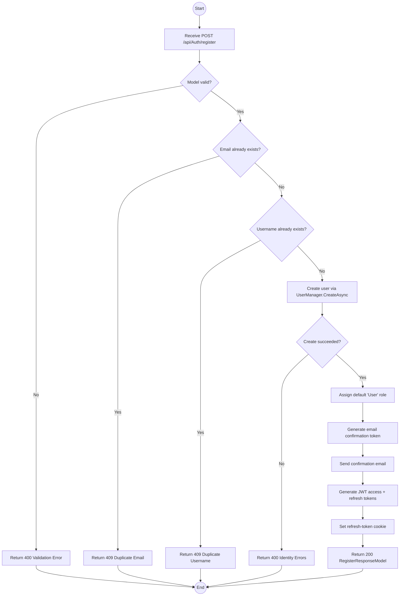
```mermaid
flowchart TD
    Start((Start))

    Start --> ReceiveRequest[Receive POST /api/Auth/register]
    ReceiveRequest --> ValidateModel{Model valid?}

    ValidateModel -->|No| ReturnValidationError[Return 400 Validation Error]
    ValidateModel -->|Yes| CheckEmail{Email already exists?}

    CheckEmail -->|Yes| ReturnDuplicateEmail[Return 409 Duplicate Email]
    CheckEmail -->|No| CheckUsername{Username already exists?}

    CheckUsername -->|Yes| ReturnDuplicateUsername[Return 409 Duplicate Username]
    CheckUsername -->|No| CreateUser[Create user via UserManager.CreateAsync]

    CreateUser --> CreateSuccess{Create succeeded?}
    CreateSuccess -->|No| ReturnIdentityErrors[Return 400 Identity Errors]
    CreateSuccess -->|Yes| AssignRole[Assign default 'User' role]

    AssignRole --> GenerateConfirmToken[Generate email confirmation token]
    GenerateConfirmToken --> SendConfirmEmail[Send confirmation email]
    SendConfirmEmail --> GenerateJwt[Generate JWT access + refresh tokens]
    GenerateJwt --> SetCookie[Set refresh-token cookie]
    SetCookie --> ReturnTokens[Return 200 RegisterResponseModel]

    ReturnValidationError --> End((End))
    ReturnDuplicateEmail --> End
    ReturnDuplicateUsername --> End
    ReturnIdentityErrors --> End
    ReturnTokens --> End
```

### Draw.io Drawing Guidelines
Start / End → oval | Process → rectangle | Decision → diamond | Arrow → flow direction | Direction: top → bottom

---

## Flowchart — User Login

### Description
A user submits credentials. The system validates input, finds the user, checks email confirmation and lockout, verifies the password, generates JWT tokens, and sets a refresh-token cookie.

### Verified Sources
- `ClassifiedAds.Modules.Identity/Controllers/AuthController.cs` — `Login()` action
- `UserManager<User>` — `FindByEmailAsync`, `CheckPasswordAsync`, `IsLockedOutAsync`
- `IJwtTokenService` — token generation

### Process Steps
1. Receive `POST /api/Auth/login` with `LoginModel`.
2. Validate model.
3. Find user by email.
4. Check if account is locked out.
5. Check if email is confirmed.
6. Verify password via `CheckPasswordAsync`.
7. Reset access-failed count on success.
8. Generate JWT access token and refresh token.
9. Set refresh-token cookie.
10. Return `LoginResponseModel`.

### Mermaid Flowchart

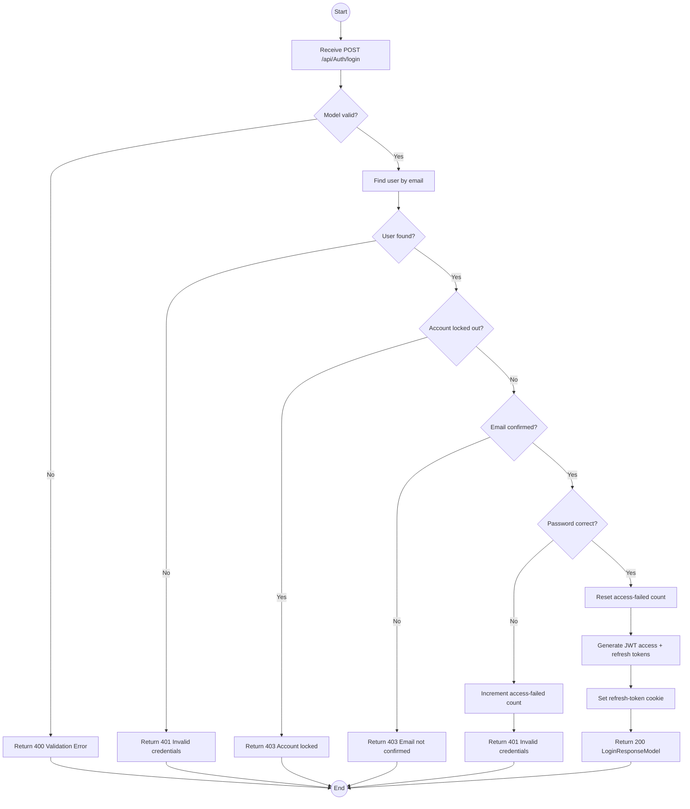
```mermaid
flowchart TD
    Start((Start))

    Start --> ReceiveRequest[Receive POST /api/Auth/login]
    ReceiveRequest --> ValidateModel{Model valid?}

    ValidateModel -->|No| ReturnValidation[Return 400 Validation Error]
    ValidateModel -->|Yes| FindUser[Find user by email]

    FindUser --> UserFound{User found?}
    UserFound -->|No| ReturnUnauthorized[Return 401 Invalid credentials]
    UserFound -->|Yes| CheckLockout{Account locked out?}

    CheckLockout -->|Yes| ReturnLocked[Return 403 Account locked]
    CheckLockout -->|No| CheckEmailConfirmed{Email confirmed?}

    CheckEmailConfirmed -->|No| ReturnUnconfirmed[Return 403 Email not confirmed]
    CheckEmailConfirmed -->|Yes| VerifyPassword{Password correct?}

    VerifyPassword -->|No| IncrementFailedCount[Increment access-failed count]
    IncrementFailedCount --> ReturnUnauthorized2[Return 401 Invalid credentials]
    VerifyPassword -->|Yes| ResetFailedCount[Reset access-failed count]

    ResetFailedCount --> GenerateJwt[Generate JWT access + refresh tokens]
    GenerateJwt --> SetCookie[Set refresh-token cookie]
    SetCookie --> ReturnTokens[Return 200 LoginResponseModel]

    ReturnValidation --> End((End))
    ReturnUnauthorized --> End
    ReturnLocked --> End
    ReturnUnconfirmed --> End
    ReturnUnauthorized2 --> End
    ReturnTokens --> End
```

### Draw.io Drawing Guidelines
Start / End → oval | Process → rectangle | Decision → diamond | Arrow → flow direction | Direction: top → bottom

---

## Flowchart — Token Refresh

### Description
The client requests a new access token using a refresh token (sent via cookie or body). The system validates the refresh token, looks up the user, and generates a new token pair.

### Verified Sources
- `ClassifiedAds.Modules.Identity/Controllers/AuthController.cs` — `RefreshToken()` action
- `IJwtTokenService` — token validation and generation
- Private helper `ResolveRefreshToken` — reads from cookie or body

### Process Steps
1. Receive `POST /api/Auth/refresh-token`.
2. Resolve refresh token from cookie or request body.
3. Validate the refresh token.
4. Look up user associated with the token.
5. Generate new JWT access token and new refresh token.
6. Set new refresh-token cookie.
7. Return new tokens.

### Mermaid Flowchart

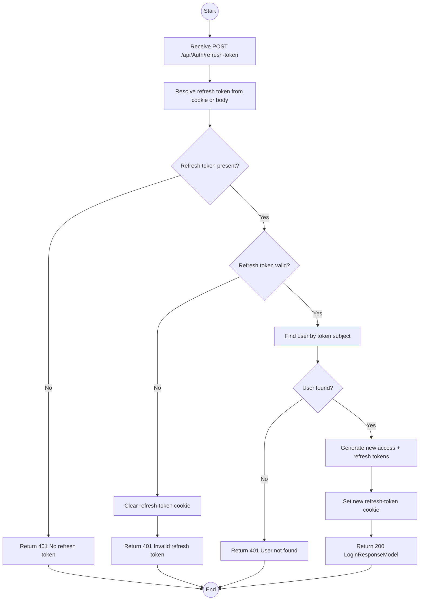
```mermaid
flowchart TD
    Start((Start))

    Start --> ReceiveRequest[Receive POST /api/Auth/refresh-token]
    ReceiveRequest --> ResolveToken[Resolve refresh token from cookie or body]

    ResolveToken --> HasToken{Refresh token present?}
    HasToken -->|No| ReturnUnauthorized[Return 401 No refresh token]
    HasToken -->|Yes| ValidateToken{Refresh token valid?}

    ValidateToken -->|No| ClearCookie[Clear refresh-token cookie]
    ClearCookie --> ReturnInvalid[Return 401 Invalid refresh token]
    ValidateToken -->|Yes| FindUser[Find user by token subject]

    FindUser --> UserFound{User found?}
    UserFound -->|No| ReturnUnauthorized2[Return 401 User not found]
    UserFound -->|Yes| GenerateNewTokens[Generate new access + refresh tokens]

    GenerateNewTokens --> SetCookie[Set new refresh-token cookie]
    SetCookie --> ReturnTokens[Return 200 LoginResponseModel]

    ReturnUnauthorized --> End((End))
    ReturnInvalid --> End
    ReturnUnauthorized2 --> End
    ReturnTokens --> End
```

### Draw.io Drawing Guidelines
Start / End → oval | Process → rectangle | Decision → diamond | Arrow → flow direction | Direction: top → bottom

---

## Flowchart — Logout

### Description
An authenticated user logs out. The system blacklists the current access token and clears the refresh-token cookie.

### Verified Sources
- `ClassifiedAds.Modules.Identity/Controllers/AuthController.cs` — `Logout()` action
- `ITokenBlacklistService` — `BlacklistAsync`
- Private helper `BlacklistCurrentAccessToken`, `ClearRefreshTokenCookie`

### Process Steps
1. Receive `POST /api/Auth/logout` (Authorized).
2. Blacklist the current access token.
3. Clear the refresh-token cookie.
4. Return 200 OK.

### Mermaid Flowchart

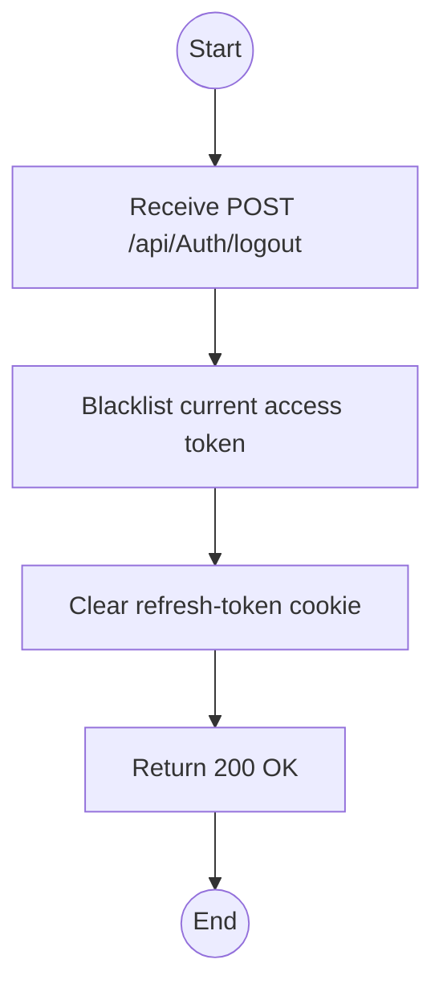
```mermaid
flowchart TD
    Start((Start))

    Start --> ReceiveRequest[Receive POST /api/Auth/logout]
    ReceiveRequest --> Blacklist[Blacklist current access token]
    Blacklist --> ClearCookie[Clear refresh-token cookie]
    ClearCookie --> ReturnOk[Return 200 OK]
    ReturnOk --> End((End))
```

### Draw.io Drawing Guidelines
Start / End → oval | Process → rectangle | Decision → diamond | Arrow → flow direction | Direction: top → bottom

---

## Flowchart — Forgot Password

### Description
An unauthenticated user requests a password-reset email. The system finds the user by email, generates a reset token, and sends a password-reset email.

### Verified Sources
- `ClassifiedAds.Modules.Identity/Controllers/AuthController.cs` — `ForgotPassword()` action
- `UserManager<User>` — `FindByEmailAsync`, `GeneratePasswordResetTokenAsync`
- `IEmailMessageService` — `CreateEmailMessageAsync`

### Process Steps
1. Receive `POST /api/Auth/forgot-password`.
2. Validate email.
3. Find user by email.
4. If user not found, return 200 OK (security: no user enumeration).
5. Generate password-reset token.
6. Send password-reset email.
7. Return 200 OK.

### Mermaid Flowchart

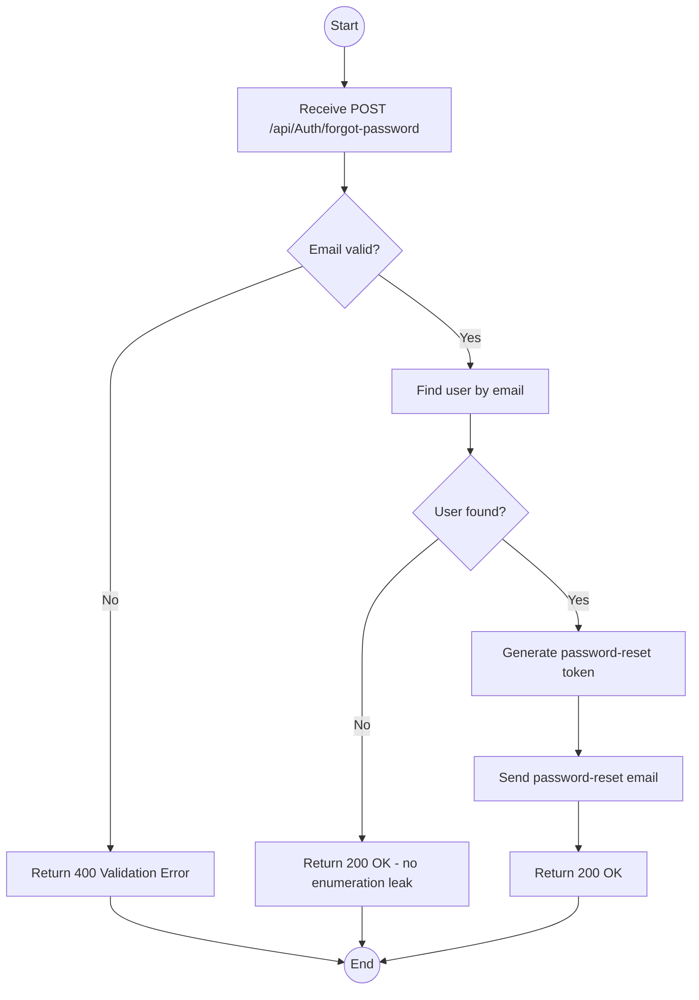
```mermaid
flowchart TD
    Start((Start))

    Start --> ReceiveRequest[Receive POST /api/Auth/forgot-password]
    ReceiveRequest --> ValidateEmail{Email valid?}

    ValidateEmail -->|No| ReturnValidation[Return 400 Validation Error]
    ValidateEmail -->|Yes| FindUser[Find user by email]

    FindUser --> UserFound{User found?}
    UserFound -->|No| ReturnOkSilent[Return 200 OK - no enumeration leak]
    UserFound -->|Yes| GenerateResetToken[Generate password-reset token]

    GenerateResetToken --> SendResetEmail[Send password-reset email]
    SendResetEmail --> ReturnOk[Return 200 OK]

    ReturnValidation --> End((End))
    ReturnOkSilent --> End
    ReturnOk --> End
```

### Draw.io Drawing Guidelines
Start / End → oval | Process → rectangle | Decision → diamond | Arrow → flow direction | Direction: top → bottom

---

## Flowchart — Reset Password

### Description
A user submits a new password along with the reset token received via email. The system validates the token and resets the password.

### Verified Sources
- `ClassifiedAds.Modules.Identity/Controllers/AuthController.cs` — `ResetPassword()` action
- `UserManager<User>` — `FindByEmailAsync`, `ResetPasswordAsync`

### Process Steps
1. Receive `POST /api/Auth/reset-password`.
2. Validate model (email, token, new password).
3. Find user by email.
4. Reset password via `UserManager.ResetPasswordAsync`.
5. Return result.

### Mermaid Flowchart

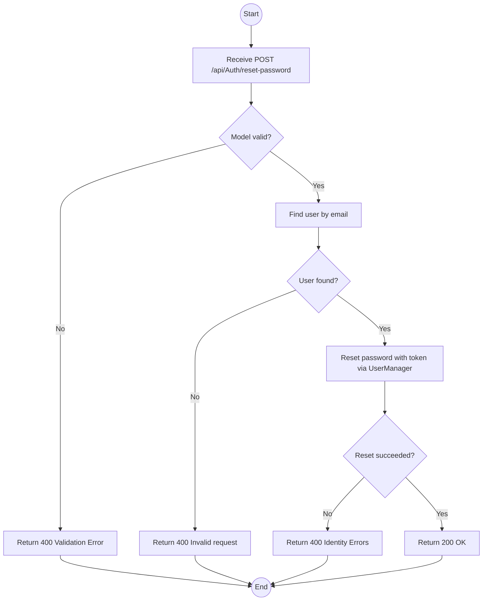
```mermaid
flowchart TD
    Start((Start))

    Start --> ReceiveRequest[Receive POST /api/Auth/reset-password]
    ReceiveRequest --> ValidateModel{Model valid?}

    ValidateModel -->|No| ReturnValidation[Return 400 Validation Error]
    ValidateModel -->|Yes| FindUser[Find user by email]

    FindUser --> UserFound{User found?}
    UserFound -->|No| ReturnNotFound[Return 400 Invalid request]
    UserFound -->|Yes| ResetPassword[Reset password with token via UserManager]

    ResetPassword --> ResetSuccess{Reset succeeded?}
    ResetSuccess -->|No| ReturnErrors[Return 400 Identity Errors]
    ResetSuccess -->|Yes| ReturnOk[Return 200 OK]

    ReturnValidation --> End((End))
    ReturnNotFound --> End
    ReturnErrors --> End
    ReturnOk --> End
```

### Draw.io Drawing Guidelines
Start / End → oval | Process → rectangle | Decision → diamond | Arrow → flow direction | Direction: top → bottom

---

## Flowchart — Change Password

### Description
An authenticated user changes their password by providing the current password and a new password.

### Verified Sources
- `ClassifiedAds.Modules.Identity/Controllers/AuthController.cs` — `ChangePassword()` action
- `UserManager<User>` — `ChangePasswordAsync`

### Process Steps
1. Receive `POST /api/Auth/change-password` (Authorized).
2. Validate model (current password, new password, confirm password).
3. Get current user from claims.
4. Change password via `UserManager.ChangePasswordAsync`.
5. Return result.

### Mermaid Flowchart

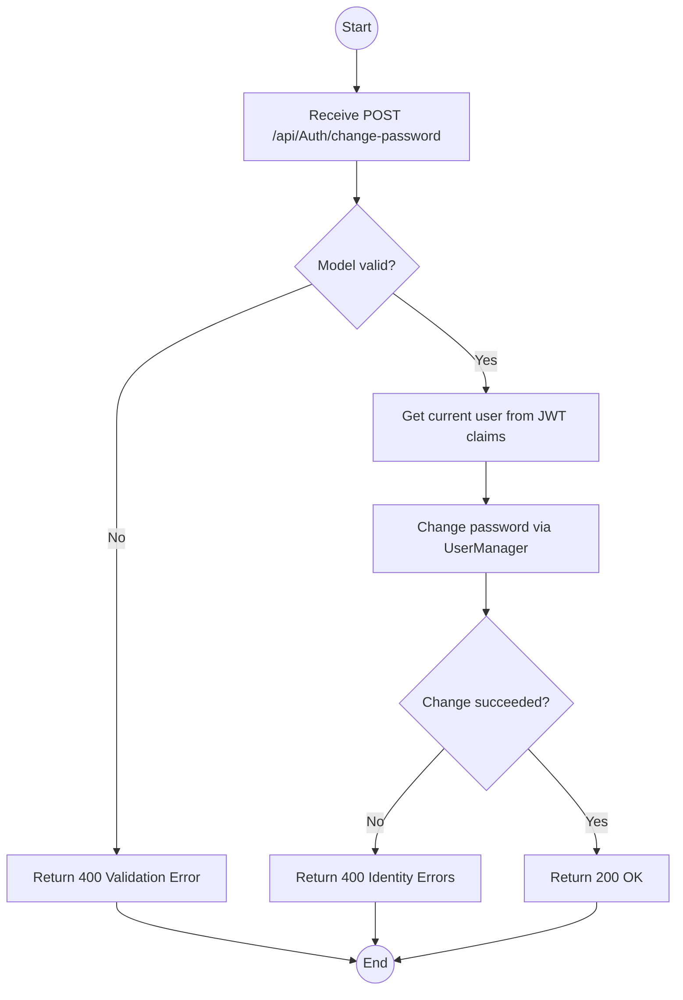
```mermaid
flowchart TD
    Start((Start))

    Start --> ReceiveRequest[Receive POST /api/Auth/change-password]
    ReceiveRequest --> ValidateModel{Model valid?}

    ValidateModel -->|No| ReturnValidation[Return 400 Validation Error]
    ValidateModel -->|Yes| GetCurrentUser[Get current user from JWT claims]

    GetCurrentUser --> ChangePassword[Change password via UserManager]
    ChangePassword --> ChangeSuccess{Change succeeded?}

    ChangeSuccess -->|No| ReturnErrors[Return 400 Identity Errors]
    ChangeSuccess -->|Yes| ReturnOk[Return 200 OK]

    ReturnValidation --> End((End))
    ReturnErrors --> End
    ReturnOk --> End
```

### Draw.io Drawing Guidelines
Start / End → oval | Process → rectangle | Decision → diamond | Arrow → flow direction | Direction: top → bottom

---

## Flowchart — Email Confirmation

### Description
An unauthenticated user confirms their email address by submitting the confirmation token received via email.

### Verified Sources
- `ClassifiedAds.Modules.Identity/Controllers/AuthController.cs` — `ConfirmEmail()` action
- `UserManager<User>` — `FindByIdAsync`, `ConfirmEmailAsync`

### Process Steps
1. Receive `POST /api/Auth/confirm-email`.
2. Validate model (userId, token).
3. Find user by ID.
4. Confirm email via `UserManager.ConfirmEmailAsync`.
5. Return result.

### Mermaid Flowchart

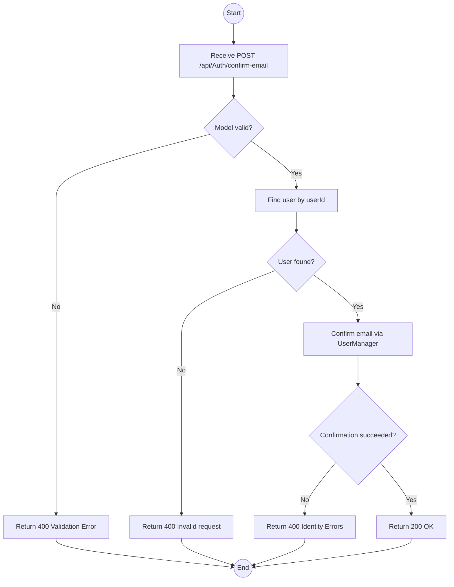
```mermaid
flowchart TD
    Start((Start))

    Start --> ReceiveRequest[Receive POST /api/Auth/confirm-email]
    ReceiveRequest --> ValidateModel{Model valid?}

    ValidateModel -->|No| ReturnValidation[Return 400 Validation Error]
    ValidateModel -->|Yes| FindUser[Find user by userId]

    FindUser --> UserFound{User found?}
    UserFound -->|No| ReturnNotFound[Return 400 Invalid request]
    UserFound -->|Yes| ConfirmEmail[Confirm email via UserManager]

    ConfirmEmail --> ConfirmSuccess{Confirmation succeeded?}
    ConfirmSuccess -->|No| ReturnErrors[Return 400 Identity Errors]
    ConfirmSuccess -->|Yes| ReturnOk[Return 200 OK]

    ReturnValidation --> End((End))
    ReturnNotFound --> End
    ReturnErrors --> End
    ReturnOk --> End
```

### Draw.io Drawing Guidelines
Start / End → oval | Process → rectangle | Decision → diamond | Arrow → flow direction | Direction: top → bottom

---

## Flowchart — Avatar Upload

### Description
An authenticated user uploads an avatar image. The system validates the file type and size, detects image format via magic bytes, stores the file, and updates the user profile.

### Verified Sources
- `ClassifiedAds.Modules.Identity/Controllers/AuthController.cs` — `UploadAvatar()` action
- Private helper `DetectImageTypeFromMagicBytesAsync`
- `IFileStorageManager` — file storage
- Request size limit: 2 MB

### Process Steps
1. Receive `POST /api/Auth/me/avatar` with `IFormFile` (Authorized).
2. Validate file is present and not empty.
3. Validate file size <= 2 MB.
4. Detect image type from magic bytes (JPEG, PNG, GIF, WebP).
5. Validate detected type is an allowed image format.
6. Store file via `IFileStorageManager`.
7. Update user profile with avatar URL.
8. Return avatar URL.

### Mermaid Flowchart

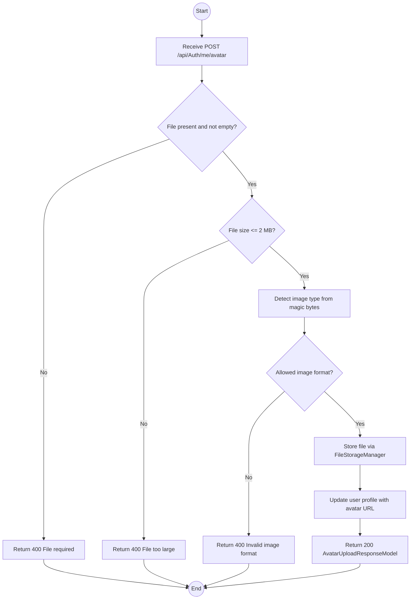
```mermaid
flowchart TD
    Start((Start))

    Start --> ReceiveRequest[Receive POST /api/Auth/me/avatar]
    ReceiveRequest --> FilePresent{File present and not empty?}

    FilePresent -->|No| ReturnValidation[Return 400 File required]
    FilePresent -->|Yes| CheckSize{File size <= 2 MB?}

    CheckSize -->|No| ReturnTooLarge[Return 400 File too large]
    CheckSize -->|Yes| DetectType[Detect image type from magic bytes]

    DetectType --> ValidType{Allowed image format?}
    ValidType -->|No| ReturnInvalidType[Return 400 Invalid image format]
    ValidType -->|Yes| StoreFile[Store file via FileStorageManager]

    StoreFile --> UpdateProfile[Update user profile with avatar URL]
    UpdateProfile --> ReturnUrl[Return 200 AvatarUploadResponseModel]

    ReturnValidation --> End((End))
    ReturnTooLarge --> End
    ReturnInvalidType --> End
    ReturnUrl --> End
```

### Draw.io Drawing Guidelines
Start / End → oval | Process → rectangle | Decision → diamond | Arrow → flow direction | Direction: top → bottom

---

## Flowchart — API Specification Upload

### Description
A user uploads an API specification file (OpenAPI or Postman). The system validates format, checks ownership and subscription limits, uploads the file to storage, creates a specification record, and optionally auto-activates it.

### Verified Sources
- `ClassifiedAds.Modules.ApiDocumentation/Controllers/SpecificationsController.cs` — `Upload()` action
- `ClassifiedAds.Modules.ApiDocumentation/Commands/UploadApiSpecificationCommand.cs` — full handler

### Process Steps
1. Receive `POST /api/projects/{projectId}/specifications/upload` with file.
2. Validate upload method (StorageGatewayContract).
3. Validate file: present, size <= 10 MB, extension (.json/.yaml/.yml).
4. Validate specification name (required, max 200 chars).
5. Validate source type (OpenAPI or Postman).
6. Validate file content matches declared source type.
7. Load project, verify exists and user ownership.
8. Check subscription storage limit (MaxStorageMB).
9. Upload file to Storage module via gateway.
10. Create `ApiSpecification` entity with `ParseStatus.Pending`.
11. If `AutoActivate`: deactivate old spec, activate new one.
12. Save in transaction.
13. Return specification ID.

### Mermaid Flowchart

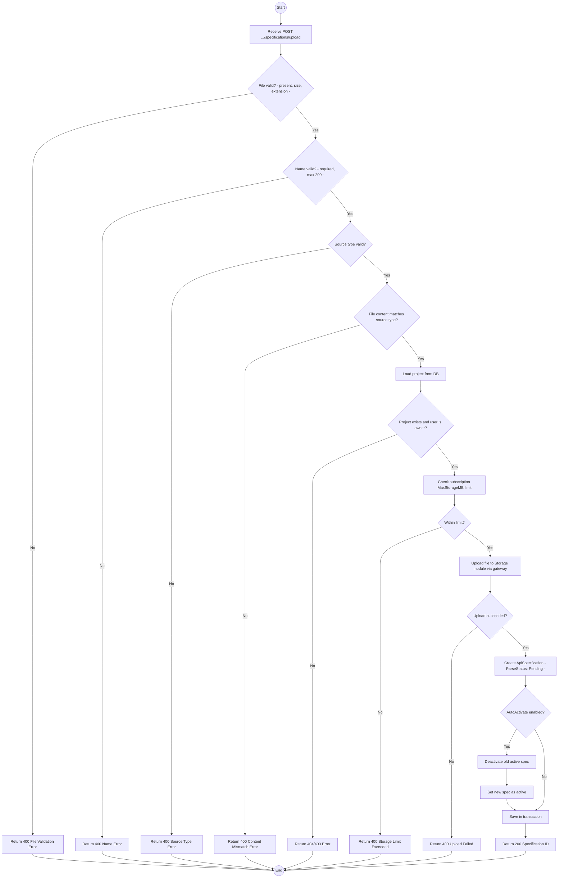
```mermaid
flowchart TD
    Start((Start))

    Start --> ReceiveRequest[Receive POST .../specifications/upload]
    ReceiveRequest --> ValidateFile{File valid? - present, size, extension -}

    ValidateFile -->|No| ReturnFileError[Return 400 File Validation Error]
    ValidateFile -->|Yes| ValidateName{Name valid? - required, max 200 -}

    ValidateName -->|No| ReturnNameError[Return 400 Name Error]
    ValidateName -->|Yes| ValidateSourceType{Source type valid?}

    ValidateSourceType -->|No| ReturnSourceError[Return 400 Source Type Error]
    ValidateSourceType -->|Yes| ValidateContent{File content matches source type?}

    ValidateContent -->|No| ReturnContentError[Return 400 Content Mismatch Error]
    ValidateContent -->|Yes| LoadProject[Load project from DB]

    LoadProject --> ProjectExists{Project exists and user is owner?}
    ProjectExists -->|No| ReturnForbidden[Return 404/403 Error]
    ProjectExists -->|Yes| CheckStorageLimit[Check subscription MaxStorageMB limit]

    CheckStorageLimit --> LimitOk{Within limit?}
    LimitOk -->|No| ReturnLimitError[Return 400 Storage Limit Exceeded]
    LimitOk -->|Yes| UploadToStorage[Upload file to Storage module via gateway]

    UploadToStorage --> UploadSuccess{Upload succeeded?}
    UploadSuccess -->|No| ReturnUploadError[Return 400 Upload Failed]
    UploadSuccess -->|Yes| CreateSpec[Create ApiSpecification - ParseStatus: Pending -]

    CreateSpec --> AutoActivate{AutoActivate enabled?}
    AutoActivate -->|Yes| DeactivateOld[Deactivate old active spec]
    DeactivateOld --> ActivateNew[Set new spec as active]
    ActivateNew --> SaveTransaction[Save in transaction]
    AutoActivate -->|No| SaveTransaction

    SaveTransaction --> ReturnSpecId[Return 200 Specification ID]

    ReturnFileError --> End((End))
    ReturnNameError --> End
    ReturnSourceError --> End
    ReturnContentError --> End
    ReturnForbidden --> End
    ReturnLimitError --> End
    ReturnUploadError --> End
    ReturnSpecId --> End
```

### Draw.io Drawing Guidelines
Start / End → oval | Process → rectangle | Decision → diamond | Arrow → flow direction | Direction: top → bottom

---

## Flowchart — API Specification Parsing

### Description
After an API specification is uploaded, the system parses the uploaded file to extract endpoints, parameters, responses, and security schemes. This is triggered as a background/event-driven process.

### Verified Sources
- `ClassifiedAds.Modules.ApiDocumentation/Commands/ParseUploadedSpecificationCommand.cs` — full handler
- `ISpecificationParser` implementations — `OpenApiSpecificationParser`, `PostmanSpecificationParser`

### Process Steps
1. Command dispatched with `SpecificationId`.
2. Load specification from DB.
3. Idempotency guard: skip if `ParseStatus` is not `Pending`.
4. Ensure file is associated with the specification.
5. Select appropriate parser based on `SourceType`.
6. Download file from Storage module.
7. Parse the file via `ISpecificationParser.ParseAsync`.
8. If parse fails, set `ParseStatus.Failed` with errors.
9. If parse succeeds, persist in transaction: delete old endpoints/schemes, create new endpoints/parameters/responses/security schemes.
10. Update spec: `ParseStatus.Success`, set `ParsedAt`.

### Mermaid Flowchart

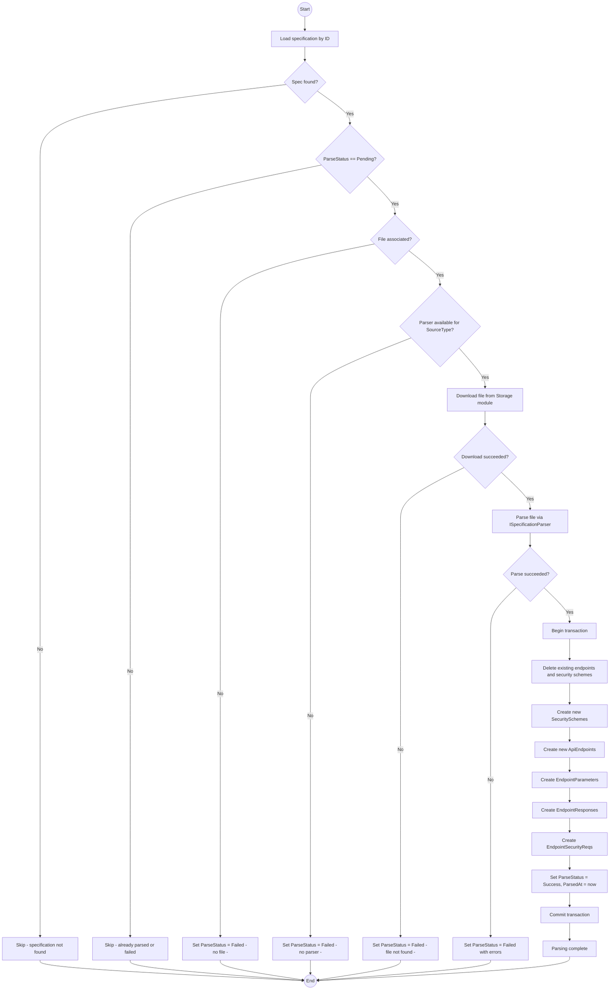
```mermaid
flowchart TD
    Start((Start))

    Start --> LoadSpec[Load specification by ID]
    LoadSpec --> SpecFound{Spec found?}

    SpecFound -->|No| SkipNotFound[Skip - specification not found]
    SpecFound -->|Yes| CheckStatus{ParseStatus == Pending?}

    CheckStatus -->|No| SkipNotPending[Skip - already parsed or failed]
    CheckStatus -->|Yes| HasFile{File associated?}

    HasFile -->|No| SetFailed1[Set ParseStatus = Failed - no file -]
    HasFile -->|Yes| SelectParser{Parser available for SourceType?}

    SelectParser -->|No| SetFailed2[Set ParseStatus = Failed - no parser -]
    SelectParser -->|Yes| DownloadFile[Download file from Storage module]

    DownloadFile --> DownloadOk{Download succeeded?}
    DownloadOk -->|No| SetFailed3[Set ParseStatus = Failed - file not found -]
    DownloadOk -->|Yes| ParseFile[Parse file via ISpecificationParser]

    ParseFile --> ParseOk{Parse succeeded?}
    ParseOk -->|No| SetFailed4[Set ParseStatus = Failed with errors]
    ParseOk -->|Yes| BeginTransaction[Begin transaction]

    BeginTransaction --> DeleteOldData[Delete existing endpoints and security schemes]
    DeleteOldData --> CreateSchemes[Create new SecuritySchemes]
    CreateSchemes --> CreateEndpoints[Create new ApiEndpoints]
    CreateEndpoints --> CreateParams[Create EndpointParameters]
    CreateParams --> CreateResponses[Create EndpointResponses]
    CreateResponses --> CreateSecReqs[Create EndpointSecurityReqs]
    CreateSecReqs --> UpdateSpecStatus[Set ParseStatus = Success, ParsedAt = now]
    UpdateSpecStatus --> CommitTransaction[Commit transaction]

    CommitTransaction --> Done[Parsing complete]

    SkipNotFound --> End((End))
    SkipNotPending --> End
    SetFailed1 --> End
    SetFailed2 --> End
    SetFailed3 --> End
    SetFailed4 --> End
    Done --> End
```

### Draw.io Drawing Guidelines
Start / End → oval | Process → rectangle | Decision → diamond | Arrow → flow direction | Direction: top → bottom

---

## Flowchart — cURL Import

### Description
A user imports an API endpoint by pasting a cURL command. The system parses the cURL, extracts HTTP method/path/headers/body/query params, creates a specification and endpoint record.

### Verified Sources
- `ClassifiedAds.Modules.ApiDocumentation/Controllers/SpecificationsController.cs` — `ImportCurl()` action
- `ClassifiedAds.Modules.ApiDocumentation/Commands/ImportCurlCommand.cs` — full handler
- `ClassifiedAds.Modules.ApiDocumentation/Services/CurlParser.cs`

### Process Steps
1. Receive `POST /api/projects/{projectId}/specifications/curl-import`.
2. Validate input (name, cURL command).
3. Parse cURL command via `CurlParser.Parse`.
4. Load project, verify ownership.
5. Check subscription limit (MaxEndpointsPerProject).
6. Map HTTP method.
7. Create `ApiSpecification` with `SourceType.cURL`, `ParseStatus.Success`.
8. Create `ApiEndpoint`.
9. Create path parameters, query parameters, header parameters, body parameter.
10. Optionally auto-activate and deactivate old spec.
11. Save in transaction.

### Mermaid Flowchart

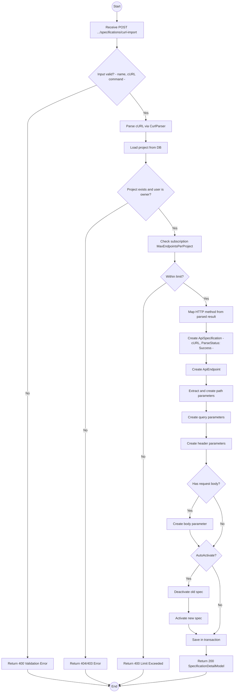
```mermaid
flowchart TD
    Start((Start))

    Start --> ReceiveRequest[Receive POST .../specifications/curl-import]
    ReceiveRequest --> ValidateInput{Input valid? - name, cURL command -}

    ValidateInput -->|No| ReturnValidation[Return 400 Validation Error]
    ValidateInput -->|Yes| ParseCurl[Parse cURL via CurlParser]

    ParseCurl --> LoadProject[Load project from DB]
    LoadProject --> ProjectOk{Project exists and user is owner?}

    ProjectOk -->|No| ReturnForbidden[Return 404/403 Error]
    ProjectOk -->|Yes| CheckLimit[Check subscription MaxEndpointsPerProject]

    CheckLimit --> LimitOk{Within limit?}
    LimitOk -->|No| ReturnLimitError[Return 400 Limit Exceeded]
    LimitOk -->|Yes| MapMethod[Map HTTP method from parsed result]

    MapMethod --> CreateSpec[Create ApiSpecification - cURL, ParseStatus: Success -]
    CreateSpec --> CreateEndpoint[Create ApiEndpoint]

    CreateEndpoint --> CreatePathParams[Extract and create path parameters]
    CreatePathParams --> CreateQueryParams[Create query parameters]
    CreateQueryParams --> CreateHeaders[Create header parameters]
    CreateHeaders --> CreateBody{Has request body?}

    CreateBody -->|Yes| CreateBodyParam[Create body parameter]
    CreateBodyParam --> CheckAutoActivate{AutoActivate?}
    CreateBody -->|No| CheckAutoActivate

    CheckAutoActivate -->|Yes| DeactivateOld[Deactivate old spec]
    DeactivateOld --> ActivateNew[Activate new spec]
    ActivateNew --> SaveTransaction[Save in transaction]
    CheckAutoActivate -->|No| SaveTransaction

    SaveTransaction --> ReturnSpec[Return 200 SpecificationDetailModel]

    ReturnValidation --> End((End))
    ReturnForbidden --> End
    ReturnLimitError --> End
    ReturnSpec --> End
```

### Draw.io Drawing Guidelines
Start / End → oval | Process → rectangle | Decision → diamond | Arrow → flow direction | Direction: top → bottom

---

## Flowchart — Specification Activation

### Description
A user activates or deactivates an API specification within a project. Only one specification can be active per project at a time.

### Verified Sources
- `ClassifiedAds.Modules.ApiDocumentation/Controllers/SpecificationsController.cs` — `Activate()` and `Deactivate()` actions
- `ClassifiedAds.Modules.ApiDocumentation/Commands/ActivateSpecificationCommand.cs`

### Process Steps
1. Receive `PUT /api/projects/{projectId}/specifications/{specId}/activate`.
2. Load project, verify ownership.
3. Load specification, verify belongs to project.
4. Deactivate currently active spec (if any).
5. Set new spec as active.
6. Update project's `ActiveSpecId`.
7. Save changes.

### Mermaid Flowchart

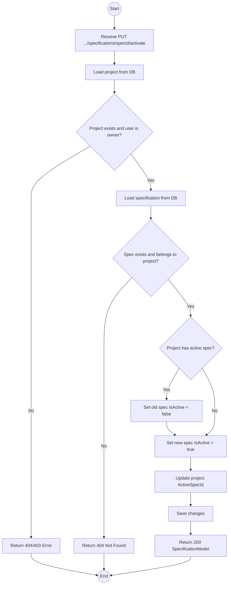
```mermaid
flowchart TD
    Start((Start))

    Start --> ReceiveRequest[Receive PUT .../specifications/specId/activate]
    ReceiveRequest --> LoadProject[Load project from DB]

    LoadProject --> ProjectOk{Project exists and user is owner?}
    ProjectOk -->|No| ReturnForbidden[Return 404/403 Error]
    ProjectOk -->|Yes| LoadSpec[Load specification from DB]

    LoadSpec --> SpecOk{Spec exists and belongs to project?}
    SpecOk -->|No| ReturnNotFound[Return 404 Not Found]
    SpecOk -->|Yes| DeactivateOld{Project has active spec?}

    DeactivateOld -->|Yes| SetOldInactive[Set old spec IsActive = false]
    SetOldInactive --> ActivateNew[Set new spec IsActive = true]
    DeactivateOld -->|No| ActivateNew

    ActivateNew --> UpdateProject[Update project ActiveSpecId]
    UpdateProject --> SaveChanges[Save changes]
    SaveChanges --> ReturnSpec[Return 200 SpecificationModel]

    ReturnForbidden --> End((End))
    ReturnNotFound --> End
    ReturnSpec --> End
```

### Draw.io Drawing Guidelines
Start / End → oval | Process → rectangle | Decision → diamond | Arrow → flow direction | Direction: top → bottom

---

## Flowchart — Test Order Proposal

### Description
A user creates a new API test order proposal for a test suite. The system builds an optimal endpoint execution order using algorithms, supersedes old proposals, and sets the suite to pending review.

### Verified Sources
- `ClassifiedAds.Modules.TestGeneration/Controllers/TestOrderController.cs` — `Propose()` action
- `ClassifiedAds.Modules.TestGeneration/Commands/ProposeApiTestOrderCommand.cs` — full handler
- `IApiTestOrderService` — `BuildProposalOrderAsync`

### Process Steps
1. Receive `POST /api/test-suites/{suiteId}/order-proposals`.
2. Validate `TestSuiteId` and `CurrentUserId`.
3. Load test suite, verify ownership.
4. Verify specification matches suite.
5. Fallback: use suite's persisted `SelectedEndpointIds` if none provided.
6. Build proposed order via `IApiTestOrderService.BuildProposalOrderAsync`.
7. Supersede existing proposals (Pending/Approved/ModifiedAndApproved → Superseded).
8. Create new `TestOrderProposal` with `ProposalStatus.Pending`.
9. Update suite `ApprovalStatus` to `PendingReview`.
10. Save changes.

### Mermaid Flowchart

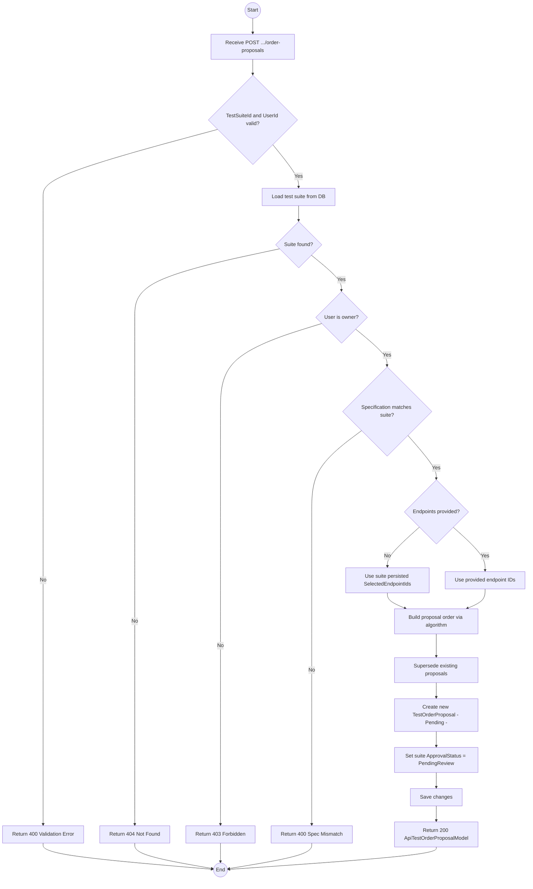
```mermaid
flowchart TD
    Start((Start))

    Start --> ReceiveRequest[Receive POST .../order-proposals]
    ReceiveRequest --> ValidateInput{TestSuiteId and UserId valid?}

    ValidateInput -->|No| ReturnValidation[Return 400 Validation Error]
    ValidateInput -->|Yes| LoadSuite[Load test suite from DB]

    LoadSuite --> SuiteFound{Suite found?}
    SuiteFound -->|No| ReturnNotFound[Return 404 Not Found]
    SuiteFound -->|Yes| CheckOwner{User is owner?}

    CheckOwner -->|No| ReturnForbidden[Return 403 Forbidden]
    CheckOwner -->|Yes| VerifySpec{Specification matches suite?}

    VerifySpec -->|No| ReturnSpecError[Return 400 Spec Mismatch]
    VerifySpec -->|Yes| ResolveEndpoints{Endpoints provided?}

    ResolveEndpoints -->|No| UseSuiteEndpoints[Use suite persisted SelectedEndpointIds]
    ResolveEndpoints -->|Yes| UseProvidedEndpoints[Use provided endpoint IDs]

    UseSuiteEndpoints --> BuildOrder[Build proposal order via algorithm]
    UseProvidedEndpoints --> BuildOrder

    BuildOrder --> SupersedeOld[Supersede existing proposals]
    SupersedeOld --> CreateProposal[Create new TestOrderProposal - Pending -]
    CreateProposal --> UpdateSuiteStatus[Set suite ApprovalStatus = PendingReview]
    UpdateSuiteStatus --> SaveChanges[Save changes]
    SaveChanges --> ReturnProposal[Return 200 ApiTestOrderProposalModel]

    ReturnValidation --> End((End))
    ReturnNotFound --> End
    ReturnForbidden --> End
    ReturnSpecError --> End
    ReturnProposal --> End
```

### Draw.io Drawing Guidelines
Start / End → oval | Process → rectangle | Decision → diamond | Arrow → flow direction | Direction: top → bottom

---

## Flowchart — Test Order Reorder

### Description
A user manually reorders the endpoints in a pending test order proposal. The system validates the reordered set matches the proposed set, updates the user-modified order, and saves.

### Verified Sources
- `ClassifiedAds.Modules.TestGeneration/Controllers/TestOrderController.cs` — `Reorder()` action
- `ClassifiedAds.Modules.TestGeneration/Commands/ReorderApiTestOrderCommand.cs` — full handler

### Process Steps
1. Receive `PUT /api/test-suites/{suiteId}/order-proposals/{proposalId}/reorder`.
2. Validate `ProposalId`.
3. Load suite, verify ownership.
4. Load proposal, verify belongs to suite.
5. Ensure proposal is in `Pending` status.
6. Set row version for concurrency.
7. Validate reordered endpoint set matches proposed set.
8. Build reordered items with new `OrderIndex`.
9. Serialize to `UserModifiedOrder`.
10. Save with concurrency check.

### Mermaid Flowchart

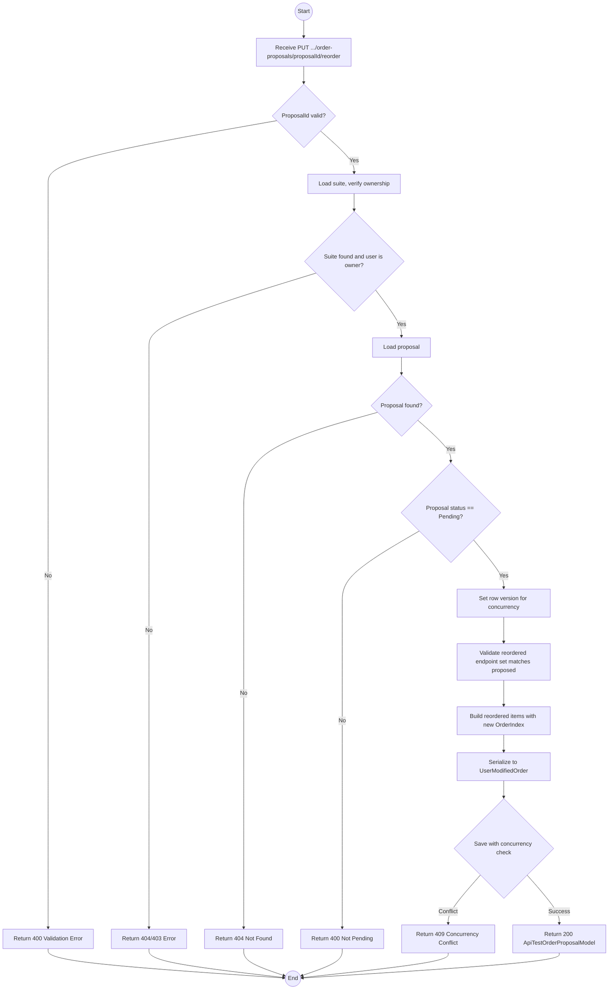
```mermaid
flowchart TD
    Start((Start))

    Start --> ReceiveRequest[Receive PUT .../order-proposals/proposalId/reorder]
    ReceiveRequest --> ValidateInput{ProposalId valid?}

    ValidateInput -->|No| ReturnValidation[Return 400 Validation Error]
    ValidateInput -->|Yes| LoadSuite[Load suite, verify ownership]

    LoadSuite --> SuiteOk{Suite found and user is owner?}
    SuiteOk -->|No| ReturnError[Return 404/403 Error]
    SuiteOk -->|Yes| LoadProposal[Load proposal]

    LoadProposal --> ProposalFound{Proposal found?}
    ProposalFound -->|No| ReturnNotFound[Return 404 Not Found]
    ProposalFound -->|Yes| CheckPending{Proposal status == Pending?}

    CheckPending -->|No| ReturnStatusError[Return 400 Not Pending]
    CheckPending -->|Yes| SetRowVersion[Set row version for concurrency]

    SetRowVersion --> ValidateSet[Validate reordered endpoint set matches proposed]
    ValidateSet --> BuildReorder[Build reordered items with new OrderIndex]
    BuildReorder --> SerializeOrder[Serialize to UserModifiedOrder]
    SerializeOrder --> SaveChanges{Save with concurrency check}

    SaveChanges -->|Conflict| ReturnConflict[Return 409 Concurrency Conflict]
    SaveChanges -->|Success| ReturnProposal[Return 200 ApiTestOrderProposalModel]

    ReturnValidation --> End((End))
    ReturnError --> End
    ReturnNotFound --> End
    ReturnStatusError --> End
    ReturnConflict --> End
    ReturnProposal --> End
```

### Draw.io Drawing Guidelines
Start / End → oval | Process → rectangle | Decision → diamond | Arrow → flow direction | Direction: top → bottom

---

## Flowchart — Test Order Approval

### Description
A user approves a pending test order proposal. The system determines the final order (user-modified or proposed), updates proposal and suite status atomically with optimistic concurrency control, and supports idempotent re-approval.

### Verified Sources
- `ClassifiedAds.Modules.TestGeneration/Controllers/TestOrderController.cs` — `Approve()` action
- `ClassifiedAds.Modules.TestGeneration/Commands/ApproveApiTestOrderCommand.cs` — full handler

### Process Steps
1. Receive `POST /api/test-suites/{suiteId}/order-proposals/{proposalId}/approve`.
2. Validate `ProposalId`.
3. Load suite, verify ownership.
4. Load proposal.
5. Idempotency check: if already approved/applied, return existing result.
6. Ensure proposal is `Pending`.
7. Determine final order: prefer `UserModifiedOrder` over `ProposedOrder`.
8. Validate final order is not empty.
9. Set proposal status: `Approved` or `ModifiedAndApproved`.
10. Update suite `ApprovalStatus` and `ApprovedById`.
11. Execute in transaction with concurrency control.
12. Return result.

### Mermaid Flowchart

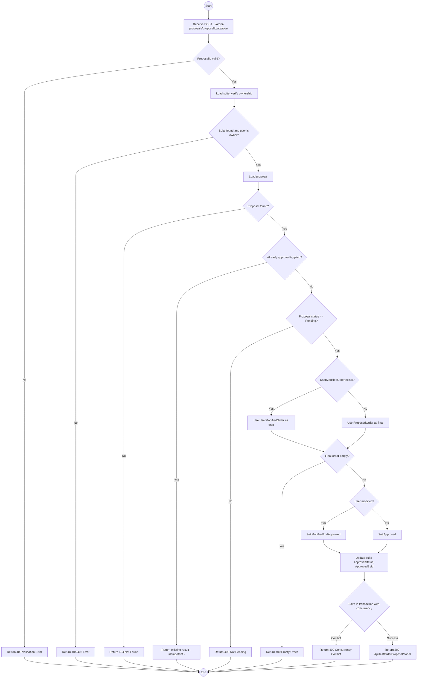
```mermaid
flowchart TD
    Start((Start))

    Start --> ReceiveRequest[Receive POST .../order-proposals/proposalId/approve]
    ReceiveRequest --> ValidateInput{ProposalId valid?}

    ValidateInput -->|No| ReturnValidation[Return 400 Validation Error]
    ValidateInput -->|Yes| LoadSuite[Load suite, verify ownership]

    LoadSuite --> SuiteOk{Suite found and user is owner?}
    SuiteOk -->|No| ReturnError[Return 404/403 Error]
    SuiteOk -->|Yes| LoadProposal[Load proposal]

    LoadProposal --> ProposalFound{Proposal found?}
    ProposalFound -->|No| ReturnNotFound[Return 404 Not Found]
    ProposalFound -->|Yes| IdempotencyCheck{Already approved/applied?}

    IdempotencyCheck -->|Yes| ReturnExisting[Return existing result - idempotent -]
    IdempotencyCheck -->|No| CheckPending{Proposal status == Pending?}

    CheckPending -->|No| ReturnStatusError[Return 400 Not Pending]
    CheckPending -->|Yes| DetermineOrder{UserModifiedOrder exists?}

    DetermineOrder -->|Yes| UseFinalUserOrder[Use UserModifiedOrder as final]
    DetermineOrder -->|No| UseFinalProposed[Use ProposedOrder as final]

    UseFinalUserOrder --> CheckEmpty{Final order empty?}
    UseFinalProposed --> CheckEmpty

    CheckEmpty -->|Yes| ReturnEmptyError[Return 400 Empty Order]
    CheckEmpty -->|No| SetProposalStatus{User modified?}

    SetProposalStatus -->|Yes| StatusModApproved[Set ModifiedAndApproved]
    SetProposalStatus -->|No| StatusApproved[Set Approved]

    StatusModApproved --> UpdateSuite[Update suite ApprovalStatus, ApprovedById]
    StatusApproved --> UpdateSuite

    UpdateSuite --> SaveTransaction{Save in transaction with concurrency}
    SaveTransaction -->|Conflict| ReturnConflict[Return 409 Concurrency Conflict]
    SaveTransaction -->|Success| ReturnResult[Return 200 ApiTestOrderProposalModel]

    ReturnValidation --> End((End))
    ReturnError --> End
    ReturnNotFound --> End
    ReturnExisting --> End
    ReturnStatusError --> End
    ReturnEmptyError --> End
    ReturnConflict --> End
    ReturnResult --> End
```

### Draw.io Drawing Guidelines
Start / End → oval | Process → rectangle | Decision → diamond | Arrow → flow direction | Direction: top → bottom

---

## Flowchart — Test Order Rejection

### Description
A user rejects a pending test order proposal with mandatory review notes. The system updates proposal and suite status atomically with optimistic concurrency control.

### Verified Sources
- `ClassifiedAds.Modules.TestGeneration/Controllers/TestOrderController.cs` — `Reject()` action
- `ClassifiedAds.Modules.TestGeneration/Commands/RejectApiTestOrderCommand.cs` — full handler

### Process Steps
1. Receive `POST /api/test-suites/{suiteId}/order-proposals/{proposalId}/reject`.
2. Validate `ProposalId` and `ReviewNotes` (mandatory).
3. Load suite, verify ownership.
4. Load proposal.
5. Ensure proposal is `Pending`.
6. Set proposal status to `Rejected`, record reviewer and notes.
7. Set suite `ApprovalStatus` to `Rejected`.
8. Execute in transaction with concurrency control.
9. Return result.

### Mermaid Flowchart

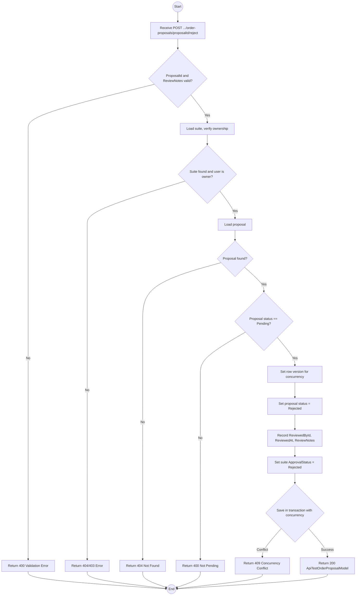
```mermaid
flowchart TD
    Start((Start))

    Start --> ReceiveRequest[Receive POST .../order-proposals/proposalId/reject]
    ReceiveRequest --> ValidateInput{ProposalId and ReviewNotes valid?}

    ValidateInput -->|No| ReturnValidation[Return 400 Validation Error]
    ValidateInput -->|Yes| LoadSuite[Load suite, verify ownership]

    LoadSuite --> SuiteOk{Suite found and user is owner?}
    SuiteOk -->|No| ReturnError[Return 404/403 Error]
    SuiteOk -->|Yes| LoadProposal[Load proposal]

    LoadProposal --> ProposalFound{Proposal found?}
    ProposalFound -->|No| ReturnNotFound[Return 404 Not Found]
    ProposalFound -->|Yes| CheckPending{Proposal status == Pending?}

    CheckPending -->|No| ReturnStatusError[Return 400 Not Pending]
    CheckPending -->|Yes| SetRowVersion[Set row version for concurrency]

    SetRowVersion --> RejectProposal[Set proposal status = Rejected]
    RejectProposal --> RecordReview[Record ReviewedById, ReviewedAt, ReviewNotes]
    RecordReview --> UpdateSuite[Set suite ApprovalStatus = Rejected]
    UpdateSuite --> SaveTransaction{Save in transaction with concurrency}

    SaveTransaction -->|Conflict| ReturnConflict[Return 409 Concurrency Conflict]
    SaveTransaction -->|Success| ReturnResult[Return 200 ApiTestOrderProposalModel]

    ReturnValidation --> End((End))
    ReturnError --> End
    ReturnNotFound --> End
    ReturnStatusError --> End
    ReturnConflict --> End
    ReturnResult --> End
```

### Draw.io Drawing Guidelines
Start / End → oval | Process → rectangle | Decision → diamond | Arrow → flow direction | Direction: top → bottom

---

## Flowchart — Happy-Path Test Case Generation

### Description
The system generates happy-path (positive) test cases for a test suite using an LLM/n8n pipeline. Requires an approved API test order as a gate. Enforces subscription limits, supports force-regeneration, persists all generated entities in a transaction, and increments usage.

### Verified Sources
- `ClassifiedAds.Modules.TestGeneration/Controllers/TestCasesController.cs` — `GenerateHappyPath()` action
- `ClassifiedAds.Modules.TestGeneration/Commands/GenerateHappyPathTestCasesCommand.cs` — full handler (278 lines, 10-step flow)

### Process Steps
1. Validate inputs (TestSuiteId, SpecificationId).
2. Load test suite, verify ownership.
3. Check suite is not archived.
4. Gate check: require approved API test order.
5. Check for existing happy-path test cases.
6. Check subscription limit (MaxTestCasesPerSuite).
7. If force-regenerating, delete existing happy-path test cases.
8. Generate test cases via `IHappyPathTestCaseGenerator` (LLM pipeline).
9. Persist in transaction: test cases, requests, expectations, variables, dependencies, change logs, suite version snapshot.
10. Increment subscription usage.

### Mermaid Flowchart

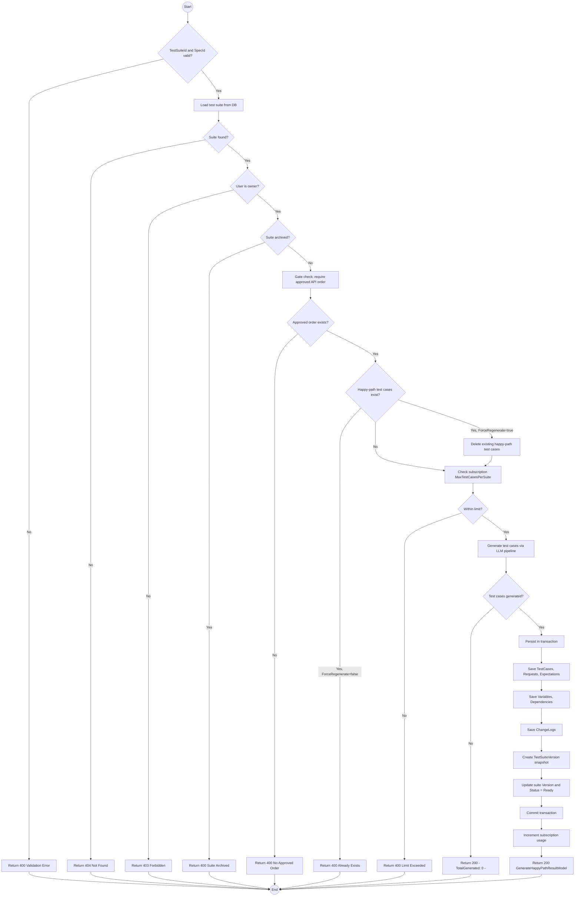
```mermaid
flowchart TD
    Start((Start))

    Start --> ValidateInput{TestSuiteId and SpecId valid?}
    ValidateInput -->|No| ReturnValidation[Return 400 Validation Error]
    ValidateInput -->|Yes| LoadSuite[Load test suite from DB]

    LoadSuite --> SuiteFound{Suite found?}
    SuiteFound -->|No| ReturnNotFound[Return 404 Not Found]
    SuiteFound -->|Yes| CheckOwner{User is owner?}

    CheckOwner -->|No| ReturnForbidden[Return 403 Forbidden]
    CheckOwner -->|Yes| CheckArchived{Suite archived?}

    CheckArchived -->|Yes| ReturnArchived[Return 400 Suite Archived]
    CheckArchived -->|No| GateCheck[Gate check: require approved API order]

    GateCheck --> GatePass{Approved order exists?}
    GatePass -->|No| ReturnGateError[Return 400 No Approved Order]
    GatePass -->|Yes| CheckExisting{Happy-path test cases exist?}

    CheckExisting -->|Yes, ForceRegenerate=false| ReturnExistsError[Return 400 Already Exists]
    CheckExisting -->|No| CheckLimit[Check subscription MaxTestCasesPerSuite]
    CheckExisting -->|Yes, ForceRegenerate=true| DeleteExisting[Delete existing happy-path test cases]

    DeleteExisting --> CheckLimit
    CheckLimit --> LimitOk{Within limit?}

    LimitOk -->|No| ReturnLimitError[Return 400 Limit Exceeded]
    LimitOk -->|Yes| GenerateViaLLM[Generate test cases via LLM pipeline]

    GenerateViaLLM --> HasResults{Test cases generated?}
    HasResults -->|No| ReturnEmpty[Return 200 - TotalGenerated: 0 -]
    HasResults -->|Yes| PersistTransaction[Persist in transaction]

    PersistTransaction --> PersistTestCases[Save TestCases, Requests, Expectations]
    PersistTestCases --> PersistVariables[Save Variables, Dependencies]
    PersistVariables --> PersistChangeLogs[Save ChangeLogs]
    PersistChangeLogs --> PersistVersion[Create TestSuiteVersion snapshot]
    PersistVersion --> UpdateSuiteStatus[Update suite Version and Status = Ready]
    UpdateSuiteStatus --> CommitTransaction[Commit transaction]

    CommitTransaction --> IncrementUsage[Increment subscription usage]
    IncrementUsage --> ReturnResult[Return 200 GenerateHappyPathResultModel]

    ReturnValidation --> End((End))
    ReturnNotFound --> End
    ReturnForbidden --> End
    ReturnArchived --> End
    ReturnGateError --> End
    ReturnExistsError --> End
    ReturnLimitError --> End
    ReturnEmpty --> End
    ReturnResult --> End
```

### Draw.io Drawing Guidelines
Start / End → oval | Process → rectangle | Decision → diamond | Arrow → flow direction | Direction: top → bottom

---

## Flowchart — Boundary / Negative Test Case Generation

### Description
The system generates boundary and negative test cases for a test suite using a combination of path mutations, body mutations, and LLM suggestions. Structurally parallel to happy-path generation with additional options and dual subscription limit checks.

### Verified Sources
- `ClassifiedAds.Modules.TestGeneration/Controllers/TestCasesController.cs` — `GenerateBoundaryNegative()` action
- `ClassifiedAds.Modules.TestGeneration/Commands/GenerateBoundaryNegativeTestCasesCommand.cs` — full handler (339 lines, 10-step flow)

### Process Steps
1. Validate inputs (TestSuiteId, SpecId, at least one source enabled).
2. Load test suite, verify ownership. Check not archived.
3. Gate check: require approved API test order.
4. Check for existing boundary/negative test cases.
5. Check subscription limits (MaxTestCasesPerSuite, MaxLlmCallsPerMonth if LLM enabled).
6. If force-regenerating, delete existing boundary/negative test cases.
7. Generate via `IBoundaryNegativeTestCaseGenerator` with options (PathMutations, BodyMutations, LlmSuggestions).
8. Persist in transaction: test cases, requests, expectations, variables, dependencies, change logs, suite version snapshot.
9. Increment subscription usage (test cases + optionally LLM calls).
10. Return result with counts breakdown.

### Mermaid Flowchart

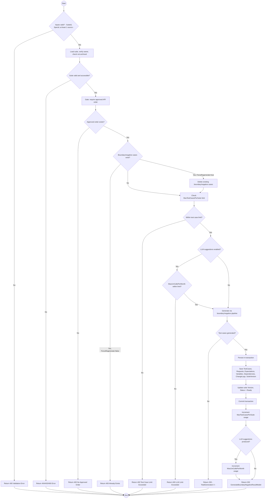
```mermaid
flowchart TD
    Start((Start))

    Start --> ValidateInput{Inputs valid? - SuiteId, SpecId, at least 1 source -}
    ValidateInput -->|No| ReturnValidation[Return 400 Validation Error]
    ValidateInput -->|Yes| LoadSuite[Load suite, verify owner, check not archived]

    LoadSuite --> SuiteOk{Suite valid and accessible?}
    SuiteOk -->|No| ReturnError[Return 404/403/400 Error]
    SuiteOk -->|Yes| GateCheck[Gate: require approved API order]

    GateCheck --> GatePass{Approved order exists?}
    GatePass -->|No| ReturnGateError[Return 400 No Approved Order]
    GatePass -->|Yes| CheckExisting{Boundary/negative cases exist?}

    CheckExisting -->|Yes, ForceRegenerate=false| ReturnExists[Return 400 Already Exists]
    CheckExisting -->|No| CheckTestCaseLimit[Check MaxTestCasesPerSuite limit]
    CheckExisting -->|Yes, ForceRegenerate=true| DeleteExisting[Delete existing boundary/negative cases]

    DeleteExisting --> CheckTestCaseLimit
    CheckTestCaseLimit --> TestLimitOk{Within test case limit?}

    TestLimitOk -->|No| ReturnTcLimit[Return 400 Test Case Limit Exceeded]
    TestLimitOk -->|Yes| CheckLlmEnabled{LLM suggestions enabled?}

    CheckLlmEnabled -->|Yes| CheckLlmLimit{MaxLlmCallsPerMonth within limit?}
    CheckLlmEnabled -->|No| Generate[Generate via boundary/negative pipeline]

    CheckLlmLimit -->|No| ReturnLlmLimit[Return 400 LLM Limit Exceeded]
    CheckLlmLimit -->|Yes| Generate

    Generate --> HasResults{Test cases generated?}
    HasResults -->|No| ReturnEmpty[Return 200 - TotalGenerated: 0 -]
    HasResults -->|Yes| PersistTransaction[Persist in transaction]

    PersistTransaction --> PersistAll[Save TestCases, Requests, Expectations, Variables, Dependencies, ChangeLogs, SuiteVersion]
    PersistAll --> UpdateSuite[Update suite Version, Status = Ready]
    UpdateSuite --> CommitTransaction[Commit transaction]
    CommitTransaction --> IncrementTestUsage[Increment MaxTestCasesPerSuite usage]
    IncrementTestUsage --> IncrementLlm{LLM suggestions produced?}

    IncrementLlm -->|Yes| IncrementLlmUsage[Increment MaxLlmCallsPerMonth usage]
    IncrementLlmUsage --> ReturnResult[Return 200 GenerateBoundaryNegativeResultModel]
    IncrementLlm -->|No| ReturnResult

    ReturnValidation --> End((End))
    ReturnError --> End
    ReturnGateError --> End
    ReturnExists --> End
    ReturnTcLimit --> End
    ReturnLlmLimit --> End
    ReturnEmpty --> End
    ReturnResult --> End
```

### Draw.io Drawing Guidelines
Start / End → oval | Process → rectangle | Decision → diamond | Arrow → flow direction | Direction: top → bottom

---

## Flowchart — Subscription Payment Creation

### Description
A user initiates a subscription purchase. The system validates the plan, determines pricing by billing cycle, and either activates a free plan directly or creates a `PaymentIntent` for paid plans requiring external payment.

### Verified Sources
- `ClassifiedAds.Modules.Subscription/Controllers/PaymentsController.cs` — `Subscribe()` action
- `ClassifiedAds.Modules.Subscription/Commands/CreateSubscriptionPaymentCommand.cs` — full handler

### Process Steps
1. Receive `POST /api/Payments/subscribe/{planId}`.
2. Validate UserId, PlanId, Model.
3. Load plan, verify exists and is active.
4. Determine price by billing cycle (Monthly/Yearly).
5. Check for existing active/trial subscription.
6. If free plan (price <= 0): activate subscription directly, record history, return `RequiresPayment = false`.
7. If paid plan (price > 0): create `PaymentIntent` with expiration, return `RequiresPayment = true` with `PaymentIntentId`.

### Mermaid Flowchart

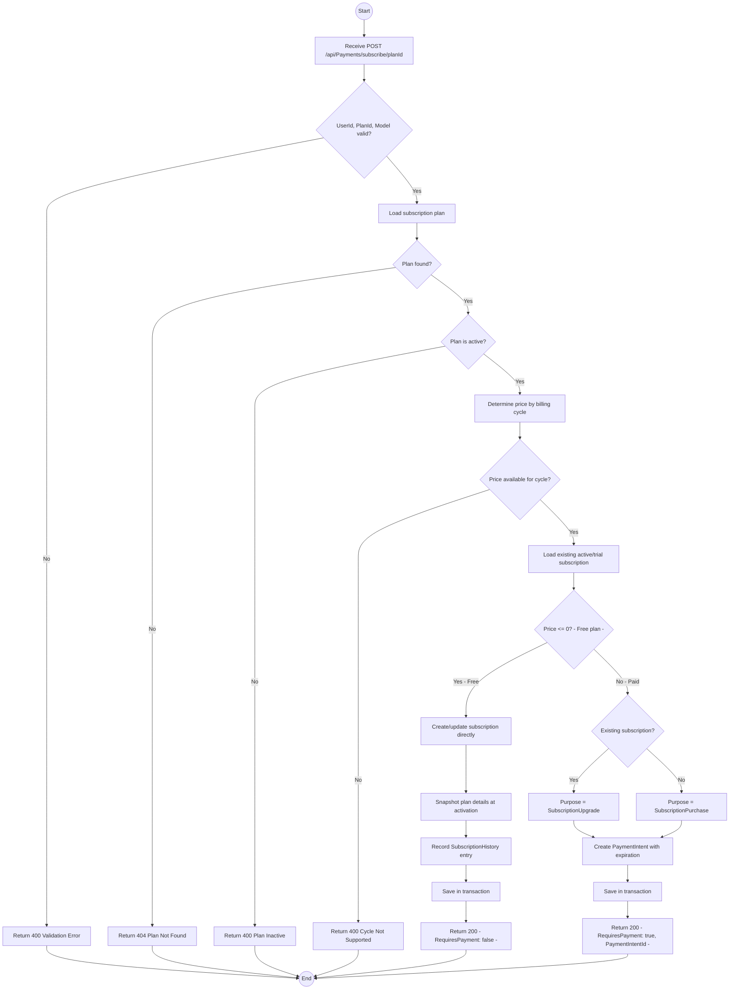
```mermaid
flowchart TD
    Start((Start))

    Start --> ReceiveRequest[Receive POST /api/Payments/subscribe/planId]
    ReceiveRequest --> ValidateInput{UserId, PlanId, Model valid?}

    ValidateInput -->|No| ReturnValidation[Return 400 Validation Error]
    ValidateInput -->|Yes| LoadPlan[Load subscription plan]

    LoadPlan --> PlanFound{Plan found?}
    PlanFound -->|No| ReturnNotFound[Return 404 Plan Not Found]
    PlanFound -->|Yes| PlanActive{Plan is active?}

    PlanActive -->|No| ReturnInactive[Return 400 Plan Inactive]
    PlanActive -->|Yes| DeterminePrice[Determine price by billing cycle]

    DeterminePrice --> PriceAvailable{Price available for cycle?}
    PriceAvailable -->|No| ReturnNoPrice[Return 400 Cycle Not Supported]
    PriceAvailable -->|Yes| LoadExisting[Load existing active/trial subscription]

    LoadExisting --> CheckPrice{Price <= 0? - Free plan -}

    CheckPrice -->|Yes - Free| ActivateDirectly[Create/update subscription directly]
    ActivateDirectly --> SnapshotPlan[Snapshot plan details at activation]
    SnapshotPlan --> RecordHistory[Record SubscriptionHistory entry]
    RecordHistory --> SaveFreeTx[Save in transaction]
    SaveFreeTx --> ReturnFree[Return 200 - RequiresPayment: false -]

    CheckPrice -->|No - Paid| DeterminePurpose{Existing subscription?}
    DeterminePurpose -->|Yes| SetUpgrade[Purpose = SubscriptionUpgrade]
    DeterminePurpose -->|No| SetPurchase[Purpose = SubscriptionPurchase]

    SetUpgrade --> CreateIntent[Create PaymentIntent with expiration]
    SetPurchase --> CreateIntent

    CreateIntent --> SavePaidTx[Save in transaction]
    SavePaidTx --> ReturnPaid[Return 200 - RequiresPayment: true, PaymentIntentId -]

    ReturnValidation --> End((End))
    ReturnNotFound --> End
    ReturnInactive --> End
    ReturnNoPrice --> End
    ReturnFree --> End
    ReturnPaid --> End
```

### Draw.io Drawing Guidelines
Start / End → oval | Process → rectangle | Decision → diamond | Arrow → flow direction | Direction: top → bottom

---

## Flowchart — PayOS Checkout Creation

### Description
After a `PaymentIntent` is created, the user requests a PayOS checkout link. The system validates the intent status and expiration, generates a unique order code, calls the PayOS API to create a payment link, and returns the checkout URL.

### Verified Sources
- `ClassifiedAds.Modules.Subscription/Controllers/PaymentsController.cs` — `CreatePayOsCheckout()` action
- `ClassifiedAds.Modules.Subscription/Commands/CreatePayOsCheckoutCommand.cs` — full handler
- `ClassifiedAds.Modules.Subscription/Services/PayOsService.cs` — `CreatePaymentLinkAsync`

### Process Steps
1. Receive `POST /api/Payments/payos/create`.
2. Validate UserId and IntentId.
3. Load PaymentIntent, verify ownership.
4. Check intent status (not Succeeded, not Canceled/Expired).
5. Check expiration, auto-expire if past due.
6. Generate unique order code (timestamp + random, up to 10 attempts).
7. Load plan for description.
8. Call PayOS API via `IPayOsService.CreatePaymentLinkAsync`.
9. Update intent: set OrderCode, CheckoutUrl, Status = Processing.
10. Save changes.
11. Return checkout URL and order code.

### Mermaid Flowchart

```mermaid
flowchart TD
    Start((Start))

    Start --> ReceiveRequest[Receive POST /api/Payments/payos/create]
    ReceiveRequest --> ValidateInput{UserId and IntentId valid?}

    ValidateInput -->|No| ReturnValidation[Return 400 Validation Error]
    ValidateInput -->|Yes| LoadIntent[Load PaymentIntent from DB]

    LoadIntent --> IntentFound{Intent found and belongs to user?}
    IntentFound -->|No| ReturnNotFound[Return 404 Not Found]
    IntentFound -->|Yes| CheckSucceeded{Status == Succeeded?}

    CheckSucceeded -->|Yes| ReturnAlreadyDone[Return 400 Already Succeeded]
    CheckSucceeded -->|No| CheckCanceled{Status == Canceled or Expired?}

    CheckCanceled -->|Yes| ReturnCanceled[Return 400 Canceled/Expired]
    CheckCanceled -->|No| CheckExpiration{ExpiresAt <= now?}

    CheckExpiration -->|Yes| AutoExpire[Set Status = Expired, save]
    AutoExpire --> ReturnExpired[Return 400 Expired]
    CheckExpiration -->|No| GenerateOrderCode[Generate unique order code]

    GenerateOrderCode --> LoadPlan[Load plan for description]
    LoadPlan --> CallPayOS[Call PayOS CreatePaymentLinkAsync]
    CallPayOS --> UpdateIntent[Update intent: OrderCode, CheckoutUrl, Processing]
    UpdateIntent --> SaveChanges[Save changes]
    SaveChanges --> ReturnCheckout[Return 200 CheckoutUrl + OrderCode]

    ReturnValidation --> End((End))
    ReturnNotFound --> End
    ReturnAlreadyDone --> End
    ReturnCanceled --> End
    ReturnExpired --> End
    ReturnCheckout --> End
```

### Draw.io Drawing Guidelines
Start / End → oval | Process → rectangle | Decision → diamond | Arrow → flow direction | Direction: top → bottom

---

## Flowchart — PayOS Webhook Processing

### Description
PayOS sends a webhook notification when a payment status changes. The system verifies the HMAC signature, looks up the payment intent by order code, checks for duplicate processing, and either activates the subscription (on success) or records the failure.

### Verified Sources
- `ClassifiedAds.Modules.Subscription/Controllers/PaymentsController.cs` — `PayOsWebhook()` action
- `ClassifiedAds.Modules.Subscription/Commands/HandlePayOsWebhookCommand.cs` — full handler (336 lines)
- `IPayOsService` — `VerifyWebhookSignature`

### Process Steps
1. Receive `POST /api/Payments/payos/webhook` (AllowAnonymous).
2. Check payload is not null.
3. Verify HMAC-SHA256 webhook signature.
4. Look up PaymentIntent by order code.
5. Check for duplicate transaction (idempotency).
6. Determine if payment succeeded (code "00" or Success flag).
7. On success: upsert subscription (create or update), set Status = Active, record SubscriptionHistory, create PaymentTransaction.
8. On failure: set intent to Canceled/Expired, create failed PaymentTransaction.
9. Execute in transaction.
10. Return outcome (Processed or Ignored).

### Mermaid Flowchart

```mermaid
flowchart TD
    Start((Start))

    Start --> ReceiveWebhook[Receive POST /api/Payments/payos/webhook]
    ReceiveWebhook --> HasPayload{Payload and Data present?}

    HasPayload -->|No| Ignored1[Outcome = Ignored]
    HasPayload -->|Yes| VerifySignature{Signature valid?}

    VerifySignature -->|No| Ignored2[Outcome = Ignored]
    VerifySignature -->|Yes| FindIntent[Find PaymentIntent by OrderCode]

    FindIntent --> IntentFound{Intent found?}
    IntentFound -->|No| Ignored3[Outcome = Ignored]
    IntentFound -->|Yes| CheckDuplicate{Transaction already exists? - idempotency -}

    CheckDuplicate -->|Yes| Ignored4[Outcome = Ignored]
    CheckDuplicate -->|No| CheckSuccess{Payment succeeded? - code 00 -}

    CheckSuccess -->|Yes| UpsertSubscription[Upsert UserSubscription - Active -]
    UpsertSubscription --> SetEndDate[Set StartDate, EndDate, NextBillingDate]
    SetEndDate --> SnapshotDetails[Snapshot plan pricing details]
    SnapshotDetails --> RecordHistory[Create SubscriptionHistory entry]
    RecordHistory --> CreateSuccessTx[Create PaymentTransaction - Succeeded -]
    CreateSuccessTx --> UpdateIntentSuccess[Set PaymentIntent Status = Succeeded]
    UpdateIntentSuccess --> CommitTx[Commit transaction]

    CheckSuccess -->|No| ResolveFailure[Resolve failure status - Expired or Canceled -]
    ResolveFailure --> UpdateIntentFail[Update PaymentIntent status]
    UpdateIntentFail --> CreateFailTx{Has SubscriptionId?}
    CreateFailTx -->|Yes| CreateFailedTx[Create PaymentTransaction - Failed -]
    CreateFailedTx --> CommitFailTx[Commit transaction]
    CreateFailTx -->|No| CommitFailTx

    CommitTx --> Processed[Outcome = Processed]
    CommitFailTx --> Processed

    Ignored1 --> End((End))
    Ignored2 --> End
    Ignored3 --> End
    Ignored4 --> End
    Processed --> End
```

### Draw.io Drawing Guidelines
Start / End → oval | Process → rectangle | Decision → diamond | Arrow → flow direction | Direction: top → bottom

---

## Flowchart — File Upload

### Description
An authorized user uploads a file to the storage system. The system creates a file entry, stores the file (with optional AES-CBC encryption using a master key wrapping scheme), and returns the file metadata.

### Verified Sources
- `ClassifiedAds.Modules.Storage/Controllers/FilesController.cs` — `Upload()` action
- `IFileStorageManager` — `CreateAsync`
- CryptographyHelper — AES-CBC encryption

### Process Steps
1. Receive `POST /api/Files` with form data (Authorized, UploadFile permission).
2. Create `FileEntry` entity with metadata.
3. Save entity to get ID.
4. Set `FileLocation` = date-based path + entity ID.
5. Save entity again with location.
6. Check if encryption is requested.
7. If encrypted: generate AES key + IV, encrypt the file stream, store encrypted content, wrap key with master key, save encrypted key + IV.
8. If not encrypted: store raw file content.
9. Save final entity state.
10. Return `FileEntryModel`.

### Mermaid Flowchart

```mermaid
flowchart TD
    Start((Start))

    Start --> ReceiveRequest[Receive POST /api/Files with form data]
    ReceiveRequest --> CreateEntry[Create FileEntry entity with metadata]
    CreateEntry --> SaveForId[Save entity to database to get ID]
    SaveForId --> SetLocation[Set FileLocation = yyyy/MM/dd/ + ID]
    SetLocation --> SaveLocation[Save entity with location]

    SaveLocation --> CheckEncrypt{Encryption requested?}

    CheckEncrypt -->|Yes| GenerateKey[Generate AES key 256-bit + IV 128-bit]
    GenerateKey --> EncryptStream[Encrypt file stream with AES-CBC-PKCS7]
    EncryptStream --> StoreEncrypted[Store encrypted content via FileStorageManager]
    StoreEncrypted --> WrapKey[Wrap AES key with master encryption key]
    WrapKey --> SaveEncKeys[Save encrypted key + IV to entity]
    SaveEncKeys --> FinalSave[Save final entity state]

    CheckEncrypt -->|No| StoreRaw[Store raw file content via FileStorageManager]
    StoreRaw --> FinalSave

    FinalSave --> ReturnModel[Return 200 FileEntryModel]
    ReturnModel --> End((End))
```

### Draw.io Drawing Guidelines
Start / End → oval | Process → rectangle | Decision → diamond | Arrow → flow direction | Direction: top → bottom

---

## Flowchart — File Download

### Description
An authorized user downloads a file. The system retrieves the file, checks authorization, and if encrypted, decrypts it using the master key to unwrap the per-file key before returning the content.

### Verified Sources
- `ClassifiedAds.Modules.Storage/Controllers/FilesController.cs` — `Download()` action
- `IFileStorageManager` — `ReadAsync`
- `IAuthorizationService` — resource-based authorization

### Process Steps
1. Receive `GET /api/Files/{id}/download` (Authorized, DownloadFile permission).
2. Load `FileEntry` by ID.
3. Authorize read access via `IAuthorizationService`.
4. Read raw file content from storage.
5. Check if file is encrypted.
6. If encrypted: unwrap per-file AES key using master key, decrypt content with AES-CBC.
7. Return file content as octet-stream download.

### Mermaid Flowchart

```mermaid
flowchart TD
    Start((Start))

    Start --> ReceiveRequest[Receive GET /api/Files/id/download]
    ReceiveRequest --> LoadEntry[Load FileEntry by ID]

    LoadEntry --> Authorize{Read authorization passed?}
    Authorize -->|No| ReturnForbid[Return 403 Forbidden]
    Authorize -->|Yes| ReadRaw[Read raw file content from storage]

    ReadRaw --> CheckEncrypt{File is encrypted?}

    CheckEncrypt -->|Yes| UnwrapKey[Unwrap per-file AES key using master key]
    UnwrapKey --> DecryptContent[Decrypt content with AES-CBC-PKCS7]
    DecryptContent --> ReturnFile[Return file as octet-stream download]

    CheckEncrypt -->|No| ReturnFile

    ReturnForbid --> End((End))
    ReturnFile --> End
```

### Draw.io Drawing Guidelines
Start / End → oval | Process → rectangle | Decision → diamond | Arrow → flow direction | Direction: top → bottom

---

## Flowchart — Email Message Creation & Delivery

### Description
The system creates an email message, persists it to the database for durability, and enqueues it to an in-memory Channel for fast async processing. If enqueuing fails, a database sweep worker picks it up later (at-least-once delivery).

### Verified Sources
- `ClassifiedAds.Modules.Notification/Services/EmailMessageService.cs` — `CreateEmailMessageAsync`
- `IEmailQueueWriter` — in-memory Channel
- `SendEmailMessagesCommand` — batch processing handler

### Process Steps
1. Receive email message DTO.
2. Persist `EmailMessage` entity to database (durability guarantee).
3. Enqueue to in-memory Channel via `IEmailQueueWriter`.
4. If enqueue succeeds: message ready for async delivery.
5. If enqueue fails (channel closed or error): log warning, DB sweep will recover.
6. Background worker dequeues and sends via external email provider.

### Mermaid Flowchart

```mermaid
flowchart TD
    Start((Start))

    Start --> ReceiveDTO[Receive EmailMessageDTO]
    ReceiveDTO --> CreateEntity[Create EmailMessage entity]
    CreateEntity --> PersistDB[Persist to database - durability guarantee -]

    PersistDB --> TryEnqueue[Try enqueue to in-memory Channel]
    TryEnqueue --> EnqueueResult{Enqueue succeeded?}

    EnqueueResult -->|Yes| LogSuccess[Log: persisted and enqueued]
    EnqueueResult -->|Channel closed| LogWarning1[Log warning: DB sweep will pick up]
    EnqueueResult -->|Exception| LogWarning2[Log warning: DB sweep will recover]

    LogSuccess --> BackgroundWorker[Background worker dequeues message]
    LogWarning1 --> DBSweep[Database sweep worker finds unsent messages]
    LogWarning2 --> DBSweep

    BackgroundWorker --> SendEmail[Send via external email provider]
    DBSweep --> SendEmail

    SendEmail --> UpdateStatus[Update delivery status]
    UpdateStatus --> Done[Email delivery complete]
    Done --> End((End))
```

### Draw.io Drawing Guidelines
Start / End → oval | Process → rectangle | Decision → diamond | Arrow → flow direction | Direction: top → bottom

---

## Appendix — Planned Processes (Not Yet Implemented)

The following processes appear in requirements or feature specifications but are not yet fully implemented in code. They are listed here for completeness.

| # | Process | Module | Status | Source |
|---|---------|--------|--------|--------|
| 1 | Test Execution via N8n Pipeline | TestExecution | **(planned)** | Feature specs FE-07 |
| 2 | Rule-Based Test Validation | TestExecution | **(planned)** | Feature specs FE-08 |
| 3 | LLM Failure Explanation | LlmAssistant | **(planned)** | Feature specs FE-09 |
| 4 | Test Report Generation | TestReporting | **(planned)** | Feature specs FE-10 |
| 5 | LLM Suggestion Review & Approval | LlmAssistant | **(planned)** | Feature specs FE-15 |
| 6 | PayOS Reconciliation Worker | Subscription | **(planned)** | `ReconcilePayOsCheckoutsCommand` exists but worker not scheduled |

---

## Summary

| Module | Verified Flowcharts | Based On |
|--------|---------------------|----------|
| **Identity** | 9 | AuthController (13 endpoints), UserManager, JwtTokenService |
| **ApiDocumentation** | 4 | SpecificationsController, UploadApiSpecificationCommand, ParseUploadedSpecificationCommand, ImportCurlCommand, ActivateSpecificationCommand |
| **TestGeneration** | 6 | TestOrderController, TestCasesController, ProposeApiTestOrderCommand, ReorderApiTestOrderCommand, ApproveApiTestOrderCommand, RejectApiTestOrderCommand, GenerateHappyPathTestCasesCommand, GenerateBoundaryNegativeTestCasesCommand |
| **Subscription** | 3 | PaymentsController, CreateSubscriptionPaymentCommand, CreatePayOsCheckoutCommand, HandlePayOsWebhookCommand |
| **Storage** | 2 | FilesController |
| **Notification** | 1 | EmailMessageService |
| **Total** | **25** | |
