# Sequence Diagrams (Mermaid) - Per Feature

> **Format**: Mermaid `sequenceDiagram` blocks compatible with **draw.io** import.
> **Import guide**: Copy content inside each `mermaid` code fence (without triple backticks) -> Extras -> Edit Diagram -> paste.
> **Convention**: Mỗi lifeline = 1 class thật trong code. Mỗi message = 1 method call thật.

---

## Mục lục

| FE | Tên | Diagram count |
|----|-----|---------------|
| [FE-01](#fe-01--user-authentication--rbac) | User Authentication & RBAC | 3 |
| [FE-02/03](#fe-0203--api-input-management--parse) | API Input Management & Parse | 2 |
| [FE-04](#fe-04--test-scope--execution-configuration) | Test Scope & Execution Configuration | 2 |
| [FE-05A](#fe-05a--api-test-order-proposal) | API Test Order Proposal | 2 |
| [FE-05B](#fe-05b--happy-path-test-case-generation) | Happy-Path Test Case Generation | 1 |
| [FE-06](#fe-06--boundary--negative-test-generation) | Boundary & Negative Test Generation | 1 |
| [FE-07+08](#fe-0708--test-execution--rule-based-validation) | Test Execution + Rule-based Validation | 1 |
| [FE-09](#fe-09--llm-failure-explanations) | LLM Failure Explanations | 1 |
| [FE-10](#fe-10--test-reporting--export) | Test Reporting & Export | 1 |
| [FE-11](#fe-11--manual-entry-mode) | Manual Entry Mode | 1 |
| [FE-12](#fe-12--path-parameter-templating) | Path Parameter Templating | 1 |
| [FE-13](#fe-13--curl-import) | cURL Import | 1 |
| [FE-14](#fe-14--subscription--billing) | Subscription & Billing | 3 |
| [FE-15/16/17](#fe-151617--llm-suggestion-review-pipeline) | LLM Suggestion Review Pipeline | 3 |
| [FE-18](#fe-18--srs--traceability) | SRS & Traceability | 2 |
| [Infra](#infrastructure-diagrams) | Outbox Worker + Domain Event | 2 |

---

## FE-01 — User Authentication & RBAC

### FE-01-SD-01: User Login

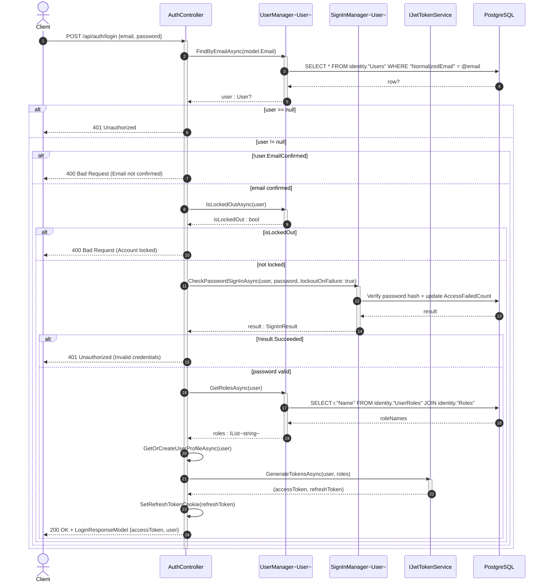
```mermaid
sequenceDiagram
    autonumber
    actor Client
    participant Ctrl as AuthController
    participant UM as UserManager~User~
    participant SM as SignInManager~User~
    participant JWT as IJwtTokenService
    participant DB as PostgreSQL

    Client->>Ctrl: POST /api/auth/login {email, password}
    activate Ctrl

    Ctrl->>UM: FindByEmailAsync(model.Email)
    activate UM
    UM->>DB: SELECT * FROM identity."Users" WHERE "NormalizedEmail" = @email
    DB-->>UM: row?
    UM-->>Ctrl: user : User?
    deactivate UM

    alt user == null
        Ctrl-->>Client: 401 Unauthorized
    else user != null
        alt !user.EmailConfirmed
            Ctrl-->>Client: 400 Bad Request (Email not confirmed)
        else email confirmed

            Ctrl->>UM: IsLockedOutAsync(user)
            activate UM
            UM-->>Ctrl: isLockedOut : bool
            deactivate UM

            alt isLockedOut
                Ctrl-->>Client: 400 Bad Request (Account locked)
            else not locked

                Ctrl->>SM: CheckPasswordSignInAsync(user, password, lockoutOnFailure: true)
                activate SM
                SM->>DB: Verify password hash + update AccessFailedCount
                DB-->>SM: result
                SM-->>Ctrl: result : SignInResult
                deactivate SM

                alt !result.Succeeded
                    Ctrl-->>Client: 401 Unauthorized (Invalid credentials)
                else password valid

                    Ctrl->>UM: GetRolesAsync(user)
                    activate UM
                    UM->>DB: SELECT r."Name" FROM identity."UserRoles" JOIN identity."Roles"
                    DB-->>UM: roleNames
                    UM-->>Ctrl: roles : IList~string~
                    deactivate UM

                    Ctrl->>Ctrl: GetOrCreateUserProfileAsync(user)

                    Ctrl->>JWT: GenerateTokensAsync(user, roles)
                    activate JWT
                    JWT-->>Ctrl: (accessToken, refreshToken)
                    deactivate JWT

                    Ctrl->>Ctrl: SetRefreshTokenCookie(refreshToken)

                    Ctrl-->>Client: 200 OK + LoginResponseModel {accessToken, user}
                end
            end
        end
    end
    deactivate Ctrl
```

---

### FE-01-SD-02: User Registration

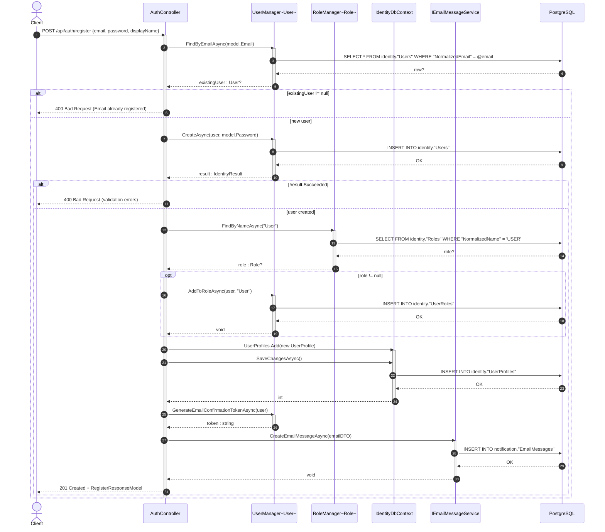
```mermaid
sequenceDiagram
    autonumber
    actor Client
    participant Ctrl as AuthController
    participant UM as UserManager~User~
    participant RM as RoleManager~Role~
    participant DbCtx as IdentityDbContext
    participant Email as IEmailMessageService
    participant DB as PostgreSQL

    Client->>Ctrl: POST /api/auth/register {email, password, displayName}
    activate Ctrl

    Ctrl->>UM: FindByEmailAsync(model.Email)
    activate UM
    UM->>DB: SELECT * FROM identity."Users" WHERE "NormalizedEmail" = @email
    DB-->>UM: row?
    UM-->>Ctrl: existingUser : User?
    deactivate UM

    alt existingUser != null
        Ctrl-->>Client: 400 Bad Request (Email already registered)
    else new user

        Ctrl->>UM: CreateAsync(user, model.Password)
        activate UM
        UM->>DB: INSERT INTO identity."Users"
        DB-->>UM: OK
        UM-->>Ctrl: result : IdentityResult
        deactivate UM

        alt !result.Succeeded
            Ctrl-->>Client: 400 Bad Request (validation errors)
        else user created

            Ctrl->>RM: FindByNameAsync("User")
            activate RM
            RM->>DB: SELECT FROM identity."Roles" WHERE "NormalizedName" = 'USER'
            DB-->>RM: role?
            RM-->>Ctrl: role : Role?
            deactivate RM

            opt role != null
                Ctrl->>UM: AddToRoleAsync(user, "User")
                activate UM
                UM->>DB: INSERT INTO identity."UserRoles"
                DB-->>UM: OK
                UM-->>Ctrl: void
                deactivate UM
            end

            Ctrl->>DbCtx: UserProfiles.Add(new UserProfile)
            activate DbCtx
            Ctrl->>DbCtx: SaveChangesAsync()
            DbCtx->>DB: INSERT INTO identity."UserProfiles"
            DB-->>DbCtx: OK
            DbCtx-->>Ctrl: int
            deactivate DbCtx

            Ctrl->>UM: GenerateEmailConfirmationTokenAsync(user)
            activate UM
            UM-->>Ctrl: token : string
            deactivate UM

            Ctrl->>Email: CreateEmailMessageAsync(emailDTO)
            activate Email
            Email->>DB: INSERT INTO notification."EmailMessages"
            DB-->>Email: OK
            Email-->>Ctrl: void
            deactivate Email

            Ctrl-->>Client: 201 Created + RegisterResponseModel
        end
    end
    deactivate Ctrl
```

---

### FE-01-SD-03: Refresh Token

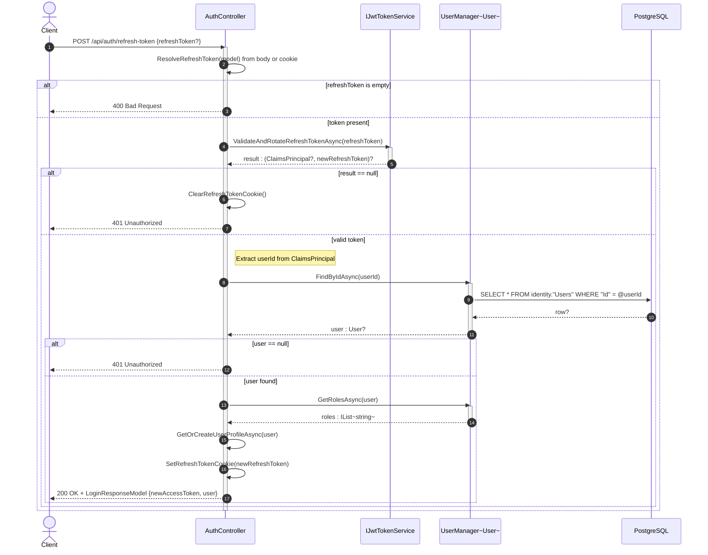
```mermaid
sequenceDiagram
    autonumber
    actor Client
    participant Ctrl as AuthController
    participant JWT as IJwtTokenService
    participant UM as UserManager~User~
    participant DB as PostgreSQL

    Client->>Ctrl: POST /api/auth/refresh-token {refreshToken?}
    activate Ctrl

    Ctrl->>Ctrl: ResolveRefreshToken(model) from body or cookie

    alt refreshToken is empty
        Ctrl-->>Client: 400 Bad Request
    else token present

        Ctrl->>JWT: ValidateAndRotateRefreshTokenAsync(refreshToken)
        activate JWT
        JWT-->>Ctrl: result : (ClaimsPrincipal?, newRefreshToken)?
        deactivate JWT

        alt result == null
            Ctrl->>Ctrl: ClearRefreshTokenCookie()
            Ctrl-->>Client: 401 Unauthorized
        else valid token

            Note right of Ctrl: Extract userId from ClaimsPrincipal

            Ctrl->>UM: FindByIdAsync(userId)
            activate UM
            UM->>DB: SELECT * FROM identity."Users" WHERE "Id" = @userId
            DB-->>UM: row?
            UM-->>Ctrl: user : User?
            deactivate UM

            alt user == null
                Ctrl-->>Client: 401 Unauthorized
            else user found

                Ctrl->>UM: GetRolesAsync(user)
                activate UM
                UM-->>Ctrl: roles : IList~string~
                deactivate UM

                Ctrl->>Ctrl: GetOrCreateUserProfileAsync(user)
                Ctrl->>Ctrl: SetRefreshTokenCookie(newRefreshToken)

                Ctrl-->>Client: 200 OK + LoginResponseModel {newAccessToken, user}
            end
        end
    end
    deactivate Ctrl
```

---

## FE-02/03 — API Input Management & Parse

### FE-02-SD-01: Upload API Specification

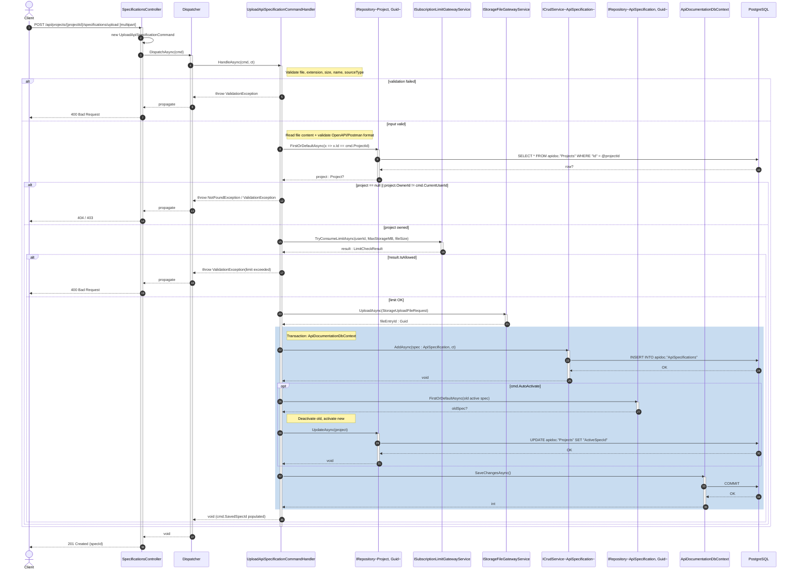
```mermaid
sequenceDiagram
    autonumber
    actor Client
    participant Ctrl as SpecificationsController
    participant Disp as Dispatcher
    participant CmdH as UploadApiSpecificationCommandHandler
    participant ProjRepo as IRepository~Project, Guid~
    participant LimitGw as ISubscriptionLimitGatewayService
    participant StorageGw as IStorageFileGatewayService
    participant SpecSvc as ICrudService~ApiSpecification~
    participant SpecRepo as IRepository~ApiSpecification, Guid~
    participant UoW as ApiDocumentationDbContext
    participant DB as PostgreSQL

    Client->>Ctrl: POST /api/projects/{projectId}/specifications/upload [multipart]
    activate Ctrl

    Ctrl->>Ctrl: new UploadApiSpecificationCommand
    Ctrl->>Disp: DispatchAsync(cmd)
    activate Disp

    Disp->>CmdH: HandleAsync(cmd, ct)
    activate CmdH

    Note right of CmdH: Validate file, extension, size, name, sourceType

    alt validation failed
        CmdH-->>Disp: throw ValidationException
        Disp-->>Ctrl: propagate
        Ctrl-->>Client: 400 Bad Request
    else input valid

        Note right of CmdH: Read file content + validate OpenAPI/Postman format

        CmdH->>ProjRepo: FirstOrDefaultAsync(x => x.Id == cmd.ProjectId)
        activate ProjRepo
        ProjRepo->>DB: SELECT * FROM apidoc."Projects" WHERE "Id" = @projectId
        DB-->>ProjRepo: row?
        ProjRepo-->>CmdH: project : Project?
        deactivate ProjRepo

        alt project == null || project.OwnerId != cmd.CurrentUserId
            CmdH-->>Disp: throw NotFoundException / ValidationException
            Disp-->>Ctrl: propagate
            Ctrl-->>Client: 404 / 403
        else project owned

            CmdH->>LimitGw: TryConsumeLimitAsync(userId, MaxStorageMB, fileSize)
            activate LimitGw
            LimitGw-->>CmdH: result : LimitCheckResult
            deactivate LimitGw

            alt !result.IsAllowed
                CmdH-->>Disp: throw ValidationException(limit exceeded)
                Disp-->>Ctrl: propagate
                Ctrl-->>Client: 400 Bad Request
            else limit OK

                CmdH->>StorageGw: UploadAsync(StorageUploadFileRequest)
                activate StorageGw
                StorageGw-->>CmdH: fileEntryId : Guid
                deactivate StorageGw

                rect rgb(200, 220, 240)
                    Note right of CmdH: Transaction: ApiDocumentationDbContext

                    CmdH->>SpecSvc: AddAsync(spec : ApiSpecification, ct)
                    activate SpecSvc
                    SpecSvc->>DB: INSERT INTO apidoc."ApiSpecifications"
                    DB-->>SpecSvc: OK
                    SpecSvc-->>CmdH: void
                    deactivate SpecSvc

                    opt cmd.AutoActivate
                        CmdH->>SpecRepo: FirstOrDefaultAsync(old active spec)
                        activate SpecRepo
                        SpecRepo-->>CmdH: oldSpec?
                        deactivate SpecRepo

                        Note right of CmdH: Deactivate old, activate new

                        CmdH->>ProjRepo: UpdateAsync(project)
                        activate ProjRepo
                        ProjRepo->>DB: UPDATE apidoc."Projects" SET "ActiveSpecId"
                        DB-->>ProjRepo: OK
                        ProjRepo-->>CmdH: void
                        deactivate ProjRepo
                    end

                    CmdH->>UoW: SaveChangesAsync()
                    activate UoW
                    UoW->>DB: COMMIT
                    DB-->>UoW: OK
                    UoW-->>CmdH: int
                    deactivate UoW
                end

                CmdH-->>Disp: void (cmd.SavedSpecId populated)
            end
        end
    end
    deactivate CmdH
    Disp-->>Ctrl: void
    deactivate Disp
    Ctrl-->>Client: 201 Created {specId}
    deactivate Ctrl
```

---

### FE-02-SD-02: Create/Update Project

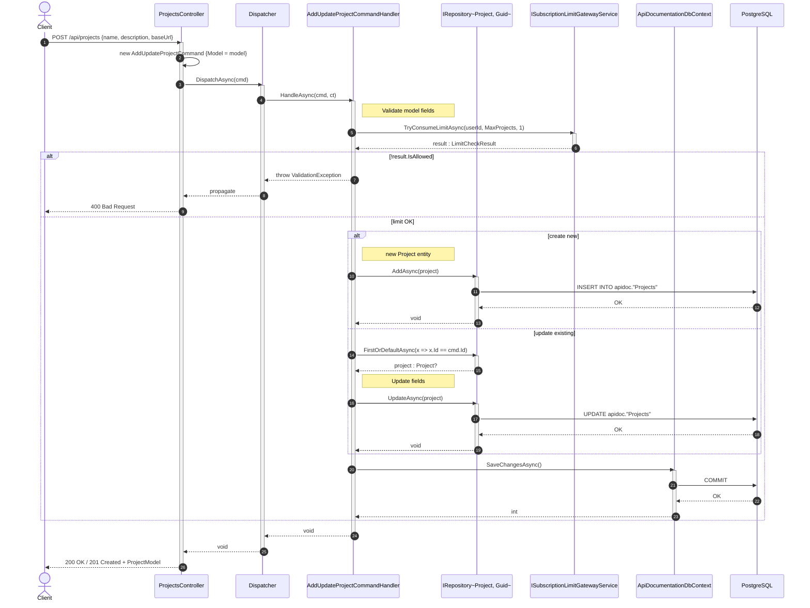
```mermaid
sequenceDiagram
    autonumber
    actor Client
    participant Ctrl as ProjectsController
    participant Disp as Dispatcher
    participant CmdH as AddUpdateProjectCommandHandler
    participant ProjRepo as IRepository~Project, Guid~
    participant LimitGw as ISubscriptionLimitGatewayService
    participant UoW as ApiDocumentationDbContext
    participant DB as PostgreSQL

    Client->>Ctrl: POST /api/projects {name, description, baseUrl}
    activate Ctrl

    Ctrl->>Ctrl: new AddUpdateProjectCommand {Model = model}
    Ctrl->>Disp: DispatchAsync(cmd)
    activate Disp

    Disp->>CmdH: HandleAsync(cmd, ct)
    activate CmdH

    Note right of CmdH: Validate model fields

    CmdH->>LimitGw: TryConsumeLimitAsync(userId, MaxProjects, 1)
    activate LimitGw
    LimitGw-->>CmdH: result : LimitCheckResult
    deactivate LimitGw

    alt !result.IsAllowed
        CmdH-->>Disp: throw ValidationException
        Disp-->>Ctrl: propagate
        Ctrl-->>Client: 400 Bad Request
    else limit OK

        alt create new
            Note right of CmdH: new Project entity
            CmdH->>ProjRepo: AddAsync(project)
            activate ProjRepo
            ProjRepo->>DB: INSERT INTO apidoc."Projects"
            DB-->>ProjRepo: OK
            ProjRepo-->>CmdH: void
            deactivate ProjRepo
        else update existing
            CmdH->>ProjRepo: FirstOrDefaultAsync(x => x.Id == cmd.Id)
            activate ProjRepo
            ProjRepo-->>CmdH: project : Project?
            deactivate ProjRepo

            Note right of CmdH: Update fields

            CmdH->>ProjRepo: UpdateAsync(project)
            activate ProjRepo
            ProjRepo->>DB: UPDATE apidoc."Projects"
            DB-->>ProjRepo: OK
            ProjRepo-->>CmdH: void
            deactivate ProjRepo
        end

        CmdH->>UoW: SaveChangesAsync()
        activate UoW
        UoW->>DB: COMMIT
        DB-->>UoW: OK
        UoW-->>CmdH: int
        deactivate UoW
    end

    CmdH-->>Disp: void
    deactivate CmdH
    Disp-->>Ctrl: void
    deactivate Disp
    Ctrl-->>Client: 200 OK / 201 Created + ProjectModel
    deactivate Ctrl
```

---

## FE-04 — Test Scope & Execution Configuration

### FE-04-SD-01: Create/Update Test Suite Scope

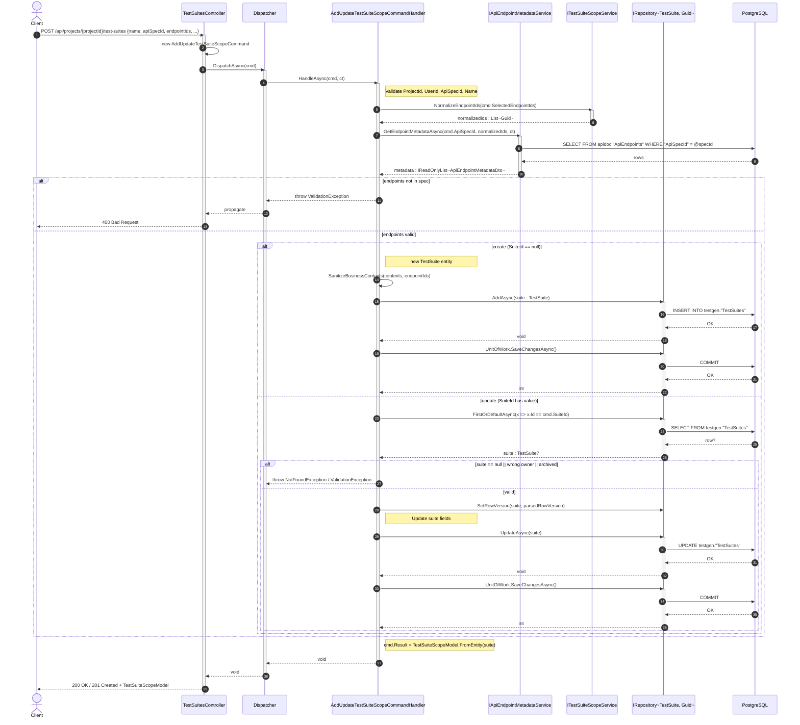
```mermaid
sequenceDiagram
    autonumber
    actor Client
    participant Ctrl as TestSuitesController
    participant Disp as Dispatcher
    participant CmdH as AddUpdateTestSuiteScopeCommandHandler
    participant EpMeta as IApiEndpointMetadataService
    participant ScopeSvc as ITestSuiteScopeService
    participant SuiteRepo as IRepository~TestSuite, Guid~
    participant DB as PostgreSQL

    Client->>Ctrl: POST /api/projects/{projectId}/test-suites {name, apiSpecId, endpointIds, ...}
    activate Ctrl

    Ctrl->>Ctrl: new AddUpdateTestSuiteScopeCommand
    Ctrl->>Disp: DispatchAsync(cmd)
    activate Disp

    Disp->>CmdH: HandleAsync(cmd, ct)
    activate CmdH

    Note right of CmdH: Validate ProjectId, UserId, ApiSpecId, Name

    CmdH->>ScopeSvc: NormalizeEndpointIds(cmd.SelectedEndpointIds)
    activate ScopeSvc
    ScopeSvc-->>CmdH: normalizedIds : List~Guid~
    deactivate ScopeSvc

    CmdH->>EpMeta: GetEndpointMetadataAsync(cmd.ApiSpecId, normalizedIds, ct)
    activate EpMeta
    EpMeta->>DB: SELECT FROM apidoc."ApiEndpoints" WHERE "ApiSpecId" = @specId
    DB-->>EpMeta: rows
    EpMeta-->>CmdH: metadata : IReadOnlyList~ApiEndpointMetadataDto~
    deactivate EpMeta

    alt endpoints not in spec
        CmdH-->>Disp: throw ValidationException
        Disp-->>Ctrl: propagate
        Ctrl-->>Client: 400 Bad Request
    else endpoints valid

        alt create (SuiteId == null)
            Note right of CmdH: new TestSuite entity
            CmdH->>CmdH: SanitizeBusinessContexts(contexts, endpointIds)

            CmdH->>SuiteRepo: AddAsync(suite : TestSuite)
            activate SuiteRepo
            SuiteRepo->>DB: INSERT INTO testgen."TestSuites"
            DB-->>SuiteRepo: OK
            SuiteRepo-->>CmdH: void
            deactivate SuiteRepo

            CmdH->>SuiteRepo: UnitOfWork.SaveChangesAsync()
            activate SuiteRepo
            SuiteRepo->>DB: COMMIT
            DB-->>SuiteRepo: OK
            SuiteRepo-->>CmdH: int
            deactivate SuiteRepo

        else update (SuiteId has value)
            CmdH->>SuiteRepo: FirstOrDefaultAsync(x => x.Id == cmd.SuiteId)
            activate SuiteRepo
            SuiteRepo->>DB: SELECT FROM testgen."TestSuites"
            DB-->>SuiteRepo: row?
            SuiteRepo-->>CmdH: suite : TestSuite?
            deactivate SuiteRepo

            alt suite == null || wrong owner || archived
                CmdH-->>Disp: throw NotFoundException / ValidationException
            else valid

                CmdH->>SuiteRepo: SetRowVersion(suite, parsedRowVersion)
                Note right of CmdH: Update suite fields

                CmdH->>SuiteRepo: UpdateAsync(suite)
                activate SuiteRepo
                SuiteRepo->>DB: UPDATE testgen."TestSuites"
                DB-->>SuiteRepo: OK
                SuiteRepo-->>CmdH: void
                deactivate SuiteRepo

                CmdH->>SuiteRepo: UnitOfWork.SaveChangesAsync()
                activate SuiteRepo
                SuiteRepo->>DB: COMMIT
                DB-->>SuiteRepo: OK
                SuiteRepo-->>CmdH: int
                deactivate SuiteRepo
            end
        end
    end

    Note right of CmdH: cmd.Result = TestSuiteScopeModel.FromEntity(suite)
    CmdH-->>Disp: void
    deactivate CmdH
    Disp-->>Ctrl: void
    deactivate Disp
    Ctrl-->>Client: 200 OK / 201 Created + TestSuiteScopeModel
    deactivate Ctrl
```

---

### FE-04-SD-02: Create/Update Execution Environment

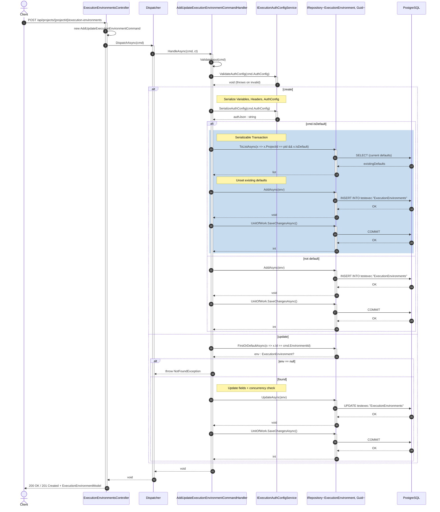
```mermaid
sequenceDiagram
    autonumber
    actor Client
    participant Ctrl as ExecutionEnvironmentsController
    participant Disp as Dispatcher
    participant CmdH as AddUpdateExecutionEnvironmentCommandHandler
    participant AuthSvc as IExecutionAuthConfigService
    participant EnvRepo as IRepository~ExecutionEnvironment, Guid~
    participant DB as PostgreSQL

    Client->>Ctrl: POST /api/projects/{projectId}/execution-environments
    activate Ctrl

    Ctrl->>Ctrl: new AddUpdateExecutionEnvironmentCommand
    Ctrl->>Disp: DispatchAsync(cmd)
    activate Disp

    Disp->>CmdH: HandleAsync(cmd, ct)
    activate CmdH

    CmdH->>CmdH: ValidateInput(cmd)
    CmdH->>AuthSvc: ValidateAuthConfig(cmd.AuthConfig)
    activate AuthSvc
    AuthSvc-->>CmdH: void (throws on invalid)
    deactivate AuthSvc

    alt create
        Note right of CmdH: Serialize Variables, Headers, AuthConfig
        CmdH->>AuthSvc: SerializeAuthConfig(cmd.AuthConfig)
        activate AuthSvc
        AuthSvc-->>CmdH: authJson : string
        deactivate AuthSvc

        alt cmd.IsDefault
            rect rgb(200, 220, 240)
                Note right of CmdH: Serializable Transaction

                CmdH->>EnvRepo: ToListAsync(x => x.ProjectId == pid && x.IsDefault)
                activate EnvRepo
                EnvRepo->>DB: SELECT (current defaults)
                DB-->>EnvRepo: existingDefaults
                EnvRepo-->>CmdH: list
                deactivate EnvRepo

                Note right of CmdH: Unset existing defaults

                CmdH->>EnvRepo: AddAsync(env)
                activate EnvRepo
                EnvRepo->>DB: INSERT INTO testexec."ExecutionEnvironments"
                DB-->>EnvRepo: OK
                EnvRepo-->>CmdH: void
                deactivate EnvRepo

                CmdH->>EnvRepo: UnitOfWork.SaveChangesAsync()
                activate EnvRepo
                EnvRepo->>DB: COMMIT
                DB-->>EnvRepo: OK
                EnvRepo-->>CmdH: int
                deactivate EnvRepo
            end
        else not default
            CmdH->>EnvRepo: AddAsync(env)
            activate EnvRepo
            EnvRepo->>DB: INSERT INTO testexec."ExecutionEnvironments"
            DB-->>EnvRepo: OK
            EnvRepo-->>CmdH: void
            deactivate EnvRepo

            CmdH->>EnvRepo: UnitOfWork.SaveChangesAsync()
            activate EnvRepo
            EnvRepo->>DB: COMMIT
            DB-->>EnvRepo: OK
            EnvRepo-->>CmdH: int
            deactivate EnvRepo
        end

    else update
        CmdH->>EnvRepo: FirstOrDefaultAsync(x => x.Id == cmd.EnvironmentId)
        activate EnvRepo
        EnvRepo-->>CmdH: env : ExecutionEnvironment?
        deactivate EnvRepo

        alt env == null
            CmdH-->>Disp: throw NotFoundException
        else found
            Note right of CmdH: Update fields + concurrency check
            CmdH->>EnvRepo: UpdateAsync(env)
            activate EnvRepo
            EnvRepo->>DB: UPDATE testexec."ExecutionEnvironments"
            DB-->>EnvRepo: OK
            EnvRepo-->>CmdH: void
            deactivate EnvRepo

            CmdH->>EnvRepo: UnitOfWork.SaveChangesAsync()
            activate EnvRepo
            EnvRepo->>DB: COMMIT
            DB-->>EnvRepo: OK
            EnvRepo-->>CmdH: int
            deactivate EnvRepo
        end
    end

    CmdH-->>Disp: void
    deactivate CmdH
    Disp-->>Ctrl: void
    deactivate Disp
    Ctrl-->>Client: 200 OK / 201 Created + ExecutionEnvironmentModel
    deactivate Ctrl
```

---

## FE-05A — API Test Order Proposal

### FE-05A-SD-01: Propose Test Order

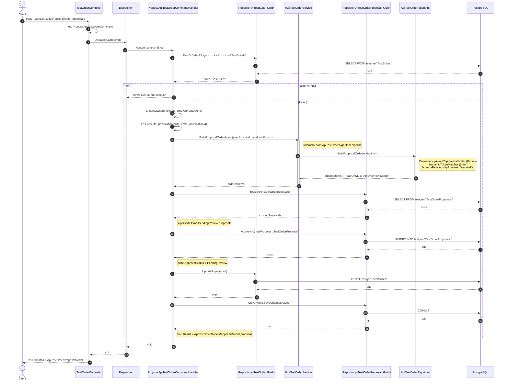
```mermaid
sequenceDiagram
    autonumber
    actor Client
    participant Ctrl as TestOrderController
    participant Disp as Dispatcher
    participant CmdH as ProposeApiTestOrderCommandHandler
    participant SuiteRepo as IRepository~TestSuite, Guid~
    participant OrderSvc as IApiTestOrderService
    participant ProposalRepo as IRepository~TestOrderProposal, Guid~
    participant Algo as ApiTestOrderAlgorithm
    participant DB as PostgreSQL

    Client->>Ctrl: POST /api/test-suites/{suiteId}/order-proposals
    activate Ctrl

    Ctrl->>Ctrl: new ProposeApiTestOrderCommand
    Ctrl->>Disp: DispatchAsync(cmd)
    activate Disp

    Disp->>CmdH: HandleAsync(cmd, ct)
    activate CmdH

    CmdH->>SuiteRepo: FirstOrDefaultAsync(x => x.Id == cmd.TestSuiteId)
    activate SuiteRepo
    SuiteRepo->>DB: SELECT FROM testgen."TestSuites"
    DB-->>SuiteRepo: row?
    SuiteRepo-->>CmdH: suite : TestSuite?
    deactivate SuiteRepo

    alt suite == null
        CmdH-->>Disp: throw NotFoundException
    else found
        CmdH->>CmdH: EnsureOwnership(suite, cmd.CurrentUserId)
        CmdH->>CmdH: EnsureSuiteSpecification(suite, cmd.SpecificationId)

        CmdH->>OrderSvc: BuildProposalOrderAsync(specId, suiteId, endpointIds, ct)
        activate OrderSvc

        Note right of OrderSvc: Internally calls ApiTestOrderAlgorithm pipeline
        OrderSvc->>Algo: BuildProposalOrder(endpoints)
        activate Algo
        Note right of Algo: DependencyAwareTopologicalSorter (Kahn's)<br/>SemanticTokenMatcher (5-tier)<br/>SchemaRelationshipAnalyzer (Warshall's)
        Algo-->>OrderSvc: orderedItems : IReadOnlyList~ApiOrderItemModel~
        deactivate Algo

        OrderSvc-->>CmdH: orderedItems
        deactivate OrderSvc

        CmdH->>ProposalRepo: ToListAsync(existing proposals)
        activate ProposalRepo
        ProposalRepo->>DB: SELECT FROM testgen."TestOrderProposals"
        DB-->>ProposalRepo: rows
        ProposalRepo-->>CmdH: existingProposals
        deactivate ProposalRepo

        Note right of CmdH: Supersede Draft/PendingReview proposals

        CmdH->>ProposalRepo: AddAsync(newProposal : TestOrderProposal)
        activate ProposalRepo
        ProposalRepo->>DB: INSERT INTO testgen."TestOrderProposals"
        DB-->>ProposalRepo: OK
        ProposalRepo-->>CmdH: void
        deactivate ProposalRepo

        Note right of CmdH: suite.ApprovalStatus = PendingReview

        CmdH->>SuiteRepo: UpdateAsync(suite)
        activate SuiteRepo
        SuiteRepo->>DB: UPDATE testgen."TestSuites"
        DB-->>SuiteRepo: OK
        SuiteRepo-->>CmdH: void
        deactivate SuiteRepo

        CmdH->>ProposalRepo: UnitOfWork.SaveChangesAsync()
        activate ProposalRepo
        ProposalRepo->>DB: COMMIT
        DB-->>ProposalRepo: OK
        ProposalRepo-->>CmdH: int
        deactivate ProposalRepo

        Note right of CmdH: cmd.Result = ApiTestOrderModelMapper.ToModel(proposal)
    end

    CmdH-->>Disp: void
    deactivate CmdH
    Disp-->>Ctrl: void
    deactivate Disp
    Ctrl-->>Client: 201 Created + ApiTestOrderProposalModel
    deactivate Ctrl
```

---

### FE-05A-SD-02: Approve Test Order

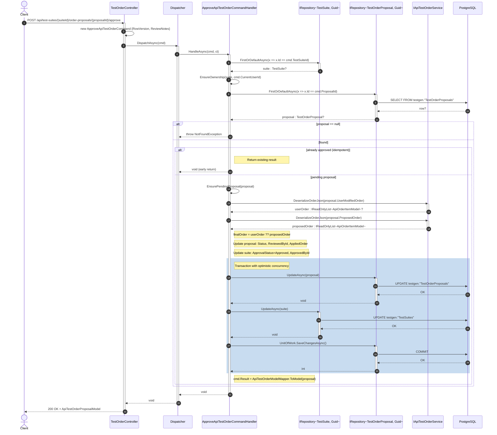
```mermaid
sequenceDiagram
    autonumber
    actor Client
    participant Ctrl as TestOrderController
    participant Disp as Dispatcher
    participant CmdH as ApproveApiTestOrderCommandHandler
    participant SuiteRepo as IRepository~TestSuite, Guid~
    participant ProposalRepo as IRepository~TestOrderProposal, Guid~
    participant OrderSvc as IApiTestOrderService
    participant DB as PostgreSQL

    Client->>Ctrl: POST /api/test-suites/{suiteId}/order-proposals/{proposalId}/approve
    activate Ctrl

    Ctrl->>Ctrl: new ApproveApiTestOrderCommand {RowVersion, ReviewNotes}
    Ctrl->>Disp: DispatchAsync(cmd)
    activate Disp

    Disp->>CmdH: HandleAsync(cmd, ct)
    activate CmdH

    CmdH->>SuiteRepo: FirstOrDefaultAsync(x => x.Id == cmd.TestSuiteId)
    activate SuiteRepo
    SuiteRepo-->>CmdH: suite : TestSuite?
    deactivate SuiteRepo

    CmdH->>CmdH: EnsureOwnership(suite, cmd.CurrentUserId)

    CmdH->>ProposalRepo: FirstOrDefaultAsync(x => x.Id == cmd.ProposalId)
    activate ProposalRepo
    ProposalRepo->>DB: SELECT FROM testgen."TestOrderProposals"
    DB-->>ProposalRepo: row?
    ProposalRepo-->>CmdH: proposal : TestOrderProposal?
    deactivate ProposalRepo

    alt proposal == null
        CmdH-->>Disp: throw NotFoundException
    else found

        alt already approved (idempotent)
            Note right of CmdH: Return existing result
            CmdH-->>Disp: void (early return)
        else pending proposal

            CmdH->>CmdH: EnsurePendingProposal(proposal)

            CmdH->>OrderSvc: DeserializeOrderJson(proposal.UserModifiedOrder)
            activate OrderSvc
            OrderSvc-->>CmdH: userOrder : IReadOnlyList~ApiOrderItemModel~?
            deactivate OrderSvc

            CmdH->>OrderSvc: DeserializeOrderJson(proposal.ProposedOrder)
            activate OrderSvc
            OrderSvc-->>CmdH: proposedOrder : IReadOnlyList~ApiOrderItemModel~
            deactivate OrderSvc

            Note right of CmdH: finalOrder = userOrder ?? proposedOrder

            Note right of CmdH: Update proposal: Status, ReviewedById, AppliedOrder
            Note right of CmdH: Update suite: ApprovalStatus=Approved, ApprovedById

            rect rgb(200, 220, 240)
                Note right of CmdH: Transaction with optimistic concurrency

                CmdH->>ProposalRepo: UpdateAsync(proposal)
                activate ProposalRepo
                ProposalRepo->>DB: UPDATE testgen."TestOrderProposals"
                DB-->>ProposalRepo: OK
                ProposalRepo-->>CmdH: void
                deactivate ProposalRepo

                CmdH->>SuiteRepo: UpdateAsync(suite)
                activate SuiteRepo
                SuiteRepo->>DB: UPDATE testgen."TestSuites"
                DB-->>SuiteRepo: OK
                SuiteRepo-->>CmdH: void
                deactivate SuiteRepo

                CmdH->>ProposalRepo: UnitOfWork.SaveChangesAsync()
                activate ProposalRepo
                ProposalRepo->>DB: COMMIT
                DB-->>ProposalRepo: OK
                ProposalRepo-->>CmdH: int
                deactivate ProposalRepo
            end

            Note right of CmdH: cmd.Result = ApiTestOrderModelMapper.ToModel(proposal)
        end
    end

    CmdH-->>Disp: void
    deactivate CmdH
    Disp-->>Ctrl: void
    deactivate Disp
    Ctrl-->>Client: 200 OK + ApiTestOrderProposalModel
    deactivate Ctrl
```

---

## FE-05B — Happy-Path Test Case Generation

### FE-05B-SD-01: Generate Happy-Path Test Cases (n8n LLM)

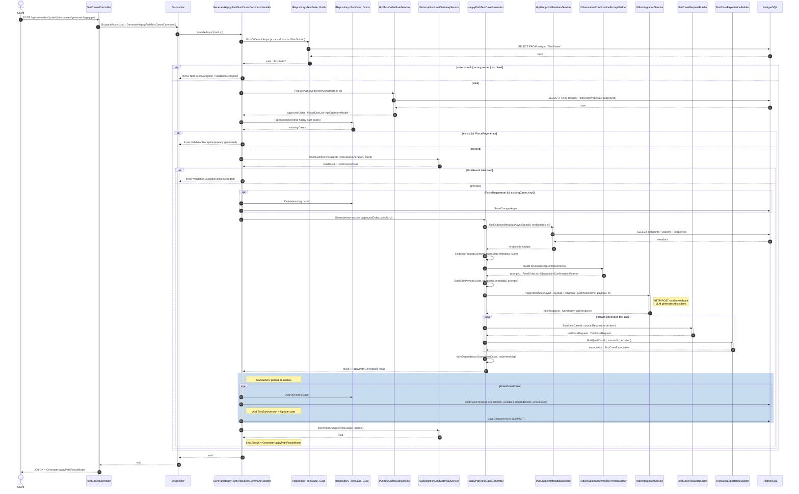
```mermaid
sequenceDiagram
    autonumber
    actor Client
    participant Ctrl as TestCasesController
    participant Disp as Dispatcher
    participant CmdH as GenerateHappyPathTestCasesCommandHandler
    participant SuiteRepo as IRepository~TestSuite, Guid~
    participant TCRepo as IRepository~TestCase, Guid~
    participant GateSvc as IApiTestOrderGateService
    participant LimitGw as ISubscriptionLimitGatewayService
    participant Gen as HappyPathTestCaseGenerator
    participant EpMeta as IApiEndpointMetadataService
    participant Prompt as IObservationConfirmationPromptBuilder
    participant N8n as IN8nIntegrationService
    participant ReqBld as TestCaseRequestBuilder
    participant ExpBld as TestCaseExpectationBuilder
    participant DB as PostgreSQL

    Client->>Ctrl: POST /api/test-suites/{suiteId}/test-cases/generate-happy-path
    activate Ctrl

    Ctrl->>Disp: DispatchAsync(cmd : GenerateHappyPathTestCasesCommand)
    activate Disp

    Disp->>CmdH: HandleAsync(cmd, ct)
    activate CmdH

    CmdH->>SuiteRepo: FirstOrDefaultAsync(x => x.Id == cmd.TestSuiteId)
    activate SuiteRepo
    SuiteRepo->>DB: SELECT FROM testgen."TestSuites"
    DB-->>SuiteRepo: row?
    SuiteRepo-->>CmdH: suite : TestSuite?
    deactivate SuiteRepo

    alt suite == null || wrong owner || archived
        CmdH-->>Disp: throw NotFoundException / ValidationException
    else valid

        CmdH->>GateSvc: RequireApprovedOrderAsync(suiteId, ct)
        activate GateSvc
        GateSvc->>DB: SELECT FROM testgen."TestOrderProposals" (approved)
        DB-->>GateSvc: rows
        GateSvc-->>CmdH: approvedOrder : IReadOnlyList~ApiOrderItemModel~
        deactivate GateSvc

        CmdH->>TCRepo: ToListAsync(existing happy-path cases)
        activate TCRepo
        TCRepo-->>CmdH: existingCases
        deactivate TCRepo

        alt exists && !ForceRegenerate
            CmdH-->>Disp: throw ValidationException(already generated)
        else proceed

            CmdH->>LimitGw: CheckLimitAsync(userId, TestCaseGeneration, count)
            activate LimitGw
            LimitGw-->>CmdH: limitResult : LimitCheckResult
            deactivate LimitGw

            alt !limitResult.IsAllowed
                CmdH-->>Disp: throw ValidationException(limit exceeded)
            else limit OK

                opt ForceRegenerate && existingCases.Any()
                    CmdH->>TCRepo: Delete(existing cases)
                    CmdH->>DB: SaveChangesAsync
                end

                CmdH->>Gen: GenerateAsync(suite, approvedOrder, specId, ct)
                activate Gen

                Gen->>EpMeta: GetEndpointMetadataAsync(specId, endpointIds, ct)
                activate EpMeta
                EpMeta->>DB: SELECT endpoints + params + responses
                DB-->>EpMeta: metadata
                EpMeta-->>Gen: endpointMetadata
                deactivate EpMeta

                Gen->>Gen: EndpointPromptContextMapper.Map(metadata, suite)
                Gen->>Prompt: BuildForSequence(promptContexts)
                activate Prompt
                Prompt-->>Gen: prompts : IReadOnlyList~ObservationConfirmationPrompt~
                deactivate Prompt

                Gen->>Gen: BuildN8nPayload(suite, endpoints, metadata, prompts)

                Gen->>N8n: TriggerWebhookAsync~Payload, Response~(webhookName, payload, ct)
                activate N8n
                Note right of N8n: HTTP POST to n8n webhook<br/>LLM generates test cases
                N8n-->>Gen: n8nResponse : N8nHappyPathResponse
                deactivate N8n

                loop foreach generated test case
                    Gen->>ReqBld: Build(testCaseId, source.Request, orderItem)
                    activate ReqBld
                    ReqBld-->>Gen: testCaseRequest : TestCaseRequest
                    deactivate ReqBld

                    Gen->>ExpBld: Build(testCaseId, source.Expectation)
                    activate ExpBld
                    ExpBld-->>Gen: expectation : TestCaseExpectation
                    deactivate ExpBld
                end

                Gen->>Gen: WireDependencyChains(testCases, orderItemMap)
                Gen-->>CmdH: result : HappyPathGenerationResult
                deactivate Gen

                rect rgb(200, 220, 240)
                    Note right of CmdH: Transaction: persist all entities

                    loop foreach testCase
                        CmdH->>TCRepo: AddAsync(testCase)
                        CmdH->>DB: AddAsync(request, expectation, variables, dependencies, changeLog)
                    end

                    Note right of CmdH: Add TestSuiteVersion + Update suite

                    CmdH->>DB: SaveChangesAsync (COMMIT)
                end

                CmdH->>LimitGw: IncrementUsageAsync(usageRequest)
                activate LimitGw
                LimitGw-->>CmdH: void
                deactivate LimitGw

                Note right of CmdH: cmd.Result = GenerateHappyPathResultModel
            end
        end
    end

    CmdH-->>Disp: void
    deactivate CmdH
    Disp-->>Ctrl: void
    deactivate Disp
    Ctrl-->>Client: 200 OK + GenerateHappyPathResultModel
    deactivate Ctrl
```

---

## FE-06 — Boundary & Negative Test Generation

### FE-06-SD-01: Generate Boundary & Negative Test Cases

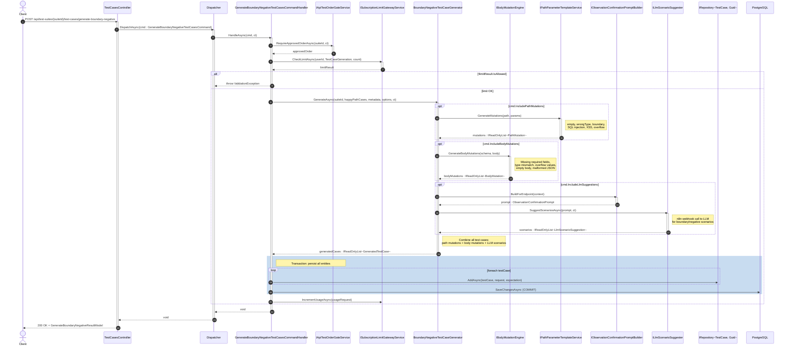
```mermaid
sequenceDiagram
    autonumber
    actor Client
    participant Ctrl as TestCasesController
    participant Disp as Dispatcher
    participant CmdH as GenerateBoundaryNegativeTestCasesCommandHandler
    participant GateSvc as IApiTestOrderGateService
    participant LimitGw as ISubscriptionLimitGatewayService
    participant Gen as BoundaryNegativeTestCaseGenerator
    participant BodyMut as IBodyMutationEngine
    participant PathSvc as IPathParameterTemplateService
    participant PromptBld as IObservationConfirmationPromptBuilder
    participant LlmSug as ILlmScenarioSuggester
    participant TCRepo as IRepository~TestCase, Guid~
    participant DB as PostgreSQL

    Client->>Ctrl: POST /api/test-suites/{suiteId}/test-cases/generate-boundary-negative
    activate Ctrl

    Ctrl->>Disp: DispatchAsync(cmd : GenerateBoundaryNegativeTestCasesCommand)
    activate Disp

    Disp->>CmdH: HandleAsync(cmd, ct)
    activate CmdH

    CmdH->>GateSvc: RequireApprovedOrderAsync(suiteId, ct)
    activate GateSvc
    GateSvc-->>CmdH: approvedOrder
    deactivate GateSvc

    CmdH->>LimitGw: CheckLimitAsync(userId, TestCaseGeneration, count)
    activate LimitGw
    LimitGw-->>CmdH: limitResult
    deactivate LimitGw

    alt !limitResult.IsAllowed
        CmdH-->>Disp: throw ValidationException
    else limit OK

        CmdH->>Gen: GenerateAsync(suiteId, happyPathCases, metadata, options, ct)
        activate Gen

        opt cmd.IncludePathMutations
            Gen->>PathSvc: GenerateMutations(path, params)
            activate PathSvc
            Note right of PathSvc: empty, wrongType, boundary,<br/>SQL injection, XSS, overflow
            PathSvc-->>Gen: mutations : IReadOnlyList~PathMutation~
            deactivate PathSvc
        end

        opt cmd.IncludeBodyMutations
            Gen->>BodyMut: GenerateBodyMutations(schema, body)
            activate BodyMut
            Note right of BodyMut: Missing required fields,<br/>type mismatch, overflow values,<br/>empty body, malformed JSON
            BodyMut-->>Gen: bodyMutations : IReadOnlyList~BodyMutation~
            deactivate BodyMut
        end

        opt cmd.IncludeLlmSuggestions
            Gen->>PromptBld: BuildForEndpoint(context)
            activate PromptBld
            PromptBld-->>Gen: prompt : ObservationConfirmationPrompt
            deactivate PromptBld

            Gen->>LlmSug: SuggestScenariosAsync(prompt, ct)
            activate LlmSug
            Note right of LlmSug: n8n webhook call to LLM<br/>for boundary/negative scenarios
            LlmSug-->>Gen: scenarios : IReadOnlyList~LlmScenarioSuggestion~
            deactivate LlmSug
        end

        Note right of Gen: Combine all test cases:<br/>path mutations + body mutations + LLM scenarios

        Gen-->>CmdH: generatedCases : IReadOnlyList~GeneratedTestCase~
        deactivate Gen

        rect rgb(200, 220, 240)
            Note right of CmdH: Transaction: persist all entities

            loop foreach testCase
                CmdH->>TCRepo: AddAsync(testCase, request, expectation)
            end

            CmdH->>DB: SaveChangesAsync (COMMIT)
        end

        CmdH->>LimitGw: IncrementUsageAsync(usageRequest)
    end

    CmdH-->>Disp: void
    deactivate CmdH
    Disp-->>Ctrl: void
    deactivate Disp
    Ctrl-->>Client: 200 OK + GenerateBoundaryNegativeResultModel
    deactivate Ctrl
```

---

## FE-07/08 — Test Execution + Rule-based Validation

### FE-07-SD-01: Start Test Run (Execution + Validation)

```mermaid
sequenceDiagram
    autonumber
    actor Client
    participant Ctrl as TestRunsController
    participant Disp as Dispatcher
    participant CmdH as StartTestRunCommandHandler
    participant GateSvc as ITestExecutionReadGatewayService
    participant LimitSvc as ISubscriptionLimitGatewayService
    participant EnvRepo as IRepository~ExecutionEnvironment, Guid~
    participant RunRepo as IRepository~TestRun, Guid~
    participant Orch as TestExecutionOrchestrator
    participant EnvResolver as IExecutionEnvironmentRuntimeResolver
    participant EpMeta as IApiEndpointMetadataService
    participant PreVal as IPreExecutionValidator
    participant Resolver as IVariableResolver
    participant Executor as IHttpTestExecutor
    participant Extractor as IVariableExtractor
    participant Validator as IRuleBasedValidator
    participant Collector as ITestResultCollector
    participant DB as PostgreSQL

    Client->>Ctrl: POST /api/test-suites/{suiteId}/test-runs {environmentId?, validationProfile, retryPolicy, selectedTestCaseIds?}
    activate Ctrl

    Ctrl->>Disp: DispatchAsync(cmd : StartTestRunCommand)
    activate Disp

    Disp->>CmdH: HandleAsync(cmd, ct)
    activate CmdH

    CmdH->>GateSvc: GetSuiteAccessContextAsync(cmd.TestSuiteId, ct)
    activate GateSvc
    GateSvc->>DB: SELECT FROM testgen."TestSuites"
    DB-->>GateSvc: suiteContext
    GateSvc-->>CmdH: suiteContext : SuiteAccessContext
    deactivate GateSvc

    alt suiteContext.CreatedById != cmd.CurrentUserId || suite not Ready
        CmdH-->>Disp: throw ValidationException
    else owned & ready

        alt environmentId provided
            CmdH->>EnvRepo: FirstOrDefaultAsync(x => x.Id == cmd.EnvironmentId)
        else use default
            CmdH->>EnvRepo: FirstOrDefaultAsync(x => x.IsDefault && x.ProjectId == projectId)
        end
        activate EnvRepo
        EnvRepo->>DB: SELECT FROM testexec."ExecutionEnvironments"
        DB-->>EnvRepo: environment?
        EnvRepo-->>CmdH: environment : ExecutionEnvironment?
        deactivate EnvRepo

        alt environment == null
            CmdH-->>Disp: throw NotFoundException
        else found

            CmdH->>RunRepo: ToListAsync(running/pending by user)
            activate RunRepo
            RunRepo->>DB: SELECT FROM testexec."TestRuns" WHERE Status IN (Pending, Running)
            DB-->>RunRepo: runningCount
            RunRepo-->>CmdH: currentRunning : int
            deactivate RunRepo

            CmdH->>LimitSvc: CheckLimitAsync(userId, MaxConcurrentRuns, currentRunning+1, ct)
            activate LimitSvc
            LimitSvc-->>CmdH: concurrentCheck : LimitCheckResult
            deactivate LimitSvc

            alt !concurrentCheck.IsAllowed
                CmdH-->>Disp: throw ValidationException (concurrent run limit)
            else OK

                CmdH->>LimitSvc: TryConsumeLimitAsync(userId, MaxTestRunsPerMonth, 1, ct)
                activate LimitSvc
                LimitSvc-->>CmdH: monthlyCheck : LimitCheckResult
                deactivate LimitSvc

                alt !monthlyCheck.IsAllowed
                    CmdH-->>Disp: throw ValidationException (monthly quota)
                else OK

                    rect rgb(200, 220, 240)
                        Note right of CmdH: Serializable Transaction: Allocate RunNumber + Insert Pending run

                        CmdH->>RunRepo: Max(RunNumber) WHERE TestSuiteId = suiteId
                        activate RunRepo
                        RunRepo->>DB: SELECT MAX("RunNumber") FROM testexec."TestRuns"
                        DB-->>RunRepo: maxRunNumber?
                        RunRepo-->>CmdH: int?
                        deactivate RunRepo

                        CmdH->>RunRepo: AddAsync(run : TestRun {Status=Pending, IsEphemeral=!cmd.RecordRun})
                        activate RunRepo
                        RunRepo->>DB: INSERT INTO testexec."TestRuns"
                        DB-->>RunRepo: OK
                        RunRepo-->>CmdH: void
                        deactivate RunRepo

                        CmdH->>RunRepo: UnitOfWork.SaveChangesAsync()
                        activate RunRepo
                        RunRepo->>DB: COMMIT (Serializable)
                        DB-->>RunRepo: OK
                        RunRepo-->>CmdH: int
                        deactivate RunRepo
                    end

                    Note right of CmdH: Build effectivePolicy (cap MaxRetryAttempts ≤ 3)<br/>Determine effectiveProfile (Default|SrsStrict)

                    CmdH->>Orch: ExecuteAsync(runId, userId, selectedIds, ct, strictValidation, effectivePolicy, effectiveProfile)
                    activate Orch

                    Orch->>GateSvc: GetExecutionContextAsync(suiteId, selectedIds, ct)
                    activate GateSvc
                    GateSvc->>DB: SELECT TestCases ordered by dependency
                    DB-->>GateSvc: executionContext
                    GateSvc-->>Orch: executionContext : ExecutionContextDto
                    deactivate GateSvc

                    Orch->>EnvResolver: ResolveAsync(environment, ct)
                    activate EnvResolver
                    Note right of EnvResolver: Inject runtime vars:<br/>runId, runSuffix, runTimestamp,<br/>runUniqueEmail, runUniquePassword<br/>Resolve auth configs (OAuth, ApiKey, etc.)
                    EnvResolver-->>Orch: resolvedEnv : ResolvedExecutionEnvironment
                    deactivate EnvResolver

                    Orch->>EpMeta: GetEndpointMetadataAsync(specId, endpointIds, ct)
                    activate EpMeta
                    EpMeta->>DB: SELECT endpoint schemas + response definitions
                    DB-->>EpMeta: metadata
                    EpMeta-->>Orch: endpointMetadataMap : Dictionary~Guid, ApiEndpointMetadataDto~
                    deactivate EpMeta

                    Orch->>RunRepo: UpdateAsync(run : Status=Running, StartedAt)
                    activate RunRepo
                    RunRepo->>DB: UPDATE testexec."TestRuns"
                    DB-->>RunRepo: OK
                    RunRepo-->>Orch: void
                    deactivate RunRepo

                    loop foreach testCase in dependency order
                        Orch->>PreVal: Validate(testCase, resolvedEnv, variableBag, endpointMetadata)
                        activate PreVal
                        Note right of PreVal: Pre-checks: env baseUrl,<br/>path params, query params,<br/>body schema, unresolved {{placeholders}},<br/>variable chaining completeness
                        PreVal-->>Orch: preResult : PreExecutionValidationResult
                        deactivate PreVal

                        alt failedDependencies detected
                            Note right of Orch: Build SkippedResult (DependencyFailed)<br/>SummarizeDependencyRootCause
                        else proceed

                            Orch->>Resolver: Resolve(testCase.Request, variableBag, resolvedEnv)
                            activate Resolver
                            Note right of Resolver: Replace {{variable}} placeholders<br/>with extracted + runtime values
                            Resolver-->>Orch: resolvedRequest : ResolvedTestCaseRequest
                            deactivate Resolver

                            Orch->>Executor: ExecuteAsync(resolvedRequest, resolvedEnv, ct)
                            activate Executor
                            Note right of Executor: HttpClient.SendAsync<br/>with timeout, headers, auth
                            Executor-->>Orch: response : HttpTestResponse
                            deactivate Executor

                            Orch->>Extractor: Extract(response, testCase.Variables)
                            activate Extractor
                            Note right of Extractor: JSONPath, Header, Regex extraction
                            Extractor-->>Orch: extractedVars : Dictionary~string, string~
                            deactivate Extractor

                            Note right of Orch: Merge extractedVars into variableBag

                            Orch->>Validator: Validate(response, testCase, endpointMetadata, effectiveProfile)
                            activate Validator
                            Note right of Validator: 7 checks: StatusCode, ResponseSchema,<br/>Headers, BodyContains, BodyNotContains,<br/>JSONPath, MaxResponseTime<br/>(SrsStrict profile = strict status matching)
                            Validator-->>Orch: validationResult : TestCaseValidationResult
                            deactivate Validator
                        end

                        Note right of Orch: Track attempt (BuildAttemptModel, RecordResult)<br/>Retry loop if retryPolicy.EnableRetry && ShouldRetryCase
                    end

                    opt retryPolicy.RerunSkippedCases
                        Note right of Orch: ReplayEligibleSkippedCasesAsync
                    end

                    Orch->>Collector: CollectAsync(run, orderedResults, retentionDays, envName, ct, attempts)
                    activate Collector
                    Collector->>DB: INSERT testexec."TestCaseAttempts" + UPDATE testexec."TestRuns" (Completed, counters)
                    DB-->>Collector: OK
                    Collector-->>Orch: result : TestRunResultModel
                    deactivate Collector

                    Orch-->>CmdH: result : TestRunResultModel
                    deactivate Orch

                    Note right of CmdH: cmd.Result = result
                end
            end
        end
    end

    CmdH-->>Disp: void
    deactivate CmdH
    Disp-->>Ctrl: void
    deactivate Disp
    Ctrl-->>Client: 201 Created + TestRunResultModel
    deactivate Ctrl
```

---

## FE-09 — LLM Failure Explanations

### FE-09-SD-01: Explain Test Failure via LLM

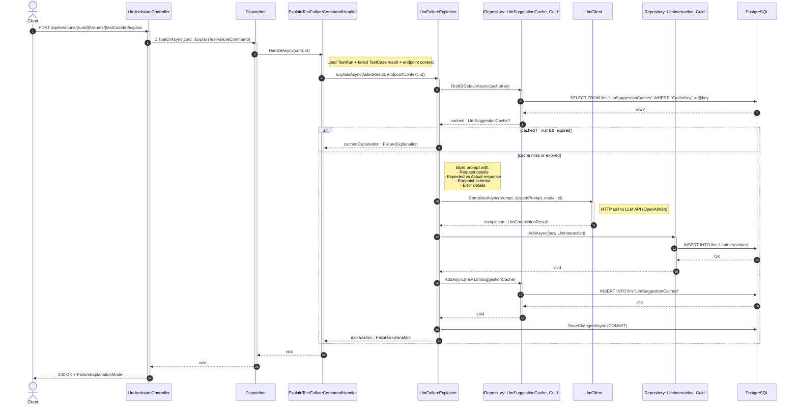
```mermaid
sequenceDiagram
    autonumber
    actor Client
    participant Ctrl as LlmAssistantController
    participant Disp as Dispatcher
    participant CmdH as ExplainTestFailureCommandHandler
    participant Explainer as LlmFailureExplainer
    participant Cache as IRepository~LlmSuggestionCache, Guid~
    participant LlmClient as ILlmClient
    participant InterRepo as IRepository~LlmInteraction, Guid~
    participant DB as PostgreSQL

    Client->>Ctrl: POST /api/test-runs/{runId}/failures/{testCaseId}/explain
    activate Ctrl

    Ctrl->>Disp: DispatchAsync(cmd : ExplainTestFailureCommand)
    activate Disp

    Disp->>CmdH: HandleAsync(cmd, ct)
    activate CmdH

    Note right of CmdH: Load TestRun + failed TestCase result + endpoint context

    CmdH->>Explainer: ExplainAsync(failedResult, endpointContext, ct)
    activate Explainer

    Explainer->>Cache: FirstOrDefaultAsync(cacheKey)
    activate Cache
    Cache->>DB: SELECT FROM llm."LlmSuggestionCaches" WHERE "CacheKey" = @key
    DB-->>Cache: row?
    Cache-->>Explainer: cached : LlmSuggestionCache?
    deactivate Cache

    alt cached != null && !expired
        Explainer-->>CmdH: cachedExplanation : FailureExplanation
    else cache miss or expired

        Note right of Explainer: Build prompt with:<br/>- Request details<br/>- Expected vs Actual response<br/>- Endpoint schema<br/>- Error details

        Explainer->>LlmClient: CompleteAsync(prompt, systemPrompt, model, ct)
        activate LlmClient
        Note right of LlmClient: HTTP call to LLM API (OpenAI/n8n)
        LlmClient-->>Explainer: completion : LlmCompletionResult
        deactivate LlmClient

        Explainer->>InterRepo: AddAsync(new LlmInteraction)
        activate InterRepo
        InterRepo->>DB: INSERT INTO llm."LlmInteractions"
        DB-->>InterRepo: OK
        InterRepo-->>Explainer: void
        deactivate InterRepo

        Explainer->>Cache: AddAsync(new LlmSuggestionCache)
        activate Cache
        Cache->>DB: INSERT INTO llm."LlmSuggestionCaches"
        DB-->>Cache: OK
        Cache-->>Explainer: void
        deactivate Cache

        Explainer->>DB: SaveChangesAsync (COMMIT)

        Explainer-->>CmdH: explanation : FailureExplanation
    end
    deactivate Explainer

    CmdH-->>Disp: void
    deactivate CmdH
    Disp-->>Ctrl: void
    deactivate Disp
    Ctrl-->>Client: 200 OK + FailureExplanationModel
    deactivate Ctrl
```

---

## FE-10 — Test Reporting & Export

### FE-10-SD-01: Generate Test Report

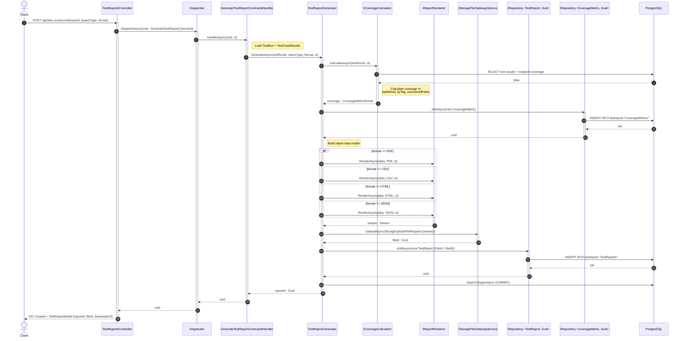
```mermaid
sequenceDiagram
    autonumber
    actor Client
    participant Ctrl as TestReportsController
    participant Disp as Dispatcher
    participant CmdH as GenerateTestReportCommandHandler
    participant ReportGen as TestReportGenerator
    participant CovCalc as ICoverageCalculator
    participant Renderer as IReportRenderer
    participant StorageGw as IStorageFileGatewayService
    participant ReportRepo as IRepository~TestReport, Guid~
    participant CovRepo as IRepository~CoverageMetric, Guid~
    participant DB as PostgreSQL

    Client->>Ctrl: POST /api/test-runs/{runId}/reports {reportType, format}
    activate Ctrl

    Ctrl->>Disp: DispatchAsync(cmd : GenerateTestReportCommand)
    activate Disp

    Disp->>CmdH: HandleAsync(cmd, ct)
    activate CmdH

    Note right of CmdH: Load TestRun + TestCaseResults

    CmdH->>ReportGen: GenerateAsync(testRunId, reportType, format, ct)
    activate ReportGen

    ReportGen->>CovCalc: CalculateAsync(testRunId, ct)
    activate CovCalc
    CovCalc->>DB: SELECT test results + endpoint coverage
    DB-->>CovCalc: data
    Note right of CovCalc: Calculate coverage %<br/>byMethod, byTag, uncoveredPaths
    CovCalc-->>ReportGen: coverage : CoverageMetricResult
    deactivate CovCalc

    ReportGen->>CovRepo: AddAsync(new CoverageMetric)
    activate CovRepo
    CovRepo->>DB: INSERT INTO testreport."CoverageMetrics"
    DB-->>CovRepo: OK
    CovRepo-->>ReportGen: void
    deactivate CovRepo

    Note right of ReportGen: Build report data model

    alt format == PDF
        ReportGen->>Renderer: RenderAsync(data, PDF, ct)
    else format == CSV
        ReportGen->>Renderer: RenderAsync(data, CSV, ct)
    else format == HTML
        ReportGen->>Renderer: RenderAsync(data, HTML, ct)
    else format == JSON
        ReportGen->>Renderer: RenderAsync(data, JSON, ct)
    end
    activate Renderer
    Renderer-->>ReportGen: stream : Stream
    deactivate Renderer

    ReportGen->>StorageGw: UploadAsync(StorageUploadFileRequest {stream})
    activate StorageGw
    StorageGw-->>ReportGen: fileId : Guid
    deactivate StorageGw

    ReportGen->>ReportRepo: AddAsync(new TestReport {FileId = fileId})
    activate ReportRepo
    ReportRepo->>DB: INSERT INTO testreport."TestReports"
    DB-->>ReportRepo: OK
    ReportRepo-->>ReportGen: void
    deactivate ReportRepo

    ReportGen->>DB: SaveChangesAsync (COMMIT)
    ReportGen-->>CmdH: reportId : Guid
    deactivate ReportGen

    CmdH-->>Disp: void
    deactivate CmdH
    Disp-->>Ctrl: void
    deactivate Disp
    Ctrl-->>Client: 201 Created + TestReportModel {reportId, fileId, downloadUrl}
    deactivate Ctrl
```

---

## FE-11 — Manual Entry Mode

### FE-11-SD-01: Create Manual Specification with Endpoints

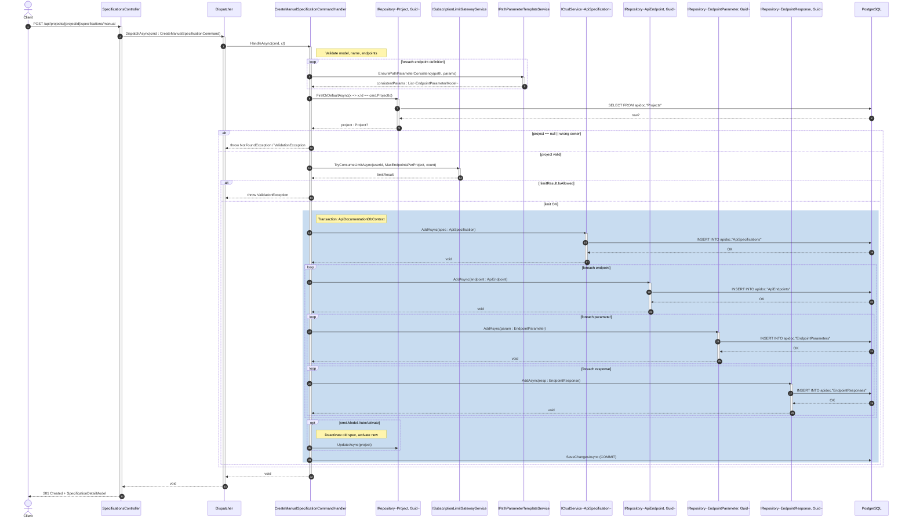
```mermaid
sequenceDiagram
    autonumber
    actor Client
    participant Ctrl as SpecificationsController
    participant Disp as Dispatcher
    participant CmdH as CreateManualSpecificationCommandHandler
    participant ProjRepo as IRepository~Project, Guid~
    participant LimitGw as ISubscriptionLimitGatewayService
    participant PathSvc as IPathParameterTemplateService
    participant SpecSvc as ICrudService~ApiSpecification~
    participant EpRepo as IRepository~ApiEndpoint, Guid~
    participant ParamRepo as IRepository~EndpointParameter, Guid~
    participant RespRepo as IRepository~EndpointResponse, Guid~
    participant DB as PostgreSQL

    Client->>Ctrl: POST /api/projects/{projectId}/specifications/manual
    activate Ctrl

    Ctrl->>Disp: DispatchAsync(cmd : CreateManualSpecificationCommand)
    activate Disp

    Disp->>CmdH: HandleAsync(cmd, ct)
    activate CmdH

    Note right of CmdH: Validate model, name, endpoints

    loop foreach endpoint definition
        CmdH->>PathSvc: EnsurePathParameterConsistency(path, params)
        activate PathSvc
        PathSvc-->>CmdH: consistentParams : List~EndpointParameterModel~
        deactivate PathSvc
    end

    CmdH->>ProjRepo: FirstOrDefaultAsync(x => x.Id == cmd.ProjectId)
    activate ProjRepo
    ProjRepo->>DB: SELECT FROM apidoc."Projects"
    DB-->>ProjRepo: row?
    ProjRepo-->>CmdH: project : Project?
    deactivate ProjRepo

    alt project == null || wrong owner
        CmdH-->>Disp: throw NotFoundException / ValidationException
    else project valid

        CmdH->>LimitGw: TryConsumeLimitAsync(userId, MaxEndpointsPerProject, count)
        activate LimitGw
        LimitGw-->>CmdH: limitResult
        deactivate LimitGw

        alt !limitResult.IsAllowed
            CmdH-->>Disp: throw ValidationException
        else limit OK

            rect rgb(200, 220, 240)
                Note right of CmdH: Transaction: ApiDocumentationDbContext

                CmdH->>SpecSvc: AddAsync(spec : ApiSpecification)
                activate SpecSvc
                SpecSvc->>DB: INSERT INTO apidoc."ApiSpecifications"
                DB-->>SpecSvc: OK
                SpecSvc-->>CmdH: void
                deactivate SpecSvc

                loop foreach endpoint
                    CmdH->>EpRepo: AddAsync(endpoint : ApiEndpoint)
                    activate EpRepo
                    EpRepo->>DB: INSERT INTO apidoc."ApiEndpoints"
                    DB-->>EpRepo: OK
                    EpRepo-->>CmdH: void
                    deactivate EpRepo

                    loop foreach parameter
                        CmdH->>ParamRepo: AddAsync(param : EndpointParameter)
                        activate ParamRepo
                        ParamRepo->>DB: INSERT INTO apidoc."EndpointParameters"
                        DB-->>ParamRepo: OK
                        ParamRepo-->>CmdH: void
                        deactivate ParamRepo
                    end

                    loop foreach response
                        CmdH->>RespRepo: AddAsync(resp : EndpointResponse)
                        activate RespRepo
                        RespRepo->>DB: INSERT INTO apidoc."EndpointResponses"
                        DB-->>RespRepo: OK
                        RespRepo-->>CmdH: void
                        deactivate RespRepo
                    end
                end

                opt cmd.Model.AutoActivate
                    Note right of CmdH: Deactivate old spec, activate new
                    CmdH->>ProjRepo: UpdateAsync(project)
                end

                CmdH->>DB: SaveChangesAsync (COMMIT)
            end
        end
    end

    CmdH-->>Disp: void
    deactivate CmdH
    Disp-->>Ctrl: void
    deactivate Disp
    Ctrl-->>Client: 201 Created + SpecificationDetailModel
    deactivate Ctrl
```

---

## FE-12 — Path Parameter Templating

### FE-12-SD-01: Get Resolved URL & Path Parameter Mutations

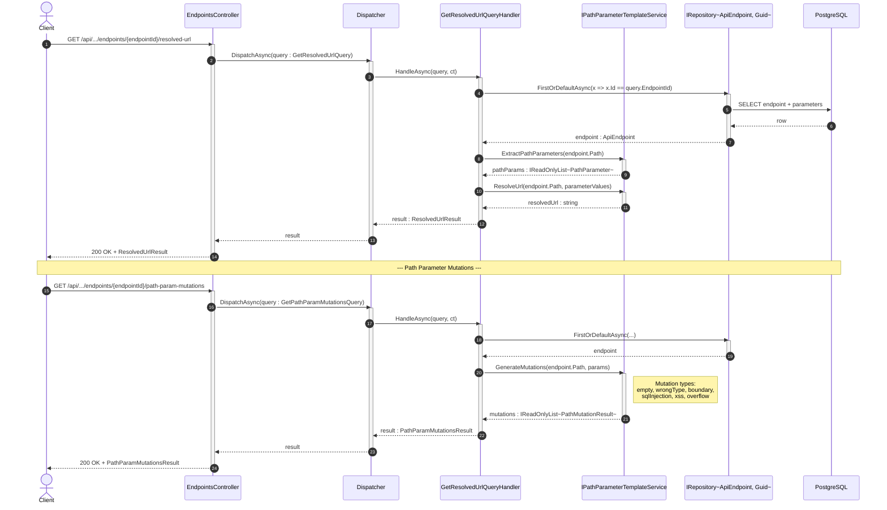
```mermaid
sequenceDiagram
    autonumber
    actor Client
    participant Ctrl as EndpointsController
    participant Disp as Dispatcher
    participant QryH as GetResolvedUrlQueryHandler
    participant PathSvc as IPathParameterTemplateService
    participant EpRepo as IRepository~ApiEndpoint, Guid~
    participant DB as PostgreSQL

    Client->>Ctrl: GET /api/.../endpoints/{endpointId}/resolved-url
    activate Ctrl

    Ctrl->>Disp: DispatchAsync(query : GetResolvedUrlQuery)
    activate Disp

    Disp->>QryH: HandleAsync(query, ct)
    activate QryH

    QryH->>EpRepo: FirstOrDefaultAsync(x => x.Id == query.EndpointId)
    activate EpRepo
    EpRepo->>DB: SELECT endpoint + parameters
    DB-->>EpRepo: row
    EpRepo-->>QryH: endpoint : ApiEndpoint
    deactivate EpRepo

    QryH->>PathSvc: ExtractPathParameters(endpoint.Path)
    activate PathSvc
    PathSvc-->>QryH: pathParams : IReadOnlyList~PathParameter~
    deactivate PathSvc

    QryH->>PathSvc: ResolveUrl(endpoint.Path, parameterValues)
    activate PathSvc
    PathSvc-->>QryH: resolvedUrl : string
    deactivate PathSvc

    QryH-->>Disp: result : ResolvedUrlResult
    deactivate QryH

    Disp-->>Ctrl: result
    deactivate Disp
    Ctrl-->>Client: 200 OK + ResolvedUrlResult
    deactivate Ctrl

    Note over Client, DB: --- Path Parameter Mutations ---

    Client->>Ctrl: GET /api/.../endpoints/{endpointId}/path-param-mutations
    activate Ctrl

    Ctrl->>Disp: DispatchAsync(query : GetPathParamMutationsQuery)
    activate Disp

    Disp->>QryH: HandleAsync(query, ct)
    activate QryH

    QryH->>EpRepo: FirstOrDefaultAsync(...)
    activate EpRepo
    EpRepo-->>QryH: endpoint
    deactivate EpRepo

    QryH->>PathSvc: GenerateMutations(endpoint.Path, params)
    activate PathSvc
    Note right of PathSvc: Mutation types:<br/>empty, wrongType, boundary,<br/>sqlInjection, xss, overflow
    PathSvc-->>QryH: mutations : IReadOnlyList~PathMutationResult~
    deactivate PathSvc

    QryH-->>Disp: result : PathParamMutationsResult
    deactivate QryH
    Disp-->>Ctrl: result
    deactivate Disp
    Ctrl-->>Client: 200 OK + PathParamMutationsResult
    deactivate Ctrl
```

---

## FE-13 — cURL Import

### FE-13-SD-01: Import cURL Command

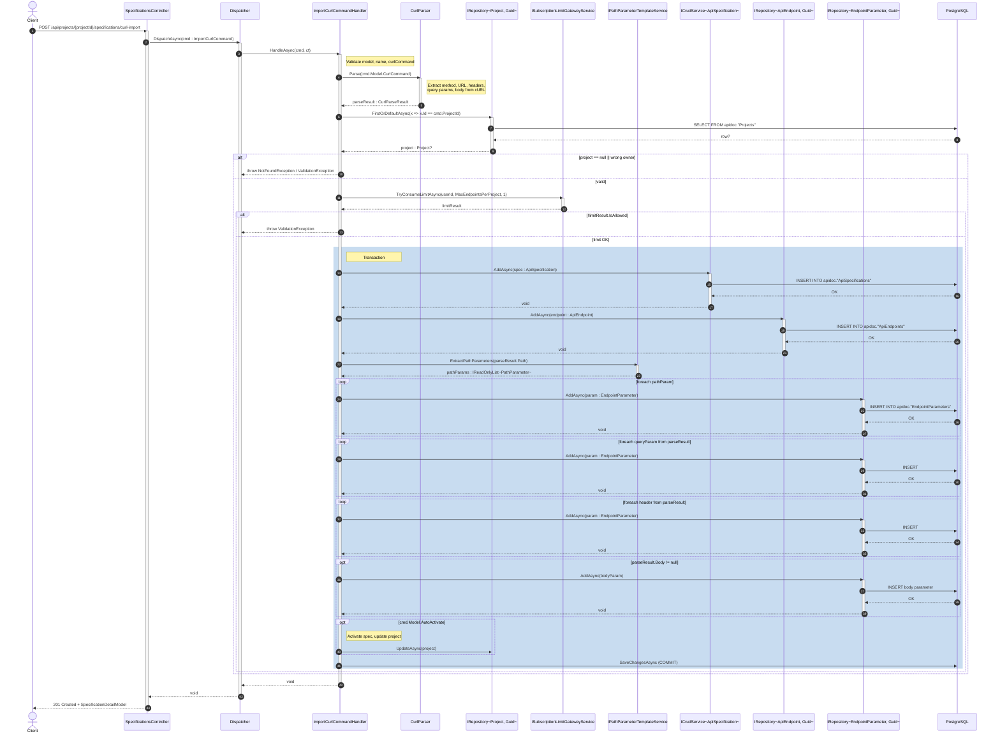
```mermaid
sequenceDiagram
    autonumber
    actor Client
    participant Ctrl as SpecificationsController
    participant Disp as Dispatcher
    participant CmdH as ImportCurlCommandHandler
    participant Parser as CurlParser
    participant ProjRepo as IRepository~Project, Guid~
    participant LimitGw as ISubscriptionLimitGatewayService
    participant PathSvc as IPathParameterTemplateService
    participant SpecSvc as ICrudService~ApiSpecification~
    participant EpRepo as IRepository~ApiEndpoint, Guid~
    participant ParamRepo as IRepository~EndpointParameter, Guid~
    participant DB as PostgreSQL

    Client->>Ctrl: POST /api/projects/{projectId}/specifications/curl-import
    activate Ctrl

    Ctrl->>Disp: DispatchAsync(cmd : ImportCurlCommand)
    activate Disp

    Disp->>CmdH: HandleAsync(cmd, ct)
    activate CmdH

    Note right of CmdH: Validate model, name, curlCommand

    CmdH->>Parser: Parse(cmd.Model.CurlCommand)
    activate Parser
    Note right of Parser: Extract method, URL, headers,<br/>query params, body from cURL
    Parser-->>CmdH: parseResult : CurlParseResult
    deactivate Parser

    CmdH->>ProjRepo: FirstOrDefaultAsync(x => x.Id == cmd.ProjectId)
    activate ProjRepo
    ProjRepo->>DB: SELECT FROM apidoc."Projects"
    DB-->>ProjRepo: row?
    ProjRepo-->>CmdH: project : Project?
    deactivate ProjRepo

    alt project == null || wrong owner
        CmdH-->>Disp: throw NotFoundException / ValidationException
    else valid

        CmdH->>LimitGw: TryConsumeLimitAsync(userId, MaxEndpointsPerProject, 1)
        activate LimitGw
        LimitGw-->>CmdH: limitResult
        deactivate LimitGw

        alt !limitResult.IsAllowed
            CmdH-->>Disp: throw ValidationException
        else limit OK

            rect rgb(200, 220, 240)
                Note right of CmdH: Transaction

                CmdH->>SpecSvc: AddAsync(spec : ApiSpecification)
                activate SpecSvc
                SpecSvc->>DB: INSERT INTO apidoc."ApiSpecifications"
                DB-->>SpecSvc: OK
                SpecSvc-->>CmdH: void
                deactivate SpecSvc

                CmdH->>EpRepo: AddAsync(endpoint : ApiEndpoint)
                activate EpRepo
                EpRepo->>DB: INSERT INTO apidoc."ApiEndpoints"
                DB-->>EpRepo: OK
                EpRepo-->>CmdH: void
                deactivate EpRepo

                CmdH->>PathSvc: ExtractPathParameters(parseResult.Path)
                activate PathSvc
                PathSvc-->>CmdH: pathParams : IReadOnlyList~PathParameter~
                deactivate PathSvc

                loop foreach pathParam
                    CmdH->>ParamRepo: AddAsync(param : EndpointParameter)
                    activate ParamRepo
                    ParamRepo->>DB: INSERT INTO apidoc."EndpointParameters"
                    DB-->>ParamRepo: OK
                    ParamRepo-->>CmdH: void
                    deactivate ParamRepo
                end

                loop foreach queryParam from parseResult
                    CmdH->>ParamRepo: AddAsync(param : EndpointParameter)
                    activate ParamRepo
                    ParamRepo->>DB: INSERT
                    DB-->>ParamRepo: OK
                    ParamRepo-->>CmdH: void
                    deactivate ParamRepo
                end

                loop foreach header from parseResult
                    CmdH->>ParamRepo: AddAsync(param : EndpointParameter)
                    activate ParamRepo
                    ParamRepo->>DB: INSERT
                    DB-->>ParamRepo: OK
                    ParamRepo-->>CmdH: void
                    deactivate ParamRepo
                end

                opt parseResult.Body != null
                    CmdH->>ParamRepo: AddAsync(bodyParam)
                    activate ParamRepo
                    ParamRepo->>DB: INSERT body parameter
                    DB-->>ParamRepo: OK
                    ParamRepo-->>CmdH: void
                    deactivate ParamRepo
                end

                opt cmd.Model.AutoActivate
                    Note right of CmdH: Activate spec, update project
                    CmdH->>ProjRepo: UpdateAsync(project)
                end

                CmdH->>DB: SaveChangesAsync (COMMIT)
            end
        end
    end

    CmdH-->>Disp: void
    deactivate CmdH
    Disp-->>Ctrl: void
    deactivate Disp
    Ctrl-->>Client: 201 Created + SpecificationDetailModel
    deactivate Ctrl
```

---

## FE-14 — Subscription & Billing

### FE-14-SD-01: Subscribe to Plan (Create Payment)

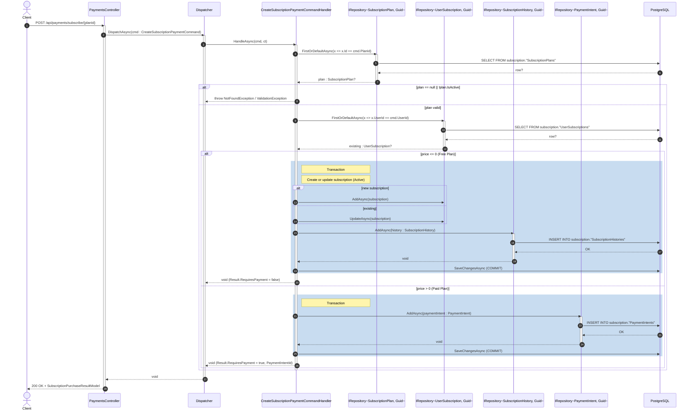
```mermaid
sequenceDiagram
    autonumber
    actor Client
    participant Ctrl as PaymentsController
    participant Disp as Dispatcher
    participant CmdH as CreateSubscriptionPaymentCommandHandler
    participant PlanRepo as IRepository~SubscriptionPlan, Guid~
    participant SubRepo as IRepository~UserSubscription, Guid~
    participant HistRepo as IRepository~SubscriptionHistory, Guid~
    participant IntentRepo as IRepository~PaymentIntent, Guid~
    participant DB as PostgreSQL

    Client->>Ctrl: POST /api/payments/subscribe/{planId}
    activate Ctrl

    Ctrl->>Disp: DispatchAsync(cmd : CreateSubscriptionPaymentCommand)
    activate Disp

    Disp->>CmdH: HandleAsync(cmd, ct)
    activate CmdH

    CmdH->>PlanRepo: FirstOrDefaultAsync(x => x.Id == cmd.PlanId)
    activate PlanRepo
    PlanRepo->>DB: SELECT FROM subscription."SubscriptionPlans"
    DB-->>PlanRepo: row?
    PlanRepo-->>CmdH: plan : SubscriptionPlan?
    deactivate PlanRepo

    alt plan == null || !plan.IsActive
        CmdH-->>Disp: throw NotFoundException / ValidationException
    else plan valid

        CmdH->>SubRepo: FirstOrDefaultAsync(x => x.UserId == cmd.UserId)
        activate SubRepo
        SubRepo->>DB: SELECT FROM subscription."UserSubscriptions"
        DB-->>SubRepo: row?
        SubRepo-->>CmdH: existing : UserSubscription?
        deactivate SubRepo

        alt price <= 0 (Free Plan)
            rect rgb(200, 220, 240)
                Note right of CmdH: Transaction

                Note right of CmdH: Create or update subscription (Active)

                alt new subscription
                    CmdH->>SubRepo: AddAsync(subscription)
                else existing
                    CmdH->>SubRepo: UpdateAsync(subscription)
                end

                CmdH->>HistRepo: AddAsync(history : SubscriptionHistory)
                activate HistRepo
                HistRepo->>DB: INSERT INTO subscription."SubscriptionHistories"
                DB-->>HistRepo: OK
                HistRepo-->>CmdH: void
                deactivate HistRepo

                CmdH->>DB: SaveChangesAsync (COMMIT)
            end

            CmdH-->>Disp: void (Result.RequiresPayment = false)

        else price > 0 (Paid Plan)
            rect rgb(200, 220, 240)
                Note right of CmdH: Transaction

                CmdH->>IntentRepo: AddAsync(paymentIntent : PaymentIntent)
                activate IntentRepo
                IntentRepo->>DB: INSERT INTO subscription."PaymentIntents"
                DB-->>IntentRepo: OK
                IntentRepo-->>CmdH: void
                deactivate IntentRepo

                CmdH->>DB: SaveChangesAsync (COMMIT)
            end

            CmdH-->>Disp: void (Result.RequiresPayment = true, PaymentIntentId)
        end
    end

    deactivate CmdH
    Disp-->>Ctrl: void
    deactivate Disp
    Ctrl-->>Client: 200 OK + SubscriptionPurchaseResultModel
    deactivate Ctrl
```

---

### FE-14-SD-02: Create PayOS Checkout

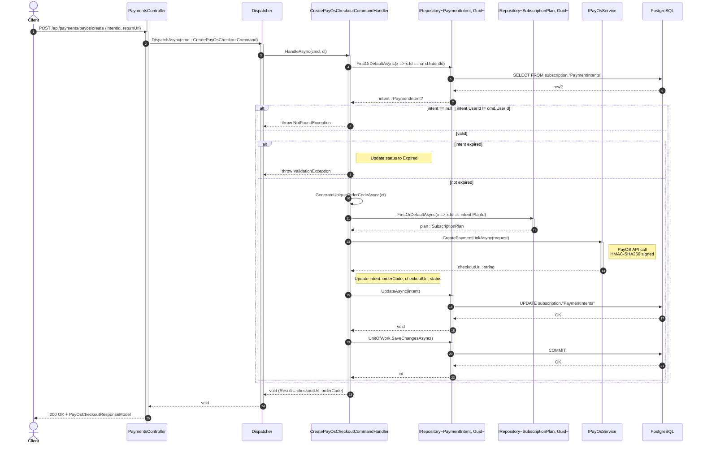
```mermaid
sequenceDiagram
    autonumber
    actor Client
    participant Ctrl as PaymentsController
    participant Disp as Dispatcher
    participant CmdH as CreatePayOsCheckoutCommandHandler
    participant IntentRepo as IRepository~PaymentIntent, Guid~
    participant PlanRepo as IRepository~SubscriptionPlan, Guid~
    participant PayOS as IPayOsService
    participant DB as PostgreSQL

    Client->>Ctrl: POST /api/payments/payos/create {intentId, returnUrl}
    activate Ctrl

    Ctrl->>Disp: DispatchAsync(cmd : CreatePayOsCheckoutCommand)
    activate Disp

    Disp->>CmdH: HandleAsync(cmd, ct)
    activate CmdH

    CmdH->>IntentRepo: FirstOrDefaultAsync(x => x.Id == cmd.IntentId)
    activate IntentRepo
    IntentRepo->>DB: SELECT FROM subscription."PaymentIntents"
    DB-->>IntentRepo: row?
    IntentRepo-->>CmdH: intent : PaymentIntent?
    deactivate IntentRepo

    alt intent == null || intent.UserId != cmd.UserId
        CmdH-->>Disp: throw NotFoundException
    else valid

        alt intent expired
            Note right of CmdH: Update status to Expired
            CmdH-->>Disp: throw ValidationException
        else not expired

            CmdH->>CmdH: GenerateUniqueOrderCodeAsync(ct)

            CmdH->>PlanRepo: FirstOrDefaultAsync(x => x.Id == intent.PlanId)
            activate PlanRepo
            PlanRepo-->>CmdH: plan : SubscriptionPlan
            deactivate PlanRepo

            CmdH->>PayOS: CreatePaymentLinkAsync(request)
            activate PayOS
            Note right of PayOS: PayOS API call<br/>HMAC-SHA256 signed
            PayOS-->>CmdH: checkoutUrl : string
            deactivate PayOS

            Note right of CmdH: Update intent: orderCode, checkoutUrl, status

            CmdH->>IntentRepo: UpdateAsync(intent)
            activate IntentRepo
            IntentRepo->>DB: UPDATE subscription."PaymentIntents"
            DB-->>IntentRepo: OK
            IntentRepo-->>CmdH: void
            deactivate IntentRepo

            CmdH->>IntentRepo: UnitOfWork.SaveChangesAsync()
            activate IntentRepo
            IntentRepo->>DB: COMMIT
            DB-->>IntentRepo: OK
            IntentRepo-->>CmdH: int
            deactivate IntentRepo
        end
    end

    CmdH-->>Disp: void (Result = checkoutUrl, orderCode)
    deactivate CmdH
    Disp-->>Ctrl: void
    deactivate Disp
    Ctrl-->>Client: 200 OK + PayOsCheckoutResponseModel
    deactivate Ctrl
```

---

### FE-14-SD-03: PayOS Webhook Handler

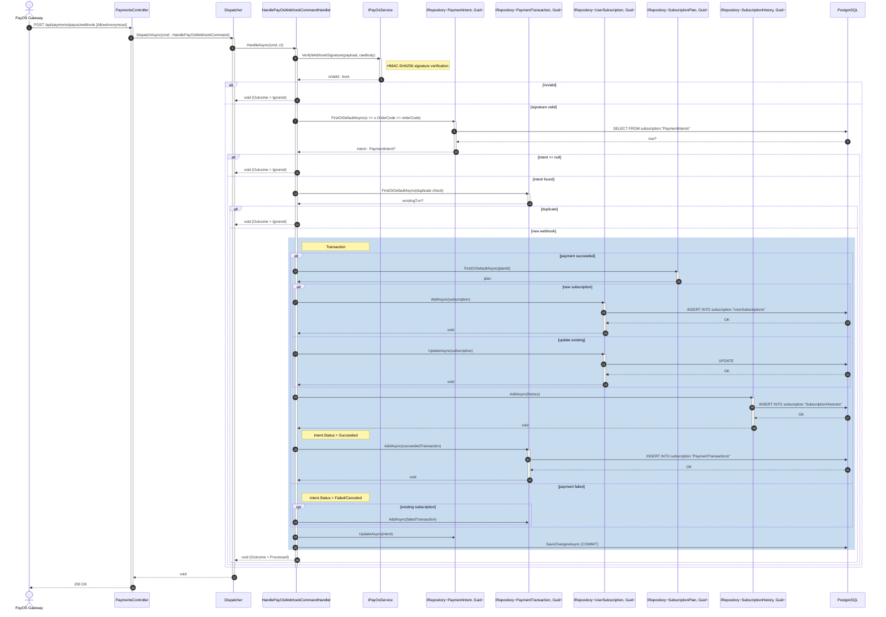
```mermaid
sequenceDiagram
    autonumber
    actor PayOS as PayOS Gateway
    participant Ctrl as PaymentsController
    participant Disp as Dispatcher
    participant CmdH as HandlePayOsWebhookCommandHandler
    participant PaySvc as IPayOsService
    participant IntentRepo as IRepository~PaymentIntent, Guid~
    participant TxnRepo as IRepository~PaymentTransaction, Guid~
    participant SubRepo as IRepository~UserSubscription, Guid~
    participant PlanRepo as IRepository~SubscriptionPlan, Guid~
    participant HistRepo as IRepository~SubscriptionHistory, Guid~
    participant DB as PostgreSQL

    PayOS->>Ctrl: POST /api/payments/payos/webhook [AllowAnonymous]
    activate Ctrl

    Ctrl->>Disp: DispatchAsync(cmd : HandlePayOsWebhookCommand)
    activate Disp

    Disp->>CmdH: HandleAsync(cmd, ct)
    activate CmdH

    CmdH->>PaySvc: VerifyWebhookSignature(payload, rawBody)
    activate PaySvc
    Note right of PaySvc: HMAC-SHA256 signature verification
    PaySvc-->>CmdH: isValid : bool
    deactivate PaySvc

    alt !isValid
        CmdH-->>Disp: void (Outcome = Ignored)
    else signature valid

        CmdH->>IntentRepo: FirstOrDefaultAsync(x => x.OrderCode == orderCode)
        activate IntentRepo
        IntentRepo->>DB: SELECT FROM subscription."PaymentIntents"
        DB-->>IntentRepo: row?
        IntentRepo-->>CmdH: intent : PaymentIntent?
        deactivate IntentRepo

        alt intent == null
            CmdH-->>Disp: void (Outcome = Ignored)
        else intent found

            CmdH->>TxnRepo: FirstOrDefaultAsync(duplicate check)
            activate TxnRepo
            TxnRepo-->>CmdH: existingTxn?
            deactivate TxnRepo

            alt duplicate
                CmdH-->>Disp: void (Outcome = Ignored)
            else new webhook

                rect rgb(200, 220, 240)
                    Note right of CmdH: Transaction

                    alt payment succeeded
                        CmdH->>PlanRepo: FirstOrDefaultAsync(planId)
                        activate PlanRepo
                        PlanRepo-->>CmdH: plan
                        deactivate PlanRepo

                        alt new subscription
                            CmdH->>SubRepo: AddAsync(subscription)
                            activate SubRepo
                            SubRepo->>DB: INSERT INTO subscription."UserSubscriptions"
                            DB-->>SubRepo: OK
                            SubRepo-->>CmdH: void
                            deactivate SubRepo
                        else update existing
                            CmdH->>SubRepo: UpdateAsync(subscription)
                            activate SubRepo
                            SubRepo->>DB: UPDATE
                            DB-->>SubRepo: OK
                            SubRepo-->>CmdH: void
                            deactivate SubRepo
                        end

                        CmdH->>HistRepo: AddAsync(history)
                        activate HistRepo
                        HistRepo->>DB: INSERT INTO subscription."SubscriptionHistories"
                        DB-->>HistRepo: OK
                        HistRepo-->>CmdH: void
                        deactivate HistRepo

                        Note right of CmdH: intent.Status = Succeeded

                        CmdH->>TxnRepo: AddAsync(succeededTransaction)
                        activate TxnRepo
                        TxnRepo->>DB: INSERT INTO subscription."PaymentTransactions"
                        DB-->>TxnRepo: OK
                        TxnRepo-->>CmdH: void
                        deactivate TxnRepo

                    else payment failed
                        Note right of CmdH: intent.Status = Failed/Canceled

                        opt existing subscription
                            CmdH->>TxnRepo: AddAsync(failedTransaction)
                        end
                    end

                    CmdH->>IntentRepo: UpdateAsync(intent)
                    CmdH->>DB: SaveChangesAsync (COMMIT)
                end

                CmdH-->>Disp: void (Outcome = Processed)
            end
        end
    end

    deactivate CmdH
    Disp-->>Ctrl: void
    deactivate Disp
    Ctrl-->>PayOS: 200 OK
    deactivate Ctrl
```

---

## FE-15/16/17 — LLM Suggestion Review Pipeline

### FE-15-SD-01: Review LLM Suggestion (Approve/Reject/Modify)

```mermaid
sequenceDiagram
    autonumber
    actor Client
    participant Ctrl as LlmSuggestionsController
    participant Disp as Dispatcher
    participant CmdH as ReviewLlmSuggestionCommandHandler
    participant ReviewSvc as ILlmSuggestionReviewService
    participant SugRepo as IRepository~LlmSuggestion, Guid~
    participant TCRepo as IRepository~TestCase, Guid~
    participant DB as PostgreSQL

    Client->>Ctrl: PUT /api/test-suites/{suiteId}/suggestions/{suggestionId}/review
    activate Ctrl

    Ctrl->>Disp: DispatchAsync(cmd : ReviewLlmSuggestionCommand)
    activate Disp

    Disp->>CmdH: HandleAsync(cmd, ct)
    activate CmdH

    CmdH->>SugRepo: FirstOrDefaultAsync(x => x.Id == cmd.SuggestionId)
    activate SugRepo
    SugRepo->>DB: SELECT FROM llm."LlmSuggestions"
    DB-->>SugRepo: row?
    SugRepo-->>CmdH: suggestion : LlmSuggestion?
    deactivate SugRepo

    alt suggestion == null
        CmdH-->>Disp: throw NotFoundException
    else found

        alt cmd.Action == Approve
            CmdH->>ReviewSvc: ApproveAsync(suggestion, userId, ct)
            activate ReviewSvc
            Note right of ReviewSvc: Set ReviewStatus = Approved
            ReviewSvc-->>CmdH: void
            deactivate ReviewSvc

        else cmd.Action == Reject
            CmdH->>ReviewSvc: RejectAsync(suggestion, userId, notes, ct)
            activate ReviewSvc
            ReviewSvc-->>CmdH: void
            deactivate ReviewSvc

        else cmd.Action == ModifyAndApprove
            CmdH->>ReviewSvc: ModifyAndApproveAsync(suggestion, modifiedContent, userId, ct)
            activate ReviewSvc
            ReviewSvc-->>CmdH: void
            deactivate ReviewSvc
        end

        opt suggestion.ReviewStatus == Approved or ModifiedAndApproved
            CmdH->>ReviewSvc: MaterializeApprovedAsync(suiteId, ct)
            activate ReviewSvc
            Note right of ReviewSvc: Convert LlmSuggestion -> TestCase entity

            ReviewSvc->>TCRepo: AddAsync(new TestCase from suggestion)
            activate TCRepo
            TCRepo->>DB: INSERT INTO testgen."TestCases"
            DB-->>TCRepo: OK
            TCRepo-->>ReviewSvc: void
            deactivate TCRepo

            ReviewSvc->>DB: SaveChangesAsync (COMMIT)
            ReviewSvc-->>CmdH: materializedCount : int
            deactivate ReviewSvc
        end
    end

    CmdH-->>Disp: void
    deactivate CmdH
    Disp-->>Ctrl: void
    deactivate Disp
    Ctrl-->>Client: 200 OK + ReviewResultModel
    deactivate Ctrl
```

---

### FE-17-SD-01: Bulk Review LLM Suggestions

```mermaid
sequenceDiagram
    autonumber
    actor Client
    participant Ctrl as LlmSuggestionsController
    participant Disp as Dispatcher
    participant CmdH as BulkReviewLlmSuggestionsCommandHandler
    participant ReviewSvc as ILlmSuggestionReviewService
    participant SugRepo as IRepository~LlmSuggestion, Guid~
    participant TCRepo as IRepository~TestCase, Guid~
    participant DB as PostgreSQL

    Client->>Ctrl: POST /api/test-suites/{suiteId}/suggestions/bulk-review
    activate Ctrl

    Ctrl->>Disp: DispatchAsync(cmd : BulkReviewLlmSuggestionsCommand)
    activate Disp

    Disp->>CmdH: HandleAsync(cmd, ct)
    activate CmdH

    CmdH->>SugRepo: ToListAsync(filters: type, confidence, status)
    activate SugRepo
    SugRepo->>DB: SELECT FROM llm."LlmSuggestions" WHERE filters
    DB-->>SugRepo: rows
    SugRepo-->>CmdH: suggestions : List~LlmSuggestion~
    deactivate SugRepo

    alt suggestions.Count == 0
        CmdH-->>Disp: void (no matches)
    else has matches

        rect rgb(200, 220, 240)
            Note right of CmdH: Transaction

            loop foreach suggestion
                alt cmd.Action == Approve
                    CmdH->>ReviewSvc: ApproveAsync(suggestion, userId, ct)
                else cmd.Action == Reject
                    CmdH->>ReviewSvc: RejectAsync(suggestion, userId, notes, ct)
                end
            end

            opt cmd.Action == Approve
                CmdH->>ReviewSvc: MaterializeApprovedAsync(suiteId, ct)
                activate ReviewSvc
                Note right of ReviewSvc: Batch convert suggestions -> TestCases

                loop foreach approved suggestion
                    ReviewSvc->>TCRepo: AddAsync(testCase)
                end

                ReviewSvc->>DB: SaveChangesAsync (COMMIT)
                ReviewSvc-->>CmdH: materializedCount : int
                deactivate ReviewSvc
            end
        end
    end

    CmdH-->>Disp: void
    deactivate CmdH
    Disp-->>Ctrl: void
    deactivate Disp
    Ctrl-->>Client: 200 OK + BulkReviewResultModel {processedCount, materializedCount}
    deactivate Ctrl
```

---

### FE-17-SD-02: Generate LLM Suggestion Preview

```mermaid
sequenceDiagram
    autonumber
    actor Client
    participant Ctrl as LlmSuggestionsController
    participant Disp as Dispatcher
    participant CmdH as GenerateLlmSuggestionPreviewCommandHandler
    participant SuiteRepo as IRepository~TestSuite, Guid~
    participant GateSvc as IApiTestOrderGateService
    participant LimitSvc as ISubscriptionLimitGatewayService
    participant SugRepo as IRepository~LlmSuggestion, Guid~
    participant EpMeta as IApiEndpointMetadataService
    participant ParamSvc as IEndpointParameterDetailService
    participant SrsDocRepo as IRepository~SrsDocument, Guid~
    participant SrsReqRepo as IRepository~SrsRequirement, Guid~
    participant LlmSug as ILlmScenarioSuggester
    participant DB as PostgreSQL

    Client->>Ctrl: POST /api/test-suites/{suiteId}/llm-suggestions/generate {specificationId, forceRefresh?, algorithmProfile?}
    activate Ctrl

    Ctrl->>Disp: DispatchAsync(cmd : GenerateLlmSuggestionPreviewCommand)
    activate Disp

    Disp->>CmdH: HandleAsync(cmd, ct)
    activate CmdH

    CmdH->>SuiteRepo: FirstOrDefaultAsync(x => x.Id == cmd.TestSuiteId)
    activate SuiteRepo
    SuiteRepo->>DB: SELECT FROM testgen."TestSuites"
    DB-->>SuiteRepo: row?
    SuiteRepo-->>CmdH: suite : TestSuite?
    deactivate SuiteRepo

    alt suite == null || wrong owner || archived
        CmdH-->>Disp: throw NotFoundException / ValidationException
    else valid

        CmdH->>GateSvc: RequireApprovedOrderAsync(suiteId, ct)
        activate GateSvc
        GateSvc->>DB: SELECT FROM testgen."TestOrderProposals" (approved)
        DB-->>GateSvc: approvedOrder
        GateSvc-->>CmdH: approvedOrder : IReadOnlyList~ApiOrderItemModel~
        deactivate GateSvc

        CmdH->>LimitSvc: CheckLimitAsync(userId, MaxLlmCallsPerMonth, 1, ct)
        activate LimitSvc
        LimitSvc-->>CmdH: llmCheck : LimitCheckResult
        deactivate LimitSvc

        alt !llmCheck.IsAllowed
            CmdH-->>Disp: throw ValidationException (LLM monthly limit)
        else OK

            opt !cmd.ForceRefresh
                CmdH->>SugRepo: ToListAsync(x => ReviewStatus == Pending for suite)
                activate SugRepo
                SugRepo->>DB: SELECT FROM testgen."LlmSuggestions" WHERE "ReviewStatus" = Pending
                DB-->>SugRepo: existingPending
                SugRepo-->>CmdH: List~LlmSuggestion~
                deactivate SugRepo

                alt existingPending.Count > 0
                    CmdH-->>Disp: throw ValidationException (use ForceRefresh=true)
                end
            end

            CmdH->>EpMeta: GetEndpointMetadataAsync(specId, endpointIds, ct)
            activate EpMeta
            EpMeta->>DB: SELECT FROM apidoc."ApiEndpoints" + parameters
            DB-->>EpMeta: metadata
            EpMeta-->>CmdH: endpointMetadata : IReadOnlyList~ApiEndpointMetadataDto~
            deactivate EpMeta

            CmdH->>ParamSvc: GetParameterDetailsAsync(specId, endpointIds, ct)
            activate ParamSvc
            ParamSvc-->>CmdH: paramDetails : IReadOnlyList~EndpointParameterDetailDto~
            deactivate ParamSvc

            opt suite.SrsDocumentId != null
                CmdH->>SrsDocRepo: FirstOrDefaultAsync(x => x.Id == srsDocId)
                activate SrsDocRepo
                SrsDocRepo->>DB: SELECT FROM testgen."SrsDocuments"
                DB-->>SrsDocRepo: srsDocument
                SrsDocRepo-->>CmdH: srsDocument : SrsDocument?
                deactivate SrsDocRepo

                CmdH->>SrsReqRepo: ToListAsync(x => x.SrsDocumentId == docId)
                activate SrsReqRepo
                SrsReqRepo->>DB: SELECT FROM testgen."SrsRequirements"
                DB-->>SrsReqRepo: srsRequirements
                SrsReqRepo-->>CmdH: List~SrsRequirement~
                deactivate SrsReqRepo
            end

            Note right of CmdH: Build LlmScenarioSuggestionContext<br/>{suite, endpointMetadata, approvedOrder,<br/>paramDetails, srsDocument, srsRequirements}

            CmdH->>LlmSug: SuggestScenariosAsync(context, ct)
            activate LlmSug
            Note right of LlmSug: n8n webhook → LLM generates scenarios<br/>with CoveredRequirementIds per scenario<br/>(SRS traceability links)
            LlmSug-->>CmdH: llmResult : LlmSuggestionResult
            deactivate LlmSug

            CmdH->>SugRepo: ToListAsync(non-materialized existing suggestions)
            activate SugRepo
            SugRepo->>DB: SELECT FROM testgen."LlmSuggestions" WHERE "AppliedTestCaseId" IS NULL
            DB-->>SugRepo: existingSuggestions
            SugRepo-->>CmdH: List~LlmSuggestion~
            deactivate SugRepo

            loop foreach existing suggestion
                Note right of CmdH: Set ReviewStatus = Superseded
                CmdH->>SugRepo: UpdateAsync(suggestion)
                activate SugRepo
                SugRepo->>DB: UPDATE testgen."LlmSuggestions"
                DB-->>SugRepo: OK
                SugRepo-->>CmdH: void
                deactivate SugRepo
            end

            loop foreach scenario in llmResult.Scenarios
                Note right of CmdH: Build LlmSuggestion entity:<br/>SuggestedRequest, SuggestedExpectation,<br/>CoveredRequirementIds (jsonb), SrsDocumentId
                CmdH->>SugRepo: AddAsync(suggestion : LlmSuggestion {ReviewStatus=Pending})
                activate SugRepo
                SugRepo->>DB: INSERT INTO testgen."LlmSuggestions"
                DB-->>SugRepo: OK
                SugRepo-->>CmdH: void
                deactivate SugRepo
            end

            CmdH->>SugRepo: UnitOfWork.SaveChangesAsync()
            activate SugRepo
            SugRepo->>DB: COMMIT
            DB-->>SugRepo: OK
            SugRepo-->>CmdH: int
            deactivate SugRepo

            opt !llmResult.FromCache && !llmResult.UsedLocalFallback
                CmdH->>LimitSvc: IncrementUsageAsync(MaxLlmCallsPerMonth, 1, ct)
                activate LimitSvc
                LimitSvc-->>CmdH: void
                deactivate LimitSvc
            end

            Note right of CmdH: cmd.Result = GenerateLlmSuggestionPreviewResultModel<br/>{totalSuggestions, endpointsCovered, llmModel, fromCache}
        end
    end

    CmdH-->>Disp: void
    deactivate CmdH
    Disp-->>Ctrl: void
    deactivate Disp
    Ctrl-->>Client: 201 Created + GenerateLlmSuggestionPreviewResultModel
    deactivate Ctrl
```

---

## FE-18 — SRS & Traceability

### FE-18-SD-01: Upload SRS Document & Trigger Analysis

```mermaid
sequenceDiagram
    autonumber
    actor Client
    participant Ctrl as SrsDocumentsController
    participant Disp as Dispatcher
    participant CmdH1 as AddUpdateSrsDocumentCommandHandler
    participant CmdH2 as TriggerSrsAnalysisCommandHandler
    participant ProjRepo as IRepository~Project, Guid~
    participant DocRepo as IRepository~SrsDocument, Guid~
    participant JobRepo as IRepository~SrsAnalysisJob, Guid~
    participant StorageGw as IStorageFileGatewayService
    participant N8n as IN8nIntegrationService
    participant Disp2 as Dispatcher
    participant CmdH3 as ProcessSrsAnalysisCallbackCommandHandler
    participant ReqRepo as IRepository~SrsRequirement, Guid~
    participant ClarRepo as IRepository~SrsRequirementClarification, Guid~
    participant DB as PostgreSQL

    Client->>Ctrl: POST /api/projects/{projectId}/srs-documents {name, sourceType, content/url}
    activate Ctrl

    Ctrl->>Disp: DispatchAsync(cmd : AddUpdateSrsDocumentCommand)
    activate Disp

    Disp->>CmdH1: HandleAsync(cmd, ct)
    activate CmdH1

    CmdH1->>ProjRepo: FirstOrDefaultAsync(x => x.Id == projectId && x.OwnerId == userId)
    activate ProjRepo
    ProjRepo->>DB: SELECT FROM apidoc."Projects"
    DB-->>ProjRepo: project?
    ProjRepo-->>CmdH1: project : Project?
    deactivate ProjRepo

    alt project == null
        CmdH1-->>Disp: throw NotFoundException
    else found

        alt sourceType == FileUpload
            CmdH1->>StorageGw: UploadAsync(file, ct)
            activate StorageGw
            StorageGw-->>CmdH1: fileId : Guid
            deactivate StorageGw
        end

        CmdH1->>DocRepo: AddAsync(doc : SrsDocument {status=Pending, sourceType, storageFileId})
        activate DocRepo
        DocRepo->>DB: INSERT INTO testgen."SrsDocuments"
        DB-->>DocRepo: OK
        DocRepo-->>CmdH1: void
        deactivate DocRepo

        CmdH1->>DocRepo: UnitOfWork.SaveChangesAsync()
        activate DocRepo
        DocRepo->>DB: COMMIT
        DB-->>DocRepo: OK
        DocRepo-->>CmdH1: int
        deactivate DocRepo
    end

    CmdH1-->>Disp: void
    deactivate CmdH1
    Disp-->>Ctrl: result
    deactivate Disp
    Ctrl-->>Client: 201 Created + SrsDocumentModel
    deactivate Ctrl

    Note over Client,DB: --- Client triggers analysis ---

    Client->>Ctrl: POST /api/projects/{projectId}/srs-documents/{docId}/analyze
    activate Ctrl

    Ctrl->>Disp: DispatchAsync(cmd : TriggerSrsAnalysisCommand)
    activate Disp

    Disp->>CmdH2: HandleAsync(cmd, ct)
    activate CmdH2

    CmdH2->>DocRepo: FirstOrDefaultAsync(x => x.Id == docId)
    activate DocRepo
    DocRepo->>DB: SELECT FROM testgen."SrsDocuments"
    DB-->>DocRepo: doc?
    DocRepo-->>CmdH2: doc : SrsDocument?
    deactivate DocRepo

    alt doc == null || no text content
        CmdH2-->>Disp: throw NotFoundException / ValidationException
    else valid

        CmdH2->>JobRepo: AddAsync(job : SrsAnalysisJob {status=Queued, type=InitialAnalysis})
        activate JobRepo
        JobRepo->>DB: INSERT INTO testgen."SrsAnalysisJobs"
        DB-->>JobRepo: OK
        JobRepo-->>CmdH2: void
        deactivate JobRepo

        CmdH2->>DocRepo: UpdateAsync(doc : status=Processing)
        activate DocRepo
        DocRepo->>DB: UPDATE testgen."SrsDocuments"
        DB-->>DocRepo: OK
        DocRepo-->>CmdH2: void
        deactivate DocRepo

        CmdH2->>DocRepo: UnitOfWork.SaveChangesAsync()
        activate DocRepo
        DocRepo->>DB: COMMIT
        DB-->>DocRepo: OK
        DocRepo-->>CmdH2: int
        deactivate DocRepo

        Note right of CmdH2: Build n8n payload<br/>{rawContent, endpoints context}

        CmdH2->>N8n: TriggerWebhookAsync~Payload, Response~(payload, ct)
        activate N8n
        Note right of N8n: n8n LLM extraction:<br/>Parse requirements,<br/>extract testable constraints,<br/>identify ambiguities
        N8n-->>CmdH2: callbackData : SrsAnalysisCallbackRequest
        deactivate N8n

        alt n8n succeeded
            Note right of CmdH2: Dispatch ProcessSrsAnalysisCallbackCommand synchronously<br/>(unlike async callback endpoint pattern)

            CmdH2->>Disp2: DispatchAsync(callbackCmd : ProcessSrsAnalysisCallbackCommand)
            activate Disp2

            Disp2->>CmdH3: HandleAsync(callbackCmd, ct)
            activate CmdH3

            CmdH3->>JobRepo: FirstOrDefaultAsync(x => x.Id == jobId)
            activate JobRepo
            JobRepo->>DB: SELECT FROM testgen."SrsAnalysisJobs"
            DB-->>JobRepo: job?
            JobRepo-->>CmdH3: job : SrsAnalysisJob?
            deactivate JobRepo

            loop foreach requirement in callbackData.Requirements
                CmdH3->>ReqRepo: AddAsync(requirement : SrsRequirement {requirementCode, testableConstraints, confidenceScore})
                activate ReqRepo
                ReqRepo->>DB: INSERT INTO testgen."SrsRequirements"
                DB-->>ReqRepo: OK
                ReqRepo-->>CmdH3: void
                deactivate ReqRepo
            end

            loop foreach clarification in callbackData.ClarificationQuestions
                CmdH3->>ClarRepo: AddAsync(clar : SrsRequirementClarification {question, suggestedOptions})
                activate ClarRepo
                ClarRepo->>DB: INSERT INTO testgen."SrsRequirementClarifications"
                DB-->>ClarRepo: OK
                ClarRepo-->>CmdH3: void
                deactivate ClarRepo
            end

            CmdH3->>JobRepo: UpdateAsync(job : status=Completed)
            activate JobRepo
            JobRepo->>DB: UPDATE testgen."SrsAnalysisJobs"
            DB-->>JobRepo: OK
            JobRepo-->>CmdH3: void
            deactivate JobRepo

            CmdH3->>DocRepo: UpdateAsync(doc : status=Completed)
            activate DocRepo
            DocRepo->>DB: UPDATE testgen."SrsDocuments"
            DB-->>DocRepo: OK
            DocRepo-->>CmdH3: void
            deactivate DocRepo

            CmdH3->>ReqRepo: UnitOfWork.SaveChangesAsync()
            activate ReqRepo
            ReqRepo->>DB: COMMIT
            DB-->>ReqRepo: OK
            ReqRepo-->>CmdH3: int
            deactivate ReqRepo

            CmdH3-->>Disp2: void
            deactivate CmdH3
            Disp2-->>CmdH2: void
            deactivate Disp2

        else n8n or local fallback failed
            CmdH2->>JobRepo: UpdateAsync(job : status=Failed, errorMessage)
            CmdH2->>DocRepo: UpdateAsync(doc : status=Failed)
            CmdH2->>DB: SaveChangesAsync
        end
    end

    CmdH2-->>Disp: void (cmd.JobId = job.Id)
    deactivate CmdH2
    Disp-->>Ctrl: void
    deactivate Disp
    Ctrl-->>Client: 202 Accepted + {jobId} (for polling)
    deactivate Ctrl
```

---

### FE-18-SD-02: Get Traceability Matrix (Coverage Report)

```mermaid
sequenceDiagram
    autonumber
    actor Client
    participant Ctrl as SrsTraceabilityController
    participant Disp as Dispatcher
    participant QryH as GetSrsTraceabilityQueryHandler
    participant SuiteRepo as IRepository~TestSuite, Guid~
    participant DocRepo as IRepository~SrsDocument, Guid~
    participant ReqRepo as IRepository~SrsRequirement, Guid~
    participant TCRepo as IRepository~TestCase, Guid~
    participant LinkRepo as IRepository~TestCaseRequirementLink, Guid~
    participant GatewayRead as ITestExecutionReadGatewayService
    participant DB as PostgreSQL

    Client->>Ctrl: GET /api/projects/{projectId}/test-suites/{suiteId}/srs/traceability
    activate Ctrl

    Ctrl->>Disp: DispatchAsync(query : GetSrsTraceabilityQuery)
    activate Disp

    Disp->>QryH: HandleAsync(query, ct)
    activate QryH

    QryH->>SuiteRepo: FirstOrDefaultAsync(x => x.Id == suiteId)
    activate SuiteRepo
    SuiteRepo->>DB: SELECT FROM testgen."TestSuites"
    DB-->>SuiteRepo: suite?
    SuiteRepo-->>QryH: suite : TestSuite?
    deactivate SuiteRepo

    alt suite == null || suite.SrsDocumentId == null
        QryH-->>Disp: throw NotFoundException / ValidationException
    else has SRS doc

        QryH->>DocRepo: FirstOrDefaultAsync(x => x.Id == suite.SrsDocumentId)
        activate DocRepo
        DocRepo->>DB: SELECT FROM testgen."SrsDocuments"
        DB-->>DocRepo: srsDocument?
        DocRepo-->>QryH: srsDocument : SrsDocument?
        deactivate DocRepo

        QryH->>ReqRepo: ToListAsync(x => x.SrsDocumentId == docId)
        activate ReqRepo
        ReqRepo->>DB: SELECT FROM testgen."SrsRequirements"
        DB-->>ReqRepo: allRequirements
        ReqRepo-->>QryH: List~SrsRequirement~
        deactivate ReqRepo

        QryH->>TCRepo: ToListAsync(x => x.TestSuiteId == suiteId)
        activate TCRepo
        TCRepo->>DB: SELECT FROM testgen."TestCases"
        DB-->>TCRepo: allTestCases
        TCRepo-->>QryH: List~TestCase~
        deactivate TCRepo

        QryH->>LinkRepo: ToListAsync(x => x.SrsDocumentId == docId)
        activate LinkRepo
        LinkRepo->>DB: SELECT FROM testgen."TestCaseRequirementLinks"
        DB-->>LinkRepo: links
        LinkRepo-->>QryH: List~TestCaseRequirementLink~
        deactivate LinkRepo

        QryH->>GatewayRead: GetExecutionEvidenceAsync(suiteId, ct)
        activate GatewayRead
        Note right of GatewayRead: Fetch latest test runs + results<br/>to determine Pass/Fail/Skipped/Unverified
        GatewayRead->>DB: SELECT recent testexec."TestCaseAttempts"
        DB-->>GatewayRead: latestResults
        GatewayRead-->>QryH: evidenceMap : Dictionary~Guid, TestCaseExecutionResult~
        deactivate GatewayRead

        loop foreach requirement in allRequirements
            Note right of QryH: Find all linked test cases<br/>Compute RequirementValidationStatus:<br/>- All passed → Validated<br/>- Any failed → Failed<br/>- Any skipped, rest passed → PartiallyTested<br/>- No test cases → Untested

            QryH->>QryH: linkedTestCaseIds = linkRepo.Where(r.RequirementId == req.Id)
            QryH->>QryH: outcomeStatuses = evidenceMap[tcId].Status foreach linkedTestCaseIds
            QryH->>QryH: deterministic formula(outcomeStatuses) → validationStatus
        end

        Note right of QryH: Build TraceabilityMatrix:<br/>TotalRequirements, CoveredRequirements,<br/>TestedRequirements (Passed),<br/>FailedRequirements,<br/>CoveragePercentage = Covered / Total,<br/>RequirementRows[] with validation status

        QryH-->>Disp: result : TraceabilityMatrix
    end
    deactivate QryH

    Disp-->>Ctrl: result
    deactivate Disp
    Ctrl-->>Client: 200 OK + TraceabilityMatrix {coveragePercentage, requirementRows[]}
    deactivate Ctrl
```

---

## Infrastructure Diagrams

```mermaid
sequenceDiagram
    autonumber
    participant Worker as PublishEventWorker<br/>(BackgroundService)
    participant Disp as Dispatcher
    participant CmdH as PublishEventsCommandHandler
    participant OutboxRepo as IRepository~OutboxMessage, Guid~
    participant MsgBus as IMessageBus
    participant DB as PostgreSQL

    loop ExecuteAsync — every N seconds
        Worker->>Worker: CreateScope() -> IServiceProvider
        Worker->>Disp: DispatchAsync(cmd : PublishEventsCommand)
        activate Disp

        Disp->>CmdH: HandleAsync(cmd, ct)
        activate CmdH

        CmdH->>OutboxRepo: ToListAsync(x => !x.Published, take: 50)
        activate OutboxRepo
        OutboxRepo->>DB: SELECT TOP 50 FROM "OutboxMessages"<br/>WHERE "Published" = false ORDER BY "CreatedDateTime"
        DB-->>OutboxRepo: rows
        OutboxRepo-->>CmdH: pendingEvents : List~OutboxMessage~
        deactivate OutboxRepo

        loop foreach event in pendingEvents

            CmdH->>MsgBus: SendAsync(message : OutboxMessage)
            activate MsgBus
            MsgBus-->>CmdH: void
            deactivate MsgBus

            alt send success
                Note right of CmdH: event.Published = true

                CmdH->>OutboxRepo: UpdateAsync(event)
                activate OutboxRepo
                OutboxRepo->>DB: UPDATE "OutboxMessages" SET "Published" = true
                DB-->>OutboxRepo: OK
                OutboxRepo-->>CmdH: void
                deactivate OutboxRepo

            else send failed (exception)
                Note right of CmdH: Log error, skip, retry next cycle
            end
        end

        CmdH-->>Disp: void
        deactivate CmdH
        Disp-->>Worker: void
        deactivate Disp
    end
```

---

### INFRA-SD-02: Domain Event — CrudService -> EventHandler -> Outbox

```mermaid
sequenceDiagram
    autonumber
    participant CrudSvc as CrudService~T~
    participant Repo as IRepository~T, Guid~
    participant UoW as IUnitOfWork<br/>(DbContextUnitOfWork)
    participant Disp as Dispatcher
    participant EvtH as IDomainEventHandler~EntityCreatedEvent~T~~
    participant OutboxRepo as IRepository~OutboxMessage, Guid~
    participant DB as PostgreSQL

    activate CrudSvc

    CrudSvc->>Repo: AddOrUpdateAsync(entity : T)
    activate Repo
    Repo->>DB: INSERT / UPDATE
    DB-->>Repo: OK
    Repo-->>CrudSvc: void
    deactivate Repo

    CrudSvc->>UoW: SaveChangesAsync()
    activate UoW
    UoW->>DB: COMMIT
    DB-->>UoW: OK
    UoW-->>CrudSvc: int
    deactivate UoW

    CrudSvc->>Disp: DispatchAsync(event : EntityCreatedEvent~T~)
    activate Disp

    Note right of Disp: Resolve all registered<br/>IDomainEventHandler~EntityCreatedEvent~T~~

    Disp->>EvtH: HandleAsync(event, ct)
    activate EvtH

    EvtH->>OutboxRepo: AddAsync(outboxMsg : OutboxMessage)
    activate OutboxRepo
    OutboxRepo->>DB: INSERT "OutboxMessages"
    DB-->>OutboxRepo: OK
    OutboxRepo-->>EvtH: void
    deactivate OutboxRepo

    EvtH->>UoW: SaveChangesAsync()
    activate UoW
    UoW->>DB: COMMIT
    DB-->>UoW: OK
    UoW-->>EvtH: int
    deactivate UoW

    EvtH-->>Disp: void
    deactivate EvtH

    Disp-->>CrudSvc: void
    deactivate Disp

    deactivate CrudSvc
```

---

## Summary: Diagram Catalog

| ID | FE | Diagram Name | Lifelines | Messages |
|----|-----|-------------|-----------|----------|
| FE-01-SD-01 | FE-01 | User Login | 6 | ~22 |
| FE-01-SD-02 | FE-01 | User Registration | 7 | ~20 |
| FE-01-SD-03 | FE-01 | Refresh Token | 5 | ~16 |
| FE-02-SD-01 | FE-02 | Upload API Specification | 9 | ~26 |
| FE-02-SD-02 | FE-02 | Create/Update Project | 6 | ~18 |
| FE-04-SD-01 | FE-04 | Create/Update Test Suite Scope | 7 | ~22 |
| FE-04-SD-02 | FE-04 | Create/Update Execution Environment | 6 | ~20 |
| FE-05A-SD-01 | FE-05A | Propose Test Order | 8 | ~24 |
| FE-05A-SD-02 | FE-05A | Approve Test Order | 7 | ~22 |
| FE-05B-SD-01 | FE-05B | Generate Happy-Path Test Cases (n8n LLM) | 12 | ~30 |
| FE-06-SD-01 | FE-06 | Generate Boundary & Negative Cases | 10 | ~24 |
| FE-07-SD-01 | FE-07/08 | Start Test Run (Execution + Validation) | 18 | ~42 |
| FE-09-SD-01 | FE-09 | Explain Test Failure via LLM | 8 | ~20 |
| FE-10-SD-01 | FE-10 | Generate Test Report | 9 | ~22 |
| FE-11-SD-01 | FE-11 | Create Manual Specification | 9 | ~26 |
| FE-12-SD-01 | FE-12 | Resolved URL & Path Mutations | 5 | ~16 |
| FE-13-SD-01 | FE-13 | Import cURL Command | 9 | ~24 |
| FE-14-SD-01 | FE-14 | Subscribe to Plan | 7 | ~22 |
| FE-14-SD-02 | FE-14 | Create PayOS Checkout | 6 | ~18 |
| FE-14-SD-03 | FE-14 | PayOS Webhook Handler | 9 | ~28 |
| FE-15-SD-01 | FE-15 | Review LLM Suggestion | 6 | ~18 |
| FE-17-SD-01 | FE-17 | Bulk Review Suggestions | 6 | ~20 |
| FE-17-SD-02 | FE-17 | Generate LLM Suggestion Preview | 14 | ~36 |
| FE-18-SD-01 | FE-18 | Upload SRS Document & Trigger Analysis | 13 | ~40 |
| FE-18-SD-02 | FE-18 | Get Traceability Matrix | 11 | ~28 |
| INFRA-SD-01 | Infra | Outbox Pattern Worker | 5 | ~16 |
| INFRA-SD-02 | Infra | Domain Event -> Outbox | 6 | ~14 |

**Total: 27 sequence diagrams**

---

## Quy Ước

| Ký pháp Mermaid | Ý nghĩa UML |
|-----------------|-------------|
| `->>` | Synchronous call (nét liền, đầu đặc) |
| `-->>` | Return / Async return (nét đứt) |
| `activate` / `deactivate` | Activation bar |
| `alt` / `else` / `end` | Alternative fragment (conditional) |
| `opt` / `end` | Optional fragment |
| `loop` / `end` | Loop fragment |
| `rect rgb(...)` | Group / Transaction highlight |
| `Note right of X:` | UML Note |
| `participant X as Y` | Lifeline (class instance) |
| `actor X` | Actor (external) |
