# State Machine Diagrams

> Auto-generated from source code analysis and feature specifications.
> Each main domain entity that contains state transitions has its own separate diagram.

---

## Table of Contents

### Implemented (in code)

| # | Entity | Module | State Type |
|---|--------|--------|------------|
| 1 | [EmailMessage](#1-emailmessage) | Notification | Implicit (DateTime flags) |
| 2 | [SmsMessage](#2-smsmessage) | Notification | Implicit (DateTime flags) |
| 3 | [UserSubscription](#3-usersubscription) | Subscription | `SubscriptionStatus` enum |
| 4 | [PaymentIntent](#4-paymentintent) | Subscription | `PaymentIntentStatus` enum |
| 5 | [PaymentTransaction](#5-paymenttransaction) | Subscription | `PaymentStatus` enum |
| 6 | [TestSuite](#6-testsuite) | TestGeneration | Dual: `TestSuiteStatus` + `ApprovalStatus` |
| 7 | [TestOrderProposal](#7-testorderproposal) | TestGeneration | `ProposalStatus` enum |
| 8 | [TestRun](#8-testrun) | TestExecution | `TestRunStatus` enum |
| 9 | [ApiSpecification](#9-apispecification) | ApiDocumentation | `ParseStatus` enum + `IsActive` bool |
| 10 | [Project](#10-project) | ApiDocumentation | `ProjectStatus` enum |
| 11 | [FileEntry](#11-fileentry) | Storage | Implicit (boolean flags) |
| 12 | [OutboxMessage](#12-outboxmessage) | Cross-cutting | `Published` bool flag |
| 13 | [User](#13-user) | Identity | Implicit (boolean + DateTime flags) |

### Planned (from feature specs, not yet implemented)

| # | Entity | Feature | State Type |
|---|--------|---------|------------|
| 14 | [LlmExplanationJob](#14-llmexplanationjob-planned) | FE-09 | Planned workflow states |
| 15 | [SubscriptionPlan](#15-subscriptionplan-planned-enhancement) | FE-14 | `IsActive` guard with subscriber check |
| 16 | [PaymentIntent (Enhanced)](#16-paymentintent-enhanced-planned) | FE-14-02 | Extended states: +Refunded |

---

## Implemented State Machines

---

### 1. EmailMessage

**Module:** `ClassifiedAds.Modules.Notification`
**File:** `Entities/EmailMessage.cs`

Uses an **implicit state machine** based on nullable `DateTimeOffset` fields and retry counters. No explicit status enum exists.

#### State Definitions

| State | Condition |
|-------|-----------|
| **Pending** | `SentDateTime == null && ExpiredDateTime == null && NextAttemptDateTime == null` |
| **Scheduled** | `SentDateTime == null && ExpiredDateTime == null && NextAttemptDateTime <= NOW` |
| **WaitingRetry** | `SentDateTime == null && ExpiredDateTime == null && NextAttemptDateTime > NOW` |
| **Sent** | `SentDateTime != null` |
| **DeadLetter** | `ExpiredDateTime != null && SentDateTime == null` |
| **Archived** | Row moved to `ArchivedEmailMessages` table (>30 days old) |

#### Transition Rules

| From State | Event / Action | To State | Condition |
|------------|----------------|----------|-----------|
| `[*]` | Create email | Pending | Email record inserted |
| Pending | Worker picks up | Scheduled | `NextAttemptDateTime <= NOW` or null |
| Scheduled | Send succeeds | Sent | `SentDateTime` set to now |
| Scheduled | Send fails | WaitingRetry | `AttemptCount < MaxAttemptCount` |
| Scheduled | Send fails | DeadLetter | `AttemptCount >= MaxAttemptCount` |
| WaitingRetry | Backoff expires | Scheduled | `NextAttemptDateTime <= NOW` |
| Sent | Age > 30 days | Archived | Archival background job |
| DeadLetter | Age > 30 days | Archived | Archival background job |

#### Diagram Layout

- **Start node** at top
- **Happy path** (vertical): Pending -> Scheduled -> Sent
- **Retry loop** (right branch): Scheduled <-> WaitingRetry
- **Failure branch**: Scheduled -> DeadLetter
- **Terminal states** at bottom: Sent, DeadLetter, Archived

#### Mermaid Diagram

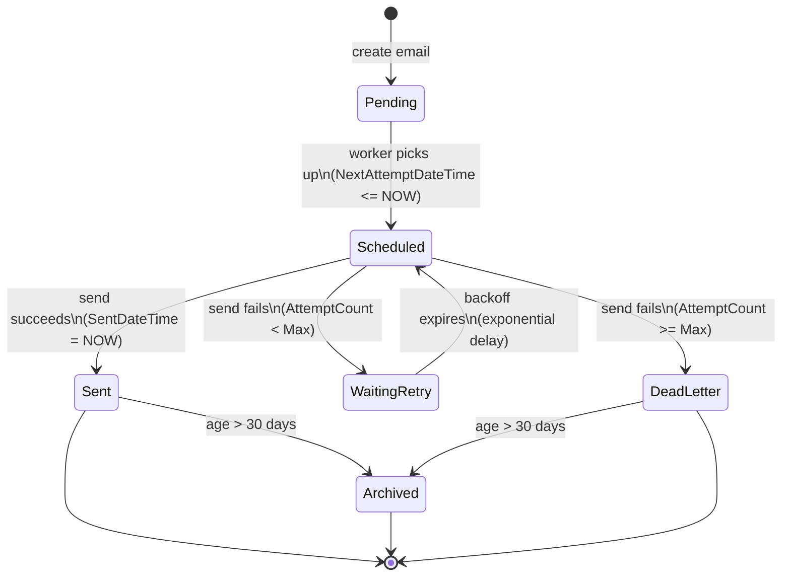

---

### 2. SmsMessage

**Module:** `ClassifiedAds.Modules.Notification`
**File:** `Entities/SmsMessage.cs`

Shares the **identical implicit state machine** as EmailMessage. Uses the same nullable `DateTimeOffset` fields and retry counters.

#### State Definitions

| State | Condition |
|-------|-----------|
| **Pending** | `SentDateTime == null && ExpiredDateTime == null && NextAttemptDateTime == null` |
| **Scheduled** | `SentDateTime == null && ExpiredDateTime == null && NextAttemptDateTime <= NOW` |
| **WaitingRetry** | `SentDateTime == null && ExpiredDateTime == null && NextAttemptDateTime > NOW` |
| **Sent** | `SentDateTime != null` |
| **DeadLetter** | `ExpiredDateTime != null && SentDateTime == null` |
| **Archived** | Row moved to `ArchivedSmsMessages` table (>30 days old) |

#### Transition Rules

| From State | Event / Action | To State | Condition |
|------------|----------------|----------|-----------|
| `[*]` | Create SMS | Pending | SMS record inserted |
| Pending | Worker picks up | Scheduled | `NextAttemptDateTime <= NOW` or null |
| Scheduled | Send succeeds | Sent | `SentDateTime` set to now |
| Scheduled | Send fails | WaitingRetry | `AttemptCount < MaxAttemptCount` |
| Scheduled | Send fails | DeadLetter | `AttemptCount >= MaxAttemptCount` |
| WaitingRetry | Backoff expires | Scheduled | `NextAttemptDateTime <= NOW` |
| Sent | Age > 30 days | Archived | Archival background job |
| DeadLetter | Age > 30 days | Archived | Archival background job |

#### Diagram Layout

Same as EmailMessage.

#### Mermaid Diagram

---

### 3. UserSubscription

**Module:** `ClassifiedAds.Modules.Subscription`
**File:** `Entities/UserSubscription.cs`

Uses the explicit `SubscriptionStatus` enum with 5 states. Tracks a user's subscription lifecycle including trial, billing, cancellation, and reactivation.

#### State Definitions

| State | Enum Value | Description |
|-------|------------|-------------|
| **Trial** | 0 | User is in a free trial period. `TrialEndsAt` is set. |
| **Active** | 1 | Subscription is fully active and paid (or free plan). |
| **PastDue** | 2 | Payment is overdue but subscription not yet cancelled. |
| **Cancelled** | 3 | User or system cancelled. `CancelledAt` set, `AutoRenew = false`. |
| **Expired** | 4 | Subscription period or trial has ended without renewal. |

#### Transition Rules

| From State | Event / Action | To State | Condition |
|------------|----------------|----------|-----------|
| `[*]` | Create (trial) | Trial | `IsTrial = true`, `TrialEndsAt` set |
| `[*]` | Create (paid/free) | Active | `IsTrial = false`, payment succeeded or free plan |
| Trial | Trial ends + payment | Active | `TrialEndsAt <= NOW`, payment OK |
| Trial | Trial ends, no payment | Expired | `TrialEndsAt <= NOW`, no payment |
| Active | Payment overdue | PastDue | Billing cycle payment not received |
| Active | User cancels | Cancelled | `CancelSubscriptionCommand` |
| Active | Period ends | Expired | `EndDate <= NOW`, `AutoRenew = false` |
| PastDue | Payment received | Active | Overdue payment succeeded |
| PastDue | Grace period expires | Cancelled | System cancellation |
| Cancelled | User reactivates | Active | `AddUpdateSubscriptionCommand` (reactivated) |
| Expired | User resubscribes | Active | New subscription created |

#### Diagram Layout

- **Start node** splits into Trial (left) and Active (right) paths
- **Primary flow** (center): Trial -> Active
- **Problem state**: PastDue branches right from Active
- **Terminal states**: Cancelled and Expired at bottom
- **Reactivation loops**: Cancelled -> Active, Expired -> Active

#### Mermaid Diagram

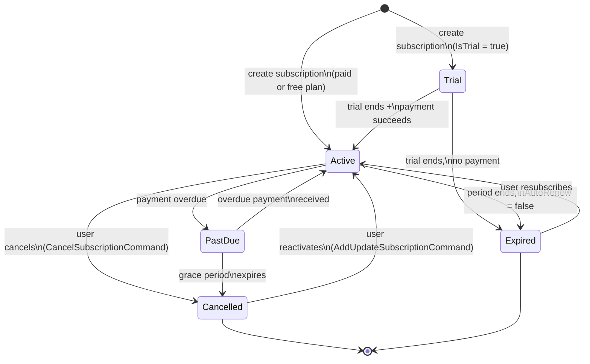

---

### 4. PaymentIntent

**Module:** `ClassifiedAds.Modules.Subscription`
**File:** `Entities/PaymentIntent.cs`

Tracks a user's intent to pay for a subscription. Uses the explicit `PaymentIntentStatus` enum. Integrates with PayOS payment gateway.

#### State Definitions

| State | Enum Value | Description |
|-------|------------|-------------|
| **RequiresPayment** | 0 | Intent created, awaiting user action. `ExpiresAt` set. |
| **Processing** | 1 | Payment is being processed by PayOS. |
| **Succeeded** | 2 | Payment completed successfully. Subscription activated. |
| **Canceled** | 3 | User or system cancelled the payment attempt. |
| **Expired** | 4 | Intent expired before user completed payment. |

#### Transition Rules

| From State | Event / Action | To State | Condition |
|------------|----------------|----------|-----------|
| `[*]` | `CreateSubscriptionPaymentCommand` | RequiresPayment | Intent created with TTL |
| RequiresPayment | Checkout link created | RequiresPayment | `OrderCode` + `CheckoutUrl` set (same state) |
| RequiresPayment | PayOS webhook (success) | Succeeded | `HandlePayOsWebhookCommand` |
| RequiresPayment | PayOS webhook (processing) | Processing | Intermediate payment status |
| RequiresPayment | User aborts | Canceled | `SyncPaymentFromPayOsCommand` (CANCELLED) |
| RequiresPayment | TTL expires | Expired | `ExpiresAt < NOW` |
| Processing | Payment confirms | Succeeded | `HandlePayOsWebhookCommand` |
| Processing | Payment rejected | Canceled | Provider rejection |

#### Diagram Layout

- **Start node** at top -> RequiresPayment
- **Happy path** (center): RequiresPayment -> Processing -> Succeeded
- **Direct success**: RequiresPayment -> Succeeded (bypass Processing)
- **Failure branches**: Canceled (left), Expired (right)
- **Terminal states**: Succeeded, Canceled, Expired at bottom

#### Mermaid Diagram

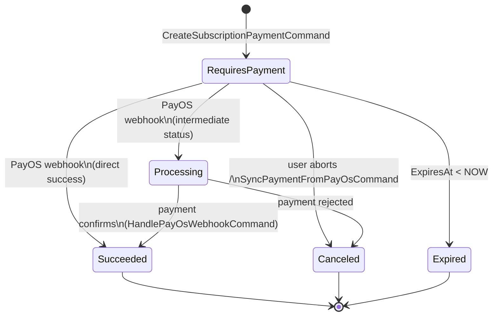

---

### 5. PaymentTransaction

**Module:** `ClassifiedAds.Modules.Subscription`
**File:** `Entities/PaymentTransaction.cs`

Records the result of a payment attempt. Uses the explicit `PaymentStatus` enum.

#### State Definitions

| State | Enum Value | Description |
|-------|------------|-------------|
| **Pending** | 0 | Transaction initiated, awaiting provider response. |
| **Succeeded** | 1 | Payment completed. Subscription activated. |
| **Failed** | 2 | Payment failed. `FailureReason` populated. |
| **Refunded** | 3 | Payment was refunded after success. |

#### Transition Rules

| From State | Event / Action | To State | Condition |
|------------|----------------|----------|-----------|
| `[*]` | Payment attempt | Pending | `HandlePayOsWebhookCommand` creates record |
| Pending | Provider confirms | Succeeded | PayOS success response |
| Pending | Provider rejects | Failed | PayOS failure + `FailureReason` set |
| Succeeded | Refund processed | Refunded | External refund from provider |

#### Diagram Layout

- **Start node** at top -> Pending
- **Happy path** (center): Pending -> Succeeded
- **Failure branch** (right): Pending -> Failed
- **Refund** (below Succeeded): Succeeded -> Refunded
- **Terminal states**: Succeeded, Failed, Refunded

#### Mermaid Diagram

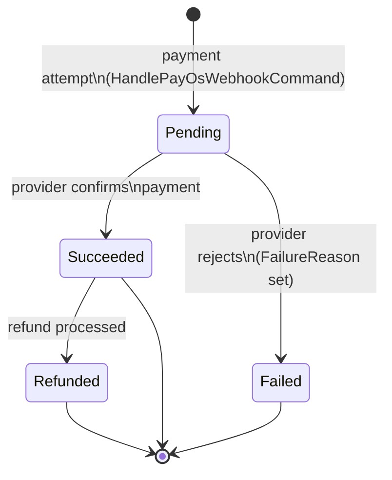

---

### 6. TestSuite

**Module:** `ClassifiedAds.Modules.TestGeneration`
**File:** `Entities/TestSuite.cs`

Aggregate root with a **dual state machine**: `Status` (lifecycle) and `ApprovalStatus` (review workflow). Version is incremented on each state change and tracked via `TestSuiteVersion`.

#### State Definitions

**Status (`TestSuiteStatus`):**

| State | Enum Value | Description |
|-------|------------|-------------|
| **Draft** | 0 | Suite is being created or edited. |
| **Ready** | 1 | Suite is finalized and ready for execution. |
| **Archived** | 2 | Suite is archived and inactive. |

**ApprovalStatus:**

| State | Enum Value | Description |
|-------|------------|-------------|
| **NotApplicable** | 0 | No order proposal exists yet. |
| **PendingReview** | 1 | AI-generated order proposal awaiting review. |
| **Approved** | 2 | Proposal approved as-is by reviewer. |
| **Rejected** | 3 | Proposal rejected by reviewer. |
| **ModifiedAndApproved** | 4 | Proposal approved with user-modified order. |

#### Transition Rules

**Status Transitions:**

| From State | Event / Action | To State | Condition |
|------------|----------------|----------|-----------|
| `[*]` | Create suite | Draft | Default initial state |
| Draft | Finalize | Ready | All test cases configured |
| Draft | `ArchiveTestSuiteScopeCommand` | Archived | User archives suite |
| Ready | `ArchiveTestSuiteScopeCommand` | Archived | User archives suite |
| Archived | Restore | Draft | `VersionChangeType.Restored` recorded |

**ApprovalStatus Transitions:**

| From State | Event / Action | To State | Condition |
|------------|----------------|----------|-----------|
| NotApplicable | `ProposeApiTestOrderCommand` | PendingReview | AI proposes test order |
| PendingReview | `ApproveApiTestOrderCommand` | Approved | Reviewer accepts as-is |
| PendingReview | `ApproveApiTestOrderCommand` (with reorder) | ModifiedAndApproved | Reviewer modifies then approves |
| PendingReview | `RejectApiTestOrderCommand` | Rejected | Reviewer declines |
| Approved | `ProposeApiTestOrderCommand` | PendingReview | New proposal supersedes |
| ModifiedAndApproved | `ProposeApiTestOrderCommand` | PendingReview | New proposal supersedes |
| Rejected | `ProposeApiTestOrderCommand` | PendingReview | New proposal after rejection |

#### Diagram Layout

- **Two nested state groups**: Status (outer) and ApprovalStatus (inner)
- **Status**: Linear Draft -> Ready -> Archived with Archived -> Draft restore
- **ApprovalStatus**: Star pattern with PendingReview at center

#### Mermaid Diagram

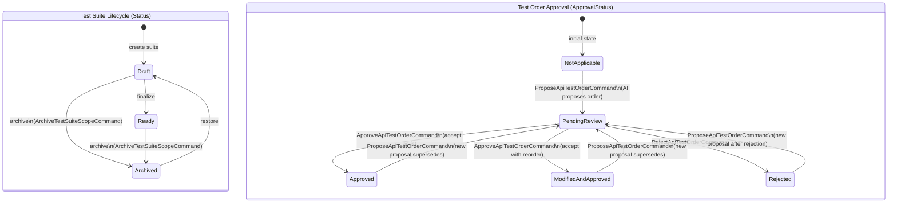

---

### 7. TestOrderProposal

**Module:** `ClassifiedAds.Modules.TestGeneration`
**File:** `Entities/TestOrderProposal.cs`

Represents a proposed execution order for test cases. Can originate from AI, user, system, or import (`ProposalSource` enum). Uses the explicit `ProposalStatus` enum with 7 states.

#### State Definitions

| State | Enum Value | Description |
|-------|------------|-------------|
| **Pending** | 0 | Proposal awaiting review. |
| **Approved** | 1 | Accepted without modifications. |
| **Rejected** | 2 | Declined by reviewer. |
| **ModifiedAndApproved** | 3 | Approved with user-modified order. |
| **Superseded** | 4 | Replaced by a newer proposal. |
| **Applied** | 5 | Order applied to test suite. `AppliedAt` set. |
| **Expired** | 6 | Review timeout exceeded. |

#### Transition Rules

| From State | Event / Action | To State | Condition |
|------------|----------------|----------|-----------|
| `[*]` | `ProposeApiTestOrderCommand` | Pending | New proposal created |
| Pending | `ApproveApiTestOrderCommand` (no reorder) | Approved | Reviewer accepts as-is |
| Pending | `ApproveApiTestOrderCommand` (with reorder) | ModifiedAndApproved | Reviewer modifies order then approves |
| Pending | `RejectApiTestOrderCommand` | Rejected | Reviewer declines |
| Pending | New proposal created | Superseded | `ProposeApiTestOrderCommand` supersedes existing |
| Pending | Timeout | Expired | Not reviewed within allowed time |
| Approved | Order applied to suite | Applied | `AppliedAt` + `AppliedOrder` set |
| Approved | New proposal created | Superseded | Newer proposal replaces this one |
| ModifiedAndApproved | Order applied to suite | Applied | `AppliedAt` + `AppliedOrder` set |
| ModifiedAndApproved | New proposal created | Superseded | Newer proposal replaces this one |

#### Diagram Layout

- **Start node** at top -> Pending
- **Decision fan** from Pending: 4 outgoing arrows
- **Applied** state below Approved and ModifiedAndApproved (final destination)
- **Superseded** on the side (reachable from Pending, Approved, ModifiedAndApproved)
- **Terminal states**: Applied, Rejected, Superseded, Expired

#### Mermaid Diagram

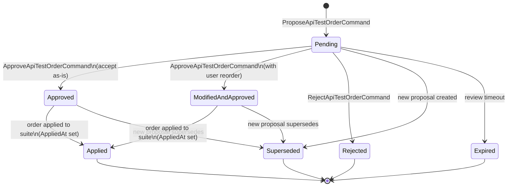

---

### 8. TestRun

**Module:** `ClassifiedAds.Modules.TestExecution`
**File:** `Entities/TestRun.cs`

Represents a single execution run of a test suite against an environment. Uses the explicit `TestRunStatus` enum. Tracks pass/fail/skip counts and duration.

#### State Definitions

| State | Enum Value | Description |
|-------|------------|-------------|
| **Pending** | 0 | Run created, waiting to start. `StartedAt = null`. |
| **Running** | 1 | Tests currently executing. `StartedAt` set. |
| **Completed** | 2 | All tests finished successfully. |
| **Failed** | 3 | Run encountered errors. `FailedCount > 0`. |
| **Cancelled** | 4 | Run was cancelled by user or system. |

#### Transition Rules

| From State | Event / Action | To State | Condition |
|------------|----------------|----------|-----------|
| `[*]` | Create test run | Pending | `RunNumber` assigned |
| Pending | Execution engine starts | Running | `StartedAt = NOW` |
| Pending | User cancels before start | Cancelled | Cancellation before execution |
| Running | All tests pass | Completed | `CompletedAt` set, `FailedCount = 0` |
| Running | Tests finish with failures | Failed | `CompletedAt` set, `FailedCount > 0` |
| Running | User cancels mid-run | Cancelled | `CompletedAt` set |

#### Diagram Layout

- **Start node** at top -> Pending
- **Happy path** (center): Pending -> Running -> Completed
- **Failure branch** (right): Running -> Failed
- **Cancel branches** (left): Pending -> Cancelled, Running -> Cancelled
- **Terminal states**: Completed, Failed, Cancelled

#### Mermaid Diagram

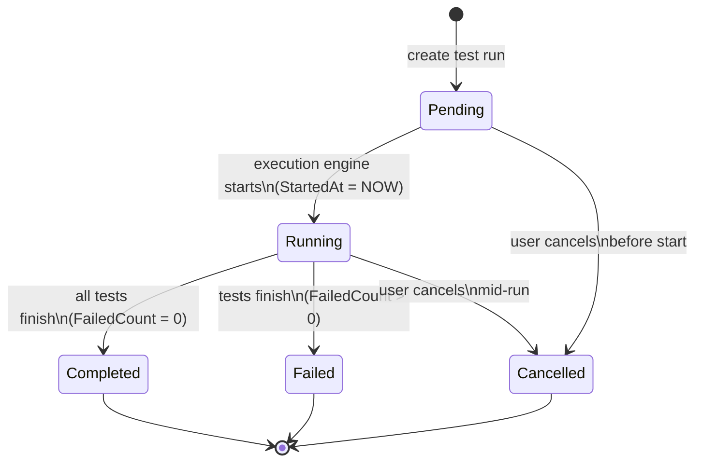

---

### 9. ApiSpecification

**Module:** `ClassifiedAds.Modules.ApiDocumentation`
**File:** `Entities/ApiSpecification.cs`

Represents an uploaded API specification file (OpenAPI, Postman, cURL, Manual). Has a **dual state**: `ParseStatus` (parsing lifecycle) and `IsActive` (activation flag). Idempotency guard prevents re-parsing.

#### State Definitions

**ParseStatus:**

| State | Enum Value | Description |
|-------|------------|-------------|
| **Pending** | 0 | File uploaded, awaiting parsing. |
| **Success** | 1 | Parsed successfully, endpoints extracted. |
| **Failed** | 2 | Parsing failed. `ParseErrors` populated. |

**Activation (`IsActive`):**

| State | Description |
|-------|-------------|
| **Inactive** | `IsActive = false` (default on upload). |
| **Active** | `IsActive = true`. Project's `ActiveSpecId` points to this spec. |

#### Transition Rules

| From State | Event / Action | To State | Condition |
|------------|----------------|----------|-----------|
| `[*]` | `UploadApiSpecificationCommand` | Pending + Inactive | Spec file uploaded |
| Pending | `ParseUploadedSpecificationCommand` (OK) | Success | Endpoints extracted, `ParsedAt` set |
| Pending | `ParseUploadedSpecificationCommand` (error) | Failed | `ParseErrors` populated |
| Pending | Idempotency guard | Pending | Already not-Pending: skip |
| Success + Inactive | `ActivateSpecificationCommand` | Success + Active | `IsActive = true`, `ActiveSpecId` set |
| Success + Active | `ActivateSpecificationCommand` (deactivate) | Success + Inactive | `IsActive = false`, `ActiveSpecId` cleared |
| Success + Active | Project archived | Success + Inactive | `ArchiveProjectCommand` cascades deactivation |

#### Diagram Layout

- **Two parallel lanes**: ParseStatus (vertical) and Activation (horizontal at Success level)
- **Start node** -> Pending_Inactive
- **Parse branch**: Pending -> Success or Failed
- **Activation toggle**: Only available when ParseStatus = Success
- **Failed** is a dead-end

#### Mermaid Diagram

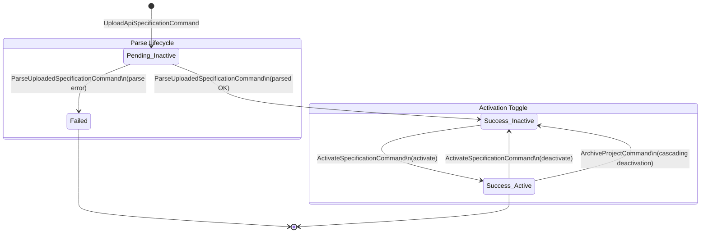

---

### 10. Project

**Module:** `ClassifiedAds.Modules.ApiDocumentation`
**File:** `Entities/Project.cs`

Aggregate root that groups API specifications and endpoints. Uses the explicit `ProjectStatus` enum. Deletion is soft (archive), not hard.

#### State Definitions

| State | Enum Value | Description |
|-------|------------|-------------|
| **Active** | 0 | Project is visible and usable. |
| **Archived** | 1 | Project is soft-deleted / hidden. All specs deactivated. |

#### Transition Rules

| From State | Event / Action | To State | Condition |
|------------|----------------|----------|-----------|
| `[*]` | `AddUpdateProjectCommand` | Active | New project created |
| Active | `ArchiveProjectCommand` (archive=true) | Archived | `ActiveSpecId` cleared, all specs deactivated |
| Active | `DeleteProjectCommand` | Archived | Soft-delete (not hard delete) |
| Archived | `ArchiveProjectCommand` (archive=false) | Active | Project restored |

#### Diagram Layout

- **Start node** at top -> Active
- **Bidirectional**: Active <-> Archived
- **Active** in center, **Archived** to the right

#### Mermaid Diagram

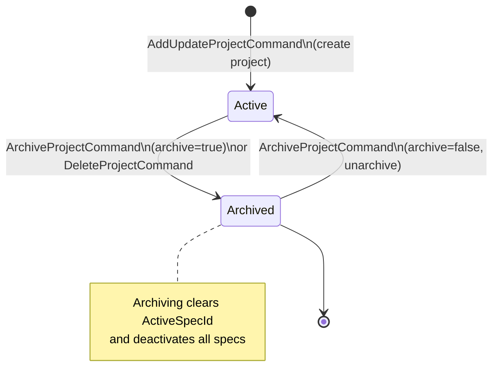

---

### 11. FileEntry

**Module:** `ClassifiedAds.Modules.Storage`
**File:** `Entities/FileEntry.cs`

Represents a file stored in the system (API specs, reports, exports, attachments). Uses **implicit boolean flags** (`Deleted`, `Archived`) and an optional expiration timestamp.

#### State Definitions

| State | Condition |
|-------|-----------|
| **Active** | `Deleted == false && Archived == false` |
| **Archived** | `Archived == true && Deleted == false` |
| **Deleted** | `Deleted == true` (soft delete, row moved to `DeletedFileEntries`) |
| **Expired** | `ExpiresAt != null && ExpiresAt < NOW` (cleanup eligible) |

#### Transition Rules

| From State | Event / Action | To State | Condition |
|------------|----------------|----------|-----------|
| `[*]` | Upload file | Active | `Deleted=false, Archived=false` |
| Active | Archive file | Archived | `Archived=true, ArchivedDate` set |
| Active | Delete file | Deleted | `Deleted=true, DeletedDate` set |
| Active | Expiration reached | Expired | `ExpiresAt < NOW` (temp files) |
| Archived | Delete file | Deleted | `Deleted=true` |
| Expired | Cleanup job | Deleted | Background job removes expired files |

#### Diagram Layout

- **Start node** at top -> Active
- **Archive branch** (right): Active -> Archived
- **Delete paths** (downward): Active -> Deleted, Archived -> Deleted
- **Expiration** (left): Active -> Expired -> Deleted
- **Terminal state**: Deleted at bottom

#### Mermaid Diagram

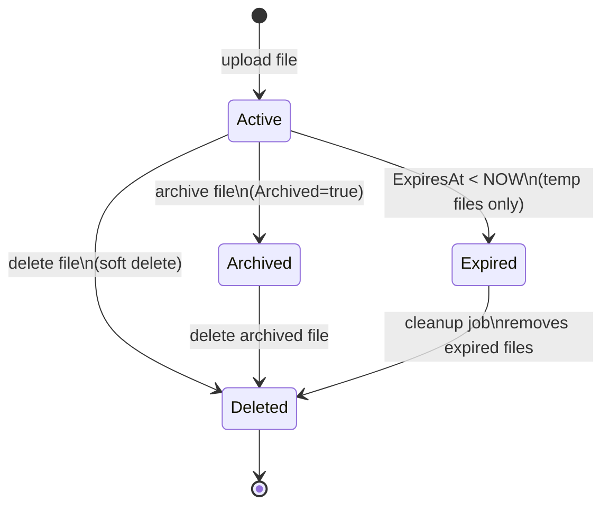

---

### 12. OutboxMessage

**Module:** Cross-cutting (present in every module)
**File:** `Entities/OutboxMessage.cs` (per module)

Infrastructure entity implementing the **Outbox Pattern** for reliable event publishing. Uses a boolean `Published` flag. Present in every module's schema.

#### State Definitions

| State | Condition |
|-------|-----------|
| **Unpublished** | `Published == false` |
| **Published** | `Published == true` |
| **Archived** | Row moved to `ArchivedOutboxMessages` table |

#### Transition Rules

| From State | Event / Action | To State | Condition |
|------------|----------------|----------|-----------|
| `[*]` | Domain event raised | Unpublished | `OutboxMessage` inserted in same transaction |
| Unpublished | `PublishEventsWorker` polls | Published | `Published = true`, event sent to message bus |
| Published | Cleanup job | Archived | Row moved to `ArchivedOutboxMessages` |

#### Diagram Layout

- **Linear flow**: Unpublished -> Published -> Archived
- **Start node** at top, terminal at bottom

#### Mermaid Diagram

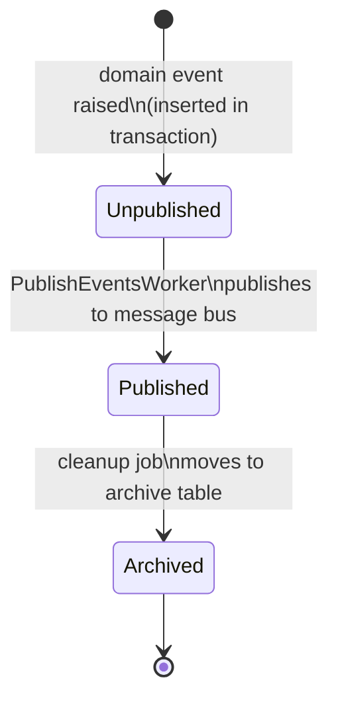

---

### 13. User

**Module:** `ClassifiedAds.Modules.Identity`
**File:** `Entities/User.cs`

Represents a system user account. Uses **implicit boolean and DateTime flags** for email confirmation, lockout, and 2FA states. Inheriting from ASP.NET Core Identity.

#### State Definitions

| State | Condition |
|-------|-----------|
| **Unconfirmed** | `EmailConfirmed == false` |
| **Active** | `EmailConfirmed == true && LockoutEnd == null` |
| **LockedOut** | `LockoutEnd != null && LockoutEnd > NOW` |
| **PermanentlyLocked** | `LockoutEnd == DateTimeOffset.MaxValue` |

#### Transition Rules

| From State | Event / Action | To State | Condition |
|------------|----------------|----------|-----------|
| `[*]` | User registers | Unconfirmed | `EmailConfirmed = false` |
| `[*]` | Admin creates user | Active | `EmailConfirmed = true` (admin bypass) |
| Unconfirmed | Email link clicked | Active | `EmailConfirmed = true` |
| Active | Failed logins exceed threshold | LockedOut | `LockoutEnd = future date` |
| Active | Admin locks account | PermanentlyLocked | `LockoutEnd = MaxValue` |
| LockedOut | Lockout period expires | Active | `LockoutEnd <= NOW` |
| LockedOut | Admin unlocks | Active | `LockoutEnd = null, AccessFailedCount = 0` |
| PermanentlyLocked | Admin unlocks | Active | `LockoutEnd = null, AccessFailedCount = 0` |

#### Diagram Layout

- **Start node** splits: Register (left) and Admin Create (right)
- **Primary flow**: Unconfirmed -> Active
- **Lockout branch** (right): Active -> LockedOut -> Active (loop)
- **Permanent lock** (below LockedOut): Active -> PermanentlyLocked

#### Mermaid Diagram

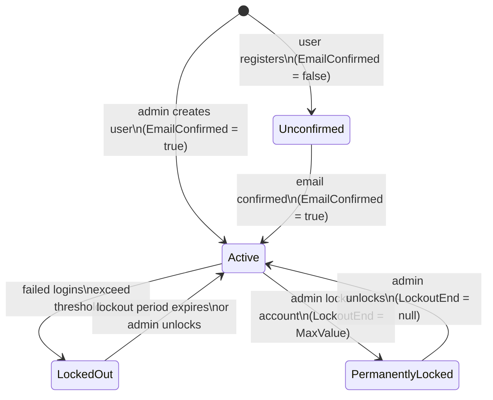

---

## Planned State Machines (Not Yet Implemented)

> These state machines are defined in feature specification documents but **do not yet exist in the codebase**. They should be implemented when the corresponding features are built.

---

### 14. LlmExplanationJob (Planned)

**Feature:** FE-09 (Async LLM Failure Explanation Workflow)
**Spec:** `docs/features/FE-09-acceptance-criteria/FE-09-01/requirement.json`

A background job that processes test failure explanation requests using LLM. Extends the existing `LlmInteraction` entity with a full workflow state machine including retry, caching, and dead-letter support.

#### State Definitions

| State | Description |
|-------|-------------|
| **Queued** | Explanation request created and waiting in queue. |
| **Locked** | Worker acquired Redis lock (idempotency by fingerprint). |
| **CacheHit** | Valid cached explanation found (TTL: 86400s). Skip LLM call. |
| **Generating** | LLM API call in progress. |
| **Completed** | Explanation generated and stored successfully. |
| **Retrying** | Transient error occurred. Awaiting exponential backoff. |
| **Failed** | Non-retryable error. Job aborted. |
| **DeadLettered** | Max retries (3) exhausted. Moved to dead-letter queue. |

#### Transition Rules

| From State | Event / Action | To State | Condition |
|------------|----------------|----------|-----------|
| `[*]` | Test failure detected | Queued | Explanation request enqueued |
| Queued | Worker picks up | Locked | Redis lock acquired by fingerprint |
| Locked | Cache lookup: hit | CacheHit | Valid cached result found |
| Locked | Cache lookup: miss | Generating | No cache, call LLM API |
| CacheHit | Return cached result | Completed | Cached explanation returned |
| Generating | LLM responds OK | Completed | Explanation stored + cached |
| Generating | Transient error | Retrying | HttpTimeout, RateLimit, NetworkFailure |
| Generating | Non-retryable error | Failed | InvalidPayload, MissingField, TemplateError |
| Retrying | Backoff expires | Generating | Retry attempt (exp backoff: 2s, 6s, 18s) |
| Retrying | Max retries exceeded | DeadLettered | `attempt >= 3` |

#### Diagram Layout

- **Start node** at top -> Queued
- **Lock gate**: Queued -> Locked
- **Decision branch** from Locked: CacheHit (left) or Generating (right)
- **Retry loop**: Generating <-> Retrying
- **Terminal states**: Completed (success), Failed (non-retryable), DeadLettered (retries exhausted)

#### Mermaid Diagram

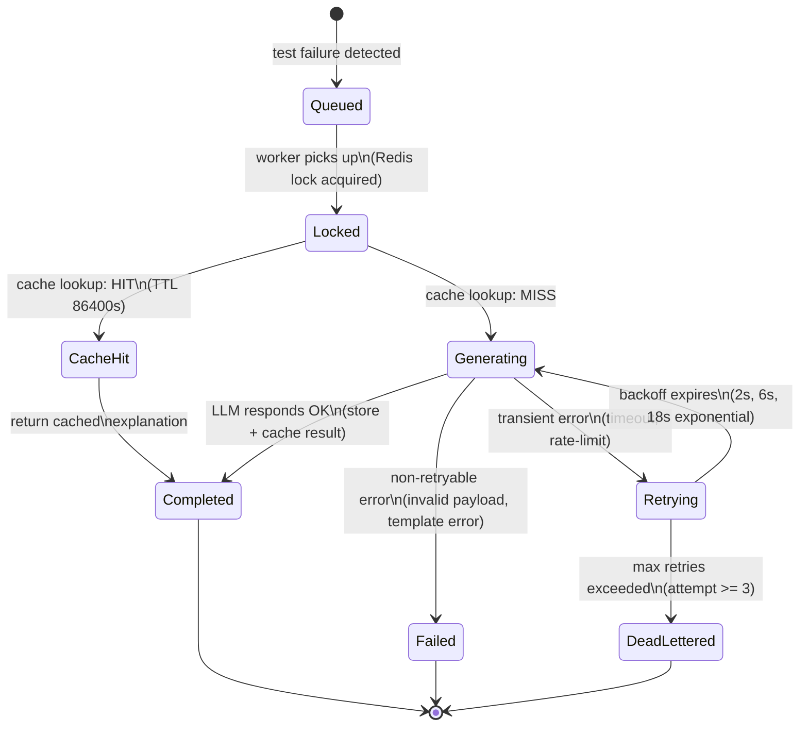

---

### 15. SubscriptionPlan (Planned Enhancement)

**Feature:** FE-14-01 (Admin Subscription Plan Management)
**Spec:** `docs/features/FE-14-subscription-billing/FE-14-01/admin-plan-management.md`

The existing `SubscriptionPlan` entity gains a **guarded deactivation** flow. The `IsActive` boolean becomes a state machine with a subscriber-count guard preventing deactivation of plans with active subscribers.

#### State Definitions

| State | Condition |
|-------|-----------|
| **Active** | `IsActive == true` |
| **Inactive** | `IsActive == false` |

#### Transition Rules

| From State | Event / Action | To State | Condition |
|------------|----------------|----------|-----------|
| `[*]` | Admin creates plan | Active | `IsActive = true` (default) |
| Active | Admin deactivates | Inactive | **Guard:** No subscribers in `[Trial, Active, PastDue]` |
| Active | Admin deactivates | **BLOCKED** | **Guard fails:** Active subscribers exist (409 Conflict) |
| Inactive | Admin activates | Active | No guard required |

#### Diagram Layout

- **Start node** -> Active
- **Bidirectional** with guard: Active -> Inactive (guarded), Inactive -> Active
- **Guard annotation** on deactivation transition

#### Mermaid Diagram

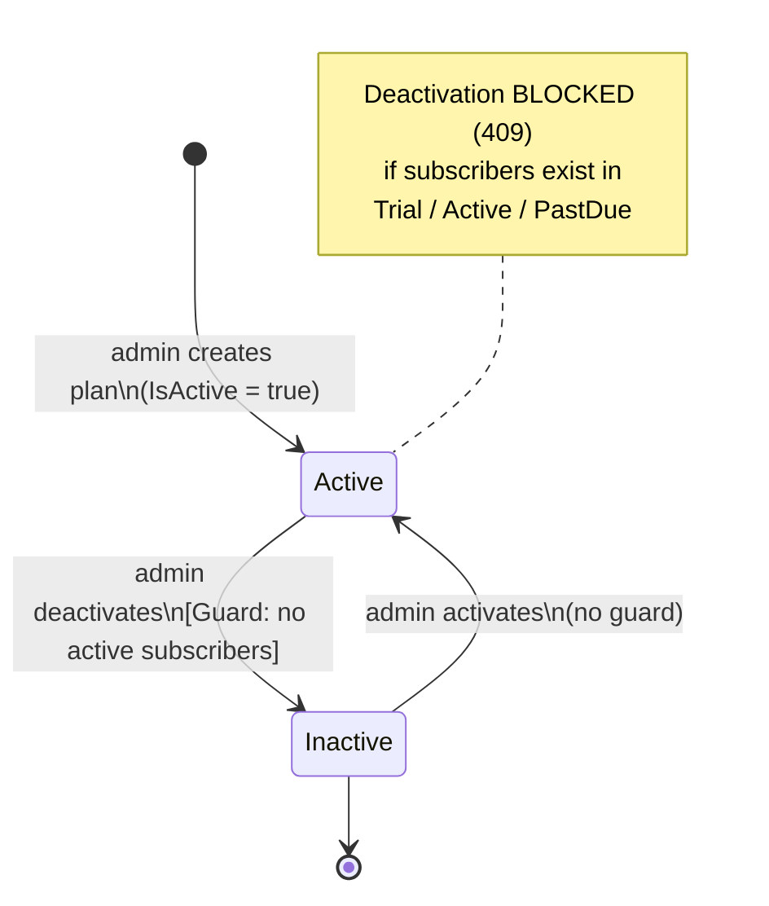

---

### 16. PaymentIntent Enhanced (Planned)

**Feature:** FE-14-02 (Subscription Payment Flow)
**Spec:** `docs/features/FE-14-subscription-billing/FE-14-02/acceptance-criteria.json`

The feature spec defines an **extended state machine** for `PaymentIntent` that adds a `Refunded` state and clarifies the webhook-driven transition model. This enhances the existing implementation.

#### State Definitions (Extended)

| State | Description |
|-------|-------------|
| **RequiresPayment** | Intent created, no checkout yet. |
| **Processing** | Checkout link created, user navigating payment page. |
| **Paid** | Payment confirmed by PayOS webhook (maps to current `Succeeded`). |
| **Failed** | Payment failed via PayOS webhook. |
| **Expired** | Checkout link TTL exceeded. |
| **Cancelled** | User abandoned checkout. |
| **Refunded** | Payment was refunded after success. **(NEW)** |

#### Transition Rules

| From State | Event / Action | To State | Condition |
|------------|----------------|----------|-----------|
| `[*]` | `CreateSubscriptionPaymentCommand` | RequiresPayment | Intent + TTL created |
| RequiresPayment | Checkout link created | Processing | `OrderCode`, `CheckoutUrl` set |
| Processing | PayOS webhook (success) | Paid | Payment confirmed |
| Processing | PayOS webhook (failure) | Failed | Payment rejected |
| Processing | TTL expires | Expired | `ExpiresAt < NOW` |
| RequiresPayment | User abandons | Cancelled | No checkout created before TTL |
| Processing | User abandons | Cancelled | Checkout abandoned |
| Paid | Refund processed | Refunded | External refund from PayOS **(NEW)** |

#### Diagram Layout

- **Start node** at top -> RequiresPayment
- **Checkout creation** step: RequiresPayment -> Processing
- **Webhook outcomes** from Processing: Paid, Failed, Expired
- **Abandon** from RequiresPayment or Processing -> Cancelled
- **Refund** (new): Paid -> Refunded
- **Terminal states**: Paid, Failed, Expired, Cancelled, Refunded

#### Mermaid Diagram

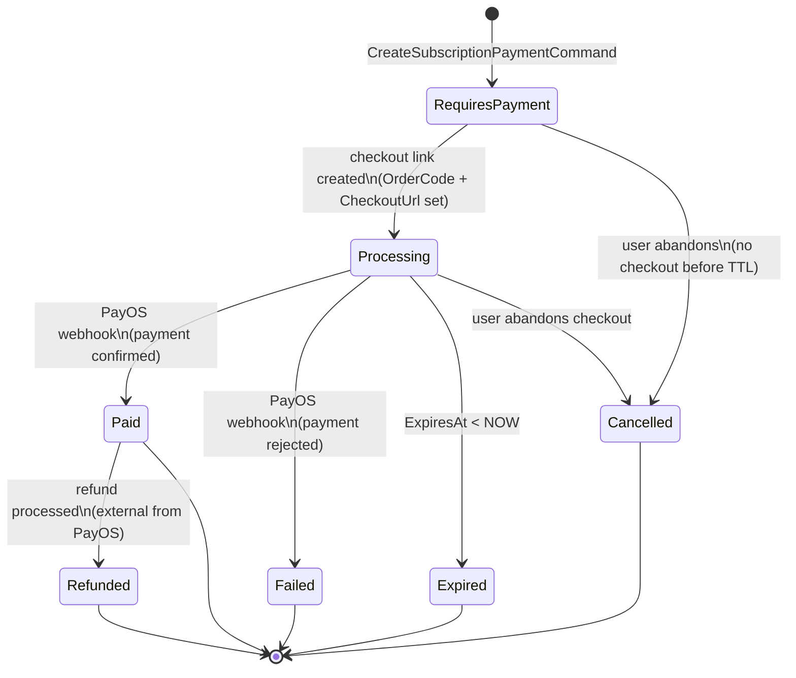

---

## Quick Reference: All Enums With State Semantics

| Module | Enum | Values | Entity |
|--------|------|--------|--------|
| Subscription | `SubscriptionStatus` | Trial, Active, PastDue, Cancelled, Expired | UserSubscription |
| Subscription | `PaymentIntentStatus` | RequiresPayment, Processing, Succeeded, Canceled, Expired | PaymentIntent |
| Subscription | `PaymentStatus` | Pending, Succeeded, Failed, Refunded | PaymentTransaction |
| Subscription | `ChangeType` | Created, Upgraded, Downgraded, Cancelled, Reactivated | SubscriptionHistory |
| TestGeneration | `TestSuiteStatus` | Draft, Ready, Archived | TestSuite |
| TestGeneration | `ApprovalStatus` | NotApplicable, PendingReview, Approved, Rejected, ModifiedAndApproved | TestSuite |
| TestGeneration | `ProposalStatus` | Pending, Approved, Rejected, ModifiedAndApproved, Superseded, Applied, Expired | TestOrderProposal |
| TestExecution | `TestRunStatus` | Pending, Running, Completed, Failed, Cancelled | TestRun |
| ApiDocumentation | `ParseStatus` | Pending, Success, Failed | ApiSpecification |
| ApiDocumentation | `ProjectStatus` | Active, Archived | Project |
