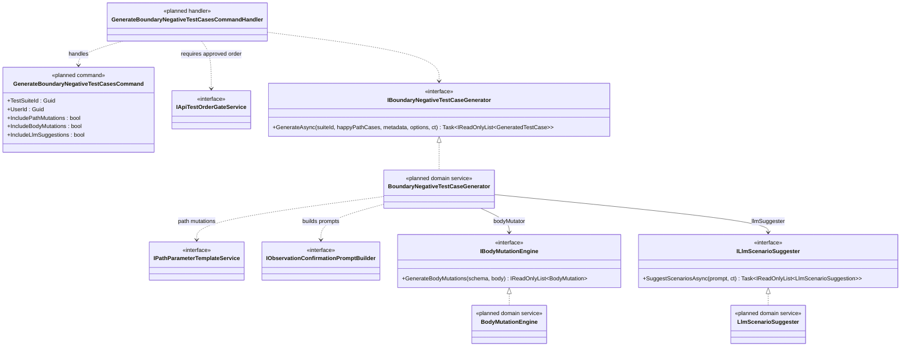

# UML Class Diagram — Mermaid Source (for draw.io Import)

> Each diagram below is a standalone Mermaid `classDiagram` block.
> To import into draw.io: Copy the content inside each `mermaid` code fence (without the triple backticks) → Extras → Edit Diagram → paste.

---

## A) DOMAIN CORE CLASS DIAGRAMS

### A.1 — API Documentation Bounded Context


---

### A.2 — Test Generation Bounded Context


---

### A.3 — Test Execution & Reporting Bounded Context


---

### A.4 — Subscription & Monetization Bounded Context


---

### A.5 — Identity Bounded Context


---

### A.6 — LLM Assistant Bounded Context


---

### A.7 — Notification Bounded Context


---

### A.8 — Storage Bounded Context


---

### A.9 — Configuration & AuditLog Bounded Context


---

## B) APPLICATION / FEATURE CLASS DIAGRAMS

### B.1 — Feature: API Documentation Management

```mermaid
classDiagram
    %% Commands
    class AddUpdateProjectCommand {
        <<command>>
    }
    class UploadApiSpecificationCommand {
        <<command>>
    }
    class CreateManualSpecificationCommand {
        <<command>>
    }
    class AddUpdateEndpointCommand {
        <<command>>
    }
    class ActivateSpecificationCommand {
        <<command>>
    }
    class ImportCurlCommand {
        <<command>>
    }
    class ArchiveProjectCommand {
        <<command>>
    }
    class DeleteProjectCommand {
        <<command>>
    }
    class DeleteSpecificationCommand {
        <<command>>
    }
    class DeleteEndpointCommand {
        <<command>>
    }

    %% Handlers
    class AddUpdateProjectCommandHandler {
        <<handler>>
    }
    class UploadApiSpecificationCommandHandler {
        <<handler>>
    }
    class CreateManualSpecificationCommandHandler {
        <<handler>>
    }
    class AddUpdateEndpointCommandHandler {
        <<handler>>
    }
    class ActivateSpecificationCommandHandler {
        <<handler>>
    }
    class ImportCurlCommandHandler {
        <<handler>>
    }
    class ArchiveProjectCommandHandler {
        <<handler>>
    }
    class DeleteProjectCommandHandler {
        <<handler>>
    }
    class DeleteSpecificationCommandHandler {
        <<handler>>
    }
    class DeleteEndpointCommandHandler {
        <<handler>>
    }

    %% Domain Services
    class IApiEndpointMetadataService {
        <<interface>>
    }
    class ApiEndpointMetadataService {
        <<domain service>>
    }
    class IPathParameterTemplateService {
        <<interface>>
    }
    class PathParameterTemplateService {
        <<domain service>>
    }

    %% Cross-Module Contracts
    class ISubscriptionLimitGatewayService {
        <<interface>>
    }
    class IStorageFileGatewayService {
        <<interface>>
    }

    IApiEndpointMetadataService <|.. ApiEndpointMetadataService
    IPathParameterTemplateService <|.. PathParameterTemplateService

    AddUpdateProjectCommandHandler ..> AddUpdateProjectCommand : handles
    AddUpdateProjectCommandHandler ..> ISubscriptionLimitGatewayService

    UploadApiSpecificationCommandHandler ..> UploadApiSpecificationCommand : handles
    UploadApiSpecificationCommandHandler ..> IStorageFileGatewayService
    UploadApiSpecificationCommandHandler ..> ISubscriptionLimitGatewayService

    CreateManualSpecificationCommandHandler ..> CreateManualSpecificationCommand : handles
    CreateManualSpecificationCommandHandler ..> ISubscriptionLimitGatewayService
    CreateManualSpecificationCommandHandler ..> IPathParameterTemplateService

    AddUpdateEndpointCommandHandler ..> AddUpdateEndpointCommand : handles
    AddUpdateEndpointCommandHandler ..> ISubscriptionLimitGatewayService
    AddUpdateEndpointCommandHandler ..> IPathParameterTemplateService

    ActivateSpecificationCommandHandler ..> ActivateSpecificationCommand : handles

    ImportCurlCommandHandler ..> ImportCurlCommand : handles
    ImportCurlCommandHandler ..> ISubscriptionLimitGatewayService
    ImportCurlCommandHandler ..> IPathParameterTemplateService

    ArchiveProjectCommandHandler ..> ArchiveProjectCommand : handles
    DeleteProjectCommandHandler ..> DeleteProjectCommand : handles
    DeleteSpecificationCommandHandler ..> DeleteSpecificationCommand : handles
    DeleteEndpointCommandHandler ..> DeleteEndpointCommand : handles
```



---

### B.2 — Feature: Test Lifecycle Orchestration


---

### B.3 — Feature: Subscription & Payment Management

```mermaid
classDiagram
    %% Commands
    class ConsumeLimitAtomicallyCommand {
        <<command>>
    }
    class UpsertUsageTrackingCommand {
        <<command>>
    }
    class CreateSubscriptionPaymentCommand {
        <<command>>
    }
    class HandlePayOsWebhookCommand {
        <<command>>
    }
    class ReconcilePayOsCheckoutsCommand {
        <<command>>
    }
    class AddUpdatePlanCommand {
        <<command>>
    }
    class DeletePlanCommand {
        <<command>>
    }
    class AddUpdateSubscriptionCommand {
        <<command>>
    }
    class CancelSubscriptionCommand {
        <<command>>
    }
    class AddPaymentTransactionCommand {
        <<command>>
    }
    class CreatePayOsCheckoutCommand {
        <<command>>
    }
    class SyncPaymentFromPayOsCommand {
        <<command>>
    }
    class PublishEventsCommand {
        <<command>>
    }

    %% Handlers
    class ConsumeLimitAtomicallyCommandHandler {
        <<handler>>
    }
    class UpsertUsageTrackingCommandHandler {
        <<handler>>
    }
    class CreateSubscriptionPaymentCommandHandler {
        <<handler>>
    }
    class HandlePayOsWebhookCommandHandler {
        <<handler>>
    }
    class ReconcilePayOsCheckoutsCommandHandler {
        <<handler>>
    }
    class AddUpdatePlanCommandHandler {
        <<handler>>
    }
    class DeletePlanCommandHandler {
        <<handler>>
    }
    class AddUpdateSubscriptionCommandHandler {
        <<handler>>
    }
    class CancelSubscriptionCommandHandler {
        <<handler>>
    }
    class AddPaymentTransactionCommandHandler {
        <<handler>>
    }
    class CreatePayOsCheckoutCommandHandler {
        <<handler>>
    }
    class SyncPaymentFromPayOsCommandHandler {
        <<handler>>
    }
    class PublishEventsCommandHandler {
        <<handler>>
    }

    %% Services
    class ISubscriptionLimitGatewayService {
        <<interface>>
    }
    class SubscriptionLimitGatewayService {
        <<application service>>
    }
    class IPayOsService {
        <<interface>>
    }
    class PayOsService {
        <<application service>>
    }

    class OutboxMessageFactory {
        <<factory>>
        +Create(eventType, triggeredById, objectId, payload)$ OutboxMessage
    }

    ISubscriptionLimitGatewayService <|.. SubscriptionLimitGatewayService
    IPayOsService <|.. PayOsService

    SubscriptionLimitGatewayService ..> ConsumeLimitAtomicallyCommand : dispatches
    SubscriptionLimitGatewayService ..> UpsertUsageTrackingCommand : dispatches

    ConsumeLimitAtomicallyCommandHandler ..> ConsumeLimitAtomicallyCommand : handles
    UpsertUsageTrackingCommandHandler ..> UpsertUsageTrackingCommand : handles
    CreateSubscriptionPaymentCommandHandler ..> CreateSubscriptionPaymentCommand : handles
    HandlePayOsWebhookCommandHandler ..> HandlePayOsWebhookCommand : handles
    HandlePayOsWebhookCommandHandler ..> IPayOsService

    ReconcilePayOsCheckoutsCommandHandler ..> ReconcilePayOsCheckoutsCommand : handles
    ReconcilePayOsCheckoutsCommandHandler ..> IPayOsService
    ReconcilePayOsCheckoutsCommandHandler ..> OutboxMessageFactory

    AddUpdatePlanCommandHandler ..> AddUpdatePlanCommand : handles
    DeletePlanCommandHandler ..> DeletePlanCommand : handles
    AddUpdateSubscriptionCommandHandler ..> AddUpdateSubscriptionCommand : handles
    CancelSubscriptionCommandHandler ..> CancelSubscriptionCommand : handles
    AddPaymentTransactionCommandHandler ..> AddPaymentTransactionCommand : handles
    CreatePayOsCheckoutCommandHandler ..> CreatePayOsCheckoutCommand : handles
    CreatePayOsCheckoutCommandHandler ..> IPayOsService
    SyncPaymentFromPayOsCommandHandler ..> SyncPaymentFromPayOsCommand : handles
    SyncPaymentFromPayOsCommandHandler ..> IPayOsService
    PublishEventsCommandHandler ..> PublishEventsCommand : handles
```



---

### B.4 — Feature: Identity & Access Management


---

## C) PATTERN CLASS DIAGRAMS

### C.1 — Strategy Pattern: External Identity Providers


---

### C.2 — Strategy Pattern: API Test Order Algorithm Pipeline


---

### C.3 — Factory Pattern: Subscription Outbox Message Creation


---

### C.4 — Observer Pattern: Domain Events and Handlers


---

### C.5 — Decorator Pattern: Command and Query Handler Pipeline


---

## D) PLANNED FEATURE CLASS DIAGRAMS

### D.1 — Feature: Happy-Path Test Case Generation (FE-05B)


---

### D.2 — Feature: Boundary & Negative Test Case Generation (FE-06)



---

### D.3 — Feature: Test Execution Engine (FE-07 + FE-08)

```mermaid
classDiagram
    %% Commands
    class StartTestRunCommand {
        <<planned command>>
        +TestSuiteId : Guid
        +EnvironmentId : Guid
        +TriggeredById : Guid
    }

    %% Handlers
    class StartTestRunCommandHandler {
        <<planned handler>>
    }

    %% Services Planned
    class ITestExecutionOrchestrator {
        <<interface>>
        +ExecuteAsync(testRunId, ct) Task~TestRunResult~
    }
    class TestExecutionOrchestrator {
        <<planned domain service>>
    }

    class IHttpTestExecutor {
        <<interface>>
        +ExecuteAsync(request, environment, variables, ct) Task~HttpTestResponse~
    }
    class HttpTestExecutor {
        <<planned domain service>>
    }

    class IVariableExtractor {
        <<interface>>
        +Extract(response, variables) IReadOnlyDictionary~string_string~
    }
    class VariableExtractor {
        <<planned domain service>>
    }

    class IVariableResolver {
        <<interface>>
        +Resolve(request, currentVariables) ResolvedTestCaseRequest
    }
    class VariableResolver {
        <<planned domain service>>
    }

    class IRuleBasedValidator {
        <<interface>>
        +Validate(response, expectation) TestCaseValidationResult
    }
    class RuleBasedValidator {
        <<planned domain service>>
    }

    class ITestResultCollector {
        <<interface>>
        +CollectAsync(testRunId, results, ct) Task
    }
    class TestResultCollector {
        <<planned domain service>>
    }

    %% Services Existing
    class IApiTestOrderGateService {
        <<interface>>
    }
    class IExecutionAuthConfigService {
        <<interface>>
    }

    ITestExecutionOrchestrator <|.. TestExecutionOrchestrator
    IHttpTestExecutor <|.. HttpTestExecutor
    IVariableExtractor <|.. VariableExtractor
    IVariableResolver <|.. VariableResolver
    IRuleBasedValidator <|.. RuleBasedValidator
    ITestResultCollector <|.. TestResultCollector

    StartTestRunCommandHandler ..> StartTestRunCommand : handles
    StartTestRunCommandHandler ..> ITestExecutionOrchestrator

    TestExecutionOrchestrator ..> IApiTestOrderGateService : loads approved order
    TestExecutionOrchestrator --> IHttpTestExecutor : executor
    TestExecutionOrchestrator --> IVariableExtractor : extractor
    TestExecutionOrchestrator --> IVariableResolver : resolver
    TestExecutionOrchestrator --> IRuleBasedValidator : validator
    TestExecutionOrchestrator --> ITestResultCollector : collector
    TestExecutionOrchestrator ..> IExecutionAuthConfigService : resolves auth
```

---

### D.4 — Feature: LLM Failure Explanations (FE-09)

```mermaid
classDiagram
    %% Commands
    class ExplainTestFailureCommand {
        <<planned command>>
        +TestRunId : Guid
        +TestCaseId : Guid
        +UserId : Guid
    }

    %% Handlers
    class ExplainTestFailureCommandHandler {
        <<planned handler>>
    }

    %% Services Planned
    class ILlmFailureExplainer {
        <<interface>>
        +ExplainAsync(failedResult, endpointContext, ct) Task~FailureExplanation~
    }
    class LlmFailureExplainer {
        <<planned domain service>>
    }

    class ILlmClient {
        <<interface>>
        +CompleteAsync(prompt, systemPrompt, model, ct) Task~LlmCompletionResult~
    }
    class OpenAiLlmClient {
        <<planned application service>>
    }

    %% Domain Entities Existing
    class LlmInteraction {
        <<aggregate root>>
    }
    class LlmSuggestionCache {
        <<aggregate root>>
    }

    ILlmFailureExplainer <|.. LlmFailureExplainer
    ILlmClient <|.. OpenAiLlmClient

    ExplainTestFailureCommandHandler ..> ExplainTestFailureCommand : handles
    ExplainTestFailureCommandHandler ..> ILlmFailureExplainer

    LlmFailureExplainer --> ILlmClient : llmClient
    LlmFailureExplainer ..> LlmInteraction : creates interaction record
    LlmFailureExplainer ..> LlmSuggestionCache : checks and stores cache
```

---

### D.5 — Feature: Test Reporting & Export (FE-10)

```mermaid
classDiagram
    %% Commands
    class GenerateTestReportCommand {
        <<planned command>>
        +TestRunId : Guid
        +ReportType : ReportType
        +Format : ReportFormat
        +GeneratedById : Guid
    }

    %% Handlers
    class GenerateTestReportCommandHandler {
        <<planned handler>>
    }

    %% Services Planned
    class ITestReportGenerator {
        <<interface>>
        +GenerateAsync(testRunId, reportType, format, ct) Task~Guid~
    }
    class TestReportGenerator {
        <<planned domain service>>
    }

    class ICoverageCalculator {
        <<interface>>
        +CalculateAsync(testRunId, ct) Task~CoverageMetricResult~
    }
    class CoverageCalculator {
        <<planned domain service>>
    }

    class IReportRenderer {
        <<interface>>
        +RenderAsync(data, format, ct) Task~Stream~
    }
    class PdfReportRenderer {
        <<planned application service>>
    }
    class CsvReportRenderer {
        <<planned application service>>
    }
    class JsonReportRenderer {
        <<planned application service>>
    }
    class HtmlReportRenderer {
        <<planned application service>>
    }

    %% Cross-Module Contracts
    class IStorageFileGatewayService {
        <<interface>>
    }

    ITestReportGenerator <|.. TestReportGenerator
    ICoverageCalculator <|.. CoverageCalculator
    IReportRenderer <|.. PdfReportRenderer
    IReportRenderer <|.. CsvReportRenderer
    IReportRenderer <|.. JsonReportRenderer
    IReportRenderer <|.. HtmlReportRenderer

    GenerateTestReportCommandHandler ..> GenerateTestReportCommand : handles
    GenerateTestReportCommandHandler ..> ITestReportGenerator

    TestReportGenerator --> ICoverageCalculator : coverageCalc
    TestReportGenerator --> IReportRenderer : renderer strategy
    TestReportGenerator ..> IStorageFileGatewayService : uploads report file
```

---

### D.6 — Feature: LLM Suggestion Review Pipeline (FE-15 / FE-16 / FE-17)

```mermaid
classDiagram
    %% Planned Entities
    class LlmSuggestion {
        <<planned entity>>
        +Id : Guid
        +TestSuiteId : Guid
        +EndpointId : Guid
        +SuggestionType : SuggestionType
        +TestType : TestType
        +SuggestedName : string
        +SuggestedDescription : string
        +SuggestedRequest : string
        +SuggestedExpectation : string
        +Confidence : double
        +ReviewStatus : ReviewStatus
        +ReviewedById : Guid
        +ReviewedAt : DateTimeOffset
        +ReviewNotes : string
        +ModifiedContent : string
        +LlmInteractionId : Guid
        +CreatedDateTime : DateTimeOffset
        +UpdatedDateTime : DateTimeOffset
    }

    class UserFeedback {
        <<planned entity>>
        +Id : Guid
        +SuggestionId : Guid
        +UserId : Guid
        +Rating : int
        +Comment : string
        +CreatedDateTime : DateTimeOffset
    }

    %% Commands Planned
    class ReviewLlmSuggestionCommand {
        <<planned command>>
        +SuggestionId : Guid
        +Action : ReviewAction
        +ModifiedContent : string
        +ReviewNotes : string
        +UserId : Guid
    }

    class BulkReviewLlmSuggestionsCommand {
        <<planned command>>
        +TestSuiteId : Guid
        +Action : ReviewAction
        +FilterByType : SuggestionType
        +FilterByConfidence : double
        +UserId : Guid
    }

    class SubmitSuggestionFeedbackCommand {
        <<planned command>>
        +SuggestionId : Guid
        +UserId : Guid
        +Rating : int
        +Comment : string
    }

    %% Handlers Planned
    class ReviewLlmSuggestionCommandHandler {
        <<planned handler>>
    }
    class BulkReviewLlmSuggestionsCommandHandler {
        <<planned handler>>
    }
    class SubmitSuggestionFeedbackCommandHandler {
        <<planned handler>>
    }

    %% Services Planned
    class ILlmSuggestionReviewService {
        <<interface>>
        +ApproveAsync(suggestion, userId, ct) Task
        +RejectAsync(suggestion, userId, notes, ct) Task
        +ModifyAndApproveAsync(suggestion, modified, userId, ct) Task
        +MaterializeApprovedAsync(suiteId, ct) Task~int~
    }
    class LlmSuggestionReviewService {
        <<planned domain service>>
    }

    class IUserFeedbackService {
        <<interface>>
        +SubmitFeedbackAsync(suggestionId, userId, rating, comment, ct) Task
    }
    class UserFeedbackService {
        <<planned domain service>>
    }

    ILlmSuggestionReviewService <|.. LlmSuggestionReviewService
    IUserFeedbackService <|.. UserFeedbackService

    ReviewLlmSuggestionCommandHandler ..> ReviewLlmSuggestionCommand : handles
    ReviewLlmSuggestionCommandHandler ..> ILlmSuggestionReviewService

    BulkReviewLlmSuggestionsCommandHandler ..> BulkReviewLlmSuggestionsCommand : handles
    BulkReviewLlmSuggestionsCommandHandler ..> ILlmSuggestionReviewService

    SubmitSuggestionFeedbackCommandHandler ..> SubmitSuggestionFeedbackCommand : handles
    SubmitSuggestionFeedbackCommandHandler ..> IUserFeedbackService

    LlmSuggestion "1" *-- "0..*" UserFeedback : Feedbacks

    note "ReviewStatus enum planned:\nPending, Approved, Rejected,\nModifiedAndApproved, Expired"
```

---

### D.7 — Feature: Data-Set Driven Parameterized Execution (FE-05B Extension)

```mermaid
classDiagram
    %% Commands
    class ManageTestDataSetsCommand {
        <<planned command>>
        +TestCaseId : Guid
        +DataSets : List~TestDataSetDto~
        +UserId : Guid
    }

    %% Handlers
    class ManageTestDataSetsCommandHandler {
        <<planned handler>>
    }

    %% Services Planned
    class ITestDataSetResolver {
        <<interface>>
        +ExpandAsync(testCase, dataSets, ct) Task~IReadOnlyList~ExpandedTestCaseRequest~~
    }
    class TestDataSetResolver {
        <<planned domain service>>
    }

    class IDataSetPlaceholderEngine {
        <<interface>>
        +Resolve(template, dataRow) string
        +FindPlaceholders(template) IReadOnlyList~string~
        +ValidateDataSetSchema(placeholders, dataSet) ValidationResult
    }
    class DataSetPlaceholderEngine {
        <<planned domain service>>
    }

    ITestDataSetResolver <|.. TestDataSetResolver
    IDataSetPlaceholderEngine <|.. DataSetPlaceholderEngine

    ManageTestDataSetsCommandHandler ..> ManageTestDataSetsCommand : handles
    TestDataSetResolver --> IDataSetPlaceholderEngine : placeholderEngine
```

---

### D.8 — Feature: Real-Time Test Execution Monitoring (FE-07 Extension)

```mermaid
classDiagram
    %% SignalR Hub Planned
    class ITestExecutionHubClient {
        <<interface>>
        +ReceiveTestProgress(message) Task
        +ReceiveTestRunCompleted(summary) Task
    }
    class TestExecutionHub {
        <<planned application service>>
    }

    %% Services Planned
    class ITestProgressPublisher {
        <<interface>>
        +PublishProgressAsync(testRunId, testCaseId, status, durationMs, error, ct) Task
        +PublishCompletedAsync(testRunId, summary, ct) Task
    }
    class SignalRTestProgressPublisher {
        <<planned application service>>
    }

    class ITestRunSubscriptionManager {
        <<interface>>
        +SubscribeAsync(connectionId, testRunId, ct) Task
        +UnsubscribeAsync(connectionId, testRunId, ct) Task
    }
    class RedisTestRunSubscriptionManager {
        <<planned application service>>
    }

    %% DTOs Planned
    class TestProgressMessage {
        <<planned dto>>
        +TestRunId : Guid
        +TestCaseId : Guid
        +TestCaseName : string
        +Status : TestCaseExecutionStatus
        +DurationMs : long
        +ErrorSummary : string
        +ProgressPercent : double
        +CompletedCount : int
        +TotalCount : int
    }

    class TestRunSummaryMessage {
        <<planned dto>>
        +TestRunId : Guid
        +FinalStatus : TestRunStatus
        +TotalDurationMs : long
        +PassedCount : int
        +FailedCount : int
        +SkippedCount : int
    }

    ITestProgressPublisher <|.. SignalRTestProgressPublisher
    ITestRunSubscriptionManager <|.. RedisTestRunSubscriptionManager

    TestExecutionHub ..> ITestRunSubscriptionManager
    SignalRTestProgressPublisher ..> ITestExecutionHubClient : pushes to clients

    note "Integration with D.3:\nTestExecutionOrchestrator calls\nITestProgressPublisher after each\ntest case execution completes."
```

---

### D.9 — Feature: CI/CD Webhook Integration (Post-FE-10)

```mermaid
classDiagram
    %% Planned Entities
    class WebhookRegistration {
        <<planned aggregate root>>
        +Id : Guid
        +ProjectId : Guid
        +Name : string
        +CallbackUrl : string
        +Secret : string
        +EventFilter : string
        +IsActive : bool
        +LastTriggeredAt : DateTimeOffset
        +CreatedById : Guid
        +CreatedDateTime : DateTimeOffset
        +UpdatedDateTime : DateTimeOffset
    }

    class WebhookDeliveryLog {
        <<planned entity>>
        +Id : Guid
        +WebhookRegistrationId : Guid
        +EventType : string
        +Payload : string
        +ResponseStatusCode : int
        +ResponseBody : string
        +DeliveredAt : DateTimeOffset
        +DurationMs : int
        +Success : bool
        +RetryCount : int
    }

    %% Commands Planned
    class RegisterWebhookCommand {
        <<planned command>>
        +ProjectId : Guid
        +Name : string
        +CallbackUrl : string
        +EventFilter : string
        +UserId : Guid
    }

    class TriggerTestRunViaWebhookCommand {
        <<planned command>>
        +ProjectId : Guid
        +TestSuiteId : Guid
        +EnvironmentId : Guid
        +WebhookPayload : string
        +Signature : string
    }

    %% Handlers Planned
    class RegisterWebhookCommandHandler {
        <<planned handler>>
    }
    class TriggerTestRunViaWebhookCommandHandler {
        <<planned handler>>
    }

    %% Services Planned
    class IWebhookTriggerService {
        <<interface>>
        +ValidateSignatureAsync(payload, signature, secret, ct) Task~bool~
        +TriggerAsync(projectId, suiteId, environmentId, ct) Task~Guid~
    }
    class WebhookTriggerService {
        <<planned domain service>>
    }

    class IWebhookResultNotifier {
        <<interface>>
        +NotifyAsync(webhookRegistration, testRunResult, ct) Task~WebhookDeliveryLog~
    }
    class WebhookResultNotifier {
        <<planned domain service>>
    }

    IWebhookTriggerService <|.. WebhookTriggerService
    IWebhookResultNotifier <|.. WebhookResultNotifier

    RegisterWebhookCommandHandler ..> RegisterWebhookCommand : handles
    TriggerTestRunViaWebhookCommandHandler ..> TriggerTestRunViaWebhookCommand : handles
    TriggerTestRunViaWebhookCommandHandler ..> IWebhookTriggerService

    WebhookRegistration "1" *-- "0..*" WebhookDeliveryLog : DeliveryLogs
    WebhookResultNotifier ..> WebhookDeliveryLog : creates delivery record
```

---

### D.10 — Feature: Test Suite Comparison & Regression Detection (Post-FE-10)

```mermaid
classDiagram
    %% Planned Entities
    class ComparisonReport {
        <<planned aggregate root>>
        +Id : Guid
        +TestSuiteId : Guid
        +BaselineRunId : Guid
        +ComparedRunId : Guid
        +NewlyFailing : string
        +NewlyPassing : string
        +ConsistentlyFailing : string
        +FlakyTestCandidates : string
        +PerformanceDelta : string
        +Summary : string
        +GeneratedById : Guid
        +CreatedDateTime : DateTimeOffset
        +UpdatedDateTime : DateTimeOffset
    }

    class RegressionAlert {
        <<planned entity>>
        +Id : Guid
        +ComparisonReportId : Guid
        +TestCaseId : Guid
        +AlertType : RegressionAlertType
        +Severity : AlertSeverity
        +Description : string
        +PreviousStatus : string
        +CurrentStatus : string
        +PerformanceDeltaMs : long
        +AcknowledgedById : Guid
        +AcknowledgedAt : DateTimeOffset
    }

    %% Commands Planned
    class CompareTestRunsCommand {
        <<planned command>>
        +TestSuiteId : Guid
        +BaselineRunId : Guid
        +ComparedRunId : Guid
        +GeneratedById : Guid
    }

    class DetectRegressionsCommand {
        <<planned command>>
        +TestSuiteId : Guid
        +RecentRunCount : int
        +UserId : Guid
    }

    %% Handlers Planned
    class CompareTestRunsCommandHandler {
        <<planned handler>>
    }
    class DetectRegressionsCommandHandler {
        <<planned handler>>
    }

    %% Services Planned
    class ITestRunComparator {
        <<interface>>
        +CompareAsync(baselineRunId, comparedRunId, ct) Task~ComparisonResult~
    }
    class TestRunComparator {
        <<planned domain service>>
    }

    class IRegressionDetector {
        <<interface>>
        +DetectAsync(suiteId, recentRunCount, ct) Task~RegressionAnalysisResult~
        +IdentifyFlakyTests(suiteId, runCount, failureThreshold, ct) Task~IReadOnlyList~FlakyTestResult~~
    }
    class RegressionDetector {
        <<planned domain service>>
    }

    class IPerformanceTrendAnalyzer {
        <<interface>>
        +AnalyzeTrendsAsync(suiteId, runCount, ct) Task~IReadOnlyList~PerformanceTrendResult~~
        +DetectDegradationAsync(suiteId, threshold, ct) Task~IReadOnlyList~DegradationAlert~~
    }
    class PerformanceTrendAnalyzer {
        <<planned domain service>>
    }

    ITestRunComparator <|.. TestRunComparator
    IRegressionDetector <|.. RegressionDetector
    IPerformanceTrendAnalyzer <|.. PerformanceTrendAnalyzer

    CompareTestRunsCommandHandler ..> CompareTestRunsCommand : handles
    CompareTestRunsCommandHandler ..> ITestRunComparator

    DetectRegressionsCommandHandler ..> DetectRegressionsCommand : handles
    DetectRegressionsCommandHandler ..> IRegressionDetector
    DetectRegressionsCommandHandler ..> IPerformanceTrendAnalyzer

    ComparisonReport "1" *-- "0..*" RegressionAlert : Alerts
```
