# UML Class Diagram Source (Modular Strategy)

## Static Analysis Method
- Scope scanned: all `ClassifiedAds.*` C# projects, with focus on `ClassifiedAds.Modules.*`, `ClassifiedAds.Domain`, `ClassifiedAds.Application`, and `ClassifiedAds.Contracts`.
- Filtering applied:
  - Excluded DTOs, mapper classes, configuration classes, helper/utility classes, constants-only classes, enums, generated files, tests, docs, scripts, and build artifacts (`bin/obj`).
  - Retained core entities, aggregate roots, key value objects, core services, public-facing interfaces, command handlers, and pattern participants.
- Bounded-context inference approach (automatic):
  1. Namespace clustering from `ClassifiedAds.Modules.<Context>`.
  2. Structural dependency extraction from `*.csproj` references.
  3. Cross-context coupling extraction from `using ClassifiedAds.Contracts.*` imports.
  4. Context grouping by namespace affinity + shared contract dependency overlap.

## Inferred Bounded Contexts (Namespace + Structural Coupling)
- `API Spec & Test Design`: `ApiDocumentation`, `TestGeneration`.
- `Identity & Collaboration`: `Identity`, `AuditLog`, `Notification`.
- `Monetization & Assets`: `Subscription`, `Storage`.
- `Execution & Reporting`: `TestExecution`, `TestReporting`.
- `Support Contexts`: `Configuration`, `LlmAssistant`.

---

## STEP 1 - High-Level Architecture Diagram

### Diagram: Layered Modular Monolith and Subsystems
- Scope: Layer-level architecture, dependency direction, and major subsystems.
- Included modules/components:
  - Hosts: `WebAPI`, `Background`, `AppHost`, `Migrator`
  - Core layers: `Application`, `Domain`, `Infrastructure`, `Persistence.PostgreSQL`, `Contracts`, `CrossCuttingConcerns`
  - Subsystems: `ApiDocumentation`, `TestGeneration`, `TestExecution`, `TestReporting`, `Identity`, `AuditLog`, `Notification`, `Subscription`, `Storage`, `Configuration`, `LlmAssistant`

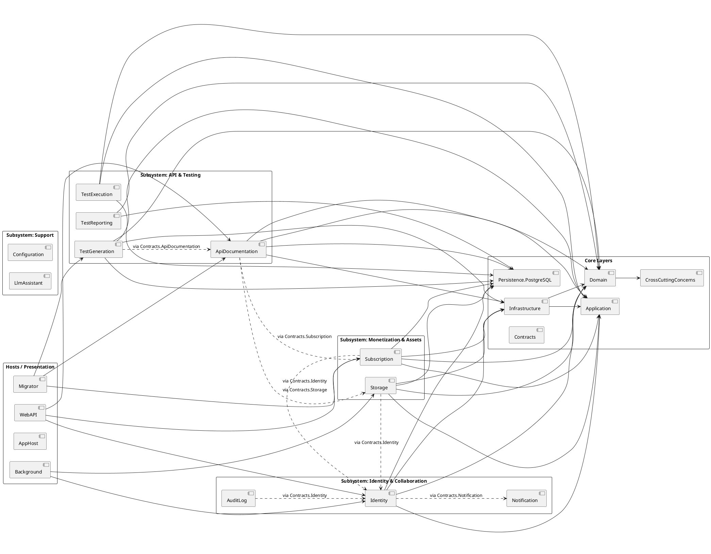

---

## STEP 2 - Domain Core Diagram

### Diagram: API Quality Lifecycle Core Domain
- Scope: Core business entities, aggregates, cross-module domain services, and key relationships.
- Included classes (30):
  - `Project`, `ApiSpecification`, `ApiEndpoint`, `EndpointParameter`, `EndpointResponse`, `SecurityScheme`
  - `TestSuite`, `TestCase`, `TestCaseRequest`, `TestCaseExpectation`, `TestCaseVariable`, `TestDataSet`, `TestOrderProposal`, `TestSuiteVersion`
  - `ExecutionEnvironment`, `TestRun`, `TestReport`, `CoverageMetric`
  - `SubscriptionPlan`, `PlanLimit`, `UserSubscription`, `UsageTracking`
  - `IApiEndpointMetadataService`, `ApiEndpointMetadataService`
  - `IApiTestOrderService`, `ApiTestOrderService`
  - `IApiTestOrderGateService`, `ApiTestOrderGateService`
  - `ISubscriptionLimitGatewayService`, `SubscriptionLimitGatewayService`

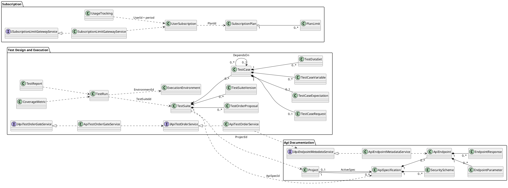

---

## STEP 3 - Feature-Based Diagrams

### Diagram: Feature - API Documentation Management
- Scope: Project/specification/endpoint lifecycle, metadata extraction, and contract-based integrations.
- Included classes (25):
  - Entities: `Project`, `ApiSpecification`, `ApiEndpoint`, `EndpointParameter`, `EndpointResponse`, `EndpointSecurityReq`, `SecurityScheme`
  - Services/interfaces: `IApiEndpointMetadataService`, `ApiEndpointMetadataService`, `IPathParameterTemplateService`, `PathParameterTemplateService`
  - Commands and handlers: `AddUpdateProjectCommand`, `AddUpdateProjectCommandHandler`, `UploadApiSpecificationCommand`, `UploadApiSpecificationCommandHandler`, `CreateManualSpecificationCommand`, `CreateManualSpecificationCommandHandler`, `AddUpdateEndpointCommand`, `AddUpdateEndpointCommandHandler`, `ActivateSpecificationCommand`, `ActivateSpecificationCommandHandler`, `ImportCurlCommand`, `ImportCurlCommandHandler`
  - External contracts: `ISubscriptionLimitGatewayService`, `IStorageFileGatewayService`

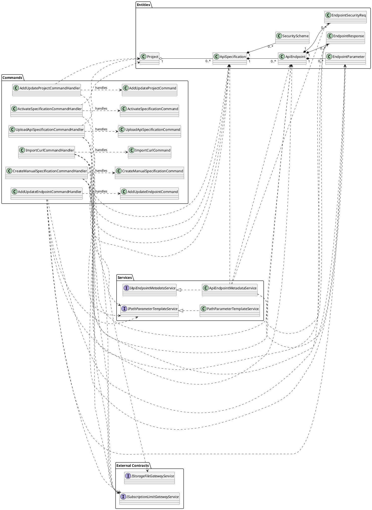

### Diagram: Feature - Subscription and Monetization
- Scope: Plan/entitlement domain, payment intent lifecycle, and usage consumption flow.
- Included classes (23):
  - Entities: `SubscriptionPlan`, `PlanLimit`, `UserSubscription`, `UsageTracking`, `PaymentIntent`, `PaymentTransaction`, `SubscriptionHistory`, `OutboxMessage`
  - Services/interfaces: `ISubscriptionLimitGatewayService`, `SubscriptionLimitGatewayService`, `IPayOsService`, `PayOsService`
  - Commands and handlers: `ConsumeLimitAtomicallyCommand`, `ConsumeLimitAtomicallyCommandHandler`, `UpsertUsageTrackingCommand`, `UpsertUsageTrackingCommandHandler`, `CreateSubscriptionPaymentCommand`, `CreateSubscriptionPaymentCommandHandler`, `HandlePayOsWebhookCommand`, `HandlePayOsWebhookCommandHandler`, `ReconcilePayOsCheckoutsCommand`, `ReconcilePayOsCheckoutsCommandHandler`
  - Factory: `OutboxMessageFactory`

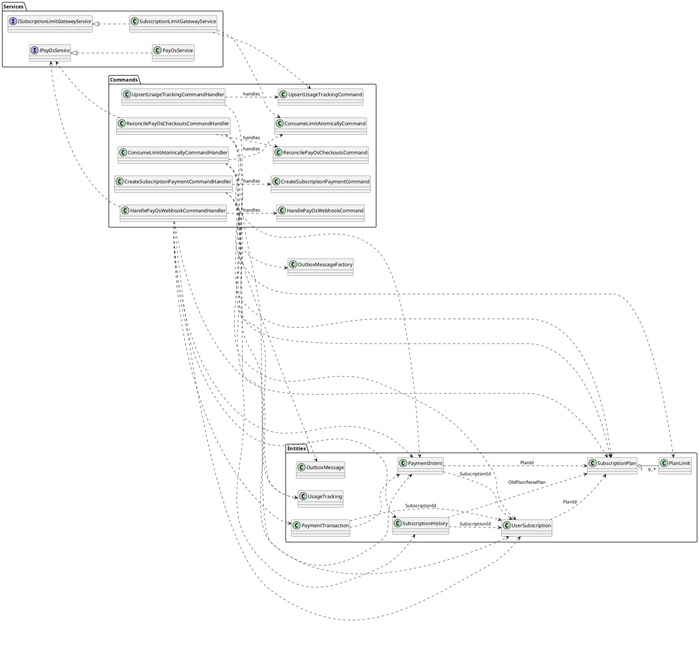

### Diagram: Feature - Identity and Access Management
- Scope: User-role-claim aggregate structure, current-user abstraction, and external identity synchronization.
- Included classes (18):
  - Entities: `User`, `UserProfile`, `Role`, `UserRole`, `UserClaim`, `RoleClaim`, `UserLogin`, `UserToken`
  - Public interfaces/services: `IUserService`, `UserService`, `ICurrentUser`, `CurrentWebUser`, `AnonymousUser`
  - Provider strategy participants: `IIdentityProvider`, `Auth0IdentityProvider`, `AzureActiveDirectoryB2CIdentityProvider`
  - Sync flow: `SyncUsersCommand`, `SyncUsersCommandHandler`

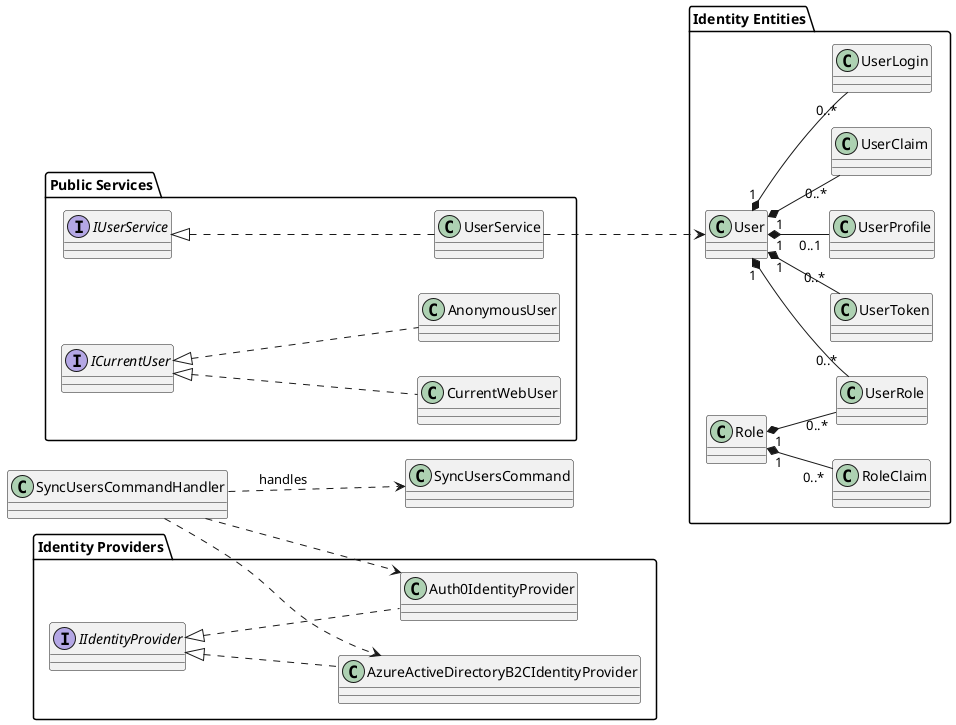

### Diagram: Feature - Test Lifecycle Orchestration
- Scope: Test-suite lifecycle, proposal/approval workflow, execution environment management, and reporting artifacts.
- Included classes (31):
  - Design entities: `TestSuite`, `TestCase`, `TestCaseRequest`, `TestCaseExpectation`, `TestCaseVariable`, `TestDataSet`, `TestCaseChangeLog`, `TestOrderProposal`, `TestSuiteVersion`
  - Execution/reporting entities: `ExecutionEnvironment`, `TestRun`, `TestReport`, `CoverageMetric`
  - Services/interfaces: `IApiTestOrderAlgorithm`, `ApiTestOrderAlgorithm`, `IApiTestOrderService`, `ApiTestOrderService`, `IApiTestOrderGateService`, `ApiTestOrderGateService`, `ITestSuiteScopeService`, `TestSuiteScopeService`, `IExecutionAuthConfigService`, `ExecutionAuthConfigService`, `IApiEndpointMetadataService`
  - Commands and handlers: `AddUpdateTestSuiteScopeCommand`, `AddUpdateTestSuiteScopeCommandHandler`, `ProposeApiTestOrderCommand`, `ProposeApiTestOrderCommandHandler`, `ApproveApiTestOrderCommand`, `ApproveApiTestOrderCommandHandler`, `RejectApiTestOrderCommand`, `RejectApiTestOrderCommandHandler`, `ReorderApiTestOrderCommand`, `ReorderApiTestOrderCommandHandler`, `AddUpdateExecutionEnvironmentCommand`, `AddUpdateExecutionEnvironmentCommandHandler`

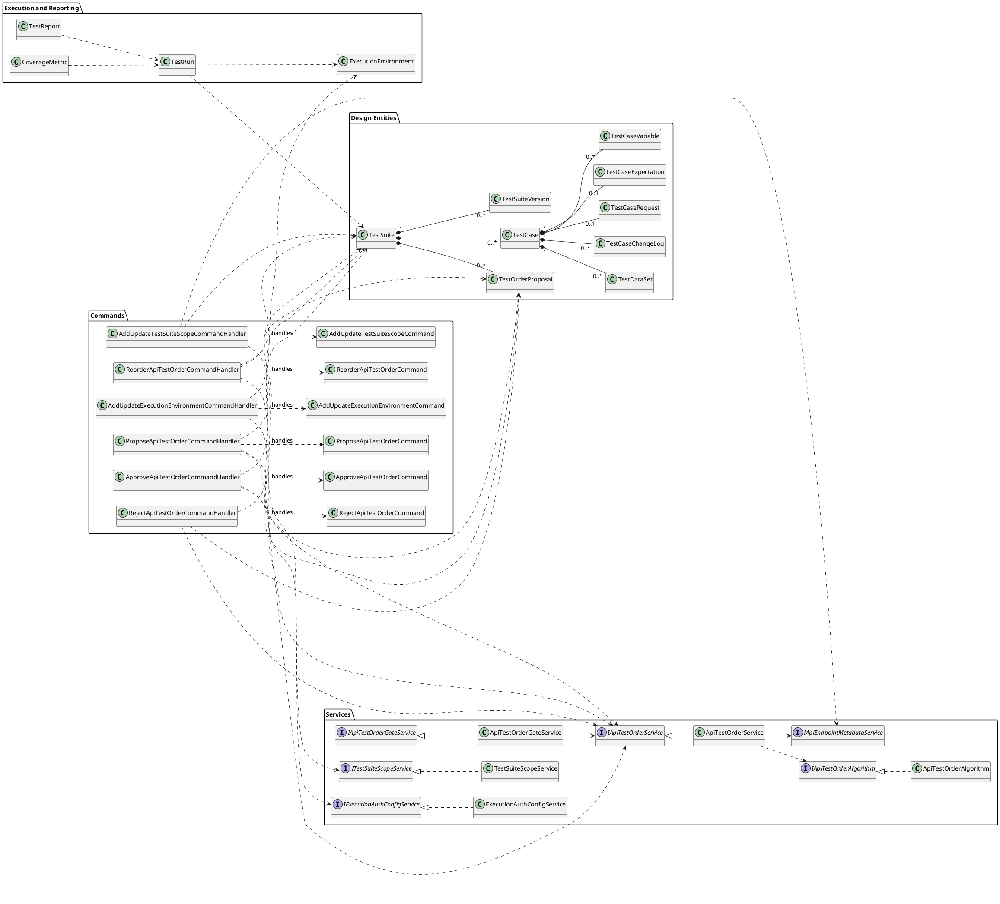

---

## STEP 4 - Pattern Identification

### Diagram: Strategy Pattern - External Identity Providers
- Scope: Provider strategy abstraction and runtime provider selection in user synchronization flow.
- Included classes:
  - `IIdentityProvider`, `Auth0IdentityProvider`, `AzureActiveDirectoryB2CIdentityProvider`, `SyncUsersCommandHandler`

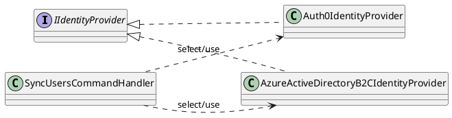

### Diagram: Strategy Pattern - API Test Order Algorithm Pipeline
- Scope: Interchangeable ordering strategy and analyzers behind order service.
- Included classes:
  - `IApiTestOrderService`, `ApiTestOrderService`
  - `IApiTestOrderAlgorithm`, `ApiTestOrderAlgorithm`
  - `ISchemaRelationshipAnalyzer`, `SchemaRelationshipAnalyzer`
  - `IDependencyAwareTopologicalSorter`, `DependencyAwareTopologicalSorter`
  - `IApiEndpointMetadataService`

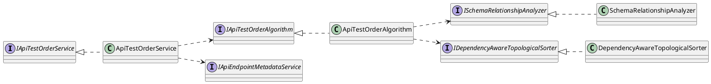

### Diagram: Factory Pattern - Subscription Outbox Message Creation
- Scope: Centralized outbox message object creation for payment reconciliation events.
- Included classes:
  - `ReconcilePayOsCheckoutsCommandHandler`, `OutboxMessageFactory`, `OutboxMessage`
  - `SubscriptionOutboxEventBase`, `PaymentIntentStatusChangedOutboxEvent`, `PaymentCheckoutLinkCreatedOutboxEvent`

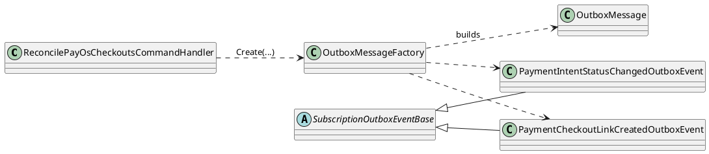

### Diagram: Observer Pattern - Domain Events and Handlers
- Scope: Event publication and subscription via `Dispatcher` and `IDomainEventHandler<T>`.
- Included classes:
  - `IDomainEvent`, `EntityCreatedEvent<T>`, `EntityUpdatedEvent<T>`, `EntityDeletedEvent<T>`
  - `IDomainEventHandler<T>`, `Dispatcher`
  - `ProjectCreatedEventHandler`, `ProjectUpdatedEventHandler`, `ProjectDeletedEventHandler`
  - `SpecCreatedEventHandler`, `SpecUpdatedEventHandler`, `SpecDeletedEventHandler`

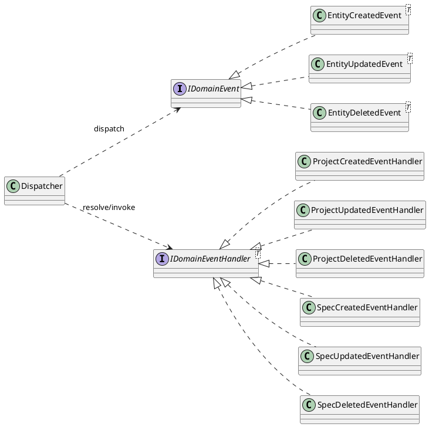

### Diagram: Decorator Pattern - Command and Query Handler Pipeline
- Scope: Attribute-driven handler decoration for audit logging and database retry behavior.
- Included classes:
  - `ICommandHandler<T>`, `IQueryHandler<TQuery,TResult>`
  - `AuditLogCommandDecorator<T>`, `AuditLogQueryDecorator<TQuery,TResult>`
  - `DatabaseRetryCommandDecorator<T>`, `DatabaseRetryQueryDecorator<TQuery,TResult>`, `DatabaseRetryDecoratorBase`
  - `HandlerFactory`, `MappingAttribute`

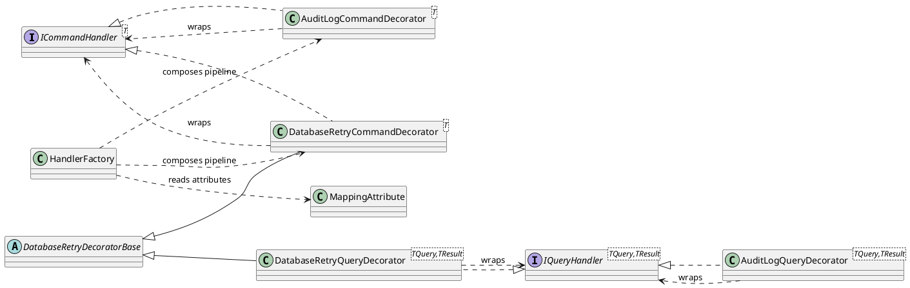

### Adapter/Facade Note
- No dedicated adapter hierarchy was found as a first-class pattern.
- `Dispatcher` functions as a lightweight facade over command/query/event dispatch and is already represented in the observer/decorator context.
