# UML Class Diagram Source (Refactored — Academic Standard)

## Static Analysis Method
- Scope scanned: all `ClassifiedAds.*` C# projects, with focus on `ClassifiedAds.Modules.*`, `ClassifiedAds.Domain`, `ClassifiedAds.Application`, and `ClassifiedAds.Contracts`.
- Exclusions (DTOs, mappers, config/helpers, enums, tests/docs/generated/build artifacts) were applied.
- Bounded-context inference: namespace clustering from `ClassifiedAds.Modules.<Context>`, structural dependency from `*.csproj`, cross-context coupling from `using ClassifiedAds.Contracts.*`.

## Conventions Used Throughout

| Notation | UML Meaning | When Used |
|---|---|---|
| `*--` | Composition | Owned child entity with parent navigation property (lifecycle-bound) |
| `o--` | Aggregation | Parent holds collection but child has independent identity |
| `-->` | Directed Association | Navigation property exists at code level |
| `<\|..` | Interface Realization | Class implements interface |
| `<\|--` | Inheritance | Class extends base class |
| `..>` | Dependency | Temporary usage (handler uses command, injected call) |
| No line + attribute | Id-only FK | Cross-module Guid reference, no navigation property |

### Stereotype Mapping

| Stereotype | Criteria |
|---|---|
| `<<aggregate root>>` | Inherits `Entity<Guid>` + `IAggregateRoot`, is root of consistency boundary |
| `<<entity>>` | Inherits `Entity<Guid>` + `IAggregateRoot`, is owned child within an aggregate |
| `<<domain service>>` | Stateless service operating on domain concepts, lives in module Services/ |
| `<<application service>>` | Service in Contracts/ or Application/ layer, cross-module gateway |
| `<<command>>` | CQRS command object |
| `<<handler>>` | CQRS command/query handler |
| `<<factory>>` | Object creation responsibility |
| `<<interface>>` | Interface contract |

> **Note on aggregate boundaries:** In this codebase most entities use `Entity<Guid>` + `IAggregateRoot` marker uniformly. The aggregate/entity distinction below is inferred from navigational ownership: if entity B's lifecycle is fully controlled by A (A holds collection of B, B has parent nav back to A), B is treated as a child `<<entity>>` within A's aggregate.
>
> **IAggregateRoot exceptions:** Five Identity child entities (`UserRole`, `UserClaim`, `RoleClaim`, `UserToken`, `EmailMessageAttachment`) inherit only `Entity<Guid>` without `IAggregateRoot` in code. They are still modeled as `<<entity>>` which is correct.
>
> **Global omissions (by design):**
> - `RowVersion : byte[]` — inherited from `Entity<Guid>` by ALL entities. Omitted from every class box (infrastructure concern).
> - `ArchivedOutboxMessage` — exists in 7 modules (ApiDocumentation, TestGeneration, TestExecution, TestReporting, Subscription, Storage, LlmAssistant) as a sibling of `OutboxMessage` extending `OutboxMessageBase`. Omitted from domain diagrams to reduce noise; structure mirrors `OutboxMessage` exactly.
> - Per-module `AuditLogEntry` and `OutboxMessage` local copies — documented centrally in A.9 with a note. Each module has its own identical copy in code.
> - `CreatedDateTime` / `UpdatedDateTime` — inherited from `Entity<Guid>`. Shown on aggregate roots and key entities, intentionally omitted from leaf child entities to reduce clutter.

---

## A) DOMAIN CORE CLASS DIAGRAMS

### A.1 — API Documentation Bounded Context

**Scope:** Core domain entities of the ApiDocumentation module — Project aggregate with its owned specifications, endpoints, parameters, responses, and security definitions.

**Aggregate boundaries:**
- `Project` is the aggregate root. It owns `ApiSpecification` (aggregation — specs have own identity but are managed through Project).
- `ApiSpecification` owns `ApiEndpoint` and `SecurityScheme` (composition — lifecycle bound).
- `ApiEndpoint` owns `EndpointParameter`, `EndpointResponse`, `EndpointSecurityReq` (composition).

**Relationship decisions:**
- `Project` ↔ `ApiSpecification`: Aggregation (`o--`) because specifications have independent identity and can be activated/deactivated, but are managed through Project.
- `Project --> ApiSpecification` (ActiveSpec): Directed association for the optional active specification pointer.
- `ApiSpecification *-- ApiEndpoint`: Composition because endpoints cannot exist without their specification.
- `ApiEndpoint *-- EndpointParameter/EndpointResponse/EndpointSecurityReq`: Composition — owned children.
- `ApiSpecification *-- SecurityScheme`: Composition — scheme lifecycle bound to spec.
- `OwnerId : Guid` and `OriginalFileId : Guid?` are cross-module references (Identity, Storage) — shown as attributes only, no relationship lines.

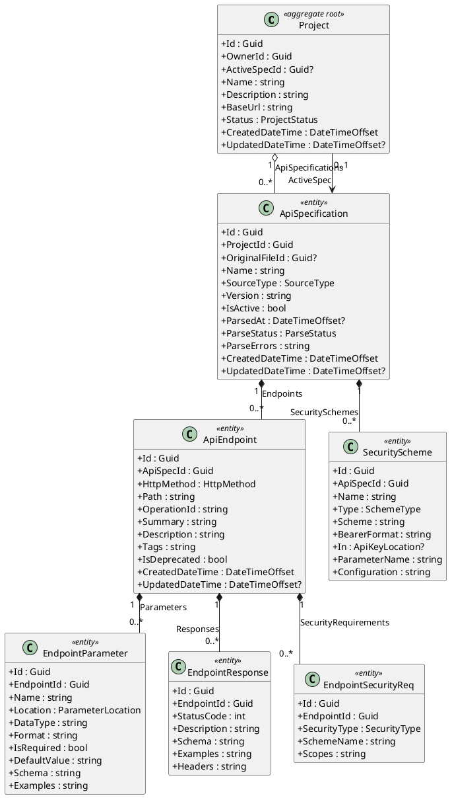

---

### A.2 — Test Generation Bounded Context

**Scope:** Core domain entities of the TestGeneration module — TestSuite aggregate with test cases, their requests/expectations/variables/datasets, versioning, change logs, and order proposals.

**Aggregate boundaries:**
- `TestSuite` is the aggregate root. Owns `TestCase`, `TestSuiteVersion`, `TestOrderProposal`.
- `TestCase` owns `TestCaseRequest` (1:1), `TestCaseExpectation` (1:1), `TestCaseVariable`, `TestDataSet`, `TestCaseChangeLog`.
- `TestCase` has a self-referencing optional association (`DependsOn`).

**Relationship decisions:**
- `TestSuite *-- TestCase`: Composition — test cases are lifecycle-bound to suite.
- `TestSuite *-- TestSuiteVersion/TestOrderProposal`: Composition — versioning and proposals owned by suite.
- `TestCase *-- TestCaseRequest/TestCaseExpectation`: Composition (1:1) — owned detail objects.
- `TestCase *-- TestCaseVariable/TestDataSet/TestCaseChangeLog`: Composition — owned collections.
- `TestCase --> TestCase` (DependsOn): Self-referencing directed association (navigation property exists).
- `ProjectId`, `ApiSpecId`, `EndpointId`, `CreatedById`, `ApprovedById`, `ChangedById`, etc. are cross-module Guid-only references — attributes only, no lines.

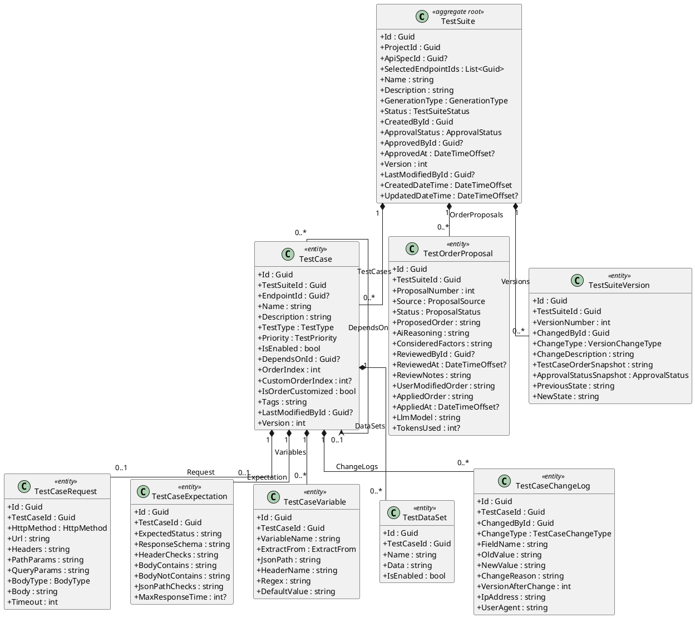

---

### A.3 — Test Execution & Reporting Bounded Context

**Scope:** Domain entities for execution environments, test runs, reports, and coverage metrics. These are independent aggregates in separate modules (`TestExecution`, `TestReporting`), linked to other modules only via Guid FKs.

**Aggregate boundaries:**
- Each entity is an independent aggregate root (no intra-module navigation properties).
- All cross-module references (`TestSuiteId`, `EnvironmentId`, `TestRunId`, `FileId`) are Guid-only — shown as attributes.

**Relationship decisions:**
- No association/composition lines drawn because there are no navigation properties in the code.
- All FK references are expressed as typed attributes within each class.

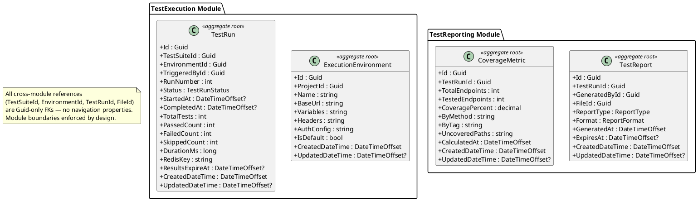

---

### A.4 — Subscription & Monetization Bounded Context

**Scope:** Core domain entities of the Subscription module — plans, user subscriptions, usage tracking, payment intents, transactions, and history.

**Aggregate boundaries:**
- `SubscriptionPlan` is referenced by `PlanLimit` (child), `UserSubscription`, `PaymentIntent`, `SubscriptionHistory`.
- `UserSubscription` is referenced by `PaymentIntent`, `PaymentTransaction`, `SubscriptionHistory`.
- `UsageTracking` and `OutboxMessage` are independent aggregates.

**Relationship decisions:**
- `PlanLimit --> SubscriptionPlan`: Directed association (navigation `Plan` exists).
- `UserSubscription --> SubscriptionPlan`: Directed association (navigation `Plan` exists).
- `PaymentIntent --> SubscriptionPlan` and `PaymentIntent --> UserSubscription`: Navigation properties exist.
- `PaymentTransaction --> PaymentIntent` and `PaymentTransaction --> UserSubscription`: Navigation properties exist.
- `SubscriptionHistory --> UserSubscription`, `SubscriptionHistory --> SubscriptionPlan` (OldPlan/NewPlan): Navigation properties exist.
- `UserId` is cross-module (Identity) — attribute only.

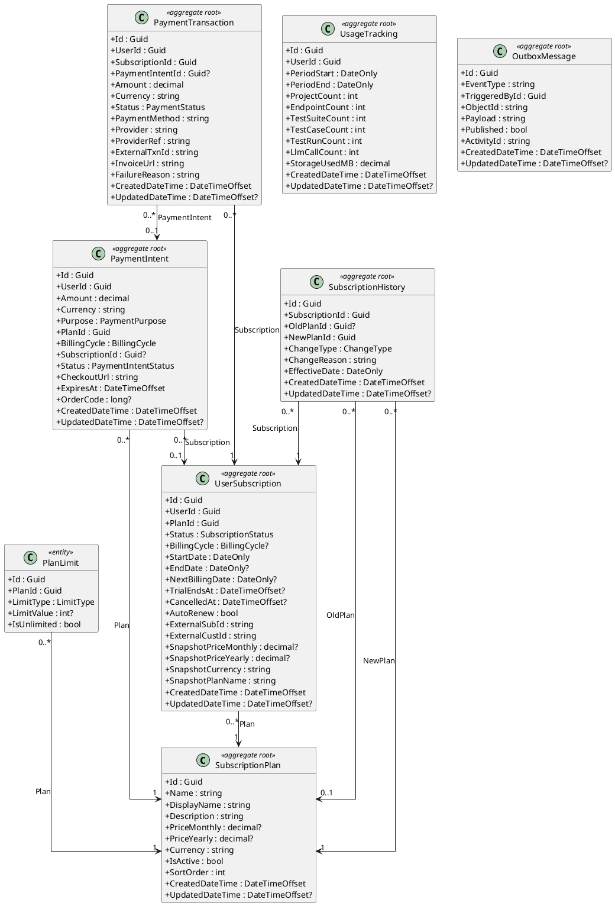

---

### A.5 — Identity Bounded Context (Domain Entities)

**Scope:** User aggregate with roles, claims, logins, tokens, and profile.

**Aggregate boundaries:**
- `User` is the aggregate root. Owns `UserProfile` (1:1), `UserRole`, `UserClaim`, `UserLogin`, `UserToken`.
- `Role` is a separate aggregate root. Owns `RoleClaim`.
- `UserRole` is the join entity between `User` and `Role`.

**Relationship decisions:**
- `User *-- UserProfile`: Composition (1:1, profile lifecycle bound to user).
- `User *-- UserRole/UserClaim/UserLogin/UserToken`: Composition (owned collections).
- `Role *-- UserRole/RoleClaim`: Composition (owned collections).
- `UserRole` serves as association class between `User` and `Role`.

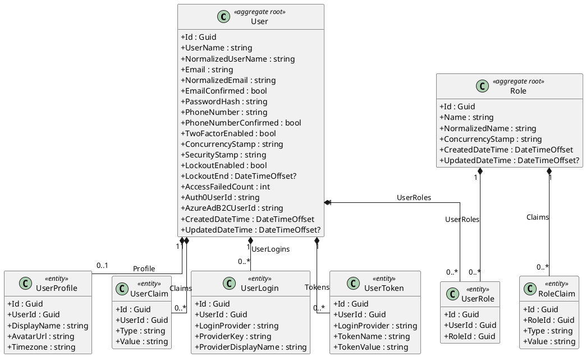

---

### A.6 — LLM Assistant Bounded Context

**Scope:** Core domain entities of the LlmAssistant module — LLM interaction logging and suggestion caching.

**Aggregate boundaries:**
- `LlmInteraction` and `LlmSuggestionCache` are independent aggregate roots (no navigation properties between them).
- `UserId` and `EndpointId` are cross-module Guid-only references (Identity, ApiDocumentation) — shown as attributes only.

**Relationship decisions:**
- No association lines — these are independent aggregates with no intra-module navigation properties.

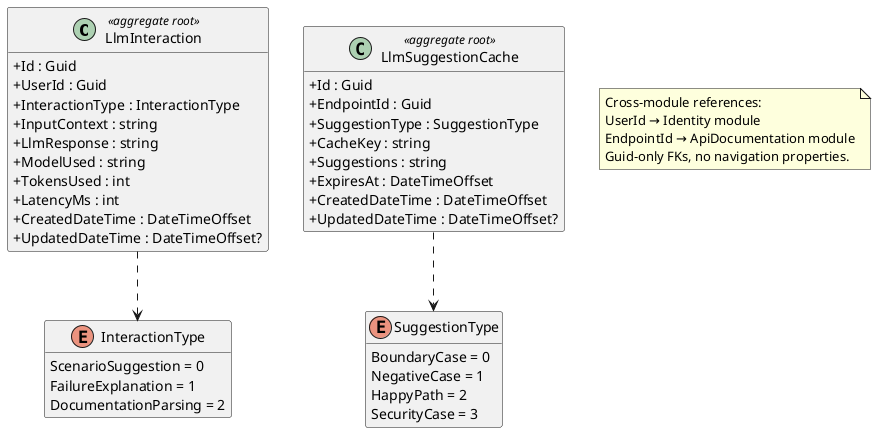

---

### A.7 — Notification Bounded Context

**Scope:** Core domain entities of the Notification module — email messages (with inheritance hierarchy and attachments) and SMS messages.

**Aggregate boundaries:**
- `EmailMessage` is an aggregate root extending `EmailMessageBase` (abstract). Owns `EmailMessageAttachment` (composition).
- `ArchivedEmailMessage` extends `EmailMessageBase` — archived copy with no attachments.
- `SmsMessage` and `ArchivedSmsMessage` extend `SmsMessageBase` (abstract) — independent aggregate roots.

**Relationship decisions:**
- `EmailMessageBase <|-- EmailMessage/ArchivedEmailMessage`: Inheritance.
- `SmsMessageBase <|-- SmsMessage/ArchivedSmsMessage`: Inheritance.
- `EmailMessage *-- EmailMessageAttachment`: Composition — attachments lifecycle-bound to message.
- `FileEntryId` cross-module reference (Storage) — attribute only.

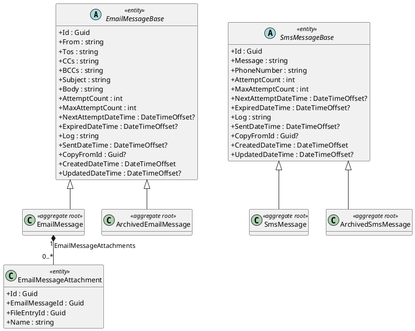

---

### A.8 — Storage Bounded Context

**Scope:** Core domain entities of the Storage module — file entry with soft-delete support and separate deleted file tracking.

**Aggregate boundaries:**
- `FileEntry` is the aggregate root. Independent entity with no owned children.
- `DeletedFileEntry` is a separate aggregate tracking file deletions.

**Relationship decisions:**
- No composition/aggregation lines — `DeletedFileEntry` references `FileEntry` by `FileEntryId` (Guid FK only, no navigation property).
- `OwnerId` is a cross-module reference (Identity) — attribute only.

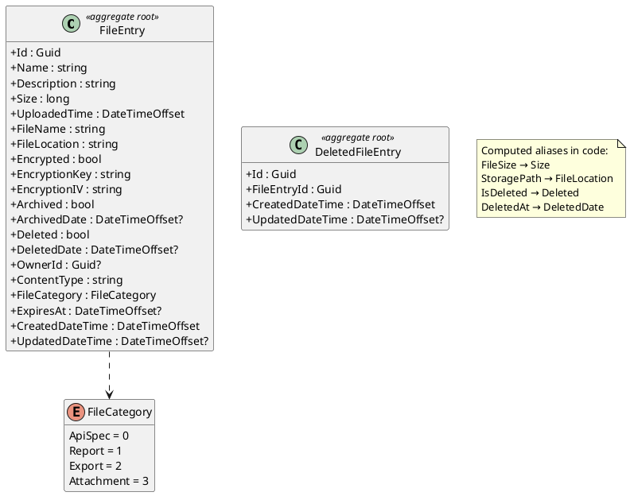

---

### A.9 — Configuration & AuditLog Bounded Context

**Scope:** Supporting domain entities for application configuration, localization, audit logging, and idempotency.

**Aggregate boundaries:**
- Each entity is an independent aggregate root — no navigation properties.

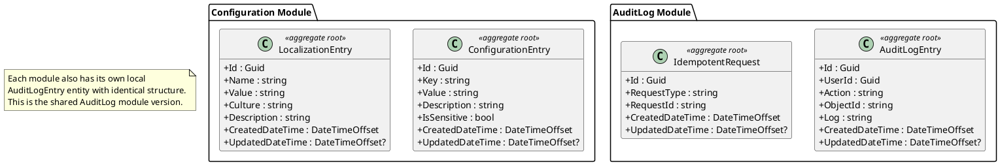

---

## B) APPLICATION / FEATURE CLASS DIAGRAMS

### B.1 — Feature: API Documentation Management

**Scope:** Command handlers, application services, and their dependencies for managing projects, specifications, and endpoints in the ApiDocumentation module.

**Design notes:**
- Handlers depend on commands (temporary usage → `..>` dependency).
- Handlers use repository interfaces and cross-module gateway interfaces (dependency).
- `IApiEndpointMetadataService` and `IPathParameterTemplateService` are domain services within this module.
- `ISubscriptionLimitGatewayService` and `IStorageFileGatewayService` are cross-module contract interfaces.
- Domain entities are not repeated here — see Domain Diagram A.1.

```plantuml
@startuml
skinparam classAttributeIconSize 0
skinparam linetype ortho
hide empty methods

package "Commands" {
  class AddUpdateProjectCommand <<command>>
  class UploadApiSpecificationCommand <<command>>
  class CreateManualSpecificationCommand <<command>>
  class AddUpdateEndpointCommand <<command>>
  class ActivateSpecificationCommand <<command>>
  class ImportCurlCommand <<command>>
  class ArchiveProjectCommand <<command>>
  class DeleteProjectCommand <<command>>
  class DeleteSpecificationCommand <<command>>
  class DeleteEndpointCommand <<command>>
}

package "Handlers" {
  class AddUpdateProjectCommandHandler <<handler>>
  class UploadApiSpecificationCommandHandler <<handler>>
  class CreateManualSpecificationCommandHandler <<handler>>
  class AddUpdateEndpointCommandHandler <<handler>>
  class ActivateSpecificationCommandHandler <<handler>>
  class ImportCurlCommandHandler <<handler>>
  class ArchiveProjectCommandHandler <<handler>>
  class DeleteProjectCommandHandler <<handler>>
  class DeleteSpecificationCommandHandler <<handler>>
  class DeleteEndpointCommandHandler <<handler>>
}

package "Domain Services" {
  interface IApiEndpointMetadataService <<domain service>>
  class ApiEndpointMetadataService <<domain service>>
  interface IPathParameterTemplateService <<domain service>>
  class PathParameterTemplateService <<domain service>>
}

package "Cross-Module Contracts" {
  interface ISubscriptionLimitGatewayService <<application service>>
  interface IStorageFileGatewayService <<application service>>
}

IApiEndpointMetadataService <|.. ApiEndpointMetadataService
IPathParameterTemplateService <|.. PathParameterTemplateService

AddUpdateProjectCommandHandler ..> AddUpdateProjectCommand : handles
AddUpdateProjectCommandHandler ..> ISubscriptionLimitGatewayService

UploadApiSpecificationCommandHandler ..> UploadApiSpecificationCommand : handles
UploadApiSpecificationCommandHandler ..> IStorageFileGatewayService
UploadApiSpecificationCommandHandler ..> ISubscriptionLimitGatewayService

CreateManualSpecificationCommandHandler ..> CreateManualSpecificationCommand : handles
CreateManualSpecificationCommandHandler ..> ISubscriptionLimitGatewayService
CreateManualSpecificationCommandHandler ..> IPathParameterTemplateService

AddUpdateEndpointCommandHandler ..> AddUpdateEndpointCommand : handles
AddUpdateEndpointCommandHandler ..> ISubscriptionLimitGatewayService
AddUpdateEndpointCommandHandler ..> IPathParameterTemplateService

ActivateSpecificationCommandHandler ..> ActivateSpecificationCommand : handles

ImportCurlCommandHandler ..> ImportCurlCommand : handles
ImportCurlCommandHandler ..> ISubscriptionLimitGatewayService
ImportCurlCommandHandler ..> IPathParameterTemplateService

ArchiveProjectCommandHandler ..> ArchiveProjectCommand : handles
DeleteProjectCommandHandler ..> DeleteProjectCommand : handles
DeleteSpecificationCommandHandler ..> DeleteSpecificationCommand : handles
DeleteEndpointCommandHandler ..> DeleteEndpointCommand : handles
@enduml
```

---

### B.2 — Feature: Test Lifecycle Orchestration

**Scope:** Command handlers and domain services for test suite scope management, test order proposal/approval/rejection/reorder workflow, and execution environment management.

**Design notes:**
- `IApiTestOrderService` is a domain service that orchestrates `IApiTestOrderAlgorithm` and `IApiEndpointMetadataService`.
- `IApiTestOrderGateService` is a domain service that gates execution on approved order status, using `IApiTestOrderService`.
- `ITestSuiteScopeService` and `IExecutionAuthConfigService` are domain services.
- Handlers use `..>` dependency to commands they handle and to services they consume.
- Domain entities are not repeated — see Domain Diagram A.2.

```plantuml
@startuml
skinparam classAttributeIconSize 0
skinparam linetype ortho
hide empty methods

package "Commands" {
  class AddUpdateTestSuiteScopeCommand <<command>>
  class ProposeApiTestOrderCommand <<command>>
  class ApproveApiTestOrderCommand <<command>>
  class RejectApiTestOrderCommand <<command>>
  class ReorderApiTestOrderCommand <<command>>
  class AddUpdateExecutionEnvironmentCommand <<command>>
  class ArchiveTestSuiteScopeCommand <<command>>
  class DeleteExecutionEnvironmentCommand <<command>>
}

package "Handlers" {
  class AddUpdateTestSuiteScopeCommandHandler <<handler>>
  class ProposeApiTestOrderCommandHandler <<handler>>
  class ApproveApiTestOrderCommandHandler <<handler>>
  class RejectApiTestOrderCommandHandler <<handler>>
  class ReorderApiTestOrderCommandHandler <<handler>>
  class AddUpdateExecutionEnvironmentCommandHandler <<handler>>
  class ArchiveTestSuiteScopeCommandHandler <<handler>>
  class DeleteExecutionEnvironmentCommandHandler <<handler>>
}

package "Domain Services" {
  interface IApiTestOrderService <<domain service>>
  class ApiTestOrderService <<domain service>>
  interface IApiTestOrderGateService <<domain service>>
  class ApiTestOrderGateService <<domain service>>
  interface ITestSuiteScopeService <<domain service>>
  class TestSuiteScopeService <<domain service>>
  interface IExecutionAuthConfigService <<domain service>>
  class ExecutionAuthConfigService <<domain service>>
  interface IApiEndpointMetadataService <<domain service>>
  interface IApiTestOrderAlgorithm <<domain service>>
  class ApiTestOrderAlgorithm <<domain service>>
}

IApiTestOrderService <|.. ApiTestOrderService
IApiTestOrderGateService <|.. ApiTestOrderGateService
ITestSuiteScopeService <|.. TestSuiteScopeService
IExecutionAuthConfigService <|.. ExecutionAuthConfigService
IApiTestOrderAlgorithm <|.. ApiTestOrderAlgorithm

ApiTestOrderService ..> IApiEndpointMetadataService
ApiTestOrderService ..> IApiTestOrderAlgorithm

ApiTestOrderGateService ..> IApiTestOrderService

class ApiTestOrderModelMapper <<application service>> {
  + {static} ToModel(proposal, orderService) : ApiTestOrderProposalModel
  + {static} ParseRowVersion(base64) : byte[]
}

AddUpdateTestSuiteScopeCommandHandler ..> AddUpdateTestSuiteScopeCommand : handles
AddUpdateTestSuiteScopeCommandHandler ..> ITestSuiteScopeService
AddUpdateTestSuiteScopeCommandHandler ..> IApiEndpointMetadataService

ProposeApiTestOrderCommandHandler ..> ProposeApiTestOrderCommand : handles
ProposeApiTestOrderCommandHandler ..> IApiTestOrderService
ProposeApiTestOrderCommandHandler ..> ApiTestOrderModelMapper

ApproveApiTestOrderCommandHandler ..> ApproveApiTestOrderCommand : handles
ApproveApiTestOrderCommandHandler ..> IApiTestOrderService
ApproveApiTestOrderCommandHandler ..> ApiTestOrderModelMapper

RejectApiTestOrderCommandHandler ..> RejectApiTestOrderCommand : handles
RejectApiTestOrderCommandHandler ..> IApiTestOrderService
RejectApiTestOrderCommandHandler ..> ApiTestOrderModelMapper

ReorderApiTestOrderCommandHandler ..> ReorderApiTestOrderCommand : handles
ReorderApiTestOrderCommandHandler ..> IApiTestOrderService
ReorderApiTestOrderCommandHandler ..> ApiTestOrderModelMapper

AddUpdateExecutionEnvironmentCommandHandler ..> AddUpdateExecutionEnvironmentCommand : handles
AddUpdateExecutionEnvironmentCommandHandler ..> IExecutionAuthConfigService

ArchiveTestSuiteScopeCommandHandler ..> ArchiveTestSuiteScopeCommand : handles

DeleteExecutionEnvironmentCommandHandler ..> DeleteExecutionEnvironmentCommand : handles
@enduml
```

---

### B.3 — Feature: Subscription & Payment Management

**Scope:** Command handlers, services, and outbox factory for subscription management, plan CRUD, limit consumption, usage tracking, payment creation, webhook handling, reconciliation, and cancellation.

**Design notes:**
- `SubscriptionLimitGatewayService` uses `Dispatcher` internally to dispatch `ConsumeLimitAtomicallyCommand` and `UpsertUsageTrackingCommand` — shown as dependency.
- `OutboxMessageFactory` is a static factory — dependency from handler.
- `IPayOsService` is an infrastructure service wrapping the PayOS payment provider.
- Domain entities are not repeated — see Domain Diagram A.4.

```plantuml
@startuml
skinparam classAttributeIconSize 0
skinparam linetype ortho
hide empty methods

package "Commands" {
  class ConsumeLimitAtomicallyCommand <<command>>
  class UpsertUsageTrackingCommand <<command>>
  class CreateSubscriptionPaymentCommand <<command>>
  class HandlePayOsWebhookCommand <<command>>
  class ReconcilePayOsCheckoutsCommand <<command>>
  class AddUpdatePlanCommand <<command>>
  class DeletePlanCommand <<command>>
  class AddUpdateSubscriptionCommand <<command>>
  class CancelSubscriptionCommand <<command>>
  class AddPaymentTransactionCommand <<command>>
  class CreatePayOsCheckoutCommand <<command>>
  class SyncPaymentFromPayOsCommand <<command>>
  class PublishEventsCommand <<command>>
}

package "Handlers" {
  class ConsumeLimitAtomicallyCommandHandler <<handler>>
  class UpsertUsageTrackingCommandHandler <<handler>>
  class CreateSubscriptionPaymentCommandHandler <<handler>>
  class HandlePayOsWebhookCommandHandler <<handler>>
  class ReconcilePayOsCheckoutsCommandHandler <<handler>>
  class AddUpdatePlanCommandHandler <<handler>>
  class DeletePlanCommandHandler <<handler>>
  class AddUpdateSubscriptionCommandHandler <<handler>>
  class CancelSubscriptionCommandHandler <<handler>>
  class AddPaymentTransactionCommandHandler <<handler>>
  class CreatePayOsCheckoutCommandHandler <<handler>>
  class SyncPaymentFromPayOsCommandHandler <<handler>>
  class PublishEventsCommandHandler <<handler>>
}

package "Services" {
  interface ISubscriptionLimitGatewayService <<application service>>
  class SubscriptionLimitGatewayService <<application service>>
  interface IPayOsService <<interface>>
  class PayOsService <<application service>>
}

class OutboxMessageFactory <<factory>> {
  + {static} Create<TPayload>(...) : OutboxMessage
}

ISubscriptionLimitGatewayService <|.. SubscriptionLimitGatewayService
IPayOsService <|.. PayOsService

SubscriptionLimitGatewayService ..> ConsumeLimitAtomicallyCommand : dispatches
SubscriptionLimitGatewayService ..> UpsertUsageTrackingCommand : dispatches

ConsumeLimitAtomicallyCommandHandler ..> ConsumeLimitAtomicallyCommand : handles
UpsertUsageTrackingCommandHandler ..> UpsertUsageTrackingCommand : handles
CreateSubscriptionPaymentCommandHandler ..> CreateSubscriptionPaymentCommand : handles
HandlePayOsWebhookCommandHandler ..> HandlePayOsWebhookCommand : handles
HandlePayOsWebhookCommandHandler ..> IPayOsService

ReconcilePayOsCheckoutsCommandHandler ..> ReconcilePayOsCheckoutsCommand : handles
ReconcilePayOsCheckoutsCommandHandler ..> IPayOsService
ReconcilePayOsCheckoutsCommandHandler ..> OutboxMessageFactory

AddUpdatePlanCommandHandler ..> AddUpdatePlanCommand : handles
DeletePlanCommandHandler ..> DeletePlanCommand : handles
AddUpdateSubscriptionCommandHandler ..> AddUpdateSubscriptionCommand : handles
CancelSubscriptionCommandHandler ..> CancelSubscriptionCommand : handles
AddPaymentTransactionCommandHandler ..> AddPaymentTransactionCommand : handles
CreatePayOsCheckoutCommandHandler ..> CreatePayOsCheckoutCommand : handles
CreatePayOsCheckoutCommandHandler ..> IPayOsService
SyncPaymentFromPayOsCommandHandler ..> SyncPaymentFromPayOsCommand : handles
SyncPaymentFromPayOsCommandHandler ..> IPayOsService
PublishEventsCommandHandler ..> PublishEventsCommand : handles
@enduml
```

---

### B.4 — Feature: Identity & Access Management

**Scope:** User service abstraction, current user abstraction, identity provider strategy, and user synchronization command.

**Design notes:**
- `ICurrentUser` is a cross-module contract interface with two implementations: `CurrentWebUser` (authenticated context) and `AnonymousUser`.
- `IIdentityProvider` is a strategy interface — see Pattern Diagram C.1 for detailed strategy analysis.
- `SyncUsersCommandHandler` depends on the provider implementations for user synchronization.
- Domain entities are not repeated — see Domain Diagram A.5.

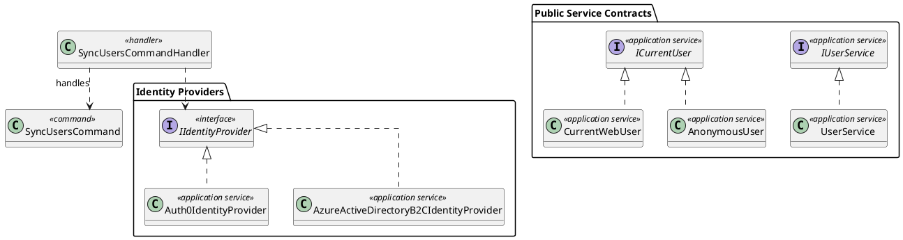

---

## C) PATTERN CLASS DIAGRAMS

### C.1 — Strategy Pattern: External Identity Providers

**Scope:** The `IIdentityProvider` interface defines a strategy for external identity provider operations (CRUD users). Two concrete implementations exist: `Auth0IdentityProvider` and `AzureActiveDirectoryB2CIdentityProvider`. The `SyncUsersCommandHandler` selects and uses the appropriate provider at runtime.

**UML justification:**
- `IIdentityProvider <|.. Concrete`: Interface realization — the concrete classes implement the strategy interface.
- `SyncUsersCommandHandler ..> IIdentityProvider`: Dependency — the handler receives the provider via injection and invokes it during command execution (temporary usage, not structural ownership).

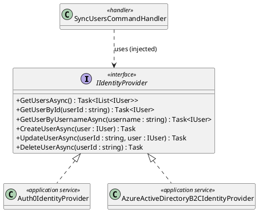

---

### C.2 — Strategy Pattern: API Test Order Algorithm Pipeline

**Scope:** The test ordering pipeline uses a strategy pattern where `IApiTestOrderAlgorithm` defines the interchangeable ordering algorithm. `ApiTestOrderAlgorithm` is the concrete implementation that composes `ISchemaRelationshipAnalyzer` (for schema dependency analysis), `IDependencyAwareTopologicalSorter` (for topological ordering), and `ISemanticTokenMatcher` (for fuzzy name matching). `IObservationConfirmationPromptBuilder` generates LLM-ready prompts from the ordered sequence. `ApiTestOrderService` orchestrates the full pipeline.

**UML justification:**
- `ApiTestOrderAlgorithm` holds references to analyzer, sorter, and semantic matcher via constructor injection — these are structural dependencies (associations), not temporary usage dependency.
- `ApiTestOrderService ..> IApiEndpointMetadataService`: Dependency — fetches metadata during proposal building.
- `ApiTestOrderService --> IApiTestOrderAlgorithm`: Directed association — injected and retained as field.
- `IObservationConfirmationPromptBuilder` is an independent service consumed downstream for LLM prompt preparation.

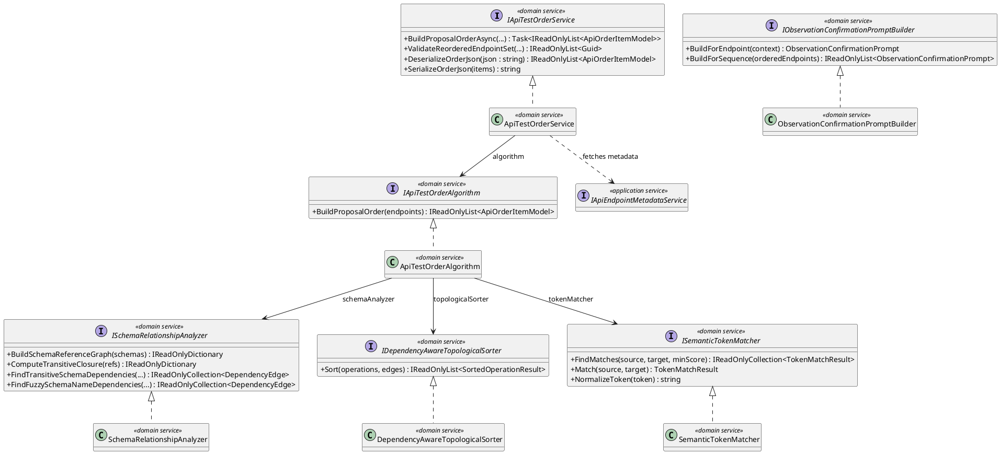

---

### C.3 — Factory Pattern: Subscription Outbox Message Creation

**Scope:** `OutboxMessageFactory` is a static factory responsible for creating `OutboxMessage` instances with proper serialization of typed event payloads. Used by `ReconcilePayOsCheckoutsCommandHandler` during payment reconciliation.

**UML justification:**
- `OutboxMessageFactory ..> OutboxMessage`: Dependency — the factory creates (but does not own) outbox messages.
- `SubscriptionOutboxEventBase <|-- Concrete`: Inheritance — concrete event types extend the abstract base.
- `ReconcilePayOsCheckoutsCommandHandler ..> OutboxMessageFactory`: Dependency — handler calls static factory method during execution.

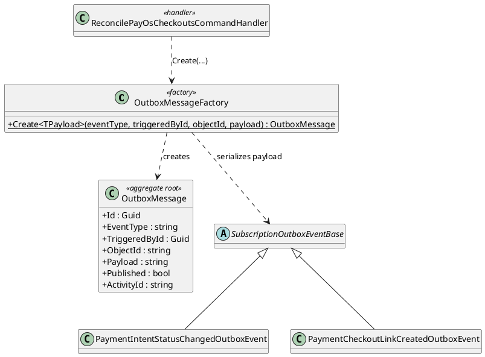

---

### C.4 — Observer Pattern: Domain Events and Handlers

**Scope:** The domain event system uses `IDomainEvent` as the event marker interface with generic event types (`EntityCreatedEvent<T>`, `EntityUpdatedEvent<T>`, `EntityDeletedEvent<T>`). `IDomainEventHandler<T>` defines the handler contract. `Dispatcher` serves as the event publisher that resolves and invokes handlers.

**UML justification:**
- `IDomainEvent <|.. EntityCreatedEvent<T>` etc.: Interface realization — events implement the marker.
- `IDomainEventHandler<T> <|.. ConcreteHandler`: Interface realization — handlers implement the generic handler contract.
- `Dispatcher ..> IDomainEvent` and `Dispatcher ..> IDomainEventHandler<T>`: Dependencies — Dispatcher resolves handlers from DI container and dispatches events (temporary usage during dispatch cycle).

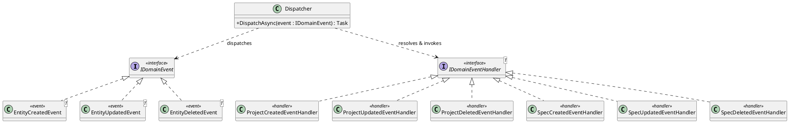

---

### C.5 — Decorator Pattern: Command and Query Handler Pipeline

**Scope:** The CQRS handler pipeline uses decorators for cross-cutting concerns. `AuditLogCommandDecorator<T>` and `DatabaseRetryCommandDecorator<T>` wrap `ICommandHandler<T>` implementations. Query-side mirrors this with `AuditLogQueryDecorator` and `DatabaseRetryQueryDecorator`. `HandlerFactory` reads `MappingAttribute` to compose the decorator chain.

**UML justification:**
- Decorators implement `ICommandHandler<T>` / `IQueryHandler<TQuery,TResult>` (interface realization) AND hold an association to the same interface (the wrapped inner handler). This is the canonical Decorator pattern: implement + hold reference to same type.
- `DatabaseRetryDecoratorBase <|-- DatabaseRetryCommandDecorator<T>`: Inheritance — shared retry logic base.
- `HandlerFactory ..> MappingAttribute`: Dependency — reads metadata attributes.
- `HandlerFactory ..> Decorators`: Dependency — creates and composes decorator pipeline.

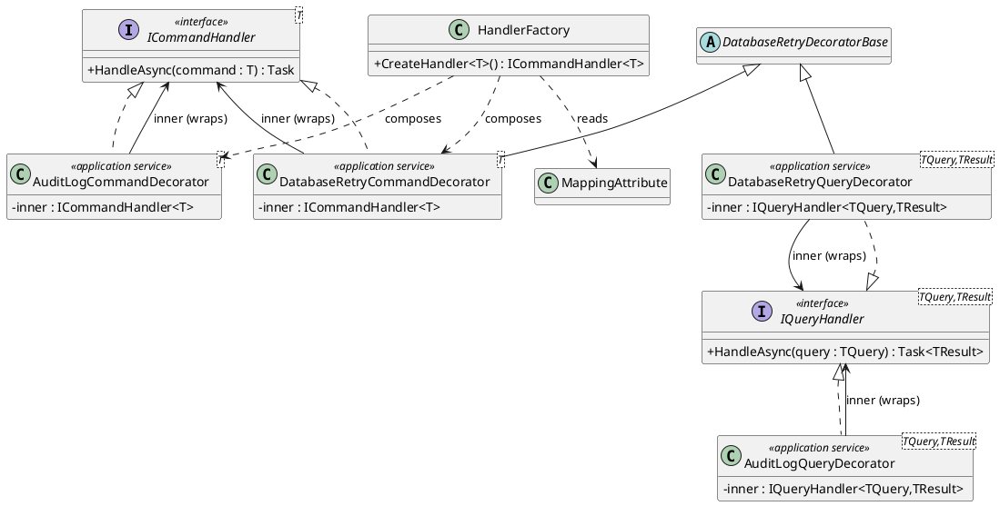

---

## D) PLANNED FEATURE CLASS DIAGRAMS (Remaining FEs)

> The following diagrams represent classes that are designed for upcoming features. Stereotypes marked `<<planned>>` indicate classes not yet implemented. Entity structures from Domain Diagrams (Section A) are reused — not repeated here.

### D.1 — Feature: Happy-Path Test Case Generation (FE-05B)

**Scope:** Auto-generate happy-path test cases from an approved API order. Requires the order gate to be in `Approved` status before generation proceeds. Generates `TestCase`, `TestCaseRequest`, `TestCaseExpectation` for each ordered endpoint.

**Design notes:**
- `IApiTestOrderGateService` enforces the pre-condition that an approved order exists (already implemented).
- `IHappyPathTestCaseGenerator` is the core planned service — takes ordered endpoints + metadata and produces test cases.
- `ITestCaseRequestBuilder` builds `TestCaseRequest` from endpoint metadata (URL, method, path params, sample body).
- `ITestCaseExpectationBuilder` builds `TestCaseExpectation` from response schemas (expected status, schema checks).
- Handler dispatches `GenerateHappyPathTestCasesCommand` which orchestrates the full pipeline.
- Domain entities (TestCase, TestCaseRequest, TestCaseExpectation) are already defined — see A.2.

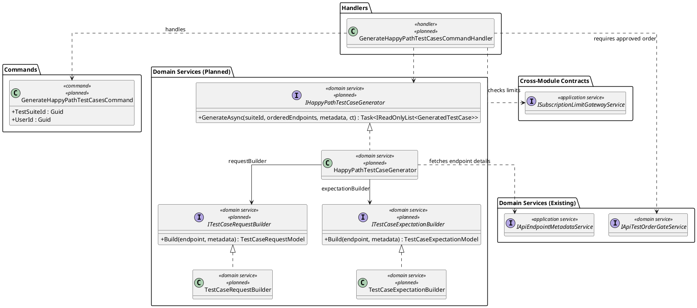

---

### D.2 — Feature: Boundary & Negative Test Case Generation (FE-06)

**Scope:** Extend test generation with rule-based mutations (path params, body params) and LLM-suggested boundary/negative/security scenarios. Builds on FE-05B's happy-path cases.

**Design notes:**
- `IBodyMutationEngine` applies rule-based mutations to request bodies (empty, null, invalid types, overflow, SQL injection, XSS, etc.). Analogous to path-param mutations from FE-12 but for JSON body fields.
- `ILlmScenarioSuggester` calls LLM API with `ObservationConfirmationPromptBuilder`-generated prompts to get boundary/negative test suggestions. Uses `LlmInteraction` entity for logging.
- `IBoundaryNegativeTestCaseGenerator` orchestrates mutations + LLM suggestions into new `TestCase` entities.
- Path mutations already exist via `IPathParameterTemplateService` (FE-12).

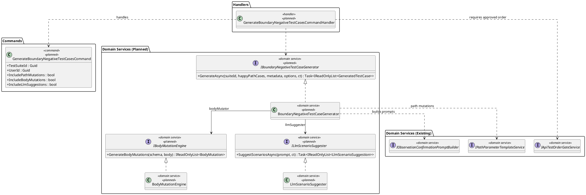

---

### D.3 — Feature: Test Execution Engine (FE-07 + FE-08)

**Scope:** Dependency-aware test execution with HTTP client execution, variable extraction/chaining, and deterministic rule-based validation (status code, schema, headers, body assertions, response time).

**Design notes:**
- `ITestExecutionOrchestrator` is the top-level service: loads test suite with approved order, resolves environment config, executes tests in dependency order.
- `IHttpTestExecutor` sends actual HTTP requests and captures raw responses. Uses `ExecutionEnvironment` auth config.
- `IVariableExtractor` extracts variables from responses (JSONPath, header, regex) per `TestCaseVariable` definitions.
- `IVariableResolver` resolves `{{variable}}` placeholders in subsequent requests before execution.
- `IRuleBasedValidator` performs deterministic pass/fail checks against `TestCaseExpectation`: status code, response schema, header assertions, body contains/not-contains, JSONPath checks, max response time.
- `ITestResultCollector` aggregates individual test results, updates `TestRun` counters (passed/failed/skipped/duration).
- Execution results are stored transiently in Redis (via `RedisKey` on `TestRun`), with `ResultsExpireAt` TTL.

```plantuml
@startuml
skinparam classAttributeIconSize 0
skinparam linetype ortho
hide empty methods

package "Commands" {
  class StartTestRunCommand <<command>> <<planned>> {
    + TestSuiteId : Guid
    + EnvironmentId : Guid
    + TriggeredById : Guid
  }
}

package "Handlers" {
  class StartTestRunCommandHandler <<handler>> <<planned>>
}

package "Services (Planned)" {
  interface ITestExecutionOrchestrator <<domain service>> <<planned>> {
    + ExecuteAsync(testRunId, ct) : Task<TestRunResult>
  }
  class TestExecutionOrchestrator <<domain service>> <<planned>>

  interface IHttpTestExecutor <<domain service>> <<planned>> {
    + ExecuteAsync(request, environment, variables, ct) : Task<HttpTestResponse>
  }
  class HttpTestExecutor <<domain service>> <<planned>>

  interface IVariableExtractor <<domain service>> <<planned>> {
    + Extract(response, variables) : IReadOnlyDictionary<string, string>
  }
  class VariableExtractor <<domain service>> <<planned>>

  interface IVariableResolver <<domain service>> <<planned>> {
    + Resolve(request, currentVariables) : ResolvedTestCaseRequest
  }
  class VariableResolver <<domain service>> <<planned>>

  interface IRuleBasedValidator <<domain service>> <<planned>> {
    + Validate(response, expectation) : TestCaseValidationResult
  }
  class RuleBasedValidator <<domain service>> <<planned>>

  interface ITestResultCollector <<domain service>> <<planned>> {
    + CollectAsync(testRunId, results, ct) : Task
  }
  class TestResultCollector <<domain service>> <<planned>>
}

package "Services (Existing)" {
  interface IApiTestOrderGateService <<domain service>>
  interface IExecutionAuthConfigService <<domain service>>
}

ITestExecutionOrchestrator <|.. TestExecutionOrchestrator
IHttpTestExecutor <|.. HttpTestExecutor
IVariableExtractor <|.. VariableExtractor
IVariableResolver <|.. VariableResolver
IRuleBasedValidator <|.. RuleBasedValidator
ITestResultCollector <|.. TestResultCollector

StartTestRunCommandHandler ..> StartTestRunCommand : handles
StartTestRunCommandHandler ..> ITestExecutionOrchestrator

TestExecutionOrchestrator ..> IApiTestOrderGateService : loads approved order
TestExecutionOrchestrator --> IHttpTestExecutor : executor
TestExecutionOrchestrator --> IVariableExtractor : extractor
TestExecutionOrchestrator --> IVariableResolver : resolver
TestExecutionOrchestrator --> IRuleBasedValidator : validator
TestExecutionOrchestrator --> ITestResultCollector : collector
TestExecutionOrchestrator ..> IExecutionAuthConfigService : resolves auth
@enduml
```

---

### D.4 — Feature: LLM Failure Explanations (FE-09)

**Scope:** When a test case fails validation (FE-08), the user can request an LLM-generated explanation of why it failed. Uses `LlmInteraction` entity for tracking and `LlmSuggestionCache` for caching repeated failures.

**Design notes:**
- `ILlmFailureExplainer` takes a failed test result + endpoint context and produces a human-readable explanation.
- `ILlmClient` is the generic LLM API client wrapper (e.g., OpenAI, Azure OpenAI) — infrastructure service.
- Results are cached in `LlmSuggestionCache` with TTL to avoid repeated LLM calls for same failure pattern.
- Each LLM call creates an `LlmInteraction` record for auditing and usage tracking.

```plantuml
@startuml
skinparam classAttributeIconSize 0
skinparam linetype ortho
hide empty methods

package "Commands" {
  class ExplainTestFailureCommand <<command>> <<planned>> {
    + TestRunId : Guid
    + TestCaseId : Guid
    + UserId : Guid
  }
}

package "Handlers" {
  class ExplainTestFailureCommandHandler <<handler>> <<planned>>
}

package "Services (Planned)" {
  interface ILlmFailureExplainer <<domain service>> <<planned>> {
    + ExplainAsync(failedResult, endpointContext, ct) : Task<FailureExplanation>
  }
  class LlmFailureExplainer <<domain service>> <<planned>>

  interface ILlmClient <<interface>> <<planned>> {
    + CompleteAsync(prompt, systemPrompt, model, ct) : Task<LlmCompletionResult>
  }
  class OpenAiLlmClient <<application service>> <<planned>>
}

package "Domain Entities (Existing — see A.6)" {
  class LlmInteraction <<aggregate root>>
  class LlmSuggestionCache <<aggregate root>>
}

ILlmFailureExplainer <|.. LlmFailureExplainer
ILlmClient <|.. OpenAiLlmClient

ExplainTestFailureCommandHandler ..> ExplainTestFailureCommand : handles
ExplainTestFailureCommandHandler ..> ILlmFailureExplainer

LlmFailureExplainer --> ILlmClient : llmClient
LlmFailureExplainer ..> LlmInteraction : creates interaction record
LlmFailureExplainer ..> LlmSuggestionCache : checks/stores cache
@enduml
```

---

### D.5 — Feature: Test Reporting & Export (FE-10)

**Scope:** Generate test execution reports in multiple formats (PDF, CSV, JSON, HTML) and compute API coverage metrics. Uses `TestReport` and `CoverageMetric` entities. Exports stored as files via Storage module.

**Design notes:**
- `ITestReportGenerator` orchestrates report generation: loads test run results, computes coverage, renders to specified format.
- `ICoverageCalculator` computes endpoint coverage percentage, by-method breakdown, by-tag breakdown, and uncovered paths.
- `IReportRenderer` is a strategy interface with format-specific implementations.
- Generated file is uploaded via `IStorageFileGatewayService` and linked to `TestReport.FileId`.

```plantuml
@startuml
skinparam classAttributeIconSize 0
skinparam linetype ortho
hide empty methods

package "Commands" {
  class GenerateTestReportCommand <<command>> <<planned>> {
    + TestRunId : Guid
    + ReportType : ReportType
    + Format : ReportFormat
    + GeneratedById : Guid
  }
}

package "Handlers" {
  class GenerateTestReportCommandHandler <<handler>> <<planned>>
}

package "Services (Planned)" {
  interface ITestReportGenerator <<domain service>> <<planned>> {
    + GenerateAsync(testRunId, reportType, format, ct) : Task<Guid>
  }
  class TestReportGenerator <<domain service>> <<planned>>

  interface ICoverageCalculator <<domain service>> <<planned>> {
    + CalculateAsync(testRunId, ct) : Task<CoverageMetricResult>
  }
  class CoverageCalculator <<domain service>> <<planned>>

  interface IReportRenderer <<interface>> <<planned>> {
    + RenderAsync(data, format, ct) : Task<Stream>
  }
  class PdfReportRenderer <<application service>> <<planned>>
  class CsvReportRenderer <<application service>> <<planned>>
  class JsonReportRenderer <<application service>> <<planned>>
  class HtmlReportRenderer <<application service>> <<planned>>
}

package "Cross-Module Contracts" {
  interface IStorageFileGatewayService <<application service>>
}

ITestReportGenerator <|.. TestReportGenerator
ICoverageCalculator <|.. CoverageCalculator
IReportRenderer <|.. PdfReportRenderer
IReportRenderer <|.. CsvReportRenderer
IReportRenderer <|.. JsonReportRenderer
IReportRenderer <|.. HtmlReportRenderer

GenerateTestReportCommandHandler ..> GenerateTestReportCommand : handles
GenerateTestReportCommandHandler ..> ITestReportGenerator

TestReportGenerator --> ICoverageCalculator : coverageCalc
TestReportGenerator --> IReportRenderer : renderer (strategy)
TestReportGenerator ..> IStorageFileGatewayService : uploads report file
@enduml
```

---

### D.6 — Feature: LLM Suggestion Review Pipeline (FE-15 / FE-16 / FE-17)

**Scope:** User review interface for LLM-generated test case suggestions. Users can preview, approve, reject, modify individual suggestions, provide feedback, and perform bulk operations with filtering.

**Design notes:**
- `LlmSuggestion` is a planned entity representing a pending LLM suggestion awaiting user review.
- `ILlmSuggestionReviewService` manages the review lifecycle (preview → approve/reject/modify).
- `IUserFeedbackService` captures user feedback on suggestion quality for future LLM fine-tuning.
- Bulk operations use `BulkReviewLlmSuggestionsCommand` with filtering criteria.
- Approved suggestions are materialized into actual `TestCase` entities via existing test case creation pipeline.

```plantuml
@startuml
skinparam classAttributeIconSize 0
skinparam linetype ortho
hide empty methods

package "Planned Entities" {
  class LlmSuggestion <<entity>> <<planned>> {
    + Id : Guid
    + TestSuiteId : Guid
    + EndpointId : Guid?
    + SuggestionType : SuggestionType
    + TestType : TestType
    + SuggestedName : string
    + SuggestedDescription : string
    + SuggestedRequest : string
    + SuggestedExpectation : string
    + Confidence : double
    + ReviewStatus : ReviewStatus
    + ReviewedById : Guid?
    + ReviewedAt : DateTimeOffset?
    + ReviewNotes : string
    + ModifiedContent : string
    + LlmInteractionId : Guid
    + CreatedDateTime : DateTimeOffset
    + UpdatedDateTime : DateTimeOffset?
  }

  class UserFeedback <<entity>> <<planned>> {
    + Id : Guid
    + SuggestionId : Guid
    + UserId : Guid
    + Rating : int
    + Comment : string
    + CreatedDateTime : DateTimeOffset
  }
}

package "Commands (Planned)" {
  class ReviewLlmSuggestionCommand <<command>> <<planned>> {
    + SuggestionId : Guid
    + Action : ReviewAction
    + ModifiedContent : string
    + ReviewNotes : string
    + UserId : Guid
  }

  class BulkReviewLlmSuggestionsCommand <<command>> <<planned>> {
    + TestSuiteId : Guid
    + Action : ReviewAction
    + FilterByType : SuggestionType?
    + FilterByConfidence : double?
    + UserId : Guid
  }

  class SubmitSuggestionFeedbackCommand <<command>> <<planned>> {
    + SuggestionId : Guid
    + UserId : Guid
    + Rating : int
    + Comment : string
  }
}

package "Handlers (Planned)" {
  class ReviewLlmSuggestionCommandHandler <<handler>> <<planned>>
  class BulkReviewLlmSuggestionsCommandHandler <<handler>> <<planned>>
  class SubmitSuggestionFeedbackCommandHandler <<handler>> <<planned>>
}

package "Services (Planned)" {
  interface ILlmSuggestionReviewService <<domain service>> <<planned>> {
    + ApproveAsync(suggestion, userId, ct) : Task
    + RejectAsync(suggestion, userId, notes, ct) : Task
    + ModifyAndApproveAsync(suggestion, modified, userId, ct) : Task
    + MaterializeApprovedAsync(suiteId, ct) : Task<int>
  }
  class LlmSuggestionReviewService <<domain service>> <<planned>>

  interface IUserFeedbackService <<domain service>> <<planned>> {
    + SubmitFeedbackAsync(suggestionId, userId, rating, comment, ct) : Task
  }
  class UserFeedbackService <<domain service>> <<planned>>
}

ILlmSuggestionReviewService <|.. LlmSuggestionReviewService
IUserFeedbackService <|.. UserFeedbackService

ReviewLlmSuggestionCommandHandler ..> ReviewLlmSuggestionCommand : handles
ReviewLlmSuggestionCommandHandler ..> ILlmSuggestionReviewService

BulkReviewLlmSuggestionsCommandHandler ..> BulkReviewLlmSuggestionsCommand : handles
BulkReviewLlmSuggestionsCommandHandler ..> ILlmSuggestionReviewService

SubmitSuggestionFeedbackCommandHandler ..> SubmitSuggestionFeedbackCommand : handles
SubmitSuggestionFeedbackCommandHandler ..> IUserFeedbackService

LlmSuggestion "1" *-- "0..*" UserFeedback : Feedbacks

note "ReviewStatus enum (planned):\nPending, Approved, Rejected,\nModifiedAndApproved, Expired" as N_Review
@enduml
```

---

### D.7 — Feature: Data-Set Driven Parameterized Execution (FE-05B Extension)

**Scope:** Extend happy-path test cases with data-set parameterization. Each `TestCase` can have multiple `TestDataSet` rows; the execution engine iterates over them, substituting placeholders in request URL/headers/body. This transforms a single logical test case into N concrete executions.

**Design notes:**
- `ITestDataSetResolver` takes a `TestCase` + its `TestDataSet` collection and produces expanded request permutations.
- `IDataSetPlaceholderEngine` handles `{{dataset.fieldName}}` substitutions in URL, headers, body, and query params.
- Integrates with the execution orchestrator (D.3) — `TestExecutionOrchestrator` calls `ITestDataSetResolver` before sending each request via `IHttpTestExecutor`.
- Domain entities already defined: `TestDataSet` (A.2), `TestCaseRequest` (A.2).

```plantuml
@startuml
skinparam classAttributeIconSize 0
skinparam linetype ortho
hide empty methods

package "Commands" {
  class ManageTestDataSetsCommand <<command>> <<planned>> {
    + TestCaseId : Guid
    + DataSets : List<TestDataSetDto>
    + UserId : Guid
  }
}

package "Handlers" {
  class ManageTestDataSetsCommandHandler <<handler>> <<planned>>
}

package "Services (Planned)" {
  interface ITestDataSetResolver <<domain service>> <<planned>> {
    + ExpandAsync(testCase, dataSets, ct) : Task<IReadOnlyList<ExpandedTestCaseRequest>>
  }
  class TestDataSetResolver <<domain service>> <<planned>>

  interface IDataSetPlaceholderEngine <<domain service>> <<planned>> {
    + Resolve(template, dataRow) : string
    + FindPlaceholders(template) : IReadOnlyList<string>
    + ValidateDataSetSchema(placeholders, dataSet) : ValidationResult
  }
  class DataSetPlaceholderEngine <<domain service>> <<planned>>
}

ITestDataSetResolver <|.. TestDataSetResolver
IDataSetPlaceholderEngine <|.. DataSetPlaceholderEngine

ManageTestDataSetsCommandHandler ..> ManageTestDataSetsCommand : handles
TestDataSetResolver --> IDataSetPlaceholderEngine : placeholderEngine
@enduml
```

---

### D.8 — Feature: Real-Time Test Execution Monitoring (FE-07 Extension)

**Scope:** Provide live test execution progress via SignalR WebSocket. The execution orchestrator publishes per-test-case status updates (running, passed, failed, skipped) to subscribed clients. Redis pub/sub is used for cross-instance fan-out.

**Design notes:**
- `ITestExecutionHub` is a SignalR hub interface — clients subscribe to a `TestRunId` channel.
- `ITestProgressPublisher` is called by `TestExecutionOrchestrator` after each test case completes to push updates.
- `TestProgressMessage` DTO carries: `TestRunId`, `TestCaseId`, `Status`, `DurationMs`, `ErrorSummary`, `ProgressPercent`.
- Redis pub/sub channel `testrun:{id}:progress` for multi-instance fan-out.
- No new domain entities — purely infrastructure/application layer.

```plantuml
@startuml
skinparam classAttributeIconSize 0
skinparam linetype ortho
hide empty methods

package "SignalR Hub (Planned)" {
  interface ITestExecutionHubClient <<interface>> <<planned>> {
    + ReceiveTestProgress(message : TestProgressMessage) : Task
    + ReceiveTestRunCompleted(summary : TestRunSummaryMessage) : Task
  }
  class TestExecutionHub <<application service>> <<planned>>
}

package "Services (Planned)" {
  interface ITestProgressPublisher <<application service>> <<planned>> {
    + PublishProgressAsync(testRunId, testCaseId, status, durationMs, error, ct) : Task
    + PublishCompletedAsync(testRunId, summary, ct) : Task
  }
  class SignalRTestProgressPublisher <<application service>> <<planned>>

  interface ITestRunSubscriptionManager <<application service>> <<planned>> {
    + SubscribeAsync(connectionId, testRunId, ct) : Task
    + UnsubscribeAsync(connectionId, testRunId, ct) : Task
  }
  class RedisTestRunSubscriptionManager <<application service>> <<planned>>
}

package "DTOs (Planned)" {
  class TestProgressMessage <<dto>> <<planned>> {
    + TestRunId : Guid
    + TestCaseId : Guid
    + TestCaseName : string
    + Status : TestCaseExecutionStatus
    + DurationMs : long
    + ErrorSummary : string
    + ProgressPercent : double
    + CompletedCount : int
    + TotalCount : int
  }

  class TestRunSummaryMessage <<dto>> <<planned>> {
    + TestRunId : Guid
    + FinalStatus : TestRunStatus
    + TotalDurationMs : long
    + PassedCount : int
    + FailedCount : int
    + SkippedCount : int
  }
}

ITestProgressPublisher <|.. SignalRTestProgressPublisher
ITestRunSubscriptionManager <|.. RedisTestRunSubscriptionManager

TestExecutionHub ..> ITestRunSubscriptionManager
SignalRTestProgressPublisher ..> ITestExecutionHubClient : pushes to clients

note "Integration with D.3:\nTestExecutionOrchestrator calls\nITestProgressPublisher after each\ntest case execution completes." as N_Hub
@enduml
```

---

### D.9 — Feature: CI/CD Webhook Integration (Post-FE-10)

**Scope:** Expose webhook endpoints for external CI/CD systems (GitHub Actions, GitLab CI, Jenkins) to trigger test runs and receive results. Provides programmatic API for automated regression testing in deployment pipelines.

**Design notes:**
- `IWebhookTriggerService` validates incoming webhook payloads (HMAC signature verification) and dispatches `StartTestRunCommand`.
- `IWebhookResultNotifier` calls back registered webhook URLs with test run results upon completion.
- `WebhookRegistration` is a planned entity storing registered callback URLs, secrets, and event filters per project.
- Authentication via API key or HMAC-SHA256 signed payloads — leverages existing auth infrastructure.

```plantuml
@startuml
skinparam classAttributeIconSize 0
skinparam linetype ortho
hide empty methods

package "Planned Entities" {
  class WebhookRegistration <<aggregate root>> <<planned>> {
    + Id : Guid
    + ProjectId : Guid
    + Name : string
    + CallbackUrl : string
    + Secret : string
    + EventFilter : string
    + IsActive : bool
    + LastTriggeredAt : DateTimeOffset?
    + CreatedById : Guid
    + CreatedDateTime : DateTimeOffset
    + UpdatedDateTime : DateTimeOffset?
  }

  class WebhookDeliveryLog <<entity>> <<planned>> {
    + Id : Guid
    + WebhookRegistrationId : Guid
    + EventType : string
    + Payload : string
    + ResponseStatusCode : int?
    + ResponseBody : string
    + DeliveredAt : DateTimeOffset
    + DurationMs : int
    + Success : bool
    + RetryCount : int
  }
}

package "Commands (Planned)" {
  class RegisterWebhookCommand <<command>> <<planned>> {
    + ProjectId : Guid
    + Name : string
    + CallbackUrl : string
    + EventFilter : string
    + UserId : Guid
  }

  class TriggerTestRunViaWebhookCommand <<command>> <<planned>> {
    + ProjectId : Guid
    + TestSuiteId : Guid?
    + EnvironmentId : Guid?
    + WebhookPayload : string
    + Signature : string
  }
}

package "Handlers (Planned)" {
  class RegisterWebhookCommandHandler <<handler>> <<planned>>
  class TriggerTestRunViaWebhookCommandHandler <<handler>> <<planned>>
}

package "Services (Planned)" {
  interface IWebhookTriggerService <<domain service>> <<planned>> {
    + ValidateSignatureAsync(payload, signature, secret, ct) : Task<bool>
    + TriggerAsync(projectId, suiteId, environmentId, ct) : Task<Guid>
  }
  class WebhookTriggerService <<domain service>> <<planned>>

  interface IWebhookResultNotifier <<domain service>> <<planned>> {
    + NotifyAsync(webhookRegistration, testRunResult, ct) : Task<WebhookDeliveryLog>
  }
  class WebhookResultNotifier <<domain service>> <<planned>>
}

IWebhookTriggerService <|.. WebhookTriggerService
IWebhookResultNotifier <|.. WebhookResultNotifier

RegisterWebhookCommandHandler ..> RegisterWebhookCommand : handles
TriggerTestRunViaWebhookCommandHandler ..> TriggerTestRunViaWebhookCommand : handles
TriggerTestRunViaWebhookCommandHandler ..> IWebhookTriggerService

WebhookRegistration "1" *-- "0..*" WebhookDeliveryLog : DeliveryLogs
WebhookResultNotifier ..> WebhookDeliveryLog : creates delivery record
@enduml
```

---

### D.10 — Feature: Test Suite Comparison & Regression Detection (Post-FE-10)

**Scope:** Compare test run results across multiple executions to detect regressions, flaky tests, and performance degradation trends. Provides diff-based comparison between any two test runs of the same suite.

**Design notes:**
- `ITestRunComparator` loads two `TestRun` results and produces a structured diff: newly failing, newly passing, consistently failing (flaky candidates), and performance delta.
- `IRegressionDetector` analyzes N recent runs to identify regression patterns and flaky test candidates using statistical thresholds.
- `IPerformanceTrendAnalyzer` tracks response time trends per test case across runs and flags significant degradation.
- Results stored as `ComparisonReport` entity linked to the two compared `TestRun`s.

```plantuml
@startuml
skinparam classAttributeIconSize 0
skinparam linetype ortho
hide empty methods

package "Planned Entities" {
  class ComparisonReport <<aggregate root>> <<planned>> {
    + Id : Guid
    + TestSuiteId : Guid
    + BaselineRunId : Guid
    + ComparedRunId : Guid
    + NewlyFailing : string
    + NewlyPassing : string
    + ConsistentlyFailing : string
    + FlakyTestCandidates : string
    + PerformanceDelta : string
    + Summary : string
    + GeneratedById : Guid
    + CreatedDateTime : DateTimeOffset
    + UpdatedDateTime : DateTimeOffset?
  }

  class RegressionAlert <<entity>> <<planned>> {
    + Id : Guid
    + ComparisonReportId : Guid
    + TestCaseId : Guid
    + AlertType : RegressionAlertType
    + Severity : AlertSeverity
    + Description : string
    + PreviousStatus : string
    + CurrentStatus : string
    + PerformanceDeltaMs : long?
    + AcknowledgedById : Guid?
    + AcknowledgedAt : DateTimeOffset?
  }
}

package "Commands (Planned)" {
  class CompareTestRunsCommand <<command>> <<planned>> {
    + TestSuiteId : Guid
    + BaselineRunId : Guid
    + ComparedRunId : Guid
    + GeneratedById : Guid
  }

  class DetectRegressionsCommand <<command>> <<planned>> {
    + TestSuiteId : Guid
    + RecentRunCount : int
    + UserId : Guid
  }
}

package "Handlers (Planned)" {
  class CompareTestRunsCommandHandler <<handler>> <<planned>>
  class DetectRegressionsCommandHandler <<handler>> <<planned>>
}

package "Services (Planned)" {
  interface ITestRunComparator <<domain service>> <<planned>> {
    + CompareAsync(baselineRunId, comparedRunId, ct) : Task<ComparisonResult>
  }
  class TestRunComparator <<domain service>> <<planned>>

  interface IRegressionDetector <<domain service>> <<planned>> {
    + DetectAsync(suiteId, recentRunCount, ct) : Task<RegressionAnalysisResult>
    + IdentifyFlakyTests(suiteId, runCount, failureThreshold, ct) : Task<IReadOnlyList<FlakyTestResult>>
  }
  class RegressionDetector <<domain service>> <<planned>>

  interface IPerformanceTrendAnalyzer <<domain service>> <<planned>> {
    + AnalyzeTrendsAsync(suiteId, runCount, ct) : Task<IReadOnlyList<PerformanceTrendResult>>
    + DetectDegradationAsync(suiteId, threshold, ct) : Task<IReadOnlyList<DegradationAlert>>
  }
  class PerformanceTrendAnalyzer <<domain service>> <<planned>>
}

ITestRunComparator <|.. TestRunComparator
IRegressionDetector <|.. RegressionDetector
IPerformanceTrendAnalyzer <|.. PerformanceTrendAnalyzer

CompareTestRunsCommandHandler ..> CompareTestRunsCommand : handles
CompareTestRunsCommandHandler ..> ITestRunComparator

DetectRegressionsCommandHandler ..> DetectRegressionsCommand : handles
DetectRegressionsCommandHandler ..> IRegressionDetector
DetectRegressionsCommandHandler ..> IPerformanceTrendAnalyzer

ComparisonReport "1" *-- "0..*" RegressionAlert : Alerts
@enduml
```

---

## Diagram Summary

| # | Diagram | Type | Class Count | Relationship Count | Status |
|---|---|---|---|---|---|
| A.1 | API Documentation Domain | Domain Core | 7 | 7 | ✅ Verified |
| A.2 | Test Generation Domain | Domain Core | 9 | 9 | ✅ Verified |
| A.3 | Test Execution & Reporting Domain | Domain Core | 4 | 0 (cross-module only) | ✅ Verified |
| A.4 | Subscription & Monetization Domain | Domain Core | 8 | 9 | ✅ Verified |
| A.5 | Identity Domain | Domain Core | 8 | 7 | ✅ Updated — full properties |
| A.6 | LLM Assistant Domain | Domain Core | 2 | 2 | ✅ Verified |
| A.7 | Notification Domain | Domain Core | 6 | 3 | ✅ Verified |
| A.8 | Storage Domain | Domain Core | 2 | 1 | ✅ Verified |
| A.9 | Configuration & AuditLog Domain | Domain Core | 4 | 0 | ✅ Verified |
| B.1 | API Documentation Management | Feature/Application | 18 | 16 | ✅ Updated — +4 commands |
| B.2 | Test Lifecycle Orchestration | Feature/Application | 22 | 20 | ✅ Updated — +ModelMapper, +handler↔mapper deps |
| B.3 | Subscription & Payment Management | Feature/Application | 21 | 18 | ✅ Updated — +8 commands |
| B.4 | Identity & Access Management | Feature/Application | 10 | 7 | ✅ Verified |
| C.1 | Strategy: Identity Providers | Pattern | 4 | 3 | ✅ Verified |
| C.2 | Strategy: Test Order Algorithm | Pattern | 14 | 10 | ✅ Updated — +SemanticTokenMatcher, +PromptBuilder |
| C.3 | Factory: Outbox Messages | Pattern | 6 | 5 | ✅ Verified |
| C.4 | Observer: Domain Events | Pattern | 10 | 10 | ✅ Verified |
| C.5 | Decorator: Handler Pipeline | Pattern | 9 | 10 | ✅ Verified |
| D.1 | Happy-Path Test Generation (FE-05B) | Planned Feature | 9 | 8 | 📋 Designed |
| D.2 | Boundary & Negative Generation (FE-06) | Planned Feature | 9 | 8 | 📋 Designed |
| D.3 | Test Execution Engine (FE-07+08) | Planned Feature | 14 | 11 | 📋 Designed |
| D.4 | LLM Failure Explanations (FE-09) | Planned Feature | 6 | 5 | 📋 Designed |
| D.5 | Test Reporting & Export (FE-10) | Planned Feature | 10 | 7 | 📋 Designed |
| D.6 | LLM Suggestion Review (FE-15/16/17) | Planned Feature | 12 | 8 | 📋 Designed |
| D.7 | Data-Set Parameterized Execution (FE-05B ext.) | Planned Feature | 5 | 3 | 📋 New — Skeleton |
| D.8 | Real-Time Execution Monitoring (FE-07 ext.) | Planned Feature | 8 | 4 | 📋 New — Skeleton |
| D.9 | CI/CD Webhook Integration (Post-FE-10) | Planned Feature | 8 | 5 | 📋 New — Skeleton |
| D.10 | Test Suite Comparison & Regression (Post-FE-10) | Planned Feature | 10 | 6 | 📋 New — Skeleton |
