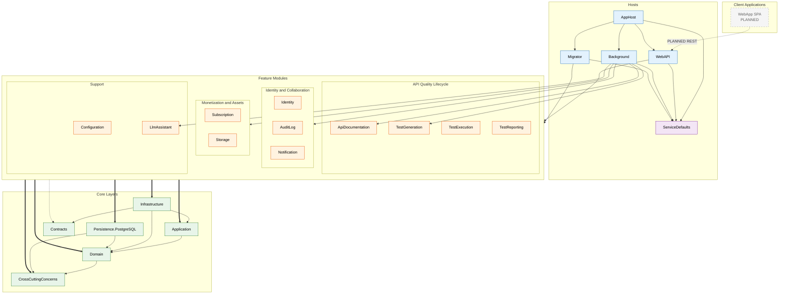
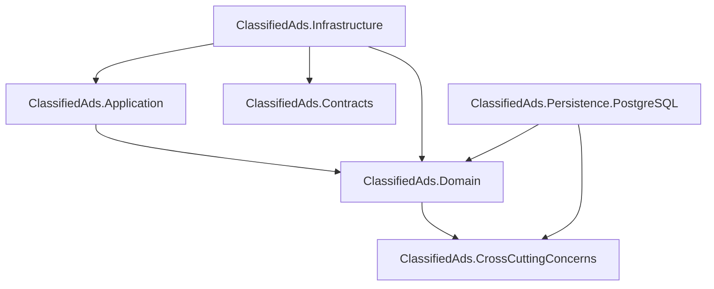
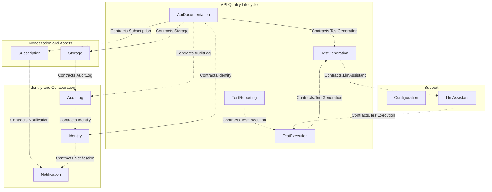
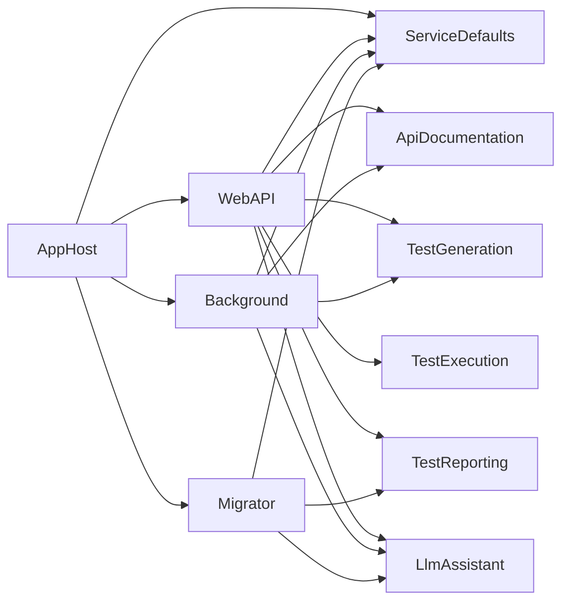
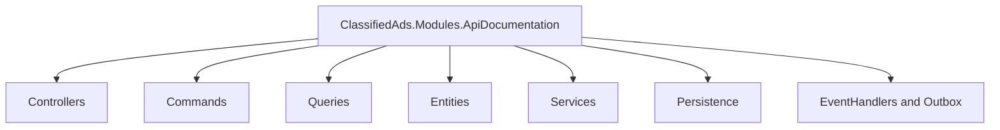
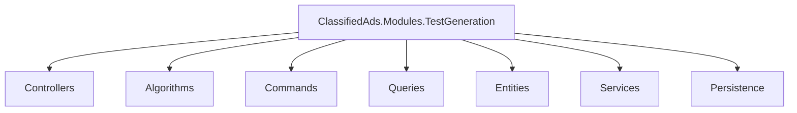

# UML Package Diagram — Sub-System Evaluation & Package Explanation

> **Purpose:** Provide the package diagram for each sub-system with overall package diagram(s) and detailed explanation for each package (namespace).
>
> **Last Updated:** 2026-02-25
> **Source of Truth:** Static analysis of `*.csproj` ProjectReferences + `namespace` declarations in `*.cs` files (excluding `bin/obj`).
> **Related:** [UML_PACKAGE_DIAGRAM_SOURCE.md](UML_PACKAGE_DIAGRAM_SOURCE.md) (structural analysis & full diagrams)

---

## Table of Contents

- [UML Package Diagram — Sub-System Evaluation \& Package Explanation](#uml-package-diagram--sub-system-evaluation--package-explanation)
  - [Table of Contents](#table-of-contents)
  - [1. Overall System Package Diagram](#1-overall-system-package-diagram)
    - [Overall Package Diagram (Mermaid)](#overall-package-diagram-mermaid)
  - [2. Sub-System Breakdown](#2-sub-system-breakdown)
    - [2.1 Core Layers Sub-System](#21-core-layers-sub-system)
    - [2.2 Feature Modules Sub-System](#22-feature-modules-sub-system)
    - [2.3 Hosts Sub-System](#23-hosts-sub-system)
    - [2.4 Shared Platform Sub-System](#24-shared-platform-sub-system)
    - [2.5 Client Applications Sub-System (Planned)](#25-client-applications-sub-system-planned)
  - [3. Detailed Package (Namespace) Explanation](#3-detailed-package-namespace-explanation)
    - [3.1 Core Layers](#31-core-layers)
      - [3.1.1 ClassifiedAds.Domain](#311-classifiedadsdomain)
      - [3.1.2 ClassifiedAds.Application](#312-classifiedadsapplication)
      - [3.1.3 ClassifiedAds.Infrastructure](#313-classifiedadsinfrastructure)
      - [3.1.4 ClassifiedAds.Persistence.PostgreSQL](#314-classifiedadspersistencepostgresql)
      - [3.1.5 ClassifiedAds.CrossCuttingConcerns](#315-classifiedadscrosscuttingconcerns)
      - [3.1.6 ClassifiedAds.Contracts](#316-classifiedadscontracts)
    - [3.2 Feature Module: ApiDocumentation](#32-feature-module-apidocumentation)
    - [3.3 Feature Module: TestGeneration](#33-feature-module-testgeneration)
    - [3.4 Feature Module: TestExecution](#34-feature-module-testexecution)
    - [3.5 Feature Module: TestReporting](#35-feature-module-testreporting)
    - [3.6 Feature Module: Identity](#36-feature-module-identity)
    - [3.7 Feature Module: AuditLog](#37-feature-module-auditlog)
    - [3.8 Feature Module: Notification](#38-feature-module-notification)
    - [3.9 Feature Module: Subscription](#39-feature-module-subscription)
    - [3.10 Feature Module: Storage](#310-feature-module-storage)
    - [3.11 Feature Module: Configuration](#311-feature-module-configuration)
    - [3.12 Feature Module: LlmAssistant](#312-feature-module-llmassistant)
    - [3.13 Hosts](#313-hosts)
      - [3.13.1 ClassifiedAds.AppHost](#3131-classifiedadsapphost)
      - [3.13.2 ClassifiedAds.WebAPI](#3132-classifiedadswebapi)
      - [3.13.3 ClassifiedAds.Background](#3133-classifiedadsbackground)
      - [3.13.4 ClassifiedAds.Migrator](#3134-classifiedadsmigrator)
    - [3.14 Contracts (Cross-Module Boundary)](#314-contracts-cross-module-boundary)
  - [4. Module Maturity Assessment](#4-module-maturity-assessment)
    - [Internal Structure Consistency](#internal-structure-consistency)
  - [5. Cross-Reference: Package → Feature Mapping](#5-cross-reference-package--feature-mapping)

---

## 1. Overall System Package Diagram

The system follows a **Modular Monolith with Shared Layered Core** architecture. The overall dependency flow is:

```
Client Applications (planned) → Hosts → Feature Modules → Core Layers
```

### Overall Package Diagram (Mermaid)

This document targets Mermaid/draw.io rendering only. PlantUML syntax was removed to avoid parser errors in Mermaid-only environments.


```mermaid
flowchart TB
    subgraph Client["Client Applications"]
        WebApp["WebApp SPA<br/>PLANNED"]
    end

    subgraph Hosts["Hosts"]
        AppHost["AppHost"]
        WebAPI["WebAPI"]
        Background["Background"]
        Migrator["Migrator"]
        ServiceDefaults["ServiceDefaults"]
    end

    subgraph Modules["Feature Modules"]
        subgraph BC_API["API Quality Lifecycle"]
            ApiDoc["ApiDocumentation"]
            TestGen["TestGeneration"]
            TestExec["TestExecution"]
            TestRep["TestReporting"]
        end
        subgraph BC_ID["Identity and Collaboration"]
            Identity["Identity"]
            AuditLog["AuditLog"]
            Notification["Notification"]
        end
        subgraph BC_MON["Monetization and Assets"]
            Subscription["Subscription"]
            Storage["Storage"]
        end
        subgraph BC_SUP["Support"]
            Configuration["Configuration"]
            LlmAssistant["LlmAssistant"]
        end
    end

    subgraph Core["Core Layers"]
        Application["Application"]
        Domain["Domain"]
        Infrastructure["Infrastructure"]
        Postgres["Persistence.PostgreSQL"]
        Contracts["Contracts"]
        CCC["CrossCuttingConcerns"]
    end

    WebApp -.->|PLANNED REST| WebAPI
    AppHost --> WebAPI
    AppHost --> Background
    AppHost --> Migrator
    AppHost --> ServiceDefaults

    WebAPI --> ServiceDefaults
    Background --> ServiceDefaults
    Migrator --> ServiceDefaults

    WebAPI --> Modules
    Background --> ApiDoc
    Background --> TestGen
    Background --> BC_ID
    Background --> BC_MON
    Background --> LlmAssistant
    Migrator --> Modules

    Modules ==> Application
    Modules ==> Domain
    Modules ==> Infrastructure
    Modules ==> Postgres
    Modules ==> CCC
    Modules -.-> Contracts

    Application --> Domain
    Domain --> CCC
    Infrastructure --> Application
    Infrastructure --> Contracts
    Infrastructure --> Domain
    Postgres --> Domain
    Postgres --> CCC

    classDef client fill:#FFFDE7,stroke:#F57F17,color:#000
    classDef host fill:#E3F2FD,stroke:#1565C0,color:#000
    classDef module fill:#FFF3E0,stroke:#E65100,color:#000
    classDef core fill:#E8F5E9,stroke:#2E7D32,color:#000
    classDef shared fill:#F3E5F5,stroke:#7B1FA2,color:#000
    classDef planned fill:#F5F5F5,stroke:#9E9E9E,stroke-dasharray:5 5,color:#616161

    class WebApp planned
    class AppHost,WebAPI,Background,Migrator host
    class ApiDoc,TestGen,TestExec,TestRep,Identity,AuditLog,Notification,Subscription,Storage,Configuration,LlmAssistant module
    class Application,Domain,Infrastructure,Postgres,Contracts,CCC core
    class ServiceDefaults shared
```

---

## 2. Sub-System Breakdown

### 2.1 Core Layers Sub-System

**Purpose:** Provides the shared layered kernel that all feature modules depend on. Implements Clean Architecture with inward dependency direction.


```mermaid
flowchart TB
    App["ClassifiedAds.Application"]
    Domain["ClassifiedAds.Domain"]
    CCC["ClassifiedAds.CrossCuttingConcerns"]
    Infra["ClassifiedAds.Infrastructure"]
    Contracts["ClassifiedAds.Contracts"]
    PG["ClassifiedAds.Persistence.PostgreSQL"]

    App --> Domain
    Domain --> CCC
    Infra --> App
    Infra --> Contracts
    Infra --> Domain
    PG --> Domain
    PG --> CCC
```

| Package | .cs Files | Role |
|---------|-----------|------|
| `ClassifiedAds.Application` | 26 | CQRS pattern (Command/Query separation), `Dispatcher`, decorator pipeline (audit log, DB retry), generic CRUD service |
| `ClassifiedAds.Domain` | 25 | Core domain: entities, domain events, repository interfaces, messaging contracts, Result pattern, value objects |
| `ClassifiedAds.Infrastructure` | 115 | Concrete implementations: messaging (RabbitMQ/Kafka/Azure Service Bus), file storage (Local/Azure/AWS/Firebase), notifications (Email/SMS/SignalR), monitoring (OpenTelemetry), caching (Redis), web middleware |
| `ClassifiedAds.Persistence.PostgreSQL` | 2 | Generic EF Core `IRepository<T>` and `IUnitOfWork` implementations for PostgreSQL |
| `ClassifiedAds.CrossCuttingConcerns` | 25 | Shared utility interfaces (CSV, Excel, PDF, HTML, DateTime, DistributedLock), exceptions, extension methods |
| `ClassifiedAds.Contracts` | 86 | **Cross-module communication boundary** — service interfaces, DTOs, and enums organized by module context |

**Dependency Rules:**
- `Application → Domain` (application orchestrates domain logic)
- `Domain → CrossCuttingConcerns` (domain uses shared utilities)
- `Infrastructure → Application, Domain` (implements abstractions defined in inner layers)
- `Persistence.PostgreSQL → Domain, CrossCuttingConcerns` (implements repository interfaces)
- **No outward dependency** from Domain to Infrastructure (Clean Architecture preserved)

---

### 2.2 Feature Modules Sub-System

**Purpose:** Encapsulates business capabilities as independent bounded context packages. Each module owns its schema, entities, DbContext, and business logic.


```mermaid
flowchart TB
    subgraph APIQuality["API Quality Lifecycle"]
        ApiDoc["ApiDocumentation"]
        TestGen["TestGeneration"]
        TestExec["TestExecution"]
        TestRep["TestReporting"]
    end
    subgraph IdentityCollab["Identity and Collaboration"]
        Identity["Identity"]
        AuditLog["AuditLog"]
        Notification["Notification"]
    end
    subgraph MonetizationAssets["Monetization and Assets"]
        Subscription["Subscription"]
        Storage["Storage"]
    end
    subgraph Support["Support"]
        Configuration["Configuration"]
        LlmAssistant["LlmAssistant"]
    end

    ApiDoc -.->|Contracts.Identity| Identity
    ApiDoc -.->|Contracts.Subscription| Subscription
    ApiDoc -.->|Contracts.Storage| Storage
    ApiDoc -.->|Contracts.AuditLog| AuditLog
    ApiDoc -.->|Contracts.TestGeneration| TestGen
    TestGen -.->|Contracts.LlmAssistant| LlmAssistant
    TestExec -.->|Contracts.TestGeneration| TestGen
    TestRep -.->|Contracts.TestExecution| TestExec
    LlmAssistant -.->|Contracts.TestExecution| TestExec
    Subscription -.->|Contracts.Notification| Notification
    Storage -.->|Contracts.AuditLog| AuditLog
    Identity -.->|Contracts.Notification| Notification
    AuditLog -.->|Contracts.Identity| Identity
```

**Cross-Module Coupling (via Contracts only):**

| Source Module | Depends On (via Contracts) | Contract Interface Used |
|---------------|---------------------------|------------------------|
| ApiDocumentation | Identity | `ICurrentUser`, `IUserService` |
| ApiDocumentation | Subscription | `ISubscriptionLimitGatewayService` |
| ApiDocumentation | Storage | `IStorageFileGatewayService` |
| ApiDocumentation | AuditLog | `IAuditLogService` |
| TestGeneration | ApiDocumentation | `IApiEndpointMetadataService` |
| TestGeneration | Identity | `ICurrentUser` |
| TestExecution | Identity | `ICurrentUser` |
| Subscription | Identity | `ICurrentUser`, `IUserService` |
| Subscription | Notification | `IEmailMessageService` |
| Subscription | AuditLog | `IAuditLogService` |
| Storage | Identity | `ICurrentUser` |
| Storage | AuditLog | `IAuditLogService` |
| Identity | Notification | `IEmailMessageService` |
| AuditLog | Identity | `IUserService` |

**Key observation:** Zero direct module-to-module compile-time references. All cross-context communication is mediated through `ClassifiedAds.Contracts`.

---

### 2.3 Hosts Sub-System

**Purpose:** Composition roots that wire modules together and serve as entry points for the application.


```mermaid
flowchart LR
    AppHost["AppHost"]
    WebAPI["WebAPI"]
    Background["Background"]
    Migrator["Migrator"]
    ServiceDefaults["ServiceDefaults"]

    AppHost --> WebAPI
    AppHost --> Background
    AppHost --> Migrator
    AppHost --> ServiceDefaults
    WebAPI --> ServiceDefaults
    Background --> ServiceDefaults
    Migrator --> ServiceDefaults

    WebAPI --> ApiDoc["ApiDocumentation"]
    WebAPI --> TestGen["TestGeneration"]
    WebAPI --> TestExec["TestExecution"]
    WebAPI --> TestRep["TestReporting"]
    WebAPI --> LlmAssistant["LlmAssistant"]
    Background --> ApiDoc
    Background --> TestGen
    Background --> LlmAssistant
    Migrator --> TestRep
    Migrator --> LlmAssistant
```

| Host | .cs Files | Modules Composed | Role |
|------|-----------|-----------------|------|
| **AppHost** | 1 | (orchestrates WebAPI, Background, Migrator) | .NET Aspire orchestrator — provisions PostgreSQL, RabbitMQ, Redis, MailHog; manages service startup order |
| **WebAPI** | 5 | ApiDocumentation, TestGeneration, TestExecution, TestReporting, Identity, AuditLog, Notification, Subscription, Storage, Configuration, LlmAssistant | REST API host — JWT authentication, Swagger/Scalar docs, SignalR hub, CORS, rate limiting, global exception handling |
| **Background** | 4 | ApiDocumentation, TestGeneration, Identity, AuditLog, Notification, Subscription, Storage, LlmAssistant | Background worker host — outbox message publishing, email/SMS sending, message bus consuming, cron jobs |
| **Migrator** | 53 | ApiDocumentation, TestGeneration, TestExecution, TestReporting, Identity, AuditLog, Notification, Subscription, Storage, Configuration, LlmAssistant | Database migration runner — EF Core migrations for all module DbContexts + DbUp SQL scripts |

**Current note:** `LlmAssistant` is composed by WebAPI, Background, and Migrator in current project references.

---

### 2.4 Shared Platform Sub-System

| Package | .cs Files | Role |
|---------|-----------|------|
| `ClassifiedAds.ServiceDefaults` | 1 | .NET Aspire ServiceDefaults — configures OpenTelemetry tracing/metrics/logging, health check endpoints, service discovery, and HTTP client resilience. Referenced by all 3 runtime hosts. |

---

### 2.5 Client Applications Sub-System (Planned)

| Package | Status | Role |
|---------|--------|------|
| `WebApp (SPA)` | **Not yet implemented** — tech stack TBD | Single-page application for all user roles (Admin, Developer, Tester, Viewer). Communicates exclusively with WebAPI host via REST API. |

**Architectural decision:** Single SPA with role-based routing. Admin, Developer, Tester, and Viewer are user roles (defined in `ClassifiedAds.Modules.Identity`) — not separate applications.

---

## 3. Detailed Package (Namespace) Explanation

### 3.1 Core Layers

#### 3.1.1 ClassifiedAds.Domain

| Namespace | Purpose | Key Types |
|-----------|---------|-----------|
| `ClassifiedAds.Domain.Entities` | Base entity abstractions and tracking interfaces | `Entity<T>` (base), `IAggregateRoot`, `IHasKey<T>`, `ITrackable` |
| `ClassifiedAds.Domain.Events` | Domain event contracts | `IDomainEvent`, `IDomainEventHandler<T>`, `EntityCreatedEvent`, `EntityUpdatedEvent`, `EntityDeletedEvent` |
| `ClassifiedAds.Domain.Repositories` | Repository and unit-of-work abstractions | `IRepository<T>`, `IUnitOfWork`, `IConcurrencyHandler<T>` |
| `ClassifiedAds.Domain.Infrastructure.Messaging` | Message bus contracts for inter-module async communication | `IMessageBus`, `IMessageSender`, `IMessageReceiver`, `IMessageBusConsumer<T>`, `IOutboxMessagePublisher`, `Message`, `MetaData`, `PublishingOutboxMessage` |
| `ClassifiedAds.Domain.Infrastructure.ResultPattern` | Functional result pattern for error handling | `Result`, `Result<T>`, `Error` (record), `Codes` |
| `ClassifiedAds.Domain.ValueObjects` | Immutable value objects | `Address`, `Money` |

#### 3.1.2 ClassifiedAds.Application

| Namespace | Purpose | Key Types |
|-----------|---------|-----------|
| `ClassifiedAds.Application` | CQRS dispatcher and handler interfaces | `Dispatcher`, `ICommand`, `ICommandHandler<T>`, `IQuery<T>`, `IQueryHandler<TQ,TR>`, `ICrudService<T>`, `CrudService<T>` |
| `ClassifiedAds.Application.Common.DTOs` | Shared pagination DTO | `Paged<T>` |
| `ClassifiedAds.Application.Decorators.AuditLog` | Audit logging decorator for commands/queries | `AuditLogAttribute`, `AuditLogCommandDecorator<T>`, `AuditLogQueryDecorator<TQ,TR>` |
| `ClassifiedAds.Application.Decorators.DatabaseRetry` | Database retry decorator with transient fault handling | `DatabaseRetryAttribute`, `DatabaseRetryCommandDecorator<T>`, `DatabaseRetryQueryDecorator<TQ,TR>` |
| `ClassifiedAds.Application.FeatureToggles` | Feature toggle abstraction for outbox publishing | `IOutboxPublishingToggle` |

#### 3.1.3 ClassifiedAds.Infrastructure

| Namespace | Purpose | Key Types |
|-----------|---------|-----------|
| `ClassifiedAds.Infrastructure.Caching` | Cache options (in-memory, distributed, Redis) | `CachingOptions`, `InMemoryCacheOptions`, `DistributedCacheOptions`, `RedisOptions` |
| `ClassifiedAds.Infrastructure.Configuration` | External config providers (SQL, HashiCorp Vault) | `SqlConfigurationProvider`, `HashiCorpVaultConfigurationProvider` |
| `ClassifiedAds.Infrastructure.HostedServices` | Background service base classes | `CronJobBackgroundService`, `MessageBusConsumerBackgroundService` |
| `ClassifiedAds.Infrastructure.Messaging` | Message broker implementations | `RabbitMQSender/Receiver`, `KafkaSender/Receiver`, `AzureServiceBusSender/Receiver`, `FakeSender/Receiver` |
| `ClassifiedAds.Infrastructure.Monitoring` | Observability setup | `OpenTelemetryExtensions`, `CustomTelemetryInitializer` |
| `ClassifiedAds.Infrastructure.Notification.Email` | Email sending implementations | `SmtpClientEmailNotification`, `SendGridEmailNotification`, `FakeEmailNotification` |
| `ClassifiedAds.Infrastructure.Notification.Sms` | SMS sending implementations | `TwilioSmsNotification`, `AzureSmsNotification`, `FakeSmsNotification` |
| `ClassifiedAds.Infrastructure.Notification.Web` | Web push/SignalR | `SignalRNotification`, `FakeWebNotification` |
| `ClassifiedAds.Infrastructure.Storages` | File storage implementations | `LocalFileStorageManager`, `AzureBlobStorageManager`, `AmazonS3StorageManager`, `FirebaseStorageManager` |
| `ClassifiedAds.Infrastructure.Web.Authorization` | Custom authorization policies | `CustomAuthorizationPolicyProvider`, `PermissionRequirement`, `PermissionRequirementHandler` |
| `ClassifiedAds.Infrastructure.Web.Middleware` | HTTP middleware pipeline | `GlobalExceptionHandlerMiddleware`, `IPFilteringMiddleware`, `SecurityHeadersMiddleware`, `LoggingStatusCodeMiddleware` |
| `ClassifiedAds.Infrastructure.Web.ResultMapping` | Map Result<T> to HTTP responses | `ResultExtensions` |
| `ClassifiedAds.Infrastructure.Web.Validation` | Validation problem details factory | `ValidationProblemDetailsFactory` |

#### 3.1.4 ClassifiedAds.Persistence.PostgreSQL

| Namespace | Purpose | Key Types |
|-----------|---------|-----------|
| `ClassifiedAds.Persistence.PostgreSQL` | Generic EF Core implementations for PostgreSQL | `DbContextRepository<TDbContext, TEntity>` (implements `IRepository<T>`), `DbContextUnitOfWork<TDbContext>` (implements `IUnitOfWork`) |

#### 3.1.5 ClassifiedAds.CrossCuttingConcerns

| Namespace | Purpose | Key Types |
|-----------|---------|-----------|
| `ClassifiedAds.CrossCuttingConcerns.Csv` | CSV read/write abstractions | `ICsvReader`, `ICsvWriter` |
| `ClassifiedAds.CrossCuttingConcerns.DateTimes` | DateTime abstraction for testability | `IDateTimeProvider` |
| `ClassifiedAds.CrossCuttingConcerns.Excel` | Excel read/write abstractions | `IExcelReader`, `IExcelWriter` |
| `ClassifiedAds.CrossCuttingConcerns.Exceptions` | Typed exceptions for domain errors | `NotFoundException`, `ConflictException`, `ValidationException` |
| `ClassifiedAds.CrossCuttingConcerns.ExtensionMethods` | Utility extension methods | `StringExtensions`, `HttpClientExtensions`, `IQueryableExtensions`, `GuidExtensions`, etc. |
| `ClassifiedAds.CrossCuttingConcerns.Html` | HTML generation abstraction | `IHtmlWriter` |
| `ClassifiedAds.CrossCuttingConcerns.Locks` | Distributed locking abstraction | `IDistributedLock`, `ILockManager`, `CouldNotAcquireLockException` |
| `ClassifiedAds.CrossCuttingConcerns.Pdf` | PDF generation abstraction | `IPdfWriter` |

#### 3.1.6 ClassifiedAds.Contracts

| Namespace | Purpose | Key Interfaces & DTOs |
|-----------|---------|----------------------|
| `ClassifiedAds.Contracts.Identity.Services` | User identity access across modules | `ICurrentUser`, `IUserService` |
| `ClassifiedAds.Contracts.Identity.DTOs` | | `UserDTO`, `UserQueryOptions` |
| `ClassifiedAds.Contracts.AuditLog.Services` | Audit trail logging across modules | `IAuditLogService` |
| `ClassifiedAds.Contracts.AuditLog.DTOs` | | `AuditLogEntryDTO`, `AuditLogEntryQueryOptions` |
| `ClassifiedAds.Contracts.Notification.Services` | Email/notification sending across modules | `IEmailMessageService`, `IEmailTemplateService` |
| `ClassifiedAds.Contracts.Notification.DTOs` | | `EmailMessageDTO` |
| `ClassifiedAds.Contracts.Storage.Services` | File upload/download across modules | `IStorageFileGatewayService` |
| `ClassifiedAds.Contracts.Storage.DTOs` | | `StorageUploadedFileDTO`, `StorageUploadFileRequest` |
| `ClassifiedAds.Contracts.Storage.Enums` | | `FileCategory` |
| `ClassifiedAds.Contracts.Subscription.Services` | Subscription limit checking across modules | `ISubscriptionLimitGatewayService` |
| `ClassifiedAds.Contracts.Subscription.DTOs` | | `IncrementUsageRequest`, `LimitCheckResultDTO` |
| `ClassifiedAds.Contracts.Subscription.Enums` | | `LimitType` |
| `ClassifiedAds.Contracts.ApiDocumentation.Services` | API metadata access across modules | `IApiEndpointMetadataService` |
| `ClassifiedAds.Contracts.ApiDocumentation.DTOs` | | `ApiEndpointMetadataDto` |

---

### 3.2 Feature Module: ApiDocumentation

**Bounded Context:** API Quality Lifecycle
**FEs Covered:** FE-02, FE-03, FE-11, FE-12, FE-13
**Status:** Implemented (current source scan: 94 .cs files)


```mermaid
flowchart TB
    ApiDoc["ClassifiedAds.Modules.ApiDocumentation"]
    Controllers["Controllers"]
    Commands["Commands"]
    Queries["Queries"]
    Entities["Entities"]
    Services["Services"]
    Persistence["Persistence"]
    Events["EventHandlers and Outbox"]

    ApiDoc --> Controllers
    ApiDoc --> Commands
    ApiDoc --> Queries
    ApiDoc --> Entities
    ApiDoc --> Services
    ApiDoc --> Persistence
    ApiDoc --> Events
```

| Namespace | Purpose |
|-----------|---------|
| `.Controllers` | 3 REST controllers: Projects CRUD, Specifications upload/activate/CRUD, Endpoints CRUD + path param resolution |
| `.Commands` | 11 command handlers: project/spec/endpoint mutation, cURL import, manual spec creation, outbox publish |
| `.Queries` | 10 query handlers: project/spec/endpoint retrieval, resolved URL, path parameter mutations |
| `.Entities` | 9 entities: Project → ApiSpecification → ApiEndpoint → EndpointParameter/Response/SecurityReq, SecurityScheme |
| `.Services` | CurlParser (cURL → API definition), PathParameterTemplateService (567 lines: extract/validate/resolve/mutate path params), ApiEndpointMetadataService (contract implementation) |
| `.Persistence` | Own DbContext (`apidocumentation` schema), Repository |
| `.EventHandlers` | 6 domain event handlers for audit trail integration |
| `.IntegrationEvents` | Outbox events: ProjectCreated/Updated/Archived, SpecUploaded/Activated/Deleted |
| `.OutBoxEventPublishers` | 3 publishers: AuditLogEntry, Project, Specification |
| `.Models` | 16 DTOs for API request/response mapping |
| `.Authorization` | Permission constants for RBAC |
| `.RateLimiterPolicies` | Default rate limiter + policy names |
| `.ConfigurationOptions` | Module options + connection string config |

---

### 3.3 Feature Module: TestGeneration

**Bounded Context:** API Quality Lifecycle
**FEs Covered:** FE-04 (scope), FE-05A (order proposal), FE-05B (test case generation), FE-06 (boundary/negative)
**Status:** Implemented/active development (current source scan: 191 .cs files)


```mermaid
flowchart TB
    TestGen["ClassifiedAds.Modules.TestGeneration"]
    Controllers["Controllers"]
    Algorithms["Algorithms"]
    Commands["Commands"]
    Queries["Queries"]
    Entities["Entities"]
    Services["Services"]
    Persistence["Persistence"]

    TestGen --> Controllers
    TestGen --> Algorithms
    TestGen --> Commands
    TestGen --> Queries
    TestGen --> Entities
    TestGen --> Services
    TestGen --> Persistence
```

| Namespace | Purpose |
|-----------|---------|
| `.Controllers` | 2 controllers: TestOrderController (5 endpoints: propose/approve/reject/reorder/gate-status), TestSuitesController (CRUD) |
| `.Algorithms` | Paper-based algorithms: `DependencyAwareTopologicalSorter` (Kahn's — KAT paper), `SemanticTokenMatcher` (5-tier — SPDG paper), `SchemaRelationshipAnalyzer` (Warshall's transitive closure — KAT paper), `ObservationConfirmationPromptBuilder` (COmbine/RBCTest paper) |
| `.Algorithms.Models` | `DependencyEdge`, `TokenMatchResult`, `EndpointPromptContext`, `ParameterPromptContext`, `ResponsePromptContext`, `ObservationConfirmationPrompt` |
| `.Commands` | 6 command handlers: order proposal lifecycle (propose/approve/reject/reorder) + test suite scope management |
| `.Queries` | 4 query handlers: order proposal retrieval, gate status check, suite scope CRUD |
| `.Entities` | 11 entities including `TestCase`, `TestCaseRequest`, `TestCaseExpectation`, `TestCaseVariable`, `TestDataSet` (structure ready for FE-05B) |
| `.Services` | 9 classes: order service (orchestration), algorithm (composition), gate service (blocks generation without approved order), scope service, model mapper |
| `.Persistence` | Own DbContext (`testgeneration` schema) |
| `.Models` | 4 DTOs + 6 request models |

---

### 3.4 Feature Module: TestExecution

**Bounded Context:** API Quality Lifecycle
**FEs Covered:** FE-04 (environment CRUD), FE-07 (execution engine), FE-08 (validation)
**Status:** Implemented/active development (current source scan: 67 .cs files)

| Namespace | Purpose |
|-----------|---------|
| `.Controllers` | 1 controller: `ExecutionEnvironmentsController` (CRUD for execution environments) |
| `.Commands` | 2 command handlers: `AddUpdateExecutionEnvironmentCommand` (313 lines with auth config validation), `DeleteExecutionEnvironmentCommand` |
| `.Queries` | 2 query handlers: `GetExecutionEnvironmentQuery`, `GetExecutionEnvironmentsQuery` |
| `.Entities` | 4 entities: `ExecutionEnvironment`, `TestRun` (status/counters/timestamps), `AuditLogEntry`, `OutboxMessage` |
| `.Services` | `ExecutionAuthConfigService` (136 lines: Bearer/Basic/ApiKey/OAuth2 config) |
| `.Persistence` | Own DbContext (`testexecution` schema) |

**Current scope note:** execution and validation capabilities continue in FE-07/08; see current source for implemented services.

---

### 3.5 Feature Module: TestReporting

**Bounded Context:** API Quality Lifecycle
**FEs Covered:** FE-10 (reports/export)
**Status:** Implemented/active development (current source scan: 37 .cs files)

| Namespace | Purpose |
|-----------|---------|
| `.Entities` | 4 entities: `TestReport` (61 lines), `CoverageMetric` (53 lines), `AuditLogEntry`, `OutboxMessage` |
| `.DbConfigurations` | EF Core entity configurations for all entities |
| `.Persistence` | Own DbContext (`testreporting` schema), `Repository<T>` |
| `.ConfigurationOptions` | Module options + connection string config |

**Current scope note:** report APIs and export capabilities continue in FE-10; see current source for implemented services.

---

### 3.6 Feature Module: Identity

**Bounded Context:** Identity & Collaboration
**FEs Covered:** FE-01
**Status:** Implemented (current source scan: 89 .cs files)

| Namespace | Purpose |
|-----------|---------|
| `.Controllers` | 3 controllers: `AuthController` (login/register/refresh/confirm-email/avatar), `RolesController` (CRUD + claims), `UsersController` (CRUD + roles/claims) |
| `.Commands.Roles` | 4 role management commands: AddClaim, AddUpdateRole, DeleteClaim, DeleteRole |
| `.Commands.Users` | 6 user management commands: AddClaim, AddRole, DeleteClaim, DeleteRole, DeleteUser, SyncUsers |
| `.Queries` | 5 query handlers: GetPagedUsers, GetRole, GetRoles, GetUser, GetUsers |
| `.Entities` | 8 entities: User, UserProfile, UserClaim, UserLogin, UserRole, UserToken, Role, RoleClaim |
| `.Services` | 8 service classes: `JwtTokenService` (JWT generation/validation), `CurrentWebUser` (implements `ICurrentUser`), `UserService` (implements `IUserService`), `InMemoryTokenBlacklistService`, `AnonymousUser`, `VietnameseIdentityErrorDescriber` |
| `.IdentityProviders.Auth0` | Auth0 external identity provider integration |
| `.IdentityProviders.Azure` | Azure AD B2C external identity provider integration |
| `.PasswordValidators` | `HistoricalPasswordValidator`, `WeakPasswordValidator` |
| `.RateLimiterPolicies` | Auth-specific rate limiters (auth endpoint, password attempts, default) |
| `.HostedServices` | `DevelopmentIdentityBootstrapper` (dev seed), `SyncUsersWorker` |
| `.Persistence` | Own DbContext (`identity` schema), User/Role repositories with custom queries |

---

### 3.7 Feature Module: AuditLog

**Bounded Context:** Identity & Collaboration
**FEs Covered:** Cross-cutting (supports all modules)
**Status:** Implemented (current source scan: 17 .cs files)

| Namespace | Purpose |
|-----------|---------|
| `.Controllers` | 1 controller: `AuditLogEntriesController` (paginated audit log query) |
| `.Queries` | 3 query handlers: `GetAuditEntriesQuery`, `GetPagedAuditEntriesQuery`, `GetUsersQuery` |
| `.Entities` | 2 entities: `AuditLogEntry`, `IdempotentRequest` |
| `.Services` | `AuditLogService` (implements `IAuditLogService` from Contracts) |
| `.Persistence` | Own DbContext (`auditlog` schema) |
| `.RateLimiterPolicies` | Audit-specific rate limiter |

---

### 3.8 Feature Module: Notification

**Bounded Context:** Identity & Collaboration
**FEs Covered:** Cross-cutting (supports Identity, Subscription email notifications)
**Status:** Implemented (current source scan: 29 .cs files)

| Namespace | Purpose |
|-----------|---------|
| `.Commands` | 2 commands: `SendEmailMessagesCommand`, `SendSmsMessagesCommand` |
| `.Entities` | 3 entities: EmailMessage (+ ArchivedEmailMessage), EmailMessageAttachment, SmsMessage (+ ArchivedSmsMessage) |
| `.Services` | `EmailMessageService` (implements `IEmailMessageService`), `EmailTemplateService` (implements `IEmailTemplateService`) |
| `.EmailQueue` | In-memory channel-based email queue: `EmailChannel`, `EmailQueueWriter/Reader`, `EmailSendingWorker`, `EmailDbSweepWorker` |
| `.Hubs` | `NotificationHub` (SignalR hub for real-time web notifications) |
| `.HostedServices` | `SendEmailWorker`, `SendSmsWorker` (background workers for reliable delivery) |
| `.Persistence` | Own DbContext (`notification` schema), Email/SMS repositories |

---

### 3.9 Feature Module: Subscription

**Bounded Context:** Monetization & Assets
**FEs Covered:** FE-14
**Status:** Implemented/active development (current source scan: 88 .cs files)

| Namespace | Purpose |
|-----------|---------|
| `.Controllers` | 3 controllers: `SubscriptionsController` (326 lines), `PlansController` (200 lines), `PaymentsController` (302 lines) |
| `.Commands` | 13 command handlers: plan CRUD, subscription lifecycle (create/cancel/upgrade/downgrade), payment intents, PayOS checkout/webhook/reconciliation, limit consumption (`ConsumeLimitAtomically` with Serializable transaction) |
| `.Queries` | 11 query handlers: plans, subscriptions, payments, usage tracking, audit entries |
| `.Entities` | 9 entities: `SubscriptionPlan`, `PlanLimit`, `UserSubscription`, `SubscriptionHistory`, `PaymentIntent`, `PaymentTransaction`, `UsageTracking`, `AuditLogEntry`, `OutboxMessage` |
| `.Services` | `PayOsService` (HMAC-SHA256 + payment links), `SubscriptionLimitGatewayService` (262 lines — implements `ISubscriptionLimitGatewayService`) |
| `.EventHandlers` | 3 handlers: PlanCreated/Updated/Deleted → audit trail |
| `.IntegrationEvents` | Outbox events: PaymentIntent lifecycle, SubscriptionChanged |
| `.HostedServices` | `PublishEventWorker`, `ReconcilePayOsCheckoutWorker` |
| `.Persistence` | Own DbContext (`subscription` schema) |

---

### 3.10 Feature Module: Storage

**Bounded Context:** Monetization & Assets
**FEs Covered:** Cross-cutting (supports file upload for ApiDocumentation, Identity avatar)
**Status:** Implemented (current source scan: 33 .cs files)

| Namespace | Purpose |
|-----------|---------|
| `.Controllers` | 1 controller: `FilesController` (upload/download/delete) |
| `.Entities` | 3 entities: `FileEntry` (+ `DeletedFileEntry`), `AuditLogEntry`, `OutboxMessage` |
| `.Services` | `StorageFileGatewayService` (implements `IStorageFileGatewayService`) |
| `.Authorization` | `FileEntryAuthorizationHandler` (resource-based authorization) |
| `.EventHandlers` | 3 handlers: FileEntry Created/Updated/Deleted → audit trail |
| `.MessageBusConsumers` | `WebhookConsumer` (external event processing) |
| `.Persistence` | Own DbContext (`storage` schema) |

---

### 3.11 Feature Module: Configuration

**Bounded Context:** Support
**FEs Covered:** System configuration management
**Status:** Implemented (current source scan: 21 .cs files)

| Namespace | Purpose |
|-----------|---------|
| `.Controllers` | 1 controller: `ConfigurationEntriesController` |
| `.Entities` | 2 entities: `ConfigurationEntry`, `LocalizationEntry` |
| `.Excel` | Excel import/export abstractions + implementations (ClosedXML, ExcelDataReader) |
| `.Persistence` | Own DbContext (`configuration` schema) |

**Note:** This is the only module that does **not** reference `ClassifiedAds.Contracts` at project level.

---

### 3.12 Feature Module: LlmAssistant

**Bounded Context:** Support
**FEs Covered:** FE-06 (partial), FE-09, FE-15, FE-16, FE-17
**Status:** Implemented/active development (current source scan: 37 .cs files)

| Namespace | Purpose |
|-----------|---------|
| `.Entities` | 4 entities: `LlmInteraction`, `LlmSuggestionCache` (with `SuggestionType` enum), `AuditLogEntry`, `OutboxMessage` |
| `.DbConfigurations` | EF Core entity configurations |
| `.Persistence` | Own DbContext (`llmassistant` schema) |
| `.ConfigurationOptions` | Module options + connection string config |

**Current note:** `LlmAssistant` is referenced by WebAPI, Background, and Migrator in current project references.

---

### 3.13 Hosts

#### 3.13.1 ClassifiedAds.AppHost

| Namespace | Purpose |
|-----------|---------|
| *(top-level statements)* | .NET Aspire orchestration. Defines infrastructure resources: `postgres` + `classifiedAdsDb`, `rabbitmq`, `redis`, `mailhog`. Orchestrates services: `migrator` (run first), `webapi` (waits for migrator), `background` (waits for migrator). |

#### 3.13.2 ClassifiedAds.WebAPI

| Namespace | Purpose |
|-----------|---------|
| *(top-level statements in Program.cs)* | REST API entry point. Configures: all module `AddXxxModule()` registrations, JWT Bearer authentication, Swagger/Scalar API docs, SignalR hub (`/hubs/notification`), CORS policies, rate limiting middleware, global exception handling. |
| `.ConfigurationOptions` | `AppSettings`, `AuthenticationOptions` (JWT/IdentityServer), `CORS`, `ModulesOptions` |

#### 3.13.3 ClassifiedAds.Background

| Namespace | Purpose |
|-----------|---------|
| *(top-level statements in Program.cs)* | Background worker entry point. Configures: module registrations for background processing, message bus consumers, outbox publishing workers, email/SMS sending workers. |
| `.ConfigurationOptions` | `AppSettings`, `ModulesOptions` |
| `.Identity` | `CurrentUser` — `ICurrentUser` implementation for non-HTTP context (background workers) |

#### 3.13.4 ClassifiedAds.Migrator

| Namespace | Purpose |
|-----------|---------|
| *(top-level statements in Program.cs)* | Database migration runner. Registers all module DbContexts with `MigrationsAssembly("ClassifiedAds.Migrator")` override. Applies EF Core migrations + DbUp SQL scripts. Runs to completion then exits. |
| `.Migrations.<ModuleName>` | Per-module migration classes: Identity (7), Subscription (6), TestGeneration (2), others (1 each) |

---

### 3.14 Contracts (Cross-Module Boundary)

This is the **most architecturally significant** package — it defines the only allowed interface between modules.


```mermaid
flowchart LR
    subgraph Contracts["ClassifiedAds.Contracts"]
        subgraph CIdentity["Contracts.Identity"]
            ICurrentUser["ICurrentUser"]
            IUserService["IUserService"]
        end
        subgraph CAuditLog["Contracts.AuditLog"]
            IAuditLogService["IAuditLogService"]
        end
        subgraph CNotification["Contracts.Notification"]
            IEmailMessageService["IEmailMessageService"]
            IEmailTemplateService["IEmailTemplateService"]
        end
        subgraph CStorage["Contracts.Storage"]
            IStorageFileGatewayService["IStorageFileGatewayService"]
        end
        subgraph CSubscription["Contracts.Subscription"]
            ISubscriptionLimitGatewayService["ISubscriptionLimitGatewayService"]
        end
        subgraph CApiDoc["Contracts.ApiDocumentation"]
            IApiEndpointMetadataService["IApiEndpointMetadataService"]
        end
        subgraph CTestGen["Contracts.TestGeneration"]
            ITestCaseReadGatewayService["ITestCaseReadGatewayService"]
        end
        subgraph CTestExec["Contracts.TestExecution"]
            ITestFailureReadGatewayService["ITestFailureReadGatewayService"]
        end
        subgraph CLlm["Contracts.LlmAssistant"]
            ILlmScenarioSuggestionService["ILlmScenarioSuggestionService"]
        end
    end

    ApiDocumentation -.-> ICurrentUser
    ApiDocumentation -.-> ISubscriptionLimitGatewayService
    ApiDocumentation -.-> IStorageFileGatewayService
    ApiDocumentation -.-> IAuditLogService
    ApiDocumentation -.-> ITestCaseReadGatewayService

    TestGeneration -.-> IApiEndpointMetadataService
    TestGeneration -.-> ICurrentUser
    TestGeneration -.-> ISubscriptionLimitGatewayService
    TestGeneration -.-> IStorageFileGatewayService
    TestGeneration -.-> ILlmScenarioSuggestionService

    TestExecution -.-> IApiEndpointMetadataService
    TestExecution -.-> ICurrentUser
    TestExecution -.-> ISubscriptionLimitGatewayService
    TestExecution -.-> ITestCaseReadGatewayService

    TestReporting -.-> IApiEndpointMetadataService
    TestReporting -.-> ICurrentUser
    TestReporting -.-> IStorageFileGatewayService
    TestReporting -.-> ITestCaseReadGatewayService
    TestReporting -.-> ITestFailureReadGatewayService

    LlmAssistant -.-> IApiEndpointMetadataService
    LlmAssistant -.-> ICurrentUser
    LlmAssistant -.-> ITestCaseReadGatewayService
    LlmAssistant -.-> ITestFailureReadGatewayService

    Subscription -.-> ICurrentUser
    Subscription -.-> IUserService
    Subscription -.-> IEmailMessageService
    Subscription -.-> IAuditLogService

    Storage -.-> ICurrentUser
    Storage -.-> IAuditLogService
    Identity -.-> IEmailMessageService
    AuditLog -.-> IUserService

    classDef contract fill:#E8F5E9,stroke:#2E7D32,color:#000
    classDef module fill:#FFF3E0,stroke:#E65100,color:#000

    class ICurrentUser,IUserService,IAuditLogService,IEmailMessageService,IEmailTemplateService,IStorageFileGatewayService,ISubscriptionLimitGatewayService,IApiEndpointMetadataService,ITestCaseReadGatewayService,ITestFailureReadGatewayService,ILlmScenarioSuggestionService contract
    class ApiDocumentation,TestGeneration,TestExecution,TestReporting,LlmAssistant,Subscription,Storage,Identity,AuditLog module
```

**Architectural principle:** Modules consume contract interfaces; the implementing module registers its concrete class. The DI container in the host resolves the dependency at runtime. This ensures:
- Zero compile-time coupling between modules
- Each module can be replaced without affecting consumers
- Contract changes are explicit and tracked

---

## 4. Module Maturity Assessment

| Module | .cs Files | Controllers | Status |
|--------|-----------|-------------|--------|
| **ApiDocumentation** | 94 | 3 | Active / see module details |
| **Identity** | 89 | 3 | Active / see module details |
| **Subscription** | 88 | 3 | Active / see module details |
| **TestGeneration** | 191 | 8 | Active / see module details |
| **Storage** | 33 | 1 | Active / see module details |
| **Notification** | 29 | 0 | Active / see module details |
| **TestExecution** | 67 | 2 | Active / see module details |
| **Configuration** | 21 | 1 | Active / see module details |
| **AuditLog** | 17 | 1 | Active / see module details |
| **TestReporting** | 37 | 1 | Active / see module details |
| **LlmAssistant** | 32 | 1 | Active / see module details |

### Internal Structure Consistency

All modules follow the **same package convention:**

```
ClassifiedAds.Modules.<Context>/
├── Authorization/            — Permission constants
├── Commands/                 — ICommand + ICommandHandler pairs (CQRS write side)
├── ConfigurationOptions/     — Module options + ConnectionStringsOptions
├── Controllers/              — ASP.NET Core REST controllers
├── DbConfigurations/         — EF Core IEntityTypeConfiguration<T>
├── Entities/                 — Domain entities (module-scoped)
├── Models/                   — DTOs for request/response mapping
│   └── Requests/             — API request models
├── Persistence/              — DbContext + Repository<T>
├── Queries/                  — IQuery + IQueryHandler pairs (CQRS read side)
├── Services/                 — Business logic services
└── ServiceCollectionExtensions.cs  — DI registration entry point
```

**Optional packages (present in some modules):**

| Package | Used By | Purpose |
|---------|---------|---------|
| `Algorithms/` | TestGeneration | Paper-based sorting/matching algorithms |
| `EventHandlers/` | ApiDocumentation, Subscription, Storage | Domain event → audit trail/outbox integration |
| `HostedServices/` | ApiDocumentation, Identity, Notification, Subscription, Storage | Background workers (outbox publish, email send, etc.) |
| `IntegrationEvents/` | ApiDocumentation, Subscription | Outbox event definitions for message bus publishing |
| `OutBoxEventPublishers/` | ApiDocumentation, Subscription, Storage | Typed outbox message publishers |
| `Outbox/` | ApiDocumentation, Subscription | `OutboxMessageFactory` |
| `RateLimiterPolicies/` | ApiDocumentation, Identity, AuditLog, Subscription | Rate limiting configurations |
| `EmailQueue/` | Notification | Channel-based in-memory email queue |
| `Hubs/` | Notification | SignalR real-time hub |
| `IdentityProviders/` | Identity | External identity provider integrations (Auth0, Azure AD) |
| `PasswordValidators/` | Identity | Custom password validation rules |
| `Excel/` | Configuration | Excel import/export |
| `MessageBusConsumers/` | Storage | Message bus event consumers |

---

## 5. Cross-Reference: Package → Feature Mapping

| Package (Namespace Root) | Feature IDs | Scope |
|--------------------------|-------------|-------|
| `ClassifiedAds.Modules.Identity` | FE-01 | Auth, RBAC, user management |
| `ClassifiedAds.Modules.ApiDocumentation` | FE-02, FE-03, FE-11, FE-12, FE-13 | API input management, parsing, cURL import |
| `ClassifiedAds.Modules.TestGeneration` | FE-04 (scope), FE-05, FE-06, FE-15, FE-16, FE-17 | Test case generation, order proposal, LLM review |
| `ClassifiedAds.Modules.TestExecution` | FE-04 (env), FE-07, FE-08 | Test execution engine, rule-based validation |
| `ClassifiedAds.Modules.TestReporting` | FE-10 | Reports, PDF/CSV export |
| `ClassifiedAds.Modules.LlmAssistant` | FE-06 (partial), FE-09 | LLM failure explanations, prompt execution |
| `ClassifiedAds.Modules.Subscription` | FE-14 | Plans, billing, usage tracking, PayOS |
| `ClassifiedAds.Modules.Storage` | (supporting) | File upload/download |
| `ClassifiedAds.Modules.Notification` | (supporting) | Email, SMS, SignalR notifications |
| `ClassifiedAds.Modules.AuditLog` | (supporting) | System-wide audit trail |
| `ClassifiedAds.Modules.Configuration` | (supporting) | App configuration management |
| `ClassifiedAds.Domain` | — | Core domain abstractions |
| `ClassifiedAds.Application` | — | CQRS pattern, dispatcher, decorators |
| `ClassifiedAds.Infrastructure` | — | Technical implementations |
| `ClassifiedAds.Persistence.PostgreSQL` | — | Generic repository/UoW for PostgreSQL |
| `ClassifiedAds.CrossCuttingConcerns` | — | Shared utilities, exceptions |
| `ClassifiedAds.Contracts` | — | Cross-module communication boundary |
| `ClassifiedAds.ServiceDefaults` | — | .NET Aspire observability defaults |
| `ClassifiedAds.WebAPI` | — | REST API host |
| `ClassifiedAds.Background` | — | Background worker host |
| `ClassifiedAds.Migrator` | — | Database migration runner |
| `ClassifiedAds.AppHost` | — | Aspire orchestrator |

---

> **Note:** This document is auto-generated from static analysis of `.csproj` references and `namespace` declarations. For dependency flow diagrams with Mermaid/Mermaid source, see [UML_PACKAGE_DIAGRAM_SOURCE.md](UML_PACKAGE_DIAGRAM_SOURCE.md).
