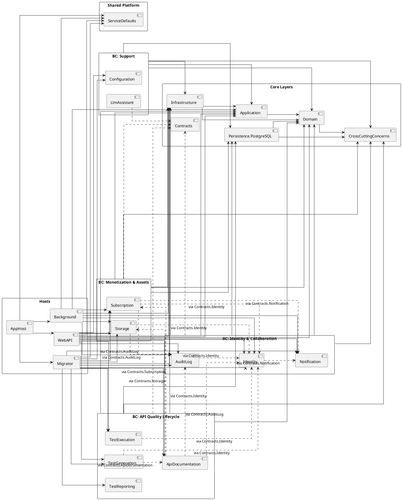

# UML Package Diagram Source (Structural Analysis)

## Static Analysis Method
- Scope scanned: all production `ClassifiedAds.*` projects (`*.csproj`), focused on `ClassifiedAds.Modules.*`, core layers, and hosts.
- Dependency sources:
  - Project reference graph from `ProjectReference` in `*.csproj`
  - Root namespace clustering by `ClassifiedAds.Modules.<Context>`
  - Cross-context coupling from `using ClassifiedAds.Contracts.*`
  - Direct cross-module import check from `using ClassifiedAds.Modules.*`
- Filtering applied for source-import scan:
  - Excluded DTOs, enums, utility/helper classes, configuration classes, mapper classes, tests, docs, generated files, scripts, and `bin/obj`.

---

## STEP 1 - Package Inventory

### Core Layers
- `ClassifiedAds.CrossCuttingConcerns`
- `ClassifiedAds.Domain`
- `ClassifiedAds.Application`
- `ClassifiedAds.Infrastructure`
- `ClassifiedAds.Persistence.PostgreSQL`
- `ClassifiedAds.Contracts`

### Feature Modules (Bounded Context Candidates)
- API Quality Lifecycle:
  - `ClassifiedAds.Modules.ApiDocumentation`
  - `ClassifiedAds.Modules.TestGeneration`
  - `ClassifiedAds.Modules.TestExecution`
  - `ClassifiedAds.Modules.TestReporting`
- Identity and Collaboration:
  - `ClassifiedAds.Modules.Identity`
  - `ClassifiedAds.Modules.AuditLog`
  - `ClassifiedAds.Modules.Notification`
- Monetization and Assets:
  - `ClassifiedAds.Modules.Subscription`
  - `ClassifiedAds.Modules.Storage`
- Support:
  - `ClassifiedAds.Modules.Configuration`
  - `ClassifiedAds.Modules.LlmAssistant`

### Shared / Cross-Cutting Components
- `ClassifiedAds.ServiceDefaults`
- `ClassifiedAds.Contracts`
- `ClassifiedAds.CrossCuttingConcerns`

### Hosts
- `ClassifiedAds.WebAPI`
- `ClassifiedAds.Background`
- `ClassifiedAds.Migrator`
- `ClassifiedAds.AppHost`

---

## STEP 2 - Dependency Matrix

### Core Dependency Directions
- `Application -> Domain`
- `Domain -> CrossCuttingConcerns`
- `Infrastructure -> Application, Domain`
- `Persistence.PostgreSQL -> Domain, CrossCuttingConcerns`

### Module-to-Core Directions
- All module projects depend on:
  - `Application`
  - `Domain`
  - `Infrastructure`
  - `Persistence.PostgreSQL`
  - `CrossCuttingConcerns`
- Most module projects also depend on `Contracts` (except `Configuration` at project-reference level).

### Host Composition Directions
- `AppHost -> WebAPI, Background, Migrator, ServiceDefaults`
- `WebAPI -> ServiceDefaults + {ApiDocumentation, AuditLog, Configuration, Identity, Notification, Storage, Subscription, TestGeneration, TestExecution} + {Application, Domain, Infrastructure}`
- `Background -> ServiceDefaults + {AuditLog, Identity, Notification, Storage, Subscription} + {Application, Infrastructure}`
- `Migrator -> ServiceDefaults + {ApiDocumentation, AuditLog, Configuration, Identity, Notification, Storage, Subscription, TestGeneration, TestExecution, TestReporting} + Infrastructure`

### Cross-Context Coupling via Contracts (Dotted)
- `ApiDocumentation ..> Identity, Subscription, Storage, AuditLog`
- `TestGeneration ..> ApiDocumentation, Identity`
- `TestExecution ..> Identity`
- `Subscription ..> Identity, Notification, AuditLog`
- `Storage ..> Identity, AuditLog`
- `Identity ..> Notification`
- `AuditLog ..> Identity`

### Coupling Path Summary
- Composition roots (`WebAPI`, `Background`, `Migrator`) orchestrate module activation directly.
- Cross-context communication is predominantly contract-based (`ClassifiedAds.Contracts.*`), not direct module project references.

---

## STEP 3 - Architectural Observations

### Architecture Type
- Current structure is a **modular monolith with shared layered core** (hybrid of layered architecture + bounded module packaging).

### Cyclic Dependency Check
- No project-reference cycles detected.
- No module-to-module direct compile-time project references detected.

### Layer Violation Check
- No detected violations such as `Domain -> Infrastructure`.
- Core dependency direction remains inward and consistent.

### Cross-Context Boundary Check
- No direct cross-module imports inside module projects (`using ClassifiedAds.Modules.<OtherContext>`) were found.
- Cross-context coupling is mostly mediated by `Contracts`, consistent with anti-corruption intent.

### Shared Kernel Candidates
- High fan-in indicates shared kernel role:
  - `Domain`
  - `Application`
  - `Infrastructure`
  - `CrossCuttingConcerns`
  - `Persistence.PostgreSQL`
  - `Contracts`

### Clean Architecture / DDD Alignment Assessment
- Strengths:
  - Clear inward core dependencies.
  - No cyclic references.
  - Contract-mediated cross-context interactions.
- Structural smells:
  - `Infrastructure` and `Persistence.PostgreSQL` are referenced by all modules (tight shared technical coupling).
  - Single global `Domain` may blur strict bounded-context autonomy.
  - Single global `Contracts` can become a coupling hotspot.
- Suggested improvements:
  - Split contracts by context (e.g., `Contracts.Identity`, `Contracts.Subscription`, ...).
  - Move module-facing abstractions to application/contract boundaries and minimize direct module reliance on infrastructure assembly.
  - Introduce explicit `SharedKernel` package (or per-context domain slices) to reduce over-centralized domain model.
  - Add architecture tests to enforce dependency rules continuously.

---

## STEP 4 - UML Package Diagram (PlantUML)

Note: bounded-context packages are visual grouping only; dependency edges are drawn at module level where coupling differs by module.

