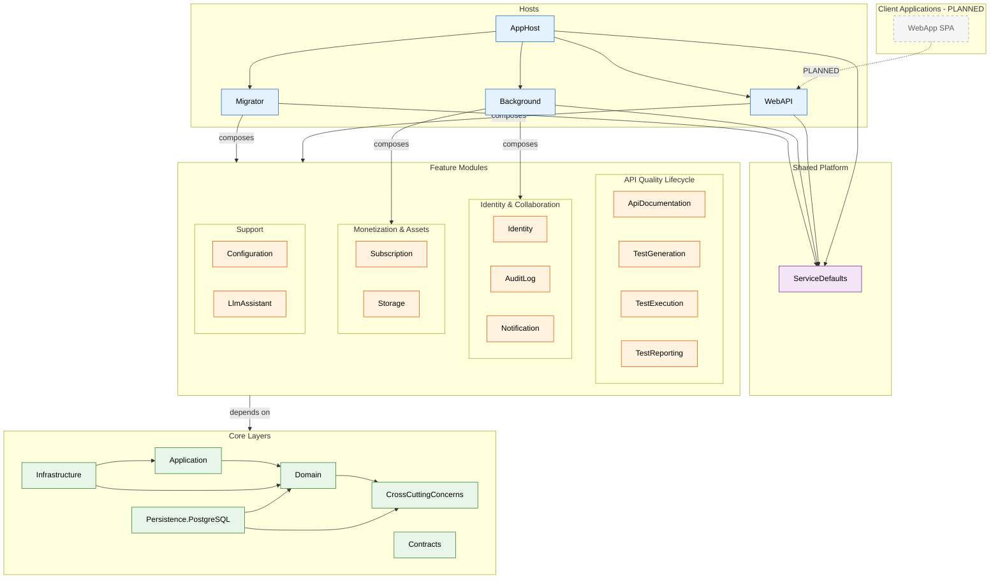
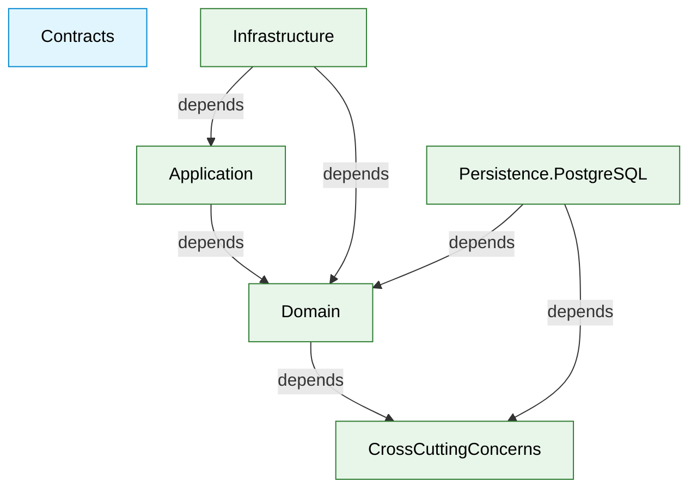
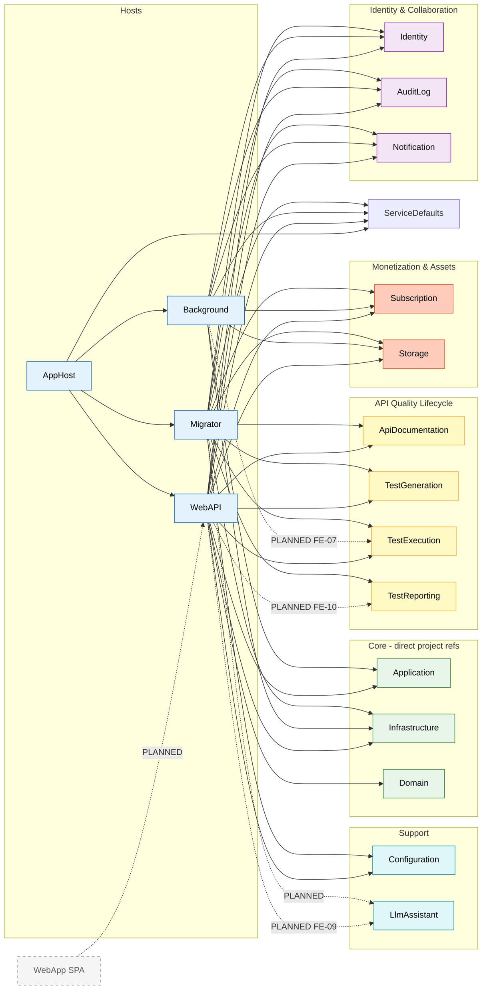
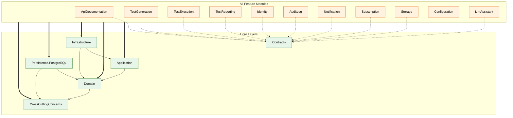
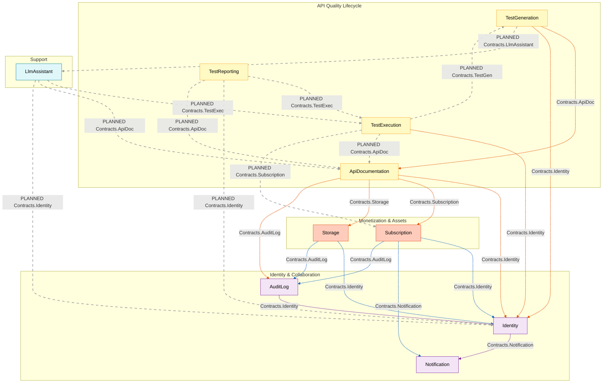

# UML Package Diagram Source (Structural Analysis)

## Static Analysis Method
- Scope scanned: all production `ClassifiedAds.*` projects (`*.csproj`), focused on `ClassifiedAds.Modules.*`, core layers, and hosts.
- Dependency sources:
  - Project reference graph from `ProjectReference` in `*.csproj`
  - Root namespace clustering by `ClassifiedAds.Modules.<Context>`
  - Cross-context coupling from `using ClassifiedAds.Contracts.*`
  - Direct cross-module import check from `using ClassifiedAds.Modules.*`
- Filtering applied for source-import scan:
  - Excluded DTOs, enums, utility/helper classes, configuration classes, mapper classes, tests, docs, generated files, scripts, and `bin/obj`.

---

## STEP 1 - Package Inventory

### Core Layers
- `ClassifiedAds.CrossCuttingConcerns`
- `ClassifiedAds.Domain`
- `ClassifiedAds.Application`
- `ClassifiedAds.Infrastructure`
- `ClassifiedAds.Persistence.PostgreSQL`
- `ClassifiedAds.Contracts`

### Feature Modules (Bounded Context Candidates)
- API Quality Lifecycle:
  - `ClassifiedAds.Modules.ApiDocumentation`
  - `ClassifiedAds.Modules.TestGeneration`
  - `ClassifiedAds.Modules.TestExecution`
  - `ClassifiedAds.Modules.TestReporting`
- Identity and Collaboration:
  - `ClassifiedAds.Modules.Identity`
  - `ClassifiedAds.Modules.AuditLog`
  - `ClassifiedAds.Modules.Notification`
- Monetization and Assets:
  - `ClassifiedAds.Modules.Subscription`
  - `ClassifiedAds.Modules.Storage`
- Support:
  - `ClassifiedAds.Modules.Configuration`
  - `ClassifiedAds.Modules.LlmAssistant`

### Shared / Cross-Cutting Components
- `ClassifiedAds.ServiceDefaults`
- `ClassifiedAds.Contracts`
- `ClassifiedAds.CrossCuttingConcerns`

### Hosts
- `ClassifiedAds.WebAPI`
- `ClassifiedAds.Background`
- `ClassifiedAds.Migrator`
- `ClassifiedAds.AppHost`

### Client Applications (Planned — Unimplemented)
- `WebApp (SPA)` — Single-page application for all user roles (Admin, Developer, Tester, Viewer). Tech stack TBD. Communicates exclusively with WebAPI host via REST API.

---

## STEP 2 - Dependency Matrix

### Core Dependency Directions
- `Application -> Domain`
- `Domain -> CrossCuttingConcerns`
- `Infrastructure -> Application, Domain`
- `Persistence.PostgreSQL -> Domain, CrossCuttingConcerns`

### Module-to-Core Directions
- All module projects depend on:
  - `Application`
  - `Domain`
  - `Infrastructure`
  - `Persistence.PostgreSQL`
  - `CrossCuttingConcerns`
- Most module projects also depend on `Contracts` (except `Configuration` at project-reference level).

### Host Composition Directions
- `AppHost -> WebAPI, Background, Migrator, ServiceDefaults`
- `WebAPI -> ServiceDefaults + {ApiDocumentation, AuditLog, Configuration, Identity, Notification, Storage, Subscription, TestGeneration, TestExecution} + {Application, Domain, Infrastructure}`
- `Background -> ServiceDefaults + {AuditLog, Identity, Notification, Storage, Subscription} + {Application, Infrastructure}`
- `Migrator -> ServiceDefaults + {ApiDocumentation, AuditLog, Configuration, Identity, Notification, Storage, Subscription, TestGeneration, TestExecution, TestReporting} + Infrastructure`

### Client-to-Host Direction (Planned)
- `WebApp (SPA) --> WebAPI` (HTTP/REST — sole entry point)

### Planned Host Composition Changes (When FEs Are Implemented)
- `WebAPI --> TestReporting` (FE-10: report API endpoints)
- `WebAPI --> LlmAssistant` (FE-09: failure explanations, FE-15/16/17: suggestion review APIs)
- `Migrator --> LlmAssistant` (LlmAssistant đã có DbContext nhưng Migrator chưa reference — cần thêm ProjectReference)
- `Background --> TestExecution` (FE-07: possible background test runners)

### Cross-Context Coupling via Contracts (Dotted)
- `ApiDocumentation ..> Identity, Subscription, Storage, AuditLog`
- `TestGeneration ..> ApiDocumentation, Identity`
- `TestExecution ..> Identity`
- `Subscription ..> Identity, Notification, AuditLog`
- `Storage ..> Identity, AuditLog`
- `Identity ..> Notification`
- `AuditLog ..> Identity`

### Planned Cross-Context Coupling via Contracts (When FEs Are Implemented)
- `TestExecution ..> TestGeneration` (FE-07: fetch test cases to execute)
- `TestExecution ..> ApiDocumentation` (FE-08: schema validation against API specs)
- `TestReporting ..> TestExecution` (FE-10: fetch execution results for reports)
- `TestReporting ..> Identity` (FE-10: user context for report ownership)
- `LlmAssistant ..> TestExecution` (FE-09: fetch failed test results for explanation)
- `LlmAssistant ..> ApiDocumentation` (FE-09: API context for failure analysis)
- `LlmAssistant ..> Identity` (FE-09/15/16/17: user context)
- `TestGeneration ..> LlmAssistant` (FE-06: LLM scenario suggestions for boundary/negative)
- `TestExecution ..> Subscription` (FE-07: plan limit check khi chạy test)
- `TestReporting ..> ApiDocumentation` (FE-10: coverage metrics — tỷ lệ endpoints đã test / tổng endpoints)

### Coupling Path Summary
- Client application communicates exclusively with WebAPI host via REST API. No direct module or Core access from client layer.
- Composition roots (`WebAPI`, `Background`, `Migrator`) orchestrate module activation directly.
- Cross-context communication is predominantly contract-based (`ClassifiedAds.Contracts.*`), not direct module project references.
- Planned couplings above are projected based on PROJECT_REQUIREMENTS.md feature flow (FE-05B → FE-10, FE-15/16/17). Actual Contracts interfaces will be created when FEs are implemented.

---

## STEP 3 - Architectural Observations

### Architecture Type
- Current structure is a **modular monolith with shared layered core** (hybrid of layered architecture + bounded module packaging).

### Cyclic Dependency Check
- No project-reference cycles detected.
- No module-to-module direct compile-time project references detected.

### Layer Violation Check
- No detected violations such as `Domain -> Infrastructure`.
- Core dependency direction remains inward and consistent.

### Cross-Context Boundary Check
- No direct cross-module imports inside module projects (`using ClassifiedAds.Modules.<OtherContext>`) were found.
- Cross-context coupling is mostly mediated by `Contracts`, consistent with anti-corruption intent.

### Shared Kernel Candidates
- High fan-in indicates shared kernel role:
  - `Domain`
  - `Application`
  - `Infrastructure`
  - `CrossCuttingConcerns`
  - `Persistence.PostgreSQL`
  - `Contracts`

### Clean Architecture / DDD Alignment Assessment
- Strengths:
  - Clear inward core dependencies.
  - No cyclic references.
  - Contract-mediated cross-context interactions.
- Structural smells:
  - `Infrastructure` and `Persistence.PostgreSQL` are referenced by all modules (tight shared technical coupling).
  - Single global `Domain` may blur strict bounded-context autonomy.
  - Single global `Contracts` can become a coupling hotspot.
- Suggested improvements:
  - Split contracts by context (e.g., `Contracts.Identity`, `Contracts.Subscription`, ...).
  - Move module-facing abstractions to application/contract boundaries and minimize direct module reliance on infrastructure assembly.
  - Introduce explicit `SharedKernel` package (or per-context domain slices) to reduce over-centralized domain model.
  - Add architecture tests to enforce dependency rules continuously.

---

## STEP 4 - UML Package Diagrams (Mermaid — draw.io Compatible)

Tất cả diagram sử dụng cú pháp Mermaid chuẩn, tương thích import trực tiếp vào draw.io (Extras > Edit Diagram > chọn Mermaid, hoặc dùng Insert > Advanced > Mermaid).

Chia thành 5 diagram riêng biệt để dễ đọc, dễ render.

**Quy ước chung:**
- Nét liền (`-->`) = project reference đã implement trong codebase
- Nét đứt (`-.->`) = contract-based coupling hoặc dependency planned
- Nét đứt + label chứa `PLANNED` = dependency chưa implement, dự kiến cho FE tương lai
- Nét dày (`==>`) = uniform dependency (tất cả module cùng depend)
- Node border nét đứt / màu xám = component planned, chưa implement

---

### Diagram 1 — High-Level Architecture Overview

Tổng quan kiến trúc phân tầng: Client > Hosts > Modules (grouped by BC) > Core Layers.

---

### Diagram 2 — Core Layers Internal Dependencies

Chi tiết dependency giữa các layer trong Core. Contracts đứng riêng vì là interface layer cho cross-module coupling.

---

### Diagram 3 — Host-to-Module Composition

Chi tiết từng Host compose những module nào. Nét liền = đã implement, nét đứt = planned cho FE tương lai.

---

### Diagram 4 — Module to Core Dependencies

Tất cả 11 module depend on cùng 5 core project references. Nét đứt riêng cho Contracts (Configuration không depend Contracts ở project-reference level).

---

### Diagram 5 — Cross-Context Coupling via Contracts

Quan trọng nhất: coupling giữa các bounded context qua Contracts (tất cả nét đứt vì là contract-based). Phân biệt implemented vs planned qua label và màu (linkStyle).

**Legend cho Diagram 5:**

| Color | Meaning |
|-------|---------|
| Orange (#E65100) | API Quality Lifecycle to other context |
| Blue (#1565C0) | Monetization & Assets to other context |
| Purple (#7B1FA2) | Identity & Collaboration internal |
| Grey (#9E9E9E) | PLANNED coupling - chưa implement |

- Tất cả đường đều là nét đứt vì cross-context coupling luôn qua Contracts (không có direct module-to-module project reference).
- Label `PLANNED` = FE chưa implement, Contracts interface sẽ được tạo khi develop FE tương ứng.
