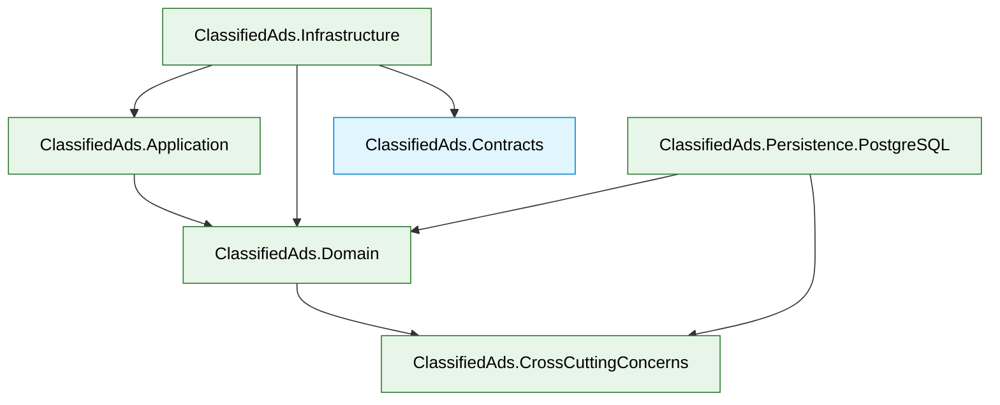
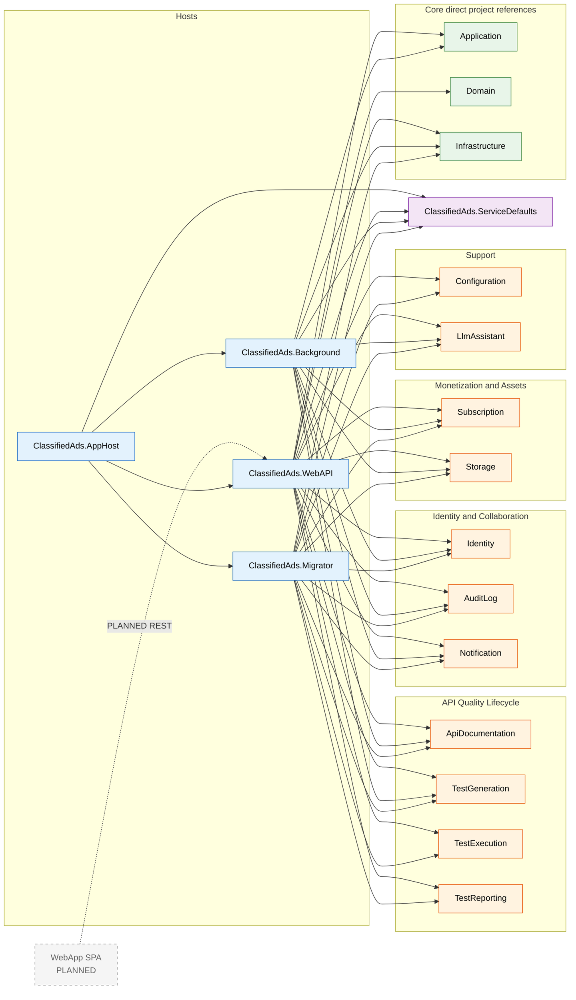
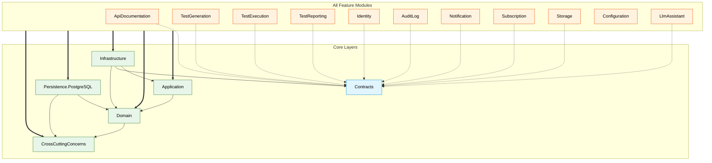
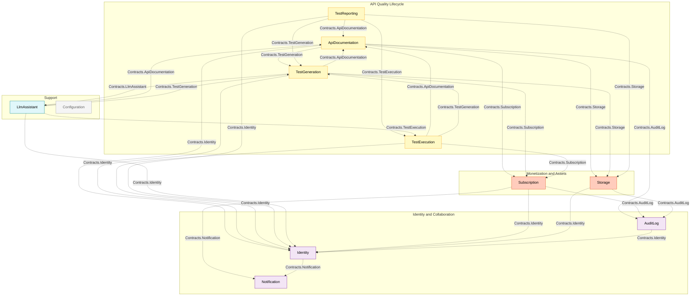

# UML Package Diagram Source - Mermaid Compatible

Tài liệu này là bản vẽ lại package diagram ở dạng **Mermaid/draw.io compatible**. Không dùng cú pháp PlantUML (`@startuml`, `package`, `skinparam`) để tránh lỗi `UnknownDiagramError` trong môi trường chỉ hỗ trợ Mermaid.

## Phạm vi và nguồn đối chiếu

- Scope: các production projects `ClassifiedAds.*` trong repo.
- Dependency thực tế: đọc từ `ProjectReference` trong `*.csproj`.
- Coupling giữa bounded contexts: đọc từ `using ClassifiedAds.Contracts.<Context>` trong source code module.
- Task classification theo `AGENTS.md`: `Docs only`; không đổi application code, EF model, migrations, Docker hoặc compose wiring.

## Quy ước

- `-->` = dependency/project reference thực tế.
- `-.->` = dependency qua contracts hoặc planned client dependency.
- `==>` = dependency fan-out mạnh/uniform dependency.
- `PLANNED` = chưa có project/package implement trong repo.
- Mermaid subgraph được dùng như package/container vì Mermaid không có UML package diagram native.

---

## 1. Package Hierarchy

### 1.1 Core Packages

- `ClassifiedAds.Application`
- `ClassifiedAds.Domain`
- `ClassifiedAds.Infrastructure`
- `ClassifiedAds.Persistence.PostgreSQL`
- `ClassifiedAds.Contracts`
- `ClassifiedAds.CrossCuttingConcerns`

### 1.2 Feature Packages

- `ClassifiedAds.Modules.ApiDocumentation`
- `ClassifiedAds.Modules.TestGeneration`
- `ClassifiedAds.Modules.TestExecution`
- `ClassifiedAds.Modules.TestReporting`
- `ClassifiedAds.Modules.Identity`
- `ClassifiedAds.Modules.AuditLog`
- `ClassifiedAds.Modules.Notification`
- `ClassifiedAds.Modules.Subscription`
- `ClassifiedAds.Modules.Storage`
- `ClassifiedAds.Modules.Configuration`
- `ClassifiedAds.Modules.LlmAssistant`

### 1.3 Host Packages

- `ClassifiedAds.AppHost`
- `ClassifiedAds.WebAPI`
- `ClassifiedAds.Background`
- `ClassifiedAds.Migrator`
- `ClassifiedAds.ServiceDefaults`

### 1.4 Planned Client Package

- `WebApp SPA` — planned frontend client, not implemented as a repo project yet.

---

## 2. Mermaid Package Diagrams

### Diagram 1 — Overall Architecture

```mermaid
flowchart TB
    subgraph ClientApps["Client Applications"]
        WebApp["WebApp SPA<br/>PLANNED"]
    end

    subgraph Hosts["Hosts"]
        AppHost["ClassifiedAds.AppHost"]
        WebAPI["ClassifiedAds.WebAPI"]
        Background["ClassifiedAds.Background"]
        Migrator["ClassifiedAds.Migrator"]
        ServiceDefaults["ClassifiedAds.ServiceDefaults"]
    end

    subgraph FeatureModules["Feature Modules"]
        direction TB
        subgraph BC1["API Quality Lifecycle"]
            ApiDoc["ClassifiedAds.Modules.ApiDocumentation"]
            TestGen["ClassifiedAds.Modules.TestGeneration"]
            TestExec["ClassifiedAds.Modules.TestExecution"]
            TestRep["ClassifiedAds.Modules.TestReporting"]
        end
        subgraph BC2["Identity and Collaboration"]
            Identity["ClassifiedAds.Modules.Identity"]
            AuditLog["ClassifiedAds.Modules.AuditLog"]
            Notification["ClassifiedAds.Modules.Notification"]
        end
        subgraph BC3["Monetization and Assets"]
            Subscription["ClassifiedAds.Modules.Subscription"]
            Storage["ClassifiedAds.Modules.Storage"]
        end
        subgraph BC4["Support"]
            Configuration["ClassifiedAds.Modules.Configuration"]
            LlmAssistant["ClassifiedAds.Modules.LlmAssistant"]
        end
    end

    subgraph Core["Core Layers"]
        Application["ClassifiedAds.Application"]
        Domain["ClassifiedAds.Domain"]
        Infrastructure["ClassifiedAds.Infrastructure"]
        Postgres["ClassifiedAds.Persistence.PostgreSQL"]
        Contracts["ClassifiedAds.Contracts"]
        CCC["ClassifiedAds.CrossCuttingConcerns"]
    end

    WebApp -.->|PLANNED REST| WebAPI

    AppHost --> WebAPI
    AppHost --> Background
    AppHost --> Migrator
    AppHost --> ServiceDefaults

    WebAPI --> ServiceDefaults
    Background --> ServiceDefaults
    Migrator --> ServiceDefaults

    WebAPI --> FeatureModules
    Background --> ApiDoc
    Background --> TestGen
    Background --> BC2
    Background --> BC3
    Background --> LlmAssistant
    Migrator --> FeatureModules

    FeatureModules ==> Application
    FeatureModules ==> Domain
    FeatureModules ==> Infrastructure
    FeatureModules ==> Postgres
    FeatureModules ==> CCC
    FeatureModules -.-> Contracts

    Application --> Domain
    Domain --> CCC
    Infrastructure --> Application
    Infrastructure --> Contracts
    Infrastructure --> Domain
    Postgres --> Domain
    Postgres --> CCC

    classDef host fill:#E3F2FD,stroke:#1565C0,color:#000
    classDef module fill:#FFF3E0,stroke:#E65100,color:#000
    classDef core fill:#E8F5E9,stroke:#2E7D32,color:#000
    classDef shared fill:#F3E5F5,stroke:#7B1FA2,color:#000
    classDef planned fill:#F5F5F5,stroke:#9E9E9E,stroke-dasharray:5 5,color:#616161

    class WebApp planned
    class AppHost,WebAPI,Background,Migrator host
    class ApiDoc,TestGen,TestExec,TestRep,Identity,AuditLog,Notification,Subscription,Storage,Configuration,LlmAssistant module
    class Application,Domain,Infrastructure,Postgres,Contracts,CCC core
    class ServiceDefaults shared
```

---

### Diagram 2 — Core Dependencies

```mermaid
flowchart TB
    Application["ClassifiedAds.Application"]
    Domain["ClassifiedAds.Domain"]
    CCC["ClassifiedAds.CrossCuttingConcerns"]
    Infrastructure["ClassifiedAds.Infrastructure"]
    Postgres["ClassifiedAds.Persistence.PostgreSQL"]
    Contracts["ClassifiedAds.Contracts"]

    Application --> Domain
    Domain --> CCC
    Infrastructure --> Application
    Infrastructure --> Contracts
    Infrastructure --> Domain
    Postgres --> Domain
    Postgres --> CCC

    classDef core fill:#E8F5E9,stroke:#2E7D32,color:#000
    classDef contracts fill:#E1F5FE,stroke:#0288D1,color:#000

    class Application,Domain,CCC,Infrastructure,Postgres core
    class Contracts contracts
```

---

### Diagram 3 — Host Composition

```mermaid
flowchart LR
    WebApp["WebApp SPA<br/>PLANNED"]

    subgraph Hosts["Hosts"]
        AppHost["ClassifiedAds.AppHost"]
        WebAPI["ClassifiedAds.WebAPI"]
        Background["ClassifiedAds.Background"]
        Migrator["ClassifiedAds.Migrator"]
    end

    ServiceDefaults["ClassifiedAds.ServiceDefaults"]

    subgraph APIQuality["API Quality Lifecycle"]
        ApiDoc["ApiDocumentation"]
        TestGen["TestGeneration"]
        TestExec["TestExecution"]
        TestRep["TestReporting"]
    end

    subgraph IdentityCollab["Identity and Collaboration"]
        Identity["Identity"]
        AuditLog["AuditLog"]
        Notification["Notification"]
    end

    subgraph MonetizationAssets["Monetization and Assets"]
        Subscription["Subscription"]
        Storage["Storage"]
    end

    subgraph Support["Support"]
        Configuration["Configuration"]
        LlmAssistant["LlmAssistant"]
    end

    subgraph HostCore["Core direct project references"]
        Application["Application"]
        Domain["Domain"]
        Infrastructure["Infrastructure"]
    end

    WebApp -.->|PLANNED REST| WebAPI

    AppHost --> WebAPI
    AppHost --> Background
    AppHost --> Migrator
    AppHost --> ServiceDefaults

    WebAPI --> ServiceDefaults
    Background --> ServiceDefaults
    Migrator --> ServiceDefaults

    WebAPI --> ApiDoc
    WebAPI --> TestGen
    WebAPI --> TestExec
    WebAPI --> TestRep
    WebAPI --> Identity
    WebAPI --> AuditLog
    WebAPI --> Notification
    WebAPI --> Subscription
    WebAPI --> Storage
    WebAPI --> Configuration
    WebAPI --> LlmAssistant

    Background --> ApiDoc
    Background --> TestGen
    Background --> Identity
    Background --> AuditLog
    Background --> Notification
    Background --> Subscription
    Background --> Storage
    Background --> LlmAssistant

    Migrator --> ApiDoc
    Migrator --> TestGen
    Migrator --> TestExec
    Migrator --> TestRep
    Migrator --> Identity
    Migrator --> AuditLog
    Migrator --> Notification
    Migrator --> Subscription
    Migrator --> Storage
    Migrator --> Configuration
    Migrator --> LlmAssistant

    WebAPI --> Application
    WebAPI --> Domain
    WebAPI --> Infrastructure
    Background --> Application
    Background --> Infrastructure
    Migrator --> Infrastructure

    classDef host fill:#E3F2FD,stroke:#1565C0,color:#000
    classDef module fill:#FFF3E0,stroke:#E65100,color:#000
    classDef core fill:#E8F5E9,stroke:#2E7D32,color:#000
    classDef shared fill:#F3E5F5,stroke:#7B1FA2,color:#000
    classDef planned fill:#F5F5F5,stroke:#9E9E9E,stroke-dasharray:5 5,color:#616161

    class WebApp planned
    class AppHost,WebAPI,Background,Migrator host
    class ApiDoc,TestGen,TestExec,TestRep,Identity,AuditLog,Notification,Subscription,Storage,Configuration,LlmAssistant module
    class Application,Domain,Infrastructure core
    class ServiceDefaults shared
```

---

### Diagram 4 — Module to Core Dependencies

```mermaid
flowchart TB
    subgraph Modules["All Feature Modules"]
        direction LR
        ApiDoc["ApiDocumentation"]
        TestGen["TestGeneration"]
        TestExec["TestExecution"]
        TestRep["TestReporting"]
        Identity["Identity"]
        AuditLog["AuditLog"]
        Notification["Notification"]
        Subscription["Subscription"]
        Storage["Storage"]
        Configuration["Configuration"]
        LlmAssistant["LlmAssistant"]
    end

    subgraph Core["Core Layers"]
        Application["Application"]
        Domain["Domain"]
        Infrastructure["Infrastructure"]
        Postgres["Persistence.PostgreSQL"]
        CCC["CrossCuttingConcerns"]
        Contracts["Contracts"]
    end

    Modules ==> Application
    Modules ==> Domain
    Modules ==> Infrastructure
    Modules ==> Postgres
    Modules ==> CCC

    ApiDoc -.-> Contracts
    TestGen -.-> Contracts
    TestExec -.-> Contracts
    TestRep -.-> Contracts
    Identity -.-> Contracts
    AuditLog -.-> Contracts
    Notification -.-> Contracts
    Subscription -.-> Contracts
    Storage -.-> Contracts
    LlmAssistant -.-> Contracts

    Application --> Domain
    Domain --> CCC
    Infrastructure --> Application
    Infrastructure --> Contracts
    Infrastructure --> Domain
    Postgres --> Domain
    Postgres --> CCC

    classDef module fill:#FFF3E0,stroke:#E65100,color:#000
    classDef core fill:#E8F5E9,stroke:#2E7D32,color:#000
    classDef contract fill:#E1F5FE,stroke:#0288D1,color:#000

    class ApiDoc,TestGen,TestExec,TestRep,Identity,AuditLog,Notification,Subscription,Storage,Configuration,LlmAssistant module
    class Application,Domain,Infrastructure,Postgres,CCC core
    class Contracts contract
```

> `Configuration` không có `ProjectReference` tới `ClassifiedAds.Contracts`; các module còn lại có.

---

### Diagram 5 — Cross-Context Coupling via Contracts

```mermaid
flowchart TB
    subgraph APIQuality["API Quality Lifecycle"]
        ApiDoc["ApiDocumentation"]
        TestGen["TestGeneration"]
        TestExec["TestExecution"]
        TestRep["TestReporting"]
    end

    subgraph IdentityCollab["Identity and Collaboration"]
        Identity["Identity"]
        AuditLog["AuditLog"]
        Notification["Notification"]
    end

    subgraph MonetizationAssets["Monetization and Assets"]
        Subscription["Subscription"]
        Storage["Storage"]
    end

    subgraph Support["Support"]
        LlmAssistant["LlmAssistant"]
        Configuration["Configuration"]
    end

    ApiDoc -.->|Contracts.Identity| Identity
    ApiDoc -.->|Contracts.Subscription| Subscription
    ApiDoc -.->|Contracts.Storage| Storage
    ApiDoc -.->|Contracts.AuditLog| AuditLog
    ApiDoc -.->|Contracts.TestGeneration| TestGen

    TestGen -.->|Contracts.ApiDocumentation| ApiDoc
    TestGen -.->|Contracts.Identity| Identity
    TestGen -.->|Contracts.Subscription| Subscription
    TestGen -.->|Contracts.Storage| Storage
    TestGen -.->|Contracts.LlmAssistant| LlmAssistant

    TestExec -.->|Contracts.ApiDocumentation| ApiDoc
    TestExec -.->|Contracts.Identity| Identity
    TestExec -.->|Contracts.Subscription| Subscription
    TestExec -.->|Contracts.TestGeneration| TestGen

    TestRep -.->|Contracts.ApiDocumentation| ApiDoc
    TestRep -.->|Contracts.Identity| Identity
    TestRep -.->|Contracts.Storage| Storage
    TestRep -.->|Contracts.TestExecution| TestExec
    TestRep -.->|Contracts.TestGeneration| TestGen

    LlmAssistant -.->|Contracts.ApiDocumentation| ApiDoc
    LlmAssistant -.->|Contracts.Identity| Identity
    LlmAssistant -.->|Contracts.TestExecution| TestExec
    LlmAssistant -.->|Contracts.TestGeneration| TestGen

    Subscription -.->|Contracts.Identity| Identity
    Subscription -.->|Contracts.Notification| Notification
    Subscription -.->|Contracts.AuditLog| AuditLog

    Storage -.->|Contracts.Identity| Identity
    Storage -.->|Contracts.AuditLog| AuditLog

    Identity -.->|Contracts.Notification| Notification
    AuditLog -.->|Contracts.Identity| Identity

    classDef api fill:#FFF9C4,stroke:#F9A825,color:#000
    classDef id fill:#F3E5F5,stroke:#7B1FA2,color:#000
    classDef mon fill:#FFCCBC,stroke:#E64A19,color:#000
    classDef sup fill:#E0F7FA,stroke:#00838F,color:#000
    classDef isolated fill:#F5F5F5,stroke:#9E9E9E,color:#616161

    class ApiDoc,TestGen,TestExec,TestRep api
    class Identity,AuditLog,Notification id
    class Subscription,Storage mon
    class LlmAssistant sup
    class Configuration isolated
```

> `Notification` và `Configuration` không depend sang context khác qua `Contracts` theo source scan hiện tại.

---

## 3. Important Notes

Nếu render trong **Mermaid/draw.io**, không dùng các cú pháp PlantUML sau:

- `@startuml`
- `@enduml`
- `skinparam`
- `package` của PlantUML

Các diagram ở trên đã dùng hoàn toàn Mermaid `flowchart` + `subgraph` để biểu diễn package/container. Nếu muốn dùng PlantUML strict package diagram, cần đổi renderer sang PlantUML thay vì Mermaid parser.
