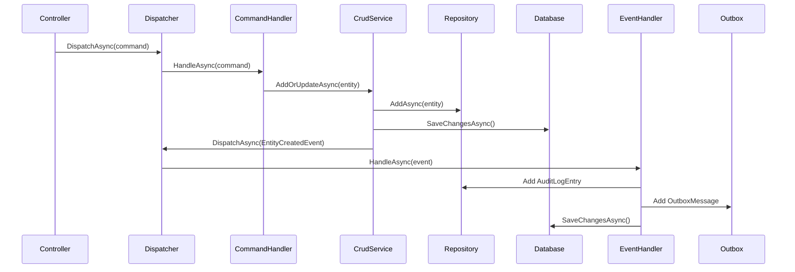
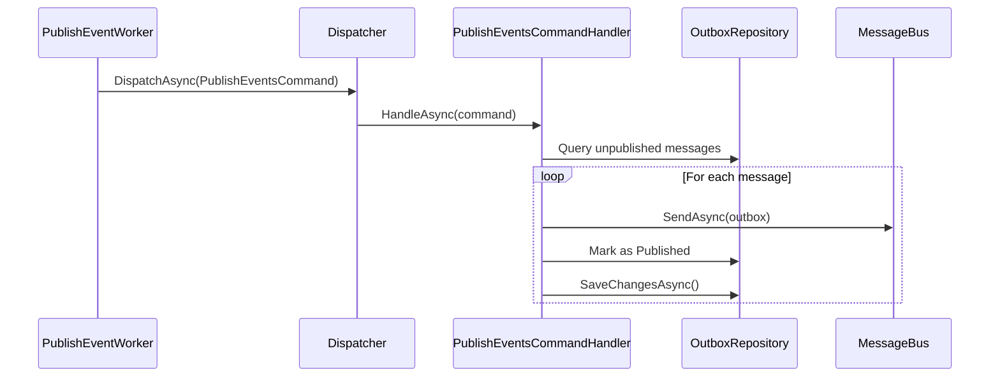
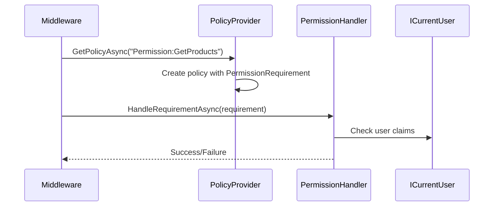
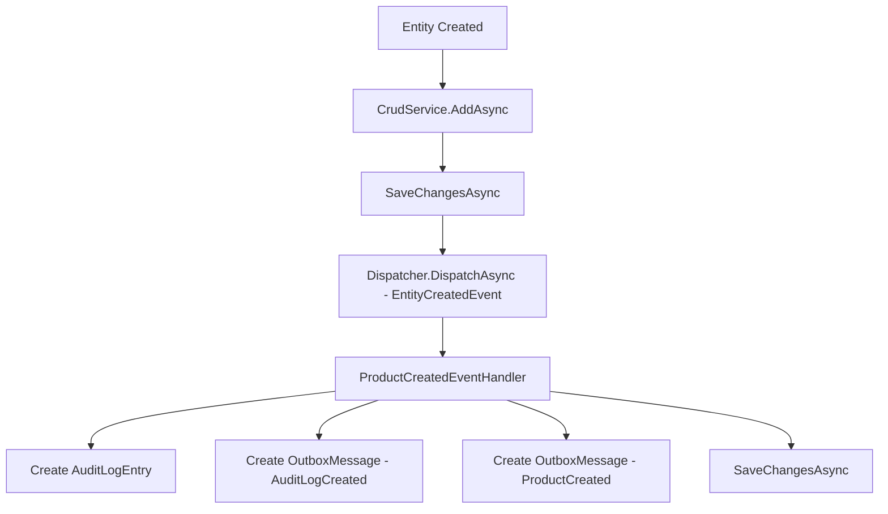
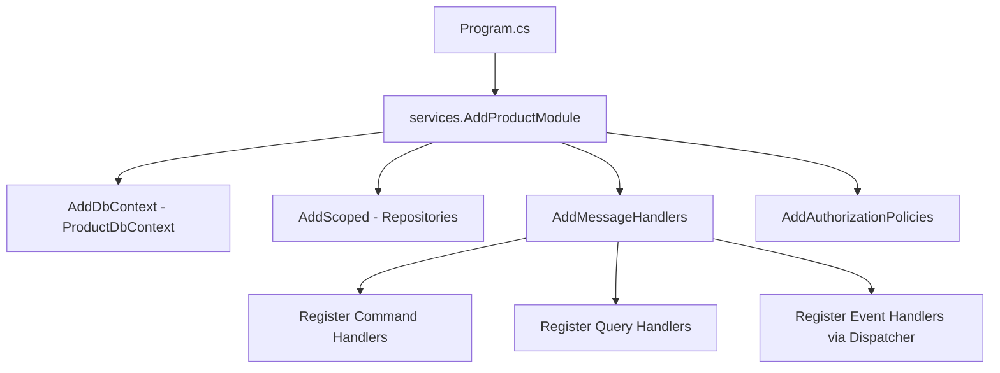

# Architecture Documentation Validation Report

> **Date**: December 27, 2025  
> **Scope**: All markdown files under `/docs-architecture/`  
> **Purpose**: Verify documentation accuracy against actual codebase

---

## Table of Contents

- [Summary](#summary)
- [Verified Claims](#verified-claims)
- [Corrections Made](#corrections-made)
- [Remaining Uncertainties](#remaining-uncertainties)
- [Key Entrypoints](#key-entrypoints)
- [Critical Runtime Flows](#critical-runtime-flows)
- [Guidance to Extend Safely](#guidance-to-extend-safely)

---

## Summary

| Metric | Count |
|--------|-------|
| Documents Reviewed | 13 |
| Claims Verified | 47 |
| Corrections Made | 2 |
| Remaining Uncertainties | 3 |
| Critical Flows Documented | 5 |

**Overall Assessment**: Documentation is **accurate and well-grounded** in the codebase. Minor path corrections applied. All major architectural patterns verified.

---

## Verified Claims

### Core Architecture

| Claim | Verified Location | Status |
|-------|-------------------|--------|
| Custom Dispatcher (not MediatR) | [Dispatcher.cs](../ClassifiedAds.Application/Common/Dispatcher.cs) | ✅ Verified |
| CQRS pattern implementation | `ICommand`, `IQuery<T>`, `ICommandHandler<T>`, `IQueryHandler<T,R>` | ✅ Verified |
| DbContext-per-module pattern | `ProductDbContext`, `IdentityDbContext`, etc. | ✅ Verified |
| Outbox pattern for reliable events | [OutboxMessage.cs](../ClassifiedAds.Modules.Product/Entities/OutboxMessage.cs) | ✅ Verified |
| Entity base class with Id, RowVersion | [Entity.cs](../ClassifiedAds.Domain/Entities/Entity.cs) | ✅ Verified |

### CQRS & Dispatcher

| Claim | Verified Location | Status |
|-------|-------------------|--------|
| `ICommand` marker interface | [ICommandHandler.cs](../ClassifiedAds.Application/ICommandHandler.cs) | ✅ Verified |
| `IQuery<TResult>` interface | [IQuery.cs](../ClassifiedAds.Application/Common/Queries/IQuery.cs) | ✅ Verified |
| `IQueryHandler<TQuery, TResult>` | [IQueryHandler.cs](../ClassifiedAds.Application/Common/Queries/IQueryHandler.cs) | ✅ Verified |
| Domain event dispatch via Dispatcher | `Dispatcher.DispatchAsync(IDomainEvent)` method | ✅ Verified |
| Handler auto-registration | `AddMessageHandlers(Assembly)` in [ApplicationServicesExtensions.cs](../ClassifiedAds.Application/ApplicationServicesExtensions.cs) | ✅ Verified |

### Domain Events & Outbox

| Claim | Verified Location | Status |
|-------|-------------------|--------|
| `IDomainEvent` interface | [IDomainEvent.cs](../ClassifiedAds.Domain/Events/IDomainEvent.cs) | ✅ Verified |
| `IDomainEventHandler<T>` interface | [IDomainEventHandler.cs](../ClassifiedAds.Domain/Events/IDomainEventHandler.cs) | ✅ Verified |
| `EntityCreatedEvent<T>` generic event | [EntityCreatedEvent.cs](../ClassifiedAds.Domain/Events/EntityCreatedEvent.cs) | ✅ Verified |
| CrudService dispatches events after save | [CrudService.cs](../ClassifiedAds.Application/Common/Services/CrudService.cs) | ✅ Verified |
| PublishEventWorker polls outbox | [PublishEventWorker.cs](../ClassifiedAds.Modules.Product/HostedServices/PublishEventWorker.cs) | ✅ Verified |
| ActivityId preserved for distributed tracing | [ProductDbContext.cs](../ClassifiedAds.Modules.Product/Persistence/ProductDbContext.cs) `SetOutboxActivityId()` | ✅ Verified |

### Repository & Unit of Work

| Claim | Verified Location | Status |
|-------|-------------------|--------|
| `IRepository<TEntity, TKey>` interface | [IRepository.cs](../ClassifiedAds.Domain/Repositories/IRepository.cs) | ✅ Verified |
| `IUnitOfWork` interface | [IUnitOfWork.cs](../ClassifiedAds.Domain/Repositories/IUnitOfWork.cs) | ✅ Verified |
| Bulk operations supported | `BulkInsertAsync`, `BulkUpdateAsync`, `BulkMergeAsync`, `BulkDeleteAsync` in IRepository | ✅ Verified |

### Messaging

| Claim | Verified Location | Status |
|-------|-------------------|--------|
| `IMessageBus` interface | [IMessageBus.cs](../ClassifiedAds.Domain/Infrastructure/Messaging/IMessageBus.cs) | ✅ Verified |
| RabbitMQ, Kafka, Azure Service Bus support | [MessagingCollectionExtensions.cs](../ClassifiedAds.Infrastructure/Messaging/MessagingCollectionExtensions.cs) | ✅ Verified |

### Authentication & Authorization

| Claim | Verified Location | Status |
|-------|-------------------|--------|
| Dual JWT scheme support | [Program.cs](../ClassifiedAds.WebAPI/Program.cs) lines 104-126 | ✅ Verified |
| `ICurrentUser` abstraction | [ICurrentUser.cs](../ClassifiedAds.Contracts/Identity/Services/ICurrentUser.cs) | ✅ Verified |
| Permission-based authorization | [Permissions.cs](../ClassifiedAds.Modules.Product/Authorization/Permissions.cs) | ✅ Verified |
| `AddAuthorizationPolicies` extension | [ServiceCollectionExtensions.cs](../ClassifiedAds.Infrastructure/Web/Authorization/ServiceCollectionExtensions.cs) | ✅ Verified |

### Observability

| Claim | Verified Location | Status |
|-------|-------------------|--------|
| OpenTelemetry tracing & metrics | [OpenTelemetryExtensions.cs](../ClassifiedAds.Infrastructure/Monitoring/OpenTelemetry/OpenTelemetryExtensions.cs) | ✅ Verified |
| Zipkin exporter support | `AddZipkinExporter` in OpenTelemetryExtensions | ✅ Verified |
| OTLP exporter support | `AddOtlpExporter` in OpenTelemetryExtensions | ✅ Verified |
| Azure Monitor support | `AddAzureMonitorTraceExporter`, `AddAzureMonitorMetricExporter` | ✅ Verified |

### Host Applications

| Claim | Verified Location | Status |
|-------|-------------------|--------|
| WebAPI composition root | [ClassifiedAds.WebAPI/Program.cs](../ClassifiedAds.WebAPI/Program.cs) | ✅ Verified |
| Background worker host | [ClassifiedAds.Background/Program.cs](../ClassifiedAds.Background/Program.cs) | ✅ Verified |
| Migrator with DbUp scripts | [ClassifiedAds.Migrator/Program.cs](../ClassifiedAds.Migrator/Program.cs) | ✅ Verified |
| .NET Aspire orchestration | [ClassifiedAds.AspireAppHost/Program.cs](../ClassifiedAds.AspireAppHost/Program.cs) | ✅ Verified |

### Docker & DevOps

| Claim | Verified Location | Status |
|-------|-------------------|--------|
| Docker Compose with db, rabbitmq, mailhog | [docker-compose.yml](../docker-compose.yml) | ✅ Verified |
| Service dependencies configured | `depends_on` in docker-compose.yml | ✅ Verified |

---

## Corrections Made

### 1. IQuery/IQueryHandler Path Clarification

**File**: [04-cqrs-and-mediator.md](04-cqrs-and-mediator.md)

**Issue**: Comments indicated paths were "inferred from usage" when actual files exist.

**Correction**: Updated to accurate paths and added "Where in code?" references:
- `ClassifiedAds.Application/Common/Queries/IQuery.cs`
- `ClassifiedAds.Application/Common/Queries/IQueryHandler.cs`

### 2. Glossary Query Handler Reference

**File**: [appendix-glossary.md](appendix-glossary.md)

**Issue**: `IQueryHandler` reference pointed to `ClassifiedAds.Application/IQueryHandler.cs` (incorrect path).

**Correction**: Updated to correct paths:
- Query: `ClassifiedAds.Application/Common/Queries/IQuery.cs`
- QueryHandler: `ClassifiedAds.Application/Common/Queries/IQueryHandler.cs`

---

## Remaining Uncertainties

### 1. Scrutor Usage

**Claim**: Documentation mentions Scrutor for assembly scanning.

**Finding**: Could not locate explicit Scrutor package reference. The `AddMessageHandlers` extension uses manual reflection-based assembly scanning via `assembly.GetTypes()` in [ApplicationServicesExtensions.cs](../ClassifiedAds.Application/ApplicationServicesExtensions.cs).

**Recommendation**: Verify if Scrutor is actually used or if the documentation should clarify that assembly scanning is custom-implemented.

### 2. MigrateXxxDb Extension Method Overloads

**Observation**: Both `IApplicationBuilder` and `IHost` overloads exist for migration methods (e.g., `MigrateProductDb`). Documentation primarily references the `IHost` overload.

**Impact**: Low - both work correctly.

### 3. External IdentityServer Location

**Finding**: IdentityServer (OpenIddict) is referenced as being in `../IdentityServers/OpenIddict/` which is outside the main solution folder.

**Recommendation**: Documentation correctly notes this is a separate project, but users should be aware it's not part of the main ModularMonolith solution.

---

## Key Entrypoints

### HTTP Request Entry

```
Client HTTP Request
    └── ClassifiedAds.WebAPI/Program.cs
        └── app.MapControllers()
            └── ClassifiedAds.Modules.*/Controllers/*Controller.cs
                └── Dispatcher.DispatchAsync(command/query)
```

**Primary Files**:
- [ClassifiedAds.WebAPI/Program.cs](../ClassifiedAds.WebAPI/Program.cs) - Composition root
- [Dispatcher.cs](../ClassifiedAds.Application/Common/Dispatcher.cs) - Command/Query routing

### Background Processing Entry

```
Background Host
    └── ClassifiedAds.Background/Program.cs
        └── AddHostedServicesXxxModule()
            └── PublishEventWorker.ExecuteAsync()
                └── PublishEventsCommand
```

**Primary Files**:
- [ClassifiedAds.Background/Program.cs](../ClassifiedAds.Background/Program.cs) - Worker host
- [PublishEventWorker.cs](../ClassifiedAds.Modules.Product/HostedServices/PublishEventWorker.cs) - Outbox publisher

### Database Migration Entry

```
Migrator
    └── ClassifiedAds.Migrator/Program.cs
        └── app.MigrateXxxDb()
            └── XxxDbContext.Database.Migrate()
        └── DbUp.DeployChanges (SQL scripts)
```

**Primary File**: [ClassifiedAds.Migrator/Program.cs](../ClassifiedAds.Migrator/Program.cs)

### Module Registration Entry

```
Module Registration
    └── services.AddXxxModule(opt => ...)
        └── ServiceCollectionExtensions.cs
            ├── DbContext registration
            ├── Repository registration
            ├── AddMessageHandlers()
            └── AddAuthorizationPolicies()
```

**Example**: [ClassifiedAds.Modules.Product/ServiceCollectionExtensions.cs](../ClassifiedAds.Modules.Product/ServiceCollectionExtensions.cs)

---

## Critical Runtime Flows

### Flow 1: HTTP Request → Command → Database → Event → Outbox



**Key Insight**: Events are dispatched AFTER the primary entity is saved, ensuring data consistency.

### Flow 2: Outbox → Message Bus



**Key Insight**: Each message is marked as published immediately after sending, ensuring at-least-once delivery.

### Flow 3: Authorization Check



**Key Insight**: Policies are created dynamically based on `Permission:*` claim prefixes.

### Flow 4: Domain Event Handler Chain



**Key Insight**: A single entity creation can trigger multiple outbox messages for different event types.

### Flow 5: Module Registration Chain



**Key Insight**: `AddMessageHandlers` handles both DI registration AND event handler tracking in `Dispatcher._eventHandlers`.

---

## Guidance to Extend Safely

### Adding a New Module

1. **Create project** following folder convention in [11-extension-playbook.md](11-extension-playbook.md)
2. **Add project references** to Application, Contracts, Domain, Infrastructure, Persistence.SqlServer
3. **Create DbContext** inheriting from `DbContextUnitOfWork<T>`
4. **Create ServiceCollectionExtensions** with:
   - `AddXxxModule(Action<XxxModuleOptions>)` - core registration
   - `AddXxxModule(IMvcBuilder)` - controller registration
   - `MigrateXxxDb(IHost)` - migration method
   - `AddHostedServicesXxxModule()` - background services (if needed)
5. **Register in hosts**:
   - WebAPI: `services.AddXxxModule(...).AddApplicationServices()` and `.AddXxxModule()` on MvcBuilder
   - Background: `services.AddXxxModule(...).AddHostedServicesXxxModule()`
   - Migrator: `app.MigrateXxxDb()`

### Adding a New Entity

1. Create entity class inheriting `Entity<Guid>, IAggregateRoot`
2. Create EF configuration class implementing `IEntityTypeConfiguration<T>`
3. Register repository: `services.AddScoped<IRepository<T, Guid>, Repository<T, Guid>>()`
4. Create migration: `dotnet ef migrations add AddXxx --context XxxDbContext`

### Adding Commands/Queries

1. Create command/query class implementing `ICommand` or `IQuery<TResult>`
2. Create handler class implementing `ICommandHandler<T>` or `IQueryHandler<T, R>`
3. Handlers are auto-registered via `AddMessageHandlers(Assembly)`

### Adding Domain Event Handlers

1. Create handler implementing `IDomainEventHandler<TEvent>`
2. Handler is auto-registered via `Dispatcher.RegisterEventHandlers(Assembly, services)`
3. Consider writing to outbox for cross-module communication

### Adding Authorization

1. Define permission constants: `public const string GetXxx = "Permission:GetXxx";`
2. Apply to controller: `[Authorize(Permissions.GetXxx)]`
3. Policies are auto-created by `CustomAuthorizationPolicyProvider`

### Safe Practices

| Practice | Rationale |
|----------|-----------|
| Use `ICrudService<T>` for CRUD operations | Automatically dispatches domain events |
| Write to Outbox instead of direct message bus calls | Ensures transactional consistency |
| Use `ICurrentUser` for user context | Works in both web and background contexts |
| Follow Product module as reference | It's the canonical implementation |
| Run Migrator before WebAPI/Background | Ensures database schema is up to date |

---

## Document Status

| Document | Last Verified | Status |
|----------|---------------|--------|
| [README.md](README.md) | 2025-12-27 | ✅ Accurate |
| [01-solution-structure.md](01-solution-structure.md) | 2025-12-27 | ✅ Accurate |
| [02-architecture-overview.md](02-architecture-overview.md) | 2025-12-27 | ✅ Accurate |
| [03-request-lifecycle.md](03-request-lifecycle.md) | 2025-12-27 | ✅ Accurate |
| [04-cqrs-and-mediator.md](04-cqrs-and-mediator.md) | 2025-12-27 | ✅ Corrected |
| [05-persistence-and-transactions.md](05-persistence-and-transactions.md) | 2025-12-27 | ✅ Accurate |
| [06-events-and-outbox.md](06-events-and-outbox.md) | 2025-12-27 | ✅ Accurate |
| [07-modules.md](07-modules.md) | 2025-12-27 | ✅ Accurate |
| [08-authentication-authorization.md](08-authentication-authorization.md) | 2025-12-27 | ✅ Accurate |
| [09-observability-and-crosscutting.md](09-observability-and-crosscutting.md) | 2025-12-27 | ✅ Accurate |
| [10-devops-and-local-development.md](10-devops-and-local-development.md) | 2025-12-27 | ✅ Accurate |
| [11-extension-playbook.md](11-extension-playbook.md) | 2025-12-27 | ✅ Accurate |
| [appendix-glossary.md](appendix-glossary.md) | 2025-12-27 | ✅ Corrected |

---

*Generated by architecture documentation validation pass*
