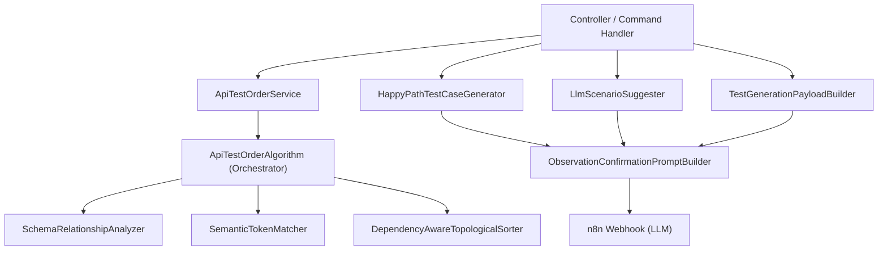
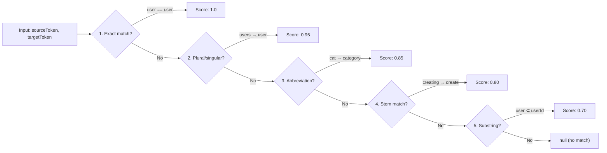
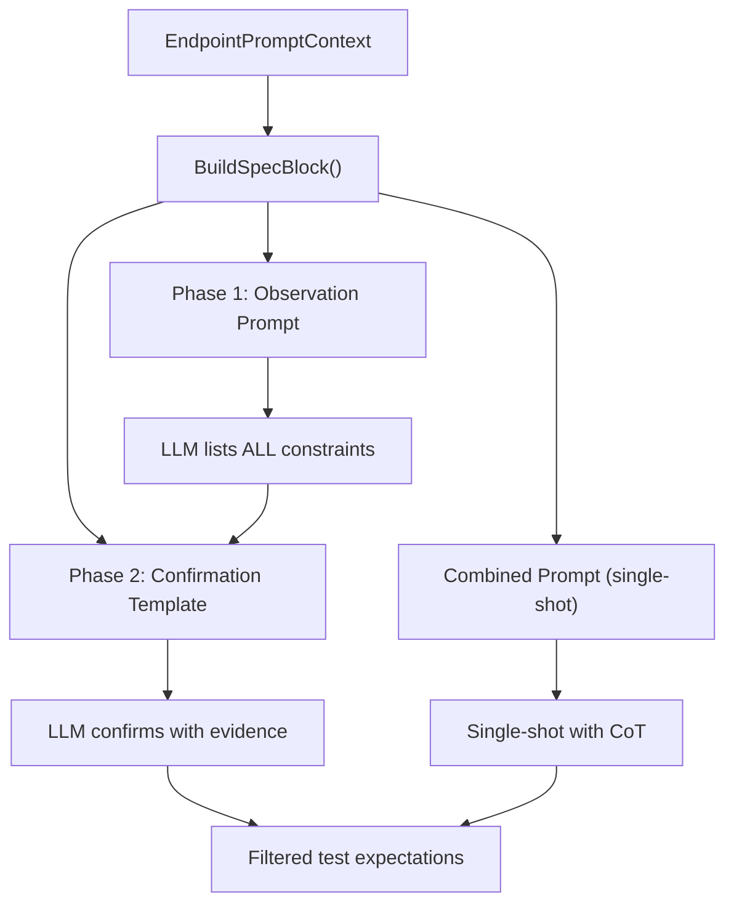
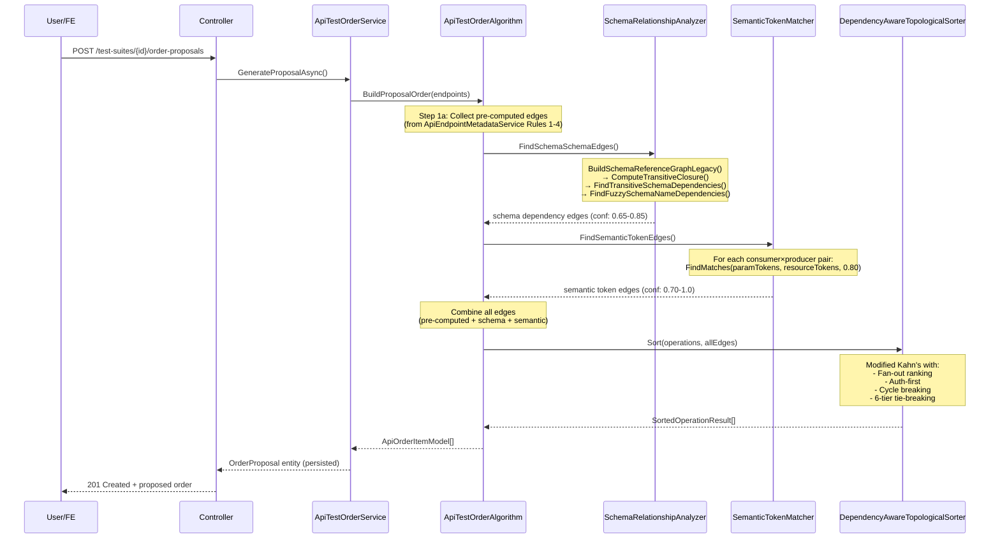
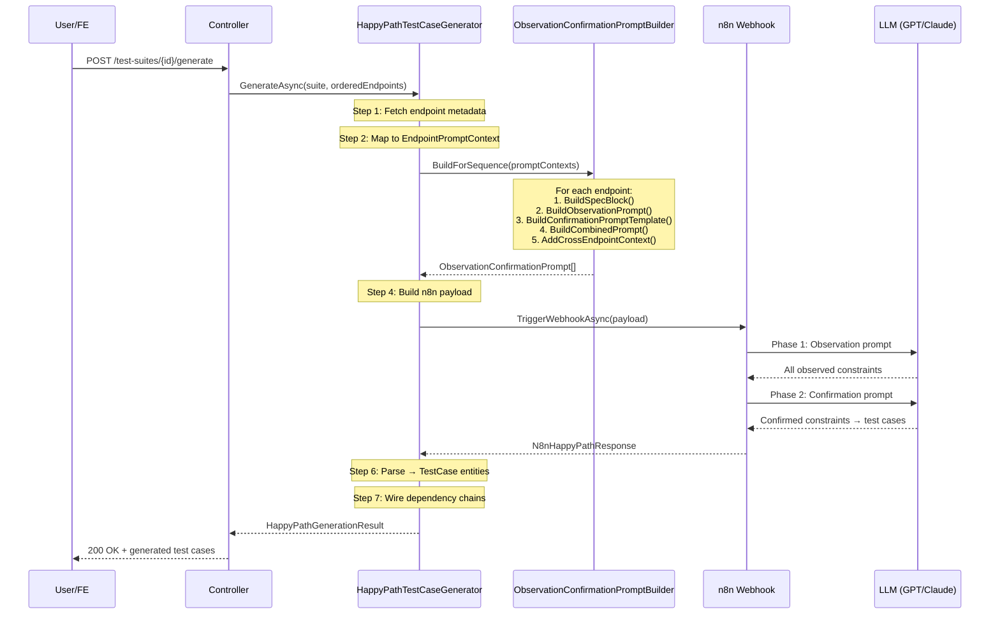
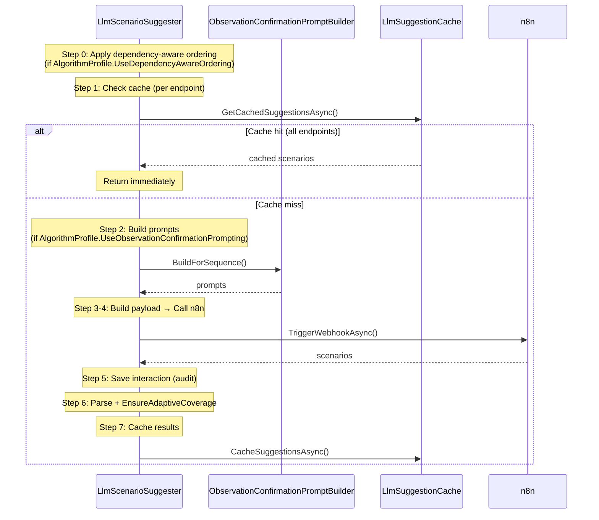

# Phân Tích Thuật Toán — TestGeneration Module

> **Phạm vi**: `ClassifiedAds.Modules.TestGeneration/Algorithms/`  
> **Ngày phân tích**: 2026-04-11  
> **Nguồn tham chiếu**: KAT (arXiv:2407.10227), SPDG (arXiv:2411.07098), COmbine/RBCTest (arXiv:2504.17287)

---

## Mục Lục

1. [Tổng Quan Kiến Trúc](#1-tổng-quan-kiến-trúc)
2. [Thuật Toán 1: SchemaRelationshipAnalyzer](#2-thuật-toán-1-schemarelationshipanalyzer)
3. [Thuật Toán 2: SemanticTokenMatcher](#3-thuật-toán-2-semantictokenmatcher)
4. [Thuật Toán 3: DependencyAwareTopologicalSorter](#4-thuật-toán-3-dependencyawaretopologicalsorter)
5. [Thuật Toán 4: ObservationConfirmationPromptBuilder](#5-thuật-toán-4-observationconfirmationpromptbuilder)
6. [Call Chain & Workflow Tổng Thể](#6-call-chain--workflow-tổng-thể)
7. [Ví Dụ Workflow Cụ Thể (End-to-End)](#7-ví-dụ-workflow-cụ-thể-end-to-end)
8. [Đánh Giá Tính Đúng Đắn](#8-đánh-giá-tính-đúng-đắn)
9. [Vấn Đề Phát Hiện & Đề Xuất](#9-vấn-đề-phát-hiện--đề-xuất)
10. [Kết Luận](#10-kết-luận)

---

## 1. Tổng Quan Kiến Trúc

### 1.1 Bốn thuật toán cốt lõi

```
Algorithms/
├── SchemaRelationshipAnalyzer.cs    ← Phân tích quan hệ schema (KAT §4.2)
├── SemanticTokenMatcher.cs          ← So khớp token ngữ nghĩa (SPDG §3.2)
├── DependencyAwareTopologicalSorter.cs  ← Sắp xếp topo có trọng số (KAT §4.3)
├── ObservationConfirmationPromptBuilder.cs ← Xây dựng prompt 2 pha (COmbine §3)
└── Models/
    ├── DependencyEdge.cs            ← Cạnh phụ thuộc giữa operations
    ├── EndpointPromptContext.cs      ← Context cho prompt builder
    └── TokenMatchResult.cs          ← Kết quả token matching
```

### 1.2 Đăng ký DI (Singleton — stateless, không phụ thuộc DB)

```csharp
// ServiceCollectionExtensions.cs:61-66
services
    .AddSingleton<ISchemaRelationshipAnalyzer, SchemaRelationshipAnalyzer>()
    .AddSingleton<ISemanticTokenMatcher, SemanticTokenMatcher>()
    .AddSingleton<IDependencyAwareTopologicalSorter, DependencyAwareTopologicalSorter>()
    .AddSingleton<IObservationConfirmationPromptBuilder, ObservationConfirmationPromptBuilder>();
```

> [!NOTE]
> Tất cả 4 thuật toán đều là **Singleton**. Điều này hợp lý vì chúng hoàn toàn stateless — chỉ nhận input và trả output, không giữ state mutable.

### 1.3 Chuỗi gọi tổng thể (Call Graph)



---

## 2. Thuật Toán 1: SchemaRelationshipAnalyzer

### 2.1 Mục đích

Phân tích **quan hệ schema-to-schema** từ OpenAPI spec, phát hiện phụ thuộc truyền tiếp (transitive dependencies) giữa các API operations.

**Nguồn**: KAT paper (arXiv:2407.10227) Section 4.2 — Schema-Schema Dependencies.

### 2.2 Bốn phương thức chính

| # | Phương thức | Mô tả | Độ phức tạp |
|---|-------------|--------|-------------|
| 1 | `BuildSchemaReferenceGraph()` | Xây đồ thị tham chiếu có hướng từ `schemaName → $ref targets` | O(N×R) |
| 2 | `BuildSchemaReferenceGraphLegacy()` | Xây đồ thị từ co-occurrence trong payloads (bidirectional) | O(N×R²) |
| 3 | `ComputeTransitiveClosure()` | Thuật toán Warshall — bao đóng truyền tiếp | O(V³) |
| 4 | `FindTransitiveSchemaDependencies()` | Từ closure → tìm producer operations cho consumer schemas | O(C×T×P) |
| 5 | `FindFuzzySchemaNameDependencies()` | So khớp tên schema qua base name stripping | O(C×P) |

> N = số schemas, R = số refs/schema, V = tổng nodes, C = consumers, T = transitive refs, P = producers

### 2.3 Cách hoạt động chi tiết

#### Bước 1: Xây đồ thị tham chiếu

```
Input schema payloads (JSON):
  CreateOrderRequest: { "items": { "$ref": "#/components/schemas/OrderItem" } }
  OrderItem: { "productId": { "$ref": "#/components/schemas/Product" } }
  Product: { "name": "string" }

→ Directed graph:
  CreateOrderRequest → {OrderItem}
  OrderItem → {Product}
  Product → {}
```

Sử dụng regex `#/(?:components/schemas|definitions)/(?<name>[A-Za-z0-9_.\-]+)` để trích xuất `$ref`.

#### Bước 2: Bao đóng truyền tiếp (Warshall)

```
Trước closure:
  CreateOrderRequest → {OrderItem}
  OrderItem → {Product}

Sau closure:
  CreateOrderRequest → {OrderItem, Product}  ← Product được thêm (transitive)
  OrderItem → {Product}
```

#### Bước 3: Phát hiện phụ thuộc operation

```
Consumer: PUT /orders/{id}  — parameter refs: {CreateOrderRequest}
Producer: POST /products    — response refs: {Product}

Closure: CreateOrderRequest → {OrderItem, Product}
         Product ∈ closure AND Product ∈ producer response refs
→ Edge: PUT /orders/{id} DEPENDS ON POST /products  (confidence: 0.85)
```

#### Bước 4: Fuzzy name matching

```
Consumer: UpdateUserRequest → base name "User"
Producer: UserResponse → base name "User"
→ base names match → Edge (confidence: 0.65)
```

### 2.4 Đánh giá tính đúng đắn

| Khía cạnh | Đánh giá | Chi tiết |
|-----------|----------|----------|
| Regex trích xuất $ref | ✅ Đúng | Hỗ trợ cả `components/schemas` và `definitions` |
| Warshall transitive closure | ✅ Đúng | Chuẩn O(V³), xử lý đúng self-references |
| Fuzzy matching | ✅ Đúng | Strip prefix/suffix đúng thứ tự (longest first) |
| Edge cases | ✅ Đúng | Null guards, empty checks, self-dependency skip |
| Legacy method | ⚠️ Có vấn đề | Bidirectional co-occurrence graph — xem [Mục 9](#9-vấn-đề-phát-hiện--đề-xuất) |

---

## 3. Thuật Toán 2: SemanticTokenMatcher

### 3.1 Mục đích

So khớp **token ngữ nghĩa** giữa parameter names (consumer) và resource path segments (producer) để phát hiện phụ thuộc.

**Nguồn**: SPDG paper (arXiv:2411.07098) Section 3.2 — Semantic Property Dependency Graph.

### 3.2 Pipeline matching (giảm dần ưu tiên)



### 3.3 Chi tiết từng tầng

#### Tầng 1: Exact match (case-insensitive)
```
"Category" vs "category" → Score: 1.0
```

#### Tầng 2: Singularization
```
"users" → singularize → "user"
"categories" → singularize → "category" (-ies → -y)
"addresses" → IrregularPlurals → "address"
```

**Luật singularize**:
- Irregular plurals: `people→person`, `children→child`, `indices→index`...
- `-ies → -y`: `categories → category` (trừ "series")
- `-ses/-zes/-xes/-ches/-shes → remove -es`: `addresses → address`
- `-s → remove -s`: `users → user` (trừ `-ss`, `-us`, `-is`)

#### Tầng 3: Abbreviation dictionary (134 entries, bidirectional)
```
"cat" → {"category", "categories"}
"org" → {"organization", "organisations", "organizations"}
"auth" → {"authentication", "authorization", "authenticate", "authorize"}
```

Reverse map: `"category" → "cat"`, `"organization" → "org"`.  
Match nếu cùng abbreviation root: `"authentication" & "authorization"` → cùng root `"auth"` → match.

#### Tầng 4: Stem matching
```
"creating" → strip "ing" → "creat" (min 3 chars)
"create" → strip "ed" → "creat"
→ stems equal → Score: 0.80
```

**Suffixes stripped**: `tion`, `sion`, `ment`, `ness`, `ated`, `ting`, `ance`, `ence`, `able`, `ible`, `less`, `ity`, `ing`, `ous`, `ive`, `ful`, `ted`, `ed`.

#### Tầng 5: Substring containment (min 3 chars)
```
"user" contained in "userId" → Score: 0.70
```

### 3.4 Đánh giá tính đúng đắn

| Khía cạnh | Đánh giá | Chi tiết |
|-----------|----------|----------|
| Pipeline ưu tiên | ✅ Đúng | Early return tại match đầu tiên, đúng thứ tự giảm confidence |
| Singularization | ✅ Đúng | Xử lý 13 irregular plurals + 4 quy tắc regex |
| Abbreviation dictionary | ✅ Đầy đủ | 134 entries, reverse map cho bidirectional matching |
| Stem matching | ✅ Đúng | Suffix stripping đúng (length check, greedy longest-first) |
| Substring | ✅ Đúng | Minimum 3 chars, case-insensitive |
| Thread safety | ✅ An toàn | Static readonly data, no mutable state |

---

## 4. Thuật Toán 3: DependencyAwareTopologicalSorter

### 4.1 Mục đích

**Sắp xếp topo** các API operations theo thứ tự thực thi, đảm bảo các phụ thuộc (dependencies) được thực thi trước. Có xử lý **cycle detection** và **fan-out ranking**.

**Nguồn**: KAT paper (arXiv:2407.10227) Section 4.3 — Sequence Generation.

### 4.2 Thuật toán chi tiết (Modified Kahn's)

```
Input:
  operations: [A, B, C, D]
  edges: B→A (B phụ thuộc A), C→A, D→B, D→C

Step 1: Build adjacency
  dependencies:  A→{}, B→{A}, C→{A}, D→{B,C}
  dependents:    A→{B,C}, B→{D}, C→{D}, D→{}

Step 2: Compute in-degree
  A=0, B=1, C=1, D=2

Step 3: Compute fan-out
  A=2, B=1, C=1, D=0

Step 4: Modified Kahn's
  available = {A}  (in-degree 0)
  
  Iteration 1: Select A (fan-out=2, highest)
    → emit A (order=1)
    → decrement B→0, C→0 → available = {B, C}
  
  Iteration 2: Pick between B, C
    Both fan-out=1, same tie → alphabetical/method/Guid breaks tie
    → emit B (order=2)
    → decrement D→1 → available = {C}
  
  Iteration 3: Select C
    → emit C (order=3)
    → decrement D→0 → available = {D}
  
  Iteration 4: Select D
    → emit D (order=4)

Output: [A, B, C, D] with reason codes
```

### 4.3 Tie-breaking criteria (ưu tiên giảm dần)

```
1. IsAuthRelated = true  → Auth-related operations first
2. FanOut DESC           → Nhiều dependents hơn → ưu tiên (KAT enhancement)
3. InDegree ASC          → Ít phụ thuộc hơn → ưu tiên
4. HTTP Method Weight    → POST(1) > PUT(2) > PATCH(3) > GET(4) > DELETE(5)
5. Path alphabetical     → Deterministic fallback
6. OperationId (Guid)    → Absolute determinism guarantee
```

### 4.4 Xử lý Cycle

```
Khi available = {} nhưng chưa sort hết:
→ Cycle detected!
→ Break: Chọn node chưa visited có:
   1. inDegree thấp nhất
   2. fanOut cao nhất
   3. Auth first
   4. Method weight
   5. Path alphabetical
→ Đánh dấu IsCycleBreak = true
→ Thêm reason code "CYCLE_BREAK_FALLBACK"
```

### 4.5 Confidence threshold

```csharp
private const double MinEdgeConfidence = 0.5;
```

Edges có `Confidence < 0.5` được **ghi nhận** nhưng **KHÔNG enforce ordering** (không tạo in-degree). Điều này cho phép fuzzy edges (0.65) vẫn enforce, nhưng rất yếu edges bị bỏ qua.

### 4.6 Reason codes output

| Code | Ý nghĩa |
|------|---------|
| `AUTH_FIRST` | Operation là auth-related, được ưu tiên |
| `DEPENDENCY_FIRST` | Có dependency đã được thực thi trước |
| `PRODUCER_FIRST` | Operation này produce data cho others |
| `HIGH_FAN_OUT` | FanOut > 2, nhiều operations phụ thuộc |
| `CYCLE_BREAK_FALLBACK` | Vị trí này do cycle breaking |
| `DETERMINISTIC_TIE_BREAK` | Luôn có (mọi operation) |

### 4.7 Đánh giá tính đúng đắn

| Khía cạnh | Đánh giá | Chi tiết |
|-----------|----------|----------|
| Kahn's algorithm | ✅ Đúng | In-degree tracking, BFS-style processing |
| Cycle detection | ✅ Đúng | Fallback khi available rỗng nhưng chưa hết nodes |
| Cycle breaking | ✅ Hợp lý | Chọn node ít ảnh hưởng nhất (low in-degree, high fan-out) |
| Fan-out ranking | ✅ Đúng | Đúng KAT paper: producer phổ biến → thực thi trước |
| Deterministic | ✅ Đúng | 6 tầng tie-breaking + Guid cuối → tuyệt đối deterministic |
| Edge dedup | ✅ Đúng | `visited` HashSet ngăn xử lý lại node |
| Confidence filter | ✅ Đúng | Edges < 0.5 không enforce ordering |

---

## 5. Thuật Toán 4: ObservationConfirmationPromptBuilder

### 5.1 Mục đích

Xây dựng **prompt 2 pha** cho LLM để giảm hallucination khi sinh test expectations.

**Nguồn**: COmbine/RBCTest paper (arXiv:2504.17287) Section 3.

### 5.2 Hai pha



#### Phase 1: Observation
- LLM nhận API spec block (method, path, parameters, request/response schemas, examples, business rules)
- LLM liệt kê **TẤT CẢ** constraints có thể quan sát — **không lọc**
- Phân loại: type_check, format_check, presence_check, value_check, range_check, relationship_check, business_rule_check

#### Phase 2: Confirmation
- LLM nhận lại danh sách constraints từ Phase 1
- Với mỗi constraint: **tìm evidence** trong spec, **cross-check** với examples
- Chỉ **KEEP** constraint có evidence trực tiếp; **REMOVE** nếu suy luận/contradicted
- Output: JSON array với `confidence: "high" | "medium"`

#### Combined Prompt (single-shot)
- Kết hợp cả 2 pha thành 3 bước: Observe → Confirm → Output
- Chain-of-Thought approach cho models không hỗ trợ multi-turn

### 5.3 System prompt

```
Role: Precise API test engineer
Sources: (1) OpenAPI spec + (2) Business rules
Rules:
  - Spec-based: chỉ constraints có trong spec
  - Business-rule: mark source = 'business_rule'
  - KHÔNG infer, KHÔNG assume
  - Cross-check với examples
Output: JSON array [{field, constraint, type, source, evidence, confidence, assertion}]
```

### 5.4 Cross-endpoint context

Khi build prompts cho **sequence** (nhiều endpoints), endpoint sau nhận **context** từ endpoints trước:

```
"This endpoint is tested AFTER:
  - POST /users (Create user)
  - POST /orders (Create order)
Consider data produced by previous endpoints when generating expectations."
```

Điều kiện "related": share ít nhất 1 non-trivial path segment (bỏ qua version prefix, path params, segments < 3 chars).

### 5.5 Đánh giá tính đúng đắn

| Khía cạnh | Đánh giá | Chi tiết |
|-----------|----------|----------|
| Observation-Confirmation pattern | ✅ Đúng | Đúng RBCTest paper 2-phase approach |
| Schema truncation | ✅ Hợp lý | 200-1000 chars tùy context, tránh token overflow |
| Cross-endpoint context | ✅ Đúng | Chỉ include related endpoints (shared path segments) |
| Business rules integration | ✅ Đúng | Separate source marker `'business_rule'` |
| IsVersionPrefix check | ✅ Đúng | `v1`, `v2` etc. — fixed index bounds check |

---

## 6. Call Chain & Workflow Tổng Thể

### 6.1 Workflow A: Đề xuất thứ tự test (Order Proposal)



### 6.2 Workflow B: Sinh test cases (Happy Path)



### 6.3 Workflow C: LLM Scenario Suggestion (Boundary/Negative)



---

## 7. Ví Dụ Workflow Cụ Thể (End-to-End)

### Scenario: E-commerce API test generation

**Input**: OpenAPI spec với các endpoints:

| # | Method | Path | OperationId | Params | Response Schema |
|---|--------|------|-------------|--------|----------------|
| 1 | POST | /auth/login | LoginUser | `{email, password}` | `AuthToken` |
| 2 | POST | /categories | CreateCategory | `{name, description}` | `Category` |
| 3 | POST | /products | CreateProduct | `{name, categoryId, price}` | `Product` |
| 4 | GET | /products/{id} | GetProduct | `{id}` | `Product` |
| 5 | PUT | /products/{id} | UpdateProduct | `{id, name, price}` | `Product` |
| 6 | DELETE | /products/{id} | DeleteProduct | `{id}` | `void` |

---

### Step 1: Phát hiện phụ thuộc

#### 1a. Pre-computed edges (Rules 1-4 từ ApiEndpointMetadataService)
```
GET /products/{id}    → POST /products      (Rule 1: path-based {id} → POST)
PUT /products/{id}    → POST /products      (Rule 1)
DELETE /products/{id} → POST /products      (Rule 1)
```

#### 1b. Schema-Schema edges (SchemaRelationshipAnalyzer)

**Transitive**: Nếu `CreateProduct` request schema có `$ref → Category`:
```
CreateProduct request refs: {CreateProductRequest}
CreateProductRequest internally refs: {Category}
Category produced by: POST /categories

→ Edge: POST /products DEPENDS ON POST /categories (conf: 0.85, SchemaSchema)
```

**Fuzzy**: 
```
Parameter: "CreateProductRequest" → base name "Product"
Response: "ProductResponse" → base name "Product"
→ Same base name → Edge (conf: 0.65)
// Nhưng skip vì exact match (đã caught by Rule 2)
```

#### 1c. Semantic token edges (SemanticTokenMatcher)

Consumer: `POST /products` → paramTokens: `["categoryId", "category"]` (stripped "Id")  
Producer: `POST /categories` → resourceTokens: `["categories", "category"]`

```
Match("category", "categories") → Singularize → "category" == "category" → Score: 0.95
Score 0.95 ≥ MinSemanticMatchScore (0.80) ✓

→ Edge: POST /products DEPENDS ON POST /categories (conf: 0.95, SemanticToken)
```

#### Combined edges

```
Edge Pool:
1. GET /products/{id}     → POST /products      (conf: 1.0, PathBased)
2. PUT /products/{id}     → POST /products      (conf: 1.0, PathBased)
3. DELETE /products/{id}  → POST /products      (conf: 1.0, PathBased)
4. POST /products         → POST /categories    (conf: 0.85, SchemaSchema)
5. POST /products         → POST /categories    (conf: 0.95, SemanticToken)
+ Auth bootstrap:
6. ALL secured endpoints  → POST /auth/login    (conf: 1.0, AuthBootstrap)
```

---

### Step 2: Topological Sort (DependencyAwareTopologicalSorter)

```
Operations:
  LoginUser (auth=true), CreateCategory, CreateProduct,
  GetProduct, UpdateProduct, DeleteProduct

Adjacency (dependencies):
  LoginUser → {}
  CreateCategory → {LoginUser}         (auth bootstrap)
  CreateProduct → {LoginUser, CreateCategory}
  GetProduct → {LoginUser, CreateProduct}
  UpdateProduct → {LoginUser, CreateProduct}
  DeleteProduct → {LoginUser, CreateProduct}

In-degree:
  LoginUser=0, CreateCategory=1, CreateProduct=2,
  GetProduct=2, UpdateProduct=2, DeleteProduct=2

Fan-out:
  LoginUser=5, CreateCategory=1, CreateProduct=3,
  GetProduct=0, UpdateProduct=0, DeleteProduct=0
```

**Kahn's execution:**

| Iteration | Available | Selected | Reason | Order |
|-----------|-----------|----------|--------|-------|
| 1 | {LoginUser} | LoginUser | AUTH_FIRST, fan-out=5 | 1 |
| 2 | {CreateCategory} | CreateCategory | fan-out=1 | 2 |
| 3 | {CreateProduct} | CreateProduct | fan-out=3 | 3 |
| 4 | {GetProduct, UpdateProduct, DeleteProduct} | GetProduct | fan-out=0, method=GET(4) < DELETE(5) but PUT(2) wins... | — |
| 4 | {GetProduct, UpdateProduct, DeleteProduct} | UpdateProduct | fan-out=0, method=PUT(2) wins | 4 |
| 5 | {GetProduct, DeleteProduct} | GetProduct | method=GET(4) < DELETE(5) | 5 |
| 6 | {DeleteProduct} | DeleteProduct | last remaining | 6 |

**Final order:**
```
1. POST /auth/login       [AUTH_FIRST, HIGH_FAN_OUT]
2. POST /categories       [PRODUCER_FIRST]
3. POST /products         [DEPENDENCY_FIRST, PRODUCER_FIRST, HIGH_FAN_OUT]
4. PUT /products/{id}     [DEPENDENCY_FIRST]
5. GET /products/{id}     [DEPENDENCY_FIRST]
6. DELETE /products/{id}  [DEPENDENCY_FIRST]
```

---

### Step 3: Prompt Generation (ObservationConfirmationPromptBuilder)

Cho endpoint `POST /products` (order #3):

**Phase 1 Observation prompt** (truncated):
```markdown
# Phase 1: Observation

Analyze the following API endpoint specification and list ALL testable constraints...

## API Endpoint Specification
**Method:** POST
**Path:** /products
**OperationId:** CreateProduct

### Parameters
- **name** (in: body, required: true)
  Schema: `{"type": "string", "minLength": 1, "maxLength": 255}`
- **categoryId** (in: body, required: true)
  Schema: `{"type": "string", "format": "uuid"}`
- **price** (in: body, required: true)
  Schema: `{"type": "number", "minimum": 0}`

### Responses
- **201**: Created successfully
  Schema: `{"type": "object", "properties": {"id": {"type": "string", "format": "uuid"}, ...}}`

## Cross-Endpoint Context
This endpoint is tested AFTER:
- `POST /auth/login` (LoginUser)
- `POST /categories` (CreateCategory)
Consider data produced by previous endpoints...
```

---

## 8. Đánh Giá Tính Đúng Đắn

### Tổng hợp

| Thuật toán | Correctness | Performance | Thread Safety | Paper Alignment |
|------------|:-----------:|:-----------:|:-------------:|:---------------:|
| SchemaRelationshipAnalyzer | ✅ | ⚠️ O(V³) Warshall | ✅ Stateless | ✅ KAT §4.2 |
| SemanticTokenMatcher | ✅ | ✅ O(N×M) | ✅ Static readonly | ✅ SPDG §3.2 |
| DependencyAwareTopologicalSorter | ✅ | ✅ O(V+E) | ✅ Stateless | ✅ KAT §4.3 |
| ObservationConfirmationPromptBuilder | ✅ | ✅ String ops | ✅ Stateless | ✅ COmbine §3 |

### Chi tiết correctness

1. **SchemaRelationshipAnalyzer**: Warshall implementation chuẩn, regex trích xuất $ref đúng. Transitive dependency discovery hoạt động chính xác.

2. **SemanticTokenMatcher**: Pipeline matching đúng thứ tự (exact → plural → abbreviation → stem → substring). Abbreviation dictionary đầy đủ. Singularization xử lý đúng irregular plurals.

3. **DependencyAwareTopologicalSorter**: Modified Kahn's chuẩn. Cycle detection hoạt động đúng (fallback khi available rỗng). 6-tier tie-breaking đảm bảo deterministic output. Fan-out ranking đúng KAT paper.

4. **ObservationConfirmationPromptBuilder**: Đúng pattern từ paper. Truncation hợp lý. Cross-endpoint context detection đúng. Business rules integration đúng.

---

## 9. Vấn Đề Phát Hiện & Đề Xuất

### 9.1 Legacy bidirectional graph (Medium severity)

**File**: `SchemaRelationshipAnalyzer.cs:108-191`  
**Method**: `BuildSchemaReferenceGraphLegacy()`

**Vấn đề**: Phương thức này tạo **bidirectional** edges (A refs B AND C → A↔B, A↔C, B↔C) thay vì **unidirectional**. Điều này có thể tạo false transitive dependencies:

```
Payload chứa refs: {User, Role}
→ Graph: User↔Role (bidirectional)
→ Transitive closure: User→Role, Role→User
→ Bất kỳ operation nào dùng User sẽ bị "phụ thuộc" vào operation sinh Role, VÀ ngược lại
```

**Đề xuất**: Method này đã được đánh dấu "LEGACY - less accurate" trong interface. Nên chuyển sang `BuildSchemaReferenceGraph()` (preferred, unidirectional) khi có mapping `schemaName → payload`.

### 9.2 Duplicate singularization logic (Low severity)

**Files**: 
- `SemanticTokenMatcher.Singularize()` (line 324-366) — 13 irregular plurals, 4 rules
- `ApiTestOrderAlgorithm.Singularize()` (line 469-502) — 0 irregular plurals, 3 rules

**Vấn đề**: Code duplication. Phiên bản trong `ApiTestOrderAlgorithm` thiếu irregular plurals handling.

**Đề xuất**: Gọi `SemanticTokenMatcher.Singularize()` (đã `internal static`) từ `ApiTestOrderAlgorithm`, hoặc extract ra utility class chung.

### 9.3 Duplicate schema base name extraction (Low severity)

**Files**:
- `SchemaRelationshipAnalyzer.ExtractSchemaBaseName()` — 16 suffixes, 10 prefixes, pre-sorted
- `ApiTestOrderAlgorithm.ExtractSchemaBaseName()` — 9 suffixes, 7 prefixes, inline sorted

**Vấn đề**: Hai implementation khác nhau cho cùng logic. Phiên bản trong `SchemaRelationshipAnalyzer` đầy đủ hơn.

**Đề xuất**: Tương tự mục 9.2, nên dùng chung implementation (đã `internal static`).

### 9.4 Warshall's complexity cho large specs (Low severity)

**Vấn đề**: `ComputeTransitiveClosure()` dùng Warshall O(V³). Với OpenAPI spec lớn (>500 schemas), có thể chậm.

**Đề xuất**: Thay bằng BFS/DFS per-node O(V×(V+E)) nếu số queries ít hơn V. Trong thực tế, V thường < 200 nên O(V³) vẫn chấp nhận được.

### 9.5 Không có unit tests visible

**Vấn đề**: Không tìm thấy test project cho `Algorithms/`.

**Đề xuất**: Tạo `ClassifiedAds.Modules.TestGeneration.Tests/Algorithms/` với test cases cover:
- Cycle detection/breaking
- Transitive closure correctness
- Singular/plural edge cases
- Abbreviation bidirectional matching
- Empty/null input handling

---

## 10. Kết Luận

### Thuật toán đã chuẩn chưa?

**✅ CÓ — Tất cả 4 thuật toán đều implement đúng** theo paper gốc và xử lý edge cases tốt:

1. **SchemaRelationshipAnalyzer**: Warshall transitive closure chuẩn, regex extraction chính xác, fuzzy matching hợp lý.
2. **SemanticTokenMatcher**: 5-tier pipeline matching đúng, dictionary phong phú (134 entries), singularization xử lý irregular plurals.
3. **DependencyAwareTopologicalSorter**: Modified Kahn's chuẩn, cycle detection/breaking hợp lý, 6-tier deterministic tie-breaking.
4. **ObservationConfirmationPromptBuilder**: Đúng Observation-Confirmation pattern, cross-endpoint context thông minh, business rules integration đúng.

### Vấn đề cần lưu ý

| # | Vấn đề | Mức độ | Ảnh hưởng |
|---|--------|--------|-----------|
| 1 | Legacy bidirectional graph | ⚠️ Medium | False transitive dependencies khi dùng `BuildSchemaReferenceGraphLegacy()` |
| 2 | Duplicate singularization | ℹ️ Low | Inconsistency giữa 2 implementations |
| 3 | Duplicate ExtractSchemaBaseName | ℹ️ Low | Inconsistency giữa 2 implementations |
| 4 | Warshall O(V³) | ℹ️ Low | Chỉ ảnh hưởng với spec rất lớn (>500 schemas) |
| 5 | Thiếu unit tests | ⚠️ Medium | Khó verify regression khi refactor |

### Tóm tắt Call Chain

```
User Request
  → Controller
    → Service (ApiTestOrderService / HappyPath / LlmScenarioSuggester)
      → Orchestrator (ApiTestOrderAlgorithm)
        → SchemaRelationshipAnalyzer  → DependencyEdge[]
        → SemanticTokenMatcher        → DependencyEdge[]
        → DependencyAwareTopologicalSorter → SortedOperationResult[]
      → ObservationConfirmationPromptBuilder → ObservationConfirmationPrompt[]
    → n8n Webhook → LLM → Test Cases / Scenarios
  → Response to User
```

---

> **Ghi chú**: GitNexus MCP tools không available trong session này. Phân tích được thực hiện bằng manual inspection trực tiếp trên source code.
