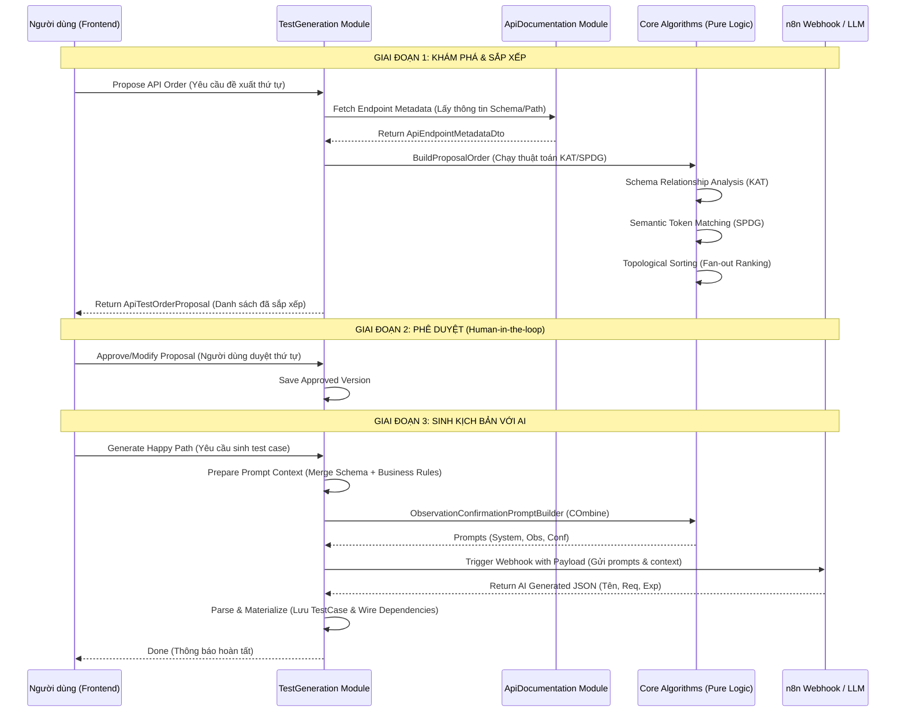

# Báo cáo Quy trình Kiểm thử Tự động từ A đến Z (End-to-End Workflow)
## Module: ClassifiedAds.Modules.TestGeneration

Báo cáo này mô tả quy trình khép kín để tạo ra một bộ test suite hoàn chỉnh, từ việc đọc hiểu tài liệu API đến khi các kịch bản test sẵn sàng thực thi.

---

## 1. Sơ đồ Quy trình Tổng thể (Sequence Diagram)

---

## 2. Chi tiết 5 Bước "Sương Sống"

### Bước 1: Thu thập metadata (Discovery)
*   **Thành phần:** `IApiEndpointMetadataService`.
*   **Hoạt động:** Hệ thống gọi sang module `ApiDocumentation` để hành lấy dữ liệu thô từ file OpenAPI (.yaml/.json). Các thông tin lấy về bao gồm: JSON Schema của Request/Response, Path, HttpMethod, và các tham số URL.

### Bước 2: Phân tích Phụ thuộc & Sắp xếp (Ordering)
*   **Thành phần:** `ApiTestOrderAlgorithm` kết hợp `KAT` & `SPDG`.
*   **Hoạt động:** 
    *   Sử dụng **KAT paper** để phân tích quan hệ giữa các Schema (Ví dụ: Response của API A là input của API B).
    *   Sử dụng **SPDG paper** để khớp ngữ nghĩa từ vựng (Ví dụ: `userId` trong URL khớp với tài nguyên `users`).
    *   Cuối cùng, dùng **Topological Sorter** để ra một danh sách API có thứ tự logic.

### Bước 3: Phê duyệt (Approval)
*   **Thành phần:** `ApproveApiTestOrderCommand`.
*   **Hoạt động:** Đây là điểm dừng giúp con người kiểm soát hệ thống. Người dùng có thể kéo thả để thay đổi thứ tự nếu thuật toán chưa hoàn hoàn hảo. Chỉ sau khi được duyệt, quy trình sinh test case mới được phép bắt đầu.

### Bước 4: Chế tác Prompt & Gọi AI (AI Generation)
*   **Thành phần:** `HappyPathTestCaseGenerator` & `ObservationConfirmationPromptBuilder`.
*   **Hoạt động:** 
    *   Hệ thống áp dụng kỹ thuật **COmbine/RBCTest** để tạo ra các Prompt cực kỳ chi tiết. 
    *   AI sẽ phải trải qua bươc tư duy: Quan sát các ràng buộc và xác nhận lại bằng chứng trong spec. Điều này giúp loại bỏ các kịch bản test sai lệch.

### Bước 5: Hiện thực hóa & Liên kết (Materialization)
*   **Thành phần:** `HappyPathTestCaseGenerator` & `ITestCaseRequestBuilder`.
*   **Hoạt động:** 
    *   Phản hồi JSON từ AI được ánh xạ (Map) vào các thực thể database: `TestCase`, `TestCaseRequest`, `TestCaseExpectation`.
    *   Hàm `WireDependencyChains` sẽ tự động tạo các bản ghi `TestCaseDependency` để kết nối dữ liệu giữa các bước chạy.

---

## 3. Bản đồ chuyển đổi Dữ liệu (A -> Z Transformation)

1.  **[A]** `OpenAPI File` (Text)
2.  **[B]** `ApiEndpointMetadataDto` (Data Structure)
3.  **[C]** `DependencyEdge` (Graph Model)
4.  **[D]** `ApiOrderItemModel` (Ordered JSON)
5.  **[E]** `EndpointPromptContext` (Prompt Context)
6.  **[F]** `N8nHappyPathResponse` (AI Output)
7.  **[Z]** `TestCase` Entity (Database Record)

---

## 4. Danh sách các File Quan trọng (A-Z Map)

| Tính năng | Vị trí File |
| :--- | :--- |
| **Logic Phân tích** | `ClassifiedAds.Modules.TestGeneration\Algorithms\` |
| **Logic Điều phối** | `ClassifiedAds.Modules.TestGeneration\Services\` |
| **Lệnh thực thi** | `ClassifiedAds.Modules.TestGeneration\Commands\` |
| **Tích hợp External** | `ClassifiedAds.Modules.TestGeneration\Services\N8nIntegrationService.cs` |

---

> [!IMPORTANT]
> **Kết luận:** Quy trình A-Z này kết hợp sức mạnh của **Đồ thị (Graph)** để xử lý cấu trúc và **LLM** để xử lý ngữ nghĩa. Việc có con người ở giữa (Giai đoạn Phê duyệt) đảm bảo hệ thống luôn có độ tin cậy cao nhất.
